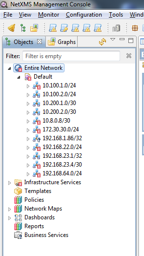
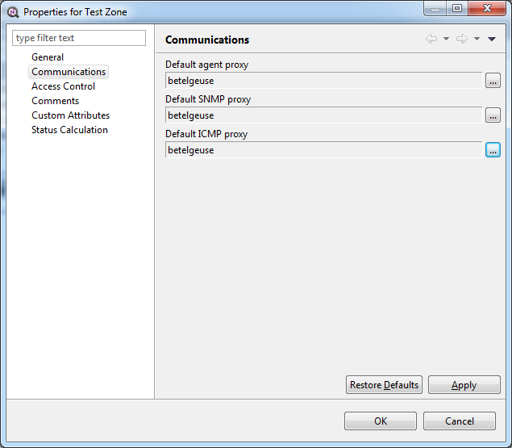
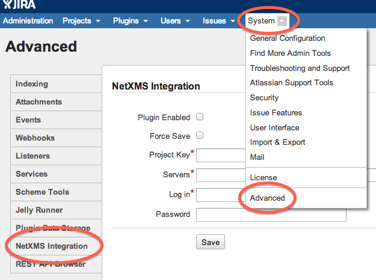
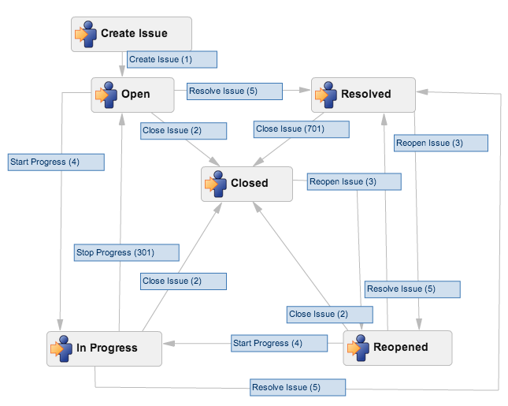

.. _advanced:

###############
Advanced topics
###############

.. _zones:

Zones
=====

As NetXMS server keeps track of an IP topology, it is important to maintain the
configuration in which IP addresses do not overlap and that two IP addresses
from same subnet are really within one subnet. Sometimes, however, it is needed
to monitor multiple sites with overlapping IP address ranges. To correctly
handle such situation, zoning must be used. Zone in NetXMS is a group of IP
subnets which form non-overlapping IP address space. There is always zone 0
which contains subnets directly reachable by management server. For all other
zones server assumes that subnets within that zones are not reachable directly,
and proxy must be used.

Enable Zoning
-------------

Zoning support is off by default. To turn it on you must set server's
configuration variable ``EnableZoning`` to ``1`` and restart server. After
restart, server will create default zone with ID ``0`` and put all existing
subnets into that zone. Subnet tree will looks like this:

Setting communication options for zones
---------------------------------------

Server have to know proxy nodes to be able to communicate with nodes in remote
zones. Default proxy settings for all nodes in the zone can be set on
Communications page in zone object properties:

On this page you can set default proxy node for NetXMS agents, SNMP, and ICMP.
Note that proxy node must be in default zone and must have primary IP reachable
by NetXMS server.

Moving nodes between zones
--------------------------

To move existing node to another zone, select :guilabel:`Change zone` from
nodes context menu, then select target zone in zone selection dialog that will
appear. After move to another zone, server will immediately do configuration
poll on the node.

.. _helpdesk-integration:

Integration with external HelpDesk
----------------------------------

NetXMS provides possibility to create issues in external helpdesk system 
directly from NetXMS management console, based on pending alarms. In this 
situation NetXMS and external helpdesk system will have synchronized 
issue workflow. 

For now integration is done only with JIRA. 

JIRA Module
-----------

This module provide integration between NetXMS and JIRA. 

Required NetXMS configuration
~~~~~~~~~~~~~~~~~~~~~~~~~~~~~
For NetXMS is required to configure server parameters(they should be created by user) 
and restart the server. 

.. list-table::
   :header-rows: 1
   :widths: 25 75

   * - Parameter name
     - Description
   * - HelpDeskLink
     - For JIRA integration should be set to “jira.hdlink” (without quotes)
   * - JiraIssueType
     - Name of the JIRA issue type, which will be used by NetXMS. 
       Sample value: “Task” (without quotes)
   * - JiraLogin
     - Login of the JIRA user(This user should exist in JIRA system with with 
       permissions to create issues in project(JiraProjectCode) and comment 
       on own issues)
   * - JiraPassword
     - Password of the JIRA user
   * - JiraProjectCode
     - Project Key in JIRA. (Project should exist)
   * - JiraServerURL
     - URL of JIRA installation. Example: “http://localhost:8080/jira”. Please note,
       that trailing slash (“/”) should be removed!
       
If all configuration was successfully done after rester in console should be present:

::

  [25-Apr-2014 14:16:07.894] [INFO ] Helpdesk link module JIRA (version 1.2.14) loaded successfully

Required JIRA configuration
~~~~~~~~~~~~~~~~~~~~~~~~~~~
NetXMS JIRA plugin should be deployed to JIRA and configured. REST API should 
be enabled in JIRA configuration (enabled in default configuration).

To access configuration page for the plugin, go to “System → Advanced” and select
“NetXMS Integration” tab:

Possible configuration options:

  1. “Plugin Enabled” — global on/off switch, plugin completely cease any activity 
     when turned off (default).
  2. “Force Save” — by default, plugin will verify configuration before saving
     (connectivity to all servers, credentials). This checkbox allows to bypass 
     this step completely and save configuration even if one of more NetXMS 
     servers are rejecting provided credentials or do not respond at all)
  3. “Project Key” — Key of the project, where issues from NetXMS will be created. 
     This key will be also used in workflow operations — plugin will process 
     events related to this project:

      .. figure:: _images/jira_project_list.png

  4. “Servers” — addresses of up to a 3 NetXMS servers, can be either 
     IP address or hostname.
  5. “Log In” — user login in NetXMS (User should exist in NetXMS with Read, View 
     Alarms, Acknowledge Alarms, Terminate Alarms to all nodes)
  6. “Password” — user password in NetXMS 
  
Plugin will verify configuration and provide feedback. If one or more
NetXMS servers are not responding (e.g. they are not configured yet), you can
select “Force Save” to overrule verification process and save configuration.

Workflow configuration
~~~~~~~~~~~~~~~~~~~~~~
Since JIRA workflow can be much more sophisticated than alarm states in NetXMS, JIRA
Administrator should decide which workflow transition should change NetXMS alarm
state.

NetXMS supports four alarm states:

  1. Outstanding — initial state, can’t be set from JIRA side
  2. Acknowledged — operator is aware of the problem and it’s in progress
     (“Acknowledge” action)
  3. Resolved — problem is resolved but alarm stays in the list until verified and
     terminated by supervisor (“Resolve” action)
  4. Terminated — problem is resolved and verified, alarm is removed from the list
     (“Terminate” action)

Sample workflow (JIRA default workflow):

Sample mapping:

.. list-table::
   :header-rows: 1
   :widths: 30 30
   
   * - Transition
     - NetXMS post-function action
   * - Start Progress
     - Acknowledge
   * - Resolve Issue
     - Resolve
   * - Close Issue
     - Terminate
   * - `All other transitions`
     - `Ignored`

Configure workflow in JIRA:

  1. Create new Workflow Schema if required
  2. Copy existing or create new Workflow
  3. Assign Workflow to the project, where NetXMS will create issues
  4. Modify transitions to call plugin’s post-function and change related alarm in
     NetXMS
     
    a. Click on a “cog” icon on a transition and select “View Post Functions”:

    .. figure:: _images/jira_post_function.png

    b. Click on “Add a new post function to the unconditional result of the
       transition”:

    .. figure:: _images/jira_post_function2.png

    c. Select “NetXMS Modify Alarm” and click “Add”:
    
    .. figure:: _images/jira_post_function3.png   

    d. Select desired alarm action (Acknowledge / Resolve / Terminate) and click
       “Add”:
       
    .. figure:: _images/jira_post_function4.png 
    
    e. Repeat for all required transitions
    
  5. Publish workflow changes
  

Ticket creation
~~~~~~~~~~~~~~~
Tickets are created from from alarms manually. To create ticket user should have
"Create helpdesk tickets" access for required objects.

Steps to create ticket:
  1. Right click on alarm in NetXMS and select “Create ticket in helpdesk system”:
  
     .. figure:: _images/jira_create_ticket.png 
     
  2. In a moment, issue will be created and Helpdesk ID will be show in corresponding
     column:
     
     .. figure:: _images/jira_helpdesk_ID.png
     
  3. Right click on the alarm and select “Show helpdesk ticket in web browser” to
     navigate to the issue in JIRA:
     
     .. figure:: _images/jira_ticket_show.png
    

Hooks (Pollers hooks)
=====================

NetXMS has 5 different poller types, sometimes it is required by user 
to add some additional functionality while this polls. For this purpose 
were created hooks. Hook is manually created script in 
:guilabel:`Script Library` that is executed at the very end of the poll.
More about poll types and purposes can be found :ref:`there <concepts_polling>` 
and about script creation :ref:`there <scripting>`. 

To be recognized as a hook script should have special name. It should be named 
according to convention: Hook\:\:\ `Pool_name`. 

Example: Hook\:\:ConfigurationPoll

Full list of hooks:  

.. list-table::
   :header-rows: 1
   :widths: 30 70 30

   * - Hook name
     - Description 
     - Parameters
   * - Hook\:\:StatusPoll
     - Hook that is executed at the end of status poll
     - $node
   * - Hook\:\:ConfigurationPoll
     - Hook that is executed at the end of configuration poll
     - $node
   * - Hook\:\:InstancePoll
     - Hook that is executed after instance discovery poll.
     - $node
   * - Hook\:\:TopologyPoll
     - Hook that is executed at the ens of topology poll
     - $node
   * - Hook\:\:AcceptNewNode
     - Hook that is executed on a new node add. This script should return 1 if 
       node should be added. In case if script returns nothing or something other 
       than 1 - node will not be added. 
     - $ipAddr, $ipNetMask, $macAddr, $zoneId

Usually hooks are used for automatic actions that need to be done on node. 
For example automatic remove change of expected state of interface depending 
on some external parameters. 

Troubleshooting
===============

.. _password-reset:

Reset password for user "admin"
-------------------------------

.. warning::

   Server ("netxmsd") should be stopped while performing this operation!

Passwords in NetXMS are stored in hashed, not-reversible way, so there are no way to recover it, but it can be reseted.

.. versionadded:: 2.1-M0

Use following command to reset password and unlock account:

.. code-block:: sh

   nxdbmgr reset-system-account
   
This operation will unlock "system" user and change it's password to default ("netxms").

.. versionadded:: 1.2.9

.. deprecated:: 2.1-M0

Use following command to reset password and unlock account:

.. code-block:: sh

   nxdbmgr resetadmin
   
Password for user "admin" will be reset to default password: "netxms".

Enable Crash Dump Generation
----------------------------

When running on Windows server is capable of creating crash dumps. To enable crash dump generation, add the following options to netxmsd.conf file:

.. code-block:: ini

   CreateCrashDumps = yes
   DumpDirectory = path
   
``DumpDirectory`` must point to directory writable by server process. After each crash server will create two files: info and mdmp. Info file contains basic information about crash, server version, and call stack of current thread. Mdmp file is a minidump which can be read and analyzed using debugger.

Force Crash Dump Creation
-------------------------

It is possible to force creation of crash dump. To do that you'll need access
to server debug console. You can access it using ``nxadm`` tool or via
:menuselection:`Tools --> Server Console` menu in management console. Once in
server debug console, you can run command ``dump`` or ``raise access``. First
command works only on Windows and will produce process dump without stopping
it. Second command will cause access violation exception which will lead to
process crash and crash dump generation.

SNMP Device not recognised as SNMP-capable
------------------------------------------

Common issues:

#. Invalid community string or credentials
#. Access control on the device or firewall prevent connections from NetXMS
   server
#. Device do not support ``System`` (.1.3.6.1.2.1.1) or ``Interfaces``
   (.1.3.6.1.2.1.2) MIBs, which are used to detect SNMP-capable devices. To
   override OIDs used for detection, set node's custom attribute
   ``snmp.testoid`` to any OID supported by device.

Automatic actions on a new node
===============================

On a new node creation is generated SYS_NODE_ADDED event. So any automatic 
actions that should be done on a node can be done by creating :term:`EPP` rule
on on this event, that will run script. In such way can be done node bind to 
container, policy or template auto apply and other automatic actions. 

.. _autologin:

Autologin for Management Console
================================

.. versionadded:: 1.2.9

Starting from version 1.2.4, it is possible to connect management console (nxmc) 
or web management console to server automatically without login dialog. This chapter 
describes additional command line options and URL parameters for that.

Desktop Console
---------------

.. list-table::
   :header-rows: 1
   :widths: 30 70
   
   * - Command line option
     - Description 
   * - -auto
     - Connect to server automatically without login dialog
   * - -dashboard=dashboard
     - Automatically open given dashboard after login (either dashboard object ID or name can be specified)
   * - -login=login
     - Set login name
   * - -password=password	
     - Set password, default is empty
   * - -server=address
     - Set server name or IP address
    
For example, to connect management console to server 10.0.0.2 as user guest with empty password, use command

.. code-block:: abap

    nxmc -auto -server=10.0.0.2 -login=guest
    
Web Console
-----------

.. list-table::
   :header-rows: 1
   :widths: 30 70

   * - URL parameters
     - Description 
   * - auto
     - Connect to server automatically without login dialog
   * - dashboard=dashboard
     - Automatically open given dashboard after login (either dashboard object ID or name can be specified)
   * - login=login
     - Set login name
   * - password=password	
     - Set password, default is empty
   * - server=address
     - Set server name or IP address
    
For example, to connect web management console to server 10.0.0.2 as user guest with empty password and 
open dashboard called "SystemOverview", use URL

.. code-block:: abap

    http://server/nxmc?auto&server=10.0.0.2&login=guest&dashboard=SystemOverview

NetXMS data usage in external products
======================================

NetXMS provides next options to use data in other applications:

    * Use :ref:`autologin <autologin>` and dashboard name in URL to add dashboard to your company
      documentation(where URL usage is possible). 
    * Use :ref:`Grafana <grafana-integration>` for graph creation and further usage
    * Get data through :ref:`Web API <rest-api>`
    
.. _rest-api:

Web API/Rest API
================

The NetXMS WebAPI is being developed to support larger integration possibilities for the NetXMS 
server and is based on the RESTful philosophy. API calls are REST-like (although not purely RESTful) 
and uses JSON for data exchange. The API currently supports Grafana integration and 
some additional parameters for integration. The NetXMS WebAPI is currently in very early development!

Information about Grafana configuration can be found :ref:`here <grafana-integration>`.

Requirements
------------

   * A running instance of the NetXMS server.
   * Access to a web server.
   * Git tools
   * Maven tools
   
Setup
-----

1. Clone the NetXMS git repository to a folder on your computer.
2. Navigate to :file:`NETXMS_GIT/src/server/nxapisrv/java` 
3. Run :command:`mvn package` 
4. Copy the resulting .war file from :file:`/targets/netxms-websvc-2.1-M3.war` to your web server.
5. Create a :file:`nxapisrv.properties` file and place it in the property file location of your 
   web server and specify the NetXMS Server address with the property.
   
Localhost address will be used if no address was set. Server configuration example:

   .. code-block:: cfg
   
        NXServer=sever.office.radensolutions.com
        
Implemented functionality
-------------------------

Authentication
~~~~~~~~~~~~~~

Login
^^^^^

There are implemented 3 options of authentication:
    
   1. Basic authentication for Rest API session creation, more information can be found on :wikipedia:`Wikipedia <Basic access authentication>` 
   2. Through POST request for Rest API session creation
   3. Through POST request for NetXMS user external authentication(can be used as external authentication source)

Authentication used as external source of user authentication. User that try to login thought 
this authentication type should have "External tool integration account" access right.

Request type: **POST**

JSON data:

.. code-block:: json

    {"login":"admin","password":"netxms"}

Request path: *API_HOME*/authenticate

Return data: 

    The API will return a 200 response if the credentials are correct, a 400 response if 
    either login or password is not provided or 401 if the provided credentials are incorrect.
    
Authentication used to gain Rest API session.

Request type: **POST**

JSON data:

.. code-block:: json

    {"login":"admin","password":"netxms"}

Request path: *API_HOME*/sessions

Return data: 

    On success server will set cookie session_handle and json with session GUID and server version.
    Further on each subsequent request cookie should be passed. 
    
Logout
^^^^^^

To log out request with given session ID.

Request type: **DELETE**

Request path: *API_HOME*/session/**{sid}**

Return data: 

    The API will return a 200 response if log out succeed. 

Objects
~~~~~~~

Get multiple objects with filters
^^^^^^^^^^^^^^^^^^^^^^^^^^^^^^^^^

Request to get all objects available to this user or to get objects that fulfil 
filter requirements and are available to this user.

Request type: **GET**

Request path: *API_HOME*/objects

Filter options:
    
    * area=\ *geographical area*
    * class=\ *class list*
    * name=\ *pattern*
    
Return data: 

    Will return filtered objects or all objects available to user.

Get object by id
^^^^^^^^^^^^^^^^

Request to get exact object identified by ID or GUID.  

Request type: **GET**

Request path: *API_HOME*/objects/**{object-id}**

Return data: 

    Object information identified by provided ID or GUID.

Alarms
~~~~~~

Full scope of currently active alarms can be obtained or object specific list. 

All alarms
^^^^^^^^^^

Request to get all active alarms available to this user.

Request type: **GET**

Request path: *API_HOME*/alarms
    
Return data: 

    Will return all active alarms available to this user.

All node alarms
^^^^^^^^^^^^^^^

Request to get all active alarms for exact object identified by ID or GUID.

Request type: **GET**

Request path: *API_HOME*/alarms/**{object-id}**
    
Return data: 

    Will return all active alarms available to this user for requested node.

DCI Data
~~~~~~~~

There are 2 options to get DCI last values. First is to get last values for one DCI and the second one is to create adhoc summary table with required values for all nodes under container. 

DCI last values
^^^^^^^^^^^^^^^

Request to get last values of DCI identified by ID for exact object identified by ID or GUID.

Request type: **GET**

Request path: *API_HOME*/objects/**{object-id}**/datacollection/**{dci-id}**/values

Filter options:
    
    * from=\ *requested period start time as unix timestamp*
    * to=\ *requested period end time as unix timestamp*
    * timeInterval=\ *requested time interval in seconds*
    * itemCount=\ *number of items to be returned*
    
Return data: 

    Will return last values for requested node and DCI limited by filters.

Adhoc summary table
^^^^^^^^^^^^^^^^^^^

Option to get last values for multiple nodes(for all nodes under provided container) for the same DCIs. Required DCIs and container are provided in request.

Request type: **POST**

Request path: *API_HOME*/summaryTable/adHoc

POST request JSON

.. code-block:: json

    {
        "baseObject":"ContainerName",
        "columns": [
            {
            "columnName":"Free form name that will be used in return table for this column",
            "dciName":"Name of DCI, that will be used for filtering"
            },
            {
            "columnName":"Name2",
            "dciName":"DCIName2"
            }
        ]
    }

Return data: 

    Will return adhoc summary table configured accordingly to request json.
    
