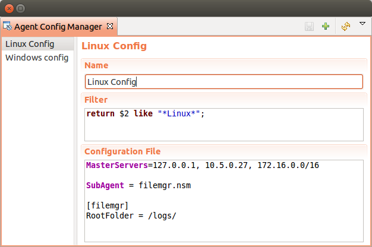
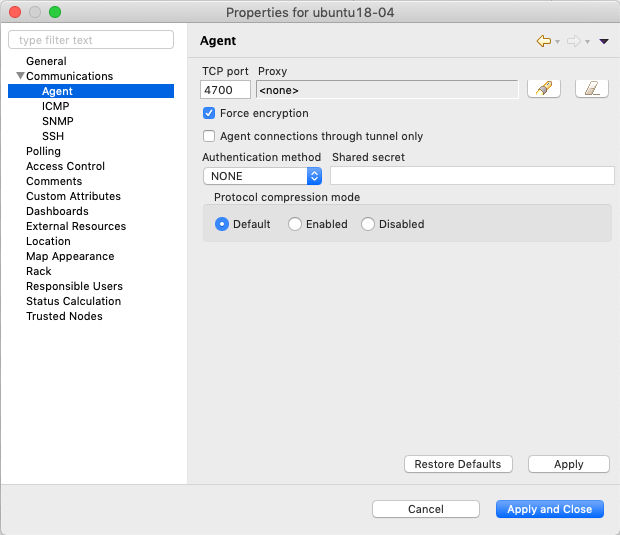
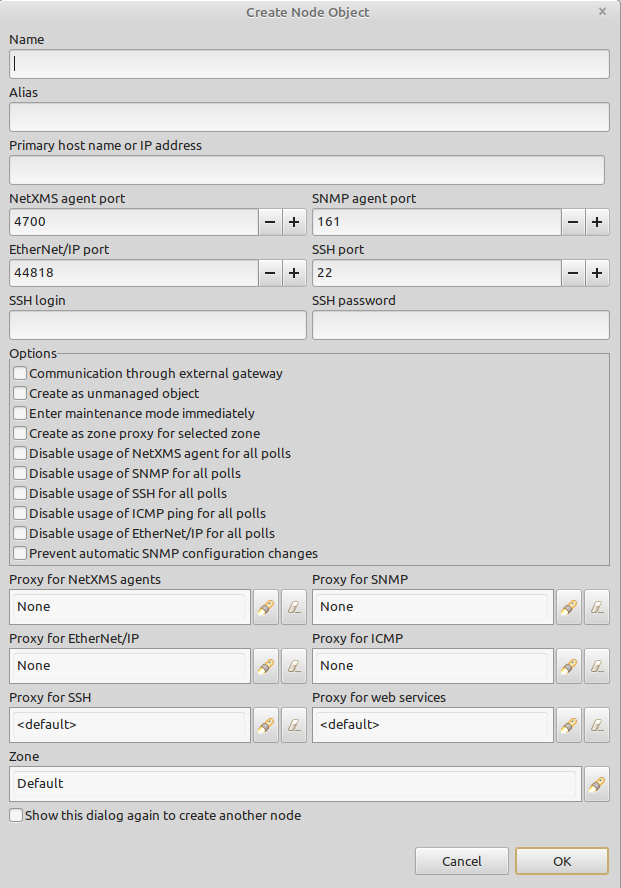

################
Agent management
################

Introduction
============
   
NetXMS agent is daemon or service that runs on a :term:`node<Node>` to provide additional
monitoring options. This is optional for installation, but it's installation gives next advantages:

   * Centralized configuration - you can change configuration of agent from management console; if needed, you can even store agent configs on NetXMS server
   * More secure: communications between NetXMS server and agent can be encrypted, additional authentication on agent can be configured
   * TCP instead of UDP is used for communications with agent - this can help in case of slow and poor quality links
   * Remote command execution - agents can be used to execute commands on managed systems as a reaction to certain events
   * Proxy functionality: agent can be used as a proxy to reach agents on hosts not directly accessible by NetXMS server
   * :term:`SNMP` proxy: agent can be used as a proxy to reach remote SNMP devices
   * :term:`SNMP Trap` proxy: agent can be used as a proxy to get messages from remote SNMP device
   * Extensible: you can add new parameters very easy using configuration option like ``ExternalParamer`` or by writing your own subagents
   * Easy upgrade - you can upgrade all agents at once from console
   * Provides file management possibilities on agent. 

Agent configuration files
=========================

Agent have 3 types of configuration files: master configuration file, additional 
configuration files sroted and Agent Policies files. Master configuration file is the only mandatory file. 
Minimal configuration for master configuration file is server address. Address should be  
set as MasterServers to be able to apply other changes already from the server.

**After configuration file change agent should be restarted to apply new changes.** 

Configuration files and policies should be written in XML or 'key = value' format. In XML 
format general tag should be <config> and then can be added any agent or subagent 
parameter as a tag.

'key = value' format example:

.. code-block:: cfg    
   
   MasterServers = 10.0.0.4
   SubAgent = winperf.nsm
   # Below is a configuration for winperf subagent, in separate section   
   *WinPerf # Other way to define section satart: [WinPerf]
   EnableDefaultCounters = yes
   
Same example in XML format

.. code-block:: xml    
   
   <config>   
      <MasterServers>10.0.0.4</MasterServers>
      <SubAgent>winperf.nsm</Subagent>
      <!-- Below is a configuration for winperf subagent, in separate section -->
      <WinPerf>
         <EnableDefaultCounters>yes</EnableDefaultCounters>
      </WinPerf>
   </config> 

.. _master-configuration-file-label:

Master configuration file
-------------------------
File nxagentd.conf is a master configuration file for NetXMS agent. It contains all 
information necessary for agent's operation. Default location for this file is 
:file:`/etc/nxagentd.conf` on UNIX systems and 
:file:`'installation directory'\\etc\\nxagentd.conf'` on Windows. The file can 
contain one or more parameters in *Parameter = Value* form, each parameter should 
be on its own line. Comments can be inserted after "#" sign. This file can also 
contain configuration for subagents. In this case, subagents’ parameters should 
be placed in separate sections. Beginning of the section is indicated by "*" sign, 
followed by a section name or by section name in braces(example: "[sectionName]").

If build configuration was done with --prefix='prefix' parameter, then configuration file will 
be searched in the following order (UNIX):

   1. :file:`$NETXMS_HOME/etc/nxagentd.conf`
   2. :file:`'prefix'/etc/nxagentd.conf`
   3. :file:`/etc/nxagentd.conf`
   4. :file:`/Database/etc/nxagentd.conf`
   5. :file:`/usr/etc/nxagentd.conf`
   
For Windows systems:

   1. :file:`'installation directory'\\etc\\nxagentd.conf`
   
For Windows location of NetXMS config can be change in registry. 

If configuration file is placed in different location or named in different way,
then it's location and file name can be given to agent with -c parameter. 

Detailed list of parameters can be found there: :ref:`agent_configuration_file`.
     
Configuration file example:

.. code-block:: cfg    
   
   #
   # Sample agent’s configuration file
   #
   MasterServers = 10.0.0.4
   LogFile = {syslog}
   SubAgent = winperf.nsm
   # Below is a configuration for winperf subagent, in separate section
   *WinPerf
   EnableDefaultCounters = yes
   
  
Additional configuration files
------------------------------
Additional configuration files override or supplement configuration parameters form main file. 
There are two types of additional files one are used to store applied :guilabel:`Policies` configuration, 
others can be created and updated manually. More information about Policies can be read there: :ref:`agent-policies-label`.

Next will be described default folders for manually created files. Policies files will be stored in a 
separate folder under :guilabel:`DataDirectory`.
If configuration of build was done with --prefix='prefix' parameter, then config will 
be searched in next order(UNIX):

   1. :file:`$NETXMS_HOME/etc/nxagentd.conf.d`
   2. :file:`'prefix'/etc/nxagentd.conf.d`
   3. :file:`/etc/nxagentd.conf.d`
   4. :file:`/Database/etc/nxagentd.conf.d`
   5. :file:`/usr/etc/nxagentd.conf.d`
   
For Windows systems:

   1. :file:`'installation directory'\\etc\\nxagentd.conf`
   
   
.. _stored-agent-configurations-label:
   
Agent configuration options from server
=======================================

.. _edit_agent_configuration_remotly:

Edit configuration file remotely
--------------------------------

Right click on node, select from menu: :guilabel:`Edit agent's configuration file`. 

On View exit there will be present dialog. New configuration apply is performed on agent restart. So to 
immediately apply new configuration on config exit select :guilabel:`Save and Apply`. This option will 
save config and automatically restart the agent. If just :guilabel:`Save` is selected, then agent 
should be manually restarted to apply new configuration.

Agent configuration files on server
-----------------------------------
   
Agent master configuration files can be stored on server side and requested by agent with 
parameter :command:`-M <serverAdress>`. On config request server goes through config list 
from beginning till the end and one by one checks if this config is the requested one by 
executing filter scripts. 

If server have found appropriate configuration file then it is sent to agent and old
:file:`nxagentd.conf` file is overwritten with incoming one or created new one if there is no :file:`nxagentd.conf` 
When agent can't connect to server or server hasn't found right config, the agent is started 
with the old one. In case when old configuration file does not exist and it is not possible to 
get new one from server - agent fails to start. 

.. versionadded:: 1.2.15    

**Doesn't wotk with tunnel agent connection**

Configuration
~~~~~~~~~~~~~

Each config has a name, filter and config content. 

 - Name just identifies config.
 - Filter is check on config request to define witch configuration file to 
   give back. Filter is defined with help of :term:`NXSL`. To configuration are given 
   next parameters:
   
    - $1 - IP address
    - $2 - platform
    - $3 - major version number
    - $4 - minor version number
    - $5 - release number
    
 - Configuration file is a content of returned configuration file. 

.. _agent-policies-label:

Agent Policies
--------------

Agent policies can be configured on server in :guilabel:`Policies` part. There can be 
used the same parameters and format as in any NetXMS agent configuration file. 

To create policy in menu of container where should be created policy select 
:menuselection:`Create->Agent Configuration File...` and give required object name and 
press :guilabel:`OK`. Than newly created policy can be modified by selecting 
:menuselection:`Edit Policy...` from object menu. 

Example:

.. code-block:: xml

  <config>
    <agent>
      <-- there can be added comment -->
      <MasterServers>127.0.0.1</MasterServers>
      <SubAgent>netsvc.nsm</SubAgent>
      <SubAgent>dbquery.nsm</SubAgent>
      <SubAgent>filemgr.nsm</SubAgent>
    </agent>
    <DBQUERY>
      <Database>id=myDB;driver=mysql.ddr;server=127.0.0.1;login=netxms;password=xxxxx;dbname=netxms</Database>
      <Query>dbquery1:myDB:60:SELECT name FROM images</Query>
      <ConfigurableQuery>dbquery2:myDB:Comment in param :SELECT name FROM images WHERE name like ?</ConfigurableQuery>
      <ConfigurableQuery>byID:myDB:Comment in param :SELECT name FROM users WHERE id=?</ConfigurableQuery>
    </DBQUERY>      
    <filemgr>
      <RootFolder>/</RootFolder>
    </filemgr>
  </config>

Example:

      .. figure:: _images/policy_example.png

After policy is created it should be installed on required nodes. Node and agent on it 
should be up and running. Nodes should be manually restarted after policy was applied to 
run it with new configuration. To install policy in object menu select :menuselection:`Install...`,
select :guilabel:`Install on nodes selected below`, select required nodes in object browser and 
click :guilabel:`OK`.

Installed policy configurations are stored as additional config files under agent 
:guilabel:`DataDirectory`. List of applied policies is stored agent local database. If policy is 
successfully applied on a :term:`node <Node>` it will be seen under this policy.

Example:

      .. figure:: _images/applied_policy.png

If Policies have changed it should be reapplied manually. Is is done with command in 
object menu :menuselection:`Install...`, then select :guilabel:`Install on all nodes where this 
policy already installed` and click :guilabel:`OK`.

Policy can be also uninstalled. To do this right click on policy object and select 
:menuselection:`Uninstall...`, select node from witch this policy will be removed and click :guilabel:`OK`.
In this case additional configuration file is removed from node. In order to apply the changes it is 
required manually to restart the agent. 

In case of Policy deploy, Policy uninstall, Policy update job fail, unsuccessfully operation will be 
scheduled for re-execution. :guilabel:`JobRetryCount` server configuration variable represents 
number of retries. First time job is rescheduled in 10 minutes. Each next wait time is twice more 
than the previous time.  

Installed policies are checked on configuration poll and are reinstalled if policy is marked as 
applied on a server, but is missing on the node.
      
Advantage of creating configuration in policies - if configuration for nodes is changed, 
then it should be changed only once for all nodes on witch it is applied. 
 
Agent Policies vs. Agent Configuration Files on Server 
------------------------------------------------------

A short lists of main points to compare both options:

Agent Configuration Files on Server:
  - Assignment is Rule based 
  - Config download from server is each time the agent starts (if option '-M servername')
  - When config is found on server, local Master config is overwritten, if not existing Master 
    config is used
  - Works with Master config
  - Do not required initial config(can be started without config), but in this case agent 
    will fail if nothing will be returned from server
  - Doesn't work with tunnel agent connection

Agent Policies:
  - Not possible for bootstrap agent
  - Also possible via proxy
  - Assignment is only direct to nodes, not rule based
  - Can be in XML or 'key = value' format
  - SubAgent config sections also possible
  - Changed policies must be reinstalled on nodes (in console) and need agent restart
  - At minimum the server connection parameters must be in Master config to be able to start agent
  - Works with Additional configuration files(policies)
  - If policy and master config have same parameter that can be set only once 
    like(MasterServers or LogFile), then policy will overwrite master config configuration
  - If policy and master config have same parameter that can be set multiple times 
    like(Target for PING subagent or Query for DBQUERY), then policy will merge lists of configs
  - Can work with tunnel agent connection

Agent registration
==================

There are available two ways of agent, server communication. Standard one is when server initialize 
connection to agent, the second one is when tunnel is used and agent initialize connection to server.

Server to agent connection
--------------------------

There are few ways to register agent:
   1. To enter it manually by creating a node
   2. Run the network discovery and enter the range of IP addresses.
   3. Register agent on management server "nxagentd -r <addr>",  where <addr> is the IP address of server. 
      To register agents using this option also :guilabel:`EnableAgentRegistration` parameter should be set to 1.
      
.. _agent-to-server-agent-conf-label:   
   
Agent to server connection
--------------------------

This connection requires certificate configuration on server side. More about required actions can be found in 
:ref:`server-tunnel-cert-conf`. Agent requires :guilabel:`ServerConnection` parameter set in agentd.conf file to 
server :term:`DNS` or server IP address. 

Just after start agent will try to connect to server. On first connect node will be shown in list of 

There are few ways to register agent:
   1. To enter it manually by creating a node and then binding tunnel to already created node.
   2. Create node from :guilabel:`Agent Tunnel Manager` view by selecting one or more tunnels and selecting 
      :guilabel:`Create node and bind...` menu item. 
   
Security
========

Message encryption in server to agent connection 
------------------------------------------------

Server encryption policy is configured in :guilabel:`Server Configuration` view by 
selecting one of 4 options for :guilabel:`DefaultEncryptionPolicy` parameter. Default 
Policy is 1. 

Policy types:

  * 0 - Forbid encryption. Will communicate with agents only using plain text messages.
    If agent force encryption(set :guilabel:`RequireEncryption` agent configuration 
    parameter to :guilabel:`yes`), server will not connect with this agent. 
  * 1 - Allow encryption. Will communicate with agents using plain text messages if for 
    exact node is not defined encryption force by setting :guilabel:`RequireEncryption` 
    agent configuration parameter to :guilabel:`yes` or by selecting 
    :guilabel:`Force encryption` option in Communication properties of node object. 
  * 2 - Encryption preferred. Will communicate with agent using encryption. In case if 
    agent does not support encryption will communicate with it using plain text. 
  * 3 - Encryption required. Will communicate with agent using encryption. In case if 
    agent does not support encryption will not establish connection. 
    

    Force encryption option for node.
  

.. note::
  Configuration will be simplified in next releases. 

Security in agent to server connection
--------------------------------------

Agent to server connection uses :term:`TLS` protocol to ensure communication security. Server has root certificate, that 
is used to issue public certificate for agent. Additionally to this server issues certificates only to the nodes that were 
manually accepted on server, this process can be automated by NXShell if required. More information: 
`NXShell examples <https://wiki.netxms.org/wiki/Using_nxshell_to_automate_bulk_operations>`_, 
`Latest Javadoc <https://www.netxms.org/documentation/javadoc/latest/>`_.
  
Server access levels
--------------------

Depending on how server's IP address(or domain) is added to in nxagentd.conf, it will 
have different access level. It is preferred to use MasterServers. There are 3 levels 
of access for an agent:  

   1. MasterServers - full access.
   2. ControlServers - can read data and execute predefined actions, but cannot change 
      config nor install policies.
   3. Servers - read only access. (Is default for tunneled agent connection if other server level is not defined)
   
In case if server IP is not listed in one of this parameters agent will not enable 
connection with server in server to agent connection or will set access level to :guilabel:`Servers` if tunnel 
connection is used. 

Shared secret
-------------

Shared secret is another level of server verification. By default authentication is 
disabled. 

To enable :guilabel:`Shared Secret` verification on agent set :guilabel:`RequireAuthentication` 
agent configuration parameter to :guilabel:`yes`. In :guilabel:`SharedSecret` agent 
configuration parameter set password what should be used for authentication.

If authentication for agent is enabled, then while connection agent requested shared 
secret from the server. Server check if password was set for this specific node in 
:guilabel:`Shared secret` field in communication properties of node. In case if there is 
no shared secret server sends content of :guilabel:`AgentDefaultSharedSecret` server 
configuration variable as shared secret. 

    Shared secret field in node communication properties. 

In case shared secrets are not identical connection is not established. 

Password encryption
-------------------

When it is required to write password or :guilabel:`Shared Secret` in agent
configuration file, there is possibility to encrypt it. All passwords can 
be encrypted with help of :ref:`nxencpasswd-tools-label` command line tool and added 
in configuration file in encrypted way. 
  
.. _subagent_list:
  
Subagents
=========
Subagents are used to extend agent functionality. NetXMS subagent are libraries that are loaded by agent.
By default all subagents are included in agent build. Subagent may be not included in build
only if on time of the build there were no required libraries for subagent build. To enable 
subagent is require just to add line in main agent configuration file(example: "Subagent=dbquery.nsm").
More about configuration and usage of subagents will be described in monitoring chapters.

There is list of available manually loaded NetXMS subagents:

  * DB2
  * FileMGR
  * DBQuery
  * ECS
  * Informix
  * Java
  * lm-sensors
  * ODBCQuery
  * Oracle
  * Ping
  * PortCheck
  * netsvc
  * UPS
  * WinPref
  * WMI
  * MongoDB
  * Java
  
.. _java-subagent:
  
Java subagent
-------------

This is a special type of subagent, that allows to load Java plugins(subagents written using Java language). 
Java subagent does not provide any functionality by itself. 

There are several configuration parameters that are supported by Java subagent. None of them is mandatory. 

.. list-table::
   :header-rows: 1
   :widths: 50 200
   
   * - Parameter
     - Description
   * - Jvm
     - Path to JVM. System default is used if not set.
   * - Classpath
     - This parameter is added to java CLASSPATH.
   * - Plugin
     - This parameter defines plugin that should be loaded. Can be used multiple times. 

Configuration example:

.. code-block:: cfg

   MasterServers = netxms.demo
   SubAgent=java.nsm
   
   [JAVA]
   Jvm = /path/to/jvm
   Classpath = /path/to/user/classes
   Plugin = bind9.jar

Java plugins
~~~~~~~~~~~~

List of avalivable java plugins:

  * JMX
  * Bind9
  
Load of subagent as separate process
------------------------------------

Load of subagent as separate process can be used in case it is necessary to load agent and subagent 
under different users. It can be done by adding ``ExternalSubagent`` parameter with unique ID that 
will represent connection name between agent and subagent. Create second configuration file for this 
subagent and add there ``ExternalMasterAgent`` parameter with same ID and run instance of :file:`nxagentd` with 
this config. Now external subagent will communicate with master agent using Named Pipe. Only master agent will 
communicate with server. 

Agent Proxy node configuration
==============================

In case it is required to monitor nodes behind firewall, it can be configured 
access to one of subnet nodes and used this node as a proxy node for others. 

Proxy node can be set while node creation or in :guilabel:`Communications` tab 
of node properties. To configure proxy node select node in object selector 
:guilabel:`NetXMS Agent Proxy`.

Agent configuration
-------------------

To enable NetXMS Agent proxy "EnableProxy" agent configuration parameter should 
be set to :guilabel:`yes`.

.. _agent-external-parameter:

Agent External Metrics
======================

Other option to define new Metric that can be collected form node is to use 
``ExternalParameter``/``ExternalParameterShellExec``, or ``ExternalList``, or 
``ExternalParametersProvider`` configuration parameters to define command that will 
be executed on a node and it's output will be provided as a Metric. In such way can 
be added parameter and list metrics. 

ExternalParameter/ExternalParameterShellExec
--------------------------------------------

``ExternalParameter`` defines name of the metric and command that is executed synchronously 
when this metric is requested  by server. There can be provided parameters form DCI 
configuration, that will be available like $1, $2, $3..., $9 variables. To accept 
arguments metric name should contain "(*)" symbols after name. Only first line of 
script output will be given as a result of execution(metric value).

``ExternalParameterShellExec`` has same meaning as ``ExternalParameter`` with exception that 
agent will use shell to execute specified command instead of system process exeution 
API. This difference presented only on Windows system, on other systems 
``ExternalParameter`` and ``ExternalParameterShellExec`` behaves identically.

To add multiple parameters, you should use multiple 
``ExternalParameter``/``ExternalParameterShellExec`` entries.

As this commands are executed synchronously, long commands may cause timeout. In this 
case ``ExecTimeout`` configuration parameter can be set to change external parameter 
execution timeout or ``ExternalParametersProvider`` can be used. 

.. code-block:: cfg

  # Exaple

  # Woithout DCI parameters
  ExternalParameter=Name:command
  ExternalParameterShellExec=Name:command

  # With DCI parameters
  ExternalParameter=Name(*):command $1 $2
  ExternalParameterShellExec=Name(*):command $1 $2

  #Real examples
  ExternalParameter = Test:echo test
  ExternalParameter = LineCount(*):cat $1 | wc -l
  
  
ExternalList
------------

``ExternalList`` defines name of the list metric and command that is executed 
synchronously when this metric is requested by server. There can be provided parameters 
form DCI configuration, that will be available like $1, $2, $3..., $9 variables. To 
accept arguments metric name should contain "(*)" symbols after name. Lines of list 
are separated with new line. 

.. code-block:: cfg

  # Exaple

  # Woithout DCI parameters
  ExternalList=Name:command

  # With DCI parameters
  ExternalList=Name(*):command $1 $2

ExternalParameter
-----------------

``ExternalParameter`` defines name of the metric and command that is executed 
synchronously when this metric is requested by server. There can be provided parameters 
form DCI configuration, that will be available like $1, $2, $3..., $9 variables. To 
accept arguments metric name should contain "(*)" symbols after name.

.. code-block:: cfg

  # Exaple

  # Woithout DCI parameters
  ExternalParameter=Name:command

  # With DCI parameters
  ExternalParameter=Name(*):command $1 $2
  
ExternalParametersProvider
--------------------------

``ExternalParametersProvider`` defines command(script) and execution interval in seconds. Defined 
script will be executed as per interval and agent will cache parameter list. When server 
will request one of provided parameters it's value will be read from the agent cache. 
Main purpose is to providing data from long-running processes, or return multiple 
values at once. This approach can be also used for getting table database results in 
parameter way(like columnName=value). 

Script should print one or more "Parameter=Value" pairs to standard output. Multiple 
pairs should be separated by new line. If parameter takes argument, it should be 
included in "Parameter(...)".

Example of the script:
.. code-block:: shell
  
  #!/bin/sh
 
  echo 'Parameter1=Value1'
  echo 'Parameter2=Value2'
  echo 'ParameterWithArgs(AAA)=Value3'
  echo 'ParameterWithArgs(BBB)=Value4'
  
Example of agent configuration:
.. code-block:: cfg
  
  #Exaple
  ExternalParametersProvider=PATH_TO_PROVIDER_SCRIPT:POLL_TIME_IN_SECONDS
  
  #Example (run /tmp/test.sh every 5 seconds)
  ExternalParametersProvider=/tmp/test.sh:5
  
ExternalTable
-------------

``ExternalTable`` defines name of the table metric, table metric description, column separator, 
instance column and command. Command is executed synchronously when this metric is requested by server.
Each table line is separated with new line symbol. First line in returned text used as a name of the columns 
and all next lines will be used like table data. There can be provided parameters form DCI configuration, 
that will be available like $1, $2, $3..., $9 variables. To accept arguments metric name should contain 
"(*)" symbols after name.

.. code-block:: cfg

  # Exaple

  # Woithout DCI parameters
  ExternalTable=dciName:instanceColumns=columnName;description=description;separator=|:command

  # With DCI parameters
  ExternalTable(*)=dciName:instanceColumns=columnName;description=description;separator=|:command $1 $2

