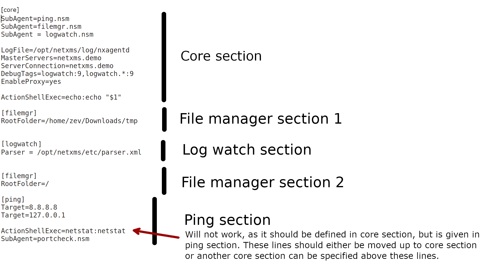
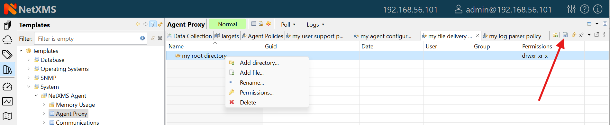

################
Agent management
################

Introduction
============

|product_name| agent is daemon or service that runs on a :term:`node<Node>` to
provide additional monitoring options. This is optional for installation, but
it's installation gives following advantages:

   * Centralized configuration - you can change configuration of agent from
     management client; if needed, you can even store agent configs on
     |product_name| server
   * More secure: communications between |product_name| server and agent is
     encrypted by default, additional authentication on agent can be configured
   * TCP instead of UDP is used for communications with agent - this can help in
     case of slow and poor quality links
   * Remote command execution - agents can be used to execute commands on
     managed systems as a reaction to certain events
   * Proxy functionality: agent can be used as a proxy to reach agents on hosts
     not directly accessible by |product_name| server
   * :term:`SNMP` proxy: agent can be used as a proxy to reach remote SNMP
     devices
   * :term:`SNMP Trap` proxy: agent can be used as a proxy to get messages from
     remote SNMP device
   * :term:`Syslog` proxy: agent can be used as a proxy to get syslog messages from
     remote devices
   * Modbus TCP proxy: agent can be used as a proxy to reach remote devices via
     Modbus TCP protocol
   * Web service proxy: agent can be used as a proxy to reach remote web
     services
   * TCP proxy: agent can be used to establish connection to TCP port on remote
     devices, e.g. to access web UI on a device 
   * Extensible: you can add new metrics very easy using configuration option
     like ``ExternalMetric`` or by writing your own subagents
   * Easy upgrade - you can upgrade all agents at once from management client
   * Provides file management possibilities on agent.
   * Provides log file monitoring functionality.

.. _agent-configuration-files-label:

Agent configuration files
=========================

Agent have 3 types of configuration files: master configuration file, additional
configuration files and Agent Policy configuration files.
Master configuration file is the only mandatory file.
Minimal configuration for master configuration file is server address. Address should be
set as MasterServers to be able to apply other configuration settings from the server.

**After configuration file change agent should be restarted to apply new changes.**

Two formats are supported for configuration files and configuration file policies: XML and 'key = value' format.

In 'key = value' format configuration file can contain one or more parameters in
*Parameter = Value* form, each parameter should be on its own line.
Parameters are grouped into sections. Beginning of a section is denoted by section
name in square brackets (example: "[sectionName]").
Section named "[Core]" contains parameters for agent itself. It's the default section, if a
configuration file starts from parameter and not from section name, parameters are treated
as belonging to "Core" section. Subagents’ parameters should be placed in separate sections named by subagent name.
Same section name can be present several times in the configuration file.
Comments can be inserted after "#" sign

In XML format general tag should be <config>, second level tags contain section names and third level tags are
agent or subagent configuration parameters.

'key = value' format example:

.. code-block:: ini

   [Core]
   MasterServers = 10.0.0.4
   SubAgent = winperf.nsm
   # Below is a configuration for winperf subagent, in separate section
   [WinPerf]
   EnableDefaultCounters = yes

Same example in XML format:

.. code-block:: xml

   <config>
      <Core>
         <MasterServers>10.0.0.4</MasterServers>
         <SubAgent>winperf.nsm</Subagent>
      </Core>
      <!-- Below is a configuration for winperf subagent, in separate section -->
      <WinPerf>
         <EnableDefaultCounters>yes</EnableDefaultCounters>
      </WinPerf>
   </config>

Example of configuration sections:

Detailed list of parameters can be found here: :ref:`agent_configuration_file`.
The following parameters can be specified in master configuration
file only (and will be ignored if found in other configuration files):
``DataDirectory`` and ``ConfigIncludeDir``.

.. _master-configuration-file-label:

Master configuration file
-------------------------
File nxagentd.conf is a master configuration file for |product_name| agent.
Depending on OS there are different locations, where agent tries to find master configuration file.

UNIX-like systems
~~~~~~~~~~~~~~~~~

On UNIX systems master configuration file is searched in the following order:

  #. If :file:`$NETXMS_HOME` environment variable is set: :file:`$NETXMS_HOME/etc/nxagentd.conf`
  #. :file:`'prefix'/etc/nxagentd.conf`. 'prefix' is set during build configuration with ``--prefix='prefix'`` parameter. If that parameter was not specified during build, ``/usr/local`` is used.
  #. :file:`/Database/etc/nxagentd.conf`
  #. :file:`/usr/etc/nxagentd.conf`
  #. :file:`/etc/nxagentd.conf`

If configuration file is placed in a different location or named in a different way,
then it's location and file name can be given to agent with ``-c`` parameter or by
specifying :file:`$NXAGENTD_CONFIG` environment variable. In this cause
search in the locations mentioned above is not performed.

Windows
~~~~~~~

On Windows location of |product_name| config is stored in the registry. Alternatively,
location of configuration file can be provided to agent with ``-c`` command line parameter.
If there is no record in the registry and ``-c`` parameter is not specified, then
agent tries to find configuration files in the following locations:

  #. :file:`'installation directory'\\etc\\nxagentd.conf`
  #. :file:`C:\\nxagentd.conf`

.. _additional-configuration-file-label:

Additional configuration files
------------------------------
To increase maintainability, configuration can be stored in multiple additional
configuration files located in a specific folder.
Additional configuration files override (if a parameter supports only one value)
or supplement (if parameter supports multiple values, e.g. list of servers or root
folders for filemgr subagent) configuration parameters from master file.
Depending on OS there are different locations, where agent tries to find master configuration file.

UNIX-like systems
~~~~~~~~~~~~~~~~~

On UNIX systems it is searched in the following order (search is performed until first existing folder is found):

  1. If :file:`$NETXMS_HOME` environment variable is set: :file:`$NETXMS_HOME/etc/nxagentd.conf.d`
  2. :file:`'prefix'/etc/nxagentd.conf.d`. 'prefix' is set during build configuration with ``--prefix='prefix'`` parameter. If that parameter was not specified during build, ``/usr/local`` is used.
  3. :file:`/Database/etc/nxagentd.conf.d`
  4. :file:`/etc/nxagentd.conf.d`
  5. :file:`/usr/etc/nxagentd.conf.d`

A different configuration file folder name can be given by
specifying $NXAGENTD_CONFIG_D environment variable. In this cause
search in the locations mentioned above is not performed.

Windows
~~~~~~~

On Windows location of configuration file folder is stored in the registry.
If there is no record in the registry, then agent tries to find configuration
file folder in the following locations (search is performed until first existing folder is found):

   1. :file:`'installation directory'\\etc\\nxagentd.conf.d`
   2. :file:`C:\\nxagentd.conf.d`

Agent policy configuration files
--------------------------------

:guilabel:`Agent policies` allow to store agent configuration on server and
deliver it to the agents. More information about Policies can be read there: :ref:`agent-policies-label`.

On agent configuration policy files are stored in a separate folder named
:guilabel:`config_ap` under :guilabel:`DataDirectory` folder. Every policy
is saved into a separate file named by policy GUID.

.. _stored-agent-configurations-label:

Agent configuration options from server
=======================================

.. _edit_agent_configuration_remotely:

Edit configuration file remotely
--------------------------------

Right click on node, select :guilabel:`Edit agent's configuration file` from menu.
When closing the editor, a dialog will be presented. New configuration apply is
performed on agent restart. So to immediately apply new configuration select :guilabel:`Save and Apply`.
This option will save configuration file and automatically restart the agent.
If just :guilabel:`Save` is selected, then agent should be manually restarted to apply new configuration.

.. _agent_configuration_files_on_server:

Agent configuration files on server
-----------------------------------

Agent master configuration files can be stored on server side and requested by agent,
if it is launched with :command:`-M <serverAddress>` command line parameter.
Each configuration file on server is stored along with filter script.
When server receives configuration request from agent, it goes through
available configs and executes filter scripts to find an appropriate configuration.

If appropriate configuration file is found, it is sent to agent and old
:file:`nxagentd.conf` file is overwritten (or a new :file:`nxagentd.conf` file is created, if
it did not exist). When agent can't connect to server or server hasn't found right configuration,
the agent is started with old configuration file. In case if agent configuration file does not
exist and it is not possible to get new one from the server - agent fails to start.

**Doesn't work with tunnel agent connection**

Configuration
~~~~~~~~~~~~~

Each configuration has a name, filter script and the configuration file text.

 - Name just identifies the configuration.
 - Filter script is executed on configuration request to define which configuration file to
   send to the agent. Filter is defined with help of :term:`NXSL` scripting language.
   The following parameters are available in the filter script:

    - $1 - IP address
    - $2 - platform
    - $3 - major version number
    - $4 - minor version number
    - $5 - release number

 - Configuration file is the text of returned configuration file.

.. figure:: _images/agent_config_manager.png

Agent configuration policy
--------------------------

Another option to store and distribute agent configuration are agent policies. In this case agent
configuration is stored on the server side as a policy belonging to template and deployed to the agent when
corresponding template is applied to a node. More information about policies and their types can be found in
:ref:`agent-policies-label` chapter.

Agent Configuration Policies vs. Agent Configuration Files on Server
--------------------------------------------------------------------

A short lists of main points to compare both options:

Agent Configuration Files on Server:
  - Assignment is based on rules described in filter scripts
  - When configuration is changed, agent restart is needed to activate new configuration
  - Config download from server is each time the agent starts (if option '-M servername')
  - When config is found on server, local Master config is overwritten, if not - existing Master
    config is used
  - Works with master configuration file
  - Does not required initial config (agent can be started without config), but in this case agent
    would fail if nothing was returned from server
  - Server provides configuration file without authorization which can be a security
    issue, if sensitive information is present in configuration file.
  - Doesn't work via proxy
  - Doesn't work via tunnel agent connection

Agent Policies:
  - Not possible for bootstrap agent
  - After policy is deployed to agent, the agent should be restarted to activate new configuration.
  - At minimum the server connection parameters must be in master config to be able to start agent
  - Each policy is saved in a separate configuration file
  - If policy and master config have same parameter that can be set only once (e.g. LogFile),
    then policy will overwrite master config configuration
  - If policy and master config have same parameter that can be set multiple times
    (e.g. Target for PING subagent or Query for DBQUERY), then policy will merge lists of configs
  - Can work via proxy
  - Can work with tunnel agent connection

.. _agent-policies-label:

Agent Policies
==============

Agent policies are additional configuration created by user (agent configuration or files) that
are uploaded and updated on agent when template is manually or automatically applied on
the node. Agent policies belong to templates, so they are applied to nodes to which a
corresponding template is applied.

The following policy types are available:
  - Agent configuration policy
  - File delivery policy
  - Log parser policy
  - User support application policy

To create policy, select a template and click :guilabel:`Agent policies` tab. Click plus
icon to create a new policy, give it a name, choose correct policy type and
click :guilabel:`OK`. Newly created policy will open for editing in a new tab. 
For example, for File Delivery policy, right click 
and :menuselection:`Add root directory...` option will prompt you to create directory. Then, right click on newly created directory and more 
options, like :menuselection:`Add directory...`, :menuselection:`Add file...`, :menuselection:`Rename...`, :menuselection:`Permissions...` and :menuselection:`Delete...`
will be avalable. 
Existing policy can be modified by right clicking it and selecting :menuselection:`Edit` from the menu or by double clicking on it. Use :guilabel:`Save` button after configuration changes.

Policies are automatically deployed to nodes after creation/modification or
when a template is applied to a node. When configuration policy is deleted or
template is removed from a node, the policy is automatically undeployed from node.

Policies get deployed / undeployed:
  - On node configuration poll.
  - When list of Agent Policies is closed in the management client. If
    a node is down at that moment, next attempt will happen on configuration poll.
  - When template is applied or removed from a node. If a node is down at that
    moment, next attempt will happen on configuration poll.

Installed policy configurations are stored as additional files under agent
:guilabel:`DataDirectory`. List of applied policies is stored in agent local database.

If agent discovers for a record in local database, that policy file is missing, it will
delete the record from database.

When performing deployment, server checks information in agent's database with it's
database and issues necessary commands.

Agent configuration policy
--------------------------

Agent configuration policy provides option to populate agent configuration with additional
parts. Main agent configuration is merged with additional rules from policy.
Using policy for configuration file maintenance has advantages that configuration
is edited in centralized way and gives granular control on the configuration that each node gets.
More information about different agent configuration options can be found in above chapters.

It is possible to use the same parameters and format as in any |product_name| agent configuration file
(key=value format or XML format).

Example:

.. code-block:: ini

  MasterServer=127.0.0.1
  SubAgent=netsvc.nsm
  SubAgent=dbquery.nsm
  SubAgent=filemgr.nsm

  [DBQUERY]
  Database=id=myDB;driver=mysql.ddr;server=127.0.0.1;login=netxms;password=xxxxx;dbname=netxms
  Query=dbquery1:myDB:60:SELECT name FROM images
  ConfigurableQuery=dbquery2:myDB:Comment in param :SELECT name FROM images WHERE name like ?
  ConfigurableQuery=byID:myDB:Comment in param :SELECT name FROM users WHERE id=?

  [filemgr]
  RootFolder=/

.. code-block:: xml

  <config>
    <core>
      <!-- there can be added comment -->
      <MasterServers>127.0.0.1</MasterServers>
      <SubAgent>netsvc.nsm</SubAgent>
      <SubAgent>dbquery.nsm</SubAgent>
      <SubAgent>filemgr.nsm</SubAgent>
    </core>
    <DBQUERY>
      <Database>id=myDB;driver=mysql.ddr;server=127.0.0.1;login=netxms;password=xxxxx;dbname=netxms</Database>
      <Query>dbquery1:myDB:60:SELECT name FROM images</Query>
      <ConfigurableQuery>dbquery2:myDB:Comment in param :SELECT name FROM images WHERE name like ?</ConfigurableQuery>
      <ConfigurableQuery>byID:myDB:Comment in param :SELECT name FROM users WHERE id=?</ConfigurableQuery>
    </DBQUERY>
    <filemgr>
      <RootFolder>/</RootFolder>
    </filemgr>
  </config>

Example:

      .. figure:: _images/policy_example.png

Agent should be manually restarted to apply the configuration after the
configuration policy is deployed or undeployed to node.

Log parser policy
-----------------

Information about log parser format and usage available in :ref:`log-monitoring` chapter.

Log parser configuration is applied right after log parser policy is deployed or
undeployed to node - no agent restart is required.

File delivery policy
--------------------

File delivery policy is created to automatically upload files form server to agents.

First root folder or folders should be created - folders with the full path to place
where uploaded file and folder structure should be placed. After folder
structure is created files can be added to this structure. On policy apply folders will be
created if possible and files will be uploaded.

In file and folder names the following macros can be used:

  - Environment variables as %{ENV_VAR_NAME}
  - `strftime(3C) <http://www.unix.com/man-page/opensolaris/3c/strftime/>`_ macros
  - Text inside \` braces will be executed as a command and first line of output will be taken

Example:

  .. figure:: _images/policy_file_delivery.png

.. note::
  File delivery policy uses :ref:`File manager<agent_file_mngmnt>` to upload files
  so :guilabel:`filemgr` subagent should be loaded and root folders should be defined
  to provide write access to folders.

User support application policy
-------------------------------

Agent registration
==================

Two ways of agent-server communication are available. Standard one is when server initializes
connection to agent, the second one is when tunnel is used and agent initialize connection to server.

Server to agent connection
--------------------------

There are few ways to register agent:
   1. To enter it manually by creating a node
   2. Run the network discovery and enter the range of IP addresses.
   3. Register agent on management server ``nxagentd -r <addr>``,  where <addr>
      is the IP address of server. To register agents using this option
      ``EnableAgentRegistration`` server configuration parameter should
      be set to 1.

.. _agent-to-server-agent-conf-label:

Agent to server connection
--------------------------

This connection requires certificate configuration on server side. More about
required actions can be found in :ref:`server-tunnel-cert-conf`. Server address
to which the agent should connect is specified in agent configuration file.
There are two options:

ServerConnection parameter
~~~~~~~~~~~~~~~~~~~~~~~~~~

``ServerConnection`` parameter set in agentd.conf file to server
:term:`DNS` or server IP address. It's also possible to specify port number
separated by colon, e.g.:

.. code-block:: ini

    ServerConnection=monitoring.example.com
    ServerConnection=192.168.77.77:1234

ServerConnection section
~~~~~~~~~~~~~~~~~~~~~~~~

``[ServerConnection]`` section is set in agentd.conf. This allows to
specify additional parameters, e.g.:

.. code-block:: ini

    [ServerConnection]
    Hostname=192.168.77.77
    Port=4703
    CertificateFile=/etc/cert/agent_certificate.crt
    ServerCertificateFingerprint=E6:5A:5D:37:22......FC:EF:EA:4B:22

The following parameters are supported in :guilabel:`ServerConnection` section:

.. list-table::
   :header-rows: 1
   :widths: 30 70

   * - Parameter
     - Description
   * - Hostname
     - Server :term:`DNS` or server IP address
   * - Port
     - Port number
   * - CertificateId
     - Id of Certificate in Certificate Store (Windows only). E.g.:
       ``template:1.5.3.76.23.45.6.23.4235.56234.234``
   * - CertificateFile
     - Agent certificate file.
   * - Password
     - Certificate password
   * - ServerCertificateFingerprint
     - Fingerprint to verify server certificate. Setting this parameter forces
       verification of server certificate.

Using ``CertificateId`` or ``CertificateFile`` allows to provide
agent certificate manually, not by auto-generation by |product_name| server.

It is possible to have several ``ServerConnection`` parameters or
sections in the config, in this case agent will establish tunnel connection to
multiple servers.

In addition to ``ServerConnection`` it's necessary to set
``MasterServers``, ``ControlServers`` or ``Servers``
parameter to configure what access rights server has to this agent.

Agent can validate certificate chain, when connecting to server. This is
configured in agent configuration file, e.g.:

.. code-block:: ini

    TrustedRootCertificate=/etc/cert/root_cert.crt
    TrustedRootCertificate=/etc/cert/root_certs
    VerifyServerCertificate=yes
   
``TrustedRootCertificate`` can point to either certificate file or a
folder with certificates. Several ``TrustedRootCertificate`` parameters
can be specified. For Windows system agent loads certificates from Certificate Store. 
For non-Windows systems a number of default certificate locations are automatically
loaded by agent: 

.. list-table::
   :header-rows: 1
   :widths: 30 70

   * - Path
     - OS where this path is used
   * - /etc/ssl/certs
     - Ubuntu, Debian, and many other Linux distros
   * - /usr/local/share/certs
     - FreeBSD
   * - /etc/pki/tls/certs
     - Fedora/RHEL
   * - /etc/openssl/certs
     - NetBSD
   * - /var/ssl/certs
     - AIX

If ``ServerCertificateFingerprint`` is specified for a server, server
certificate is always verified, disregarding the
``VerifyServerCertificate`` value. 

Agent registration on server
~~~~~~~~~~~~~~~~~~~~~~~~~~~~

Right after agent start it will try to connect to the server. On first connect
node will be shown in :guilabel:`Agent Tunnels`.

There are few ways to register agent:
   1. To enter it manually by creating a node and then binding tunnel to already
      created node.
   2. Create node from :guilabel:`Agent Tunnels` view by selecting one or more
      tunnels and selecting :guilabel:`Create node and bind...` menu item.

Debugging
~~~~~~~~~

In case of errors enable server debug for "agent.tunnel" and "crypto.cert" to
level 4 and agent log debug for "tunnel" and "crypto.cert" to level 4.
Check for "SYS_TUNNEL_SETUP_ERROR" events on management node. 

Security
========

Message encryption in server to agent communication
---------------------------------------------------

Server encryption policy is configured in :guilabel:`Server Configuration` view by
selecting one of 4 options for :guilabel:`DefaultEncryptionPolicy` parameter. Default
Policy is 2.

Policy types:

  * 0 - Forbid encryption. Will communicate with agents only using unencrypted messages.
    If agent force encryption (:guilabel:`RequireEncryption` agent configuration
    parameter is set to :guilabel:`yes`), server will not accept connection with this agent.
  * 1 - Allow encryption. Will communicate with agents using unencrypted messages
    if encryption is not enforced by setting :guilabel:`RequireEncryption`
    agent configuration parameter to :guilabel:`yes` or by selecting
    :guilabel:`Force encryption` option in Communication properties of node object.
  * 2 - Encryption preferred. Will communicate with agents using encryption. In case if
    agent does not support encryption will use unencrypted communication.
  * 3 - Encryption required. Will communicate with agent using encryption. In case if
    agent does not support encryption will not establish connection.

.. figure:: _images/node_communications_tab.png

    Force encryption option for node.

Security in agent to server connection
--------------------------------------

Agent to server connection uses :term:`TLS` protocol to ensure communication security. Server has root certificate, that
is used to issue public certificate for agent. Server issues certificate to node when user manually
binds tunnel to a node in :guilabel:`Agent Tunnels`, or node is bind automatically
(when :guilabel:`AgentTunnels.UnboundTunnelTimeoutAction` server configuration parameter is set to
:guilabel:`Bind tunnel to existing node` or :guilabel:`Bind tunnel to existing node or create a new node`).
If required, this process can also be automated by NXShell. More information:
`NXShell examples <https://wiki.netxms.org/wiki/Using_nxshell_to_automate_bulk_operations>`_,
`Latest Javadoc <https://www.netxms.org/documentation/javadoc/latest/>`_.

Server access levels
--------------------

Depending on how server's IP address (or domain name) is added to in nxagentd.conf, it will
have different access level. It is preferred to use MasterServers. There are 3 levels
of access for an agent:

   1. MasterServers - full access.
   2. ControlServers - can read data and execute predefined actions and make screenshots
   3. Servers - read only access. (Is default for tunneled agent connection if
      other server level is not defined)

In case if server IP is not listed in one of this parameters agent will not
enable connection with server in server to agent connection or will set access
level to :guilabel:`Servers` if tunnel connection is used.

Detailed list of functionality available to above mentioned access levels is the
following:

.. list-table::
   :widths: 70 10 10 10
   :header-rows: 1

   * - Functionality
     - MasterServers
     - ControlServers
     - Servers
   * - Read metrics, lists and table metrics
     - X 
     - X
     - X
   * - Web service, modbus, SNMP trap, syslog, tftp proxy operation (also requires enabling specific proxy type in agent configuration file)
     - X
     - X
     - X
   * - Execute actions defined in agent configuration files or configuration policies
     - X
     - X
     - 
   * - Take screenshots
     - X
     - X
     - 
   * - Edit agent main configuration file
     - X
     - 
     - 
   * - Remote agent upgrade
     - X
     - 
     - 
   * - Install software packages
     - X
     - 
     - 
   * - Deploy/undeploy agent policies
     - X
     - 
     - 
   * - File manager – all write operations, e.g. file or folder creation, deletion, etc. (also requires enabling file manager and specifying root folder in agent configuration file)
     - X
     - 
     - 
   * - Sending notifications via user support application
     - X
     - 
     - 
   * - Running commands inside ` braces for File.* metrics and in log file monitoring
     - X
     - 
     - 
   * - Use of File.Content() metric
     - X
     - 
     - 
   * - SNMP.ScanAddressRange() and TCP.ScanAddressRange() lists (also requires EnableProxy = yes in agent configuration file)
     - X
     - 
     - 
   * - Agent, SNMP and TCP proxy operation (also requires enabling specific proxy type in agent configuration file)
     - X
     - 
     - 

Shared secret
-------------

Shared secret is another level of server verification. By default authentication is
disabled.

To enable :guilabel:`Shared Secret` verification on agent set :guilabel:`RequireAuthentication`
agent configuration parameter to :guilabel:`yes`. In :guilabel:`SharedSecret` agent
configuration parameter set password what should be used for authentication.

If authentication for agent is enabled, then while connection agent requested shared
secret from the server. Server check if password was set for this specific node in
:guilabel:`Shared secret` field in communication properties of node. In case if there is
no shared secret server sends content of :guilabel:`AgentDefaultSharedSecret` server
configuration variable as shared secret.

.. figure:: _images/node_communications_tab.png

    Shared secret field in node communication properties.

In case shared secrets are not identical connection is not established.

Password encryption
-------------------

When it is required to write password or :guilabel:`Shared Secret` in agent
configuration file, there is possibility to encrypt it. All passwords can
be encrypted with help of :ref:`nxencpasswd-tools-label` command line tool and added
in configuration file in encrypted way.

.. _subagent_list:

Subagents
=========
Subagents are used to extend agent functionality. |product_name| subagent are
libraries that are loaded by agent. 

On Linux systems, where agent is installed from packages, some subagents are
provided in separate packages (e.g. ``netxms-agent-mqtt``) to avoid pulling
unnecessary dependencies on systems where specific functionality is not needed.
Subagents that do not require dependencies are shipped in ``netxms-agent``
package. 

On Windows all available subagents are shipped in agent installer. 

Subagents are enabled by adding corresponding line in agent configuration file
(for example: ``SubAgent=dbquery``). 

Below is list of available |product_name| subagents:

  * Bind9
  * :ref:`Asterisk <asterisk-monitoring>`
  * :ref:`DB2 <db2-subagent>`
  * :ref:`Database Query (dbquery) <dbquery>`
  * :ref:`DS18x20 <ds18x20-subagent>`
  * File Manager (filemgr)
  * gps
  * :ref:`Informix <informix-subagent>`
  * :ref:`Java <java-subagent>`
  * Linux (automatically loaded on Linux systems)
  * :ref:`Log file and Windows event log monitoring (logwatch) <log-monitoring>`
  * :ref:`lm-sensors <hardware-monitoring>`
  * :ref:`MongoDB <mongodb-subagent>`
  * :ref:`MQTT <mqtt-subagent>`
  * :ref:`MySQL <mysql-subagent>`
  * :ref:`Network Service Check (netSVC) <netsvc-subagent>`
  * :ref:`Oracle <oracle-subagent>`
  * ICMP Ping (ping)
  * :ref:`Postgres <pgsql-subagent>`
  * :ref:`Raspberry Pi <rpi-subagent>`
  * sms
  * :ref:`ssh <ssh-monitoring>`
  * :ref:`UPS <ups-monitoring>`
  * :ref:`Windows event log syncronization (wineventsync) <windows_event_log_synchronization>`
  * WinNT (Automatically loaded on Windows systems)
  * Windows Performance (winperf)
  * :ref:`WMI <WMI-subagent>`
  * XEN

.. _java-subagent:

Java subagent
-------------

This is a special type of subagent, that allows to load Java plugins (subagents written using Java language).
Java subagent does not provide any functionality by itself.

There are several configuration parameters that are supported by Java subagent. None of them is mandatory.

.. list-table::
   :header-rows: 1
   :widths: 50 200

   * - Parameter
     - Description
   * - Jvm
     - Path to JVM. System default is used if not set.
   * - Classpath
     - This parameter is added to java CLASSPATH.
   * - Plugin
     - This parameter defines plugin that should be loaded. Can be used multiple times.

Configuration example:

.. code-block:: ini

   MasterServers = netxms.demo
   SubAgent=java.nsm

   [JAVA]
   Jvm = /path/to/jvm
   Classpath = /path/to/user/classes
   Plugin = bind9.jar

Java plugins
~~~~~~~~~~~~

List of available java plugins:

  * JMX
  * Bind9

Load of subagent as separate process
------------------------------------

Load of subagent as separate process can be used in case it is necessary to load agent and subagent
under different users. It can be done by adding ``ExternalSubagent`` parameter with unique ID that
will represent connection name between agent and subagent. Create second configuration file for this
subagent and add there ``ExternalMasterAgent`` parameter with same ID and run instance of :file:`nxagentd` with
this config. Now external subagent will communicate with master agent using Named Pipe. Only master agent will
communicate with server.

Agent Proxy node configuration
==============================

In case it is required to monitor nodes behind firewall, it can be configured
access to one of subnet nodes and used this node as a proxy node for others.

Proxy node can be set during node creation or in :guilabel:`Communications` tab
of node properties. To configure proxy node select node in object selector
:guilabel:`NetXMS Agent Proxy`.

.. figure:: _images/create_node.png

.. figure:: _images/node_communications_tab.png

Agent configuration
-------------------

To enable |product_name| Agent proxy "EnableProxy" agent configuration parameter should
be set to :guilabel:`yes`.

.. _agent-external-parameter:

Agent External Metrics
======================

Other option to define new metric that can be collected from node is to use
``ExternalMetric``/``ExternalMetricShellExec``, or ``ExternalList``, or
``ExternalMetricProvider`` configuration parameters to define a command that
will be executed on a node and it's output will be provided as a metric. This
functionality provides flexibility to create your own metrics, lists or table
metrics.

New metrics will be visible in the :guilabel:`Available metrics` list only after
agent restart (agent reads its configuration files only once on start) and
subsequent configuration poll, so to force it's appearance run
:guilabel:`Configuration poll` manually after agent restart.

.. note::

   On Windows platforms UTF-8 encoding should be returned in External Metrics. 

ExternalMetric/ExternalMetricShellExec
--------------------------------------------

``ExternalMetric`` defines name of the metric and command that is executed
synchronously when this metric is requested by the server. Parameters from DCI
configuration can be provided, these will be available as $1, $2, $3..., $9
variables. To accept parameters metric name should contain "(*)" symbols after
name. Only first line of command output will be given as a result of execution
(metric's value).

``ExternalMetricShellExec`` has same meaning as ``ExternalMetric`` and
behaves identically on non-Windows systems. On Windows systems
``ExternalMetric`` executes specified command using system process execution
API's CreateProcess() function. It will search in PATH, but the command should
be with file extension, e.g. ``command.exe``. ``ExternalMetricShellExec``
will use shell to execute specified command on Windows.

To add multiple metrics, you should use multiple
``ExternalMetric``/``ExternalMetricShellExec`` entries.

As these commands are executed synchronously, long-executing commands may cause
timeout. There are two timeouts - one on the agent side (controlled by
``ExternalMetricTimeout`` in agent's configuration file) and generic timeout for
all requests to agent (controlled by `AgentCommandTimeout` in server's
configuration file). It's strongly not recommended to increase server timeout to
more then a few seconds because this may lead to performance issues due to
poller threads spending too much time on timeouts.
``ExternalMetricProvider`` can be used to handle long-executing commands. 

.. code-block:: ini

  # Example

  # Without DCI parameters
  ExternalMetric=Name:command
  ExternalMetricShellExec=Name:command

  # With DCI parameters
  ExternalMetric=Name(*):command $1 $2
  ExternalMetricShellExec=Name(*):command $1 $2

For each metric configured two agent metrics are provided - one is ``Name`` as
specified in ``ExternalMetric``/``ExternalMetricShellExec`` which provides
output of the command (first line only), the other is ``Name.ExitCode`` that
provides exit code of the executed command. 

.. code-block:: ini

  # Real example
  ExternalMetric = Test:echo test
  ExternalMetric = LineCount(*):cat $1 | wc -l

.. code-block:: sh

  > nxget localhost Test
  test
  > nxget localhost 'LineCount(somefile.txt)'
  42
  > nxget localhost 'LineCount(somefile.txt).ExitCode'
  0

ExternalList
------------

``ExternalList`` defines name of the list metric and command that is executed
synchronously when this metric is requested by server. Parameters from DCI
configuration can be provided, these will be available as $1, $2, $3..., $9
variables. To accept parameters metric name should contain "(*)" symbols after
name. Lines of the list are separated by new line character.

.. code-block:: ini

  # Example

  # Without DCI parameters
  ExternalList=Name:command

  # With DCI parameters
  ExternalList=Name(*):command $1 $2

ExternalMetricProvider
--------------------------

``ExternalMetricProvider`` defines command (script) and execution interval in
seconds. Defined script will be executed regularly and agent will cache list of
metrics along with their values. When server will request one of provided
metrics, it's value will be read from the agent cache. Main purpose is to
provide data from long-running processes, or retrieve multiple values by running
a command only once.

Timeout in milliseconds for command execution is defined by
`ExternalMetricProviderTimeout` parameter in agent configuration file. 

Script should print one or more "Metric=Value" pairs to standard output. Multiple
pairs should be separated by new line. If metric takes a parameter, it should be
included in "Metric(...)".

Example of the script:

.. code-block:: sh

  #!/bin/sh
  echo 'Metric1=Value1'
  echo 'Metric2=Value2'
  echo 'MetricWithParams(parameter)=Value3'
  echo 'MetricWithParams(another_parameter)=Value4'

Example of agent configuration:

.. code-block:: ini

  #Example
  ExternalMetricProvider=PATH_TO_PROVIDER_SCRIPT:EXECUTION_INTERVAL_IN_SECONDS

  #Example (run /tmp/test.sh every 5 seconds)
  ExternalMetricProvider=/tmp/test.sh:5

ExternalTable
-------------

``ExternalTable`` defines table that is provided by agent and how it can be
obtained. Table can be collected synchronously when requested by the server or
regularly in the background (in this case server gets cached data). Second
option is useful when command for table creation is taking a long time to avoid
timeout. To collect table in the background "PollingInterval" configuration
option is required.

Timeout in milliseconds for background operation is defined by
`ExternalMetricProviderTimeout` parameter in agent configuration file. 

Each table line is separated with new line symbol. First line in returned text
should contain name of columns, subsequent lines contain table data. Parameters
from DCI configuration can be provided, these will be available like $1, $2,
$3..., $9 variables. To accept parameters metric name should contain ``(*)``
symbols after name.

.. list-table::
   :header-rows: 1
   :widths: 20 10 70

   * - Name
     - Required
     - Description
   * - Command
     - Yes
     - Result of this command execution will be used as a value for table DCI.
       First row is used as column names.
   * - Separator
     - No
     - Symbol that will be used as a separator for columns. If separator is not
       specified, default value of ``,`` is used.
        
        .. note:: 
            Separator supports special macros for separator:

                * \\n - \\n
                * \\r - \\r
                * \\s - space
                * \\t - tab
                * \\u115 - unicode character number 115
           
   * - InstanceColumns
     - No
     - Comma separated instance column list. 
         
         .. note:: 
             Instance column should contain unique identifier for each table
             row. If several instance columns are used, then combination of
             these columns should be unique. This is necessary for building
             graphs and for correct threshold violation event generation. Row
             number is used if instance column is not set. 

   * - Description
     - No
     - Table DCI description that will be shown in table DCI selector. 
   * - PollingInterval
     - No
     - Interval that is used to poll table in the background. Table will be
       collected synchronously (per request) if this parameter is omitted. 
   * - ColumnType
     - No
     - Data type of the column. Is set in format columnName:dataTypeName. If
       column does not have type int32 is used by default. 

       Possible options:
         * int32
         * uint32
         * int64
         * uint64
         * string
         * float
         * counter32
         * counter64

.. code-block:: ini

  # Example

  # Simple example
  [ExternalTable/test]
  Command = echo 'col1;col2;col3\na;b;c'
  Separator = ;

  # Without DCI parameters
  [ExternalTable/dciName]
  Command = command
  Separator = ;
  InstanceColumns = columnName,columnName2
  Description = description
  PollingInterval = 60
  ColumnType = columnName:string
  ColumnType = columnName3:string

  # With DCI parameters
  [ExternalTable/dciName(*)]
  Command = cat /folder/with/my/files/$1

  
  # Old configuration format
  ExternalTable=dciName::command
  ExternalTable=dciName:instanceColumns=columnName;description=description;separator=|:command
  ExternalTable=dciName(*):instanceColumns=columnName;description=description;separator=|:command $1 $2
  #Old configuration format with background polling 
  ExternalTable=dciName:instanceColumns=columnName;description=description;separator=|:command;backgroundPolling=yes;pollingInterval=60
     
    
.. note::
   ``backgroundPolling`` configuration should be set to ``true`` or ``yes`` in order to use polling interval with old configuration format.

.. _agent-actions:

Agent Actions
=============

For security reasons actions that can be executed on agent first are defined in
agent configuration file and only then can be used by users. This excludes that an
unauthorized user can access system data through an arbitrary entered command. Only
users with access to the agent configuration file editing can define executed commands.

There are 2 options to define action:

   #. Action - usual action definition. On Windows platform system process execution API's CreateProcess() is used to run the command, it will search in PATH, but the command should be with file extension, e.g. ``command.exe``.
   #. ActionShellExec - Same as Action, but on the Windows platform agent will use shell to execute command instead of normal process creation. There is no difference between Action and ActionShellExec on UNIX platforms.

Both versions accept parameters that will be available like ``$1``, ``$2``, ``$3``..., ``$9`` variables.

After action is defined it can be used in the :ref:`object tools - agent action<object_tool-agent-command>` or in
:ref:`actions - action execution on remote node<action-remote-execute>`. Action should be defined in main section of
agent configuration file.

.. code-block:: ini

  # Example
  Action=Name:command
  Action=Name:command $1 $2
  Action=cleanLogs:rm /opt/netxms/log/*
  Action=ping:ping $1
  ActionShellExec=listFiles:dir $1
