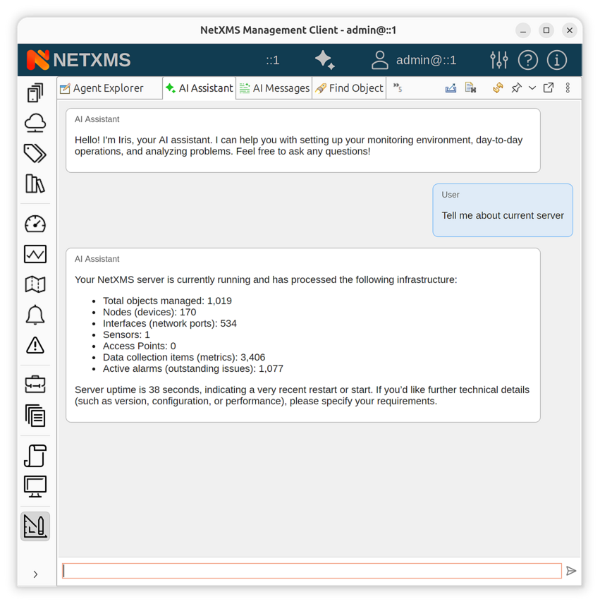
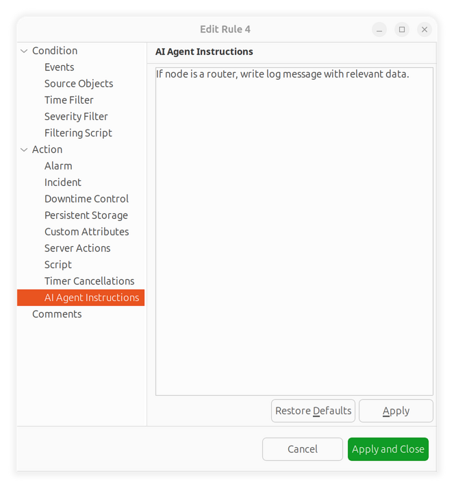

.. _ai-assistant:

############
AI Assistant
############

|product_name| includes an integrated AI assistant that helps with
network monitoring, incident analysis, log investigation, and day-to-day
administration tasks. The AI assistant connects to large language models (LLMs)
and uses a set of built-in functions to query live |product_name| data, execute
actions, and provide context-aware recommendations.

This chapter covers the configuration of LLM providers, the use of the AI assistant in
the management client and command-line interface, background AI tasks, and
the AI message system.

Getting Started
===============

This section walks you through the minimal steps needed to enable the AI assistant and
have your first conversation.

Prerequisites
-------------

- A running |product_name| server (version 5.2 or later).
- Access to at least one LLM provider: a cloud API (OpenAI, Anthropic) or a
  local Ollama instance.
- An API key or token for the chosen provider (not required for Ollama with
  default settings).

.. _ai-configure-provider:

Step 1: Configure an LLM Provider
----------------------------------

Add a provider section to the server configuration file (``netxmsd.conf``).
The example below configures an OpenAI-compatible provider:

.. code-block:: cfg

   [AI/Provider/openai]
   Type = openai
   URL = https://api.openai.com/v1/chat/completions
   Model = gpt-4o
   Token = sk-your-api-key-here
   Slots = default

Restart the |product_name| server after changing the configuration file.

.. note::

   The AI assistant is only available when at least one provider is configured.
   If no provider has the ``default`` slot, the server will not start the AI
   subsystem.

Step 2: Open the AI Chat
-------------------------

In the management client:

1. Switch to the :guilabel:`Tools` perspective.
2. Open the :guilabel:`AI Assistant` tool.
3. Type a message in the input field at the bottom and press :kbd:`Enter`.

   AI Assistant chat view in the management client

The AI assistant will respond using the configured LLM and may call internal
functions to retrieve live data from the server (e.g., alarm lists, object
details, historical metrics).

Step 3: Ask a Question
-----------------------

Try a simple query to verify the setup:

.. code-block:: text

   What are the current active alarms?

The AI assistant will use the ``alarm-list`` function to retrieve real-time
alarm data from the server and present the results. Function calls are
displayed in the chat as progress indicators so you can see what data is being
accessed.

How-to Guides
=============

.. _ai-configure-providers:

How to Configure LLM Providers
------------------------------

Providers are configured in the ``netxmsd.conf`` file under ``[AI/Provider/<name>]``
sections. Each provider has a unique name and maps to one or more slots.

OpenAI-compatible provider
~~~~~~~~~~~~~~~~~~~~~~~~~~

Works with the OpenAI API and any compatible service (Azure OpenAI, vLLM,
LiteLLM, etc.):

.. code-block:: cfg

   [AI/Provider/openai]
   Type = openai
   URL = https://api.openai.com/v1/chat/completions
   Model = gpt-4o
   Token = sk-your-api-key-here
   Temperature = 0.7
   ContextSize = 128000
   Timeout = 180
   Slots = default,interactive

Anthropic provider
~~~~~~~~~~~~~~~~~~

Connects to the Anthropic Messages API:

.. code-block:: cfg

   [AI/Provider/anthropic]
   Type = anthropic
   URL = https://api.anthropic.com/v1/messages
   Model = claude-sonnet-4-20250514
   Token = sk-ant-your-key-here
   Slots = default,analytical

Ollama provider (local)
~~~~~~~~~~~~~~~~~~~~~~~

Runs models locally using `Ollama <https://ollama.com>`_. No API key is
required for local deployments:

.. code-block:: cfg

   [AI/Provider/local-llama]
   Type = ollama
   URL = http://127.0.0.1:11434/api/chat
   Model = llama3.2
   ContextSize = 32768
   Slots = fast

.. _ai-provider-slots:

How to Use Provider Slots
-------------------------

Slots allow you to route different types of AI requests to different providers.
For example, you can use a fast local model for quick responses and a more
capable cloud model for deep analysis.

Assign slots to providers using the ``Slots`` parameter (comma-separated list):

.. code-block:: cfg

   [AI/Provider/gpt4]
   Type = openai
   Model = gpt-4o
   Token = sk-your-key
   Slots = default,analytical

   [AI/Provider/local-fast]
   Type = ollama
   Model = mistral
   Slots = fast

The ``default`` slot is used when no specific slot is requested. At least one
provider must be assigned to the ``default`` slot for the AI subsystem to
initialize.

You can optionally set the global default provider explicitly:

.. code-block:: cfg

   [AI]
   DefaultProvider = gpt4

.. _ai-incident-analysis:

How to Set Up AI Incident Analysis
-----------------------------------

The AI assistant can automatically analyze incidents when they are created from
event processing rules.

1. Open :guilabel:`Event Processing Policy` in the :guilabel:`Configuration`
   perspective.

2. Edit the rule that creates incidents.

3. In the rule actions, enable one or more AI options:

   - **AI Analyze Incident** -- triggers automatic incident analysis by the AI assistant.
   - **AI Auto-assign** -- lets the AI assistant suggest and assign the incident to the
     most appropriate user based on past data and object responsibility.
   - **Request AI Comment** -- adds an AI-generated analytical comment to
     the incident.

4. Select the analysis depth:

   - **Quick** -- fast, high-level summary.
   - **Standard** -- balanced analysis with root cause suggestions.
   - **Thorough** -- deep analysis including topology context, event
     correlation, and historical incidents.

5. Optionally, enter a custom AI prompt to guide the analysis (e.g.,
   "Focus on network connectivity issues" or "Check for recurring
   patterns over the last 7 days").

   Event processing rule with AI analysis options

.. _ai-background-tasks:

How to Create Background AI Tasks
----------------------------------

Background tasks allow the AI assistant to work autonomously without user interaction.
Tasks can run once or iterate over multiple executions, preserving state
between runs.

**From the chat interface:**

Ask the AI assistant to create a task:

.. code-block:: text

   Create a background task to check the health of all core routers
   every hour and notify me if any anomalies are found.

The AI assistant will use the ``register-ai-task`` function to schedule the task.

**From the management client:**

1. Open the :guilabel:`Configuration` perspective.
2. Navigate to :guilabel:`AI Tasks`.
3. Click :guilabel:`Create new task`.
4. Enter a description and the prompt (instructions for the AI assistant).

.. figure:: _images/ai/ai_task_manager.png
   :scale: 50%

   AI task manager in the Configuration perspective

Tasks appear in the task manager with their current state: *Scheduled*,
*Running*, *Completed*, or *Failed*. The :guilabel:`Explanation` column shows
a summary of what the task accomplished or why it failed.

.. _ai-messages:

How to Work with AI Messages
-----------------------------

Background AI tasks communicate results through messages. Messages appear in
the :guilabel:`AI Messages` panel in the :guilabel:`Tools` perspective.

There are three message types:

- **Informational** -- findings, reports, and status updates.
- **Alert** -- anomalies or warnings that require attention.
- **Approval Request** -- proposed actions that require user approval before
  execution.

To handle messages:

1. Open :guilabel:`AI Messages` in the :guilabel:`Tools` perspective.
2. Select a message to view its content in the detail panel.
3. For approval requests, click :guilabel:`Approve` or :guilabel:`Reject`.

Messages are automatically marked as read after 30 seconds. Expired messages
(default expiration: 7 days) are cleaned up by the server.

How to Use the Command-Line Client
-----------------------------------

|product_name| provides ``nxai``, a command-line interface for chatting with
the AI assistant from a terminal.

**Installation:**

.. code-block:: bash

   pip install nxai

**Basic usage:**

.. code-block:: bash

   nxai --server netxms.example.com --user admin

**With context binding:**

.. code-block:: bash

   # Bind to a specific node
   nxai --server netxms.example.com --user admin --node web-server-01

   # Bind to an incident
   nxai --server netxms.example.com --user admin --incident 456

Connection parameters can also be set via environment variables:
``NETXMS_SERVER``, ``NETXMS_USER``, ``NETXMS_PASSWORD``.

**Slash commands available during a chat session:**

.. list-table::
   :header-rows: 1
   :widths: 25 75

   * - Command
     - Description
   * - ``/help``
     - Show available commands
   * - ``/quit``
     - Exit the chat (aliases: ``/exit``, ``/q``)
   * - ``/clear``
     - Clear chat history
   * - ``/object <name>``
     - Set object context for the conversation
   * - ``/incident <id>``
     - Set incident context
   * - ``/status``
     - Show current session information

How to Export a Conversation
----------------------------

In the management client, right-click in the chat view and select
:guilabel:`Export Conversation`. The conversation is saved as a Markdown
file that includes all messages and function call summaries.

Concepts
========

Architecture Overview
---------------------

The AI subsystem consists of the following components:

**LLM Providers** connect the |product_name| server to language models.
Each provider is configured with a model, API endpoint, and authentication
credentials. Multiple providers can be active simultaneously.

**Provider Slots** route AI requests to appropriate providers. Different slots
(e.g., ``default``, ``fast``, ``analytical``) can point to different providers,
allowing you to balance cost, speed, and capability.

**Functions** are the bridge between the AI assistant and |product_name| data. When the AI assistant
needs to access live information (alarms, objects, metrics, logs), it calls
registered functions that execute on the server and return results. Over 50
functions are available covering alarms, incidents, objects, data collection,
logs, SNMP, event processing, and more.

**Skills** are domain-specific instruction sets that the AI assistant loads on demand.
Each skill includes a specialized prompt and a set of related functions.
Skills are loaded dynamically during a chat session when the AI assistant determines
they are needed.

**Background Tasks** allow the AI assistant to work autonomously. Tasks can run once or
iterate with a configurable delay, preserving state between executions through
a memento mechanism.

**AI Messages** are the output channel for background tasks. Tasks can post
informational findings, alerts, or approval requests that users review in
the management client.

.. _ai-skills:

Skills
------

Skills extend the AI assistant with domain-specific knowledge and capabilities. Each skill
includes a detailed prompt with instructions and reference data, plus a set
of functions for data access.

Available skills:

.. list-table::
   :header-rows: 1
   :widths: 25 75

   * - Skill
     - Description
   * - Incident Analysis
     - Root cause analysis, alarm correlation, incident history, topology
       context, and assignment recommendations.
   * - Log Analysis
     - Search and correlate syslog, Windows events, SNMP traps, and NetXMS
       system events. Includes pattern detection and burst analysis.
   * - Data Collection
     - Metric creation, threshold management, historical data analysis.
       Supports SNMP, agent, and script-based data origins.
   * - Event Processing
     - Event template and processing policy management. Event flow
       analysis and action configuration.
   * - Inventory
     - Hardware components, software packages, and network interface
       inventory. Integration with SNMP, WMI, and agent sources.
   * - Maintenance
     - Maintenance mode scheduling and management. Alert suppression
       during maintenance windows.

The AI assistant loads skills automatically based on the conversation context.
You can also request a specific skill explicitly:

.. code-block:: text

   Load the log analysis skill and search syslog for authentication
   failures in the last 24 hours.

.. _ai-function-calling:

Function Calling
----------------

The AI assistant uses function calling to interact with the |product_name| server
in real time. When it determines that it needs live data or wants to perform
an action, it invokes one or more registered functions. The results are fed
back to the LLM for interpretation.

Functions are grouped by domain:

- **Alarms and Incidents** -- list alarms, create/modify incidents, correlate
  events, suggest assignees.
- **Objects and Topology** -- find objects, get node details, query interfaces,
  hardware and software inventory.
- **Data Collection** -- create/edit/delete metrics, retrieve historical data,
  manage thresholds.
- **Logs** -- search syslog, Windows events, SNMP traps, and system events.
  Perform pattern analysis and cross-source correlation.
- **Event Processing** -- manage event templates, view processing policy,
  configure actions.
- **Administration** -- start/end maintenance mode, send notifications,
  manage AI tasks.
- **SNMP** -- direct SNMP GET and WALK operations on managed nodes.
- **Agent Tools** -- discover and execute tools on |product_name| agents.

In the management client, function calls appear as progress indicators in the
chat, showing what data the AI assistant is accessing (e.g., "Getting alarm list",
"Searching syslog").

.. _ai-approval-workflow:

Approval Workflow
-----------------

For potentially impactful actions, the AI assistant can request user approval before
proceeding. This applies to both interactive chat sessions and background
tasks.

**In interactive chat**, the AI assistant presents confirmation dialogs with
:guilabel:`Approve`/:guilabel:`Reject`, :guilabel:`Yes`/:guilabel:`No`, or
:guilabel:`Confirm`/:guilabel:`Cancel` buttons depending on the context. A
configurable timeout ensures conversations are not blocked indefinitely.

**In background tasks**, the AI assistant sends approval request messages to designated
users. The approval request includes a description of the proposed action
and spawns a follow-up task if approved.

Background Task Execution Model
--------------------------------

Background AI tasks follow a multi-iteration execution model:

1. **First execution** -- the AI assistant receives the user-provided prompt and begins
   work. It can call functions, load skills, and analyze data.

2. **State preservation** -- At the end of each execution, the AI assistant returns a
   JSON response with:

   - ``completed`` -- whether the task is finished.
   - ``next_execution_time`` -- delay in seconds before the next iteration.
   - ``memento`` -- arbitrary data preserved for the next execution.
   - ``explanation`` -- summary of what was accomplished.

3. **Subsequent iterations** -- The task resumes with the preserved memento,
   allowing it to track progress, compare current state with previous
   findings, and build on earlier analysis.

4. **Completion** -- The task either completes successfully or fails. Results
   are logged in the execution log and can be communicated through AI
   messages.

Object AI Data
--------------

AI tasks can store custom key-value data on |product_name| objects using the
object AI data storage. This allows tasks to persist findings, baselines,
and analysis results directly on the objects they relate to.

For example, a background task monitoring router health could store a
performance baseline on each router object and compare against it in
subsequent executions.

Reference
=========

.. _ai-server-config-reference:

Server Configuration
--------------------

All AI configuration is placed in the ``netxmsd.conf`` file.

Global settings
~~~~~~~~~~~~~~~

.. list-table::
   :header-rows: 1
   :widths: 30 15 15 40

   * - Parameter
     - Type
     - Default
     - Description
   * - ``[AI] DefaultProvider``
     - String
     - (auto)
     - Name of the default provider. If not set, the first provider with
       the ``default`` slot is used.

Provider settings
~~~~~~~~~~~~~~~~~

Each provider is configured in a ``[AI/Provider/<name>]`` section.

.. list-table::
   :header-rows: 1
   :widths: 20 10 20 50

   * - Parameter
     - Type
     - Default
     - Description
   * - ``Type``
     - String
     - ``openai``
     - Provider type: ``openai``, ``anthropic``, or ``ollama``.
   * - ``URL``
     - String
     - (varies)
     - API endpoint URL. Defaults to ``http://127.0.0.1:11434/api/chat``
       for Ollama and ``https://api.anthropic.com/v1/messages`` for
       Anthropic. Required for OpenAI.
   * - ``Model``
     - String
     - (varies)
     - Model name. Defaults to ``llama3.2`` for Ollama and
       ``claude-sonnet-4-20250514`` for Anthropic. Required for OpenAI.
   * - ``Token``
     - String
     - (empty)
     - API authentication token. Sent as ``Bearer`` token in the
       ``Authorization`` header (OpenAI) or ``x-api-key`` header
       (Anthropic).
   * - ``Temperature``
     - Float
     - -1
     - Sampling temperature (0.0--2.0). Set to -1 to use the provider
       default.
   * - ``TopP``
     - Float
     - -1
     - Nucleus sampling parameter (0.0--1.0). Set to -1 to use the
       provider default.
   * - ``ContextSize``
     - Integer
     - 32768
     - Maximum context window size in tokens. Used by Ollama to set
       ``num_ctx``.
   * - ``Timeout``
     - Integer
     - 180
     - HTTP request timeout in seconds.
   * - ``Slots``
     - String
     - ``default``
     - Comma-separated list of slots this provider serves (e.g.,
       ``default,interactive,analytical``).

Configuration examples
~~~~~~~~~~~~~~~~~~~~~~

**Single cloud provider:**

.. code-block:: cfg

   [AI/Provider/openai]
   Type = openai
   URL = https://api.openai.com/v1/chat/completions
   Model = gpt-4o
   Token = sk-your-api-key
   Slots = default

**Multi-provider setup with slots:**

.. code-block:: cfg

   [AI/Provider/claude]
   Type = anthropic
   Model = claude-sonnet-4-20250514
   Token = sk-ant-your-key
   Slots = default,analytical

   [AI/Provider/ollama-fast]
   Type = ollama
   Model = mistral
   Slots = fast

   [AI]
   DefaultProvider = claude

**Local-only deployment with Ollama:**

.. code-block:: cfg

   [AI/Provider/local]
   Type = ollama
   URL = http://127.0.0.1:11434/api/chat
   Model = llama3.2
   ContextSize = 32768
   Slots = default

.. _ai-functions-reference:

AI Functions Reference
----------------------

The following functions are available to the AI assistant for accessing |product_name|
data and performing actions.

Alarms and incidents
~~~~~~~~~~~~~~~~~~~~

.. list-table::
   :header-rows: 1
   :widths: 35 65

   * - Function
     - Description
   * - ``alarm-list``
     - Get a list of active alarms.
   * - ``create-incident``
     - Create a new incident.
   * - ``create-incident-from-alarms``
     - Create an incident and link specified alarms.
   * - ``get-incident-details``
     - Get full incident details including linked alarms.
   * - ``get-incident-history``
     - Retrieve historical incidents for pattern analysis.
   * - ``get-incident-related-events``
     - Get events related to an incident for timeline correlation.
   * - ``get-incident-topology-context``
     - Get network topology context for an incident.
   * - ``get-open-incidents``
     - List all currently open incidents.
   * - ``add-incident-comment``
     - Post an analytical comment to an incident.
   * - ``assign-incident``
     - Assign an incident to a user.
   * - ``suggest-incident-assignee``
     - Get a recommended assignee based on context.
   * - ``link-alarm-to-incident``
     - Link a single alarm to an incident.
   * - ``link-alarms-to-incident``
     - Link multiple alarms to an incident.

Objects and topology
~~~~~~~~~~~~~~~~~~~~

.. list-table::
   :header-rows: 1
   :widths: 35 65

   * - Function
     - Description
   * - ``find-objects``
     - Search for objects by criteria.
   * - ``get-object``
     - Get detailed object information.
   * - ``get-node-interfaces``
     - List all interfaces on a node.
   * - ``get-node-hardware-components``
     - Get hardware inventory for a node.
   * - ``get-node-software-packages``
     - Get software inventory for a node.
   * - ``get-node-ai-tools``
     - Discover AI tools available on a node's agent.

Data collection
~~~~~~~~~~~~~~~

.. list-table::
   :header-rows: 1
   :widths: 35 65

   * - Function
     - Description
   * - ``get-metrics``
     - List data collection items (DCIs) on a node.
   * - ``get-historical-data``
     - Retrieve historical metric data.
   * - ``create-metric``
     - Create a new DCI.
   * - ``edit-metric``
     - Modify an existing DCI.
   * - ``delete-metric``
     - Remove a DCI.
   * - ``get-thresholds``
     - Get threshold configuration for a DCI.
   * - ``add-threshold``
     - Create a new threshold.
   * - ``delete-threshold``
     - Remove a threshold.

Logs
~~~~

.. list-table::
   :header-rows: 1
   :widths: 35 65

   * - Function
     - Description
   * - ``search-syslog``
     - Search syslog messages with filters.
   * - ``search-windows-events``
     - Search Windows event log entries.
   * - ``search-snmp-traps``
     - Search received SNMP traps.
   * - ``search-events``
     - Search |product_name| system events.
   * - ``list-logs``
     - List available log types.
   * - ``get-log-schema``
     - Get the schema of a log table.
   * - ``get-log-statistics``
     - Get log volume statistics and trends.
   * - ``correlate-logs``
     - Correlate events across multiple log sources.
   * - ``analyze-log-patterns``
     - Detect patterns, bursts, and recurring events.

Event processing
~~~~~~~~~~~~~~~~

.. list-table::
   :header-rows: 1
   :widths: 35 65

   * - Function
     - Description
   * - ``get-event-template``
     - Get event template details.
   * - ``create-event-template``
     - Create a new event template.
   * - ``modify-event-template``
     - Edit an existing event template.
   * - ``delete-event-template``
     - Remove an event template.
   * - ``get-event-processing-policy``
     - Get the event processing policy configuration.
   * - ``get-event-processing-actions``
     - List configured actions.
   * - ``get-event-processing-action``
     - Get details of a specific action.

Administration
~~~~~~~~~~~~~~

.. list-table::
   :header-rows: 1
   :widths: 35 65

   * - Function
     - Description
   * - ``start-maintenance``
     - Start maintenance mode for an object.
   * - ``end-maintenance``
     - End maintenance mode.
   * - ``send-notification``
     - Send a notification via configured channels.
   * - ``clear-notification-queue``
     - Clear the notification queue.

SNMP and agent tools
~~~~~~~~~~~~~~~~~~~~

.. list-table::
   :header-rows: 1
   :widths: 35 65

   * - Function
     - Description
   * - ``snmp-read``
     - Perform an SNMP GET on a managed node.
   * - ``snmp-walk``
     - Perform an SNMP WALK on a managed node.
   * - ``execute-agent-tool``
     - Execute a tool on a |product_name| agent.

AI task and message management
~~~~~~~~~~~~~~~~~~~~~~~~~~~~~~

.. list-table::
   :header-rows: 1
   :widths: 35 65

   * - Function
     - Description
   * - ``ai-task-list``
     - List active AI background tasks.
   * - ``register-ai-task``
     - Create a new background task.
   * - ``delete-ai-task``
     - Delete a background task.
   * - ``create-ai-message``
     - Post an informational message to users.
   * - ``create-approval-request``
     - Post an approval request with a follow-up action.

Object AI data storage
~~~~~~~~~~~~~~~~~~~~~~

.. list-table::
   :header-rows: 1
   :widths: 35 65

   * - Function
     - Description
   * - ``get-object-ai-data``
     - Retrieve stored AI data for an object.
   * - ``set-object-ai-data``
     - Store AI-generated data on an object.
   * - ``list-object-ai-data-keys``
     - List stored data keys for an object.
   * - ``remove-object-ai-data``
     - Delete stored data from an object.

.. _ai-nxai-reference:

nxai Command-Line Reference
----------------------------

.. code-block:: text

   nxai [options]

**Connection options:**

.. list-table::
   :header-rows: 1
   :widths: 30 70

   * - Option
     - Description
   * - ``-s``, ``--server HOST``
     - Server hostname or URL (e.g., ``netxms.local`` or
       ``https://netxms.local:8443``).
   * - ``--port PORT``
     - WebAPI port (default: 443 for HTTPS).
   * - ``-u``, ``--user USER``
     - Username for authentication.
   * - ``-p``, ``--password PASS``
     - Password. Prefer using the ``NETXMS_PASSWORD`` environment variable.
   * - ``--no-verify-ssl``
     - Disable SSL certificate verification.
   * - ``--no-save-session``
     - Do not save the session token for reuse.
   * - ``--clear-session``
     - Clear saved session token and exit.

**Context options (mutually exclusive):**

.. list-table::
   :header-rows: 1
   :widths: 30 70

   * - Option
     - Description
   * - ``-n``, ``--node NAME``
     - Bind the chat session to a node by name.
   * - ``-o``, ``--object ID``
     - Bind the chat session to an object by ID.
   * - ``-i``, ``--incident ID``
     - Bind the chat session to an incident.

**Display options:**

.. list-table::
   :header-rows: 1
   :widths: 30 70

   * - Option
     - Description
   * - ``--plain``
     - Force plain text output (no colors or formatting).

**Environment variables:**

.. list-table::
   :header-rows: 1
   :widths: 30 70

   * - Variable
     - Description
   * - ``NETXMS_SERVER``
     - Default server hostname.
   * - ``NETXMS_USER``
     - Default username.
   * - ``NETXMS_PASSWORD``
     - Password (avoids passing on command line).

Session tokens are saved to ``~/.config/nxai/sessions.json`` for automatic
reconnection. Use ``--clear-session`` to remove saved tokens.

.. _ai-debug-tags:

Debug Tags
----------

The following debug tags can be used for troubleshooting the AI subsystem:

.. list-table::
   :header-rows: 1
   :widths: 30 70

   * - Tag
     - Description
   * - ``ai.assistant``
     - General AI assistant operations.
   * - ``ai.core``
     - Core AI framework.
   * - ``ai.provider``
     - Provider base class (HTTP requests).
   * - ``ai.provider.openai``
     - OpenAI-specific provider operations.
   * - ``ai.provider.ollama``
     - Ollama-specific provider operations.
   * - ``ai.skills``
     - Skill loading and management.
   * - ``ai.tasks``
     - Background task scheduling and execution.
   * - ``ai.messages``
     - AI message lifecycle management.
   * - ``llm.chat``
     - Chat session operations.

Enable debug output by setting the appropriate debug level in the server
configuration:

.. code-block:: cfg

   [Debug]
   Tags = ai.*:6
