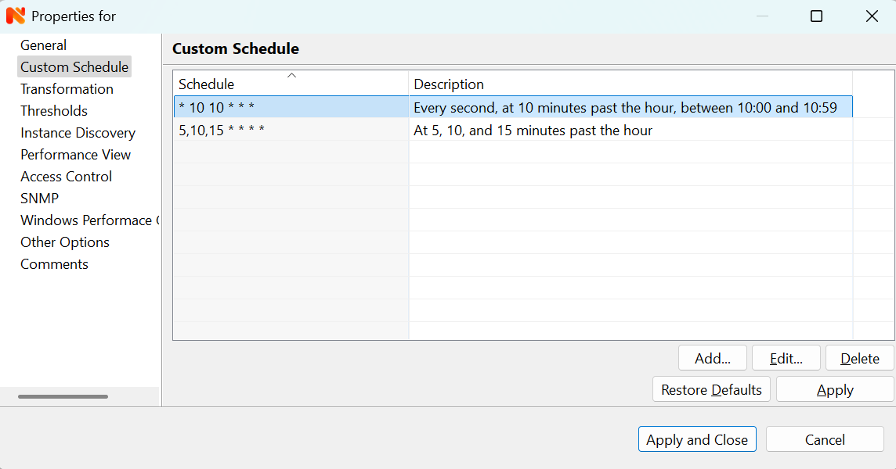

########
Appendix
########

.. _cron_format:

Cron format
===========

Record has five fields, separated by spaces: minute, hour, day of month, month,
and day of week. In DCI Collection Schedule only, an optional the sixth field
can be specified for resolution in seconds (this is a non-standard extension
which is not compatible with a regular cron format).

Allowed values and special characters for each field are:

+----------------------------+------------------------------+----------------------------+
| Field                      | Allowed values               | Allowed special characters |
+============================+==============================+============================+
| minute                     | 0 - 59                       | \* , - /                   |
+----------------------------+------------------------------+----------------------------+
| hour                       | 0 - 23                       | \* , - /                   |
+----------------------------+------------------------------+----------------------------+
| day of month               | 1 - 31                       | \* , - / L                 |
+----------------------------+------------------------------+----------------------------+
| month                      | 1 - 12                       | \* , - /                   |
+----------------------------+------------------------------+----------------------------+
| day of week                | 0 - 7 (0 and 7 is Sunday)    | \* , - / L                 |
+----------------------------+------------------------------+----------------------------+
| seconds (for DCI           | 0 - 59 (0 - unlimited for %) | \* , - / %                 |
| collection only, optional) |                              |                            |
+----------------------------+------------------------------+----------------------------+

A field may be an asterisk (``*``), which always stands for "any".

Commas (``,``) are used to separate items of a list. For example, using ``1,3,4``
in the 5th field (day of week) means Mondays, Wednesdays and Fridays.

Hyphens (``-``) define ranges. For example, using ``6-8`` in 4th field (month)
means June, July and August.

Slashes (``/``) can be combined with ranges to specify step values.
For example, ``*/5`` in the minutes field indicates every 5 minutes.
If a step value does not evenly divide it's range, there will be an
inconsistent "short" period at the end of time-unit.

``L`` stands for "last". When used in the day-of-week field, it allows
to specify constructs such as "the last Friday" ("5L") of a given month.
In the day-of-month field, it specifies the last day of the month.

The sixth field (but not others) supports additional stepping syntax with a
percent sign (``%``), which means that the step in seconds calculated in
absolute seconds since the Unix epoch (00:00:00 UTC, 1st of January, 1970).
It's not recommended to use seconds in custom schedules as your main data
collection strategy though. Use seconds only if it is absolutely necessary.

    DCI configuration custom schedule property page

Examples
--------

Run five minutes after midnight, every day:

  ``5 0 * * *``

Run at 14:15 on the first day of every month:

  ``15 14 1 * *``

Run every 5 minutes:

  ``*/5 * * * *``

Run every minute on 10th second:

  ``* * * * * 10``

Run twice a minute (on seconds 0 and 45):

  ``* * * * * */45``

Run every 45 seconds from Monday till Friday:

  ``* * * * 1-5 *%45``

SMS Drivers
===========
.. deprecated:: 3.0

SMS driver functionality replaces by notification channel functionality.
More can be found in :ref:`notification-channels` section.

.. _agent_configuration_file:

Agent configuration file (nxagentd.conf)
========================================

.. list-table::
   :widths: 21 35 24
   :header-rows: 1

   * - Parameter
     - Description
     - Default Value
   * - Action
     - Define action, which can be later executed by management server.
       Parameters to the action can be provided from the server. They can be
       accessed as ``$1``, ``$2``... variables. On Windows platform system
       process execution API's CreateProcess() is used to run the command, it
       will search in PATH, but the command should be with file extension, e.g.
       ``command.exe``. For more information please check :ref:`agent-actions`.
     - No defaults
   * - ActionShellExec
     - Same as Action, but on Windows platform agent will use shell to execute
       command instead of normal process creation. There is no difference
       between Action and ActionShellExec on UNIX platforms. Parameters to the
       action can be provided from the server. They can be accessed as ``$1``,
       ``$2``... variables. For more information please check :ref:`agent-actions`.
     - No defaults
   * - AppAgent
     - The registered name of application with built in subagent library that
       can be as subagent by agent.
     - No defaults
   * - AutoStartUserAgent
     - Enable (yes) or disable (no) automatic start of User Support Application
       (Windows only). If enabled, Agent will check on it's start, if User
       Support Application is running in each user session and will start it if
       needed. For this to work, Agent should be started under local SYSTEM
       user.
     - no
   * - BackgroundLogWriter
     - Enable (yes) or disable (no) log writer as separate background thread.
       Has no effect if logging is done through syslog or Windows Event Log.
     - no
   * - CodePage
     - Code page used by |product_name| agent. Has no effect on Windows or if
       agent was compiled without iconv support.
     - Depends on your system, usually ISO8859-1
   * - ConfigIncludeDir
     - Folder containing additional configuration files. **This parameter can
       only be specified in master configuration file and will be ignored if
       found in additional configuration files or configuration policy.**
     - See :ref:`additional-configuration-file-label` for information on default
       value.
   * - ControlServers
     - A list of management servers, which can execute actions on agent and
       change agent's config. Hosts listed in this parameter also have read
       access to the agent. Both IP addresses and DNS names can be used.
       Multiple servers can be specified in one line, separated by commas. If
       this parameter is used more than once, servers listed in all occurrences
       will have access to agent.
     - Empty list
   * - CreateCrashDumps
     - Enable (yes) or disable (no) creation of agent's crash dumps. Windows
       only
     - yes
   * - DataDirectory
     - Directory where additional agent files (log file monitoring policy files,
       agent configuration policy files, user agent configuration, local agent
       database, etc) will be stored. **This parameter can only be specified in
       master configuration file and will be ignored if found in additional
       configuration files or configuration policy.**
     - UNIX-like systems: If :file:`$NETXMS_HOME` environment variable is set:
       :file:`$NETXMS_HOME/var/lib/netxms`, otherwise :file:`/var/lib/netxms`.
       Windows: :file:`'AppData'\\nxagentd` where 'AppData' is AppData folder
       for the user account under which |product_name| agent is started. If
       agent runs under local SYSTEM user account, data directory is
       :file:`C:\\Windows\\System32\\ config\\systemprofile\\
       AppData\\Local\\nxagentd`.
   * - DailyLogFileSuffix
     - Log file name suffix used when ``LogRotationMode`` is set to 1 (daily),
       can contain `strftime(3C)
       <http://www.unix.com/man-page/opensolaris/3c/strftime/>`_ macros
     - %Y%m%d
   * - DebugLevel
     - Set agent debug logging level (0 - 9).  Value of 0 turns off debugging, 9
       enables very detailed logging.  Can also be set with command line
       "-D<level>" option.
     - 0
   * - DebugTags
     - Set agent debug logging level (0 - 9) for exact log tag or log tag mask.
       Value of 0 turns off debugging, 9 enables very detailed logging.
       Configuration should look like ``debugTag:logLevel`` (like
       ``db.conn:6``). To configure multiple log tags, you should use multiple
       DebugTags parameters or write them coma separated (like
       ``proc.spexec:8,tunnel.*:4,db.conn:6``).
     -
   * - DefaultExecutionTimeout
     - Timeout in milliseconds for external metric and external command
       execution. This value will be used for external metrics and external
       commands if ``ExternalCommandTimeout`` or ``ExternalMetricTimeout`` not
       set explicitly.
     - 2000
   * - DisableIPv4
     - Disables (yes) or enables(no) IPv4 support.
     - no
   * - DisableIPv6
     - Disables (yes) or enables(no) IPv6 support.
     - no
   * - DumpDirectory
     - Directory for storing crash dumps (Windows only).
     - C:\\
   * - EnableActions
     - Enable (yes) or disable (no) action execution by agent.
     - yes
   * - EnableArbitraryCommandExecution
     - **Not yet implemented.** Enables server to run any shell command on the
       agent without specifying it as action in agent's config file. Enabling
       this adds **System.Execute** action (and also
       **System.ExecuteInAllSessions** on Windows). 
     - no
   * - EnabledCiphers
     - Controls what ciphers agent can use for connection encryption. A value
       for this parameter is a cipher code. To enable more than one cipher, the
       codes should be summed up.

       Possible cipher codes:

       - 1  - "AES-256"
       - 2  - "BLOWFISH-256"
       - 4  - "IDEA"
       - 8  - "3DES"
       - 16 - "AES-128"
       - 32 - "BLOWFISH-128"

       Example (enable AES-256 and IDEA):

       **EnabledCiphers = 5**
     - 63
   * - EnableControlConnector
     - Enables named pipe used by the agent to receive shutdown and delayed
       restart commands. A command is sent by another instance of agent,
       launched with -k or -K parameter. Used on Windows during upgrade process.
     - yes
   * - EnableProxy
     - Enable (yes) or disable (no) agent proxy functionality.
     - no
   * - EnablePushConnector
     - Enables named pipe / unix socket used by the agent to receive data sent
       by nxapush command line tool.
     - yes
   * - EnableSNMPProxy
     - Enable (yes) or disable (no) SNMP proxy functionality.
     - no
   * - EnableSNMPTrapProxy
     - Enable (yes) or disable (no) SNMP Trap proxy functionality.
     - no
   * - EnableSSLTrace
     - Enable (yes) or disable (no) additional debug messages from SSL library.
     - no
   * - EnableSubagentAutoload
     - Enable (yes) or disable (no) automatic loading of subagent(s) depending
       on the platform on which the agent is running.
     - yes
   * - EnableSyslogProxy
     - Enable (yes) or disable (no) Syslog proxy functionality.
     - no
   * - EnableTCPProxy
     - Enable TCP proxy functionality that allows to forward TCP connections
       inside the connection between |product_name| server and agent. An example
       utility called TcpProxyApp that forwards local ports is provided.
     - no
   * - EnableWatchdog
     - Enable (yes) or disable (no) automatic agent restart in case of
       unexpected shutdown.
     - no
   * - EnableWebServiceProxy
     - Enable (yes) or disable (no) web service data collection proxy
       functionality.
     - no
   * - ExecTimeout
     - Deprecated, replaced by ``DefaultExecutionTimeout``
     - 
   * - ExternalCommandTimeout
     - External process execution timeout for external commands (actions) in
       milliseconds. Value of ``DefaultExecutionTimeout`` will be used if this
       parameter is not set.
     - 
   * - ExternalList
     - Add list handled by external command. To add multiple parameters, you
       should use multiple``ExternalList`` entries.
     - No defaults
   * - ExternalMasterAgent
     - ID that is checked when external subagent connects to master agent.
       Should have same value as ``ExternalSubagent`` parameter in external
       subagent configuration file.
     - No defaults
   * - ExternalMetric
     - Adds metric handled by external command. To add multiple metrics, you
       should use multiple ``ExternalMetric`` entries. On Windows platform
       system process execution API's CreateProcess() is used to run the
       command, it will search in PATH, but the command should be with file
       extension, e.g. ``command.exe``.
     - No defaults
   * - ExternalMetricProvider
     - Specifies external command and execution interval after semicolon (:).
       External command returns a number of metrics and their values. Metrics
       are cached by the agent and returned to server per request. Command
       should return data in *metric=value* format each pair in new line.
     - No defaults
   * - ExternalMetricProviderTimeout
     - Timeout in seconds for external metric provider and background-polled
       external table execution
     - 30
   * - ExternalMetricShellExec
     - ExternalMetricShellExec has same meaning as ExternalMetric with exception
       that agent will use shell to execute specified command instead of system
       process execution API. This difference presented only on Windows system,
       on other systems ExternalMetric and ExternalMetricShellExec behaves
       identically.
     - No defaults
   * - ExternalMetricTimeout
     - Timeout in milliseconds for external metrics. Value of
       ``DefaultExecutionTimeout`` will be used if this parameter is not set.
     - 
   * - ExternalParameter
     - Deprecated, replaced by ``ExternalMetric``
     - 
   * - ExternalParameterProvider
     - Deprecated, replaced by ``ExternalMetricProvider``
     - 
   * - ExternalParametersProvider
     - Deprecated, replaced by ``ExternalMetricProvider``
     - 
   * - ExternalParameterProviderTimeout
     - Deprecated, replaced by ``ExternalMetricProviderTimeout``
     - 
   * - ExternalParameterShellExec
     - Deprecated, replaced by ``ExternalMetricShellExec``
     - 
   * - ExternalSubagent
     - ID of external subagent. Should be same as ``ExternalMasterAgent`` in
       master agent configuration file.
     - No defaults
   * - ExternalTable
     - Adds table metric handled by external command. To add multiple
       parameters, you should use multiple ``ExternalTable`` entries. See
       :ref:`agent-external-parameter` for more information.
     - No defaults
   * - FileStore
     - Directory to be used for storing files uploaded by management server(s).
       It's value is set to environment variable NETXMS_FILE_STORE that is
       available to all processed launched by agent.
     - :file:`/tmp` on UNIX :file:`C:\\` on Windows
   * - FullCrashDumps
     - Enable (yes) or disable (no) full crash dump generation. Windows only
     - no
   * - GroupId
     - GroupId under which |product_name| agent is started (Unix only). See also
       ``UserId`` parameter.
     - No defaults
   * - ListenAddress
     - IP address that the agent should listen on. If 0.0.0.0 or * is specified
       as listen address, agent will listen on all available IP addresses.
     - 0.0.0.0
   * - ListenPort
     - TCP port to be used for incoming requests.
     - 4700
   * - LogFile
     - Agent's log file. To write log to syslog (or Event Log on Windows), use
       {syslog} as file name.
     - :file:`/var/log/nxagentd` on UNIX :file:`{syslog}` on Windows
   * - LogHistorySize
     - Defines how many old log files should be kept after log rotation.
     - 4
   * - LogRotationMode
     - Define log rotation mode. Possible values are:

       - 0  - No rotation;
       - 1  - Daily rotation (log will be rotated every midnight);
       - 2  - Rotation by size (log will be rotated when it's size will exceed
         value defined by MaxLogSize parameter).

     - 2
   * - LogUnresolvedSymbols
     - If set to yes, all dynamically resolved symbols, which failed to be
       resolved, will be logged.
     - no
   * - LongRunningQueryThreshold
     - Expressed in milliseconds. If a query to agent's local database or
       DBQuery subagent query takes longer then this time, the query will be
       logged to agent log file.
     - 250
   * - MasterServers
     - List of management servers, which have full access to agent. Hosts listed
       in this group can upload files to agent and initiate agent upgrade, as
       well as perform any task allowed for hosts listed in Servers and
       ControlServers. Both IP addresses and DNS names can be used. Multiple
       servers can be specified in one line, separated by commas. If this
       parameter is used more than once, servers listed in all occurrences will
       have access to agent.
     - Empty list
   * - MaxLogSize
     - Maximum log size, in bytes. When log file reaches this limit, log
       rotation occurs. Use 0 to disable log rotation. This parameter supports
       (K, M, G, T suffixes).
     - 16M
   * - MaxSessions
     - Maximum number of simultaneous communication sessions. Possible value can
       range from 2 to 1024.
     - 32
   * - OfflineDataExpirationTime
     - Applicable only if Agent Cache Mode is on. Defines the duration (in days)
       for how collected data will be stored in agent's database if there is no
       connection to NetXMS server.
     - 10
   * - PlatformSuffix
     - String to be added as suffix to the value of ``System.PlatformName``
       parameter.
     - Empty string
   * - RequireAuthentication
     - If set to yes, a host connected to an agent has to provide correct shared
       secret before issuing any command.
     - no
   * - RequireEncryption
     - If set to yes, a host connected to an agent will be forced to use
       encryption, and if encryption is not supported by a remote host, the
       connection will be dropped. If an agent was compiled without encryption
       support, this parameter has no effect.
     - no
   * - ServerConnection
     - IP address or host name of |product_name| server for tunnel agent
       connection. Several such parameters can be present, in this case agent
       will establish tunnel connection to more then one server. 
     - No defaults
   * - [ServerConnection]
     - Section with parameters for for tunnel agent connection. Several such
       sections can be present. See :ref:`agent-to-server-agent-conf-label` for
       more information. 
     - No defaults
   * - Servers
     - A list of management servers, which have read access to this agent. Both
       IP addresses and DNS names can be used. Multiple servers can be specified
       in one line, separated by commas. If this parameter is used more than
       once, servers listed in all occurrences will have access to agent.
     - Empty list
   * - SessionIdleTimeout
     - Communication session idle timeout in seconds. If an agent will not
       receive any command from peer within the specified timeout, session will
       be closed.
     - 60
   * - SharedSecret
     - Agent's shared secret used for remote peer authentication. If
       ``RequireAuthentication`` set to no, this parameter has no effect.
     - admin
   * - EncryptedSharedSecret
     - Agent's shared secret used for remote peer authentication, encrypted
       using "nxencpasswd -a". If ``RequireAuthentication`` set to no, this
       parameter has no effect.
     -
   * - SNMPProxyThreadPoolSize
     - SNMP proxy thread pool size
     - 128
   * - SNMPTimeout
     - Timeout in milliseconds for SNMP requests sent by agent
     - 3000
   * - SNMPTrapListenAddress
     - Interface address which should be used by server to listen for incoming
       SNMP trap connections. Use value 0.0.0.0 or * to use all available
       interfaces.
     - ``*``
   * - SNMPTrapPort
     - Port that will be used to listen SNMP traps
     - 162
   * - StartupDelay
     - Number of seconds that agent should wait on startup before start
       servicing requests. This parameter can be used to prevent false reports
       about missing processes or failed services just after monitored system
       startup.
     - 0
   * - SubAgent
     - Subagent to load. To load multiple subagents, you should use multiple
       SubAgent parameters. Subagents will be loaded in the same order as they
       appear in configuration file.
     - No defaults
   * - SyslogListenPort
     - Listening port number for syslog proxy functionality.
     - 514
   * - SystemName
     - If tunnel agent connection is used, the system appears in
       :guilabel:`Agent Tunnel Manager` under that name.
     - ``localhost`` is used by default
   * - TrustedRootCertificate
     - Path to file or folder with root certificate used to verify certificate
       chain in tunnel connection. 
     - See :ref:`agent-to-server-agent-conf-label` for information on default
       locations
   * - TunnelKeepaliveInterval
     - Interval (in seconds) between keepalive packets over tunnel agent
       connection.
     - 30
   * - UserAgentExecutable
     - Name of User Support Application executable used by AutoStartUserAgent
       and UserAgentWatchdog parameters.
     - nxuseragent.exe
   * - UserAgentWatchdog
     - Enable (yes) or disable (no) automatic restart of User Support
       Application (Windows only). If enabled, Agent will check once per minute,
       if User Support Application is running in each user session and will
       start it if needed. For this to work, Agent should be started under local
       SYSTEM user.
     - no
   * - UserId
     - Username under which |product_name| agent is started (Unix only). See
       also ``GroupId`` parameter.
     - No defaults
   * - VerifyServerCertificate
     - Perform server certificate chain verification when establishing tunnel
       connection. See :ref:`agent-to-server-agent-conf-label` for more
       information. 
     - no
   * - WaitForProcess
     - If specified, an agent will pause initialization until given process
       starts.
     - No defaults
   * - WriteLogAsJson
     - Enable (yes) or disable (no) writing log file in JSON format.
     - no
   * - ZoneUIN
     - Allows to set agent's zone explicitly. This can be useful when agent
       forwards syslog or SNMP traps of devices, that belong to a particular
       zone. Agent will include zone UIN along with the trap message that will
       allow correct matching of traps.
     - No defaults

.. note::
  All boolean parameters understand "Yes/No", "On/Off" and "True/False" values.

.. _server_configuration_file:

Server configuration file (netxmsd.conf)
========================================

.. list-table::
  :widths: 20 40 25
  :header-rows: 1
  :class: longtable

  * - Parameter
    - Description
    - Default Value
  * - CodePage
    - Code page used by |product_name| server. Has no effect on Windows or if server was compiled without iconv support.
    - Depends on your system, usually ISO8859-1
  * - CreateCrashDumps
    - Control creation of server's crash dumps. Possible values: yes or no. Has effect only on Windows platforms.
    - No
  * - DailyLogFileSuffix
    - Log file name suffix used when ``LogRotationMode`` is set to 1 (daily), can contain `strftime(3C) <http://www.unix.com/man-page/opensolaris/3c/strftime/>`_ macros
    - %Y%m%d
  * - DataDirectory
    - Directory where server looks for compiled MIB files, keep server encryption key, etc.
    - On UNIX-like platforms: :file:`'prefix'/var/lib/netxms`. 'prefix' is set during build configuration with ``--prefix='prefix'`` parameter. If that parameter was not specified during build, ``/usr/local`` is used.
      If installed from .deb packages: :file:`/var/lib/netxms`.
      On Windows: :file:`'Installation folder'\\netxms\\var` where 'Installation folder' is the folder to which |product_name| server is installed.
  * - DBDriver
    - Database driver to be used.
    - No default value
  * - DBEncryptedPassword
    - Hashed password, as produced by "nxencpass"
    - none
  * - DBDrvParams
    - Additional driver-specific parameters.
    - Empty string
  * - DBLogin
    - Database user name.
    - netxms
  * - DBName
    - Database name (not used by ODBC driver).
    - netxms_db
  * - DBPassword
    - Database user's password. When using INI configuration file remember to enclose password in double qoutes ("password") if it contains # character.
    - Empty password
  * - DBSchema
    - Schema name
    - not set
  * - DBSessionSetupSQLScript
    - Path to a plain text file containing a list of SQL commands which will be executed on every new database connection, including initial connection on server startup. 
    - Empty string
  * - DBServer
    - Database server (ODBC source name for ODBC driver).
    - localhost
  * - DebugLevel
    - Set server debug logging level (0 - 9).  Value of 0 turns off debugging, 9 enables very detailed logging.  Can also be set with command line ``-D <level>`` option.
    - 0
  * - DebugTags
    - Set server debug logging level (0 - 9) for exact log tag or log tag mask. Value of 0 turns off debugging, 9 enables very detailed logging. Configuration should look like ``debugTag:logLevel`` (like ``agent.tunnel.*:4``). To configure multiple log tags, you should use multiple DebugTags parameters or write them coma separated (like ``crypto.*:8,agent.tunnel.*:4``).
    -
  * - DumpDirectory
    - Directory for storing crash dumps.
    - "/" or "C:\"
  * - FullCrashDumps
    - Write full crash dump instead of minidump (Windows only)
    - no
  * - InternalCACertificate
    - Path to file of server CA certificate. This certificate is used to issue 
      agent certificates. InternalCACertificate parameter also implies that this 
      certificate is trusted by the server when checking agent certificate validity.
    - Empty string
  * - InternalCACertificateKey
    - Private key of server CA certificate. Can be omitted if key is included in
      server certificate file.
    - Empty string
  * - InternalCACertificatePassword
    - Password of server CA certificate. Can be omitted if certificate does not use 
      password.
    - Empty string
  * - LibraryDirectory
    - Defines location of library folder where drivers(ndd files) are stored. It's highly recommended not to use this parameter.
    -
  * - ListenAddress
    - Interface address which should be used by server to listen for incoming connections. Use value 0.0.0.0 or * to use all available interfaces.
    - 0.0.0.0
  * - LogFile
    - Server's log file. To write log to syslog (or Event Log on Windows), use {syslog} as file name.
    - {syslog}
  * - LogHistorySize
    - Number rotated files to keep, older will be discarded
    - 4
  * - LogRotationMode
    - Define log rotation mode.
      Possible values are:

      - 0  - No rotation;
      - 1  - Daily rotation (log will be rotated every midnight);
      - 2  - Rotation by size (log will be rotated when it's size will exceed value defined by MaxLogSize parameter).

    - 2
  * - MaxLogSize
    - Maximum log file size in bytes, used only if ``LogRotationMode`` is set to 2
    - 16777216
  * - Module
    - Additional server module to be loaded at server startup. To load multiple modules, add additional Module parameters.
    - No default value
  * - PeerNode
    - IP address of peer node in high availability setup. If there is lock in 
      the database with this address indicated, server process will communicate
      to agent and server on that address to check if server is not running
      and will remove database lock.
    - No default value
  * - PerfDataStorageDriver
    -
    -
  * - ProcessAffinityMask
    - Sets a processor affinity mask for the netxmsd process (Windows only). A process affinity mask is a bit vector in which each bit represents a logical processor on which the threads of the process are allowed to run. See `this MSDN article <http://msdn.microsoft.com/en-us/library/windows/desktop/ms686223%28v=vs.85%29.aspx>`_ for more details.
    - 0xFFFFFFFF
  * - StartupSQLScript
    - Path to a plain text file containing a list of SQL commands which will be executed on server startup. 
    - Empty string
  * - ServerCertificate
    - Path to file of server certificate for agent tunnel connections. This
      certificate is used to issue agent certificates. ServerCertificate
      parameter also implies that this certificate is trusted by the server when
      checking agent certificate validity.
    - Empty string
  * - ServerCertificateKey
    - Private key of server certificate. Can be omitted if key is included in
      server certificate file.
    - Empty string
  * - ServerCertificatePassword
    - Password of server certificate. Can be omitted if certificate does not use 
      password.
    - Empty string
  * - TrustedCertificate
    - Certificate issued by certificate authority or self-signed CA certificate.
      If certificate chain for server certificate is longer, all upper level
      certificates should be added to configuration file by adding multiple
      TrustedCertificate entries.
    - Empty string
  * - TunnelCertificate
    - Path to file of server certificate for agent tunnel connections. 
    - Empty string
  * - TunnelCertificateKey
    - Private key of server tunnel certificate. Can be omitted if key is included in
      server certificate file.
    - Empty string
  * - TunnelCertificatePassword
    - Password of server tunnel certificate. Can be omitted if certificate does not use 
      password.
    - Empty string

.. note::
  All boolean parameters accept "Yes/No", "On/Off" and "True/False" values.

.. _server_configuration_parameters:

Server configuration parameters
===============================

These parameters can be changed in
:menuselection:`Configuration --> Server Configuration`

.. list-table::
  :widths: 30 37 10 8
  :header-rows: 1

  * - Parameter
    - Description
    - Default Value
    - Require Restart
  * - Agent.RestartWaitTime
    - Period of time (in seconds) after agent restart for which server will not perform status, congiration, and other polls on the agent. 
    - 0
    - No
  * - AgentCommandTimeout
    - Timeout in milliseconds for commands sent to agent. If agent did not respond to command within this time, command considered as failed.
    - 2000
    - Yes
  * - AgentTunnels.ListenPort
    - TCP port number to listen on for incoming agent tunnel connections
    - 4703
    - Yes
  * - AgentTunnels.NewNodesContainer
    - Name of the container where nodes that were created automatically for unbound tunnels will be placed. If several containers with that name are present, it is not guaranteed, which container will be selected. If empty, such nodes will be created in infrastructure services root.
    -
    - No
  * - AgentTunnels.UnboundTunnelTimeout
    - Unbound agent tunnels inactivity timeout. If tunnel has not been bound or closed after that timeout, action defined by AgentTunnels.UnboundTunnelTimeoutAction parameter will be taken.
    - 3600
    - No
  * - AgentTunnels.UnboundTunnelTimeoutAction
    - Action to be taken when unbound agent tunnel timeout expires.
    - Reset Tunnel
    - No
  * - AgentUpgradeWaitTime
    - Maximum wait time in seconds for agent restart after upgrade. If agent cannot be contacted after this time period, upgrade process is considered as failed.
    - 600
    - No
  * - AlarmHistoryRetentionTime
    - Number of days the server keeps alarm history in the database.
    - 180
    - No
  * - Alarms.IgnoreHelpdeskState
    - If set, alarm helpdesk state will be ignored when resolving or terminating.
    - 0
    - No
  * - Alarms.ResolveExpirationTime
    - Expiration time (in seconds) for resolved alarms. If set to non-zero, resolved and untouched alarms will be terminated automatically after given timeout.
    - 0
    - No
  * - AlarmSummaryEmailRecipients
    - A semicolon separated list of e-mail addresses to which the alarm summary will be sent.
    -
    - No
  * - AlarmSummarySchedule
    - Schedule for sending alarm summary e-mails in cron format. See :ref:`cron_format` for supported cron format options.
    - 0 0 * * *
    - No
  * - AllowedCiphers
    - A bitmask for encryption algorithms allowed in the server
      (sum of the values to allow multiple algorithms at once):

        - 1 - AES256
        - 2 - Blowfish-256
        - 4 - IDEA
        - 8 - 3DES
        - 16 - AES128
        - 32 - Blowfish-128
    - 63
    - Yes
  * - ApplyDCIFromTemplateToDisabledDCI
    - Set to 1 to apply all DCIs from a template to the node, including disabled ones.
    - 1
    - Yes
  * - AuditLogRetentionTime
    - Retention time in days for the records in audit log. All records older than specified will be deleted by housekeeping process.
    - 90
    - No
  * - Beacon.Hosts
    - Comma-separated list of hosts to be used as beacons for checking |product_name| server network connectivity. Either DNS names or IP addresses can be used. This list is pinged by |product_name| server and if none of the hosts have responded, server considers that connection with network is lost and generates specific event.
    -
    - Yes
  * - Beacon.PollingInterval
    - Interval in milliseconds between beacon hosts polls.
    - 1000
    - Yes
  * - Beacon.Timeout
    - Timeout in milliseconds to consider beacon host unreachable.
    - 1000
    - Yes
  * - BlockInactiveUserAccounts
    - Inactivity time after which user account will be blocked (0 to disable blocking).
    - 0
    - No
  * - CAS.AllowedProxies
    - Comma-separated list of allowed CAS (Central Authentication Service) proxies.
    -
    - No
  * - CAS.Host
    - CAS server DNS name or IP address.
    - localhost
    - No
  * - CAS.Port
    - CAS server TCP port number.
    - 8443
    - No
  * - CAS.Service
    - Service to validate (usually NetXMS web UI URL).
    - https://127.0.0.1/nxmc
    - No
  * - CAS.TrustedCACert
    - File system path to CAS server trusted CA certificate.
    -
    - No
  * - CAS.ValidateURL
    - URL for service validation on CAS server.
    - /cas/serviceValidate
    - No
  * - CaseInsensitiveLoginNames
    - Enable/disable case insensitive login names.
    - 0
    - Yes
  * - CheckTrustedNodes
    - Enable/disable checking of trusted nodes list for cross-node data collection (using Proxy Node DCI attribute).
    - 1
    - No
  * - Client.AlarmList.DisplayLimit
    - Maximum alarm count that will be displayed on :guilabel:`Alarm Browser` page. Alarms that exceed this count will not be shown.
    - 4096
    - No
  * - Client.MinViewRefreshInterval
    - Minimal interval between view refresh in milliseconds (hint for client).
    - 300
    - No
  * - Client.ObjectBrowser.AutoApplyFilter
    - Enable/disable object browser''s filter applying as user types (if disabled, user has to press ENTER to apply filter).
    - 1
    - No
  * - Client.ObjectBrowser.FilterDelay
    - Delay (in milliseconds) between typing in object browser''s filter and applying it to object tree.
    - 300
    - No
  * - Client.ObjectBrowser.MinFilterStringLength
    - Minimal length of filter string in object browser required for automatic apply.
    - 1
    - No
  * - ClientListenerPort
    - The server port for incoming client connections (such as management console).
    - 4701
    - Yes
  * - ClusterContainerAutoBind
    - Enable/disable  container auto binding for clusters.
    - 0
    - No
  * - ClusterTemplateAutoApply
    - Enable/disable template auto apply for clusters.
    - 0
    - No
  * - ConditionPollingInterval
    - Interval in seconds between polling (re-evaluating) of condition objects.
    - 60
    - Yes
  * - ConfigurationPollingInterval
    - Interval in seconds between node configuration polls.
    - 3600
    - Yes
  * - DashboardDataExportEnableInterpolation
    - Enable/disable data interpolation in dashboard data export.
    - 1
    - Yes
  * - DataCollection.OnDCIDelete.TerminateRelatedAlarms
    - Enable/disable automatic termination of related alarms when data collection item is deleted.
    - 1
    - No
  * - DataCollection.ScriptErrorReportInterval
    - Minimal interval (seconds) between reporting errors in data collection related script.
    - 86400
    - No
  * - DataCollection.StartupDelay
    - Enable/disable randomized data collection delays on server startup for more even server load distribution.
    - 0
    - Yes
  * - DBConnectionPoolBaseSize
    - Number of connections to the database created on the server startup.
    - 10
    - Yes
  * - DBConnectionPoolCooldownTime
    - Inactivity time (in seconds) after which database connection will be closed.
    - 300
    - Yes
  * - DBConnectionPoolMaxLifetime
    - Maximum lifetime (in seconds) for a database connection.
    - 14400
    - Yes
  * - DBConnectionPoolMaxSize
    - Maximum number of connections in the connection pool.
    - 30
    - Yes
  * - DBWriter.DataQueues
    - Number of queues for DCI data writer.
    - 1
    - Yes
  * - DBWriter.HouseKeeperInterlock
    - Controls if server should block background write of collected performance data while housekeeper deletes expired records. Auto enables this feature is server is running on MsSQL database.
    - Auto
    - No
  * - DBWriter.MaxQueueSize
    - Maximum size for DCI data writer queue (0 to disable size limit). If writer queue size grows above that threshold any new data will be dropped until queue size drops below threshold again.
    - 0
    - No
  * - DBWriter.MaxRecordsPerStatement
    - Maximum number of records per one SQL statement for delayed database writes
    - 100
    - Yes
  * - DBWriter.MaxRecordsPerTransaction
    - Maximum number of records per one transaction for delayed database writes
    - 1000
    - Yes
  * - DefaultAgentCacheMode
    - Default agent cache mode
    - Off
    - Yes
  * - DefaultAgentProtocolCompressionMode
    - Default agent protocol compression mode
    - Enabled
    - No
  * - DefaultConsoleDateFormat
    - Default format to display date in console GUI.
    - dd.MM.yyyy
    - No
  * - DefaultConsoleShortTimeFormat
    - Default format to display time in a short way in console GUI.
    - HH:mm
    - No
  * - DefaultConsoleTimeFormat
    - Default format to display time in a long way in console GUI.
    - HH:mm:ss
    - No
  * - DefaultDCIPollingInterval
    - Default polling interval for newly created DCI (in seconds).
    - 60
    - No
  * - DefaultDciRetentionTime
    - Default retention time for newly created DCI (in days).
    - 30
    - No
  * - DefaultEncryptionPolicy
    - Set the default encryption policy for communications with agents: 0 - encryption disabled, 1 - allowed, 2 - preferred, 3 - required.
    - Allowed
    - Yes
  * - DefaultMapBackgroundColor
    - Default background color for new network map objects (as RGB value).
    - 0xffffff
    - No
  * - DefaultMapBackgroundColor
    - Default background color for new network map objects (as RGB value).
    - 0xffffff
    - No
  * - DefaultNotificationChannel.SMTP.Html
    - Default notification channel for SMTP HTML formatted messages.
    - SMTP-HTML
    - Yes
  * - DefaultNotificationChannel.SMTP.Text
    - Default notification channel for SMTP text formatted messages.
    - SMTP-Text
    - Yes
  * - DefaultSubnetMaskIPv6
    - Default mask for synthetic IPv6 subnets.
    - 64
    - No
  * - DeleteAlarmsOfDeletedObject
    - Enable/disable automatic alarm removal of an object when it is deleted.
    - 1
    - No
  * - DeleteEmptySubnets
    - Enable/disable automatic deletion of subnet objects that have no nodes within. When enabled, empty subnets will be deleted by housekeeping process.
    - 0
    - Yes
  * - DeleteEventsOfDeletedObject
    - Enable/disable automatic event removal of an object when it is deleted.
    - 1
    - No
  * - DeleteUnreachableNodesPeriod
    - Delete nodes which were unreachable for a number of days specified by this parameter. If this parameter is set to 0 then unreachable nodes will never be deleted.
    - 0
    - Yes
  * - DiscoveryFilter
    - Name of discovery filter script from script library.
      **This setting is changed by Network Discovery Configuration GUI**
    - none
    - No
  * - DiscoveryFilterFlags
    - Discovery filter settings.
      **This setting is changed by Network Discovery Configuration GUI**
    - 0
    - No
  * - EnableAgentRegistration
    - Enable/disable agents self-registration.
    - 1
    - No
  * - EnableAlarmSummaryEmails
    - Enable/disable alarm summary emails. Summary emails will be sent via notification channel specified in DefaultNotificationChannel.SMTP.Html server configuration parameter.
    - 0
    - No
  * - EnableAuditLog
    - Enable/disable audit log.
    - 1
    - Yes
  * - EnableISCListener
    - Enable/disable Inter-Server Communications Listener.
    - 0
    - Yes
  * - EnableReportingServer
    - Enable/disable reporting server
    - 0
    - Yes
  * - EnableTimedAlarmAck
    - Enable/disable ability to acknowledge an alarm for a specific time.
    - 1
    - Yes
  * - EnableZoning
    - Enable/disable zoning support.
    - 0
    - Yes
  * - EscapeLocalCommands
    - Enable/disable TAB and new line characters replacement by \t \n \r in execute command on management server action.
    - 0
    - No
  * - EventLogRetentionTime
    - Retention time in days for the records in event log. All records older than specified will be deleted by housekeeping process.
    - 90
    - No
  * - Events.Correlation.TopologyBased
    - Enable/disable topology based event correlation.
    - 1
    - Yes
  * - Events.Processor.PoolSize
    - Number of threads for parallel event processing.
    - 1
    - Yes
  * - Events.Processor.QueueSelector
    - Queue selector for parallel event processing. In parallel processing server ensures that events having same queue selector will be processed in one queue.
    - Yes
    - %z
  * - EventStorm.Duration
    - Time period for events per second to be above threshold that defines event storm condition.
    - 15
    - Yes
  * - EventStorm.EnableDetection
    - Enable/disable event storm detection.
    - 0
    - Yes
  * - EventStorm.EventsPerSecond
    - Threshold for number of events per second that defines event storm condition.
    - 1000
    - Yes
  * - ExtendedLogQueryAccessControl
    - Enable/disable extended access control in log queries. When enabled, server will check user's access to objects and only select those log records where user has read access to related object. Please note that enabling this option can cause slow and inefficient SQL queries depending on number of objects and actual access right assignment.
    - 0
    - No
  * - ExternalAuditFacility
    - Syslog facility to be used in audit log records sent to external server.
    - 13
    - Yes
  * - ExternalAuditPort
    - UDP port of external syslog server to send audit records to.
    - 514
    - Yes
  * - ExternalAuditServer
    - External syslog server to send audit records to. If set to ''none'', external audit logging is disabled.
    - none
    - Yes
  * - ExternalAuditSeverity
    - Syslog severity to be used in audit log records sent to external server.
    - 5
    - Yes
  * - ExternalAuditTag
    - Syslog tag to be used in audit log records sent to external server.
    - netxmsd-audit
    - Yes
  * - FixedStatusValue
    - Value for status propagation if ''StatusPropagationAlgorithm'' server configuration parameter is set to ''2 - Fixed''.
    - 0
    - Yes
  * - GraceLoginCount
    - Number of times a user can login if password has been expired.
    - 5
    - No
  * - HelpDeskLink
    - Helpdesk driver name. If ''none'', then no helpdesk driver is in use.
    - none
    - Yes
  * - Housekeeper.DisableCollectedDataCleanup
    - Disable automatic cleanup of collected DCI data during housekeeper run.
    - 0
    - No
  * - Housekeeper.StartTime
    - Time when housekeeper starts. Housekeeper deletes expired log recored and DCI data as well as cleans removed objects.
    - 02:00
    - Yes
  * - Housekeeper.Throttle.HighWatermark
    - If database writer queue length (in queue elements) exceeds this number, housekeeper process is paused.
    - 250000
    - No
  * - Housekeeper.Throttle.LowWatermark
    - If housekeeper got paused due to DB writer queue reaching Housekeeper.Throttle.HighWatermark, it will resume operation when DB writer queue becomes lower then this setting.
    - 50000
    - No
  * - ICMP.CollectPollStatistics
    - Collect ICMP poll statistics for all nodes by default. See :ref:`icmp-ping` chapter for information.
    - 1
    - No
  * - ICMP.PingSize
    - Size of ICMP packets (in bytes, excluding IP header size) used for status polls.
    - 46
    - Yes
  * - ICMP.PingTimeout
    - Timeout for ICMP ping used for status polls (in milliseconds).
    - 1500
    - Yes
  * - ICMP.PollingInterval
    - Interval between ICMP statistic collection polls (in seconds)
    - 60
    - No
  * - ICMP.StatisticPeriod
    - Time period for collecting ICMP statistics (in number of polls).
    - 60
    - No
  * - ImportConfigurationOnStartup
    - Import configuration (templates, events, object tools, etc) on server startup. Configuration is imported from
      files located on |product_name| server in share/templates. Missing elements are identified by GUID.
    - Only missing elements
    - Yes
  * - InstancePollingInterval
    - Instance polling interval (in seconds).
    - 600
    - Yes
  * - InstanceRetentionTime
    - Default retention time (in days) for missing DCI instances.
    - 0
    - Yes
  * - InternalCA
    - Enable/disable internal certificate authority.
    - 0
    - Yes
  * - IntruderLockoutThreshold
    - Number of incorrect password attempts after which a user account is temporarily locked.
    - 0
    - No
  * - IntruderLockoutTime
    - Duration of user account temporarily lockout (in minutes) if allowed number of incorrect password attempts was exceeded.
    - 30
    - No
  * - Jira.IssueType
    - Jira issue type
    - Task
    - No
  * - Jira.Login
    - Jira login
    - netxms
    - No
  * - Jira.Password
    - Jira password
    -
    - No
  * - Jira.ProjectCode
    - Jira project code
    - NETXMS
    - No
  * - Jira.ProjectComponent
    - Jira project component
    -
    - No
  * - Jira.ResolvedStatus
    - Comma separated list of issue status codes indicating that issue is resolved.
    -
    - No
  * - Jira.ServerURL
    - The URL of Jira server
    - http://localhost
    - No
  * - Jira.Webhook.Path
    - Path part of Jira webhook URL (must start with /).
    - /jira-webhook
    - Yes
  * - Jira.Webhook.Port
    - Jira webhook listener port (0 to disable webhook).
    - 8008
    - Yes
  * - KeepAliveInterval
    - Interval in seconds between sending keep alive packets to connected clients.
    - 60
    - Yes
  * - LDAP.ConnectionString
    - The LdapConnectionString configuration parameter may be a comma- or
      whitespace-separated list of URIs containing only the schema, the host, and the
      port fields. Apart from ldap, other (non-standard) recognized values of the
      schema field are ldaps (LDAP over TLS), ldapi (LDAP over IPC), and cldap
      (connectionless LDAP). If other fields are present, the behavior is undefined.
      Format: schema://host:port. For more information refer to :ref:`ldap` chapter.
    - ldap://localhost:389
    - No
  * - LDAP.GroupClass
    - Specifies which object class represents group objects. If found entry will not be of a user or group class, it will be ignored.
    -
    - No
  * - LDAP.GroupMappingName
    - The name of an attribute whose value will be used as group's login name
    -
    - No
  * - LDAP.GroupUniqueId
    - Unique identifier for LDAP group object. If not set, LDAP users are identified by DN.
    -
    - No
  * - LDAP.MappingDescription
    - The name of an attribute whose value will be used as a user's description.
    -
    - No
  * - LDAP.MappingFullName
    - The name of an attribute whose value will be used as a user's full name.
    - displayName
    - No
  * - LDAP.PageSize
    - The maximum amount of records that can be returned in one search page.
    - 1000
    - No
  * - LDAP.SearchBase
    - The DN of the entry at which to start the search.
    -
    - No
  * - LDAP.SearchFilter
    - A string representation of the filter to apply in the search.
    -
    - No
  * - LDAP.SyncInterval
    - The synchronization interval (in minutes) between the NetXMS server and the LDAP server. If the parameter is set to 0, no synchronization will take place.
    - 0
    - No
  * - LDAP.SyncUser
    - User login for LDAP synchronization
    -
    - No
  * - LDAP.SyncUserPassword
    - User password for LDAP synchronization
    -
    - No
  * - LDAP.UserClass
    - The object class which represents user objects. If the found entry is not of user or group class, it will be ignored.
    -
    - No
  * - LDAP.UserDeleteAction
    - This parameter specifies what should be done while synchronization with deleted from LDAP user/group. 0 - if user should be just deleted from |product_name| DB. 1 - if it should be disabled. If it is chosen to disable user, then on LDAP sync user will be disabled and it’s description will be change on “LDAP entry was deleted.” Afterwards this user/group can be detached from LDAP and enabled if it is required or just deleted manually.
    - 1
    - No
  * - LDAP.UserMappingName
    - The name of an attribute whose value will be used as a user's login name.
    -
    - No
  * - LDAP.UserUniqueId
    - Unique identifier for LDAP user object. If not set, LDAP users are identified by DN.
    -
    - No
  * - LongRunningQueryThreshold
    - Threshold in milliseconds to report long running SQL queries (0 to disable). Queries are logged to |product_name| server log file on debug level 3.
    - 0
    - Yes
  * - MailEncoding
    - Encoding for mails generated by |product_name| server.
    - utf8
    - No
  * - MessageOfTheDay
    - Message to be shown when a user logs into the console.
    -
    - No
  * - MinPasswordLength
    - Default minimum password length for a |product_name| user. The default applied only if per-user setting is not defined.
    - 0
    - No
  * - MobileDeviceListenerPort
    - Listener port for connections from |product_name| mobile agent.
    - 4747
    - Yes
  * - NetworkDeviceDrivers.BlackList
    - Comma separated list of blacklisted network device drivers.
    -
    - Yes
  * - NetworkDiscovery.ActiveDiscovery.BlockSize
    - Size of address block to which ICMP ping requests are sent simultaneously during active discovery.
    - 1024
    - No
  * - NetworkDiscovery.ActiveDiscovery.InterBlockDelay
    - Pause in milliseconds between scanning of blocks during active discovery.
      Together with BlockSize this allows to slow down active discovery if network equipment treats large number of ICMP requests as flood.
    - 0
    - No
  * - NetworkDiscovery.ActiveDiscovery.Interval
    - Interval in seconds between active network discovery polls.
      **This setting is changed by Network Discovery Configuration GUI**
    - 7200
    - No
  * - NetworkDiscovery.ActiveDiscovery.Schedule
    - Active network discovery poll schedule in cron format.
      **This setting is changed by Network Discovery Configuration GUI**
    -
    - No
  * - NetworkDiscovery.EnableParallelProcessing
    - Enable/disable parallel processing of discovered addresses.
    - 0
    - No
  * - NetworkDiscovery.MergeDuplicateNodes
    - Enable/disable merging of duplicate nodes (that may be created due to parallel processing of discovered addresses).
    - 0
    - No
  * - NetworkDiscovery.PassiveDiscovery.Interval
    - Interval in seconds between passive network discovery polls.
      **This setting is changed by Network Discovery Configuration GUI**
    - 900
    - No
  * - NetworkDiscovery.Type
    - Defines enabled modes of network discovery.
      **This setting is changed by Network Discovery Configuration GUI**
    - Disabled
    - No
  * - NumberOfUpgradeThreads
    - The number of threads used to perform agent upgrades (i.e. maximum number of parallel upgrades).
    - 10
    - No
  * - NXSL.EnableContainerFunctions
    - 
    - 
    - 
  * - NXSL.EnableFileIOFunctions
    - Enable/disable server-side NXSL functions for file I/O (such as OpenFile, DeleteFile, etc.).
    - 0
    - No
  * - Objects.AutobindOnConfigurationPoll
    - Enable/disable automatic object binding on configuration polls.
    - 1
    - No
  * - Objects.Interfaces.DefaultExpectedState
    - Default expected state for new interface objects.
    - 1
    - Yes
  * - Objects.Interfaces.NamePattern
    - Custom name pattern for interface objects. This field supports macros. E.g. if set to ``%n%{suffix}``, interface name will be composed from original name and node's custom attribute ``suffix``.
    -
    - No
  * - Objects.Interfaces.UseAliases
    - Control usage of interface aliases (or descriptions). Possible values are:
        - 0 - Always use name (Don’t use aliases)
        - 1 - Use aliases instead of names, when possible
        - 2 - Concatenate alias and name to form interface object name
        - 3 - Concatenate name and alias to form interface object name
    - 0 (Always use name)
    - No
  * - Objects.Interfaces.UseIfXTable
    - Enable/disable the use of SNMP ifXTable instead of ifTable for interface configuration polling. See :ref:`snmp` for more information.
    - 1
    - No
  * - Objects.Nodes.CapabilityExpirationGracePeriod
    - Grace period (in seconds) for capability expiration after node recovered from unreachable state.
    - 3600
    - No
  * - Objects.Nodes.CapabilityExpirationTime
    - Time (in seconds) before capability (NetXMS Agent, SNMP, EtherNet/IP, etc) expires if node is not responding for requests via appropriate protocol.
    - 604800
    - No
  * - Objects.Nodes.FallbackToLocalResolver
    - Enable/disable fallback to server''s local resolver if node address cannot be resolved via zone proxy.
    - 0
    - No
  * - Objects.Nodes.ResolveDNSToIPOnStatusPoll
    - Enable/disable resolve DNS to IP on status poll.
    - 0
    - Yes
  * - Objects.Nodes.ResolveNames
    - Resolve node name using DNS, SNMP system name, or host name if current node name is it's IP address.
    - 1
    - No
  * - Objects.Nodes.SyncNamesWithDNS
    - Enable/disable synchronization of node names with DNS on each configuration poll.
    - 0
    - No
  * - OfflineDataRelevanceTime
    - Time period in seconds within which received offline data still relevant for threshold validation
    - 86400
    - Yes
  * - PasswordComplexity
    - Set of flags to enforce password complexity (see :ref:`password-policy` for more details).
    - 0
    - No
  * - PasswordExpiration
    - Password expiration time in days. If set to 0, password expiration is disabled.
    - 0
    - No
  * - PasswordHistoryLength
    - Number of previous passwords to keep. Users are not allowed to set password if it matches one from previous passwords list.
    - 0
    - No
  * - PollCountForStatusChange
    - The number of consecutive unsuccessful polls required to declare interface as down.
    - 1
    - Yes
  * - RADIUSAuthMethod
    - RADIUS authentication method to be used (PAP, CHAP, MS-CHAPv1, MS-CHAPv2).
    - PAP
    - No
  * - RADIUSNumRetries
    - The number of retries for RADIUS authentication.
    - 5
    - No
  * - RADIUSPort
    - Port number used for connection to primary RADIUS server.
    - 1645
    - No
  * - RADIUSSecondaryPort
    - Port number used for connection to secondary RADIUS server.
    - 1645
    - No
  * - RADIUSSecondarySecret
    - Shared secret used for communication with secondary RADIUS server.
    - netxms
    - No
  * - RADIUSSecondaryServer
    - Host name or IP address of secondary RADIUS server.
    - none
    - No
  * - RADIUSSecret
    - Shared secret used for communication with primary RADIUS server.
    - netxms
    - No
  * - RADIUSServer
    - Host name or IP address of primary RADIUS server.
    - none
    - No
  * - RADIUSTimeout
    - Timeout in seconds for requests to RADIUS server
    - 3
    - No
  * - ReceiveForwardedEvents
    - Enable/disable reception of events forwarded by another |product_name| server. Please note that for external event reception ISC listener should be enabled as well.
    - 0
    - No
  * - ReportingServerHostname
    - The hostname of the reporting server.
    - localhost
    - Yes
  * - ReportingServerPort
    - The port of the reporting server.
    - 4710
    - Yes
  * - RoamingServer
    - Enable/disable roaming mode for server (when server can be disconnected from one network and connected to another or IP address of the server can change)
    - 0
    - No
  * - RoutingTableUpdateInterval
    - Interval in seconds between reading routing table from node.
    - 300
    - Yes
  * - Scheduler.TaskRetentionTime
    - Period (in seconds) after which non-recurring scheduled tasks (e.g. Maintenance enter / Maintenance leave) are deleted.
    - 86400
    - No
  * - ServerColor
    - Identification color for this server. Used in status bar of management console.
    -
    - No
  * - ServerCommandOutputTimeout
    - Time (in seconds) to wait for output of a local command object tool.
    - 60
    - No
  * - ServerName
    - Name of this server. Displayed in status bar of management console.
    -
    - No
  * - SNMP.Traps.AllowVarbindsConversion
    - Allows/disallows conversion of SNMP trap OCTET STRING varbinds into hex strings if they contain non-printable characters.
    - 1
    - No
  * - SNMP.Discovery.SeparateProbeRequests
    - Use separate SNMP request for each test OID.
    - 0
    - No
  * - SNMP.RequestTimeout
    - Timeout in milliseconds for SNMP requests sent by |product_name| server.
    - 1500
    - Yes
  * - SNMP.Traps.LogAll
    - Log all SNMP traps (even those received from addresses not belonging to any known node).
    - 0
    - No
  * - SNMP.TrapLogRetentionTime
    - The time how long SNMP trap logs are retained.
    - 90
    - No
  * - SNMP.Traps.Enable
    - Enable/disable SNMP trap processing. A dedicated thread will be created if set to 1.
    - 1
    - Yes
  * - SNMP.Traps.ListenerPort
    - Port used for SNMP traps.
    - 162
    - Yes
  * - SNMP.Traps.ProcessUnmanagedNodes
    - Enable/disable processing of SNMP traps received from unmanaged nodes.
    - 0
    - No
  * - SNMP.Traps.RateLimit.Duration
    - Time period (in seconds) for SNMP traps per second to be above threshold that defines SNMP trap flood condition.
    - 15
    - No
  * - SNMP.Traps.RateLimit.Threshold
    - Threshold for number of SNMP traps per second that defines SNMP trap flood condition. Detection is disabled if 0 is set.
    - 0
    - No
  * - StatusCalculationAlgorithm
    - Default alghorithm for calculation object status from it's DCIs, alarms and child objects. Possible values are:

        - 1 - Most critical
        - 2 - Single threshold. Threshold value is defined by StatusSingleThreshold parameter.
        - 3 - Multiple thresholds. Threshold values are defined by StatusThresholds parameter.
    - 1 - Most critical
    - Yes
  * - StatusPollingInterval
    - Interval in seconds between status polls.
    - 60
    - Yes
  * - StatusPropagationAlgorithm
    - Default algorithm for status propagation (how object's status is affected by it's child object statuses). Possible values are:

        - 1 - Unchanged
        - 2 - Fixed. Status value is defined by FixedStatusValue parameter.
        - 3 - Relative with offset. Offset value is defined by StatusShift parameter.
        - 4 - Translated. Status translation is defined by StatusTranslation parameter.
    - 1 - Unchanged
    - Yes
  * - StatusShift
    - Status shift value for **Relative** propagation algorithm.
    - 0
    - Yes
  * - StatusSingleThreshold
    - Threshold value (in %) for **Single threshold** status calculation algorithm.
    - 75
    - Yes
  * - StatusThresholds
    - Threshold values for **Multiple thresholds** status calculation algorithm. Every byte (from left to right) of this hex number express threshold values for warning, minor, major and critical statuses.
    - 503C2814 (80%, 60%, 40%, 20%)
    - Yes
  * - StatusTranslation
    - Values for **Translated** status propagation algorithm. Every byte (form left to right) of this hex number defines status translation for Warning, Minor, Major and Critical statuses. Status values are:

        - 1 - Warning
        - 2 - Minor
        - 3 - Major
        - 4 - Critical
    - 01020304
    - Yes
  * - StrictAlarmStatusFlow
    - This parameter describes if alarm status flow should be strict (alarm can be terminated only after it was resolved).
    - 0
    - No
  * - SyncInterval
    - Interval in seconds between writing object changes to the database.
    - 60
    - Yes
  * - Syslog.EnableListener
    - Enable/disable receiving of syslog messages.
    - 0
    - Yes
  * - Syslog.EnableStorage
    - Enable/disable local storage of received syslog messages in |product_name| database.
    - 1
    - No
  * - Syslog.IgnoreMessageTimestamp
    - Ignore timestamp received in syslog messages and always use server time.
    - 0
    - No
  * - Syslog.ListenPort
    - UDP port used by built-in syslog server.
    - 514
    - Yes
  * - Syslog.NodeMatchingPolicy
    - Node matching policy for built-in syslog daemon. Possible values are:

        - 0 - syslog message source IP address, then hostname
        - 1 - hostname, then syslog message source IP address
    - 0
    - Yes
  * - Syslog.RetentionTime
    - Retention time in days for stored syslog messages. All messages older than specified will be deleted by housekeeping process.
    - 90
    - No
  * - ThreadPool.Agent.BaseSize
    - This parameter represents base thread pool size for threads that receive data, traps, events, etc from agents.
      This is minimal number of threads that will always run.
    - 4
    - Yes
  * - ThreadPool.Agent.MaxSize
    - This parameter represents maximum thread pool size for threads that receive data, traps, events, etc from agents.
      In case of high load on existing threads server will increase number of threads up to this value. When load come back to normal, number of threads will be automatically decreased to base size.
    - 4
    - Yes
  * - ThreadPool.DataCollector.BaseSize
    - This parameter represents base thread pool size for data collector threads.
      This is minimal number of threads that will always run.
    - 10
    - Yes
  * - ThreadPool.DataCollector.MaxSize
    - This parameter represents maximum thread pool size for data collector threads.
      In case of high load on existing threads server will increase number of threads up to this value. When load come back to normal, number of threads will be automatically decreased to base size.
    - 250
    - Yes
  * - ThreadPool.Discovery.BaseSize
    - This parameter represents base thread pool size for network discovery threads.
      This is minimal number of threads that will always run.
    - 1
    - Yes
  * - ThreadPool.Discovery.MaxSize
    - This parameter represents maximum thread pool size for network discovery threads.
      In case of high load on existing threads server will increase number of threads up to this value. When load come back to normal, number of threads will be automatically decreased to base size.
    - 16
    - Yes
  * - ThreadPool.Main.BaseSize
    - This parameter represents base thread pool size for threads that perform general system tasks.
      This is minimal number of threads that will always run.
    - 8
    - Yes
  * - ThreadPool.Main.MaxSize
    - This parameter represents maximum thread pool size for threads that perform general system tasks.
      In case of high load on existing threads server will increase number of threads up to this value. When load come back to normal, number of threads will be automatically decreased to base size.
    - 156
    - Yes
  * - ThreadPool.Poller.BaseSize
    - This parameter represents base thread pool size for threads that perform all types of polls: Status poll, Configuration poll, etc. except DCI collection.
      This is minimal number of threads that will always run.
    - 10
    - Yes
  * - ThreadPool.Poller.MaxSize
    - This parameter represents maximum thread pool size for threads that perform all types of polls: Status poll, Configuration poll, etc. except DCI collection.
      In case of high load on existing threads server will increase number of threads up to this value. When load come back to normal, number of threads will be automatically decreased to base size.
    - 250
    - Yes
  * - ThreadPool.Scheduler.BaseSize
    - This parameter represents base thread pool size for scheduler threads.
      This is minimal number of threads that will always run.
    - 1
    - Yes
  * - ThreadPool.Scheduler.MaxSize
    - This parameter represents maximum thread pool size for scheduler threads.
      In case of high load on existing threads server will increase number of threads up to this value. When load come back to normal, number of threads will be automatically decreased to base size.
    - 64
    - Yes
  * - ThreadPool.Syncer.BaseSize
    - This parameter represents base thread pool size for threads that perform object synchronization to the database.
      This is minimal number of threads that will always run.
    - 1
    - Yes
  * - ThreadPool.Syncer.MaxSize
    - This parameter represents maximum thread pool size for threads that perform object synchronization to the database.
      In case of high load on existing threads server will increase number of threads up to this value. When load come back to normal, number of threads will be automatically decreased to base size. Value of 1 will disable pool creation.
    - 1
    - Yes
  * - ThresholdRepeatInterval
    - System-wide interval in seconds for resending threshold violation events. Value of 0 disables event resending.
    - 0
    - Yes
  * - TileServerURL
    - The base URL for the tile server used to draw maps.
    - http://tile.netxms.org/osm/
    - No
  * - Topology.AdHocRequest.ExpirationTime
    - Ad-hoc network topology request expiration time. Server will use cached result of previous request if it is newer than given interval.
    - 900
    - No
  * - Topology.DefaultDiscoveryRadius
    - Default number of hops from seed node to be added to topology map.
    - 5
    - No
  * - Topology.PollingInterval
    - Interval in seconds between topology polls.
    - 1800
    - Yes
  * - TrapSourcesInAllZones
    - Enable/disable search of all zones to match trap/syslog source address to node.
    - 0
    - Yes
  * - UseDNSNameForDiscoveredNodes
    - Enable/disable use of DNS name instead of IP address as primary name for newly discovered nodes. If enabled, server will do back resolve of IP address, and then resolve obtained name back to IP address. Only if this IP address will match the original one, DNS name will be used.
    - 0
    - No
  * - UseFQDNForNodeNames
    - Enable/disable use of fully qualified domain names as primary names for newly discovered nodes.
    - 1
    - Yes
  * - UserAgent.DefaultMessageRetentionTime
    - Default user agent message retention time (in minutes).
    - 10800
    - No
  * - UserAgent.RetentionTime
    - User agent message historical data retention time (in days).
    - 30
    - No
  * - UseSNMPTrapsForDiscovery
    - This parameter defines if trap information should be used for new node discovery.
    - 1
    - Yes
  * - UseSyslogForDiscovery
    - Enable/disable use of syslog messages for new node discovery.
    - 0
    - Yes
  * - WindowsEvents.EnableStorage
    - Enable/disable local storage of received Windows events in |product_name| database.
    - 1
    - No
  * - WindowsEvents.LogRetentionTime
    - Retention time in days for records in Windows event log. All records older than specified will be deleted by housekeeping process.
    - 90
    - No

Bundled Subagents
=================

.. _command_line_tools:

Command line tools
==================

|product_name| provide some additional command line tools. Each tool serves its own purpose.

DB Manager
----------

This is tool used to make manipulations with |product_name| database.
  ::

   Usage: nxdbmgr [<options>] <command>

Valid commands are:

.. list-table::
   :widths: 50 150

   * - batch <file>
     - Run SQL batch file
   * - check
     - Check database for errors
   * - export <file>
     - Export database to file
   * - get <name>
     - Get value of server configuration variable
   * - import <file>
     - Import database from file
   * - init <file>
     - Initialize database
   * - migrate <source>
     - Migrate database from given source
   * - reset-system-account
     - Unlock user "system" and reset it's password to default ("netxms").
       Warning: server ("netxmsd") should be stopped while performing password reset operation!
       See :ref:`password-reset` for detailed procedure.
   * - set <name> <value>
     - Set value of server configuration variable
   * - unlock
     - Forced database unlock
   * - upgrade
     - Upgrade database to new version

Valid options are:

+---------------+--------------------------------------------------------------------+
| -c <config>   |Use alternate configuration file. Default is {search}               |
+---------------+--------------------------------------------------------------------+
| -d            |Check collected data (may take very long time).                     |
+---------------+--------------------------------------------------------------------+
| -D            |Migrate only collected data.                                        |
+---------------+--------------------------------------------------------------------+
| -f            |Force repair - do not ask for confirmation.                         |
+---------------+--------------------------------------------------------------------+
| -h            |Display help and exit.                                              |
+---------------+--------------------------------------------------------------------+
| -I            |MySQL only - specify TYPE=InnoDB for new tables.                    |
+---------------+--------------------------------------------------------------------+
| -M            |MySQL only - specify TYPE=MyISAM for new tables.                    |
+---------------+--------------------------------------------------------------------+
| -N            |Do not replace existing configuration value ("set" command only).   |
+---------------+--------------------------------------------------------------------+
| -q            |Quiet mode (don't show startup banner).                             |
+---------------+--------------------------------------------------------------------+
| -s            |Skip collected data during migration.                               |
+---------------+--------------------------------------------------------------------+
| -t            |Enable trace mode (show executed SQL queries).                      |
+---------------+--------------------------------------------------------------------+
| -v            |Display version and exit.                                           |
+---------------+--------------------------------------------------------------------+
| -X            |Ignore SQL errors when upgrading (USE WITH CAUTION!!!)              |
+---------------+--------------------------------------------------------------------+

Database initialization
~~~~~~~~~~~~~~~~~~~~~~~
  ::

   nxdbmgr init initialization.file

Is used to initialize first time database. Database and user should already exist.
Credentials of connection are taken from server configuration file.

Database migration
~~~~~~~~~~~~~~~~~~
  ::

   nxdbmgr migrate old.configuration.file

Is used to migrate |product_name| database between different database management system from |product_name|
supported list.

While migration nxdbmgr should use new configuration file(with new DB credentials) and as
a parameter should be given the old configuration file.

In best practises of migration is to do database check with command "nxdbmgr check".

nxaction
--------

nxadm
-----

nxalarm
-------

nxap
----

nxappget
--------

.. _nxapush-label:

nxapush
-------
This tool has same usage as nxpush, but it sends data through local agent.

When new version of |product_name| is released - version of server protocol is
changed. Change of version affects on server communication with other tools
like nxpush. So after each server update nxpush tool also should be updated.
In case of usage nxapush - only agent should be updated as this tool uses agent
protocol to send data.

nxdevcfg
--------

.. _nxencpasswd-tools-label:

nxencpasswd
-----------

This tool can be used to obfuscate passwords stored in server and agent
configuration files as well as various places in the system, e.g. ssh passwords,
notification channel passwords, etc.

nxevent
-------

This tool can be used to push events to |product_name| server.

nxget
-----

This tool is intended to get values of :term:`Metric` from |product_name| agent.

Syntax:

.. code-block:: shell

   nxget [options] host [metric [metric ...]]

Where *host* is the name or IP address of the host running |product_name| agent; and
*metric* is a metric, list or table name, depending on given options. By default,
nxget will attempt to retrieve the value of only one given metric, unless *-b* option is given.

Valid options for nxget
~~~~~~~~~~~~~~~~~~~~~~~

.. list-table::
  :widths: 15 50
  :header-rows: 1

  * - Option
    - Description
  * - -a auth
    - Authentication method. Valid methods are "none",
                  "plain", "md5" and "sha1". Default is "none".
  * - -A auth
    - Authentication method for proxy agent.
  * - -b
    - Batch mode - get all parameters listed on command line.
  * - -C
    - Get agent's configuration file
  * - -d delimiter
    - Print table content as delimited text.
  * - -D level
    - Set debug level (default is 0).
  * - -e policy
    - Set encryption policy. Possible values are:

                    0 = Encryption disabled;
                    1 = Encrypt connection only if agent requires encryption;
                    2 = Encrypt connection if agent supports encryption;
                    3 = Force encrypted connection;

                  Default value is 1.
  * - -E file
    - Take screenshot. First parameter is file name, second (optional) is session name.
  * - -h
    - Display help and exit.
  * - -i seconds
    - Get specified parameter(s) continuously with given interval.
  * - -I
    - Get list of supported parameters.
  * - -K file
    - Specify server's key file
                  (default is /opt/netxms/var/lib/netxms/.server_key).
  * - -l
    - Requested parameter is a list.
  * - -n
    - Show parameter's name in result.
  * - -o proto
    - Protocol number to be used for service check.
  * - -O port
    - Proxy agent's port number. Default is 4700.
  * - -p port
    - Agent's port number. Default is 4700.
  * - -P port
    - Network service port (to be used with -S option).
  * - -r string
    - Service check request string.
  * - -R string
    - Service check expected response string.
  * - -s secret
    - Shared secret for authentication.
  * - -S addr
    - Check state of network service at given address.
  * - -t type
    - Set type of service to be checked.
                  Possible types are    - custom, ssh, pop3, smtp, ftp, http, https, telnet.
  * - -T
    - Requested parameter is a table.
  * - -v
    - Display version and exit.
  * - -w seconds
    - Set command timeout (default is 5 seconds).
  * - -W seconds
    - Set connection timeout (default is 30 seconds).
  * - -X addr
    - Use proxy agent at given address.
  * - -Z secret
    - Shared secret for proxy agent authentication.

Examples
~~~~~~~~

Get value of *Agent.Version* metric from agent at host 10.0.0.2:

.. code-block:: shell

   nxget 10.0.0.2 Agent.Version

Get list of supported parameters from agent at host 10.0.0.2:

.. code-block:: shell

   nxget 10.0.0.2 -I

Get list of supported lists from agent at host 10.0.0.2:

.. code-block:: shell

   nxget 10.0.0.2 Agent.SupportedLists -l

Get list of supported tables from agent at host 10.0.0.2:

.. code-block:: shell

   nxget 10.0.0.2 Agent.SupportedTables -l

Get value of *Agent.Uptime* and *System.Uptime* metrics in one request, with output in metric = value form:

.. code-block:: shell

   nxget –bn 10.0.0.2 Agent.Uptime System.Uptime

Get agent configuration file from agent at host 10.0.0.2:

.. code-block:: shell

   nxget –C 10.0.0.2

Get value of *System.PlatformName* metric from agent at host 10.0.0.2, connecting via proxy agent at 172.16.1.1:

.. code-block:: shell

   nxget –X 172.16.1.1 10.0.0.2 System.PlatformName

Get value of *Agent.SupportedParameters* enum from agent at host 10.0.0.10, forcing use of encrypted connection:

.. code-block:: shell

   nxget –e 3 –l 10.0.0.10 Agent.SupportedParameters

Check POP3 service at host 10.0.0.4 via agent at host 172.16.1.1:

.. code-block:: shell

   nxget –S 10.0.0.4 –t 2 –r user:pass 172.16.1.1

Useful lists for debugging purpose
~~~~~~~~~~~~~~~~~~~~~~~~~~~~~~~~~~

.. list-table::
  :widths: 15 50
  :header-rows: 1

  * - List name
    - Description
  * - Agent.ActionList
    - List of defined actions
  * - Agent.SubAgentList
    - List of loaded subagents
  * - Agent.SupportedLists
    - List of supported lists
  * - Agent.SupportedParameters
    - List of supported parameters
  * - Agent.SupportedPushParameters
    - List of supported push parameters
  * - Agent.SupportedTables
    - List of supported table parameters
  * - Agent.ThreadPools
    - List of thread pools

nxmibc
------

.. _nxpush-label:

nxpush
------
nxpush is a tool that allows to push DCI daca from command line.

There are different options how this tool can be used:
 - with help of this tool data collected with different monitoring system
   can be pushed also to netxms
 - can be used on nodes where agent can not be installed(not the case for nxapush)
 - can be used on nodes behind NAT with no port forwarding option

Usage: ./nxapush [OPTIONS] [@batch_file] [values]

Options:

+--------------+-----------------------------------------------+
|-h            | Display this help message.                    |
+--------------+-----------------------------------------------+
|-o <id>       |Push data on behalf of object with given id.   |
+--------------+-----------------------------------------------+
|-q            |Suppress all messages.                         |
+--------------+-----------------------------------------------+
|-v            |Enable verbose messages. Add twice for debug   |
+--------------+-----------------------------------------------+
|-V            |Display version information.                   |
+--------------+-----------------------------------------------+

Notes:
  * Values should be given in the following format:
    dci=value
    where dci can be specified by it's name
  * Name of batch file cannot contain character = (equality sign)

Examples:
  Push two values:

  .. code-block:: shell

      nxapush PushParam1=1 PushParam2=4

  Push values from file:

  .. code-block:: shell

      nxapush @file

Required server configurations are described there: :ref:`dci-push-parameters-label`

nxscript
--------

nxsms
-----

nxsnmpget
---------

This tool can be used to get :term:`SNMP` :term:`Metric` from node.

nxsnmpset
---------

nxsnmpwalk
----------

nxupload
--------

.. _list-of-supported-metrics:

List of supported metrics
=========================

In this chapter will be described Agent and OS Subagent provided metrics.

Single value metrics
--------------------

Agent.AcceptedConnections
~~~~~~~~~~~~~~~~~~~~~~~~~

Data type: Unsigned Integer

Supported Platforms: Windows, Linux, Solaris, AIX, H$1-$3X, FreeBSD, NetBSD, OpenBSD

Cumulative counter of connections accepted by agent

Agent.AcceptErrors
~~~~~~~~~~~~~~~~~~

Data type: Unsigned Integer

Supported Platforms: Windows, Linux, Solaris, AIX, HP-UX, FreeBSD, NetBSD, OpenBSD

Cumulative counter of agent's accept() system call errors

Agent.ActiveConnections
~~~~~~~~~~~~~~~~~~~~~~~

Data type: Unsigned Integer

Supported Platforms: Windows, Linux, Solaris, AIX, HP-UX, FreeBSD, NetBSD, OpenBSD

Number of active connections to agent

Agent.AuthenticationFailures
~~~~~~~~~~~~~~~~~~~~~~~~~~~~

Data type: Unsigned Integer

Supported Platforms: Windows, Linux, Solaris, AIX, HP-UX, FreeBSD, NetBSD, OpenBSD

Cumulative counter of failed AUTH commands (due to invalid secret)

Agent.ConfigurationServer
~~~~~~~~~~~~~~~~~~~~~~~~~

Data type: String

Supported Platforms: Windows, Linux, Solaris, AIX, HP-UX, FreeBSD, NetBSD, OpenBSD

Configuration server address set on agent startup.

Agent.FailedRequests
~~~~~~~~~~~~~~~~~~~~

Data type: Unsigned Integer

Supported Platforms: Windows, Linux, Solaris, AIX, HP-UX, FreeBSD, NetBSD, OpenBSD

Cumulative counter of requests with errors in processing (others than unsupported metrics)

Agent.GeneratedTraps
~~~~~~~~~~~~~~~~~~~~

.. note::
   Depricated

Data type: Unsigned Integer 64-bit

Supported Platforms: Windows, Linux, Solaris, AIX, HP-UX, FreeBSD, NetBSD, OpenBSD

Nuber of traps generated by agent

Agent.IsSubagentLoaded(*)
~~~~~~~~~~~~~~~~~~~~~~~~~

Data type: Integer

Parameters:
    1. subagent name

Supported Platforms: Windows, Linux, Solaris, AIX, HP-UX, FreeBSD, NetBSD, OpenBSD

Check if given subagent is loaded. Return 1 if loaded and 0 if not.

Agent.LastTrapTime
~~~~~~~~~~~~~~~~~~

.. note::
   Depricated

Data type: Unsigned Integer 64-bit

Supported Platforms: Windows, Linux, Solaris, AIX, HP-UX, FreeBSD, NetBSD, OpenBSD

Timestamp of last generated trap

Agent.IsUserAgentInstalled
~~~~~~~~~~~~~~~~~~~~~~~~~~

Data type: Unsigned Integer

Supported Platforms: Windows, Linux, Solaris, AIX, HP-UX, FreeBSD, NetBSD, OpenBSD

Check if user support application is installed

Agent.LocalDatabase.FailedQueries
~~~~~~~~~~~~~~~~~~~~~~~~~~~~~~~~~

Data type: Unsigned Integer

Supported Platforms: Windows, Linux, Solaris, AIX, HP-UX, FreeBSD, NetBSD, OpenBSD

Agent local database: failed queries

Agent.LocalDatabase.LongRunningQueries
~~~~~~~~~~~~~~~~~~~~~~~~~~~~~~~~~~~~~~

Data type: Unsigned Integer

Supported Platforms: Windows, Linux, Solaris, AIX, HP-UX, FreeBSD, NetBSD, OpenBSD

Agent local database: long running queries

Agent.LocalDatabase.Status
~~~~~~~~~~~~~~~~~~~~~~~~~~

Data type: Unsigned Integer

Supported Platforms: Windows, Linux, Solaris, AIX, HP-UX, FreeBSD, NetBSD, OpenBSD

Agent local database: status

Agent.LocalDatabase.TotalQueries
~~~~~~~~~~~~~~~~~~~~~~~~~~~~~~~~

Data type: Unsigned Integer

Supported Platforms: Windows, Linux, Solaris, AIX, HP-UX, FreeBSD, NetBSD, OpenBSD

Agent local database: total queries executed

Agent.LogFile.Status
~~~~~~~~~~~~~~~~~~~~

Data type: Unsigned Integer

Supported Platforms: Windows, Linux, Solaris, AIX, HP-UX, FreeBSD, NetBSD, OpenBSD

Agent log status

Agent.Notification.QueueSize
~~~~~~~~~~~~~~~~~~~~~~~~~~~~

Data type: Unsigned Integer

Supported Platforms: Windows, Linux, Solaris, AIX, HP-UX, FreeBSD, NetBSD, OpenBSD

Agent notification queue size

Agent.ProcessedRequests
~~~~~~~~~~~~~~~~~~~~~~~

Data type: Unsigned Integer

Supported Platforms: Windows, Linux, Solaris, AIX, HP-UX, FreeBSD, NetBSD, OpenBSD

Cumulative counter of successfully processed requests

Agent.Registrar
~~~~~~~~~~~~~~~

Data type: String

Supported Platforms: Windows, Linux, Solaris, AIX, HP-UX, FreeBSD, NetBSD, OpenBSD

Registrar server address set on agent startup

Agent.RejectedConnections
~~~~~~~~~~~~~~~~~~~~~~~~~

Data type: Unsigned Integer

Supported Platforms: Windows, Linux, Solaris, AIX, HP-UX, FreeBSD, NetBSD, OpenBSD

Cumulative counter of connections rejected due to authentication failure

Agent.SentTraps
~~~~~~~~~~~~~~~

.. note::
   Depricated

Data type: Unsigned Integer 64-bit

Supported Platforms: Windows, Linux, Solaris, AIX, HP-UX, FreeBSD, NetBSD, OpenBSD

Number of traps successfully sent to server

Agent.SourcePackageSupport
~~~~~~~~~~~~~~~~~~~~~~~~~~

Data type: Integer

Supported Platforms: Windows, Linux, Solaris, AIX, HP-UX, FreeBSD, NetBSD, OpenBSD

Non-zero if system is capable of building agent from source

Agent.SupportedCiphers
~~~~~~~~~~~~~~~~~~~~~~

Data type: String

Supported Platforms: Windows, Linux, Solaris, AIX, HP-UX, FreeBSD, NetBSD, OpenBSD

List of ciphers supported by agent

Agent.SyslogProxy.IsEnabled
~~~~~~~~~~~~~~~~~~~~~~~~~~~

Data type: Unsigned Integer

Supported Platforms: Windows, Linux, Solaris, AIX, HP-UX, FreeBSD, NetBSD, OpenBSD

Check if syslog proxy is enabled

Agent.SyslogProxy.ReceivedMessages
~~~~~~~~~~~~~~~~~~~~~~~~~~~~~~~~~~

Data type: Unsigned Integer 64-bit

Supported Platforms: Windows, Linux, Solaris, AIX, HP-UX, FreeBSD, NetBSD, OpenBSD

Number of syslog messages received by agent

Agent.ThreadPool.ActiveRequests(*)
~~~~~~~~~~~~~~~~~~~~~~~~~~~~~~~~~~

Data type: Unsigned Integer

Supported Platforms: Windows, Linux, Solaris, AIX, HP-UX, FreeBSD, NetBSD, OpenBSD

Parameters:
    1. Thread pool name. Possible options: MAIN, AGENT, POLLERS, SCHEDULER

Count of active requests for specified agent thread pool.

Agent.ThreadPool.CurrSize(*)
~~~~~~~~~~~~~~~~~~~~~~~~~~~~

Data type: Unsigned Integer

Supported Platforms: Windows, Linux, Solaris, AIX, HP-UX, FreeBSD, NetBSD, OpenBSD

Parameters:
    1. Thread pool name. Possible options: MAIN, AGENT, POLLERS, SCHEDULER

Current size of specified agent thread pool.

Agent.ThreadPool.Load(*)
~~~~~~~~~~~~~~~~~~~~~~~~

Data type: Unsigned Integer

Supported Platforms: Windows, Linux, Solaris, AIX, HP-UX, FreeBSD, NetBSD, OpenBSD

Parameters:
    1. Thread pool name. Possible options: MAIN, AGENT, POLLERS, SCHEDULER

Current load of specified agent thread pool. It's active requests divided by current thread count in precent.

Agent.ThreadPool.LoadAverage(*)
~~~~~~~~~~~~~~~~~~~~~~~~~~~~~~~

Data type: Unsigned Integer

Supported Platforms: Windows, Linux, Solaris, AIX, HP-UX, FreeBSD, NetBSD, OpenBSD

Parameters:
    1. Thread pool name. Possible options: MAIN, AGENT, POLLERS, SCHEDULER
    2. *optional* Normalization flag. If it is set to 1, then the value is divided to max thread count.

Active request moving average load of specified agent thread pool for last minute.

Agent.ThreadPool.LoadAverage5(*)
~~~~~~~~~~~~~~~~~~~~~~~~~~~~~~~~

Data type: Unsigned Integer

Supported Platforms: Windows, Linux, Solaris, AIX, HP-UX, FreeBSD, NetBSD, OpenBSD

Parameters:
    1. Thread pool name. Possible options: MAIN, AGENT, POLLERS, SCHEDULER
    2. *optional* Normalization flag. If it is set to 1, then the value is divided to max thread count.

Active request moving average of specified agent thread pool for last 5 minutes.

Agent.ThreadPool.LoadAverage15(*)
~~~~~~~~~~~~~~~~~~~~~~~~~~~~~~~~~

Data type: Unsigned Integer

Supported Platforms: Windows, Linux, Solaris, AIX, HP-UX, FreeBSD, NetBSD, OpenBSD

Parameters:
    1. Thread pool name. Possible options: MAIN, AGENT, POLLERS, SCHEDULER
    2. *optional* Normalization flag. If it is set to 1, then the value is divided to max thread count.

Active request moving average load of specified agent thread pool for last 15 minutes.

Agent.ThreadPool.MaxSize(*)
~~~~~~~~~~~~~~~~~~~~~~~~~~~

Data type: Unsigned Integer

Supported Platforms: Windows, Linux, Solaris, AIX, HP-UX, FreeBSD, NetBSD, OpenBSD

Parameters:
    1. Thread pool name. Possible options: MAIN, AGENT, POLLERS, SCHEDULER

Maximum size of specified agent thread pool.

Agent.ThreadPool.MinSize(*)
~~~~~~~~~~~~~~~~~~~~~~~~~~~

Data type: Unsigned Integer

Supported Platforms: Windows, Linux, Solaris, AIX, HP-UX, FreeBSD, NetBSD, OpenBSD

Parameters:
    1. Thread pool name. Possible options: MAIN, AGENT, POLLERS, SCHEDULER

Maximum size of specified agent thread pool.

Agent.ThreadPool.Usage(*)
~~~~~~~~~~~~~~~~~~~~~~~~~

Data type: Unsigned Integer

Supported Platforms: Windows, Linux, Solaris, AIX, HP-UX, FreeBSD, NetBSD, OpenBSD

Parameters:
    1. Thread pool name. Possible options: MAIN, AGENT, POLLERS, SCHEDULER

Current usage of specified agent thread pool. The value is equal to current thread count divided by max thread count in percent.

Agent.TimedOutRequests
~~~~~~~~~~~~~~~~~~~~~~

Data type: Unsigned Integer

Supported Platforms: Windows, Linux, Solaris, AIX, HP-UX, FreeBSD, NetBSD, OpenBSD

Cumulative counter of timed out requests

Agent.UnsupportedRequests
~~~~~~~~~~~~~~~~~~~~~~~~~

Data type: Unsigned Integer

Supported Platforms: Windows, Linux, Solaris, AIX, HP-UX, FreeBSD, NetBSD, OpenBSD

Cumulative counter of requests for unsupported metrics

Agent.Uptime
~~~~~~~~~~~~

Data type: Unsigned Integer

Supported Platforms: Windows, Linux, Solaris, AIX, HP-UX, FreeBSD, NetBSD, OpenBSD

Number of seconds since agent start

Agent.Version
~~~~~~~~~~~~~

Data type: String

Supported Platforms: Windows, Linux, Solaris, AIX, HP-UX, FreeBSD, NetBSD, OpenBSD

Agent's version

Disk.Avail(*)
~~~~~~~~~~~~~

TODO

Disk.AvailPerc(*)
~~~~~~~~~~~~~~~~~

TODO

Disk.Free(*)
~~~~~~~~~~~~

TODO

Disk.FreePerc(*)
~~~~~~~~~~~~~~~~

TODO

Disk.Total(*)
~~~~~~~~~~~~~

TODO

Disk.Used(*)
~~~~~~~~~~~~

TODO

Disk.UsedPerc(*)
~~~~~~~~~~~~~~~~

TODO

.. _file-metrics:

File.Count(*)
~~~~~~~~~~~~~

Data type: Unsigned Integer

Supported Platforms: Windows, Linux, Solaris, AIX, HP-UX, FreeBSD, NetBSD, OpenBSD

Parameters:
  1. Path is the only mandatory argument. It specifies base directory for search.
  2. Pattern - If pattern is given, only files whose names matched against it will be counted.
     Since version 3.8.314 it's possible to invert the mask by prefixing this parameter with "!". In this case
     files NOT maching the mask will be counted. 
  3. Recursive - determines if agent should count files in subdirectories. To enable recursion, use values ``1`` or ``true``.
  4. Size filter. If parameter < 0, only files with size less than abs(value) will
     match. If parameter > 0, only files with size greater than value will match.
  5. Age filter. If parameter < 0, only files created after now - abs(value) will
     match. If parameter > 0, only files created before now - value will match.

Number of files in directory

File.FolderCount(*)
~~~~~~~~~~~~~~~~~~~

Data type: Unsigned Integer

Supported Platforms: Windows, Linux, Solaris, AIX, HP-UX, FreeBSD, NetBSD, OpenBSD

Parameters:
  1. Path is the only mandatory argument. It specifies base directory for search.
  2. Pattern - If pattern is given, only folders whose names matched against it will be counted.
  3. Recursive - determines if agent should count folders in subdirectories. To enable recursion, use values ``1`` or ``true``.
  4. Size filter. If parameter < 0, only folders with size less than abs(value) will
     match. If parameter > 0, only folders with size greater than value will match.
  5. Age filter. If parameter < 0, only folders created after now - abs(value) will
     match. If parameter > 0, only folders created before now - value will match.

Number of folders in directory

File.Hash.CRC32(*)
~~~~~~~~~~~~~~~~~~

Data type: Unsigned Integer

Supported Platforms: Windows, Linux, Solaris, AIX, HP-UX, FreeBSD, NetBSD, OpenBSD

Parameters:
  1. Path - it specifies path to file

CRC32 hash of given file

File.Hash.MD5(*)
~~~~~~~~~~~~~~~~

Data type: String

Supported Platforms: Windows, Linux, Solaris, AIX, HP-UX, FreeBSD, NetBSD, OpenBSD

Parameters:
  1. Path - it specifies path to file

MD5 hash of given file

File.Hash.SHA1(*)
~~~~~~~~~~~~~~~~~

Data type: String

Supported Platforms: Windows, Linux, Solaris, AIX, HP-UX, FreeBSD, NetBSD, OpenBSD

Parameters:
  1. Path - it specifies path to file

SHA1 hash of given file

File.Size(*)
~~~~~~~~~~~~

Data type: Unsigned Integer 64-bit

Supported Platforms: Windows, Linux, Solaris, AIX, HP-UX, FreeBSD, NetBSD, OpenBSD

Parameters:
  1. Path is the only mandatory argument. It specifies either single file or base directory for calculation.
  2. If pattern is given, only files whose names matched against it will be counted.
  3. Recursive determines if agent should count files in subdirectories. To enable recursion, use values ``1`` or ``true``.
  4. Size filter. If parameter < 0, only files with size less than abs(value) will
     match. If parameter > 0, only files with size greater than value will match.
  5. Age filter. If parameter < 0, only files created after now - abs(value) will
     match. If parameter > 0, only files created before now - value will match.

Size in bytes of single file or all files in given directory.

File.Time.Access(*)
~~~~~~~~~~~~~~~~~~~

Data type: Unsigned Integer 64-bit

Supported Platforms: Windows, Linux, Solaris, AIX, HP-UX, FreeBSD, NetBSD, OpenBSD

Parameters:
  1. Path - it specifies path to file

File's last access time in seconds since epoch (1 Jan 1970 00:00:00 UTC)

File.Time.Change(*)
~~~~~~~~~~~~~~~~~~~

Data type: Unsigned Integer 64-bit

Supported Platforms: Windows, Linux, Solaris, AIX, HP-UX, FreeBSD, NetBSD, OpenBSD

Parameters:
  1. Path - it specifies path to file

File's last status change time in seconds since epoch (1 Jan 1970 00:00:00 UTC)

File.Time.Modify(*)
~~~~~~~~~~~~~~~~~~~

Data type: Unsigned Integer 64-bit

Supported Platforms: Windows, Linux, Solaris, AIX, HP-UX, FreeBSD, NetBSD, OpenBSD

Parameters:
  1. Path - it specifies path to file

File's last modification time in seconds since epoch (1 Jan 1970 00:00:00 UTC)

.. _file-system-metrics:

FileSystem.Avail(*)
~~~~~~~~~~~~~~~~~~~

Data type: Unsigned Integer 64-bit

Supported Platforms: Linux, Solaris, AIX, HP-UX, FreeBSD, NetBSD, OpenBSD

Parameters:
  1. Mountpoint, device name (linux only) or disk name (for Windows)

Available space on file system in bytes

FileSystem.AvailInodes(*)
~~~~~~~~~~~~~~~~~~~~~~~~~

TODO

FileSystem.AvailInodesPerc(*)
~~~~~~~~~~~~~~~~~~~~~~~~~~~~~

TODO

FileSystem.AvailPerc(*)
~~~~~~~~~~~~~~~~~~~~~~~

Data type: Float

Supported Platforms: Linux, Solaris, AIX, HP-UX, FreeBSD, NetBSD, OpenBSD

Parameters:
  1. Mountpoint, device name (linux only) or disk name (for Windows)

Percentage of available space on file system

FileSystem.Free(*)
~~~~~~~~~~~~~~~~~~

Data type: Unsigned Integer 64-bit

Supported Platforms: Windows, Linux, Solaris, AIX, HP-UX, FreeBSD, NetBSD, OpenBSD

Parameters:
  1. Mountpoint, device name (linux only) or disk name (for Windows)

Free space on file system in bytes

FileSystem.FreeInodes(*)
~~~~~~~~~~~~~~~~~~~~~~~~

TODO

FileSystem.FreeInodesPerc(*)
~~~~~~~~~~~~~~~~~~~~~~~~~~~~

TODO

FileSystem.FreePerc(*)
~~~~~~~~~~~~~~~~~~~~~~

Data type: Float

Supported Platforms: Windows, Linux, Solaris, AIX, HP-UX, FreeBSD, NetBSD, OpenBSD

Parameters:
  1. Mountpoint, device name (linux only) or disk name (for Windows)

Percentage of free space on file system

FileSystem.Total(*)
~~~~~~~~~~~~~~~~~~~

Data type: Unsigned Integer 64-bit

Supported Platforms: Windows, Linux, Solaris, AIX, HP-UX, FreeBSD, NetBSD, OpenBSD

Parameters:
  1. Mountpoint, device name (linux only) or disk name (for Windows)

Total number of bytes on file system

FileSystem.TotalInodes(*)
~~~~~~~~~~~~~~~~~~~~~~~~~

TODO

FileSystem.Type(*)
~~~~~~~~~~~~~~~~~~~

Data type: String

Supported Platforms: Windows, Linux, Solaris, AIX, HP-UX, FreeBSD, NetBSD, OpenBSD

Parameters:
  1. Mountpoint or disk name (for Windows)

Type of file system

FileSystem.Used(*)
~~~~~~~~~~~~~~~~~~

Data type: Unsigned Integer 64-bit

Supported Platforms: Windows, Linux, Solaris, AIX, HP-UX, FreeBSD, NetBSD, OpenBSD

Parameters:
  1. Mountpoint, device name (linux only) or disk name (for Windows)

Used space on file system in bytes

FileSystem.UsedInodes(*)
~~~~~~~~~~~~~~~~~~~~~~~~

TODO

FileSystem.UsedInodesPerc(*)
~~~~~~~~~~~~~~~~~~~~~~~~~~~~

TODO

FileSystem.UsedPerc(*)
~~~~~~~~~~~~~~~~~~~~~~

Data type: Float

Supported Platforms: Windows, Linux, Solaris, AIX, HP-UX, FreeBSD, NetBSD, OpenBSD

Parameters:
  1. Mountpoint, device name (linux only) or disk name (for Windows)

Percentage of used space on file system

DRBD.ConnState(*)
~~~~~~~~~~~~~~~~~

TODO

DRBD.DataState(*)
~~~~~~~~~~~~~~~~~

TODO

DRBD.DeviceState(*)
~~~~~~~~~~~~~~~~~~~

TODO

DRBD.PeerDataState(*)
~~~~~~~~~~~~~~~~~~~~~

TODO

DRBD.PeerDeviceState(*)
~~~~~~~~~~~~~~~~~~~~~~~

TODO

DRBD.Protocol(*)
~~~~~~~~~~~~~~~~

TODO

DRBD.Version.API
~~~~~~~~~~~~~~~~

TODO

DRBD.Version.Driver
~~~~~~~~~~~~~~~~~~~

TODO

DRBD.Version.Protocol
~~~~~~~~~~~~~~~~~~~~~

TODO

Hardware.Baseboard.Manufacturer
~~~~~~~~~~~~~~~~~~~~~~~~~~~~~~~

TODO

Hardware.Baseboard.Product
~~~~~~~~~~~~~~~~~~~~~~~~~~

TODO

Hardware.Baseboard.SerialNumber
~~~~~~~~~~~~~~~~~~~~~~~~~~~~~~~

TODO

Hardware.Baseboard.Type
~~~~~~~~~~~~~~~~~~~~~~~

TODO

Hardware.Baseboard.Version
~~~~~~~~~~~~~~~~~~~~~~~~~~

TODO

Hardware.Battery.Capacity(*)
~~~~~~~~~~~~~~~~~~~~~~~~~~~~

TODO

Hardware.Battery.Chemistry(*)
~~~~~~~~~~~~~~~~~~~~~~~~~~~~~

TODO

Hardware.Battery.Location(*)
~~~~~~~~~~~~~~~~~~~~~~~~~~~~

TODO

Hardware.Battery.ManufactureDate(*)
~~~~~~~~~~~~~~~~~~~~~~~~~~~~~~~~~~~

TODO

Hardware.Battery.Manufacturer(*)
~~~~~~~~~~~~~~~~~~~~~~~~~~~~~~~~

TODO

Hardware.Battery.Name(*)
~~~~~~~~~~~~~~~~~~~~~~~~

TODO

Hardware.Battery.SerialNumber(*)
~~~~~~~~~~~~~~~~~~~~~~~~~~~~~~~~

TODO

Hardware.Battery.Voltage(*)
~~~~~~~~~~~~~~~~~~~~~~~~~~~

TODO

Hardware.MemoryDevice.Bank(*)
~~~~~~~~~~~~~~~~~~~~~~~~~~~~~

TODO

Hardware.MemoryDevice.ConfiguredSpeed(*)
~~~~~~~~~~~~~~~~~~~~~~~~~~~~~~~~~~~~~~~~

TODO

Hardware.MemoryDevice.FormFactor(*)
~~~~~~~~~~~~~~~~~~~~~~~~~~~~~~~~~~~

TODO

Hardware.MemoryDevice.Location(*)
~~~~~~~~~~~~~~~~~~~~~~~~~~~~~~~~~

TODO

Hardware.MemoryDevice.Manufacturer(*)
~~~~~~~~~~~~~~~~~~~~~~~~~~~~~~~~~~~~~

TODO

Hardware.MemoryDevice.MaxSpeed(*)
~~~~~~~~~~~~~~~~~~~~~~~~~~~~~~~~~

TODO

Hardware.MemoryDevice.PartNumber(*)
~~~~~~~~~~~~~~~~~~~~~~~~~~~~~~~~~~~

TODO

Hardware.MemoryDevice.SerialNumber(*)
~~~~~~~~~~~~~~~~~~~~~~~~~~~~~~~~~~~~~

TODO

Hardware.MemoryDevice.Size(*)
~~~~~~~~~~~~~~~~~~~~~~~~~~~~~

TODO

Hardware.MemoryDevice.Type(*)
~~~~~~~~~~~~~~~~~~~~~~~~~~~~~

TODO

Hardware.Processor.Cores(*)
~~~~~~~~~~~~~~~~~~~~~~~~~~~

TODO

Hardware.Processor.CurrentSpeed(*)
~~~~~~~~~~~~~~~~~~~~~~~~~~~~~~~~~~

TODO

Hardware.Processor.Family(*)
~~~~~~~~~~~~~~~~~~~~~~~~~~~~

TODO

Hardware.Processor.Manufacturer(*)
~~~~~~~~~~~~~~~~~~~~~~~~~~~~~~~~~~

TODO

Hardware.Processor.MaxSpeed(*)
~~~~~~~~~~~~~~~~~~~~~~~~~~~~~~

TODO

Hardware.Processor.PartNumber(*)
~~~~~~~~~~~~~~~~~~~~~~~~~~~~~~~~

TODO

Hardware.Processor.SerialNumber(*)
~~~~~~~~~~~~~~~~~~~~~~~~~~~~~~~~~~

TODO

Hardware.Processor.Socket(*)
~~~~~~~~~~~~~~~~~~~~~~~~~~~~

TODO

Hardware.Processor.Threads(*)
~~~~~~~~~~~~~~~~~~~~~~~~~~~~~

TODO

Hardware.Processor.Type(*)
~~~~~~~~~~~~~~~~~~~~~~~~~~

TODO

Hardware.Processor.Version(*)
~~~~~~~~~~~~~~~~~~~~~~~~~~~~~

TODO

Hardware.System.MachineId
~~~~~~~~~~~~~~~~~~~~~~~~~

Data type: String

Supported Platforms: Windows, Linux, Solaris, AIX, HP-UX, FreeBSD

Unique machine identifier.

Hardware.System.Manufacturer
~~~~~~~~~~~~~~~~~~~~~~~~~~~~

Data type: String

Supported Platforms: Windows, Linux, Solaris, AIX, HP-UX, FreeBSD

System manufacturer.

Hardware.System.Product
~~~~~~~~~~~~~~~~~~~~~~~

Data type: String

Supported Platforms: Windows, Linux, Solaris, AIX, HP-UX, FreeBSD

Product name.

Hardware.System.ProductCode
~~~~~~~~~~~~~~~~~~~~~~~~~~~

Data type: String

Supported Platforms: Windows, Linux, Solaris, AIX, HP-UX, FreeBSD

Product code.

Hardware.System.SerialNumber
~~~~~~~~~~~~~~~~~~~~~~~~~~~~

Data type: String

Supported Platforms: Windows, Linux, Solaris, AIX, HP-UX, FreeBSD

System serial number.

Hardware.System.Version
~~~~~~~~~~~~~~~~~~~~~~~

Data type: String

Supported Platforms: Windows, Linux, Solaris, AIX, HP-UX, FreeBSD

System version.

Hardware.WakeUpEvent
~~~~~~~~~~~~~~~~~~~~

TODO

Hypervisor.Type
~~~~~~~~~~~~~~~

TODO

Hypervisor.Version
~~~~~~~~~~~~~~~~~~

TODO

Net.Interface.AdminStatus(*)
~~~~~~~~~~~~~~~~~~~~~~~~~~~~

Data type: Integer

Supported Platforms: Windows, Linux, Solaris, AIX, HP-UX, FreeBSD, NetBSD, OpenBSD

Parameters:
  1. Interface name or interface index. Index can be obtained from ``Net.InterfaceList`` list.

Network interface administrative status (1 = enabled, 2 = disabled, 3 = testing)

Net.Interface.BytesIn(*)
~~~~~~~~~~~~~~~~~~~~~~~~

Data type: Counter32

Supported Platforms: Windows, Linux, Solaris, AIX, HP-UX, FreeBSD, NetBSD, OpenBSD

Parameters:
  1. Interface name or interface index. Index can be obtained from ``Net.InterfaceList`` list.

Number of input bytes on interface

Net.Interface.BytesIn64(*)
~~~~~~~~~~~~~~~~~~~~~~~~~~

Data type: Counter64

Supported Platforms: Windows, Linux, FreeBSD

Parameters:
  1. Interface name or interface index. Index can be obtained from ``Net.InterfaceList`` list.

Number of input bytes on interface

Net.Interface.BytesOut(*)
~~~~~~~~~~~~~~~~~~~~~~~~~

Data type: Counter32

Supported Platforms: Windows, Linux, Solaris, AIX, HP-UX, FreeBSD, NetBSD, OpenBSD

Parameters:
  1. Interface name or interface index. Index can be obtained from ``Net.InterfaceList`` list.

Number of output bytes on interface

Net.Interface.BytesOut64(*)
~~~~~~~~~~~~~~~~~~~~~~~~~~~

Data type: Counter64

Supported Platforms: Windows, Linux, FreeBSD

Parameters:
  1. Interface name or interface index. Index can be obtained from ``Net.InterfaceList`` list.

Number of output bytes on interface

Net.Interface.Description(*)
~~~~~~~~~~~~~~~~~~~~~~~~~~~~

Data type: String

Supported Platforms: Windows, Linux, Solaris, AIX, HP-UX

Parameters:
  1. Interface name or interface index. Index can be obtained from ``Net.InterfaceList`` list.

Description of interface

Net.Interface.InErrors(*)
~~~~~~~~~~~~~~~~~~~~~~~~~

Data type: Counter32

Supported Platforms: Windows, Linux, Solaris, AIX, HP-UX, FreeBSD, NetBSD, OpenBSD

Parameters:
  1. Interface name or interface index. Index can be obtained from ``Net.InterfaceList`` list.

Number of input errors on interface

Net.Interface.InErrors64(*)
~~~~~~~~~~~~~~~~~~~~~~~~~~~

Data type: Counter64

Supported Platforms: Windows, Linux, FreeBSD

Parameters:
  1. Interface name or interface index. Index can be obtained from ``Net.InterfaceList`` list.

Number of input errors on interface

Net.Interface.Link(*)
~~~~~~~~~~~~~~~~~~~~~

Data type: Integer

Supported Platforms: Windows, Linux, Solaris, AIX, HP-UX, FreeBSD, NetBSD, OpenBSD

Parameters:
  1. Interface name or interface index. Index can be obtained from ``Net.InterfaceList`` list.

Link status of interface

Net.Interface.MTU(*)
~~~~~~~~~~~~~~~~~~~~

Data type: Integer

Supported Platforms: Windows, AIX, HP-UX

Parameters:
  1. Interface name or interface index. Index can be obtained from ``Net.InterfaceList`` list.

Net.Interface.OperStatus(*)
~~~~~~~~~~~~~~~~~~~~~~~~~~~

Data type: Integer

Supported Platforms: Windows, Linux, Solaris, HP-UX, FreeBSD, NetBSD, OpenBSD

Parameters:
  1. Interface name or interface index. Index can be obtained from ``Net.InterfaceList`` list.

Network interface operational status (0 = down, 1 = up)

Net.Interface.OutErrors(*)
~~~~~~~~~~~~~~~~~~~~~~~~~~

Data type: Counter32

Supported Platforms: Windows, Linux, Solaris, AIX, HP-UX, FreeBSD, NetBSD, OpenBSD

Parameters:
  1. Interface name or interface index. Index can be obtained from ``Net.InterfaceList`` list.

Number of output errors on interface

Net.Interface.OutErrors64(*)
~~~~~~~~~~~~~~~~~~~~~~~~~~~~

Data type: Counter64

Supported Platforms: Windows, Linux, FreeBSD

Parameters:
  1. Interface name or interface index. Index can be obtained from ``Net.InterfaceList`` list.

Number of output errors on interface

Net.Interface.PacketsIn(*)
~~~~~~~~~~~~~~~~~~~~~~~~~~

Data type: Counter32

Supported Platforms: Windows, Linux, Solaris, AIX, HP-UX, FreeBSD, NetBSD, OpenBSD

Parameters:
  1. Interface name or interface index. Index can be obtained from ``Net.InterfaceList`` list.

Number of input packets on interface

Net.Interface.PacketsIn64(*)
~~~~~~~~~~~~~~~~~~~~~~~~~~~~

Data type: Counter64

Supported Platforms: Windows, Linux, FreeBSD

Parameters:
  1. Interface name or interface index. Index can be obtained from ``Net.InterfaceList`` list.

Number of input packets on interface

Net.Interface.PacketsOut(*)
~~~~~~~~~~~~~~~~~~~~~~~~~~~

Data type: Counter32

Supported Platforms: Windows, Linux, Solaris, AIX, HP-UX, FreeBSD, NetBSD, OpenBSD

Parameters:
  1. Interface name or interface index. Index can be obtained from ``Net.InterfaceList`` list.

Number of output packets on interface

Net.Interface.PacketsOut64(*)
~~~~~~~~~~~~~~~~~~~~~~~~~~~~~

Data type: Counter64

Supported Platforms: Windows, Linux, FreeBSD

Parameters:
  1. Interface name or interface index. Index can be obtained from ``Net.InterfaceList`` list.

Number of output packets on interface

Net.Interface.Speed(*)
~~~~~~~~~~~~~~~~~~~~~~

Current interface working speed in bits per second.

Data type: UInt32

Supported Platforms: Windows, Linux, FreeBSD, Solaris, AIX, HP-UX

Parameters:
  1. Interface name or interface index. Index can be obtained from ``Net.InterfaceList`` list.

Net.IP.Forwarding
~~~~~~~~~~~~~~~~~

Data type: Int32

Supported Platforms: Windows, Linux, HP-UX, FreeBSD, NetBSD, OpenBSD

IP forwarding status (1 = forwarding, 0 = not forwarding)

Net.IP6.Forwarding
~~~~~~~~~~~~~~~~~~

Data type: Int32

Supported Platforms: Linux, HP-UX, FreeBSD, NetBSD, OpenBSD

IPv6 forwarding status (1 = forwarding, 0 = not forwarding)

Net.IP.NextHop(*)
~~~~~~~~~~~~~~~~~

Data type: String

Supported Platforms: Windows, Linux, Solaris, AIX, HP-UX, FreeBSD, NetBSD, OpenBSD

Next hop for given destination address according to host's routing table

Net.RemoteShareStatus(*)
~~~~~~~~~~~~~~~~~~~~~~~~

Data type: Int32

Supported Platforms: Windows

Parameters:
  1. Correct UNC path
  2. Domain
  3. Login
  4. Password

Status of remote shared resource

Net.RemoteShareStatusText(*)
~~~~~~~~~~~~~~~~~~~~~~~~~~~~

Data type: String

Supported Platforms: Windows

Parameters:
  1. Correct UNC path
  2. Domain
  3. Login
  4. Password

Status of remote shared resource as text

Net.Resolver.AddressByName(*)
~~~~~~~~~~~~~~~~~~~~~~~~~~~~~

Data type: String

Supported Platforms:  Windows, Linux, Solaris, AIX, HP-UX, FreeBSD, NetBSD, OpenBSD

Parameters:
  1. Name to resolve

Resolves host name to IP address

Net.Resolver.NameByAddress(*)
~~~~~~~~~~~~~~~~~~~~~~~~~~~~~

Data type: String

Supported Platforms:  Windows, Linux, Solaris, AIX, HP-UX, FreeBSD, NetBSD, OpenBSD

Parameters:
  1. Address to resolve

Resolves IP address to host name

PDH.CounterValue(*)
~~~~~~~~~~~~~~~~~~~

Data type: UInt32

Supported Platforms: Windows

Parameters:
  1. Counter path. It should start with single backslash character and not include
     machine name.
  2. Optional second argument specifies if counter requires two samples to calculate
     value (typical example of such counters is CPU utilization). Two samples will be
     taken if this argument is set to 1.

Current value of given PDH counter.

PDH.Version
~~~~~~~~~~~

Data type: UInt32

Supported Platforms: Windows

Version of PDH.DLL (as returned by PdhGetDllVersion() call).

PhysicalDisk.Firmware(*)
~~~~~~~~~~~~~~~~~~~~~~~~

Data type: String

Supported Platforms: Windows

Parameters:
   1. Physical disk name

Firmware version of of provided hard disk.

PhysicalDisk.Model(*)
~~~~~~~~~~~~~~~~~~~~~

Data type: String

Supported Platforms: Windows

Parameters:
   1. Physical disk name

Model of provided hard disk.

PhysicalDisk.SerialNumber(*)
~~~~~~~~~~~~~~~~~~~~~~~~~~~~

Data type: String

Supported Platforms: Windows

Parameters:
   1. Physical disk name

Serial number of provided hard disk.

PhysicalDisk.SmartAttr(*)
~~~~~~~~~~~~~~~~~~~~~~~~~

Data type: String

Supported Platforms: Windows, Linux

Parameters:
   1. Physical disk name / path

TODO

PhysicalDisk.SmartStatus(*)
~~~~~~~~~~~~~~~~~~~~~~~~~~~

Data type: Integer

Supported Platforms: Windows, Linux

Parameters:
   1. Physical disk name / path

Status of provided hard disk reported by SMART.

PhysicalDisk.Temperature(*)
~~~~~~~~~~~~~~~~~~~~~~~~~~~

Data type: Integer

Supported Platforms: Windows, Linux

Parameters:
   1. Physical disk name / path

Temperature of provided hard disk.

Process.Count(*)
~~~~~~~~~~~~~~~~

Data type: Int32

Supported Platforms: Windows, Linux, Solaris, AIX, HP-UX, FreeBSD, NetBSD, OpenBSD

Parameters:
  1. Process name

Number of processes with given name

Process.CountEx(*)
~~~~~~~~~~~~~~~~~~

Data type: Int32

Supported Platforms: Windows, Linux, Solaris, FreeBSD, NetBSD, AIX

Parameters:
  1. Process name.
  2. Optional parameter that accepts process's command line regular expression, that
     should match cmd argument. If not set it means "match any".
  3. Optional parameter that accepts process's owner username regular expression. If not set it means "match any".
  4. Optional parameter that accepts process's main window title regular expression.
     If not set it means "match any". Process's window title can be checked only on Windows platform.

Number of processes matching filter

Process.CPUTime(*)
~~~~~~~~~~~~~~~~~~

Data type: Counter64

Supported Platforms: Windows, Linux, Solaris, AIX, HP-UX, FreeBSD, NetBSD

Parameters:
  1. Process name
  2. Function - is the function that is used to measure data in case if there are more
     than one process with given name. By default it is used sum function. This
     parameter can have this options:

        - min - minimal value among all processes named proc
        - max - maximal value among all processes named proc
        - avg - average value for all processes named proc
        - sum - sum of values for all processes named proc
  3. Optional parameter that accepts process's command line regular expression, that
     should match cmd argument. If not set it means "match any".
  4. Optional parameter that accepts process's owner username regular expression. If not set it means "match any".
  5. Optional parameter that accepts process's main window title regular expression.
     If not set it means "match any". Process's window title can be checked only on Windows platform.

Total execution time for process

Process.GDIObjects(*)
~~~~~~~~~~~~~~~~~~~~~

Data type: Unsigned Integer 64-bit

Supported Platforms: Windows

Parameters:
  1. Process name
  2. Function - is the function that is used to measure data in case if there are more
     than one process with given name. By default it is used sum function. This
     parameter can have this options:

        - min - minimal value among all processes named proc
        - max - maximal value among all processes named proc
        - avg - average value for all processes named proc
        - sum - sum of values for all processes named proc
  3. Optional parameter that accepts process's command line regular expression, that
     should match cmd argument. If not set it means "match any".
  4. Optional parameter that accepts process's main window title regular expression.
     If not set it means "match any". Process's window title can be checked only on Windows platform.

GDI objects used by process

Process.Handles(*)
~~~~~~~~~~~~~~~~~~~~~

Data type: Int32

Supported Platforms: Windows, Linux, Solaris, AIX

Parameters:
  1. Process name
  2. Function - is the function that is used to measure data in case if there are more
     than one process with given name. By default it is used sum function. This
     parameter can have this options:

        - min - minimal value among all processes named proc
        - max - maximal value among all processes named proc
        - avg - average value for all processes named proc
        - sum - sum of values for all processes named proc
  3. Optional parameter that accepts process's command line regular expression, that
     should match cmd argument. If not set it means "match any".
  4. Optional parameter that accepts process's owner username regular expression. If not set it means "match any".
  5. Optional parameter that accepts process's main window title regular expression.
     If not set it means "match any". Process's window title can be checked only on Windows platform.

Number of handles in process with given name

Process.IO.OtherB(*)
~~~~~~~~~~~~~~~~~~~~

Data type: Unsigned Integer 64-bit

Supported Platforms: Windows

Parameters:
  1. Process name
  2. Function - is the function that is used to measure data in case if there are more
     than one process with given name. By default it is used sum function. This
     parameter can have this options:

        - min - minimal value among all processes named proc
        - max - maximal value among all processes named proc
        - avg - average value for all processes named proc
        - sum - sum of values for all processes named proc
  3. Optional parameter that accepts process's command line regular expression, that
     should match cmd argument. If not set it means "match any".
  4. Optional parameter that accepts process's main window title regular expression.
     If not set it means "match any". Process's window title can be checked only on Windows platform.

Process.IO.OtherOp(*)
~~~~~~~~~~~~~~~~~~~~~

Data type: Unsigned Integer 64-bit

Supported Platforms: Windows

Parameters:
  1. Process name
  2. Function - is the function that is used to measure data in case if there are more
     than one process with given name. By default it is used sum function. This
     parameter can have this options:

        - min - minimal value among all processes named proc
        - max - maximal value among all processes named proc
        - avg - average value for all processes named proc
        - sum - sum of values for all processes named proc
  3. Optional parameter that accepts process's command line regular expression, that
     should match cmd argument. If not set it means "match any".
  4. Optional parameter that accepts process's main window title regular expression.
     If not set it means "match any". Process's window title can be checked only on Windows platform.

Process.IO.ReadB(*)
~~~~~~~~~~~~~~~~~~~

Data type: Unsigned Integer 64-bit

Supported Platforms: Windows

Parameters:
  1. Process name
  2. Function - is the function that is used to measure data in case if there are more
     than one process with given name. By default it is used sum function. This
     parameter can have this options:

        - min - minimal value among all processes named proc
        - max - maximal value among all processes named proc
        - avg - average value for all processes named proc
        - sum - sum of values for all processes named proc
  3. Optional parameter that accepts process's command line regular expression, that
     should match cmd argument. If not set it means "match any".
  4. Optional parameter that accepts process's main window title regular expression.
     If not set it means "match any". Process's window title can be checked only on Windows platform.

Process.IO.ReadOp(*)
~~~~~~~~~~~~~~~~~~~~

Data type: Unsigned Integer 64-bit

Supported Platforms: Windows, AIX, HP-UX

Parameters:
  1. Process name
  2. Function - is the function that is used to measure data in case if there are more
     than one process with given name. By default it is used sum function. This
     parameter can have this options:

        - min - minimal value among all processes named proc
        - max - maximal value among all processes named proc
        - avg - average value for all processes named proc
        - sum - sum of values for all processes named proc
  3. Optional parameter that accepts process's command line regular expression, that
     should match cmd argument. If not set it means "match any".
  4. Optional parameter that accepts process's main window title regular expression.
     If not set it means "match any". Process's window title can be checked only on Windows platform.

Process.IO.WriteB(*)
~~~~~~~~~~~~~~~~~~~~

Data type: Unsigned Integer 64-bit

Supported Platforms: Windows

Parameters:
  1. Process name
  2. Function - is the function that is used to measure data in case if there are more
     than one process with given name. By default it is used sum function. This
     parameter can have this options:

        - min - minimal value among all processes named proc
        - max - maximal value among all processes named proc
        - avg - average value for all processes named proc
        - sum - sum of values for all processes named proc
  3. Optional parameter that accepts process's command line regular expression, that
     should match cmd argument. If not set it means "match any".
  4. Optional parameter that accepts process's main window title regular expression.
     If not set it means "match any". Process's window title can be checked only on Windows platform.

Process.IO.WriteOp(*)
~~~~~~~~~~~~~~~~~~~~~

Data type: Unsigned Integer 64-bit

Supported Platforms: Windows, AIX, HP-UX

Parameters:
  1. Process name
  2. Function - is the function that is used to measure data in case if there are more
     than one process with given name. By default it is used sum function. This
     parameter can have this options:

        - min - minimal value among all processes named proc
        - max - maximal value among all processes named proc
        - avg - average value for all processes named proc
        - sum - sum of values for all processes named proc
  3. Optional parameter that accepts process's command line regular expression, that
     should match cmd argument. If not set it means "match any".
  4. Optional parameter that accepts process's main window title regular expression.
     If not set it means "match any". Process's window title can be checked only on Windows platform.

Process.KernelTime(*)
~~~~~~~~~~~~~~~~~~~~~

Data type: Counter64

Supported Platforms: Windows, Linux, Solaris, AIX, HP-UX, NetBSD

Parameters:
  1. Process name
  2. Function - is the function that is used to measure data in case if there are more
     than one process with given name. By default it is used sum function. This
     parameter can have this options:

        - min - minimal value among all processes named proc
        - max - maximal value among all processes named proc
        - avg - average value for all processes named proc
        - sum - sum of values for all processes named proc
  3. Optional parameter that accepts process's command line regular expression, that
     should match cmd argument. If not set it means "match any".
  4. Optional parameter that accepts process's owner username regular expression. If not set it means "match any".
  5. Optional parameter that accepts process's main window title regular expression.
     If not set it means "match any". Process's window title can be checked only on Windows platform.

Total execution time in kernel mode for process

Process.PageFaults(*)
~~~~~~~~~~~~~~~~~~~~~

Data type: Counter64

Supported Platforms: Windows, Linux, Solaris, AIX, HP-UX, NetBSD

Parameters:
  1. Process name
  2. Function - is the function that is used to measure data in case if there are more
     than one process with given name. By default it is used sum function. This
     parameter can have this options:

        - min - minimal value among all processes named proc
        - max - maximal value among all processes named proc
        - avg - average value for all processes named proc
        - sum - sum of values for all processes named proc
  3. Optional parameter that accepts process's command line regular expression, that
     should match cmd argument. If not set it means "match any".
  4. Optional parameter that accepts process's owner username regular expression. If not set it means "match any".
  5. Optional parameter that accepts process's main window title regular expression.
     If not set it means "match any". Process's window title can be checked only on Windows platform.

Page faults for process

Process.Syscalls(*)
~~~~~~~~~~~~~~~~~~~

Data type: UInt64

Supported Platforms: Solaris

Parameters:
  1. Process name
  2. Function - is the function that is used to measure data in case if there are more
     than one process with given name. By default it is used sum function. This
     parameter can have this options:

        - min - minimal value among all processes named proc
        - max - maximal value among all processes named proc
        - avg - average value for all processes named proc
        - sum - sum of values for all processes named proc
  3. Optional parameter that accepts process's command line regular expression, that
     should match cmd argument. If not set it means "match any".
  4. Optional parameter that accepts process's main window title regular expression.
     If not set it means "match any". Process's window title can be checked only on Windows platform.

Number of system calls made by process

Process.Threads(*)
~~~~~~~~~~~~~~~~~~

Data type: Int32

Supported Platforms: Linux, Solaris, AIX, HP-UX, FreeBSD, NetBSD

Parameters:
  1. Process name
  2. Function - is the function that is used to measure data in case if there are more
     than one process with given name. By default it is used sum function. This
     parameter can have this options:

        - min - minimal value among all processes named proc
        - max - maximal value among all processes named proc
        - avg - average value for all processes named proc
        - sum - sum of values for all processes named proc
  3. Optional parameter that accepts process's command line regular expression, that
     should match cmd argument. If not set it means "match any".
  4. Optional parameter that accepts process's owner username regular expression. If not set it means "match any".
  5. Optional parameter that accepts process's main window title regular expression.
     If not set it means "match any". Process's window title can be checked only on Windows platform.

Number of threads in process

Process.UserObjects(*)
~~~~~~~~~~~~~~~~~~~~~~

Data type: UInt64

Supported Platforms: Windows

Parameters:
  1. Process name
  2. Function - is the function that is used to measure data in case if there are more
     than one process with given name. By default it is used sum function. This
     parameter can have this options:

        - min - minimal value among all processes named proc
        - max - maximal value among all processes named proc
        - avg - average value for all processes named proc
        - sum - sum of values for all processes named proc
  3. Optional parameter that accepts process's command line regular expression, that
     should match cmd argument. If not set it means "match any".
  4. Optional parameter that accepts process's main window title regular expression.
     If not set it means "match any". Process's window title can be checked only on Windows platform.

USER objects used by process

Process.UserTime(*)
~~~~~~~~~~~~~~~~~~~

Data type: Counter64

Supported Platforms: Windows, Linux, Solaris, AIX, HP-UX, NetBSD

Parameters:
  1. Process name
  2. Function - is the function that is used to measure data in case if there are more
     than one process with given name. By default it is used sum function. This
     parameter can have this options:

        - min - minimal value among all processes named proc
        - max - maximal value among all processes named proc
        - avg - average value for all processes named proc
        - sum - sum of values for all processes named proc
  3. Optional parameter that accepts process's command line regular expression, that
     should match cmd argument. If not set it means "match any".
  4. Optional parameter that accepts process's owner username regular expression. If not set it means "match any".
  5. Optional parameter that accepts process's main window title regular expression.
     If not set it means "match any". Process's window title can be checked only on Windows platform.

Total execution time in user mode for process

Process.VMRegions(*)
~~~~~~~~~~~~~~~~~~~~

Data type: Int32

Supported Platforms: Linux

Parameters:
  1. Process name
  2. Function - is the function that is used to measure data in case if there are more
     than one process with given name. By default it is used sum function. This
     parameter can have this options:

        - min - minimal value among all processes named proc
        - max - maximal value among all processes named proc
        - avg - average value for all processes named proc
        - sum - sum of values for all processes named proc
  3. Optional parameter that accepts process's command line regular expression, that
     should match cmd argument. If not set it means "match any".
  4. Optional parameter that accepts process's owner username regular expression. If not set it means "match any".
  5. Optional parameter that accepts process's main window title regular expression.
     If not set it means "match any". Process's window title can be checked only on Windows platform.

Number of mapped virtual memory regions within process with given name

Process.VMSize(*)
~~~~~~~~~~~~~~~~~

Data type: Int64

Supported Platforms: Windows, Linux, Solaris, AIX, HP-UX, FreeBSD, NetBSD

Parameters:
  1. Process name
  2. Function - is the function that is used to measure data in case if there are more
     than one process with given name. By default it is used sum function. This
     parameter can have this options:

        - min - minimal value among all processes named proc
        - max - maximal value among all processes named proc
        - avg - average value for all processes named proc
        - sum - sum of values for all processes named proc
  3. Optional parameter that accepts process's command line regular expression, that
     should match cmd argument. If not set it means "match any".
  4. Optional parameter that accepts process's owner username regular expression. If not set it means "match any".
  5. Optional parameter that accepts process's main window title regular expression.
     If not set it means "match any". Process's window title can be checked only on Windows platform.

Virtual memory used by process

Process.WkSet(*)
~~~~~~~~~~~~~~~~

Data type: Int64

Supported Platforms: Windows, Linux, Solaris, HP-UX, FreeBSD, NetBSD

Parameters:
  1. Process name
  2. Function - is the function that is used to measure data in case if there are more
     than one process with given name. By default it is used sum function. This
     parameter can have this options:

        - min - minimal value among all processes named proc
        - max - maximal value among all processes named proc
        - avg - average value for all processes named proc
        - sum - sum of values for all processes named proc
  3. Optional parameter that accepts process's command line regular expression, that
     should match cmd argument. If not set it means "match any".
  4. Optional parameter that accepts process's owner username regular expression. If not set it means "match any".
  5. Optional parameter that accepts process's main window title regular expression.
     If not set it means "match any". Process's window title can be checked only on Windows platform.

Physical memory used by process

System.AppAddressSpace
~~~~~~~~~~~~~~~~~~~~~~

Data type: UInt32

Supported Platforms: Windows

Address space available to applications (MB)

System.BIOS.Date
~~~~~~~~~~~~~~~~

Data type: String

Supported Platforms: Windows, Linux, Solaris, FreeBSD

BIOS date.

System.BIOS.Vendor
~~~~~~~~~~~~~~~~~~

Data type: String

Supported Platforms: Windows, Linux, Solaris, FreeBSD

BIOS vendor.

System.BIOS.Version
~~~~~~~~~~~~~~~~~~~

Data type: String

Supported Platforms: Windows, Linux, Solaris, FreeBSD

BIOS version.

System.ConnectedUsers
~~~~~~~~~~~~~~~~~~~~~

Data type: Int32

Supported Platforms: Windows, Linux

Number of users connected to system

System.CPU.Count
~~~~~~~~~~~~~~~~

Data type: Int32

Supported Platforms: Windows, Linux, Solaris, AIX, FreeBSD, NetBSD, OpenBSD, MacOS

Number of CPUs in the system

System.CPU.LoadAvg
~~~~~~~~~~~~~~~~~~

Data type: Float

Supported Platforms: Windows, Linux, Solaris, AIX, HP-UX, FreeBSD, NetBSD, OpenBSD, MacOS

CPU load average for last minute

.. note::
  On Windows this metric is provided by winperf subagent

System.CPU.LoadAvg5
~~~~~~~~~~~~~~~~~~~

Data type: Float

Supported Platforms: Windows, Linux, Solaris, AIX, HP-UX, FreeBSD, NetBSD, OpenBSD, MacOS

CPU load average for last 5 minutes

.. note::
  On Windows this metric is provided by winperf subagent

System.CPU.LoadAvg15
~~~~~~~~~~~~~~~~~~~~

Data type: Float

Supported Platforms: Windows, Linux, Solaris, AIX, HP-UX, FreeBSD, NetBSD, OpenBSD, MacOS

CPU load average for last 15 minutes

.. note::
  On Windows this metric is provided by winperf subagent

System.CPU.Usage
~~~~~~~~~~~~~~~~

Data type: Float

Supported Platforms: Windows, Linux, Solaris, AIX, HP-UX, MacOS

Average CPU usage for last minute (percents, all CPUs)

.. note::
  On Windows this metric is provided by winperf subagent

System.CPU.Usage(*)
~~~~~~~~~~~~~~~~~~~

Data type: Float

Supported Platforms: Windows, Linux, Solaris, AIX, MacOS

Parameters:
  1. Zero-based index of CPU.

Average CPU usage for last minute (percents, specific CPU)

.. note::
  On Windows this metric is provided by winperf subagent

System.CPU.Usage5
~~~~~~~~~~~~~~~~~

Data type: Float

Supported Platforms: Windows, Linux, Solaris, AIX, HP-UX, MacOS

Average CPU usage for last 5 minutes (percents, all CPUs)

.. note::
  On Windows this metric is provided by winperf subagent

System.CPU.Usage5(*)
~~~~~~~~~~~~~~~~~~~~

Data type: Float

Supported Platforms: Windows, Linux, Solaris, AIX, MacOS

Parameters:
  1. Zero-based index of CPU.

Average CPU usage for last 5 minutes (percents, specific CPU)

.. note::
  On Windows this metric is provided by winperf subagent

System.CPU.Usage15
~~~~~~~~~~~~~~~~~~

Data type: Float

Supported Platforms: Windows, Linux, Solaris, AIX, HP-UX, MacOS

Average CPU usage for last 15 minutes (percents, all CPUs)

.. note::
  On Windows this metric is provided by winperf subagent

System.CPU.Usage15(*)
~~~~~~~~~~~~~~~~~~~~~

Data type: Float

Supported Platforms: Windows, Linux, Solaris, AIX, MacOS

Parameters:
  1. Zero-based index of CPU.

Average CPU usage for last 15 minutes (percents, specific CPU)

.. note::
  On Windows this metric is provided by winperf subagent

System.CPU.Usage.Idle
~~~~~~~~~~~~~~~~~~~~~

Data type: Float

Supported Platforms: Linux, AIX, MacOS

Average CPU usage (IDLE) for last minute (percents, all CPUs)

System.CPU.Usage.Idle(*)
~~~~~~~~~~~~~~~~~~~~~~~~

Data type: Float

Supported Platforms: Linux, AIX, MacOS

Parameters:
  1. Zero-based index of CPU.

Average CPU usage (IDLE) for last minute (percents, specific CPU)

System.CPU.Usage5.Idle
~~~~~~~~~~~~~~~~~~~~~~

Data type: Float

Supported Platforms: Linux, AIX, MacOS

Average CPU usage (IDLE) for last 5 minutes (percents, all CPUs)

System.CPU.Usage5.Idle(*)
~~~~~~~~~~~~~~~~~~~~~~~~~

Data type: Float

Supported Platforms: Linux, AIX, MacOS

Parameters:
  1. Zero-based index of CPU.

Average CPU usage (IDLE) for last 5 minutes (percents, specific CPU)

System.CPU.Usage15.Idle
~~~~~~~~~~~~~~~~~~~~~~~

Data type: Float

Supported Platforms: Linux, AIX, MacOS

Average CPU usage (IDLE) for last 15 minutes (percents, all CPUs)

System.CPU.Usage15.Idle(*)
~~~~~~~~~~~~~~~~~~~~~~~~~~

Data type: Float

Supported Platforms: Linux, AIX, MacOS

Parameters:
  1. Zero-based index of CPU.

Average CPU usage (IDLE) for last 15 minutes (percents, specific CPU)

System.CPU.Usage.IOWait
~~~~~~~~~~~~~~~~~~~~~~~

Data type: Float

Supported Platforms: Linux, AIX

Average CPU usage (IOWAIT) for last minute (percents, all CPUs)

System.CPU.Usage.IOWait(*)
~~~~~~~~~~~~~~~~~~~~~~~~~~

Data type: Float

Supported Platforms: Linux, AIX

Parameters:
  1. Zero-based index of CPU.

Average CPU usage (IOWAIT) for last minute (percents, specific CPU)

System.CPU.Usage5.IOWait
~~~~~~~~~~~~~~~~~~~~~~~~

Data type: Float

Supported Platforms: Linux, AIX

Average CPU usage (IOWAIT) for last 5 minutes (percents, all CPUs)

System.CPU.Usage5.IOWait(*)
~~~~~~~~~~~~~~~~~~~~~~~~~~~

Data type: Float

Supported Platforms: Linux, AIX

Parameters:
  1. Zero-based index of CPU.

Average CPU usage (IOWAIT) for last 5 minutes (percents, specific CPU)

System.CPU.Usage15.IOWait
~~~~~~~~~~~~~~~~~~~~~~~~~

Data type: Float

Supported Platforms: Linux, AIX

Average CPU usage (IOWAIT) for last 15 minutes (percents, all CPUs)

System.CPU.Usage15.IOWait(*)
~~~~~~~~~~~~~~~~~~~~~~~~~~~~

Data type: Float

Supported Platforms: Linux, AIX

Parameters:
  1. Zero-based index of CPU.

Average CPU usage (IOWAIT) for last 15 minutes (percents, specific CPU)

System.CPU.Usage.IRQ
~~~~~~~~~~~~~~~~~~~~

Data type: Float

Supported Platforms: Linux

Average CPU usage (IRQ) for last minute (percents, all CPUs)

System.CPU.Usage.IRQ(*)
~~~~~~~~~~~~~~~~~~~~~~~

Data type: Float

Supported Platforms: Linux

Parameters:
  1. Zero-based index of CPU.

Average CPU usage (IRQ) for last minute (percents, specific CPU)

System.CPU.Usage5.IRQ
~~~~~~~~~~~~~~~~~~~~~

Data type: Float

Supported Platforms: Linux

Average CPU usage (IRQ) for last 5 minutes (percents, all CPUs)

System.CPU.Usage5.IRQ(*)
~~~~~~~~~~~~~~~~~~~~~~~~

Data type: Float

Supported Platforms: Linux

Parameters:
  1. Zero-based index of CPU.

Average CPU usage (IRQ) for last 5 minutes (percents, specific CPU)

System.CPU.Usage15.IRQ
~~~~~~~~~~~~~~~~~~~~~~

Data type: Float

Supported Platforms: Linux

Average CPU usage (IRQ) for last 15 minutes (percents, all CPUs)

System.CPU.Usage15.IRQ(*)
~~~~~~~~~~~~~~~~~~~~~~~~~

Data type: Float

Supported Platforms: Linux

Parameters:
  1. Zero-based index of CPU.

Average CPU usage (IRQ) for last 15 minutes (percents, specific CPU)

System.CPU.Usage.Nice
~~~~~~~~~~~~~~~~~~~~~

Data type: Float

Supported Platforms: Linux, MacOS

Average CPU usage (NICE) for last minute (percents, all CPUs)

System.CPU.Usage.Nice(*)
~~~~~~~~~~~~~~~~~~~~~~~~

Data type: Float

Supported Platforms: Linux, MacOS

Parameters:
  1. Zero-based index of CPU.

Average CPU usage (NICE) for last minute (percents, specific CPU)

System.CPU.Usage5.Nice
~~~~~~~~~~~~~~~~~~~~~~

Data type: Float

Supported Platforms: Linux, MacOS

Average CPU usage (NICE) for last 5 minutes (percents, all CPUs)

System.CPU.Usage5.Nice(*)
~~~~~~~~~~~~~~~~~~~~~~~~~

Data type: Float

Supported Platforms: Linux, MacOS

Parameters:
  1. Zero-based index of CPU.

Average CPU usage (NICE) for last 5 minutes (percents, specific CPU)

System.CPU.Usage15.Nice
~~~~~~~~~~~~~~~~~~~~~~~

Data type: Float

Supported Platforms: Linux, MacOS

Average CPU usage (NICE) for last 15 minutes (percents, all CPUs)

System.CPU.Usage15.Nice(*)
~~~~~~~~~~~~~~~~~~~~~~~~~~

Data type: Float

Supported Platforms: Linux, MacOS

Parameters:
  1. Zero-based index of CPU.

Average CPU usage (NICE) for last 15 minutes (percents, specific CPU)

System.CPU.Usage.SoftIRQ
~~~~~~~~~~~~~~~~~~~~~~~~

Data type: Float

Supported Platforms: Linux

Average CPU usage (SOFTIRQ) for last minute (percents, all CPUs)

System.CPU.Usage.SoftIRQ(*)
~~~~~~~~~~~~~~~~~~~~~~~~~~~

Data type: Float

Supported Platforms: Linux

Parameters:
  1. Zero-based index of CPU.

Average CPU usage (SOFTIRQ) for last minute (percents, specific CPU)

System.CPU.Usage5.SoftIRQ
~~~~~~~~~~~~~~~~~~~~~~~~~

Data type: Float

Supported Platforms: Linux

Average CPU usage (SOFTIRQ) for last 5 minutes (percents, all CPUs)

System.CPU.Usage5.SoftIRQ(*)
~~~~~~~~~~~~~~~~~~~~~~~~~~~~

Data type: Float

Supported Platforms: Linux

Parameters:
  1. Zero-based index of CPU.

Average CPU usage (SOFTIRQ) for last 5 minutes (percents, specific CPU)

System.CPU.Usage15.SoftIRQ
~~~~~~~~~~~~~~~~~~~~~~~~~~

Data type: Float

Supported Platforms: Linux

Average CPU usage (SOFTIRQ) for last 15 minutes (percents, all CPUs)

System.CPU.Usage15.SoftIRQ(*)
~~~~~~~~~~~~~~~~~~~~~~~~~~~~~

Data type: Float

Supported Platforms: Linux

Parameters:
  1. Zero-based index of CPU.

Average CPU usage (SOFTIRQ) for last 15 minutes (percents, specific CPU)

System.CPU.Usage.Steal
~~~~~~~~~~~~~~~~~~~~~~

Data type: Float

Supported Platforms: Linux

Average CPU usage (STEAL) for last minute (percents, all CPUs)

System.CPU.Usage.Steal(*)
~~~~~~~~~~~~~~~~~~~~~~~~~

Data type: Float

Supported Platforms: Linux

Parameters:
  1. Zero-based index of CPU.

Average CPU usage (STEAL) for last minute (percents, specific CPU)

System.CPU.Usage5.Steal
~~~~~~~~~~~~~~~~~~~~~~~

Data type: Float

Supported Platforms: Linux

Average CPU usage (STEAL) for last 5 minutes (percents, all CPUs)

System.CPU.Usage5.Steal(*)
~~~~~~~~~~~~~~~~~~~~~~~~~~

Data type: Float

Supported Platforms: Linux

Parameters:
  1. Zero-based index of CPU.

Average CPU usage (STEAL) for last 5 minutes (percents, specific CPU)

System.CPU.Usage15.Steal
~~~~~~~~~~~~~~~~~~~~~~~~

Data type: Float

Supported Platforms: Linux

Average CPU usage (STEAL) for last 15 minutes (percents, all CPUs)

System.CPU.Usage15.Steal(*)
~~~~~~~~~~~~~~~~~~~~~~~~~~~

Data type: Float

Supported Platforms: Linux

Parameters:
  1. Zero-based index of CPU.

Average CPU usage (STEAL) for last 15 minutes (percents, specific CPU)

System.CPU.Usage.System
~~~~~~~~~~~~~~~~~~~~~~~

Data type: Float

Supported Platforms: Linux, AIX, MacOS

Average CPU usage (SYSTEM) for last minute (percents, all CPUs)

System.CPU.Usage.System(*)
~~~~~~~~~~~~~~~~~~~~~~~~~~

Data type: Float

Supported Platforms: Linux, AIX, MacOS

Parameters:
  1. Zero-based index of CPU.

Average CPU usage (SYSTEM) for last minute (percents, specific CPU)

System.CPU.Usage5.System
~~~~~~~~~~~~~~~~~~~~~~~~

Data type: Float

Supported Platforms: Linux, AIX, MacOS

Average CPU usage (SYSTEM) for last 5 minutes (percents, all CPUs)

System.CPU.Usage5.System(*)
~~~~~~~~~~~~~~~~~~~~~~~~~~~

Data type: Float

Supported Platforms: Linux, AIX, MacOS

Parameters:
  1. Zero-based index of CPU.

Average CPU usage (SYSTEM) for last 5 minutes (percents, specific CPU)

System.CPU.Usage15.System
~~~~~~~~~~~~~~~~~~~~~~~~~

Data type: Float

Supported Platforms: Linux, AIX, MacOS

Average CPU usage (SYSTEM) for last 15 minutes (percents, all CPUs)

System.CPU.Usage15.System(*)
~~~~~~~~~~~~~~~~~~~~~~~~~~~~

Data type: Float

Supported Platforms: Linux, AIX, MacOS

Parameters:
  1. Zero-based index of CPU.

Average CPU usage (SYSTEM) for last 15 minutes (percents, specific CPU)

System.CPU.Usage.User
~~~~~~~~~~~~~~~~~~~~~

Data type: Float

Supported Platforms: Linux, AIX, MacOS

Average CPU usage (USER) for last minute (percents, all CPUs)

System.CPU.Usage.User(*)
~~~~~~~~~~~~~~~~~~~~~~~~

Data type: Float

Supported Platforms: Linux, AIX, MacOS

Parameters:
  1. Zero-based index of CPU.

Average CPU usage (USER) for last minute (percents, specific CPU)

System.CPU.Usage5.User
~~~~~~~~~~~~~~~~~~~~~~

Data type: Float

Supported Platforms: Linux, AIX, MacOS

Average CPU usage (USER) for last 5 minutes (percents, all CPUs)

System.CPU.Usage5.User(*)
~~~~~~~~~~~~~~~~~~~~~~~~~

Data type: Float

Supported Platforms: Linux, AIX, MacOS

Parameters:
  1. Zero-based index of CPU.

Average CPU usage (USER) for last 5 minutes (percents, specific CPU)

System.CPU.Usage15.User
~~~~~~~~~~~~~~~~~~~~~~~

Data type: Float

Supported Platforms: Linux, AIX, MacOS

Average CPU usage (USER) for last 15 minutes (percents, all CPUs)

System.CPU.Usage15.User(*)
~~~~~~~~~~~~~~~~~~~~~~~~~~

Data type: Float

Supported Platforms: Linux, AIX, MacOS

Parameters:
  1. Zero-based index of CPU.

Average CPU usage (USER) for last 15 minutes (percents, specific CPU)

System.CPU.VendorId
~~~~~~~~~~~~~~~~~~~

Data type: String

Supported Platforms: Windows, Linux, FreeBSD

CPU vendor ID.

System.CurrentTime
~~~~~~~~~~~~~~~~~~

Data type: Float

Supported Platforms: Linux, AIXF

Current system time

System.HandleCount
~~~~~~~~~~~~~~~~~~

Data type: Int32

Supported Platforms: Windows, Linux, Solaris, AIX

Total handles count at the moment

System.Hostname
~~~~~~~~~~~~~~~

Data type: String

Supported Platforms: Windows, Linux, Solaris, AIX, HP-UX, FreeBSD, NetBSD, OpenBSD

Host name

System.IO.BytesReadRate
~~~~~~~~~~~~~~~~~~~~~~~

Data type: Int64

Supported Platforms: Linux, Solaris, AIX, HP-UX

Average number of bytes read per second for last minute

System.IO.BytesReadRate(*)
~~~~~~~~~~~~~~~~~~~~~~~~~~

Data type: Int64

Supported Platforms: Linux, Solaris, AIX, HP-UX

Parameters:
  1. Device name

Average number of bytes read per second on specific device for last minute

System.IO.BytesWriteRate
~~~~~~~~~~~~~~~~~~~~~~~~

Data type: Int64

Supported Platforms: Linux, Solaris, AIX, HP-UX

Average number of bytes written per second for last minute

System.IO.BytesWriteRate(*)
~~~~~~~~~~~~~~~~~~~~~~~~~~~

Data type: Int64

Supported Platforms: Linux, Solaris, AIX, HP-UX

Parameters:
  1. Device name

Average number of bytes written per second on specific device for last minute

System.IO.DiskQueue
~~~~~~~~~~~~~~~~~~~

Data type: Float

Supported Platforms: Windows, Linux, Solaris, AIX, HP-UX

Average disk queue length for last minute

.. note::
  On Windows this metric is provided by winperf subagent

System.IO.DiskQueue(*)
~~~~~~~~~~~~~~~~~~~~~~

Data type: Float

Supported Platforms: Linux, Solaris, AIX, HP-UX

Parameters:
  1. Device name

Average disk queue length for last minute for specific device

System.IO.DiskTime
~~~~~~~~~~~~~~~~~~

Data type: Float

Supported Platforms: Windows, Linux

Average disk busy time for last minute (percents)

.. note::
  On Windows this metric is provided by winperf subagent

System.IO.DiskTime(*)
~~~~~~~~~~~~~~~~~~~~~

Data type: Float

Supported Platforms: Linux

Parameters:
  1. Device name

Average disk busy time for last minute for specific device (percents)

System.IO.ReadRate
~~~~~~~~~~~~~~~~~~

Data type: Float

Supported Platforms: Linux, Solaris, AIX, HP-UX

Average number of read operations per second for last minute

System.IO.ReadRate(*)
~~~~~~~~~~~~~~~~~~~~~

Data type: Float

Supported Platforms: Linux, Solaris, AIX, HP-UX

Parameters:
  1. Device name

Average number of read operations per second on specific device for last minute

System.IO.TransferRate
~~~~~~~~~~~~~~~~~~~~~~

Data type: Float

Supported Platforms: AIX, HP-UX

Average number of data transfers per second for last minute

System.IO.TransferRate(*)
~~~~~~~~~~~~~~~~~~~~~~~~~

Data type: Float

Supported Platforms: AIX, HP-UX

Parameters:
  1. Device name

Average number of data transfers per second on specific device for last minute

System.IO.OpenFiles
~~~~~~~~~~~~~~~~~~~

Data type: Int32

Supported Platforms: HP-UX

Number of open files

System.IO.WaitTime
~~~~~~~~~~~~~~~~~~

Data type: UInt32

Supported Platforms: AIX, HP-UX

Average I/O wait time in milliseconds for last minute

System.IO.WaitTime(*)
~~~~~~~~~~~~~~~~~~~~~

Data type: UInt32

Supported Platforms: AIX, HP-UX

Parameters:
  1. Device name

Average I/O wait time on specific device in milliseconds for last minute

System.IO.WriteRate
~~~~~~~~~~~~~~~~~~~

Data type: Float

Supported Platforms: Linux, Solaris, AIX, HP-UX

Average number of write operations per second for last minute

System.IO.WriteRate(*)
~~~~~~~~~~~~~~~~~~~~~~

Data type: Float

Supported Platforms: Linux, Solaris, AIX, HP-UX

Parameters:
  1. Device name

Average number of write operations per second on specific device for last minute

System.IsVirtual
~~~~~~~~~~~~~~~~

Data type: Integer

Supported Platforms: Windows, Linux, Solaris, AIX, HP-UX, FreeBSD, NetBSD, OpenBSD

Virtual system indicator. Returns 1 if system is virtual, 0 if not.

System.KStat(*)
~~~~~~~~~~~~~~~

Data type: Undefined

Supported Platforms: Solaris

Parameters:
    1. Module
    2. Instance
    3. Name
    4. Statistic

Solaris kstat data. More information can be found in kstat man.

System.Memory.Physical.Available
~~~~~~~~~~~~~~~~~~~~~~~~~~~~~~~~

Data type: UInt64

Supported Platforms: Linux

Available physical memory in bytes

System.Memory.Physical.AvailablePerc
~~~~~~~~~~~~~~~~~~~~~~~~~~~~~~~~~~~~

Data type: Float

Supported Platforms: Linux

Percentage of available physical memory

System.Memory.Physical.Buffers
~~~~~~~~~~~~~~~~~~~~~~~~~~~~~~

Data type: UInt64

Supported Platforms: Linux

Physical memory used for buffers.

System.Memory.Physical.BuffersPerc
~~~~~~~~~~~~~~~~~~~~~~~~~~~~~~~~~~

Data type: Float

Supported Platforms: Linux

Percentage of physical memory used for buffers.

System.Memory.Physical.Cached
~~~~~~~~~~~~~~~~~~~~~~~~~~~~~

Data type: UInt64

Supported Platforms: Linux

Physical memory used for cache.

System.Memory.Physical.CachedPerc
~~~~~~~~~~~~~~~~~~~~~~~~~~~~~~~~~

Data type: Float

Supported Platforms: Linux

Percentage of physical memory used for cache.

System.Memory.Physical.Free
~~~~~~~~~~~~~~~~~~~~~~~~~~~

Data type: UInt64

Supported Platforms: Windows, Linux, Solaris, AIX, HP-UX, FreeBSD, NetBSD, OpenBSD

Free physical memory in bytes

System.Memory.Physical.FreePerc
~~~~~~~~~~~~~~~~~~~~~~~~~~~~~~~

Data type: Uint

Supported Platforms: Windows, Linux, Solaris, AIX, HP-UX, FreeBSD

Percentage of free physical memory

System.Memory.Physical.Total
~~~~~~~~~~~~~~~~~~~~~~~~~~~~

Data type: UInt64

Supported Platforms: Windows, Linux, Solaris, AIX, HP-UX, FreeBSD, NetBSD, OpenBSD

Total amount of physical memory in bytes

System.Memory.Physical.Used
~~~~~~~~~~~~~~~~~~~~~~~~~~~

Data type: UInt64

Supported Platforms: Windows, Linux, Solaris, AIX, HP-UX, FreeBSD, NetBSD, OpenBSD

Used physical memory in bytes

System.Memory.Physical.UsedPerc
~~~~~~~~~~~~~~~~~~~~~~~~~~~~~~~

Data type: Float

Supported Platforms: Windows, Linux, Solaris, AIX, HP-UX, FreeBSD

Percentage of used physical memory

System.Memory.Swap.Free
~~~~~~~~~~~~~~~~~~~~~~~

Data type: UInt64

Supported Platforms: Linux, AIX, HP-UX, FreeBSD, NetBSD, OpenBSD

Free swap space in bytes

System.Memory.Swap.FreePerc
~~~~~~~~~~~~~~~~~~~~~~~~~~~

Data type: Float

Supported Platforms: Linux, AIX, HP-UX, FreeBSD

Percentage of free swap space

System.Memory.Swap.Total
~~~~~~~~~~~~~~~~~~~~~~~~

Data type: UInt64

Supported Platforms: Linux, AIX, HP-UX, FreeBSD, NetBSD, OpenBSD

Total amount of swap space in bytes

System.Memory.Swap.Used
~~~~~~~~~~~~~~~~~~~~~~~

Data type: UInt64

Supported Platforms: Linux, AIX, HP-UX, FreeBSD, NetBSD, OpenBSD

Used swap space in bytes

System.Memory.Swap.UsedPerc
~~~~~~~~~~~~~~~~~~~~~~~~~~~

Data type: Float

Supported Platforms: Linux, AIX, HP-UX, FreeBSD

Percentage of used swap space

System.Memory.Virtual.Active
~~~~~~~~~~~~~~~~~~~~~~~~~~~~

Data type: UInt64

Supported Platforms: AIX

Active virtual memory

System.Memory.Virtual.ActivePerc
~~~~~~~~~~~~~~~~~~~~~~~~~~~~~~~~

Data type: Float

Supported Platforms: AIX

Percentage of active virtual memory

System.Memory.Virtual.Free
~~~~~~~~~~~~~~~~~~~~~~~~~~

Data type: UInt64

Supported Platforms: Windows, Linux, AIX, HP-UX, FreeBSD, NetBSD, OpenBSD

Free virtual memory in bytes

System.Memory.Virtual.FreePerc
~~~~~~~~~~~~~~~~~~~~~~~~~~~~~~

Data type: Float

Supported Platforms: Windows, Linux, AIX, HP-UX, FreeBSD

Percentage of free virtual memory

System.Memory.Virtual.Total
~~~~~~~~~~~~~~~~~~~~~~~~~~~

Data type: UInt64

Supported Platforms: Windows, Linux, AIX, HP-UX, FreeBSD, NetBSD, OpenBSD

Total amount of virtual memory in bytes

System.Memory.Virtual.Used
~~~~~~~~~~~~~~~~~~~~~~~~~~

Data type: UInt64

Supported Platforms: Windows, Linux, AIX, HP-UX, FreeBSD, NetBSD, OpenBSD

Used virtual memory in bytes

System.Memory.Virtual.UsedPerc
~~~~~~~~~~~~~~~~~~~~~~~~~~~~~~

Data type: Float

Supported Platforms: Windows, Linux, AIX, HP-UX, FreeBSD

Percentage of used virtual memory

System.MsgQueue.Bytes(*)
~~~~~~~~~~~~~~~~~~~~~~~~

Data type: UInt64

Supported Platforms: Linux, Solaris, AIX, HP-UX

Parameters:
    1. Queue ID or key

Bytes in given message queue.

System.MsgQueue.BytesMax(*)
~~~~~~~~~~~~~~~~~~~~~~~~~~~

Data type: UInt64

Supported Platforms: Linux, Solaris, AIX, HP-UX

Parameters:
    1. Queue ID or key

Maximum allowed bytes in given message queue.

System.MsgQueue.ChangeTime(*)
~~~~~~~~~~~~~~~~~~~~~~~~~~~~~

Data type: UInt64

Supported Platforms: Linux, Solaris, AIX, HP-UX

Parameters:
    1. Queue ID or key

Time of the last change for given message queue.

System.MsgQueue.Messages(*)
~~~~~~~~~~~~~~~~~~~~~~~~~~~

Data type: UInt

Supported Platforms: Linux, Solaris, AIX, HP-UX

Parameters:
    1. Queue ID or key

Number of messages in given message queue.

System.MsgQueue.RecvTime(*)
~~~~~~~~~~~~~~~~~~~~~~~~~~~

Data type: UInt64

Supported Platforms: Linux, Solaris, AIX, HP-UX

Parameters:
    1. Queue ID or key

Last recieved message time in given message queue.

System.MsgQueue.SendTime(*)
~~~~~~~~~~~~~~~~~~~~~~~~~~~

Data type: UInt64

Supported Platforms: Linux, Solaris, AIX, HP-UX

Parameters:
    1. Queue ID or key

Last sent message time in given message queue.

System.OS.Build
~~~~~~~~~~~~~~~

Data type: String

Supported Platforms: Windows, Linux, FreeBSD

Operating system build.

.. note::
  Might be not available on some Linux family platforms.

System.OS.LicenseKey
~~~~~~~~~~~~~~~~~~~~

Data type: String

Supported Platforms: Windows

Operating system license key.

System.OS.ProductId
~~~~~~~~~~~~~~~~~~~

Data type: String

Supported Platforms: Windows

Operating system ID.

System.OS.ProductName
~~~~~~~~~~~~~~~~~~~~~

Data type: String

Supported Platforms: Windows, Linux, AIX, FreeBSD, Solaris

Operating system name.

System.OS.ProductType
~~~~~~~~~~~~~~~~~~~~~

Data type: String

Supported Platforms: Windows, Linux, FreeBSD

Operating system type.

.. note::
  Might be not available on some Linux family platforms.

System.OS.ServicePack
~~~~~~~~~~~~~~~~~~~~~

Data type: String

Supported Platforms: Windows, AIX

Operating system service pack.

System.OS.Version
~~~~~~~~~~~~~~~~~

Data type: String

Supported Platforms: Windows, Linux, AIX, FreeBSD, Solaris

Operating system version.

System.PlatformName
~~~~~~~~~~~~~~~~~~~

Data type: String

Supported Platforms: Windows, Linux, Solaris, AIX, HP-UX, FreeBSD, NetBSD, OpenBSD

Unified platform name (used by agent upgrade component)

System.ProcessCount
~~~~~~~~~~~~~~~~~~~

Data type: UInt32

Supported Platforms: Windows, Linux, Solaris, AIX, HP-UX, FreeBSD, NetBSD, OpenBSD

Total number of processes in system

System.ServiceState(*)
~~~~~~~~~~~~~~~~~~~~~~

Data type: Int32

Supported Platforms: Windows

Parameters:
  1. Windows service name

State of system service. Possible values:
    - 0 - service running
    - 1 - service paused
    - 2 - service starting (start pending)
    - 3 - service pausing (pause pending)
    - 4 - service starting after pause (continue pending)
    - 5 - service stopping (stop pending)
    - 6 - service stopped
    - 255 - unable to get current service state

System.ThreadCount
~~~~~~~~~~~~~~~~~~

Data type: UInt32

Supported Platforms: Windows, Linux, AIX, FreeBSD, NetBSD

Total number of threads in system

System.Uname
~~~~~~~~~~~~

Data type: String

Supported Platforms: Windows, Linux, Solaris, AIX, HP-UX, FreeBSD, NetBSD, OpenBSD

Output of uname command

System.Uptime
~~~~~~~~~~~~~

Data type: Int32

Supported Platforms: Windows, Linux, Solaris, AIX, HP-UX, FreeBSD, NetBSD, OpenBSD

Number of seconds since system boot

.. note::
  On Windows this metric is provided by winperf subagent

X509.Certificate.ExpirationDate
~~~~~~~~~~~~~~~~~~~~~~~~~~~~~~~

Data type: String

Supported Platforms: Windows, Linux, Solaris, AIX, HP-UX, FreeBSD, NetBSD, OpenBSD

Parameters:
   1. Path to the certificate file.

Expiration date (YYYY-MM-DD) of X.509 certificate from provided file.

X509.Certificate.ExpirationTime
~~~~~~~~~~~~~~~~~~~~~~~~~~~~~~~

Data type: UInt64

Supported Platforms: Windows, Linux, Solaris, AIX, HP-UX, FreeBSD, NetBSD, OpenBSD

Parameters:
   1. Path to the certificate file.

Expiration date in UNIX timestamp format.

X509.Certificate.ExpiresIn
~~~~~~~~~~~~~~~~~~~~~~~~~~

Data type: Int32

Supported Platforms: Windows, Linux, Solaris, AIX, HP-UX, FreeBSD, NetBSD, OpenBSD

Parameters:
   1. Path to the certificate file.

Days until expiration of X.509 certificate from provided file.

X509.Certificate.Issuer
~~~~~~~~~~~~~~~~~~~~~~~

Data type: String

Supported Platforms: Windows, Linux, Solaris, AIX, HP-UX, FreeBSD, NetBSD, OpenBSD

Parameters:
   1. Path to the certificate file.

Issuer of X.509 certificate from provided file.

X509.Certificate.Subject
~~~~~~~~~~~~~~~~~~~~~~~~

Data type: String

Supported Platforms: Windows, Linux, Solaris, AIX, HP-UX, FreeBSD, NetBSD, OpenBSD

Parameters:
   1. Path to the certificate file.

Subject of X.509 certificate from provided file.

X509.Certificate.TemplateID
~~~~~~~~~~~~~~~~~~~~~~~~~~~

Data type: String

Supported Platforms: Windows, Linux, Solaris, AIX, HP-UX, FreeBSD, NetBSD, OpenBSD

Parameters:
   1. Path to the certificate file.

Template ID of X.509 certificate from provided file.

List metrics
------------

DRBD.DeviceList
~~~~~~~~~~~~~~~

Data type: List of String

Supported Platforms: Linux

List of configured DRBD devices

FileSystem.MountPoints
~~~~~~~~~~~~~~~~~~~~~~

Data type: List of String

Supported Platforms: Linux, Windows, Solaris, AIX, FreeBSD

Currently available mount points

Hardware.Batteries
~~~~~~~~~~~~~~~~~~

Data type: List of String

Supported Platforms: Linux, Windows, Solaris

Information about batteries installed on the device

Hardware.MemoryDevices
~~~~~~~~~~~~~~~~~~~~~~

Data type: List of String

Supported Platforms: Linux, Windows, Solaris

Information about available memory devices

Hardware.Processors
~~~~~~~~~~~~~~~~~~~

Data type: List of String

Supported Platforms: Windows

Information about available processors

Hardware.StorageDevices
~~~~~~~~~~~~~~~~~~~~~~~

Data type: List of String

Supported Platforms: Windows

Information about available storage devices

LVM.LogicalVolumes
~~~~~~~~~~~~~~~~~~

Data type: List of String

Supported Platforms: AIX

Logical Volume Manager information - all logical volumes

LVM.LogicalVolumes(*)
~~~~~~~~~~~~~~~~~~~~~

Data type: List of String

Supported Platforms: AIX

Logical Volume Manager information - logical volumes of the specified volume group

LVM.PhysicalVolumes
~~~~~~~~~~~~~~~~~~~

Data type: List of String

Supported Platforms: AIX

Logical Volume Manager information - all physical volumes

LVM.PhysicalVolumes(*)
~~~~~~~~~~~~~~~~~~~~~~

Data type: List of String

Supported Platforms: AIX

Parameters:
  1. Volume group name.

Logical Volume Manager information - physical volumes of the specified volume group

LVM.VolumeGroups
~~~~~~~~~~~~~~~~

Data type: List of String

Supported Platforms: AIX

Logical Volume Manager information - volume groups' names

Net.ArpCache
~~~~~~~~~~~~

Data type: List of String

Supported Platforms: Linux, Windows, FreeBSD

Local ARP cache

Net.InterfaceList
~~~~~~~~~~~~~~~~~

Data type: List of String

Supported Platforms: Linux, Windows, Solaris, AIX, FreeBSD

Interface index, IP address, subnet mask, type, maximum transmission unit, MAC address and name

The format is: \ [*index*] [*IP*]/[*mask*] [*type*]([*MTU*]) [*MAC*] [*name*] 

Net.InterfaceNames
~~~~~~~~~~~~~~~~~~

Data type: List of String

Supported Platforms: Linux, Windows, Solaris, AIX, FreeBSD

Names of available interfaces

Net.IP.RoutingTable
~~~~~~~~~~~~~~~~~~~

Data type: List of String

Supported Platforms: Linux, Windows, FreeBSD

IP routing table

System.ActiveUserSessions
~~~~~~~~~~~~~~~~~~~~~~~~~

Data type: List of String

Supported Platforms: Linux, Windows

Currently active user sessions

System.Desktops(*)
~~~~~~~~~~~~~~~~~~

Data type: List of String

Supported Platforms: Windows

Currently active desktops

System.IO.Devices
~~~~~~~~~~~~~~~~~

Data type: List of String

Supported Platforms: Linux, Windows

Currently available input and output devices' names

System.ProcessList
~~~~~~~~~~~~~~~~~~

Data type: List of String

Supported Platforms: Linux, Windows, Solaris, AIX, FreeBSD

Running processes' names

System.Services
~~~~~~~~~~~~~~~

Data type: List of String

Supported Platforms: Windows

Running services' names

System.WindowStations
~~~~~~~~~~~~~~~~~~~~~

Supported Platforms: Windows

Window stations' names

Table metrics
-------------

.. note::
  Columns marked with * are instance columns (primary keys). 
  Such columns (or combination of columns) are designated to uniquely identify each table record.

FileSystem.Volumes
~~~~~~~~~~~~~~~~~~

Supported Platforms: Linux, Windows, Solaris, AIX

.. list-table::
   :widths: 10 10
   :header-rows: 1

   * - Column name
     - Data type
   * - Mount Point *
     - String
   * - Volume
     - String
   * - Label
     - String
   * - FS Type
     - String
   * - Total
     - UInt64
   * - Free
     - UInt64
   * - Free %
     - Float
   * - Available
     - UInt64
   * - Available %
     - Float
   * - Used
     - UInt64
   * - Used %
     - Float

Available file system volumes

Hardware.Batteries
~~~~~~~~~~~~~~~~~~

Supported Platforms: Linux, Windows, Solaris

.. list-table::
   :widths: 10 10
   :header-rows: 1

   * - Column name
     - Data type
   * - Handle *
     - Int32
   * - Name
     - String
   * - Location
     - String
   * - Capacity
     - Uint32
   * - Voltage
     - UInt32
   * - Chemistry
     - String
   * - Manufacturer
     - String
   * - Manufacture Date
     - String
   * - Serial Number
     - String

Hardware information about batteries installed on the device

Hardware.MemoryDevices
~~~~~~~~~~~~~~~~~~~~~~

Supported Platforms: Linux, Windows, Solaris

.. list-table::
   :widths: 10 10
   :header-rows: 1

   * - Column name
     - Data type
   * - Handle *
     - Int32
   * - Location
     - String
   * - Bank
     - String
   * - Form factor
     - String
   * - Type
     - String
   * - Size
     - Uint64
   * - Max Speed
     - Uint64
   * - Configured Speed
     - Uint64
   * - Manufacturer
     - String
   * - Part Number
     - String
   * - Serial Number
     - String

Hardware information about available memory devices

Hardware.NetworkAdapters
~~~~~~~~~~~~~~~~~~~~~~~~

Supported Platforms: Linux, Windows

.. list-table::
   :widths: 10 10
   :header-rows: 1

   * - Column name
     - Data type
   * - Index *
     - UInt32
   * - Product
     - String
   * - Manufacturer
     - String
   * - Description
     - String
   * - Type
     - String
   * - MAC address
     - String
   * - Interface index
     - UInt32
   * - Speed 
     - UInt64
   * - Availability 
     - UInt32

Hardware information about available network adapters

Hardware.Processors
~~~~~~~~~~~~~~~~~~~

Supported Platforms: Linux, Windows, Solaris

.. list-table::
   :widths: 10 10
   :header-rows: 1

   * - Column name
     - Data type
   * - Handle *
     - Int32
   * - Type
     - String
   * - Family
     - String
   * - Version
     - String
   * - Socket
     - String
   * - Cores
     - UInt32
   * - Threads
     - UInt32
   * - Max Speed
     - UInt64
   * - Current Speed
     - UInt64
   * - Manufacturer
     - String
   * - Part Number
     - String
   * - Serial Number
     - String

Hardware information about available processors

Hardware.StorageDevices
~~~~~~~~~~~~~~~~~~~~~~~

Supported Platforms: Linux, Windows

.. list-table::
   :widths: 10 10
   :header-rows: 1

   * - Column name
     - Data type
   * - Number *
     - UInt32
   * - Type
     - UInt32
   * - Type description
     - String
   * - Bus type
     - String
   * - Removable
     - Int32
   * - Size
     - UInt64
   * - Manufacturer
     - String
   * - Product
     - String
   * - Revision
     - String
   * - Serial number
     - String

Hardware information about available storage devices

System.ActiveUserSessions
~~~~~~~~~~~~~~~~~~~~~~~~~

Supported Platforms: Windows

.. list-table::
   :widths: 10 10
   :header-rows: 1

   * - Column name
     - Data type
   * - ID *
     - UInt32
   * - User name
     - String
   * - Terminal
     - String
   * - State
     - String
   * - Client name
     - String
   * - Client address
     - String
   * - Client display
     - String
   * - Connect time
     - UInt64
   * - Logon time
     - UInt64
   * - Idle for
     - UInt32

Currently active user sessions

System.InstalledProducts
~~~~~~~~~~~~~~~~~~~~~~~~

Supported Platforms: Linux, Windows, Solaris, AIX, FreeBSD

.. list-table::
   :widths: 10 10
   :header-rows: 1

   * - Column name
     - Data type
   * - Name *
     - String
   * - Version
     - String
   * - Vendor
     - String
   * - Install Date
     - String
   * - URL
     - String
   * - Description
     - String

Products installed on the system

System.OpenFiles
~~~~~~~~~~~~~~~~

Supported Platforms: Linux

.. list-table::
   :widths: 10 10
   :header-rows: 1

   * - Column name
     - Data type
   * - PID *
     - UInt32
   * - Process
     - String
   * - Handle *
     - UInt32
   * - Name
     - String

Files opened by processes

System.Processes
~~~~~~~~~~~~~~~~

Supported Platforms: Linux, Windows, Solaris, AIX, FreeBSD

.. list-table::
   :widths: 10 10
   :header-rows: 1

   * - Column name
     - Data type
   * - PID *
     - UInt32
   * - Name
     - String
   * - User
     - String
   * - Threads
     - UInt32
   * - Handles
     - UInt32
   * - Kernel Time
     - UInt64
   * - User Time
     - UInt64
   * - VM Size
     - UInt64
   * - RSS
     - UInt64
   * - Page Faults
     - UInt64
   * - Command Line
     - String

Running processes information

System.Services
~~~~~~~~~~~~~~~
Supported Platforms: Windows

.. list-table::
   :widths: 10 10
   :header-rows: 1

   * - Column name
     - Data type
   * - Name *
     - String
   * - Display name
     - String
   * - Type
     - String
   * - State
     - String
   * - Startup
     - String
   * - Run As
     - String
   * - PID
     - UInt32
   * - Binary
     - String
   * - Dependencies
     - String

Running services information
