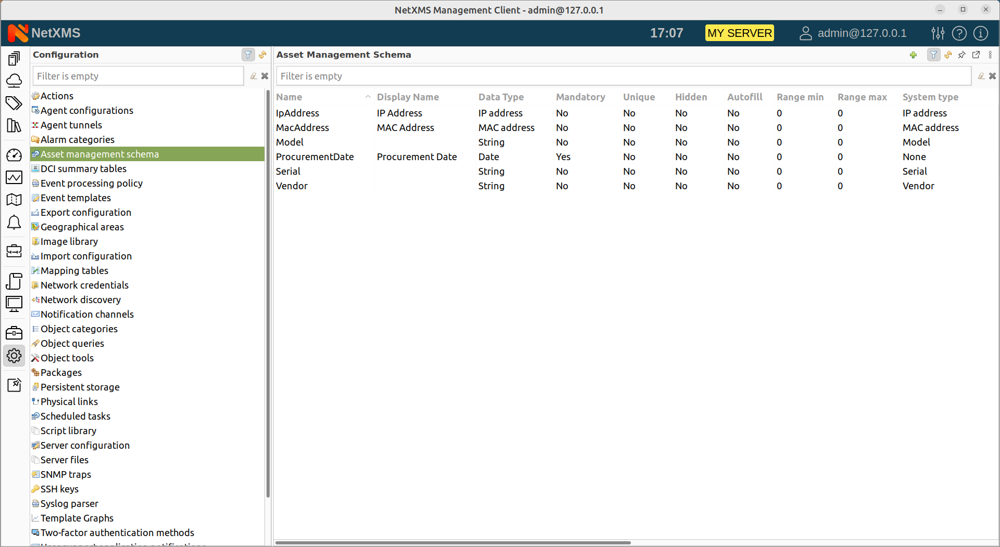
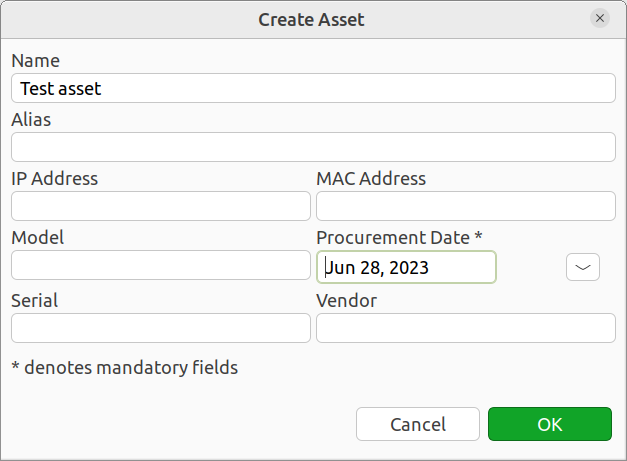

.. _assets:

#########################
Hardware Asset Management
#########################

.. versionadded:: 4.4

|product_name| can store information about hardware assets organized as a
hierarchical structure. Asset information is kept in ``Asset`` objects under
``Assets`` tree. There are ``Asset group`` objects which acts as folders. 

Assets information attributes are defined globally in :guilabel:`Asset
management schema`. 

Assets can be linked to Nodes, Access Points, Chassis, Mobile Devices, Racks or
Sensors in one-to-one relationship. Linking can be done either manually or
automatically, based on serial number information or MAC address of primary
network interface (MAC address is used only if serial number is not available). 

When asset is linked to Node (or other type of object), Vendor, Model and IP
Address fields in the asset can be automatically updated based on information on
a Node. Asset fields can also be automatically filled in using Auto Fill Script. 

Configuring Asset management schema
===================================

Configuration of information attributes which are present in assets is performed
in :guilabel:`Configuration -> Asset management schema`. The schema is global. 

To add a new attribute, select :guilabel:`New attribute...` from context menu or
click + button on the toolbar. This will open asset attribute property editor:

.. figure:: _images/assets_attribute_properties_1.png

Asset attribute properties has the following settings:

* Name - Should be unique and conform to NXSL naming convention. This name is
  used when accessing asset information from scripts.
* Display name - Optional, Name will be used if not filled in.
* Data type - The following data types are supported:
  
  * String - Maximum length 2000 characters
  * Integer - Int32
  * Number - Double
  * Boolean
  * Enum - Possible values are configured on :guilabel:`Enum Values` tab.
  * MAC Address
  * IP Address
  * UUID
  * Object Reference
  * Date

* System type - enables special processing depending on the selected type:
  
  * Serial - used for automatic linking. Asset will be automatically linked to
    node if value of this attribute matches serial number of that node. 
  * MAC Address - used for automatic linking. Asset will be automatically
    linked to node, if value of this attribute matches MAC Address on primary
    interface of that node (but only if node does not has Serial number)
  * IP address - used to autofill. This attribute will be automatically created
    and filled with primary IP address of node (or other object) linked to this
    asset. 
  * Vendor - used to autofill. This attribute will be automatically created and
    filled with vendor value of node linked to this asset. Autofill is performed
    only once, once this attribute has a value, it will not be updated.  
  * Model - used to autofill. This attribute will be automatically created and
    filled with model value of node linked to this asset. Autofill is performed
    only once, once this attribute has a value, it will not be updated.  

  Processing is performed on node's (or other object's) configuration poll or
  when asset is linked. 

* Use limits - enables limits for attribute value. For String type minimum and
  maximum number of characters can be defined. For numeric types minimum and
  maximum value is defined. 
* Mandatory - this attribute is mandatory.
* Unique - values for this attribute should be unique among all assets. 
* Hidden - attribute is hidden from summary table displayed on asset groups. 
* Auto Fill Script - NXSL script that performs auto-fill of asset property.
  Ignored, if System type is set. 
* Enum Values - defines list of possible values for Enum data type. Display name
  is optional, if it's not filled in, Value is used. 

Asset Creation
==============

Assets are managed under :guilabel:`Assets` perspective. Hierarchical structure
is built using Asset Group objects, Asset Root is the top object of the
hierarchy.

To create a new Asset Group, select :guilabel:`Create->Asset Group` from context
menu of Asset Root or Asset Group and provide asset group name. 

To create a new Asset, select :guilabel:`Create->Asset` from context menu of
Asset Root or Asset Group. Asset creation dialog will be displayed, with asset
attributes configured in asset management schema:

Name and mandatory attributes should be filled in, the rest of attributes can be left
empty. 

Asset Linking
=============

To link asset to node (or other type of object), select :guilabel:`Link to...`
from context menu of asset and choose a node. If that node already has an asset
linked, a warning message will be displayed. 

Linking can also be performed by selecting :guilabel:`Link to asset...` from
context menu of node (or other type of object) and choosing an asset. If that
asset already has a node linked, a warning message will be displayed. 

To unlink, select :guilabel:`Unlink` from asset context menu or
:guilabel:`Unlink from asset` from node context menu. 

