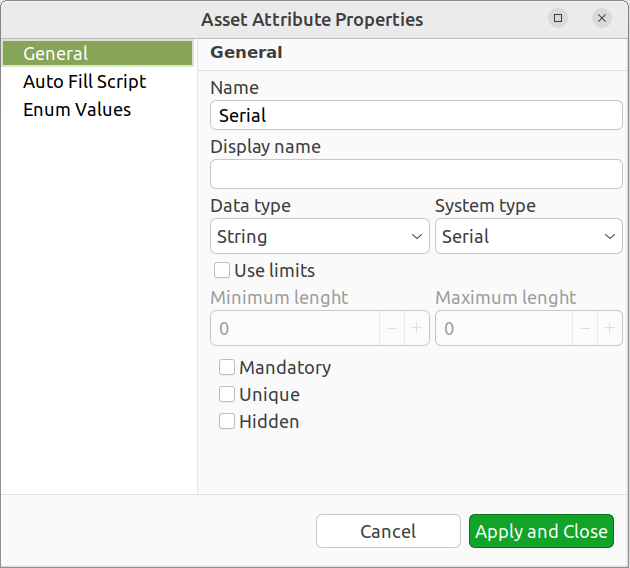

.. _modbus:

#########################
Hardware Asset Management
#########################

.. versionadded:: 4.4

|product_name| can store information about hardware assets organized as a
hierarchical structure. Asset information is kept in ``Asset`` objects under
``Assets`` tree. There are ``Asset group`` objects which acts as folders. 

Assets information attributes are defined globally in :guilabel:`Asset
management schema`. 

Assets can be linked to Nodes, Access Points, Chassis, Mobile Devices, Racks or
Sensors. Linking can be done either manually or automatically, based on serial
number information or MAC address of primary network interface (MAC address is
used only if serial number is not available). 

When asset is linked to Node (or other type of object), Vendor, Model and IP
Address fields in the asset can be automatically updated based on information on
a Node. Asset fields can also be automatically filled in using Auto Fill Script. 

Configuring Asset management schema
===================================

Configuration of information attributes which are present in assets is performed
in :guilabel:`Configuration -> Asset management schema`. The schema is global. 

To add a new attribute, select :guilabel:`New attribute...` from context menu or
click + button on the toolbar. Asset attribute property editor would open:

General page of asset attribute properties has the following information:

* Name - Should be unique and conform to NXSL naming convention. This name is
  used when accessing asset information from scripts.
* Display name - Optional, Name will be used if not filled in.
* Data type - The following data types are supported:
  
  * String - Maximum length 2000 characters
  * Integer - Int32
  * Number - Double
  * Boolean
  * Enum - Possible values are configured on :guilabel:`Enum Values` tab.
  * MAC Address
  * IP Address
  * UUID
  * Object Reference
  * Date

* System type - enables special processing depending on the selected value:
  
  * Serial - used for automatic linking. Setting this will automatically link
    asset to node if value is matched with serial number of that node (or other
    type of object). 
  * MAC Address - used for automatic linking. Setting this will automatically
    link asset to node, if value is matched with MAC Address on primary
    interface of that node (but only if node does not has Serial number)
  * IP address - used to autofill. Setting this will automatically fill node's
    (or object's of other type ) IP address into information attribute of asset
    linked to that node. 
  * Vendor - used to autofill. Setting this will automatically fill node's
    Vendor into information attribute of asset linked to that node. 
  * Model  - used to autofill. Setting this will automatically fill node's Model
    into information attribute of asset linked to that node. 
