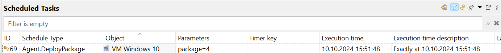
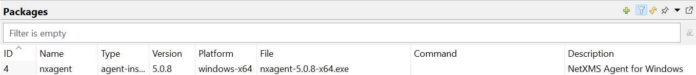

.. _schedule:

===============
Scheduled tasks
===============

|product_name| provides the option to schedule different tasks. Each task has its own parameter count and type.
The only common parameter is the node on which task will be executed. The schedule time can be set in two
ways: as a one time schedule or as a cron task (see :ref:`cron_format` for supported cron format options).

.. figure:: ../_images/scheduled_task.png

Information about available tasks can be found there:
   1. :ref:`schedule_file_upload`
   2. :ref:`schedule_script_execution`
   3. :ref:`schedule_maintenance`

.. _schedule_file_upload:

File Upload
===========

The task is named :guilabel:`Upload.File`. This task uploads a file from the server to the agent. The file to be uploaded
must exist at the server file storage. Task can be created in the :guilabel:`Schedules`
view or in the :guilabel:`Upload file...` dialog.

Parameters:

   1. File name that should be uploaded
   2. Path and file name where this file should be uploaded on the agent

Example: Warning-C.wav,/destination/location/Warning-C.wav

.. _schedule_script_execution:

Script Execution
================

The task is named :guilabel:`Execute.Script`. This task executes a script from the library. The selected
node is set as the :guilabel:`$node` variable in the script.

Parameters:

   1. Server script name

.. _schedule_package_deploy:

Package deploy
================

The task is named :guilabel:`Agent.DeployPackage`. This task schedules package deployment via agent which has been created in Configuration -> Packages section. The task handler Agent.DeployPackage expects parameter string as set of key=value entries separated by semicolons. Currently only one key is supported - "package".

Parameters:

   1. Package ID

.. _schedule_maintenance:

Maintenance
===========

The tasks are named :guilabel:`Maintenance.Enter` and :guilabel:`Maintenance.Leave`. These tasks turn on
and turn off maintenance mode for selected node. More about maintenance mode can be found :ref:`there<maintenance_mode>`.

These tasks do not require parameters.

Access Rights
=============

Access right for schedules can be separated into two parts. Rights that are required to
create, edit and delete tasks and rights that are required to schedule the exact task type.
Task can be created by the user or by the system.

Overall access rights:

.. list-table::
   :widths: 25 75
   :header-rows: 1

   * - Access right
     - Description
   * - Manage user scheduled tasks
     - Option to add, view, edit, delete users' tasks
   * - Manage own scheduled tasks
     - Option to add, view, edit, delete tasks created by this user
   * - Manage all scheduled tasks
     - Option to add, view, edit, delete tasks created by user and system

Task specific access rights:

.. list-table::
   :widths: 25 75
   :header-rows: 1

   * - Schedule type
     - Required access right
   * - File Upload
     - Schedule file upload task
   * - Script Execution
     - Schedule script task
   * - Maintenance
     - Schedule object maintenance

For some tasks like :guilabel:`File.Upload` there is an additional check if the user has permissions
to upload the file to this node and if there is access to the specific folder. Access rights
like this are checked during task execution, not during scheduling. If the user does not have
access, then the task will fail.
