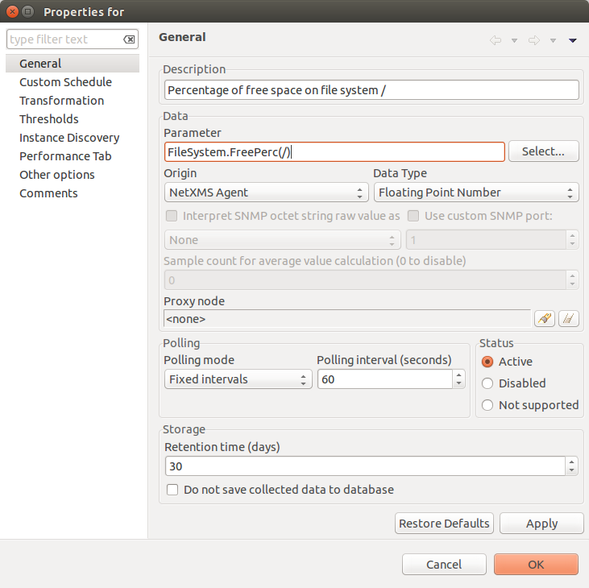
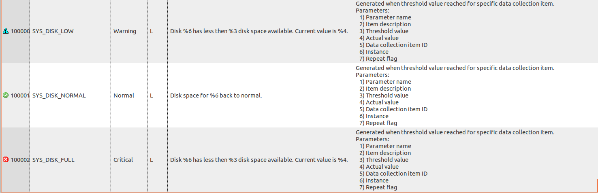
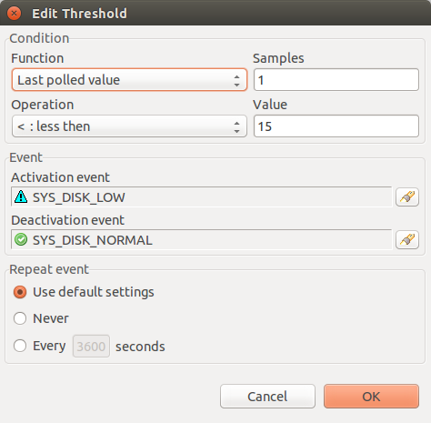
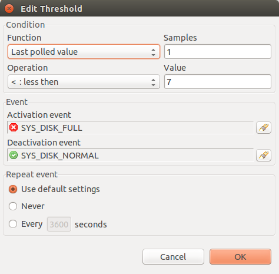
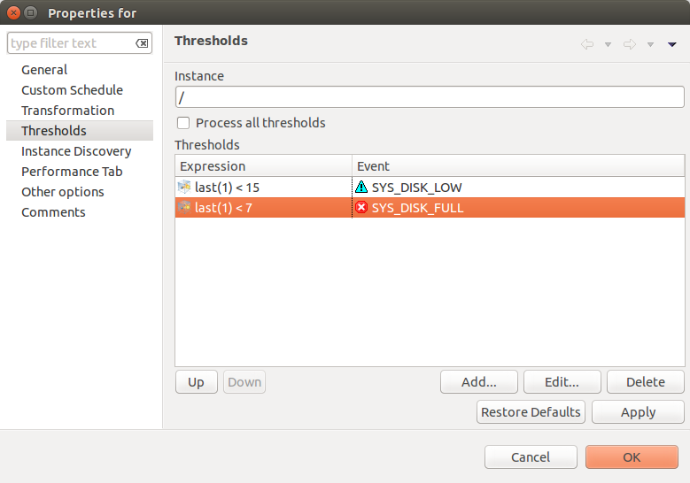
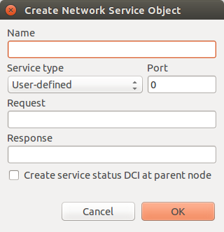
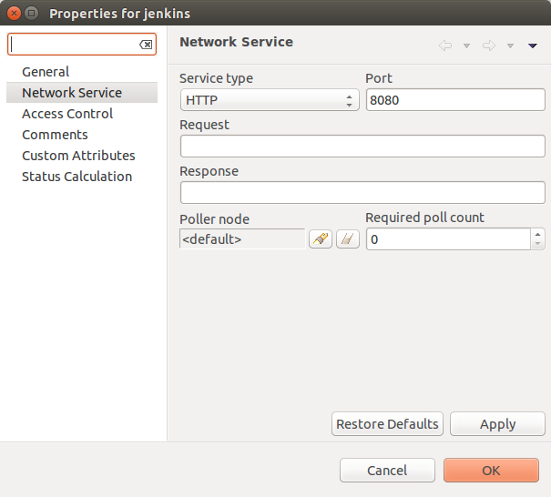
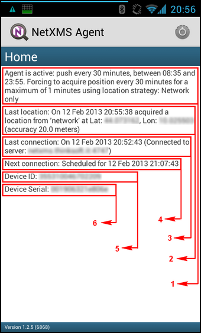

.. _getting-things-monitored:

##############################################
Common monitoring tasks (rename this chapter!)
##############################################

Operating System
================

There are separate subagent for each operating system type. This subagent is loaded 
automatically on agent start. They hide distinctions of similar function implementation 
on different platforms. They provide options to monitor agent statistic, processes 
statistic, file system, interface statistics, CPU, memory statistic. 

List of subagents:

  * linux
  * aix
  * hpux
  * winnt (Windows)
  * sunos
  * darwin (MacOS)
  * freebsd
  * netbsd
  * openbsd
  
Full list of parameters and compatibility between different platforms available 
:ref:`there <list-of-supported-metrics>`. In this section will be shown most common 
metric configurations. 

Example
-------

Process monitoring
~~~~~~~~~~~~~~~~~~

Service monitoring
~~~~~~~~~~~~~~~~~~

Disk free space monitoring
~~~~~~~~~~~~~~~~~~~~~~~~~~

Create DCI for FileSystem.FreePerc(*) metric to monitor space on /. 

Create 2 thresholds. One will be created when free space is less than 15% and other one 
when free space is less than 7%. Before threshold creation was created 3 events: 

  Events
  

  Threshold 1
  

  Threshold 2

As in message of error is used Instance parameter, it should be set in 
:guilabel:`Threshold` window. 
  

  Both
  
CPU usage
~~~~~~~~~

File meta information
=====================

Monitoring of file system is implemented by OS subagents. Full description of this 
functions can be found :ref:`there <list-of-supported-metrics>`. There is provided 
option to get file hash, creation, last edit and other timestamps, file size and 
number of files in the directory. In this sections will be shown only the most 
commonly used configurations. 

Examples
--------

.. _log-monitoring:
  
Log monitoring
==============

With NetXMS you can monitor changes in text log files, Windows Event Log, and
built-in syslog server. All log monitoring done by agents, except for built-in
syslog server. In general, log processing goes as following:

#. When new line added to log file, it is passed to appropriate log parser
#. If line matched one of the patterns, event associated with this pattern sent
   to server
#. Server receives event and passes to event processing policy as usual, with
   event source set to node from which event was received.

Agent Configuration for Log Monitoring
--------------------------------------

To be able to monitor logs with NetXMS agent, you should load ``LOGWATCH``
subagent and define parser configuration for each log file you wish to monitor.
Example of agent configuration file:

.. code-block:: cfg

   SubAgent = logwatch.nsm
 
   # Below is log parsers definitions
   *LOGWATCH
   Parser = C:\NetXMS\parser1.xml
   Parser = C:\NetXMS\parser2.xml

Syslog Monitoring
-----------------

NetXMS has built-in syslog server, which can be used to receive logs from
network devices and servers. It is also possible to parse incoming syslog
messages in a way similar to Windows Event Log monitoring. To parse syslog
messages, ``LOGWATCH`` subagent is not required – parsing is done by the server
itself. You only need to define monitoring rules in
:menuselection:`Configuration --> Syslog Parser`

Parser Definition File
----------------------

Parser definition file is an XML document with the following structure:

.. code-block:: xml

    <parser>
        <file>file name</file>
        <macros>
            <macro name="name">macro body</macro>
            <!-- more <macro> tags can follow -->
        </macros>
        <rules>
            <rule>
                <match>regexp</match>
                <id>event id</id>
                <level>severity level</level>
                <source>event source</source>
                <event>event</event>
                <context>context</context>
            </rule>
            <!-- more <rule> tags can follow -->
        </rules>
    </parser>

Entire ``<macros>`` section can be omitted, and inside ``<rule>`` tag only ``<match>`` is mandatory.

Global Parser Options
---------------------

In the ``<parser>`` tag you can specify the following options:

+------------+------------------------------------------------------+---------------+
| Option     | Description                                          | Default value |
+============+======================================================+===============+
| processAll | If this option set to ``1``, parser will always pass | 0             |
|            | log record through all rules. If this option set to  |               |
|            | ``0``, processing will stop after first match.       |               |
+------------+------------------------------------------------------+---------------+
| trace      | Trace level                                          | 0             |
+------------+------------------------------------------------------+---------------+

<file> Tag
----------

In the ``<file>`` tag you should specify log file to apply this parser to. To specify Windows Event Log, prepend it's name with asterisk (``*``), for example ``*System``.

.. _log-monitoring-macros:

Macros
------

In the ``<macros>`` section you can define macros for use in matching rules. For example, it can be useful to define macro for a timestamp preceding each log record and use it in matching rules instead of actual regular expression. You can define as many macros as you wish, each within it's own ``<macro>`` tag. Each macro should have unique name, defined in ``name`` attribute, and can be used in matching rules in form ``@{name}``.

Example: you need to parse log file where each line starts with timestamp in
format ``dd/mm/yy HH:MM:SS``. You can define the following macro:

.. code-block:: xml

    <rules>
        <rule>
            <match>@{timestamp}.*([A-Za-z]+) failed.*</match>
            <event>12345</event>
        </rule>
        <rule>
            <match>@{timestamp}.*error.*</match>
            <event>45678</event>
        </rule>
    </rules>

Please note that ``<macros>`` section always should be located before
``<rules>`` section in parser definition file.

Matching rules
--------------

In the ``<rules>`` section you define matching rules for log records. Each rule
placed inside it's own ``<rule>`` tag. Each rule can have additional options:

.. list-table::
   :widths: 15 70 15
   :header-rows: 1

   * - Option
     - Description
     - Default value
   * - break
     - If this option set to ``1`` and curent line match to regular expression
       in the rule, parser will stop processing of current line, even if global
       parser option ``processAll`` was set to ``1``. If this option set to
       ``0`` (which is default), processing will stop according to
       ``processAll`` option settings.
     - 0
   * - context
     - Name of the context this rule belongs to. If this option is set, rule will be processed only if given context was already activated with <context> tag in one of the rules processed earlier (it can be either same line or one of the previous lines).
     - *empty*

Inside the ``<rule>`` section there are the following additional tags:
``<match>``, ``<description>``, ``<event>``, and ``<context>``. Only
``<match>`` section is mandatory – it specifies regular expression against
which log record should be matched. All other tags are optional and define
parser behavior if a record matches the regular expression.

<match> Tag
~~~~~~~~~~~

Tag ``<match>`` contains a POSIX regular expression that is used to match log
records. Parts enclosed in parenthesis can be extracted from log record and
passed as arguments of generated event. You can use macros defined in
:ref:`log-monitoring-macros` section. Also, it is possible to define inverted
match rules (rules when log record considered matching if it does not match
regular expression). Inverted match can be set by setting attribute ``invert``
to ``1``.

Some examples:

.. code-block:: xml

    <match>^Error: (.*)</match>

This regular expression will match any line starting with word ``Error:``, and
everything after this word will be extracted from the log record for use with
an event.

.. code-block:: xml

    <match>[0-9]{3}</match>

This regular expression will match any line containing at least 3 consecutive digits.

.. code-block:: xml

    <match invert="1">abc</match>

This regular expression will match any line not containing character sequence ``abc``.

<id> Tag
~~~~~~~~

Tag ``<id>`` can be used to filter records from Windows Event Log by event ID.
You can specify either single event ID or ID range (by using two numbers
separated with minus sign). For example:

.. code-block:: xml

    <id>7</id>

will match records with event ID equal 7, and

.. code-block:: xml

    <id>10-20</id>

will match records with ID in range from 10 to 20 (inclusive).  This tag has no
effect for text log files, and can be used as a synonym for ``<facility>`` tag
for syslog monitoring.

<source> Tag
~~~~~~~~~~~~

Tag ``<source>`` can be used to filter records from Windows Event Log by event
source. You can specify exact event source name or pattern with ``*`` and ``?``
meta characters.

Some examples:

.. code-block:: xml

    <source>Tcpip</source>

will match records with event source ``"Tcpip`` (case-insensitive), and

.. code-block:: xml

    <source>X*</source>

will match records with event source started from letter ``X``.  This tag has
no effect for text log files, and can be used as a synonym for ``<tag>`` tag
for syslog monitoring.

<level> Tag
~~~~~~~~~~~

Tag ``<level>`` can be used to filter records from Windows Event log by event
severity level (also called :guilabel:`event type` in older Windows versions).
Each severity level has it's own code, and to filter by multiple severity
levels you should specify sum of appropriate codes. Severity level codes are
following:

+------+---------------+
| Code |  Severity     |
+======+===============+
| 1    | Error         |
+------+---------------+
| 2    | Warning       |
+------+---------------+
| 4    | Information   |
+------+---------------+
| 8    | Audit Success |
+------+---------------+
| 16   | Audit Failure |
+------+---------------+

Some examples:

.. code-block:: xml

    <level>1</level>

will match all records with severity level :guilabel:`Error`, and

.. code-block:: xml

    <level>6</level>

will match all records with severity level :guilabel:`Warning` or
:guilabel:`Information`.  This tag has no effect for text log files, and can be
used as a synonym for ``<severity>`` tag for syslog monitoring.

<facility> Tag
~~~~~~~~~~~~~~

Tag ``<facility>`` can be used to filter syslog records (received by NetXMS
built-in syslog server) by facility code. The following facility codes can be
used:

+--------+------------------------------------------+
|   Code |     Facility                             |
+========+==========================================+
|  0     | kernel messages                          |
+--------+------------------------------------------+
|  1     | user-level messages                      |
+--------+------------------------------------------+
|  2     | mail system                              |
+--------+------------------------------------------+
|  3     | system daemons                           |
+--------+------------------------------------------+
|  4     | security/authorization messages          |
+--------+------------------------------------------+
|  5     | messages generated internally by syslogd |
+--------+------------------------------------------+
|  6     | line printer subsystem                   |
+--------+------------------------------------------+
|  7     | network news subsystem                   |
+--------+------------------------------------------+
|  8     | UUCP subsystem                           |
+--------+------------------------------------------+
|  9     | clock daemon                             |
+--------+------------------------------------------+
|  10    | security/authorization messages          |
+--------+------------------------------------------+
|  11    | FTP daemon                               |
+--------+------------------------------------------+
|  12    | NTP subsystem                            |
+--------+------------------------------------------+
|  13    | log audit                                |
+--------+------------------------------------------+
|  14    | log alert                                |
+--------+------------------------------------------+
|  15    | clock daemon                             |
+--------+------------------------------------------+
|  16    | local use 0 (local0)                     |
+--------+------------------------------------------+
|  17    | local use 1 (local1)                     |
+--------+------------------------------------------+
|  18    | local use 2 (local2)                     |
+--------+------------------------------------------+
|  19    | local use 3 (local3)                     |
+--------+------------------------------------------+
|  20    | local use 4 (local4)                     |
+--------+------------------------------------------+
|  21    | local use 5 (local5)                     |
+--------+------------------------------------------+
|  22    | local use 6 (local6)                     |
+--------+------------------------------------------+
|  23    | local use 7 (local7)                     |
+--------+------------------------------------------+

You can specify either single facility code or facility code range (by using
two numbers separated by minus sign). For example:

.. code-block:: xml

   <facility>7</facility>

will match records with facility code equal 7, and

.. code-block:: xml

   <facility>10-20</facility>

will match records with facility code in range from 10 to 20 (inclusive).  This
tag has no effect for text log files, and can be used as a synonym for ``<id>``
tag for Windows Event Log monitoring.

<tag> Tag
~~~~~~~~~

Tag ``<tag>`` can be used to filter syslog records (received by NetXMS built-in
syslog server) by content of ``tag`` field. You can specify exact value or
pattern with ``*`` and ``?`` meta characters.

Some examples:

.. code-block:: xml

    <tag>httpd</tag>

will match records with tag "httpd" (case-insensetive), and

.. code-block:: xml

    <tag>X*</tag>

will match records with tag started from letter ``X``.  This tag has no effect
for text log files, and can be used as a synonym for ``<source>`` tag for
Windows Event Log monitoring.

<severity> Tag
~~~~~~~~~~~~~~

Tag ``<severity>`` can be used to filter syslog records (received by NetXMS
built-in syslog server) by severity level. Each severity level has it's own
code, and to filter by multiple severity levels you should specify sum of
appropriate codes. Severity level codes are following:

+------+---------------+
| Code |  Severity     |
+======+===============+
| 1    | Emergency     |
+------+---------------+
| 2    | Alert         |
+------+---------------+
| 4    | Critical      |
+------+---------------+
| 8    | Error         |
+------+---------------+
| 16   | Warning       |
+------+---------------+
| 32   | Notice        |
+------+---------------+
| 64   | Informational |
+------+---------------+
| 128  | Debug         |
+------+---------------+

Some examples:

.. code-block:: xml

    <severity>1</severity>

will match all records with severity level :guilabel:`Emergency`, and

.. code-block:: xml

    <severity>6</severity>

will match all records with severity level :guilabel:`Alert` or
:guilabel:`Critical`. This tag has no effect for text log files, and can be
used as a synonym for ``<level>`` tag for Windows Event Log monitoring.

<description> Tag
~~~~~~~~~~~~~~~~~

Tag ``<description>`` contains textual description of the rule, which will be shown in parser trace.

<event> Tag
~~~~~~~~~~~

Tag ``<event>`` defines event to be generated if current log record match to
regular expression defined in ``<match>`` tag. Inside ``<event>`` tag you
should specify event code to be generated (or event name if you configure
server-side syslog parsing). If you wish to pass parts of log record text
extracted with regular expression as event's parameters, you should specify
correct number of parameters in ``params`` attribute.

<context> Tag
~~~~~~~~~~~~~

Tag ``<context>`` defines activation or deactivation of contexts. It has the
following format:

.. code-block:: xml

   <context action="action" reset="reset mode">context name</context>

Possible actions are:

+--------+----------------------------------------------------+
| Action | Description                                        |
+========+====================================================+
| clear  | Deactivate (clear "active" flag of) given context. |
+--------+----------------------------------------------------+
| set    | Activate (set "active" flag of) given context.     |
+--------+----------------------------------------------------+

Reset mode determines how context will be deactivated (reset). Possible values for reset mode are:

+------------+-------------------------------------------------------+
| Reset mode | Description                                           |
+============+=======================================================+
| auto       | Deactivate context automatically after first match    |
|            | in context (match rule with ``context`` attribute set |
|            | to given context).                                    |
+------------+-------------------------------------------------------+
| manual     | Context can be deactivated only by explicit           |
|            | ``<context action="clear">`` statement.               |
+------------+-------------------------------------------------------+

Both ``action`` and ``reset`` attributes can be omitted; default value for
``action`` is ``set``, and default value for ``reset`` is ``auto``.

Examples of Parser Definition File
----------------------------------

Generate event with code ``100000`` if line in the log file /var/log/messages
contains word error:

.. code-block:: xml

    <parser>
        <file>/var/log/messages</file>
        <rules>
            <rule>
                <match>error</match>
                <event>100000</event>
            </rule>
        </rules>
    </parser>

Generate event with code ``200000`` if line in the log file ``C:\demo.log``
contains word ``process:`` and is immediately following line containing text
``process startup failed``; everything after word ``process:`` will be sent as
event's parameter:

.. code-block:: xml

    <parser>
        <file>C:\demo.log</file>
        <rules>
            <rule>
                <match>process startup failed</match>
                <context action="set" reset="auto">STARTUP_FAILED</context>
            </rule>
            <rule context="STARTUP_FAILED">
                <match>process:(.*)</match>
                <event params="1">200000</event>
            </rule>
        </rules>
    </parser>

.. _service-monitoring:
    
Service monitoring
==================

There are two options to add service monitoring: the first one is to add it through 
menu option :guilabel:`Create Network Service...` as an object with the status 
that will be propagated on a node, and the second one is to add it's monitoring as 
DCI. 

Network Service
---------------

Object representing network service running on a node (like http or
ssh), which is accessible online (via TCP IP). Network Service objects 
are always created manually. Currently, the system works with the following 
protocols - HTTP, POP3, SMTP, Telnet, SSH and Custom protocol type. For Custom
protocol, a user should define the TCP port number and the system will be
checking whether that port is available. For the predefined standard services
the system will also check whether an appropriate response is returned. In case
of SMTP, the system will send a test mail, in case of POP3 – try to log in with
a certain user, in case of HTTP – check whether the contents of a desired web
page correspond to a certain given template. As soon as the Network Service
object is created, it will be automatically included into the status poll. Each
time when the status poll for the particular node is carried out, all Network
Service objects are polled for a reply. If an object's reply corresponds to a
certain condition, its status is set as NORMAL. If an object is not responding,
its status will be hanged to CRITICAL. Wile network service creation there can be 
also created :term:`DCI` that will collect service status. 

In default configuration request is done 
with help of Port Check subagent on the server node. If it should be done through 
different node is should be changed in it's properties after service creation by 
selecting Poller node. There is also possibility to set quantity of polls that is 
required to be sure that state have changed. 

Service monitoring using DCI
----------------------------

Second option is to use :term:`DCI` to monitor service. There are 2 subagents that 
provide service monitoring metrics: PortCheck and NetSVC. It is recommended to use 
NetSVC for all curl supported protocols. As it can check not only availability, but 
also response. For unsupported protocols can be used Custom check of PortCheck 
subagent.

For HTTP services there is also option to use ECS subagent. This subagent has only 3 Metrics. Two 
of them calculate hash and last one measure time. 

PortCheck configuration
~~~~~~~~~~~~~~~~~~~~~~~

This subagent can be used to check TCP ports and specifically implements checks for 
common services. It is highly recommended to use netsvc subagent especially for 
HTTP and HTTPS monitoring. 

When loaded, PORTCHECK subagent adds the following Metrics to node Metric list:

.. list-table:: 
   :widths: 50 100
   :header-rows: 1
   
   * - Parameter 
     - Description 
   * - ServiceCheck.Custom(\ *target*\ ,\ *port*\ [,\ *timeout*\ ]) 
     - Check that TCP *port* is open on *target*. Optional argument *timeout* specifies timeout in milliseconds.  This is a very simple test that does nothing more than check the port is open.
   * - ServiceCheck.HTTP(\ *target*\ ,[\ *port*\ ],\ *URI*\ ,\ *hostHeader*\ [,\ *regex*\ [,\ *timeout*\ ]])
     - Check that HTTP service is running on *target*.  Optional argument *port* specifies the port to connect with, otherwise 80 will be used.  The *URI* is NOT a URL it is the host header request URI.  As an example to test URL http://www.netxms.org/index.html enter www.netxms.org:/index.html. *hostHeader* is currently not used, but may be the Host option at some point in the request made.  Optional argument *regex* is the regular expression to check returned from the request, otherwise "^HTTP/1.[01] 200 .*" will be used.  Optional argument *timeout* specifies timeout in milliseconds.
   * - ServiceCheck.POP3(\ *target*\ ,\ *username*\ ,\ *password*\ [,\ *timeout*\ )
     - Check that POP3 service is running on *target* and that we are able to login using the supplied *username* and *password*.  Optional argument *timeout* specifies timeout in milliseconds.
   * - ServiceCheck.SMTP(\ *target*\ ,\ *toAddress*\ [,\ *timeout*\ ])
     - Check that SMTP service is running on *target* and that it will accept an e-mail to *toAddress*.  The e-mail will be from noreply@\ *DomainName* using the *DomainName* option in the config file or its default value (see below).  Optional argument *timeout* specifies timeout in milliseconds.
   * - ServiceCheck.SSH(\ *target*\ [,\ *port*\ [,\ *timeout*\ ]])
     - Check that SSH service is running on *target*.  Optional argument *port* specifies the port to connect with, otherwise 22 will be used.  Optional argument *timeout* specifies timeout in milliseconds.
   * - ServiceCheck.Telnet(\ *target*\ [,\ *port*\ [,\ *timeout*\ ]])
     - Check that Telnet service is running on *target*.  Optional argument *port* specifies the port to connect with, otherwise 23 will be used.  Optional argument *timeout* specifies timeout in milliseconds.
     
.. note:
  Parameters in [ ] are optional, when optional parameters are used they should 
  be used without [ ]. 
     
     
All of the ServiceCheck.* parameters return the following values:

.. list-table:: 
   :widths: 15 50
   :header-rows: 1
   
   * - Value
     - Description
   * - 0
     - Success, *target* was connected to an returned expected response.
   * - 1
     - Invalid arguments were passed.
   * - 2
     - Cannot connect to *target*.
   * - 3
     - Invalid / Unexpected response from *target*.
     
All configuration parameters related to PORTCHECK subagent should be placed into 
***PORTCHECK** section of agent's configuration file. The following configuration parameters 
are supported:

.. list-table:: 
   :widths: 20 20 100 20
   :header-rows: 1
   
   * - Parameter
     - Format
     - Description
     - Default value
   * - DomainName
     - *string*
     - Set default domain name for processing. Currently this is only used by SMTP check to set the from e-mail address.
     - netxms.org
   * - Timeout
     - *milliseconds*
     - Set response timeout to *milliseconds*.
     - 3000
  
Configuration example:
  
.. code-block:: cfg

   # This sample nxagentd.conf instructs agent to:
   #   1. Load PORTCHECK subagent
   #   2. Set domain name for from e-mail to netxms.demo
   #   3. Default timeout for commands set to 5 seconds (5000 milliseconds)

   MasterServers = netxms.demo
   SubAgent = /usr/lib/libnsm_portcheck.so

   *portCheck
   DomainName = netxms.demo
   Timeout = 5000

NetSVC configuration
~~~~~~~~~~~~~~~~~~~~

This subagent can be used to check network services supported by libcurl. More about 
syntaxes can be found there: http://curl.haxx.se/docs/manpage.html.

This subagent will add this Metrics to node Metric list:

.. list-table:: 
   :widths: 50 100
   :header-rows: 1
   
   * - Parameter 
     - Description 
   * - Service.Check(,) ServiceCheck.Custom(\ *target*\ ,\ *port*\ [,\ *timeout*\ ]) 
     - Check that TCP *port* is open on *target*. Optional argument *timeout* specifies timeout in milliseconds.  This is a very simple test that does nothing more than check the port is open.

HTTP check example: 

.. code-block:: cfg

   Service.Check(https://inside.test.ru/,^HTTP/1\.[01] 200.*)
   
"^HTTP/1\.[01] 200.*" - this is default value and may be missed in expression. 

.. note::
  If agent is build from sources, then libcurl-dev should be installed to 
  build netsvc subagent. 
  
ECS
~~~

This subagent works with HTTP only. It can be used to measure page load time and checking page 
hash. Request timeout for this subageint is 30 seconds. 

.. list-table:: 
   :widths: 50 100
   :header-rows: 1
   
   * - Parameter 
     - Description 
   * - ECS.HttpSHA1(\ *URL*\ )
     - Calculates SHA1 hash of provided URL
   * - ECS.HttpMD5(\ *URL*\ )
     - Calculates MD5 hash of provided URL
   * - ECS.HttpLoadTime(\ *URL*\ )
     - Measure load time for provided URL

.. code-block:: cfg

  MasterServers = netxms.demo
  Subagent = ecs.nsm
  

.. _database-monitoring:

Database monitoring
===================

There are created few specialized monitoring subagents: Oracle, DB2, MongoDB. Further 
will be described how to configure and use this subagents. Besides this there is 
opportunity to monitor also other types of databases supported by NetXMS 
server(:ref:`link to supported database list<supported-db-list>`) using database query 
suabgent as this databases support receiving performance parameters using queries. 
This subagent details are described in :ref:`dbquery` chapter. 

Oracle
------

NetXMS subagent for Oracle DBMS monitoring (further referred to as Oracle subagent) monitors 
one or more instances of Oracle databases and reports various database-related parameters.

All parameters available from Oracle subagent gathered or calculated once per minute thus it's 
recommended to set DCI poll interval for these items to 60 seconds or more. All parameters are 
obtained or derived from the data available in Oracle's data dictionary tables and views through 
regular select queries. Oracle subagent does not monitor any of the metrics related to lower level 
database layers, such as database processes. Monitoring of such parameters can be achieved through 
the standard NetXMS functionality.

Pre-requisites
~~~~~~~~~~~~~~

An Oracle user with the role **select_catalog_role** assigned.

Required rights can be assigned to user with the following query:

.. code-block:: sql
   
   grant select_catalog_role to user;

Where *user* is the user configured in Oracle subagent for database access.

Configuration file
~~~~~~~~~~~~~~~~~~

Oracle subagent can be configured using XML configuration file (usually created 
as separate file in configuration include directory), or in simplified INI format,
usually in main agent configuration file.

XML configuration:

You can specify multiple databases in the **oracle** section. Each database description 
must be surrounded by database tags with the **id** attribute. It can be any unique integer 
and instructs the Oracle subagent about the order in which database sections will be processed.

Each database definition supports the following parameters:

+----------------------------------------+------------------------------------------------------------------------------------------------------------+
| Parameter                              | Description                                                                                                |
+========================================+============================================================================================================+
| Id                                     | Database identifier. It will be used to address this database in parameters.                               |
+----------------------------------------+------------------------------------------------------------------------------------------------------------+
| Name                                   | Database TNS name or connection string.                                                                    |
+----------------------------------------+------------------------------------------------------------------------------------------------------------+
| Username                               | User name for connecting to database.                                                                      |
+----------------------------------------+------------------------------------------------------------------------------------------------------------+
| Password                               | Database user password.                                                                                    |
+----------------------------------------+------------------------------------------------------------------------------------------------------------+
| EncryptedPassword                      | Database user password encrypted with nxencpasswd.                                                         |
+----------------------------------------+------------------------------------------------------------------------------------------------------------+

Sample Oracle subagent configuration file in XML format:

.. code-block:: xml

   <config>
       <agent>
           <subagent>oracle.nsm</subagent>
       </agent>
       <oracle>
           <databases>
               <database id="1">
                   <id>DB1</id>
                   <tnsname>TEST</tnsname>
                   <username>NXMONITOR</username>
                   <password>NXMONITOR</password>
               </database>
               <database id="2">
                   <id>DB2</id>
                   <tnsname>PROD</tnsname>
                   <username>NETXMS</username>
                   <password>PASSWORD</password>
               </database>
           </databases>
       </oracle>
   </config>

INI configuration:

You can specify only one database when using INI configuration format. If you need 
to monitor multiple databases from same agent, you should use configuration file in XML format. 

**ORACLE** section can contain the following parameters:

+----------------------------------------+------------------------------------------------------------------------------------------------------------+
| Parameter                              | Description                                                                                                |
+========================================+============================================================================================================+
| Id                                     | Database identifier. It will be used to address this database in parameters.                               |
+----------------------------------------+------------------------------------------------------------------------------------------------------------+
| Name                                   | Database TNS name or connection string.                                                                    |
+----------------------------------------+------------------------------------------------------------------------------------------------------------+
| Username                               | User name for connecting to database.                                                                      |
+----------------------------------------+------------------------------------------------------------------------------------------------------------+
| Password                               | Database user password.                                                                                    |
+----------------------------------------+------------------------------------------------------------------------------------------------------------+
| EncryptedPassword                      | Database user password encrypted with nxencpasswd.                                                         |
+----------------------------------------+------------------------------------------------------------------------------------------------------------+

Sample Oracle subagent configuration file in INI format:

.. code-block:: cfg

   *ORACLE
   ID = DB1
   TNSName = TEST
   Username = NXMONITOR
   Password = NXMONITOR

Parameters
~~~~~~~~~~

When loaded, Oracle subagent adds the following parameters to agent (all parameters requires database ID as first argument):

+---------------------------------------------------------+-----------------------------------------------------------------------------------+
| Parameter                                               | Description                                                                       |
+=========================================================+===================================================================================+
| Oracle.CriticalStats.AutoArchivingOff(*dbid*)           | Archive logs enabled but auto archiving off (YES/NO)                              |
+---------------------------------------------------------+-----------------------------------------------------------------------------------+
| Oracle.CriticalStats.DatafilesNeedMediaRecovery(*dbid*) | Number of datafiles that need media recovery                                      |
+---------------------------------------------------------+-----------------------------------------------------------------------------------+
| Oracle.CriticalStats.DFOffCount(*dbid*)                 | Number of offline datafiles                                                       |
+---------------------------------------------------------+-----------------------------------------------------------------------------------+
| Oracle.CriticalStats.FailedJobs(*dbid*)                 | Number of failed jobs                                                             |
+---------------------------------------------------------+-----------------------------------------------------------------------------------+
| Oracle.CriticalStats.FullSegmentsCount(*dbid*)          | Number of segments that cannot extend                                             |
+---------------------------------------------------------+-----------------------------------------------------------------------------------+
| Oracle.CriticalStats.RBSegsNotOnlineCount(*dbid*)       | Number of rollback segments not online                                            |
+---------------------------------------------------------+-----------------------------------------------------------------------------------+
| Oracle.CriticalStats.TSOffCount(*dbid*)                 | Number of offline tablespaces                                                     |
+---------------------------------------------------------+-----------------------------------------------------------------------------------+
| Oracle.Cursors.Count(*dbid*)                            | Current number of opened cursors system-wide                                      |
+---------------------------------------------------------+-----------------------------------------------------------------------------------+
| Oracle.DataFile.AvgIoTime(*dbid*, *datafile*)           | Average time spent on single I/O operation for *datafile* in milliseconds         |
+---------------------------------------------------------+-----------------------------------------------------------------------------------+
| Oracle.DataFile.Blocks(*dbid*, *datafile*)              | *datafile* size in blocks                                                         |
+---------------------------------------------------------+-----------------------------------------------------------------------------------+
| Oracle.DataFile.BlockSize(*dbid*, *datafile*)           | *datafile* block size                                                             |
+---------------------------------------------------------+-----------------------------------------------------------------------------------+
| Oracle.DataFile.Bytes(*dbid*, *datafile*)               | *datafile* size in bytes                                                          |
+---------------------------------------------------------+-----------------------------------------------------------------------------------+
| Oracle.DataFile.FullName(*dbid*, *datafile*)            | *datafile* full name                                                              |
+---------------------------------------------------------+-----------------------------------------------------------------------------------+
| Oracle.DataFile.MaxIoReadTime(*dbid*, *datafile*)       | Maximum time spent on a single read for *datafile* in milliseconds                |
+---------------------------------------------------------+-----------------------------------------------------------------------------------+
| Oracle.DataFile.MaxIoWriteTime(*dbid*, *datafile*)      | Maximum time spent on a single write for *datafile* in milliseconds               |
+---------------------------------------------------------+-----------------------------------------------------------------------------------+
| Oracle.DataFile.MinIoTime(*dbid*, *datafile*)           | Minimum time spent on a single I/O operation for *datafile* in milliseconds       |
+---------------------------------------------------------+-----------------------------------------------------------------------------------+
| Oracle.DataFile.PhysicalReads(*dbid*, *datafile*)       | Total number of physical reads from *datafile*                                    |
+---------------------------------------------------------+-----------------------------------------------------------------------------------+
| Oracle.DataFile.PhysicalWrites(*dbid*, *datafile*)      | Total number of physical writes to *datafile*                                     |
+---------------------------------------------------------+-----------------------------------------------------------------------------------+
| Oracle.DataFile.ReadTime(*dbid*, *datafile*)            | Total read time for *datafile* in milliseconds                                    |
+---------------------------------------------------------+-----------------------------------------------------------------------------------+
| Oracle.DataFile.Status(*dbid*, *datafile*)              | *datafile* status                                                                 |
+---------------------------------------------------------+-----------------------------------------------------------------------------------+
| Oracle.DataFile.Tablespace(*dbid*, *datafile*)          | *datafile* tablespace                                                             |
+---------------------------------------------------------+-----------------------------------------------------------------------------------+
| Oracle.DataFile.WriteTime(*dbid*, *datafile*)           | Total write time for *datafile* in milliseconds                                   |
+---------------------------------------------------------+-----------------------------------------------------------------------------------+
| Oracle.DBInfo.CreateDate(*dbid*)                        | Database creation date                                                            |
+---------------------------------------------------------+-----------------------------------------------------------------------------------+
| Oracle.DBInfo.IsReachable(*dbid*)                       | Database is reachable (YES/NO)                                                    |
+---------------------------------------------------------+-----------------------------------------------------------------------------------+
| Oracle.DBInfo.LogMode(*dbid*)                           | Database log mode                                                                 |
+---------------------------------------------------------+-----------------------------------------------------------------------------------+
| Oracle.DBInfo.Name(*dbid*)                              | Database name                                                                     |
+---------------------------------------------------------+-----------------------------------------------------------------------------------+
| Oracle.DBInfo.OpenMode(*dbid*)                          | Database open mode                                                                |
+---------------------------------------------------------+-----------------------------------------------------------------------------------+
| Oracle.DBInfo.Version(*dbid*)                           | Database version                                                                  |
+---------------------------------------------------------+-----------------------------------------------------------------------------------+
| Oracle.Dual.ExcessRows(*dbid*)                          | Excessive rows in DUAL table                                                      |
+---------------------------------------------------------+-----------------------------------------------------------------------------------+
| Oracle.Instance.ArchiverStatus(*dbid*)                  | Archiver status                                                                   |
+---------------------------------------------------------+-----------------------------------------------------------------------------------+
| Oracle.Instance.Status(*dbid*)                          | Database instance status                                                          |
+---------------------------------------------------------+-----------------------------------------------------------------------------------+
| Oracle.Instance.ShutdownPending(*dbid*)                 | Is shutdown pending (YES/NO)                                                      |
+---------------------------------------------------------+-----------------------------------------------------------------------------------+
| Oracle.Instance.Version(*dbid*)                         | DBMS Version                                                                      |
+---------------------------------------------------------+-----------------------------------------------------------------------------------+
| Oracle.Objects.InvalidCount(*dbid*)                     | Number of invalid objects in DB                                                   |
+---------------------------------------------------------+-----------------------------------------------------------------------------------+
| Oracle.Performance.CacheHitRatio(*dbid*)                | Data buffer cache hit ratio                                                       |
+---------------------------------------------------------+-----------------------------------------------------------------------------------+
| Oracle.Performance.DictCacheHitRatio(*dbid*)            | Dictionary cache hit ratio                                                        |
+---------------------------------------------------------+-----------------------------------------------------------------------------------+
| Oracle.Performance.DispatcherWorkload(*dbid*)           | Dispatcher workload (percentage)                                                  |
+---------------------------------------------------------+-----------------------------------------------------------------------------------+
| Oracle.Performance.FreeSharedPool(*dbid*)               | Free space in shared pool (bytes)                                                 |
+---------------------------------------------------------+-----------------------------------------------------------------------------------+
| Oracle.Performance.Locks(*dbid*)                        | Number of locks                                                                   |
+---------------------------------------------------------+-----------------------------------------------------------------------------------+
| Oracle.Performance.LogicalReads(*dbid*)                 | Number of logical reads                                                           |
+---------------------------------------------------------+-----------------------------------------------------------------------------------+
| Oracle.Performance.LibCacheHitRatio(*dbid*)             | Library cache hit ratio                                                           |
+---------------------------------------------------------+-----------------------------------------------------------------------------------+
| Oracle.Performance.MemorySortRatio(*dbid*)              | PGA memory sort ratio                                                             |
+---------------------------------------------------------+-----------------------------------------------------------------------------------+
| Oracle.Performance.PhysicalReads(*dbid*)                | Number of physical reads                                                          |
+---------------------------------------------------------+-----------------------------------------------------------------------------------+
| Oracle.Performance.PhysicalWrites(*dbid*)               | Number of physical writes                                                         |
+---------------------------------------------------------+-----------------------------------------------------------------------------------+
| Oracle.Performance.RollbackWaitRatio(*dbid*)            | Ratio of waits for requests to rollback segments                                  |
+---------------------------------------------------------+-----------------------------------------------------------------------------------+
| Oracle.Sessions.Count(*dbid*)                           | Number of sessions opened                                                         |
+---------------------------------------------------------+-----------------------------------------------------------------------------------+
| Oracle.Sessions.CountByProgram(*dbid*, *program*)       | Number of sessions opened by specific program                                     |
+---------------------------------------------------------+-----------------------------------------------------------------------------------+
| Oracle.Sessions.CountBySchema(*dbid*, *schema*)         | Number of sessions opened with specific schema                                    |
+---------------------------------------------------------+-----------------------------------------------------------------------------------+
| Oracle.Sessions.CountByUser(*dbid*, *user*)             | Number of sessions opened with specific Oracle user                               |
+---------------------------------------------------------+-----------------------------------------------------------------------------------+
| Oracle.TableSpace.BlockSize(*dbid*, *tablespace*)       | *tablespace* block size                                                           |
+---------------------------------------------------------+-----------------------------------------------------------------------------------+
| Oracle.TableSpace.DataFiles(*dbid*, *tablespace*)       | Number of datafiles in *tablespace*                                               |
+---------------------------------------------------------+-----------------------------------------------------------------------------------+
| Oracle.TableSpace.FreeBytes(*dbid*, *tablespace*)       | Free bytes in *tablespace*                                                        |
+---------------------------------------------------------+-----------------------------------------------------------------------------------+
| Oracle.TableSpace.FreePct(*dbid*, *tablespace*)         | Free space percentage in *tablespace*                                             |
+---------------------------------------------------------+-----------------------------------------------------------------------------------+
| Oracle.TableSpace.Logging(*dbid*, *tablespace*)         | *tablespace* logging mode                                                         |
+---------------------------------------------------------+-----------------------------------------------------------------------------------+
| Oracle.TableSpace.Status(*dbid*, *tablespace*)          | *tablespace* status                                                               |
+---------------------------------------------------------+-----------------------------------------------------------------------------------+
| Oracle.TableSpace.TotalBytes(*dbid*, *tablespace*)      | Total size in bytes of *tablespace*                                               |
+---------------------------------------------------------+-----------------------------------------------------------------------------------+
| Oracle.TableSpace.Type(*dbid*, *tablespace*)            | *tablespace* type                                                                 |
+---------------------------------------------------------+-----------------------------------------------------------------------------------+
| Oracle.TableSpace.UsedBytes(*dbid*, *tablespace*)       | Used bytes in *tablespace*                                                        |
+---------------------------------------------------------+-----------------------------------------------------------------------------------+
| Oracle.TableSpace.UsedPct(*dbid*, *tablespace*)         | Used space percentage in *tablespace*                                             |
+---------------------------------------------------------+-----------------------------------------------------------------------------------+

Lists
~~~~~

When loaded, Oracle subagent adds the following lists to agent:

+----------------------------------------+------------------------------------------------------------------------------------------------------------+
| List                                   | Description                                                                                                |
+========================================+============================================================================================================+
| Oracle.DataFiles(*dbid*)               | All known datafiles in database identified by *dbid*.                                                      |
+----------------------------------------+------------------------------------------------------------------------------------------------------------+
| Oracle.DataTags(*dbid*)                | All data tags for database identified by *dbid*. Used only for internal diagnostics.                       |
+----------------------------------------+------------------------------------------------------------------------------------------------------------+
| Oracle.TableSpaces(*dbid*)             | All known tablespaces in database identified by *dbid*.                                                    |
+----------------------------------------+------------------------------------------------------------------------------------------------------------+

Tables
~~~~~~

When loaded, Oracle subagent adds the following tables to agent:

+----------------------------------------+------------------------------------------------------------------------------------------------------------+
| Table                                  | Description                                                                                                |
+========================================+============================================================================================================+
| Oracle.DataFiles(*dbid*)               | Datafiles in database identified by *dbid*.                                                                |
+----------------------------------------+------------------------------------------------------------------------------------------------------------+
| Oracle.Sessions(*dbid*)                | Open sessions in database identified by *dbid*.                                                            |
+----------------------------------------+------------------------------------------------------------------------------------------------------------+
| Oracle.TableSpaces(*dbid*)             | Tablespaces in database identified by *dbid*.                                                              |
+----------------------------------------+------------------------------------------------------------------------------------------------------------+

DB2
---

NetXMS subagent for DB2 monitoring is designed to provide a way to extract various parameters 
known as Data Collection Items (DCI) from an instance or several instances of DB2 database.

Configuration
~~~~~~~~~~~~~

DB2 subagent can be configured in two ways. The first one would be a simple INI file and the 
second one would be an XML configuration file. Please note that to use the XML configuration, 
you first need to declare the XML file in the DB2 section of the INI configuration file. The 
details are below.

The configuration section in INI file looks like the following:
.. code-block:: cfg
  
  SubAgent          = db2.nsm
 
  *DB2
  DBName            = dbname
  DBAlias           = dbalias
  UserName          = dbuser
  Password          = mypass123
  QueryInterval     = 60
  ReconnectInterval = 30

Parameters:

.. list-table:: 
   :widths: 20 20 70 20
   :header-rows: 1
   
   * - Parameter 
     - Format
     - Description 
     - Default value
   * - DBName
     - string
     - The name of the database to connect to
     - 
   * - DBAlias
     - string
     - The alias of the database to connect to
     - 
   * - UserName
     - string
     - The name of the user for the database to connect to
     - 
   * - Password
     - string
     - The password for the database to connect to
     - 
   * - EncryptedPassword
     - string
     - The encrypted password for the database to connect to (use nxencpasswd for encryption)
     - 
   * - QueryInterval
     - milliseconds
     - The interval to perform queries with
     - 60
   * - ReconnectInterval
     - milliseconds
     - The interval to try to reconnect to the database if the connection was lost or could not be established
     - 30
  
XML configuration allows the monitoring of several database instances.

To be able to use the XML configuration file, you first need to specify the file to use in the 
DB2 section of the INI file. The syntax is as follows:
.. code-block:: cfg

  SubAgent          = db2.nsm

  *DB2
  ConfigFile        = /myhome/configs/db2.xml

.. note: 
  Note that all other entries in the DB2 will be ignored.
  
.. list-table:: 
   :widths: 20 20 70 20
   :header-rows: 1
   
   * - Parameter 
     - Format
     - Description 
     - Default value
   * - ConfigFile
     - string
     - The path to the XML configuration file
     -  

The XML configuration file itself should look like this:

.. code-block:: xml

  <config>
      <db2sub>
          <db2 id="1">
              <dbname>dbname</dbname>
              <dbalias>dbalias</dbalias>
              <username>dbuser</username>
              <password>mypass123</password>
              <queryinterval>60</queryinterval>
              <reconnectinterval>30</reconnectinterval>
          </db2>
          <db2 id="2">
              <dbname>dbname1</dbname>
              <dbalias>dbalias1</dbalias>
              <username>dbuser1</username>
              <password>mypass456</password>
              <queryinterval>60</queryinterval>
              <reconnectinterval>30</reconnectinterval>
          </db2>
      </db2sub>
  </config>
  
As you can see, the parameters are the same as the ones from the INI configuration. Each database 
declaration must be placed in the ``db2sub`` tag and enclosed in the ``db2`` tag. The ``db2`` tag 
must have a numerical id which has to be a positive integer greater than 0.

Provided parameters
~~~~~~~~~~~~~~~~~~~

To get a DCI from the subagent, you need to specify the id from the ``db2`` entry in the XML 
configuration file (in case of INI configuration, the id will be **1**). To specify the id, you 
need to add it enclosed in brackets to the name of the parameter that is being requested (e.g., 
``db2.parameter.to.request(**1**)``). In the example, the parameter ``db2.parameter.to.request`` 
from the database with the id **1** will be returned.

.. list-table:: 
   :widths: 40 20 20 70
   :header-rows: 1
   
   * - Parameter 
     - Arguments
     - Return type
     - Description
   * - DB2.Instance.Version(*)
     - Database id
     - DCI_DT_STRING
     - DBMS version
   * - DB2.Table.Available(*)
     - Database id
     - DCI_DT_INT
     - The number of available tables
   * - DB2.Table.Unavailable(*)
     - Database id
     - DCI_DT_INT
     - The number of unavailable tables
   * - DB2.Table.Data.LogicalSize(*)
     - Database id
     - DCI_DT_INT64
     - Data object logical size in kilobytes
   * - DB2.Table.Data.PhysicalSize(*)
     - Database id
     - DCI_DT_INT64
     - Data object physical size in kilobytes
   * - DB2.Table.Index.LogicalSize(*)
     - Database id
     - DCI_DT_INT64
     - Index object logical size in kilobytes
   * - DB2.Table.Index.PhysicalSize(*)
     - Database id
     - DCI_DT_INT64
     - Index object physical size in kilobytes
   * - DB2.Table.Long.LogicalSize(*)
     - Database id
     - DCI_DT_INT64
     - Long object logical size in kilobytes
   * - DB2.Table.Long.PhysicalSize(*)
     - Database id
     - DCI_DT_INT64
     - Long object physical size in kilobytes
   * - DB2.Table.Lob.LogicalSize(*)
     - Database id
     - DCI_DT_INT64
     - LOB object logical size in kilobytes
   * - DB2.Table.Lob.PhysicalSize(*)
     - Database id
     - DCI_DT_INT64
     - LOB object physical size in kilobytes
   * - DB2.Table.Xml.LogicalSize(*)
     - Database id
     - DCI_DT_INT64
     - XML object logical size in kilobytes
   * - DB2.Table.Xml.PhysicalSize(*)
     - Database id
     - DCI_DT_INT64
     - XML object physical size in kilobytes
   * - DB2.Table.Index.Type1(*)
     - Database id
     - DCI_DT_INT
     - The number of tables using type-1 indexes
   * - DB2.Table.Index.Type2(*)
     - Database id 
     - DCI_DT_INT
     - The number of tables using type-2 indexes
   * - DB2.Table.Reorg.Pending(*)
     - Database id
     - DCI_DT_INT
     - The number of tables pending reorganization
   * - DB2.Table.Reorg.Aborted(*)
     - Database id
     - DCI_DT_INT
     - The number of tables in aborted reorganization state
   * - DB2.Table.Reorg.Executing(*)
     - Database id
     - DCI_DT_INT
     - The number of tables in executing reorganization state
   * - DB2.Table.Reorg.Null(*)
     - Database id
     - DCI_DT_INT
     - The number of tables in null reorganization state
   * - DB2.Table.Reorg.Paused(*)
     - Database id
     - DCI_DT_INT
     - The number of tables in paused reorganization state
   * - DB2.Table.Reorg.Alters(*)
     - Database id
     - DCI_DT_INT
     - The number of reorg recommend alter operations
   * - DB2.Table.Load.InProgress(*)
     - Database id
     - DCI_DT_INT
     - The number of tables with load in progress status
   * - DB2.Table.Load.Pending(*)
     - Database id
     - DCI_DT_INT
     - The number of tables with load pending status
   * - DB2.Table.Load.Null(*)
     - Database id
     - DCI_DT_INT
     - The number of tables with load status neither in progress nor pending
   * - DB2.Table.Readonly(*)
     - Database id
     - DCI_DT_INT
     - The number of tables in Read Access Only state
   * - DB2.Table.NoLoadRestart(*)
     - Database id
     - DCI_DT_INT
     - The number of tables in a state that won't allow a load restart
   * - DB2.Table.Index.Rebuild(*)
     - Database id
     - DCI_DT_INT
     - The number of tables with indexes that require rebuild
   * - DB2.Table.Rid.Large(*)
     - Database id
     - DCI_DT_INT
     - The number of tables that use large row IDs
   * - DB2.Table.Rid.Usual(*)
     - Database id
     - DCI_DT_INT
     - The number of tables that don't use large row IDs
   * - DB2.Table.Rid.Pending(*)
     - Database id
     - DCI_DT_INT
     - The number of tables that use large row Ids but not all indexes have been rebuilt yet
   * - DB2.Table.Slot.Large(*)
     - Database id
     - DCI_DT_INT
     - The number of tables that use large slots
   * - DB2.Table.Slot.Usual(*)
     - Database id
     - DCI_DT_INT
     - The number of tables that don't use large slots
   * - DB2.Table.Slot.Pending(*)
     - Database id
     - DCI_DT_INT
     - The number of tables that use large slots but there has not yet been an offline table reorganization or table truncation operation
   * - DB2.Table.DictSize(*
     - Database id
     - DCI_DT_INT64
     - Size of the dictionary in bytes
   * - DB2.Table.Scans(*)
     - Database id
     - DCI_DT_INT64
     - The number of scans on all tables
   * - DB2.Table.Row.Read(*)
     - Database id
     - DCI_DT_INT64
     - The number of reads on all tables
   * - DB2.Table.Row.Inserted(*)
     - Database id
     - DCI_DT_INT64
     - The number of insertions attempted on all tables
   * - DB2.Table.Row.Updated(*)
     - Database id
     - DCI_DT_INT64
     - The number of updates attempted on all tables
   * - DB2.Table.Row.Deleted(*)
     - Database id
     - DCI_DT_INT64
     - The number of deletes attempted on all tables
   * - DB2.Table.Overflow.Accesses(*)
     - Database id
     - DCI_DT_INT64
     - The number of r/w operations on overflowed rows of all tables
   * - DB2.Table.Overflow.Creates(*)
     - Database id
     - DCI_DT_INT64
     - The number of overflowed rows created on all tables
   * - DB2.Table.Reorg.Page(*)
     - Database id
     - DCI_DT_INT64
     - The number of page reorganizations executed for all tables
   * - DB2.Table.Data.LogicalPages(*)
     - Database id
     - DCI_DT_INT64
     - The number of logical pages used on disk by data
   * - DB2.Table.Lob.LogicalPages(*)
     - Database id
     - DCI_DT_INT64
     - The number of logical pages used on disk by LOBs
   * - DB2.Table.Long.LogicalPages(*)
     - Database id
     - DCI_DT_INT64
     - The number of logical pages used on disk by long data
   * - DB2.Table.Index.LogicalPages(*)
     - Database id
     - DCI_DT_INT64
     - The number of logical pages used on disk by indexes
   * - DB2.Table.Xda.LogicalPages(*)
     - Database id
     - DCI_DT_INT64
     - The number of logical pages used on disk by XDA (XML storage object)
   * - DB2.Table.Row.NoChange(*)
     - Database id
     - DCI_DT_INT64
     - The number of row updates that yielded no changes
   * - DB2.Table.Lock.WaitTime(*)
     - Database id
     - DCI_DT_INT64
     - The total elapsed time spent waiting for locks (ms)
   * - DB2.Table.Lock.WaitTimeGlob(*)
     - Database id
     - DCI_DT_INT64
     - The total elapsed time spent on global lock waits (ms)
   * - DB2.Table.Lock.Waits(*)
     - Database id
     - DCI_DT_INT64
     - The total amount of locks occurred
   * - DB2.Table.Lock.WaitsGlob(*)
     - Database id
     - DCI_DT_INT64
     - The total amount of global locks occurred
   * - DB2.Table.Lock.EscalsGlob(*)
     - Database id
     - DCI_DT_INT64
     - The number of lock escalations on a global lock
   * - DB2.Table.Data.Sharing.Shared(*)
     - Database id
     - DCI_DT_INT
     - The number of fully shared tables
   * - DB2.Table.Data.Sharing.BecomingShared(*)
     - Database id
     - DCI_DT_INT
     - The number of tables being in the process of becoming shared
   * - DB2.Table.Data.Sharing.NotShared(*)
     - Database id
     - DCI_DT_INT
     - The number of tables not being shared
   * - DB2.Table.Data.Sharing.BecomingNotShared(*)
     - Database id
     - DCI_DT_INT
     - The number of tables being in the process of becoming not shared
   * - DB2.Table.Data.Sharing.RemoteLockWaitCount(*)
     - Database id
     - DCI_DT_INT64
     - The number of exits from the NOT_SHARED data sharing state
   * - DB2.Table.Data.Sharing.RemoteLockWaitTime(*)
     - Database id
     - DCI_DT_INT64
     - The time spent on waiting for a table to become shared
   * - DB2.Table.DirectWrites(*)
     - Database id
     - DCI_DT_INT64
     - The number of write operations that don't use the buffer pool
   * - DB2.Table.DirectWriteReqs(*)
     - Database id
     - DCI_DT_INT64
     - The number of request to perform a direct write operation
   * - DB2.Table.DirectRead(*)
     - Database id
     - DCI_DT_INT64
     - The number of read operations that don't use the buffer pool
   * - DB2.Table.DirectReadReqs(*)
     - Database id
     - DCI_DT_INT64
     - The number of request to perform a direct read operation
   * - DB2.Table.Data.LogicalReads(*)
     - Database id
     - DCI_DT_INT64
     - The number of data pages that are logically read from the buffer pool
   * - DB2.Table.Data.PhysicalReads(*)
     - Database id
     - DCI_DT_INT64
     - The number of data pages that are physically read
   * - DB2.Table.Data.Gbp.LogicalReads(*)
     - Database id
     - DCI_DT_INT64
     - The number of times that a group buffer pool (GBP) page is requested from the GBP
   * - DB2.Table.Data.Gbp.PhysicalReads(*)
     - Database id
     - DCI_DT_INT64
     - The number of times that a group buffer pool (GBP) page is read into the local buffer pool (LBP)
   * - DB2.Table.Data.Gbp.InvalidPages(*)
     - Database id
     - DCI_DT_INT64
     - The number of times that a group buffer pool (GBP) page is requested from the GBP when the version stored in the local buffer pool (LBP) is invalid
   * - DB2.Table.Data.Lbp.PagesFound(*)
     - Database id
     - DCI_DT_INT64
     - The number of times that a data page is present in the local buffer pool (LBP)
   * - DB2.Table.Data.Lbp.IndepPagesFound(*)
     - Database id
     - DCI_DT_INT64
     - The number of group buffer pool (GBP) independent pages found in a local buffer pool (LBP)
   * - DB2.Table.Xda.LogicalReads(*)
     - Database id
     - DCI_DT_INT64
     - The number of data pages for XML storage objects (XDA) that are logically read from the buffer pool
   * - DB2.Table.Xda.PhysicalReads(*)
     - Database id
     - DCI_DT_INT64
     - The number of data pages for XML storage objects (XDA) that are physically read
   * - DB2.Table.Xda.Gbp.LogicalReads(*)
     - Database id
     - DCI_DT_INT64
     - The number of times that a data page for an XML storage object (XDA) is requested from the group buffer pool (GBP)
   * - DB2.Table.Xda.Gbp.PhysicalReads(*)
     - Database id
     - DCI_DT_INT64
     - The number of times that a group buffer pool (GBP) dependent data page for an XML storage object (XDA) is read into the local buffer pool (LBP)
   * - DB2.Table.Xda.Gbp.InvalidPages(*)
     - Database id
     - DCI_DT_INT64
     - The number of times that a page for an XML storage objects (XDA) is requested from the group buffer pool (GBP) because the version in the local buffer pool (LBP) is invalid
   * - DB2.Table.Xda.Lbp.PagesFound(*)
     - Database id
     - DCI_DT_INT64
     - The number of times that an XML storage objects (XDA) page is present in the local buffer pool (LBP)
   * - DB2.Table.Xda.Gbp.IndepPagesFound(*)
     - Database id
     - DCI_DT_INT64
     - The number of group buffer pool (GBP) independent XML storage object (XDA) pages found in the local buffer pool (LBP)
   * - DB2.Table.DictNum(*)
     - Database id
     - DCI_DT_INT64
     - The number of page-level compression dictionaries created or recreated
   * - DB2.Table.StatsRowsModified(*)
     - Database id
     - DCI_DT_INT64
     - The number of rows modified since the last RUNSTATS
   * - DB2.Table.ColObjectLogicalPages(*)
     - Database id
     - DCI_DT_INT64
     - The number of logical pages used on disk by column-organized data
   * - DB2.Table.Organization.Rows(*)
     - Database id
     - DCI_DT_INT
     - The number of tables with row-organized data
   * - DB2.Table.Organization.Cols(*)
     - Database id
     - DCI_DT_INT
     - The number of tables with column-organized data
   * - DB2.Table.Col.LogicalReads(*)
     - Database id
     - DCI_DT_INT
     - The number of column-organized pages that are logically read from the buffer pool
   * - DB2.Table.Col.PhysicalReads(*)
     - Database id
     - DCI_DT_INT
     - The number of column-organized pages that are physically read
   * - DB2.Table.Col.Gbp.LogicalReads(*)
     - Database id
     - DCI_DT_INT
     - The number of times that a group buffer pool (GBP) dependent column-organized page is requested from the GBP
   * - DB2.Table.Col.Gbp.PhysicalReads(*)
     - Database id
     - DCI_DT_INT
     - The number of times that a group buffer pool (GBP) dependent column-organized page is read into the local buffer pool (LBP) from disk
   * - DB2.Table.Col.Gbp.InvalidPages(*)
     - Database id
     - DCI_DT_INT
     - The number of times that a column-organized page is requested from the group buffer pool (GBP) when the page in the local buffer pool (LBP) is invalid
   * - DB2.Table.Col.Lbp.PagesFound(*)
     - Database id
     - DCI_DT_INT
     - The number of times that a column-organized page is present in the local buffer pool (LBP)
   * - DB2.Table.Col.Gbp.IndepPagesFound(*)
     - Database id
     - DCI_DT_INT
     - The number of group buffer pool (GBP) independent column-organized pages found in the local buffer pool (LBP)
   * - DB2.Table.ColsReferenced(*)
     - Database id
     - DCI_DT_INT
     - The number of columns referenced during the execution of a section for an SQL statement
   * - DB2.Table.SectionExecutions(*)
     - Database id
     - DCI_DT_INT
     - The number of section executions that referenced columns in tables using a scan
     
     
MongoDB
-------

.. versionadded:: 2.0-M3

NetXMS subagent for MongoDB monitoring. Monitors one or more instances of MongoDB databases and 
reports various database-related parameters. 

All parameters available from MongoDB subagent gathered or calculated once per minute thus it's 
recommended to set DCI poll interval for these items to 60 seconds or more. It is supposed that 
by one agent will be monitored databases with same version. 

Building mongodb subagent
~~~~~~~~~~~~~~~~~~~~~~~~~

Use "--with-mongodb=/path/to/mongoc driver" parameter to include MongoDB subagent in build. Was tested with 
mongo-c-driver-1.1.0. 

Agent Start
~~~~~~~~~~~
While start of subagent at least one database should be up and running. Otherwise subagent will not start. 
On start subagent requests serverStatus to get list of possible DCI. This list may vary from version to version 
of MongoDB.

Configuration file
~~~~~~~~~~~~~~~~~~

.. todo:
  Add description of configuration string for connection to database. 

Parameters
~~~~~~~~~~

There are 2 types of parameters: serverStatus parameters, that are generated form response on a subagent start 
and predefined for database status. 

Description of serverStatus parameters can be found there: `serverStatus <http://docs.mongodb.org/manual/reference/command/serverStatus/>`_. 
In this type of DCI should be given id of server from where parameter should be taken. 

Description of database status parameters can be found there: `dbStats <http://docs.mongodb.org/master/reference/command/dbStats/>`_. 

.. list-table:: 
   :widths: 50 100
   :header-rows: 1
   
   * - Parameter 
     - Description 
   * - MongoDB.collectionsNum(*id*,\ *databaseName*)
     - Contains a count of the number of collections in that database.
   * - MongoDB.objectsNum(*id*,\ *databaseName*)
     - Contains a count of the number of objects (i.e. documents) in the database across all collections.
   * - MongoDB.avgObjSize(*id*,\ *databaseName*)
     - The average size of each document in bytes.
   * - MongoDB.dataSize(*id*,\ *databaseName*)
     - The total size in bytes of the data held in this database including the padding factor.
   * - MongoDB.storageSize(*id*,\ *databaseName*)
     - The total amount of space in bytes allocated to collections in this database for document storage.
   * - MongoDB.numExtents(*id*,\ *databaseName*)
     - Contains a count of the number of extents in the database across all collections.
   * - MongoDB.indexesNum(*id*,\ *databaseName*)
     - Contains a count of the total number of indexes across all collections in the database.
   * - MongoDB.indexSize(*id*,\ *databaseName*)
     - The total size in bytes of all indexes created on this database.
   * - MongoDB.fileSize(*id*,\ *databaseName*)
     - The total size in bytes of the data files that hold the database.
   * - MongoDB.nsSizeMB(*id*,\ *databaseName*)
     - The total size of the namespace files (i.e. that end with .ns) for this database.
     
     
List
~~~~

.. list-table:: 
   :widths: 50 100
   :header-rows: 1
   
   * - Parameter 
     - Description 
   * - MongoDB.ListDatabases(*id*)
     - Returns list of databases existing on this server

Application monitoring
======================

Process monitoring
------------------

Platform subagents support process monitoring. Process metrics have "Process.*" format. 
Metrics differ between different OS. Detailed description of each metric can be found 
in :ref:`list-of-supported-metrics`.

.. _dbquery:

Application Database Monitoring
-------------------------------

For application database monitoring can be used database monitoring subagents or 
database query subagents. Information about database monitoring subagents can be 
found :ref:`there<database-monitoring>`. In this chapter will be described only 
DBQuery subagents usage and configuration. This subagent supports all databases that 
are supported by NetXMS server :ref:`link to supported database list<supported-db-list>`. 

This type of Metrics provide DBQuery subagent. This subagent has 2 types of Metrics:
one that periodically executes SQL queries and returns results and error
codes as Metric parameters and second execute queries by Metric request(synchronously). 
SQL queries are specified in the agent configuration. Background query can be also 
executed per request. Synchronously executed query can have parameters that are 
passes to it by DCI configuration. 

.. versionadded:: 2.5
   Synchronously executed queries

For time consuming SQL requests it is highly recommended to use background execution. 
Heavy SQL can cause request timeout for synchronous execution. 

Parameters
~~~~~~~~~~

When loaded, DBQuery subagent adds the following parameters to agent:

+----------------------------------------+------------------------------------------------------------------------------------------------------------+
| Parameter                              | Description                                                                                                |
+========================================+============================================================================================================+
| DB.Query(*dbid*,\ *query*)             | Result of immediate execution of the query *query* in database identified by *dbid*. Database with given   |
|                                        | name must be defined in configuration file.                                                                |
+----------------------------------------+------------------------------------------------------------------------------------------------------------+
| DB.QueryResult(*name*)                 | Last result of execution of the query *name*. Query with given name must be defined in configuration file. |
+----------------------------------------+------------------------------------------------------------------------------------------------------------+
| DB.QueryStatus(*name*)                 | Status of last execution of the query *name*. Query with given name must be defined in configuration file. |
|                                        | Value returned is native SQL error code.                                                                   |
+----------------------------------------+------------------------------------------------------------------------------------------------------------+
| DB.QueryStatusText(*name*)             | Status of last execution of the query *name* as a text. Query with given name must be defined              |  
|                                        | in configuration file.                                                                                     |
+----------------------------------------+------------------------------------------------------------------------------------------------------------+
| *queryName*                            | Result of immediate execution of query defined in agent config file with name *queryName*.                 |
+----------------------------------------+------------------------------------------------------------------------------------------------------------+
| *queryName*\ (\ *param1*, *param2*...) | Result of immediate execution of query defined in agent config file with name *queryName* like             |
|                                        | ConfigurableQuery parameter. Where *param1*, *param2*... are parameters to bind into defined query.        |
+----------------------------------------+------------------------------------------------------------------------------------------------------------+

Tables
~~~~~~

When loaded, DBQuery subagent adds the following tables to agent:

+----------------------------------------+------------------------------------------------------------------------------------------------------------+
| Table                                  | Description                                                                                                |
+========================================+============================================================================================================+
| DB.Query(*dbid*,\ *query*)             | Result of immediate execution of the query *query* in database identified by *dbid*. Database with given   |
|                                        | name must be defined in configuration file.                                                                |
+----------------------------------------+------------------------------------------------------------------------------------------------------------+
| DB.QueryResult(*name*)                 | Last result of execution of the query *name*. Query with given name must be defined in configuration file. |
+----------------------------------------+------------------------------------------------------------------------------------------------------------+
| *queryName*                            | Result of immediate execution of query defined in agent config file with name *queryName*.                 |
+----------------------------------------+------------------------------------------------------------------------------------------------------------+
| *queryName*\ (\ *param1*, *param2*...) | Result of immediate execution of query defined in agent config file with name *queryName* like             |
|                                        | ConfigurableQuery parameter. Where *param1*, *param2*... are parameters to bind into defined query.        |
+----------------------------------------+------------------------------------------------------------------------------------------------------------+

Configuration file
~~~~~~~~~~~~~~~~~~

All configuration parameters related to DBQuery subagent should be placed into **\*DBQUERY** section of agent's configuration file. 
The following configuration parameters are supported:

.. list-table:: 
   :header-rows: 1
   :widths: 25 50 200

   * - Parameter 
     - Format
     - Description
   * - Database
     - semicolon separated option list
     - Define new database connection (See database connection options section below).
   * - Query
     - *name*:*dbid*:*interval*:*query*
     - Define new query. This parameter can be specified multiple times to define multiple queries. 
       Fields in query definition have the following meaning:
       
        - *name*     Query name which will be used in parameters to retrieve collected data.
        - *dbid*     Database ID (defined by Database parameter)
        - *interval* Polling interval in seconds.
        - *query*    SQL query to be executed.
   * - ConfigurableQuery
     - *name*:*dbid*:*description*:*query*
     - Define new query. This parameter can be specified multiple times to define 
       multiple queries. Fields in query definition have the following meaning:
       
        - *name*        Query name which will be used in parameters to retrieve collected data.
        - *dbid*        Database ID (defined by Database parameter)
        - *description* Description that will be shown in agents parameter description.
        - *query*       SQL query to be executed.

         
Database connection options
~~~~~~~~~~~~~~~~~~~~~~~~~~~
         
+-----------------------+-----------+--------------------------------------------------+
| Name                  | Status    | Description                                      |
+=======================+===========+==================================================+
| **dbname**            | optional  | Database name.                                   |
+-----------------------+-----------+--------------------------------------------------+
| **driver**            | mandatory | Database driver name. Available drivers are:     |
|                       |           | - db2.ddr                                        |
|                       |           | - informix.ddr                                   |
|                       |           | - mssql.ddr                                      |
|                       |           | - mysql.ddr                                      |
|                       |           | - odbc.ddr                                       |
|                       |           | - oracle.ddr                                     |
|                       |           | - pgsql.ddr                                      |
|                       |           | - sqlite.ddr                                     |
+-----------------------+-----------+--------------------------------------------------+
| **encryptedPassword** | optional  | Database password in encrypted form (use         |
|                       |           | :ref:`nxencpasswd-tools-label` command line tool |
|                       |           | to encrypt passwords). This option takes         |
|                       |           | precedence over **password** option.             |
+-----------------------+-----------+--------------------------------------------------+
| **id**                | mandatory | Database connection ID which will be used to     |
|                       |           | identify this connection in configuration and    |
|                       |           | parameters.                                      |
+-----------------------+-----------+--------------------------------------------------+
| **login**             | optional  | Login name.                                      |
+-----------------------+-----------+--------------------------------------------------+
| **password**          | optional  | Database password in clear text form.            |
+-----------------------+-----------+--------------------------------------------------+
| **server**            | optional  | Database server name or IP address.              |
+-----------------------+-----------+--------------------------------------------------+
         

Configuration Example
~~~~~~~~~~~~~~~~~~~~~

.. code-block:: cfg
   
   # This sample nxagentd.conf instructs agent to:
   #   1. load DBQuery subagent
   #   2. Define two databases - db1 (Oracle) and db2 (MySQL).
   #   3. Execute query "SELECT f1 FROM table1" in database db1 every 60 seconds
   #   4. Execute query "SELECT f1 FROM table2 WHERE f2 LIKE ':%'" on DSN2 every 15 seconds

   MasterServers = netxms.demo
   SubAgent = dbquery.nsm

   *DBQUERY
   Database = id=db1;driver=oracle.ddr;server=10.0.0.2;login=netxms;encryptedPassword=H02kxYckADXCpgp+8SvHuMKmCn7xK8e4wqYKfvErx7g=
   Database = id=db2;driver=mysql.ddr;server=10.0.0.4;dbname=test_db;login=netxms;password=netxms1
   Query = query1:db1:60:SELECT f1 FROM table1
   Query = query2:db2:15:SELECT f1 FROM table2 WHERE f2 LIKE ':%'
   ConfigurableQuery = query3:db2:Comment in param:SELECT name FROM images WHERE name like ?

Log monitoring
--------------

Application logs can be added to monitoring. For log monitoring configuration refer to 
:ref:`log-monitoring` chapter. 

External Metrics
----------------

It is possible to define External metrics that will get metric data from the script that 
is executed on the agent. This option can be used to get status from some command line 
tools or from self made scripts. Information about options and configuration is 
available in :ref:`agent-external-parameter` chapter. 

ICMP ping
=========

This subagent can be used to measure ICMP ping response times from one location to another.

Metrics
-------

When loaded, PING subagent adds the following parameters to agent:

+---------------------------------------+-----------------------------------------------------------------------------------------------------+
| Parameter                             | Description                                                                                         |
+=======================================+=====================================================================================================+
| Icmp.AvgPingTime(*target*)            | Average ICMP ping response time from *target* for last minute. Argument *target* can be either      |
|                                       | IP address or name specified in Target configuration record (see below).                            |
+---------------------------------------+-----------------------------------------------------------------------------------------------------+
| Icmp.LastPingTime(*target*)           | Last ICMP ping response time from *target*. Argument *target* can be either IP address or name      |
|                                       | specified in Target configuration record (see below).                                               |
+---------------------------------------+-----------------------------------------------------------------------------------------------------+
| Icmp.PacketLoss(*target*)             | ICMP ping packet loss (in percents) for *target*. Argument *target* can be either IP address or     |
|                                       | name specified in Target configuration record (see below).                                          |
+---------------------------------------+-----------------------------------------------------------------------------------------------------+
| Icmp.Ping(*target*,*timeout*,*psize*) | ICMP ping response time from *target*. Agent will send echo request as soon as it receives          |
|                                       | request for paramter's value, and will return response time for that particular request. Argument   |
|                                       | *target* should be an IP address. Optional argument *timeout* specifies timeout in milliseconds.    |
|                                       | Default timeout is 1 second. Optional argument *psize* specifies packet size in bytes, including    |
|                                       | IP header. If this argument is omited, value from DefaultPacketSize configuration parameter         |
|                                       | will be used.                                                                                       |
|                                       | Please note that other parameters just returns result of background ping process, while this        |
|                                       | parameter waits for actual ping completion and then returns the result. Because of this behavior,   |
|                                       | it is not recommended to use **Icmp.Ping** parameter for instant monitoring, only for               |
|                                       | occasional tests. For instant monitoring, you should configure targets for background ping and use  |
|                                       | **Icmp.AvgPingTime** or **Icmp.LastPingTime** parameters to retrieve results.                       |
+---------------------------------------+-----------------------------------------------------------------------------------------------------+
| Icmp.PingStdDev(*target*)             | [http://en.wikipedia.org/wiki/Standard_deviation Standard deviation] of ICMP ping response time for |
|                                       | *target*. Argument *target* can be either IP address or name specified in Target configuration      |
|                                       | record (see below).                                                                                 |
+---------------------------------------+-----------------------------------------------------------------------------------------------------+
                                                

Metric Lists
------------

+-----------------+-------------------------------------------------------------------------------------------+
| List            | Description                                                                               |
+=================+===========================================================================================+
| Icmp.TargetList | List of configured ping targets. Each line has the following fields, separated by spaces: |
|                 | * IP address                                                                              |
|                 | * Last response time (milliseconds)                                                       |
|                 | * Average response time (milliseconds)                                                    |
|                 | * Packet loss (percents)                                                                  |
|                 | * Configured packet size                                                                  |
|                 | * Name                                                                                    |
+-----------------+-------------------------------------------------------------------------------------------+

Configuration file
------------------

All configuration parameters related to PING subagent should be placed into **\*PING** section of agent's configuration file. 
The following configuration parameters are supported:

+-------------------+---------------------+----------------------------------------------------------------------------------------+---------------+
| Parameter         | Format              | Description                                                                            | Default value |
+===================+=====================+========================================================================================+===============+
| DefaultPacketSize | *bytes*             | Set default packet size to *bytes*.                                                    | 46            |
+-------------------+---------------------+----------------------------------------------------------------------------------------+---------------+
| PacketRate        | *packets*           | Set ping packet rate per minute.  Allowed values are from 1 to 60 and values below or  | 4             |
|                   |                     | above will be adjusted automatically.                                                  |               |
+-------------------+---------------------+----------------------------------------------------------------------------------------+---------------+
| Target            | *ip*:*name*:*psize* | Add target with IP address *ip* to background ping target list and assign an optional  | *none*        |
|                   |                     | name *name* to it. Target will be pinged using packets of *psize* bytes size. Name     |               |
|                   |                     | and packet size fields are optional and can be omited. This parameter can be given     |               |
|                   |                     | multiple times to add multiple targets.                                                |               |
+-------------------+---------------------+----------------------------------------------------------------------------------------+---------------+
| Timeout           | *milliseconds*      | Set response timeout to *milliseconds*. Allowed values are from 500 to 5000 and values | 3000          |
|                   |                     | below or above will be adjusted automatically.                                         |               |
+-------------------+---------------------+----------------------------------------------------------------------------------------+---------------+

Configuration example:
.. code-block:: cfg
   
   # This sample nxagentd.conf instructs agent to:
   #   1. load PING subagent
   #   2. Ping target 10.0.0.1 with default size (46 bytes) packets and 10.0.0.2 with 1000 bytes packets
   #   3. Timeout for ping set to 1 second and pings are sent 12 times per minute (each 5 seconds)

   MasterServers = netxms.demo
   SubAgent = ping.nsm

   *PING
   Timeout = 1000
   PacketRate = 12
   Target = 10.0.0.1:target_1
   Target = 10.0.0.2:target_2:1000

.. note::
  PING subagent uses value of 10000 to indicate timed out requests.

Monitoring hardware(sensors)
============================

NetXMS has subagents that allow to monitor hardware sensors. 
  * lm-sensors - Can collect data from all sensors that are supported by 
    `lm-sensors <http://www.lm-sensors.org/wiki/Devices>`_ drivers on Luinux. 
  * DS18x20 - This subagent collects temperature data form ds18x20 sensors. Linux only. 
  * RPI - This subagent is created for Raspberry Pi. It can collect data from dht22 
    sensor and get status of any GPO pin. 

lm-sensors
----------

This subagent can be used to read hardware status using lm_sensors package.

Pre-requisites
~~~~~~~~~~~~~~

Package lm_sensors should be installed and configured properly. Output of 
`sensors <http://www.lm-sensors.org/wiki/man/sensors>`_ command 
should produce meaningful output (see example below). 

.. code-block:: shell

   alk@b08s02ur:~$ sensors
   w83627dhg-isa-0290
   Adapter: ISA adapter
   Vcore:       +1.14 V  (min =  +0.00 V, max =  +1.74 V)   
   in1:         +1.61 V  (min =  +0.05 V, max =  +0.01 V)   ALARM
   AVCC:        +3.31 V  (min =  +2.98 V, max =  +3.63 V)   
   VCC:         +3.31 V  (min =  +2.98 V, max =  +3.63 V)   
   in4:         +1.79 V  (min =  +1.29 V, max =  +0.05 V)   ALARM
   in5:         +1.26 V  (min =  +0.05 V, max =  +1.67 V)   
   in6:         +0.10 V  (min =  +0.26 V, max =  +0.08 V)   ALARM
   3VSB:        +3.30 V  (min =  +2.98 V, max =  +3.63 V)   
   Vbat:        +3.18 V  (min =  +2.70 V, max =  +3.30 V)   
   fan1:       3308 RPM  (min = 1188 RPM, div = 8)
   fan2:       6250 RPM  (min = 84375 RPM, div = 8)  ALARM
   fan3:          0 RPM  (min = 5273 RPM, div = 128)  ALARM
   fan4:          0 RPM  (min = 10546 RPM, div = 128)  ALARM
   fan5:          0 RPM  (min = 10546 RPM, div = 128)  ALARM
   temp1:       +39.0°C  (high =  +4.0°C, hyst =  +1.0°C)  ALARM  sensor = diode
   temp2:       +17.0°C  (high = +80.0°C, hyst = +75.0°C)  sensor = diode
   temp3:      +124.5°C  (high = +80.0°C, hyst = +75.0°C)  ALARM  sensor = thermistor
   cpu0_vid:   +2.050 V

   coretemp-isa-0000
   Adapter: ISA adapter
   Core 0:      +37.0°C  (high = +76.0°C, crit = +100.0°C)  

   coretemp-isa-0001
   Adapter: ISA adapter
   Core 1:      +37.0°C  (high = +76.0°C, crit = +100.0°C)  

Parameters
~~~~~~~~~~

When loaded, lm_sensors subagent adds the following parameters:

+---------------------------------------+-----------------------------------------------------------------------------------------------------+
| Parameter                             | Description                                                                                         |
+=======================================+=====================================================================================================+
| LMSensors.Value(*chip*, *label*)      | Current value returned by hardware sensor                                                           |
+---------------------------------------+-----------------------------------------------------------------------------------------------------+

Configuration file
~~~~~~~~~~~~~~~~~~

All configuration parameters related to lm_sensors subagent should be placed into 
**\*LMSENSORS** section of agent's configuration file. 
The following configuration parameters are supported:

+----------------+---------+--------------------------------------------------------------------------+-------------------------------------------------------+
| Parameter      | Format  | Description                                                              | Default value                                         |
+================+=========+==========================================================================+=======================================================+
| UseFahrenheit  | Boolean | If set to "yes", all temperature reading will be converted to Fahrenheit | no                                                    |
+----------------+---------+--------------------------------------------------------------------------+-------------------------------------------------------+
| ConfigFile     | String  | Path to `sensors.conf <http://www.lm-sensors.org/wiki/man/sensors.conf>`_| none, use system default (usually /etc/sensors3.conf) |
+----------------+---------+--------------------------------------------------------------------------+-------------------------------------------------------+

Configuration example
~~~~~~~~~~~~~~~~~~~~~

.. code-block:: cfg

   MasterServers = netxms.demo
   SubAgent = lmsensors.nsm

   *LMSENSORS
   UseFahrenheit = yes
   ConfigFile = /etc/sensors.netxms.conf

Sample usage
~~~~~~~~~~~~

(based on output of "sensors" from Pre-requisites section)

.. code-block:: cfg
   
   alk@b08s02ur:~$ nxget netxms.demo 'LMSensors.Value(coretemp-isa-0001,Core 1)'
   38.000000
   alk@b08s02ur:~$ nxget netxms.demo 'LMSensors.Value(w83627dhg-isa-0290,AVCC)'
   3.312000

  
DS18x20
-------

This subagent collects temperature from DS18x20 sensor. Subagent available for Linux 
only. To use this subagent 1-Wire driver should be installed. 

Parameters
~~~~~~~~~~

.. list-table:: 
   :header-rows: 1
   :widths: 50 30 200

   * - Parameter 
     - Type
     - Meaning
   * - Sensor.Temperature(*) 
     - Float
     - Sensor temperature

Configuration file
~~~~~~~~~~~~~~~~~~

All configuration parameters related to lm_sensors subagent should be placed into 
**\*DS18X20** section of agent's configuration file. 
The following configuration parameters are supported:

.. list-table:: 
   :header-rows: 1
   :widths: 25 50 200

   * - Parameter 
     - Format
     - Description
   * - Sensor
     - String
     - Sensor identification in format sensorName:uniqueID

Configuration example
~~~~~~~~~~~~~~~~~~~~~

.. code-block:: cfg

   MasterServers = netxms.demo
   SubAgent = DS18X20.nsm

   *DS18X20
   Sensor = sensorName:uiniqueID123456788990

RPI
---

This subagent collects data from Raspberry Pi dht22 sensor and status of GPO pins. 

Parameters
~~~~~~~~~~

.. list-table:: 
   :header-rows: 1
   :widths: 50 30 200

   * - Parameter 
     - Type
     - Meaning
   * - GPIO.PinState(pinNumber)
     - Integer
     - State of pin with given number. This pin number should be enabled in agent 
       configuration file. 
   * - Sensors.Humidity
     - Integer
     - Sensors data for humidity
   * - Sensors.Temperature
     - Integer
     - Sensors data for temperature

Configuration file
~~~~~~~~~~~~~~~~~~

All configuration parameters related to lm_sensors subagent should be placed into 
**\*RPI** section of agent's configuration file. 
The following configuration parameters are supported:

.. list-table:: 
   :header-rows: 1
   :widths: 25 50 200

   * - Parameter 
     - Format
     - Description
   * - DisableDHT22
     - Boolean
     - Disables dht22 sensor if ``yes``. By default ``no``.
   * - EnabledPins
     - Coma separated list of numbers
     - List of pins that are enabled for status check. 

Configuration example
~~~~~~~~~~~~~~~~~~~~~

.. code-block:: cfg

   MasterServers = netxms.demo
   SubAgent = rpi.nsm

   *RPI
   DisableDHT22 = no
   EnabledPins = 1,4,5,8

UPS monitoring
==============

There are two options to monitor UPS: first is through USB or serial connection with 
help of subagent and second one is through the network with help of SNMP. 

Subagent can be used for monitoring UPS (Uninterruptible Power Supply) attached 
to serial or USB port on computer where NetXMS agent is running. USB-attached devices 
currently supported only on Windows platform, serial is supported on all platforms. 
One subagent can monitor multiple attached devices.

USB or serial UPS monitoring
----------------------------

You can monitor UPS devices attached to the hosts via serial cable or USB via UPS 
subagent. Once you have your UPS attached to the host and NetXMS agent installed, 
you should configure UPS subagent. First, add the following line to agent's 
configuration file main section:

.. code-block:: cfg

 SubAgent = ups.nsm

Second, configure attached UPS devices. Create ``UPS`` section, and for each UPS 
device attached to the host add line in the following format:

.. code-block:: cfg

 Device = id:port:protocol

where id is a number in range 0 .. 127 which will be used in requests to identify 
device; port is a communication port for serial connection or UPS serial number 
for USB connection; and protocol is a communication protocol used by connected device. 
Protocol can be either APC (for APC devices), BCMXCP (for devices using BCM/XCP 
protocol – for example, HP, Compaq, or PowerWare devices), or USB for USB-attached 
devices. Below is an example of UPS configuration section for two devices attached 
via serial ports, one is APC device (configured as device 0) and one is HP device 
(configured as device 1):

.. code-block:: cfg

  # UPS subagent configuration section
  *UPS
  Device = 0:/dev/ttyS0:APC
  Device = 1:/dev/ttyS1:BCMXCP

  
Once UPS subagent is configured, you can start to monitor UPS devices status via 
parameters provided by it:

.. list-table:: 
   :header-rows: 1
   :widths: 50 30 200

   * - Parameter 
     - Type
     - Meaning
   * - UPS.BatteryLevel(*)
     - Integer
     - Battery charge level in percents.
   * - UPS.BatteryVoltage(*)
     - Float
     - Current battery voltage.
   * - UPS.ConnectionStatus(* 
     - Integer
     - Connection status between agent and device. Can have the following values:
        * 0 - Agent is communication with the device
        * 1 - Comunication with the device has been lost
   * - UPS.EstimatedRuntime(*) 
     - Integer
     - Estimated on-battery runtime in minutes.
   * - UPS.Firmware(*) 
     - String
     - Device's firmware version.
   * - UPS.InputVoltage(*)
     - Float
     - Input line voltage.
   * - UPS.LineFrequency(*)
     - Integer
     - Input line frequency in Hz.
   * - UPS.Load(*)
     - Integer
     - Device load in percents.
   * - UPS.MfgDate(*)
     - String
     - Device manufacturing date.
   * - UPS.Model(*) 
     - String
     - Device model name.
   * - UPS.NominalBatteryVoltage(*)
     - Float
     - Nominal battery voltage.
   * - UPS.OnlineStatus(*)
     - Integer
     - Device online status. Can have the following values:
        * 0 - Device is online.
        * 1 - Device is on battery power.
        * 2 - Device is on battery power and battery level is low.
   * - UPS.OutputVoltage(*)
     - Float
     - Output line voltage.
   * - UPS.SerialNumber(*)
     - String
     - Device's serial number.
   * - UPS.Temperature(*)
     - Integer
     - Internal device temperature.

     
Please note that not all parameters supported by all UPS devices. Many old or simple 
models will support only basic things like UPS.OnlineStatus parameter.
Most typical approach is to monitor UPS.OnlineStatus for going to 1 or 2, and then 
send notifications to administrators and shutdown affected hosts if needed. You can 
also monitor UPS.EstimatedRuntime parameter for the same purposes if your devices 
support it.

Simple Scenario
~~~~~~~~~~~~~~~

Consider the following simple scenario: you have two servers, Node_A and Node_B, 
connected to one UPS device. UPS device is APC Smart UPS 1700, connected with serial 
cable to Node_A on first COM port. Both nodes are running Windows operating system. 
You need to notify administrator if UPS goes to battery power, and shutdown both 
nodes in case of low battery condition. We assume that both nodes have NetXMS agent 
installed.
To accomplish this, do the following:

**Step 1.**

Configure UPS monitoring subagent on Node_A. Add the following line to main agent's 
config section:

.. code-block:: cfg  

  SubAgent = ups.nsm

At the end of configuration file, create UPS subagent configuration section:

.. code-block:: cfg  

  # UPS subagent configuration section
  *UPS
  Device = 0:"COM1:":APC

SNMP UPS monitoring
-------------------

Other option to monitor UPS is using SNMP. NetXMS already includes MIBs for some UPS, 
like APC UPS and standard UPS MIB. 
Description for possible OIDs and some additional information for APC UPS configuration 
can be found on a 
`NetXMS wiki <https://wiki.netxms.org/wiki/UPS_Monitoring_(APC)_via_SNMP>`_. 

Please check :ref:`import-mib` for MIB loadding and :ref:`dci-configuration` for 
metric collection. 

Cluster monitoring
==================

.. _monitoring-mobile-device:

Monitoring mobile devices
=========================

.. Used version on wiki:  00:14, 16 February 2013‎ Marco Incalcaterra

NetXMS has mobile agent for Android devices running version 2.2. and later. Currently, 
a very limited set of info can be monitored and reported to a NetXMS server.

Metrics
-------

Unlike other metrics mobile ones are provided with :guilabel:`Internal` origin as they 
are not collected by server, but pushed from mobile agent. 

.. list-table:: 
   :widths: 50 100
   :header-rows: 1
   
   * - Parameter 
     - Description 
   * - MobileDevice.BattaryLevel
     - Battery charging level in percents.
   * - MobileDevice.DeviceId
     - Id of device
   * - MobileDevice.LastReportTime
     - Last time device reported data
   * - MobileDevice.Model
     - Phone model
   * - MobileDevice.OS.Name
     - Operating system mane
   * - MobileDevice.OS.Version
     - Operating system version
   * - MobileDevice.SerialNumber
     - Serial number
   * - MobileDevice.UsedId
     - 
   * - MobileDevice.Vendor
     - Mobile device vendor

GUI
---

Main Window
~~~~~~~~~~~

  
Sections:
  1. Agent status. In case agent is active, reports the basic info about configuration such as scheduler for new location acquisition and connection to server where to update info collected.
  2. Last location section reports info about the last location acquired (date/time, source provider, geo coordinates and estimated accuracy.
  3. Last connection section reports info about the status of last connection: date/time and status of connection to the server:port specified in the configuration section. In case of errors during connection, here is reported also the error message.
  4. Next connection section reports info about the next scheduled connection.
  5. Device ID section reports the device ID (IMEI in case of devices with phone).
  6. Device Serial section reports the device serial number.

Main menu
~~~~~~~~~

  * :guilabel:`Reconnect`: select this item to force a reconnection to the server to send new collected data.
  * :guilabel:`Disconnect & Exit`: select this item to stop the agent and exit from the app.
  * :guilabel:`Settings`: select this item to configure the agent.

Settings
~~~~~~~~

This section is used to configure the behaviour of the agent.

Global settings
~~~~~~~~~~~~~~~

  * :guilabel:`Activate agent`: when set makes the agent operational. 
  * :guilabel:`Autostart on boot`: automatically starts the agent on boot (to be effective, agent must be set to be active).
  * :guilabel:`Scheduler`: provides the ability to define a “one range” daily on which the agent is operational. Out of the specified range the agent will not collect any new position and will not try to make connections to the server. When set it is possible to specify:
      1. :guilabel:`Daily activation on`: start time for daily activation.
      2. :guilabel:`Daily activation off`: stop time for daily activation.
    
Connection
~~~~~~~~~~

  * Parameters: allows selecting the parameters used to connect to the server:
      1. :guilabel:`Server`: address of the server (IP or name).
      2. :guilabel:`Port`: port of the server (default 4747).
      3. :guilabel:`User name`: username to connect to the server.
      4. :guilabel:`Password`: password to connect to the server.
      5. :guilabel:`Encrypt connection`: when selected challenges an encryption strategy with the server (depending on supported/configured providers).
  * :guilabel:`Frequency`: amount of time, in minutes, that has to elapse between each tentative of connection to the server to send the gathered info.
  * :guilabel:`Override frequency`: when selected overrides the previous frequency values and forces a new connection to the server (thus resetting the timer) every time a new connection is detected. NB if you are in a situation where connection is not stable it is advised to clear this flag to avoid multiple connections that will drain the battery.

Location
~~~~~~~~

  * :guilabel:`Force position update`: when cleared instruct the agent to relay on position updates made from other apps in the system (this means that position can be very old if no other apps are trying to get a new fix). When set, instructs the agent to try to gather a new position.
  * :guilabel:`Frequency (min)`: amount of time, in minutes, that has to elapse before trying to acquire a new position (:guilabel:`Force position update` set) or before trying to check if someone else updated a position.
  * :guilabel:`Duration (min)`: maximum amount of time, in minutes, that has to elapse before giving up on acquiring a new position.
  * :guilabel:`Location strategy`: allows selecting the source provider that has to be used to acquire a new position, allowed providers:
      1. :guilabel:`Network only`: tries to acquire position from network provider. Network provider is usually fast in acquiring a new position but it is not much accurate, especially using data connection (range from 1Km to 2Km, depending on antennas deployment), the service is not available all around the world. Wi-Fi connection seems to guarantee much higher precision due to a correlation between last known position acquired from GPS.
      2. :guilabel:`GPS only`: tries to acquire position from GPS provider. GPS provider is usually slow in acquiring a new position, time depends on several factors such as how much time has elapsed since last position, number of satellites in free view (inside buildings can be really had to get a position). 
      3. :guilabel:`Network and GPS`: tries to acquire a position from Network provider or GPS provider, the first one that gives a position is considered ok. There is no special algorithm to evaluate accuracy, the unique criteria is the speed of the fix.

.. note:: 
  Please note that on 2G networks (GPRS/EDGE) data connection is not available 
  while you are busy in a conversation, position acquisition will fail. On 3G 
  networks (UMTS/HSxPA) data connection is available and so the position 
  acquisition. However, if the agent is not able to get a new fix within the 
  time-frame specified, it will try to gather a position from any available 
  provider that has a valid cached position to provide.

Notification
~~~~~~~~~~~~

Toast notification: when set allows the agent to display “toast” notifications 
to the user (such as pushing data to the server, inform user about the start of 
the agent, etc.).

  