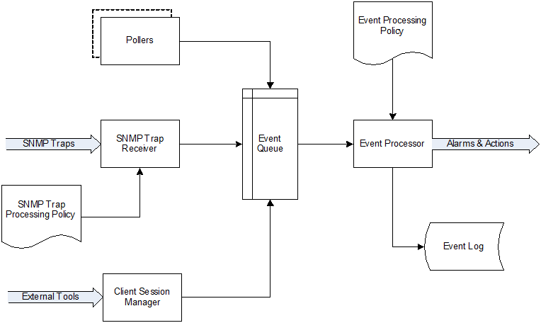

.. _concepts:

########
Concepts
########

Architecture overview
=====================

The system has three-tier architecture: the information is collected by
monitoring agents (either our own high-performance agents or SNMP agents) and
delivered to monitoring server for processing and storage. Network administrator
can access collected data using cross-platform Destkop Management Client, Web
Management Client or Management application for Android. Desktop and Web clients
have almost the same functionality and the same user interface.

  .. figure:: _images/architecture_scheme.png

.. _concept_object:

Objects
=======

All monitored network infrastructure is represented as a set of :term:`objects
<Object>` in |product_name| monitoring system. Each object represents one
physical or logical entity (e.g. host or network interface), or group of them
(e.g. subnet, container). Objects are organized into hierarchical structure.
Each object has it's own access rights. Access rights are applied hierarchically
on all children of object. For example if :guilabel:`Read` access right is
granted to a user on a :guilabel:`Container`, then user has :guilabel:`Read`
right on all objects that this :guilabel:`Container` contains. 

Every object has set of attributes; some of them exist for all objects (like
:guilabel:`id` and :guilabel:`name` or :guilabel:`status`), while other depend
on object class – for example, only :guilabel:`Node` objects have attribute
:guilabel:`SNMP community string`. In addition to the above mentioned
attributes, it's possible to define custom attributes. This can be done by user
in the Management Client, from NXSL script or by external application via
|product_name| API.

|product_name| has seven top level objects – ``Entire Network``, ``Service
Root`` (named "Infrastructure Services" after system installation), ``Template
Root``, ``Asset Root``, ``Network Map Root``, ``Dashboard Root`` and ``Business
Service Root``. These objects serve as an abstract root for an appropriate
object tree. All top level objects have only one editable attribute – name.

.. list-table::
   :widths: 20 50 30
   :header-rows: 1
   :class: longtable

   * - Object Class
     - Description
     - Valid Child Objects
   * - Entire Network
     - Abstract object representing root of IP topology tree. All zone are
       located under it. System can have only one object of this class.
     - - Zone
   * - Zone
     - Object representing group of (usually interconnected) IP networks
       without overlapping addresses. Contains appropriate subnet objects.
     - - Subnet
   * - Subnet
     - Object representing IP subnet. Typically objects of this class are created
       automatically by the system to reflect system's knowledge of IP
       topology. The system places Node objects inside an appropriate Subnet
       object based on an interface configuration. Subnet objects have only one
       editable attribute - :guilabel:`Name`.
     - - Node
   * - Service Root
     - Abstract object representing root of your infrastructure service tree.
       System can have only one object of this class. After system installation
       it is named "Infrastructure Services".
     - - Cluster
       - Chassis
       - Condition
       - Collector
       - Container
       - Mobile Device
       - Node
       - Rack
       - Sensor
       - Wireless Domain
   * - Collector
     - Object similar to container, but with data collection capabilities.
     - - Cluster
       - Chassis
       - Condition
       - Collector
       - Container
       - Mobile Device
       - Node
       - Rack
       - Sensor
       - Wireless Domain
   * - Container
     - Grouping object which can contain any type of objects that Service Root
       can contain. With help of container objects you can build
       object's tree which represents logical hierarchy of IT services in your
       organization.
     - - Cluster
       - Chassis
       - Condition
       - Collector
       - Container
       - Mobile Device
       - Node
       - Rack
       - Sensor
       - Wireless Domain
   * - Cluster
     - Pseudo-object defining any process: technological or logical that aggregates 
       information from several separate nodes. See
       :ref:`Cluster monitoring<cluster-monitoring>` for more information.
     - - Node
   * - Rack
     - Object representing a rack. It has the same purpose as container, but
       allows to configure visual representation of equipment installed in a rack.
     - - Node
       - Chassis
   * - Chassis
     - Object representing a chassis, e.g. a blade server enclosure. Chassis
       can be configured as a part of a rack.
     - - Node
   * - Condition
     - Object representing complicated condition – like "cpu on node1 is
       overloaded and node2 is down for more than 10 minutes". Conditions may
       represent more complicated status checks because each condition can have
       a script attached. Interval for evaluation of condition status is
       configured in Server Configuration Variables as ConditionPollingInterval
       with default value 60 seconds.
     -
   * - Node
     - Object representing physical host or network device (such as a router or network switch).
       These objects can be created either manually by administrator or automatically during
       network discovery process. They have a lot of attributes controlling all aspects
       of interaction between |product_name| server and managed node. For example, the attributes
       specify what data must be collected, how node status must be checked, which protocol
       versions to use, etc. Node objects contain one or more interface objects. The system
       creates interface objects automatically during configuration polls.
     - - Interface
       - Network Service
       - VPN Connector
   * - Interface
     - Interface objects represent network interfaces of managed computers and
       devices. These objects created automatically by the system during
       configuration polls or can be created manually by user.
     -
   * - Network Service
     - Object representing network service running on a node (like http or
       ssh), which is accessible online (via TCP IP). Network Service objects
       are always created manually. Currently, the system works with the following
       protocols - HTTP, POP3, SMTP, Telnet, SSH and Custom protocol type.
     -
   * - VPN Connector
     - Object representing VPN tunnel endpoint, is used for interfaceless tunnels (like ipsec). 
       Such objects can be created to add VPN tunnels to network topology known to |product_name| 
       server. VPN Connector objects are created manually. In case if there is a VPN
       connection linking two different networks open between two firewalls that are
       added to the system as objects, a user can create a VPN Connector object on
       each of the firewall objects and link one to another. The network topology will
       now show that those two networks are connected and the system will take this
       condition into account during problem analysis and event correlation.
     -
   * - Sensor
     - Logical object with data collection capabilities. |product_name| does not
       perform direct network communication with sensor, but data is collected
       by some other means, e.g. using MQTT protocol. 
     - 
   * - Wireless Domain
     - Object representing wireless network, made up from one or several
       wireless controllers (represented by nodes with Wireless Controller
       capability) and thin access points.
     - - Access point
       - Node
   * - Access point
     - Object representing thin wireless access point managed by a central
       controller. These objects are created automatically by the system.
     -
   * - Template Root
     - Abstract object representing root of your template tree.
     - - Template
       - Template Group
   * - Template Group
     - Grouping object which can contain templates or other template groups.
     - - Template
       - Template Group
   * - Template
     - Data collection template. See :ref:`Data collection<data-collection>` section
       for more information about templates.
     - - Acces point
       - Collector
       - Cluster
       - Mobile Device
       - Node
       - Sensor
   * - Asset Root
     - Abstract object representing root of hardware asset management tree.
     - - Asset
       - Asset group
   * - Asset Group
     - Grouping object which can contain assets or other asset group.
     - - Asset
       - Asset group
   * - Asset
     - Hardware management asset
     -
   * - Network Map Root
     - Abstract object representing root of your network map tree.
     - - Network Map
       - Network Map Group
   * - Network Map Group
     - Grouping object which can contain network maps or other network map groups
       groups.
     - - Network Map
       - Network Map Group
   * - Network Map
     - Network map.
     -
   * - Dashboard Root
     - Abstract object representing root of your dashboard tree.
     - - Dashboard
       - Dashboard Group
   * - Dashboard Group
     - Grouping object which can contain dashboards or other dashboard group
     - - Dashboard
       - Dashboard Group
   * - Dashboard
     - Dashboard. Can contain other dashboards.
     - - Dashboard
   * - Business Service Root
     - Abstract object representing root of your business service tree. System
       can have only one object of this class.
     - - Business Service
       - Business Service Prototype
   * - Business Service
     - Object representing single business service. Can contain other business
       services or business service prototypes. 
     - - Business Service
       - Business Service Prototype
   * - Business Service Prototype
     - Prototype from which business service objects are automatically populated. 
     - 

Object status
-------------

Each object has a status. Status of an object calculated based on:

   * Polling results
   * Status of child objects (e.g. interfaces of node, nodes under container)
   * Active alarms, associated with the object (after an alarm is resolved or terminated, it no longer affects object status)
   * Value of status :term:`DCIs<DCI>` (DCI that has ``Use this DCI for node status calculation`` property enabled)

There are multiple options for status calculation, see :ref:`status-calculation` for more information.

For some object classes, like Report or :term:`Template`, status is irrelevant. Status for such objects is always :guilabel:`Normal`.
Object's status can be one of the following:

.. list-table::
   :widths: 10 30 70
   :header-rows: 1

   * - Nr.
     - Status
     - Description
   * - 0
     - |NORMAL| Normal
     - Object is in normal state.
   * - 1
     - |WARNING| Warning
     - Warning(s) exist for the object.
   * - 2
     - |MINOR| Minor
     - Minor problem(s) exist for the object.
   * - 3
     - |MAJOR| Major
     - Major problem(s) exist for the object.
   * - 4
     - |CRITICAL| Critical
     - Critical problem(s) exist for the object.
   * - 5
     - |UNKNOWN| Unknown
     - Object's status is unknown to the management server.
   * - 6
     - |UNMANAGED| Unmanaged
     - Object is set to "unmanaged" state.
   * - 7
     - |DISABLED| Disabled
     - Object is administratively disabled (only applicable to interface objects).
   * - 8
     - |TESTING| Testing
     - Object is in testing state (only applicable to interface objects).

.. |NORMAL| image:: _images/icons/status/normal.png
.. |WARNING| image:: _images/icons/status/warning.png
.. |MINOR| image:: _images/icons/status/minor.png
.. |MAJOR| image:: _images/icons/status/major.png
.. |CRITICAL| image:: _images/icons/status/critical.png
.. |UNKNOWN| image:: _images/icons/status/unknown.png
.. |UNMANAGED| image:: _images/icons/status/unmanaged.png
.. |DISABLED| image:: _images/icons/status/disabled.png
.. |TESTING| image:: _images/icons/status/testing.png

Unmanaged status
----------------

Objects can be unmanaged. In this status object is not polled, DCIs are not collected,
no data is updated about object. This status can be used to store data about an object
that is temporary or permanently unavailable or not managed.

.. _maintenance_mode:

Maintenance mode
------------------

This is special status, that's why it is not included in above status list. This
status prevents event processing for specific node. While this node in maintenance
mode is still polled and DCI data is still collected, but no event is generated.

Event Processing
================

|product_name| is event based monitoring system. Events can come from different sources
(polling processes (status, configuration, discovery, and data collection), :term:`SNMP`
traps, and directly from external applications via client library).
All events all are forwarded to |product_name| Event Queue. 

|product_name| Event Processor can process events from Event Queue in 
either sequential or parallel mode. In sequential mode events are processed one-by-one.
Parallel processing mode allows to process events in several parallel threads, thus 
increasing processing performance. See :ref:`event-processing` for more information.  

Events in the Event Queue are processed according to rules defined in
:term:`Event Processing Policy<EPP>`. As a result of event processing, preconfigured
actions can be executed, and/or event can be shown up as :term:`alarm <Alarm>`.

Usually alarm represents something that needs attention of network administrators
or network control center operators, for example low free disk space on a server.
|product_name| provides one centralized location, the Alarm Browser, where alarms are
visible. It can be configured which events should be considered
important enough to show up as alarm.

   Event flow inside the monitoring system

.. _concepts_polling:

Polling
=======

For some type of objects |product_name| server start gathering status and
configuration information as soon as they are added to the system. These object
types are: nodes, access points, conditions, clusters, business services, zones
(if a zone has more then one proxy, proxy health check is being performed). This
process called *polling*. There are multiple polling types, each having specific
execution intervals (set by server configuration variables). In the end of
polling process hook script is being executed. 

.. list-table::
   :widths: 15 25 40 20
   :header-rows: 1

   * - Type
     - Purpose
     - Interval server configuration variable
     - Hook script
   * - Status
     - Determine current status of an object 
     - Objects.StatusPollingInterval
     - Hook::StatusPoll
   * - Configuration
     - Determine current configuration of an object (list of interfaces,
       supported protocols, etc.) By default executes auto bind scripts for
       templates and containers, use "Objects.AutobindOnConfigurationPoll"
       server configuration variable to disable.
     - Objects.ConfigurationPollingInterval
     - Hook::ConfigurationPoll
   * - Configuration (full)
     - Same as usual configuration poll but resets previously detected
       capabilities and detects them again. (can only be executed manually)
     - 
     -
   * - Interface Names
     - Updates names of the interfaces. This operation also happens during
       Configuration Poll. (can only be executed manually)
     - 
     -
   * - Topology
     - Gather information related to network link layer topology   
     - Topology.PollingInterval
     - Hook::TopologyPoll
   * - Routing
     - Gather information about IP routing (cannot be executed manually)  
     - Topology.RoutingTableUpdateInterval
     - 
   * - ICMP
     - Ping nodes and gather response time statistics (cannot be executed
       manually)
     - ICMP.PollingInterval
     -
   * - Instance Discovery
     - Perform Instance Discovery to add/remove DCIs
     - DataCollection.InstancePollingInterval
     - Hook::InstancePoll
   * - Automatic Binding
     - Checks and bind or unbind Containers, Templates and Context Dashboards to
       nodes according to auto-bind script. 
     - Objects.AutobindPollingInterval
     - 
   * - Network Discovery
     - Searches for new nodes by polling information about neighbor IP addresses from known nodes
     - NetworkDiscovery.PassiveDiscovery.Interval
     - Hook::DiscoveryPoll

Polling intervals can be set for specific objects by adding a custom attribute named
``SysConfig:nnn``, where ``nnn`` is the name of server configuration variable e.g.:
``SysConfig:Objects.ConfigurationPollingInterval``. 

.. _basic-concepts-dci:

Data Collection
===============

From each node |product_name| can collect one or more :term:`metrics <Metric>` which
can be either single-value (e.g. "CPU.Usage"), list (e.g. "FileSystem.MountPoints")
or table (e.g. "FileSystem.Volumes").
When new data sample is collected, it's value is checked against configured
thresholds. This documentation use term :term:`Data Collection Item <DCI>` (DCI)
to describe configuration of metric collection schedule, retention, and thresholds.

Metrics can be collected from multiple data sources:

.. list-table::
   :widths: 30 70
   :header-rows: 1

   * - Source
     - Description
   * - Internal
     - Data generated inside |product_name| server process (server statistics, etc.)
   * - |product_name| Agent
     - Data is collected from |product_name| agent, which should be installed
       on target node. Server collect data from agent based on schedule.
   * - SNMP
     - SNMP transport will be used. Server collect data based on schedule.
   * - Web service
     - Data is objained from JSON, XML, or plain text retrieved via HTTP
   * - Push
     - Values are pushed by external system (using `nxpush` or API) or from NXSL script. 
   * - Windows Performance counters
     - Data is collected via |product_name| agent running on Windows machine. 
   * - Script
     - Value is generated by NXSL script. Script should be stored in
       :guilabel:`Script Library`.
   * - SSH
     - Data is obtained from output of ssh command executed through SSH connection.
   * - MQTT
     - Data is obtained by subcribing to MQTT broker topics. 
   * - Network Device Driver
     - Some SNMP drivers (NET-SNMP, RITTAL as of |product_name| v. 3.8) provide
       parameters for data collection. E.g. NET-SNMP provides information about
       storage this way. 

Discovery
=========

Network discovery
-----------------

|product_name| can detect new devices and servers on the network and automatically
create node objects for them. Two modes are available – passive and active.

In passive mode server will use only non-intrusive methods by querying ARP and
routing tables from known nodes. Tables from the server running |product_name| are
used as seed for passive discovery.

In active mode in addition to passive scan methods configured address ranges
are periodically scanned using ICMP echo requests.

|product_name| can also use SNMP trap and syslog messages as seed for discovery. 

Instance discovery
------------------

|product_name| can create metrics names for :term:`Data Collection Item <DCI>`
automatically. Instance discovery collects information about node instances like
disk mountpoints, device list, etc. and automatically creates or removes
:term:`DCIs <DCI>` with obtained data.

Security
========

All communications are encrypted using either AES-256, AES-128, or Blowfish and
authenticated. As additional security measure, administrator can restrict list
of allowed ciphers.

Agent authenticate incoming connections using IP white list and optional
preshared key.

User passwords (if internal database is used) as hashed with salt with SHA-256.

All shared secrets and passwords stored in the system can be obfuscated
to prevent snooping.
