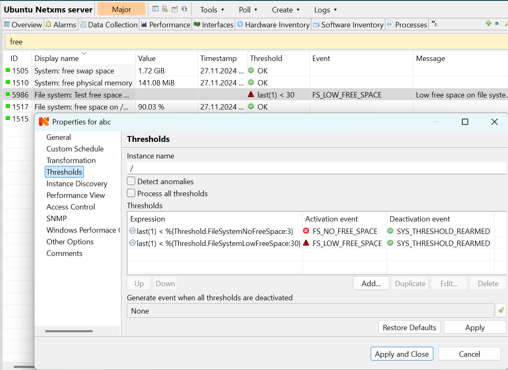
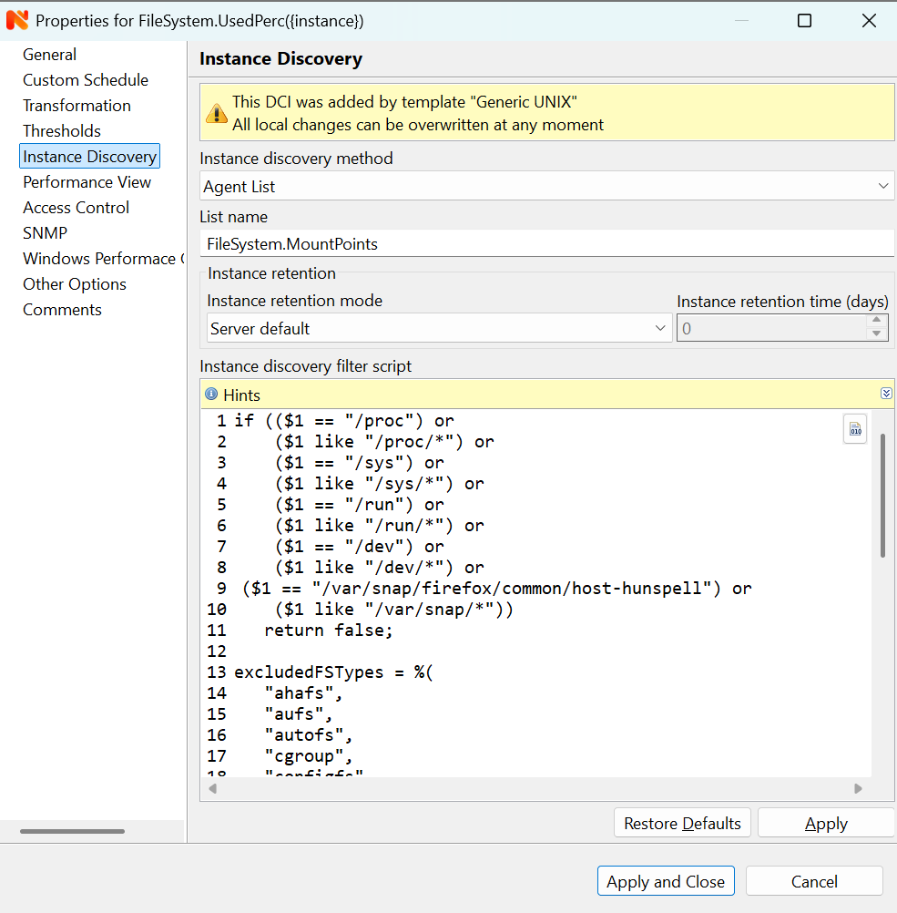
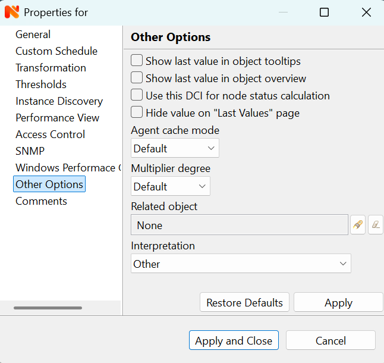

.. _data-collection:

###############
Data collection
###############

.. _how_data_collection:

How data collection works
=========================

Every node can have many data collection items configured (see
:ref:`basic-concepts-dci` for detailed description). |product_name| server has a
set of threads dedicated to data collection, called `Data Collectors`, used to
gather information from the nodes according to :term:`DCI` configuration. You
can control how many data collectors will run simultaneously, by changing server
configuration parameter ``ThreadPool.DataCollector.MaxSize``.

Node capabilities provide information about available sources for data collection in the :guilabel:`Overview`-> :guilabel:`Capabilities` section.  The last values of DCIs for the node can be found on the :guilabel:`Data Collection` tab. Additionally, specific DCIs can be displayed in the :guilabel:`Overview`` -> :guilabel:`Last Values section` 
or as a graph on the :guilabel:`Performance` tab. More details about DCI display configuration options can be found in the :ref:`Other options <dci-other-options-label>` and :ref:`Performance View <dci-performance-view>` chapters.

All configured DCIs are checked for polling requirement every second. If DCI needs to be polled, appropriate polling request is placed into internal
data polling queue. First available data collector will pick up the request and
gather information from the node according to DCI configuration. If a new value
was received successfully, it's being stored in the database, and thresholds
are checked. After threshold checking, data collector is ready for processing
new request. If DCI is unsuported it will be polled only every tenth poll, this is not configurable.
Processing of a newly received metric value is outlined on the
figure below.

.. figure:: _images/dci_param_proc.png

   Newly received metric processing

It is also possibility to push data to server. If DCI source is set to
:guilabel:`Push`, server just waits for new values instead of polling from
a data source.

By default, DCI data is not collected for the duration while connection between
server and agent is broken as poll request would not get to agent. There is
special configuration that allows data collection and storage on agent till
connection with server is restored and collected data is pushed to the server thereafter.
This option is available for metrics, table metrics and proxy SNMP metrics as well as
implemented for proxy SNMP table metrics and DCIs with custom schedule. In case
of this setup, agent stores DCI configuration locally and does all metric
collection and dispatch on its own. DCI configuration is synchronized on
connect, DCI configuration change or SNMP proxy server change. Information about
configuration options can be found here: :ref:`offline-data-collection`.

.. _dci-configuration:

DCI configuration
=================

Data collection for a node can be configured using management client. To open
data collection tab view, click on node object in
:guilabel:`Infrastructure` or  :guilabel:`Network` perspective, and click
:guilabel:`Data Collection` tab. You will see the list of configured
data collection items. From here, since DCI configuration and Last values are combined, 
one can see collected data and configure new or change existing metrics for monitoring. Right click on an item 
and all possible configuration options will be available.

Each DCI have multiple attributes which affects the way data is collected.
Detailed information about each attribute is given below and can be accessed by selecting :guilabel:`Edit...`, 
:guilabel:`New parameter...` or :guilabel:`New table...`.

General
-------

.. figure:: _images/dci_general_page.png

    DCI configuration general property page

Display name
~~~~~~~~~~~~

Display name is a free form text string describing DCI. It is not used by the
server and is intended for better information understanding by operators. If
you use the :guilabel:`Select` button to choose a metric from the list,
description field will be filled in automatically.

Metric
~~~~~~

Name of the metric of interest, used for making a request to target node.
For |product_name| Agent and Internal metrics it will be metric name, and for
SNMP agent it will be an SNMP OID. You can use the :guilabel:`Select` button
for easier selection of required metric name.

Available agent metric names are obtained during :guilabel:`Configuration poll`.

Origin
~~~~~~

Origin of data (method of obtaining data). Possible single-value origins are:

.. list-table::
   :widths: 30 70
   :header-rows: 1

   * - Source
     - Description
   * - Internal
     - Data generated inside |product_name| server process (server statistics, etc.)
   * - |product_name| Agent
     - Data is collected from |product_name| agent, which should be installed
       on target node. Server collect data from agent based on schedule.
   * - SNMP
     - SNMP transport will be used. Server collect data based on schedule.
   * - Web service
     - Data is objained from JSON, XML, or plain text retrieved via HTTP
   * - Push
     - Values are pushed by external system (using `nxpush` or API) or from NXSL script. 
   * - Windows Performance counters
     - Data is collected via |product_name| agent running on Windows machine.
       Windows Performance counters metric has format
       ``Object(Instance)\Counter``, e.g. ``\LogicalDisk(C:)\Avg. Disk Write
       Queue Length``.
   * - Script
     - Value is generated by NXSL script. Script should be stored in
       :guilabel:`Script Library`.
   * - SSH
     - Data is obtained from output of ssh command executed through SSH connection.
   * - MQTT
     - Data is obtained by subcribing to MQTT broker topics. 
   * - Network Device Driver
     - Some SNMP drivers (e.g. NET-SNMP, RITTAL) provide metrics for data
       collection. E.g. NET-SNMP provides information about storage this way. 
   * - Modbus
     - Data is collected via Modbus-TCP industrial protocol. See :ref:`modbus`
       for more information. 

:guilabel:`Push Agent` origin is different from all others, because it
represents DCIs whose values are pushed to server by external program (usually
via :ref:`nxapush-label` or :ref:`nxpush-label` command line tool) instead of
being polled by the server based on the schedule. Values can also be pushed from
a NXSL script launched on the server. 

Possible table metric origins are Internal, |product_name| agent, SNMP, Script. Please refer to description in above table.

Data Type
~~~~~~~~~

Data type for column. Can be one of the following: :guilabel:`Integer`,
:guilabel:`Unsigned Integer`, :guilabel:`Integer 64-bit`, :guilabel:`Unsigned Integer 64-bit`, :guilabel:`Counter 32-bit`, :guilabel:`Counter 64-bit`, :guilabel:`Float` (floating point number), or
:guilabel:`String`. Selected data type affects collected data processing - for
example, you cannot use operations like ``less than`` or ``greater than`` on
strings. If you select metric from the list using the :guilabel:`Select` button,
correct data type will be set automatically.

Source node override
~~~~~~~~~~~~~~~~~~~~

Source node of metrics collection. This can be used when other node provides
information about current node. In this way, platform provides additional flexibility of where 
metrics collection is taking place.

Other example of usage is virtual nodes (nodes with IP 0.0.0.0). In this case,
node state can be obtained from the DCI created on current node, but collected
from the other one.

Data is collected from the current node if no value is set.

Collection schedule
~~~~~~~~~~~~~~~~~~~

Polling mode and interval describe schedule type and interval between consecutive
polls, in seconds. However, collecting too many values for too long will lead to
significant increase of your database size and possible performance degradation.

Following options can be selected:

    - :guilabel:`Server default interval` - default value will be taken from
      :guilabel:`DataCollection.DefaultDCIPollingInterval` server configuration parameter.
    - :guilabel:`Custom interval` - Allows to enter a custom value. This field
      supports macro resolution, so e.g. you can use %{polling_interval:600}
      macro that will take value of ``polling_interval`` custom attribute or 600,
      if such custom attribute is not present on the node. 
    - :guilabel:`Advanced scheduling` - schedules configured in
      :guilabel:`Custom Schedule` page will be used.

If you turn on :guilabel:`Advanced Schedule` flag, additional link to :guilabel:`Custom Schedule` will appear 
and, once configured, server will use custom schedule for collecting
DCI values instead of fixed intervals. Advanced schedule consists of one or more records;
each representing desired data collection time in cron-style format.

See :ref:`cron_format` for supported cron format options.

For DCI Collection schedule it's possible to specify optional sixth (first from left ) cron field
for resolution in seconds. It's not recommended to use seconds in custom
schedules as your main data collection strategy though. Use seconds only
if it is absolutely necessary.

History retention period
~~~~~~~~~~~~~~~~~~~~~~~~

This attribute specifies how long the collected data should be kept in
database, in days. Minimum retention time is 1 day and maximum has not limit.
However, keeping too many collected values for too long may lead to
significant increase of your database size and possible performance
degradation.

Following options can be selected:

    - :guilabel:`Server default` - default value will be taken from
      :guilabel:`DataCollection.DefaultDCIRetentionTime` server configuration parameter.
    - :guilabel:`Custom` - Allows to enter a custom value. This field supports
      macro resolution, so for example you can use %{storage_period:30} macro that will
      take value of ``storage_period`` custom attribute or 30 if such custom
      attribute is not present on the node. 
    - :guilabel:`Do not save collected data to database` - will not save
      collected data to database, but will store last value in memory

Last option is used when it is required to show latest (every 1 second
collected) data on Dashboard, however it would result in excessive data stored in database. So, 2
DCI configurations are created - one to store historical data collected once per
minute and the second one, that is not stored in database, but is collected
every second and displayed on dashboards in close to real time.

    - :guilabel:`Save only changed values` - if enabled, value is saved to the
      database only if it differs from last saved value. 

Cluster
-------

This section is available only for DCI's collected on cluster.

.. figure:: _images/dci_cluster_page.png

    DCI configuration cluster property page

Associate with cluster resource
~~~~~~~~~~~~~~~~~~~~~~~~~~~~~~~

In this field one can specify cluster resource associated with DCI. Data
collection and processing will occur only if node, you configured DCI for, is
current owner of this resource. This field is valid only for cluster member
nodes.

.. _data-agregation:

Data aggregation
~~~~~~~~~~~~~~~~

This section specifies how cluster data aggregation is done.
:guilabel:`Aggregate values from cluster nodes` option means that DCI from cluster
will be collected on each node separately and aggregated on cluster using one of the
aggregation options.

Aggregation options:

    - Total
    - Average
    - Min
    - Max

Data Transformations
--------------------

In simplest case, |product_name| server collects values of specified metrics and
stores them in database. However, you can also specify various
transformations for original value. For example, you may be interested in a
delta value, not in a raw value of some metric. Or, you may want to have
metric's value converted from bytes to kilobytes. All transformations will
take place after receiving new value and before threshold processing.

Data type after transformation - drop down menu of required data type.

Data transformation consists of two steps. In the first step, delta calculation
is performed. You can choose four types of delta calculation:

=================== ===========================================================
Function            Description
=================== ===========================================================
None                No delta calculation performed. This is the default
                    setting for newly created DCI.
Simple              Resulting value will be calculated as a difference
                    between current raw value and previous raw value.
                    By raw value it is meant the metric's value
                    originally received from host.
Average per second  Resulting value will be calculated as a difference
                    between current raw value and previous raw value,
                    divided by number of seconds passed between current
                    and previous polls.
Average per minute  Resulting value will be calculated as a difference
                    between current raw value and previous raw value,
                    divided by number of minutes passed between current
                    and previous polls.
=================== ===========================================================

In second step, custom transformation script is executed (if present). By
default, newly created DCI does not have a transformation script. If
transformation script is applied, the resulting value of the first step is
passed to the transformation script as a parameter; and a result of script
execution is the final DCI value. Transformation script gets original value as
first argument (available via special variable ``$1``), and also has two
predefined global variables: ``$node`` (reference to current node object), and
``$dci`` (reference to current DCI object).

In case of table DCIs, ``$1`` special variable is an object of type Table.

For more information about |product_name|
scripting language, please refer to :ref:`scripting` chapter in this manual.

Transformation script can be tested in the same view, by clicking :guilabel:`Test...`
and entering test input data.

.. figure:: _images/dci_transformation_page.png

    DCI configuration transformation property page

Thresholds
----------

For every DCI you can define one or more thresholds. For each threshold there is a
pair of condition and event - if condition becomes true, associated event is
generated. To configure thresholds, open data collection :guilabel:`Edit...` mode for node or
template DCI. You can add, modify and delete thresholds using buttons below the
threshold list. If you need to change the threshold order, select one threshold
and use arrow buttons located on the right to move the selected threshold up or down.

    DCI configuration threshold property page

Threshold Processing
~~~~~~~~~~~~~~~~~~~~

.. figure:: _images/threshold_processing_algorithm.png

   Threshold processing algorithm

As you can see from above flowchart, threshold order is very important. Let's
consider the following example: you have DCI representing CPU utilization on
the node, and you wish two different events to be generated - one when CPU
utilization exceeds 50%, and another one when it exceeds 90%. What happens when
you place threshold ``> 50`` first, and ``> 90`` second? The following table
shows values received from host and actions taken by monitoring system
(assuming that all thresholds initially unarmed):

====== ========================================================================
Value    Action
====== ========================================================================
10     Nothing will happen.
55     When checking first threshold (``> 50``), the system will find
       that it's not active, but condition evaluates to true. So, the system
       will set threshold state to "active" and generate event
       associated with it.
70     When checking first threshold (``> 50``), the system will find
       that it's already active, and condition evaluates to true.
       So, the system will stop threshold checking and
       will not take any actions.
95     When checking first threshold (``> 50``), the system will find
       that it's already active, and condition evaluates to true.
       So, the system will stop threshold checking and will not
       take any actions.
====== ========================================================================

Please note that second threshold actually is not working, because it is
masked by the first threshold. To achieve desired results, you should place
threshold ``> 90`` first, and threshold ``> 50`` second.

You can disable threshold ordering by checking :guilabel:`Always process all
thresholds` checkbox. If enabled, system will always process all
thresholds.

Threshold Configuration
~~~~~~~~~~~~~~~~~~~~~~~

When adding or modifying a threshold, you will see the following dialog:

First, you have to select what value will be checked:

======================== ======================================================
Last polled value        The last value will be used. If number of polls is set to
                         more then ``1``, then condition will evaluate to true
                         only if it's true for each individual value of
                         last ``N`` polls.
Average value            Average value for last ``N`` polls will be used
                         (you have to configure required number of polls).
Mean deviation           Mean absolute deviation for last ``N`` polls will be
                         used (you have to configure required number of
                         polls). Additional information on how mean absolute
                         deviation is calculated can be found `here
                         <http://en.wikipedia.org/wiki/Mean_deviation>`_.
Diff with previous value Delta between the last and previous values will be
                         used. If DCI data type is string and the last and previous values match, system will use
                         ``0``, and if they don't - ``1``.
Data collection error    An indicator of data collection error. Instead of
                         DCI's value, system will use ``0`` if data collection
                         was successful, and ``1`` if there was a data
                         collection error. You can use this type of
                         thresholds to catch situations when DCI's value
                         cannot be retrieved from agent.
Sum of values            Sum DCI values for the number of samples specified 
                         and will compare it with the value. 
                         Side note - in THRESHOLD_REACHED there are two parameters - 
                         one is last DCI value and the other is value calculated by 
                         the threshold, and if number of samples is >1, then these 
                         values can be different.
Script                   This will enable script editor, so one can make a script 
                         that makes a decision. If it returns true it means to 
                         trigger the threshold, if false - rearm threshold. There 
                         are some variables available inside the script, $dci, 
                         $1 etc. Value input field (which is below Samples) can 
                         be read from there, which can be convenient, as one 
                         can still use this field to store some threshold value.
Absolute deviation       Similar to mean deviation - will take number of datapoints 
                         specified in Samples and calculate deviation from these.
Anomaly                  If checkbox "Detect anomalies" is selected, server will 
                         use `Isolation Forest <https://en.wikipedia.org/wiki/Isolation_forest>`_ algorithm to check if new value is 
                         an outlier within two set of data points - all values 
                         within 30 minutes of current time of the day for last 
                         30 days, and all values within 30 minutes around 
                         current time of the day on the same day of the week 
                         for last 10 weeks. If new data point is classified as 
                         outlier in both data sets, DCI will be marked as having 
                         anomalous value. Using this setting may adversly affect your database performance. This is an experimental feature - use with caution.
======================== ======================================================

Second, you have to select comparison function. Please note that not all
functions can be used for all data types. Below is a compatibility table:

================ === ======== ======= ===== ========== ========= ===== ======
Type/Function    Int Unsigned Counter Int64 Unsigned64 Counter64 Float String
================ === ======== ======= ===== ========== ========= ===== ======
Less             X   X        X       X     X          X         X
Less or equal    X   X        X       X     X          X         X
Equal            X   X        X       X     X          X         X      X
Greater or equal X   X        X       X     X          X         X
Greater          X   X        X       X     X          X         X
Not equal        X   X        X       X     X          X         X      X 
Like                                                                    X
Not like                                                                X
================ === ======== ======= ===== ========== ========= ===== ======

Third, you have to set a value to check against. If you use ``like`` or ``not
like`` functions, value is a pattern string where you can use meta characters -
asterisk (``*``), which means "any number of any characters", and/or question mark
(``?``), which means "any character".

Fourth, you have to select events to be generated when the condition becomes
true or returns to false. By default, system uses ``SYS_THRESHOLD_REACHED`` and
``SYS_THRESHOLD_REARMED`` events, but in most cases you will change it to your
custom events.

You can also configure threshold to resend activation event if threshold's
condition remain true for specific period of time. You have three options -
default, which will use server-wide settings, never, which will disable
resending of events, or specify interval in seconds between repeated events.

Thresholds and Events
~~~~~~~~~~~~~~~~~~~~~

You can choose any event to be generated when threshold becomes active or
returns to inactive state. However, you should avoid using predefined system
events (their names usually start with ``SYS_`` or ``SNMP_``). For example, you
may set event ``SYS_NODE_CRITICAL`` to be generated when CPU utilization exceeds
80%. System will generate this event, but it will also generate the same event
when node status will change to :guilabel:`CRITICAL`. In your event
processing configuration, you will be unable to determine actual reason for
that event generation, and probably will get some unexpected results. If you
need custom processing for specific threshold, you should create your own event
first, and use this event in the threshold configuration. |product_name| has some
preconfigured events that are intended to be used with thresholds. Such event names
start with ``DC_``.

System will pass the following parameters to events generated as a
reaction to single-value DCI threshold violation:

.. list-table::
   :widths: 10 20 60
   :header-rows: 1

   * - Parameter number
     - Named parameter
     - Description
   * - 1
     - dciName
     - Data collection item name
   * - 2
     - dciDescription
     - Data collection item description
   * - 3
     - thresholdValue
     - Threshold value
   * - 4
     - currentValue
     - Current value (e.g. average for several samples for averaging threshold)
       that is compared to threshold value
   * - 5
     - dciId
     - Data collection item ID
   * - 6
     - instance
     - Instance
   * - 7
     - isRepeatedEvent
     - Repeat flag
   * - 8
     - dciValue
     - Last collected DCI value
   * - 9
     - operation
     - Threshold's operation code
   * - 10
     - function
     - Threshold's function code
   * - 11
     - pollCount
     - Threshold's required poll count
   * - 12
     - thresholdDefinition
     - Threshold's textual definition

Event parameters can be accessed by number or by name via macros to form event
message. For example, if you are creating a custom event that is intended to be
generated when file system is low on free space, and wish to include file system
name, actual free space, and threshold's value into event's message text, you
can use message template like this:

  ``File system %<instance> has only %<currentValue> bytes of free space
  (threshold: %<thresholdValue> bytes)``

For table threshold violation the following parameters are passed to generated
events:

.. list-table::
   :widths: 10 20 60
   :header-rows: 1

   * - Parameter number
     - Named parameter
     - Description
   * - 1
     - dciName
     - Table DCI name
   * - 2
     - dciDescription
     - Table DCI description
   * - 3
     - dciId
     - Table DCI ID
   * - 4
     - row
     - Table row
   * - 5
     - instance
     - Instance

For events generated on threshold's return to inactive state (default event is
``SYS_THRESHOLD_REARMED``), event parameter list is different:

.. list-table::
   :widths: 10 20 60
   :header-rows: 1

   * - Parameter number
     - Named parameter
     - Description
   * - 1
     - dciName
     - Data collection item name
   * - 2
     - dciDescription
     - Data collection item description
   * - 3
     - dciId
     - Data collection item ID
   * - 4
     - instance
     - Instance
   * - 5
     - thresholdValue
     - Threshold value
   * - 6
     - currentValue
     - Current value (e.g. average for several samples for averaging threshold)
       that is compared to threshold value
   * - 7
     - dciValue
     - Last collected DCI value
   * - 8
     - operation
     - Threshold's operation code
   * - 9
     - function
     - Threshold's function code
   * - 10
     - pollCount
     - Threshold's required poll count
   * - 11
     - thresholdDefinition
     - Threshold's textual definition

For table DCI threshold rearm the following parameters are passed to generated
events:

.. list-table::
   :widths: 10 20 60
   :header-rows: 1

   * - Parameter number
     - Named parameter
     - Description
   * - 1
     - dciName
     - Table DCI name
   * - 2
     - dciDescription
     - Table DCI description
   * - 3
     - dciId
     - Table DCI ID
   * - 4
     - row
     - Table row
   * - 5
     - instance 
     - Instance

Instance
--------

Each DCI has an :guilabel:`Instance` attribute, which is a free-form text
string, passed as a 6th parameter to events associated with thresholds. You can
use this parameter to distinguish between similar events related to different
instances of the same entity. For example, if you have an event generated when
file system was low on free space, you can set the :guilabel:`Instance`
attribute to file system mount point.

Sometimes you may need to monitor multiple instances of some entity, with exact
names and number of instances not known or different from node to node. Typical
example is file systems or network interfaces. To automate creation of DCIs for
each instance, you can use instance discovery mechanism. First you have to
create "master" DCI. Create DCI as usual, but in places where normally you
would put instance name, use the special macro {instance}. Then, go to
:guilabel:`Instance Discovery` tab in DCI properties, and configure instance
discovery method and optionally filter script.

Instance discovery creates 2 macros for substitution:

    - {instance} - instance name
    - {instance-name} - instance user-readable description

    DCI configuration instance discovery property page

Instance Discovery Methods
~~~~~~~~~~~~~~~~~~~~~~~~~~

The following instance discovery methods are available:

.. list-table::
   :widths: 25 15 60
   :header-rows: 1

   * - Method
     - Input Data
     - Description
   * - Agent List
     - List name
     - Read list from agent and use it's values as instance names.
   * - Agent Table
     - Table name
     - Read table from agent and use it's instance column values as instance
       names. If there are several instance columns in that table, a
       concatenation of values will be used, separated by ``~~~`` (three tilda
       characters).
   * - SNMP Walk - Values
     - Base OID
     - Do SNMP walk starting from given OID and use values of returned varbinds
       as instance names.
   * - SNMP Walk - OIDs
     - Base OID
     - Do SNMP walk starting from given OID and use IDs of returned varbinds as
       instance names.
   * - Script
     - Script name
     - Instance names are provided by a script from script library. The script
       should return an array (with elements representing instance names) or a
       map (keys represent instance names and values represent user-readable
       description)
   * - Windows Performance Counters
     - Object name, e.g. ``LogicalDisk``.
     - Instances of given object will be taken.
   * - Web Service
     - Definition:path
     - Web service request field contains web service definition name with
       optional arguments and path to the root element of the document where
       enumeration will start. Each sub-element of given root element will be
       considered separate instance.
   * - Internal Table
     - Table name
     - Read |product_name| server internal table and use it's instance column
       values as instance names. If there are several instance columns in that
       table, a concatenation of values will be used, separated by ``~~~``
       (three tilda characters).

Instance Discovery Filter Script
~~~~~~~~~~~~~~~~~~~~~~~~~~~~~~~~

You can optionally filter out unneeded instances, transform instance names and
add user-readable description using filtering script written in NXSL. Script
will be called for each instance and can return either a binary value or an
array.

If binary value is returned, it has the following meaning:
``TRUE`` (to accept instance), ``FALSE`` (to reject instance).

If an array is returned, then instance is counted as accepted. Only first element 
of the array is mandatory, the rest elements are optional (but to include an 
element, all preceding elements should be included). Array structure:

======================== ==========================================================
Data type                Description
======================== ==========================================================
String                   Instance name, that will be available as {instance} macro.
String                   Instance user-readable description, that will be available
                         as {instance-name} macro
NetObj                   Object connected with this :term:`DCI`
======================== ==========================================================

.. _dci-performance-view:

Performance view
----------------

This section provides configuration options for displaying DCI values as line charts on the :guilabel:`Performance tab`. Various options are available to visually represent the collected data; see :ref:`Data and Network visualization <visualisation>` for more details.

.. note::

  Note: Not available for table metrics.

    DCI configuration instance discovery property page

Multiple DCIs can be grouped in one graph. To group them use the same group name in “Group” field.

Access Control
--------------

This page provides access control management option to each DCI. If no user set,
then access rights are inherited from node. So any user that is able to read
node is able to see last value of this DCI and user that is able to modify node
is able to change and see DCI configuration.  When list is not empty, then both
access to node and access to DCI are check on DCI configuration or value
request.

.. figure:: _images/dci_access_control_page.png

    DCI configuration access control property page

SNMP
----

SNMP page provides additional options for SNMP data collection or processing. Like: how to interpret collected SNMP octet string or to use custom port or version for data collection.

Windows Performance Counters
----------------------------

.. _dci-other-options-label:

Other options
-------------

Other available options:

    - Show last value in object tooltip - shows DCI last value on tooltip that
      is shown on network maps.
    - Show last value in object overview - shows DCI last value on
      :guilabel:`Overview`->\ :guilabel:`Last Values` page.
    - Use this DCI for node status calculation - Uses value returned by this DCI
      as a status, that participate in object status calculation. Such kind of
      DCI should return integer number from 0 till 4 representing object status.
    - Related object - object that is related to collected DCI. Related object
      can be set by instance discovery filter script and accessed in NXSL from
      DCI object. 

    DCI configuration other option property page

Comments
--------

This configuration page can be used freely for text comments to add additional notes about DCI configuration or usage. These comments are added to alarms created from threshold violation events. For example, they can be used to inform operators about problem-solving approaches. 

.. _dci-push-parameters-label:

Push metrics
============

|product_name| gives you ability to push DCI values when you need it instead of
polling them on specific time intervals. To be able to push data to the server,
you should take the following steps:

#. Set your DCI's origin to Push Agent and configure other properties as usual,
   excluding polling interval which is meaningless in case of pushed data.
#. Create separate user account or pick an existing one and give "Push Data"
   access right on the DCI owning node to that user.
#. Use :ref:`nxapush-label` or :ref:`nxpush-label` utility or client API for
   pushing data.

DCI types
=========

Single-value DCIs
-----------------

Single-value metrics, as the name suggests, collect only one data value. 

Table DCIs
----------

Table metrics can collect data in bulk, effectively encapsulating multiple 
values that can be collected simultaneously. 

.. figure:: _images/dci_table.png
  
  Table example

They're primarily used when it is necessary to gather bulk data, like data 
sets that can be acquired together or for atomic collection. Atomic collection 
is when you need to take a data snapshot that consists of multiple items 
collected at the exact same time. By right-click on string or non string value one can
access history, and line chart builds are possible for non string values.

There are distinct benefits to using table metrics. But they're not without 
their disadvantages. As tables are not single values, they require more 
storage, which can be one of the potential drawbacks. 

Furthermore, the threshold configuration can be more complicated for table 
metrics because they have multiple rows and columns. 

Unlike a single value where you can easily specify a threshold for when 
something is wrong, with a table, you have to specify which instance or 
item in a column has an issue.

List DCIs
---------

Usually DCIs have scalar values. A list DCI is a special DCI which returns a
list of values. List DCIs are mostly used by |product_name| internally (to get
the list of network interfaces during the configuration poll, for example), but
can also be utilized by user in some occasions. |product_name| Management
Client does not support list DCIs directly, but their names are used as input
parameters for Instance Discovery methods. List DCI values can be also obtained
with :command:`nxget` command line utility (e.g. for use in scripts).

.. _offline-data-collection:

Agent caching mode
==================

Agent caching mode allows metric data to be obtained for the time being while
connection between server and agent have been broken. This option is available
for metrics, table metrics and proxy SNMP metrics as well as for proxy
SNMP table metrics and DCIs with custom schedule. In absence of connection
to the server, collected data is stored on agent and once connection is restored, data
is sent to server. Detailed description can be found there:
:ref:`how_data_collection`.

Agent side cache is configurable globally, on node and DCI levels. Configuration can be changed separately 
on each level. By default it's off.

All collected data goes thought all transformations and thresholds only when it
comes to server. In order to prevent generation of old events, one can set
:guilabel:`DataCollection.OfflineDataRelevanceTime` configuration variable to time period in
seconds within which received offline data still relevant for threshold
validation. By default it is set to 1 day.

Configuration
-------------

It can be configured:
  - globally - set configuration parameter :guilabel:`Agent.DefaultCacheMode` to
    :guilabel:`on` or :guilabel:`off`.
  - on node level - :guilabel:`Agent cache mode` can be changed to
    :guilabel:`on`, :guilabel:`off` or :guilabel:`default` (use global settings)
    in node properties on :guilabel:`Polling` page
  - on DCI level - :guilabel:`Agent cache mode` can be changed to
    :guilabel:`on`, :guilabel:`off` or :guilabel:`default` (use node level
    settings) in DCI properties on :guilabel:`General` page

.. _last-values:

Data Collection tab
===================

Data Collection tab provides information about all data collected
on a node: DCI last value, last collection timestamp and threshold status.

It is possible to check last values or raw last values in textual format or as a chart
by right clicking on DCI and selecting corresponding display format.

Click on :guilabel:`Edit mode` to obtain more detaled view.

 
Status
------

:term:`DCI` status can be one of the following: :guilabel:`Active`,
:guilabel:`Disabled`, :guilabel:`Not Supported`. Server will collect data only
if the status is :guilabel:`Active`. If you wish to stop data collection
without removing :term:`DCI` configuration and collected data, the
:guilabel:`Disabled` status can be set manually. If requested metric is not
supported by target node, the :guilabel:`Not Supported` status is set by the
server.

.. _data-collection-templates:

Templates
=========

What is template
----------------

Often you have a situation when you need to collect same metrics from
different nodes. Such configuration making may easily fall into repeating one
action many times. Things may became even worse when you need to change
something in already configured DCIs on all nodes - for example, increase
threshold for CPU utilization. To avoid these problems, one can use data
collection templates. Data collection template (or just template for short) is
a special object, which can have DCIs configured and grouped for similar or logical 
purposes and applied to relevant node or node group ( for example, Collector or Cluster in 
:guilabel:`Infrastructure` perspective). Templates can be accessed from :guilabel:`Template` perspective.

When you create template and configure DCIs for it, nothing happens - no data
collection will occur. Then, you can apply this template to one or multiple
nodes - and as soon as you do this, all DCIs configured in the template object
will appear in the target node objects, and server will start data collection
for these DCIs. If you then change something in the template data collection
settings - add new DCI, change DCI's configuration, or remove DCI - all changes
will be reflected immediately in all nodes associated with the template. You
can also choose to remove template from a node. In this case, you will have two
options to deal with DCIs configured on the node through the template - remove
all such DCIs or leave them, but remove relation to the template. If you delete
template object itself, all DCIs created on nodes from this template will be
deleted as well.

Please note that you can apply unlimited number of templates to a node - so
you can create individual templates for each group of metrics (for example,
generic performance metrics, MySQL metrics, network counters, etc.) and
combine them, as per your business requirements.

Creating template
-----------------

To create a template, right-click on :guilabel:`Template Root` or
:guilabel:`Template group` object in :guilabel:`Template` perspective, and click
:menuselection:`Create --> Template`. Enter a name for a new template and click
:guilabel:`OK`. 

Configuring templates
---------------------

To configure DCIs in the template, click on :guilabel:`Template` object
in the :guilabel:`Template` perspective, then right-click in :guilabel:`Data Collection` tab view
and select :guilabel:`New parameter...` or :guilabel:`New table...` for further data collection configuration. 
You can configure DCIs in the same way as the node objects. Another way to apply configuration in 
:guilabel:`Template` - create DCI in :guilabel:`Infrastructure` or :guilabel:`Network` perspective and convert it 
to template item, as seen below.

Applying template to node
-------------------------

To apply a template to one or more nodes, right-click on template object in
:guilabel:`Template` perspective and select :guilabel:`Apply to...`. Pop-up menu will appear 
with objects in :guilabel:`Infrastructure` and :guilabel:`Network` perspectives 
available for selection. Select objects that you wish to apply template
to, and click :guilabel:`OK` (you can select multiple nodes in the list by
holding :kbd:`Control` key). Please note that if data collection editor is open
for any of the target nodes, either by you or another administrator, template
applying will be delayed until data collection editor for that node will be
closed. 
Another way to apply template to object - in :guilabel:`Infrastructure` or :guilabel:`Network` perspectives
select one or more objects, right-click and select :guilabel:`Apply template...`

Removing template from node
---------------------------

To remove a link between template and node, right-click on :guilabel:`Template`
object in :guilabel:`Template` perspective and select :guilabel:`Remove from...`. Pop-up menu will appear 
with objects, which are having the template in question already applied. Select objects that you wish to remove template
from, and click :guilabel:`OK`. 

Another way to remove template from object - in :guilabel:`Infrastructure` 
or :guilabel:`Network` perspective
select one or more objects, right-click and select :guilabel:`Remove template...`. Pop-up window will appear 
with all applied templates to objects. Select templates to be removed and click :guilabel:`OK`.

If you select Unbind DCIs from template, all DCIs related to template will remain configured on a node, but association between the DCIs and template will be removed. Any further changes to the template will not be reflected in these DCIs. If you later reapply the template to the node, you will have two copies of each DCI - one standalone (remaining from unbind operation) and one related to template (from new apply operation). Selecting Remove DCIs from node will remove all DCIs associated with the template. After you click OK, node will be unbound from template.

Macros in template items
------------------------

You can use various macros in name, description, and instance fields of
template DCI. These macros will be expanded when template applies to node.
Macro started with ``%{`` character combination and ends with ``}`` character.
The following macros are currently available:

.. tabularcolumns:: |p{0.3 \textwidth}|p{0.6 \textwidth}|

================= =============================================================
Macro             Expands to
================= =============================================================
node_id           Node unique id
node_name         Node name
node_primary_ip   Node primary IP address
script:name       String returned by script name. Script should be stored in
                  script library (accessible via
                  :menuselection:`Configuration --> Script Library`).
                  Inside the script, you can access current node's properties
                  via $node variable.
================= =============================================================

For example, if you wish to insert node's IP address into DCI description, you
can enter the following in the description field of template DCI:

  ``My IP address is %{node_primary_ip}``

When applying to node with primary IP address 10.0.0.1, on the node will be
created DCI with the following description:

  ``My IP address is 10.0.0.1``

Please note that if you change something in the node, name for example, changes
will not be reflected automatically in DCI texts generated from these macros.
However, they will be updated if you reapply template to the node or on
housekeeper run. 

Working with collected data
===========================

Once you setup DCI, data starts collecting in the database. You can access this
data and work with it in different ways. Data can be visualized in three ways:
in graphical form, as a historical view(textual format) and as DCI summary table,
this layout types can be combined in Dashboards.
More detailed description about visualization and layout can be found there:
:ref:`visualisation`.
