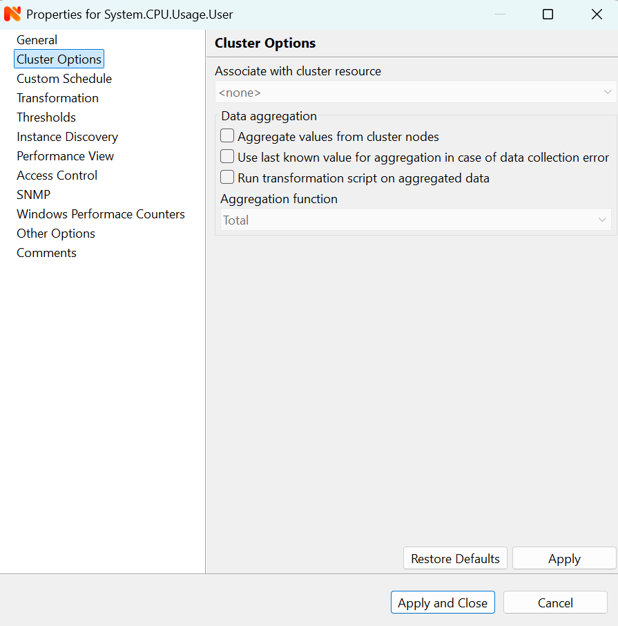

.. _data-collection:

###############
Data collection
###############

.. _how_data_collection:

How data collection works
=========================

Every node can have many data collection items configured (see
:ref:`basic-concepts-dci` for detailed description). |product_name| server has a set of
threads dedicated to data collection, called `Data Collectors`, used to gather
information from the nodes according to :term:`DCI` configuration. You can
control how many data collectors will run simultaneously, by changing server
configuration parameter ``NumberOfDataCollectors``.

All configured DCIs are checked for polling requirement every two seconds and
if DCI needs to be polled, appropriate polling request is placed into internal
data polling queue. First available data collector will pick up the request and
gather information from the node according to DCI configuration. If a new value
was received successfully, it's being stored in the database, and thresholds
are checked. After threshold checking, data collector is ready for processing
new request. Processing of a newly received parameter value is outlined on the
figure below.

.. figure:: _images/dci_param_proc.png

   Newly received parameter processing

It is also possibility to push data to server. If DCI source is set to
:guilabel:`Push`, server just waits for new values instead of polling himself
data source.

.. versionadded:: 2.0-M5
    Agent caching mode

By default DCI data is not collected while connection between server and agent is
broken as poll request could not get till agent. There is special configuration
that allows to collect data and store it on agent till connection with server is
restored and collected data is pushed to the server. This option is available for
metrics, table metrics and proxy SNMP metrics. Not implemented for proxy SNMP table
metrics and DCIs with custom schedule. In case of this configuration agent stores DCI
configuration locally and does all metric collection and dispatch by himself. DCI
configuration is synchronized on connect, DCI configuration change or SNMP proxy
server change. Information about configuration options can be found there:
:ref:`offline-data-collection`.

.. _dci-configuration:

DCI configuration
=================

Data collection for a node can be configured using management console. To open
data collection configuration window, right-click on node object in
:guilabel:`Object Browser` or on a :guilabel:`Network Map`, and click
:guilabel:`Data Collection Configuration`. You will see the list of configured data
collection items. From here, you can add new or change existing parameters to
monitor. Right click on the item will open pop-up menu with all possible
actions.

Each DCI have multiple attributes which affects the way data is collected.
Detailed information about each attribute is given below.

General
-------

    DCI configuration general property page

Description
~~~~~~~~~~~

Description is a free-form text string describing DCI. It is not used by the
server and is intended for better information understanding by operators. If
you use the :guilabel:`Select` button to choose a parameter from the list,
description field will be filled automatically.

Parameter
~~~~~~~~~

Name of the parameter of interest, used for making a request to target node.
For |product_name| agent and internal parameters it will be parameter name, and for
SNMP agent it will be an SNMP OID. You can use the :guilabel:`Select` button
for easier selection of required parameter name.

Available agent parameter names are obtained while :guilabel:`Configuration poll`.

Origin
~~~~~~

Origin of data (method of obtaining data). Possible origins are:

- :guilabel:`|product_name| agent`
- :guilabel:`SNMP agent`
- :guilabel:`CheckPoint SNMP agent`
- :guilabel:`Windows Performance Counter`
- :guilabel:`Internal` (data generated inside |product_name| server process)
- :guilabel:`Push Agent`
- :guilabel:`Script` (from script library, can be used instead of internal dummy)
- :guilabel:`SSH` Data collected by command executed through SSH connection

:guilabel:`Push Agent` origin is very different from all others, because it
represents DCIs whose values are pushed to server by external program (usually
via :ref:`nxapush-label` or :ref:`nxpush-label` command line tool) instead of being
polled by the server based on the schedule.

Data Type
~~~~~~~~~

Data type for the parameter. Can be one of the following: :guilabel:`Integer`,
:guilabel:`Unsigned Integer`, :guilabel:`64-bit Integer`, :guilabel:`64-bit
Unsigned Integer`, :guilabel:`Float` (floating point number), or
:guilabel:`String`. Selected data type affects collected data processing - for
example, you cannot use operations like ``less than`` or ``greater than`` on
strings. If you select parameter from the list using the :guilabel:`Select`
button, correct data type will be set automatically.

Source node
~~~~~~~~~~~

Source node of metrics collection. This can be used when other node provides
information about this node. In this way collected data can be collected and
shown on right nodes.

Other example of usage is virtual nodes (nodes with IP 0.0.0.0). In this case
node state can be obtained from the DCI created on this node but collected
from the other one.

Data is collected from the same node if no value set.

Polling
~~~~~~~

Polling mode and interval describe schedule type and interval between consecutive
polls, in seconds. However, collecting too many values for too long will lead to
significant increase of your database size and possible performance degradation.

Can be selected one of options:

    - :guilabel:`Fixed intervals (default)` - default value will be taken form :guilabel:`DefaultDCIPollingInterval` server configuration parameter.
    - :guilabel:`Fixed intervals (custom)` - value entered on the DCI properties page will be taken.
    - :guilabel:`Use advanced scheduling` - schedules configured in :guilabel:`Advanced Schedule` page will be used

Storage
~~~~~~~

This attribute specifies how long the collected data should be kept in
database, in days. Minimum retention time is 1 day and maximum is not limited.
However, keeping too many collected values for too long will lead to
significant increase of your database size and possible performance
degradation.

Possible options:

    - :guilabel:`Use default retention time` - default value will be taken form :guilabel:`DefaultDCIRetentionTime` server configuration parameter.
    - :guilabel:`Use default retention time` - value entered on the DCI properties page will be taken.
    - :guilabel:`Do not save collected data to database` - will not save collected data to database, but will store last value in memory

Last option is used when it is required to show latest (every 1 second collected) data on Dashboard, but
it is too much data to store in database. So 2 DCI configurations are created.
One to store historical data collected once per minute and the second one, that is not stored in database, but
is collected every second and up to date displayed on dashboards.

Status
~~~~~~

:term:`DCI` status can be one of the following: :guilabel:`Active`,
:guilabel:`Disabled`, :guilabel:`Not Supported`. Server will collect data only
if the status is :guilabel:`Active`. If you wish to stop data collection
without removing :term:`DCI` configuration and collected data, the
:guilabel:`Disabled` status can be set manually. If requested parameter is not
supported by target node, the :guilabel:`Not Supported` status is set by the
server.

Advanced Schedule
-----------------

If you turn on this flag, |product_name| server will use custom schedule for collecting
DCI values instead of fixed intervals. This schedule can be configured on the
:guilabel:`Schedule` page. Advanced schedule consists of one or more records;
each representing desired data collection time in cron-style format.

See :ref:`cron_format` for supported cron format options. 

For DCI Collection schedule it's possible to specify optional sixth cron field
for resolution in seconds. It's not recommended to use seconds in custom
schedules as your main data collection strategy though. Use seconds only
if it is absolutely necessary.

Cluster
-------

This section is available only for DCI's collected on cluster.

    DCI configuration cluster property page

Associate with cluster resource
~~~~~~~~~~~~~~~~~~~~~~~~~~~~~~~

In this field you can specify cluster resource associated with DCI. Data
collection and processing will occur only if node you configured DCI for is
current owner of this resource. This field is valid only for cluster member
nodes.

.. _data-agregation:

Data aggregation
~~~~~~~~~~~~~~~~

This section is responsible for cluster data aggregation way.
:guilabel:`Aggregate values from cluster nodes` option means, that DCI form cluster
will be collected on each node separately and aggregated on cluster using one of the
aggregation options.

Aggregation options:

    - Total
    - Average
    - Min
    - Max

Data Transformations
--------------------

In simplest case, |product_name| server collects values of specified parameters and
stores them in the database. However, you can also specify various
transformations for original value. For example, you may be interested in a
delta value, not in a raw value of some parameter. Or, you may want to have
parameter value converted from bytes to kilobytes. All transformations will
take place after receiving new value and before threshold processing.

Data transformation consists of two steps. On the first step, delta calculation
is performed. You can choose four types of delta calculation:

=================== ===========================================================
Function            Description
=================== ===========================================================
None                No delta calculation performed. This is the default
                    setting for newly created DCI.
Simple              Resulting value will be calculated as a difference
                    between current raw value and previous raw value.
                    By raw value is meant the parameter value
                    originally received from host.
Average per second  Resulting value will be calculated as a difference
                    between current raw value and previous raw value,
                    divided by number of seconds passed between current
                    and previous polls.
Average per minute  Resulting value will be calculated as a difference
                    between current raw value and previous raw value,
                    divided by number of minutes passed between current
                    and previous polls.
=================== ===========================================================

On the second step, custom transformation script is executed (if presented). By
default, newly created DCI does not have a transformation script. If
transformation script is presented, the resulting value of the first step is
passed to the transformation script as a parameter; and a result of script
execution is a final DCI value. Transformation script gets original value as
first argument (available via special variable ``$1``), and also has two
predefined global variables: ``$node`` (reference to current node object), and
``$dci`` (reference to current DCI object). For more information about |product_name|
scripting language, please consult :ref:`scripting` chapter in this manual.

Transformation script can be tested in the same view, by clicking :guilabel:`Test...`
and entering test input data.

.. figure:: _images/dci_transformation_page.png

    DCI configuration transformation property page

Thresholds
----------

For every DCI you can define one or more thresholds. Each threshold there is a
pair of condition and event - if condition becomes true, associated event is
generated. To configure thresholds, open the data collection editor for node or
template. You can add, modify and delete thresholds using buttons below the
threshold list. If you need to change the threshold order, select one threshold
and use arrow buttons located on the right to move the selected threshold up or down.

.. figure:: _images/dci_threshold_page.png

    DCI configuration threshold property page

Threshold Processing
~~~~~~~~~~~~~~~~~~~~

.. figure:: _images/threshold_processing_algorithm.png

   Threshold processing algorithm

As you can see from this flowchart, threshold order is very important. Let's
consider the following example: you have DCI representing CPU utilization on
the node, and you wish two different events to be generated - one when CPU
utilization exceeds 50%, and another one when it exceeds 90%. What happens when
you place threshold ``> 50`` first, and ``> 90`` second? The following table
shows values received from host and actions taken by monitoring system
(assuming that all thresholds initially unarmed):

====== ========================================================================
Value    Action
====== ========================================================================
10     Nothing will happen.
55     When checking first threshold (``> 50``), the system will find
       that it's not active, but condition evaluates to true. So, the system
       will set threshold state to "active" and generate event
       associated with it.
70     When checking first threshold (``> 50``), the system will find
       that it's already active, and condition evaluates to true.
       So, the system will stop threshold checking and
       will not take any actions.
95     When checking first threshold (``> 50``), the system will find
       that it's already active, and condition evaluates to true.
       So, the system will stop threshold checking and will not
       take any actions.
====== ========================================================================

Please note that second threshold actually is not working, because it's
masked by the first threshold. To achieve desired results, you should place
threshold ``> 90`` first, and threshold ``> 50`` second.

You can disable threshold ordering by checking :guilabel:`Always process all
thresholds` checkbox. If it is marked, system will always process all
thresholds.

Threshold Configuration
~~~~~~~~~~~~~~~~~~~~~~~

When adding or modifying a threshold, you will see the following dialog:

.. figure:: _images/threshold_configuration_dialog.png

First, you have to select what value will be checked:

======================== ======================================================
Last polled value        Last value will be used. If number of polls set to
                         more then ``1``, then condition will evaluate to true
                         only if it's true for each individual value of
                         last ``N`` polls.
Average value            An average value for last ``N`` polls will be used
                         (you have to configure a desired number of polls).
Mean deviation           A mean absolute deviation for last ``N`` polls will be
                         used (you have to configure a desired number of
                         polls). Additional information on how mean absolute
                         deviation calculated can be found `here
                         <http://en.wikipedia.org/wiki/Mean_deviation>`_.
Diff with previous value A delta between last and previous values will be
                         used. If DCI data type is string, system will use
                         ``0``, if last and previous values match; and ``1``,
                         if they don't.
Data collection error    An indicator of data collection error. Instead of
                         DCI's value, system will use ``0`` if data collection
                         was successful, and ``1`` if there was a data
                         collection error. You can use this type of
                         thresholds to catch situations when DCI's value
                         cannot be retrieved from agent.
======================== ======================================================

Second, you have to select comparison function. Please note that not all
functions can be used for all data types. Below is a compatibility table:

================ ======= ======== ======= ===== ============== ===== ======
Type/Function    Integer Unsigned Integer Int64 Unsigned Int64 Float String
================ ======= ======== ======= ===== ============== ===== ======
Less             X       X        X       X     X              X
Less or equal    X       X        X       X     X              X
Equal            X       X        X       X     X              X     X
Greater or equal X       X        X       X     X              X
Greater          X       X        X       X     X              X
Not equal        X       X        X       X     X              X     X
Like                                                                 X
Not like                                                             X
================ ======= ======== ======= ===== ============== ===== ======

Third, you have to set a value to check against. If you use ``like`` or ``not
like`` functions, value is a pattern string where you can use meta characters:
asterisk (``*``), which means "any number of any characters", and question mark
(``?``), which means "any character".

Fourth, you have to select events to be generated when the condition becomes
true or returns to false. By default, system uses ``SYS_THRESHOLD_REACHED`` and
``SYS_THRESHOLD_REARMED`` events, but in most cases you will change it to your
custom events.

You can also configure threshold to resend activation event if threshold's
condition remain true for specific period of time. You have three options -
default, which will use server-wide settings, never, which will disable
resending of events, or specify interval in seconds between repeated events.

Thresholds and Events
~~~~~~~~~~~~~~~~~~~~~

You can choose any event to be generated when threshold becomes active or
returns to inactive state. However, you should avoid using predefined system
events (their names usually start with ``SYS_`` or ``SNMP_``). For example, you
set event ``SYS_NODE_CRITICAL`` to be generated when CPU utilization exceeds
80%. System will generate this event, but it will also generate the same event
when node status will change to ::guilabel::`CRITICAL`. In your event
processing configuration, you will be unable to determine actual reason for
that event generation, and probably will get some unexpected results. If you
need custom processing for specific threshold, you should create your own event
first, and use this event in the threshold configuration. |product_name| has some
preconfigured events that are intended to be used with thresholds. Their names
start with ``DC_``.

The system will pass the following seven parameters to all events generated as a
reaction to threshold violation:

#. Parameter name (DCI's name attribute)
#. DCI description
#. Threshold value
#. Actual value
#. Unique DCI identifier
#. Instance (DCI's instance attribute)
#. Repeat flag

And those on table threshold violation:

#. Table DCI name
#. Table DCI description
#. Table DCI ID
#. Table row
#. Instance

For example, if you are creating a custom event that is intended to be
generated when file system is low on free space, and wish to include file
system name, actual free space, and threshold's value into event's message
text, you can use message template like this:

  ``File system %6 has only %4 bytes of free space (threshold: %3 bytes)``

For events generated on threshold's return to inactive state (default event is
``SYS_THRESHOLD_REARMED``), parameter list is different:

#. Parameter name (DCI's name attribute)
#. DCI description
#. Unique DCI identifier
#. Instance (DCI's instance attribute)
#. Threshold value
#. Actual value

And those on table threshold rearm:

#. Table DCI name
#. Table DCI description
#. Table DCI ID
#. Table row
#. Instance

Instance
--------

Each DCI has an :guilabel:`Instance` attribute, which is a free-form text
string, passed as a 6th parameter to events associated with thresholds. You can
use this parameter to distinguish between similar events related to different
instances of the same entity. For example, if you have an event generated when
file system was low on free space, you can set the :guilabel:`Instance`
attribute to file system mount point.

Sometimes you may need to monitor multiple instances of some entity, with exact
names and number of instances not known or different from node to node. Typical
example is file systems or network interfaces. To automate creation of DCIs for
each instance you can use instance discovery mechanism. First you have to
create "master" DCI. Create DCI as usual, but in places where normally you
would put instance name, use the special macro {instance}. Then, go to
:guilabel:`Instance Discovery` tab in DCI properties, and configure instance
discovery method and optionally filter script.

Instance discovery creates 2 macros for substitution:

    - {instance} - instance name
    - {instance-name} - instance user readable description

.. figure:: _images/dci_instance_page.png

    DCI configuration instance discovery property page

Discovery Methods
~~~~~~~~~~~~~~~~~

There are four different methods for instance discovery:

================== ========== =================================================
Method             Input Data Description
================== ========== =================================================
Agent List         List name  Read list from agent and use it's values as
                              instance names.
Agent Table        Table name Read table from agent and use it's instance
                              column values as instance names.
SNMP Walk - Values Base OID   Do SNMP walk starting from given OID and use
                              values of returned varbinds as instance names.
SNMP Walk - OIDs   Base OID   Do SNMP walk starting from given OID and use IDs
                              of returned varbinds as instance names.
================== ========== =================================================

Instance Filter
~~~~~~~~~~~~~~~

You can optionally filter out unneeded instances and transform instance names
using filtering script written in NXSL. Script will be called for each instance
and can return either a binary value or an array.

If binary value is returned, it has the following meaning:
``TRUE`` (to accept instance), ``FALSE`` (to reject instance).

If an array is returned, only first element of the array is obligatory,
the rest elements are optional (but to include an element, all preceding
elements should be included). Array structure:

======================== =======================================================
Data type                Description
======================== =======================================================
Boolean                  ``TRUE`` (accept instance), ``FALSE`` (reject instance).
String                   Instance name, that will be available as {instance} macro.
String                   Instance user-readable description, that will be available
                         as {instance-name} macro
NetObj                   .. versionadded:: 3.0.0
                         Object connected with this :term:`DCI`
======================== =======================================================

Performance tab
---------------

Main information about node(:guilabel:`Object Details`) can be supplemented with DCI
information displayed as text(last value) on :guilabel:`Object Details`->
:guilabel:`Overview` page or in graph way on :guilabel:`Object Details`->:guilabel:`Performance` tab.

DCI representation in text way can be configured on :ref:`dci-othe-options-label`. Next will be described only
graph DCI representation configuration on :guilabel:`Performance` tab of :guilabel:`Object Details`.

Multiple DCIs can be grouped in one graph. To group them use the same group name in "Group" field.

.. figure:: _images/dci_performance_tab_page.png

    DCI configuration instance discovery property page

Access Control
--------------

This page provides access control management option to each DCI. If no user set, then access rights are
inherited from node. So any user that is able to read node is able to see last value of this DCI and user
that is able to modify node is able to change and see DCI configuration.  When list is not empty,
then both access to node and access to DCI are check on DCI configuration or value request.

.. figure:: _images/dci_access_control_page.png

    DCI configuration access control property page

.. _dci-othe-options-label:

Other options
-------------

Other available options:

    - Show last value in object tooltip - shows DCI last value on tooltip that is shown on network maps.
    - Show last value in object overview - shows DCI last value on :guilabel:`Object Details`->:guilabel:`Overview` page.
    - Use this DCI for node status calculation - Uses value returned by this DCI as a status, that
      participate in object status calculation. Such kind of DCI should
      return integer number from 0 till 4 representing object status.

.. figure:: _images/dci_other_opt_page.png

    DCI configuration other option property page

Comments
--------

This configuration part can be used for free for text comments. To make additional notes
about DCI configuration or usage.

.. _dci-push-parameters-label:

Push parameters
===============

|product_name| gives you ability to push DCI values when you need it instead of polling
them on specific time intervals. To be able to push data to the server, you
should take the following steps:

#. Set your DCI's origin to Push Agent and configure other properties as usual,
   excluding polling interval which is meaningless in case of pushed data.
#. Create separate user account or pick an existing one and give "Push Data"
   access right on the DCI owning node to that user.
#. Use :ref:`nxapush-label` or :ref:`nxpush-label` utility or client API for pushing data.

DCI types
=========

List DCIs
---------

Usually DCIs have scalar values. A list DCI is a special DCI which returns a
list of values. List DCIs are mostly used by |product_name| internally (to get the list
of network interfaces during the configuration poll, for example) but can also
be utilized by user in some occasions. |product_name| Management Console does not
support list DCIs directly but their names are used as input parameters for
Instance Discovery methods. List DCI values can be also obtained with
:command:`nxget` command line utility (e.g. for use in scripts).

.. _offline-data-collection:

Agent caching mode
==================

Agent caching mode allows metric data to be obtained while connection between
server and agent have been broken. This option is available for metrics, table
metrics and proxy SNMP metrics. Not implemented for proxy SNMP table metrics and
DCIs with custom schedule. While break data is stored on agent, and on connect it
is send to server. Detailed description can be found there: :ref:`how_data_collection`.

Agent side cache is configurable globally, on node level, and on DCI level. By
default it's off.

All collected data goes thought all transformations and thresholds only when it comes to server.
To prevent generation of old events it can be set :guilabel:`OffileDataRelivanceTime` configuration
variable to time period in seconds within which received offline data still relevant for threshold
validation. By default it is set to 1 day.

.. versionadded:: 2.0-M5
    Agent caching mode.

Configuration
-------------

It can be configured:
  - globally - set configuration parameter :guilabel:`DefaultAgentCacheMode` to  1 (on) or 2 (off).
  - on node level - :guilabel:`Agent cache mode` can be changed to :guilabel:`on`, :guilabel:`off` or :guilabel:`default` (use globas settings) in node properties on :guilabel:`Polling` page
  - on DCI level - :guilabel:`Agent cache mode` can be changed to :guilabel:`on`, :guilabel:`off` or :guilabel:`default` (use node level settings) in DCI properties on :guilabel:`General` page

.. _last-values:

Last DCI values View
====================

Last values view provides information about all collected data
on node the node, it's last value, last collection timestamp and threshold status.

It is possible to check last values or row last values in textual format or as a chart
by right clicking on DCI and selecting right display format.

.. figure:: _images/last_values.png

.. _data-collection-templates:

Templates
=========

What is template
----------------

Often you have a situation when you need to collect same parameters from
different nodes. Such configuration making may easily fall into repeating one
action many times. Things may became even worse when you need to change
something in already configured DCIs on all nodes - for example, increase
threshold for CPU utilization. To avoid these problems, you can use data
collection templates. Data collection template (or just template for short) is
a special object, which can have configured DCIs similar to nodes.

When you create template and configure DCIs for it, nothing happens - no data
collection will occur. Then, you can apply this template to one or multiple
nodes - and as soon as you do this, all DCIs configured in the template object
will appear in the target node objects, and server will start data collection
for these DCIs. If you then change something in the template data collection
settings - add new DCI, change DCI's configuration, or remove DCI - all changes
will be reflected immediately in all nodes associated with the template. You
can also choose to remove template from a node. In this case, you will have two
options to deal with DCIs configured on the node through the template - remove
all such DCIs or leave them, but remove relation to the template. If you delete
template object itself, all DCIs created on nodes from this template will be
deleted as well.

Please note that you can apply an unlimited number of templates to a node - so
you can create individual templates for each group of parameters (for example,
generic performance parameters, MySQL parameters, network counters, etc.) and
combine them, as you need.

Creating template
-----------------

To create a template, right-click on :guilabel:`Template Root` or
:guilabel:`Template Group` object in the :guilabel:`Object Browser`, and click
:menuselection:`Create --> Template`. Enter a name for a new template and click
:guilabel:`OK`.

Configuring templates
---------------------

To configure DCIs in the template, right-click on :guilabel:`Template` object
in the :guilabel:`Object Browser`, and select :guilabel:`Data Collection` from
the pop-up menu. Data collection editor window will open. Now you can configure
DCIs in the same way as the node objects.

Applying template to node
-------------------------

To apply a template to one or more nodes, right-click on template object in
:guilabel:`Object Browser` and select :guilabel:`Apply` from pop-up menu. Node
selection dialog will open. Select the nodes that you wish to apply template
to, and click :guilabel:`OK` (you can select multiple nodes in the list by
holding :kbd:`Control` key). Please note that if data collection editor is open
for any of the target nodes, either by you or another administrator, template
applying will be delayed until data collection editor for that node will be
closed.

Removing template from node
---------------------------

To remove a link between template and node, right-click on :guilabel:`Template`
object in the :guilabel:`Object Browser` and select :guilabel:`Unbind` from
pop-up menu. Node selection dialog will open. Select one or more nodes you wish
to unbind from template, and click :guilabel:`OK`. The system will ask you how
to deal with DCIs configured on node and associated with template:

.. figure:: _images/remove_template.png

If you select Unbind DCIs from template, all DCIs related to template will
remain configured on a node, but association between the DCIs and template will
be removed. Any further changes to the template will not be reflected in these
DCIs. If you later reapply the template to the node, you will have two copies
of each DCI - one standalone (remaining from unbind operation) and one related
to template (from new apply operation). Selecting Remove DCIs from node will
remove all DCIs associated with the template. After you click OK, node will be
unbound from template.

Macros in template items
------------------------

You can use various macros in name, description, and instance fields of
template DCI. These macros will be expanded when template applies to node.
Macro started with ``%{`` character combination and ends with ``}`` character.
The following macros are currently available:

.. tabularcolumns:: |p{0.3 \textwidth}|p{0.6 \textwidth}|

================= =============================================================
Macro             Expands to
================= =============================================================
node_id           Node unique id
node_name         Node name
node_primary_ip   Node primary IP address
script:name       String returned by script name. Script should be stored in
                  script library (accessible via
                  :menuselection:`Configuration --> Script Library`).
                  Inside the script, you can access current node's properties
                  via $node variable.
================= =============================================================

For example, if you wish to insert node's IP address into DCI description, you
can enter the following in the description field of template DCI:

  ``My IP address is %{node_primary_ip}``

When applying to node with primary IP address 10.0.0.1, on the node will be
created DCI with the following description:

  ``My IP address is 10.0.0.1``

Please note that if you change something in the node, name for example, these
changes will not be reflected automatically in DCI texts generated from macros.
However, they will be updated if you reapply template to the node.

Working with collected data
===========================

Once you setup DCI, data starts collecting in the database. You can access this
data and work with it in different ways. Data can be visualized in three ways:
in graphical form, as a historical view(textual format) and as DCI summary table,
this layout types can be combined in Dashboards.
More detailed description about visualization and layout can be found there:
:ref:`visualisation`.
