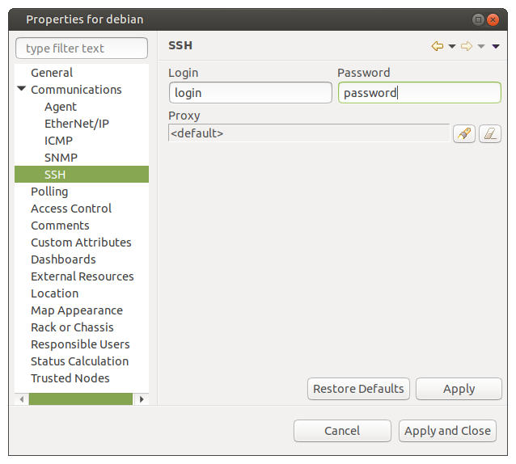
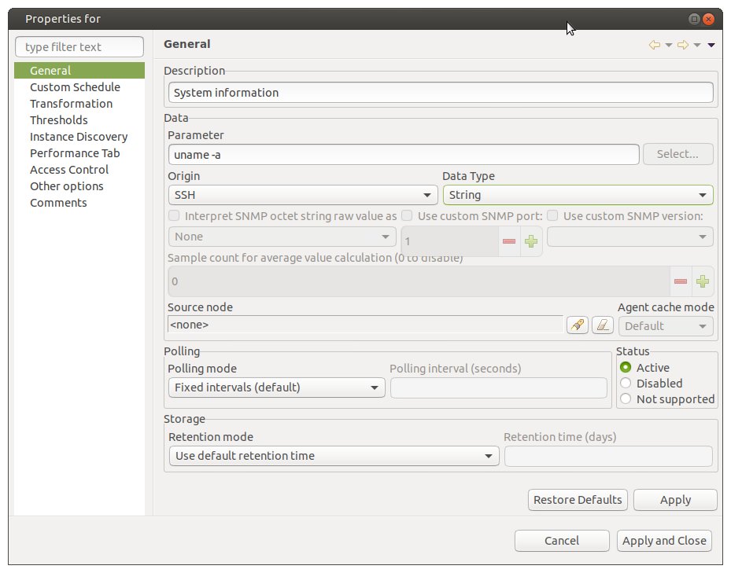
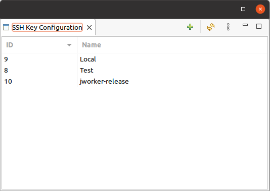

.. _ssh-monitoring:

==============
SSH monitoring
==============

SSH configuration
-----------------

|product_name| can execute commands via an SSH connection and save the output as DCI values.

SSH connections are always established via an agent. For this to work, the ``ssh.nsm`` subagent should be enabled in the agent config file.

The subagent uses the built-in libssh. It reads the configuration in standard ssh format from ~/.ssh/config.
It is also possible to specify a custom location for the configuration file by adding ``ConfigFile=``
to the ``[SSH]`` section of the agent configuration file.

If zoning is not used, the agent running on the |product_name| server is used for SSH connections.
If zoning is used, zone proxies are used. If a zone has no proxies configured, the agent on
the |product_name| server is used as a last resort.

The username and password are specified in :menuselection:`Node properties -> Communications -> SSH`. The same properties 
page can used to specify an ssh port for node, the proxy for ssh polling and an ssh key if required. 
If a proxy node is specified on this property page, the connection will be performed via that node only.

In DCI properties the ``SSH`` origin should be chosen. The parameter is the actual ssh command that is executed.

Only the first line of the output is stored as a DCI value. For numeric data type output is parsed from its beginning until the first non-numeric character.

There is also the ``SSH.Command(*)`` metric of origin ``NetXMS Agent`` that works in a similar way,
but where target and credentials are specified as arguments. It is also necessary to manually specify the Source node,
otherwise the agent of the monitored node will be used for establishing the ssh connection.

.. list-table::
   :widths: 100 50
   :header-rows: 1

   * - Metric Name
     - Description
   * - SSH.Command(\ *target*\ ,\ *login*\ ,\ *password*\ ,\ *command*\ ,\ *[pattern]*\ ,\ *[ssh_key_id]*\)
     - ``%{node_primary_ip}`` macro can be used to specify the nodes primary IP address as *target*.

SSH key configuration
---------------------

An SSH key can be added in :menuselection:`Configuration ->SSH key configuration` and then used in the object configuration 
for the SSH connection.

