.. _event-processing:

################
Event processing
################

Introduction
============

|product_name| is event based monitoring system. Events can come from different sources
(polling processes (status, configuration, discovery, and data collection), :term:`SNMP`
traps, from NXSL scripts and directly from external applications via client library).
All events all are forwarded to |product_name| Event Queue. 

|product_name| Event Processor can process events from Event Queue in 
either sequential or parallel mode. In sequential mode events are processed one-by-one 
which guarantees that events will be processed in the same sequence as they arrive
onto |product_name| server. For installation where a lot of events could be generated
in a short period of time this mode can be a bottleneck. 

Parallel processing mode allows to process events in several parallel threads, thus 
allowing to scale horizontally and to increase processing performance. Number of 
threads for parallel processing is set by :guilabel:`Events.Processor.PoolSize` 
server configuration parameter. 

Event Processing Rules can read/write persistent storage and custom attributes, create/terminate alarms, 
can run scripts that are checking other node statuses and care should be taken to
ensure that no race condition would occur when performing parallel processing.

Correct operation is ensured by properly setting :guilabel:`Events.Processor.QueueSelector` 
server configuration parameter. This parameter contains macros that are expanded when
an event is created. Events that have same QueueSelector string will be processed 
sequentially by one and the same event processing thread, thus ensuring that there will 
be no race condition between these events. 

Event Processing Policy
=======================

Actions taken by event processor for any specific event are determined by a set
of rules called :guilabel:`Event Processing Policy` (EPP).

Every rule has two parts - matching part (called :guilabel:`Condition` in the
rule configuration dialog), which determines if the rule is applicable to an
event, and action part, which defines actions to be taken for
matched events.

Each event passes through all rules in the policy, so if it matches more
than one rule, actions specified in all matched rules will be executed. You can
change this behavior by setting Stop Processing flag on a rule. If this flag
is set for a rule and that rule is matched, subsequent rules (with higher rule 
number) will not be processed.

:guilabel:`Event Processing Policy` rules are managed using :guilabel:`Event 
Processing Policy Editor`. To access the :guilabel:`Event Processing Policy Editor`
window, press ``F4`` or select :menuselection:`Tools --> Event Processing Policy` menu.

Only one user of |product_name| server can access :guilabel:`Event Processing 
Policy Editor` window at a time. Other users will receive ``Component locked`` 
error message when attempting to open this window. 

Changes made in :guilabel:`Event Processing Policy Editor` are applied at the moment
when ``Save`` button is clicked. 

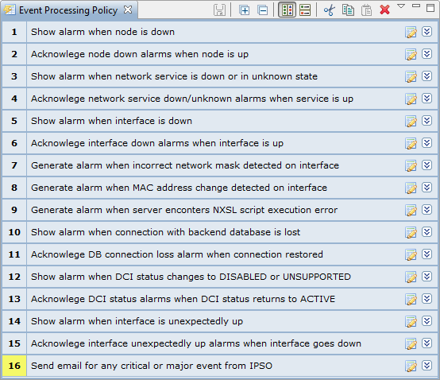

   Event Processing Policy Screen

To expand or collapse a rule, double click on its title or use ``Expand/collapse`` button
on the right hand side of rule title. 

Event Processing Policy Editor window toolbar buttons have the following meaning (from 
left to right): Add new rule, Save changes, Expand all, Collapse all, Horizontal layout, 
Vertical layout, Cut rule, Copy rule, Paste rule, Delete rule.

To create event policy rule, right click on entry before or after which new Event
Processing Policy should appear and select :guilabel:`Insert before` or
:guilabel:`Insert after`. Drag and drop can be used for rule reorganization.

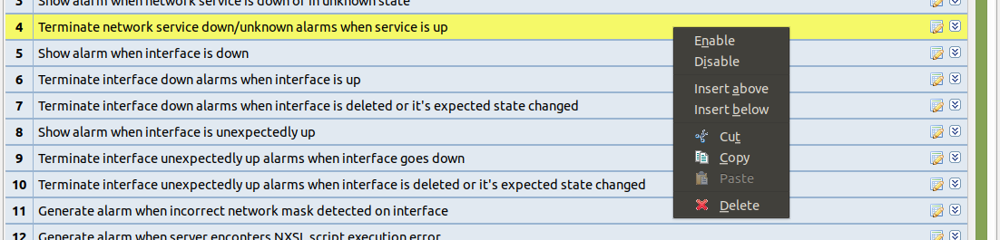

  Event Processing Policy item context menu

To edit Event Processing Policy's properties, click edit button in right
corner of an entry, or double-click text in Filter or Action text. 

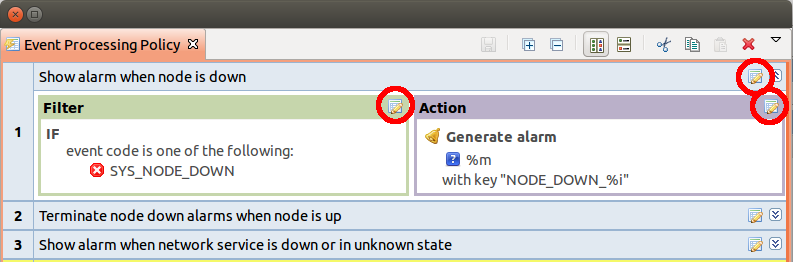

  Edit buttons

Properties of Event Processing Policy rule have the following sections:

.. list-table::
   :widths: 30 70
   :header-rows: 1

   * - Section
     - Description
   * - **Condition**
     - Sub-sections of **Condition** section determine, if the rule is applicable to a particular event.
       If checkbox :guilabel:`Rule is disabled` is set, this rule is ignored.
   * - Condition --> Source Objects
     - One or more event's source objects. This list can be left empty, which
       matches any object, or contain nodes, subnets, containers, clusters, etc...
       If you specify subnet, container, cluster, rack or chassis, any object 
       within it will also be matched.
   * - Condition --> Events
     - Event code. This field can be left empty, which matches any event, or
       contain list of applicable events. 
   * - Condition --> Severity Filter
     - Event's severity. This field contains selection of event severities to
       be matched.
   * - Condition --> Filtering Script
     - Optional matching script written in NXSL. If this field is empty 
       (or only contains comments according to NXSL language specification), no
       additional checks are performed. Otherwise, the event will be considered as
       matched only if the script returns boolean ``true`` (or other value that is 
       considered true in NXSL language, e.g. non-zero number or array). For
       more information about |product_name| scripting language please refer to the
       chapter :ref:`scripting` in this manual.
   * - **Action**
     - Sub-sections of **Action** section determine what actions are performed if an 
       event meets all conditions of a rule. If checkbox :guilabel:`Stop event processing` 
       is set, then subsequent rules (with higher rule number) will not be processed for a 
       given event. However, actions of given rule will be performed. 
   * - Action --> Alarm
     - Action in regard to alarms. Alarm can be created, resolved or terminated or no action 
       to alarms is done. See :ref:`generating_and_terminating_alarms` for more information. 
   * - Action --> Persistent Storage
     - :ref:`nxsl_persistent_storage` action like add/update or delete can be performed.
   * - Action --> Server Actions
     - List of predefined actions to be executed. Action execution could be delayed with 
       ability to cancel a delayed action later on. Execution of action could be snoozed 
       for a specified period of time. For action configuration refer to :ref:`actions` chapter.
       Delayed execution and snoozing is controlled using timers which can be referred 
       to using timer key. This allows cancelling a timer or checking, if its still running
       from NXSL script. 
   * - Action --> Timer Cancellations
     - List of timers to cancel identified by timer keys. This allows to cancel delayed 
       actions and snooze/blocking timers.
   * - Comments
     - Rule comment which can be multi-line text. The comment is displayed as a name of the rule.

**After all manipulations are done - save changes by pressing save icon.**

Examples
--------

This rule defines that for every major or critical event originated from a
node named "IPSO" two e-mail actions will be executed.

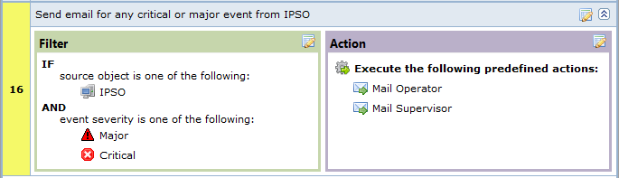

   Example 1

.. _events:

Events
======

.. _alarms:

Alarms
======

Alarms Overview
---------------

As a result of event processing some events can be shown up as alarms. Usually
alarm represents something that needs attention of network administrators or
network control center operators, for example low free disk space on a server.

All alarm events are logged to alarm log. The number of days the server keeps
alarm history can be configured by "AlarmHistoryRetentionTime" server
configuration parameter. Alarm log can be viewed in "Alarm Log View"(Alt+F8).
This view gives option to query for required information from alarm log. 

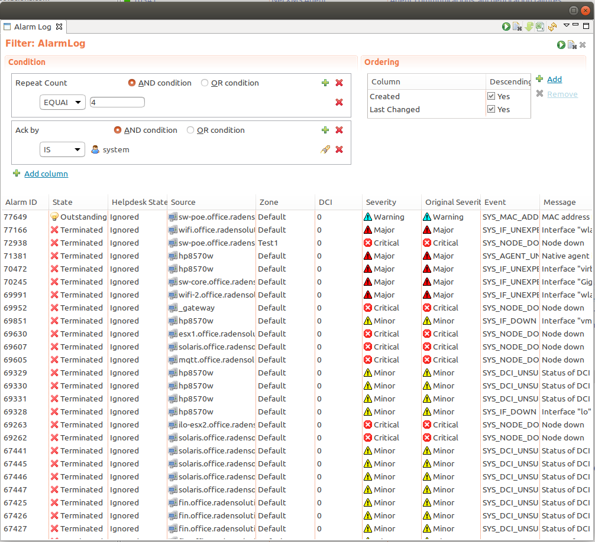

Every alarm has the following attributes:

.. list-table::
   :widths: 25 75
   :header-rows: 1

   * - Attribute
     - Description
   * - Creation time
     - Time when alarm was created.
   * - Last change time
     - Time when alarm was last changed (for example, acknowledged).
   * - State
     - Current state of the alarm, see table bellow
   * - Message
     - Message text (usually derived from originating event's message text).
   * - Severity
     - Alarm's severity - :guilabel:`Normal`, :guilabel:`Warning`,
       :guilabel:`Minor`, :guilabel:`Major`, or :guilabel:`Critical`.
   * - Source
     - Source node (derived from originating event).
   * - Key
     - Text string used to identify duplicate alarms and for automatic alarm
       termination.

Possible alarm states:

.. list-table::
   :widths: 25 75

   * - Outstanding
     - New alarm.
   * - Acknowledged
     - When network administrator sees an alarm, he may acknowledge it to
       indicate that somebody already aware of that problem and working on it.
       A new event with the same alarm ID will reset the alarm state back to
       outstanding
   * - Sticky Acknowledged for time
     - Alarm will remain acknowledged for given time interval even after new
       matching events, after time will pass alarm will be moved to outstanding
       state. This option can be used like snooze. When you know that there will
       be new matching events, but it will not change the situation. But after
       some time someone should check this problem. For example, if you have
       problem that cannot be solved until next week, so this alarm can be
       sticky acknowledged for 7 days. After 7 days this problem again will be
       in outstanding state. This type of acknowledge can be disabled by changing
       :guilabel:`EnableTimedAlarmAck` server configuration parameter.
   * - Sticky Acknowledged
     - Alarm will remain acknowledged event after new matching events. This can
       be useful when you know that there will be new matching events, but it
       will not change the situation. For example, if you have network device
       which will send new SNMP trap every minute until problem solved, sticky
       acknowledge will help to eliminate unnecessary outstanding alarms.
   * - Resolved
     - Network administrator sets this state when the problem is solved.
   * - Terminated
     - Inactive alarm. When problem is solved, network administrator can
       terminate alarm. This will remove alarm from active alarms list and it
       will not be seen in console, but alarm record will remain in database.

There are 2 types of alarm state flows: strict and not strict. This option can
be configured in Preference page of Alarms or on server configuration page,
parameter "StrictAlarmStatusFlow". The difference between them is that in strict
mode Terminate can be done only after Resolve state.

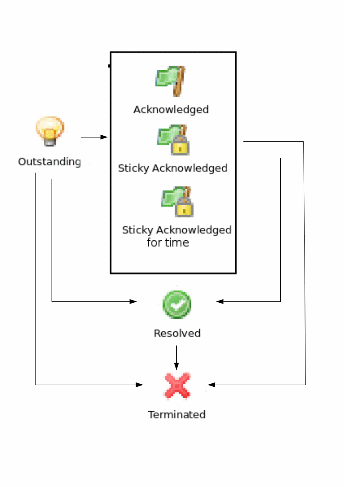

   Not strict(default)

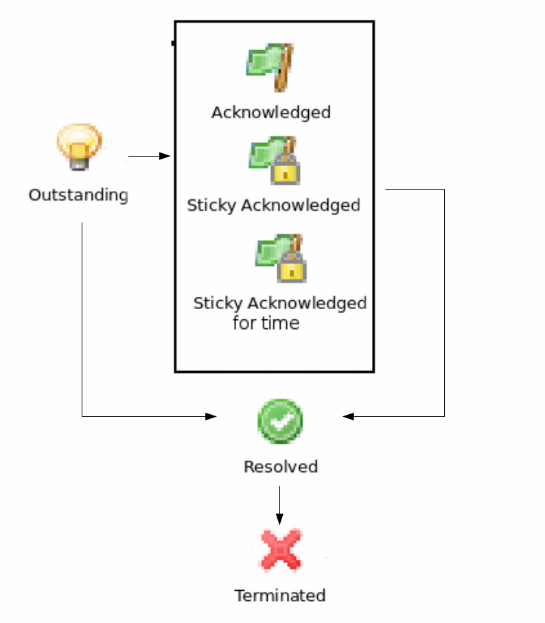

   Strict

Alarm Melodies
--------------

On each severity of alarm can be set melody to play. This melody will be played
when new alarm in state outstanding will occur. Melody that should be played should
exist on server in wav format. See instruction there: :ref:`upload-file-on-server-label`.
By default there are no sounds on alarms.

To set sound open preferences, there select :menuselection:`Alarms --> Alarm Sounds` tab.
There in drop-down will be seen all possible options. If sound will not be chosen,
alarm with this severity will come silently.

To configure sounds, open preferences and select :menuselection:`Alarms --> Alarm Sounds` tab.
Drop-downs next to each severity level have a list of available sounds. If no sound
is chosen, alarm for given severity will come silently.

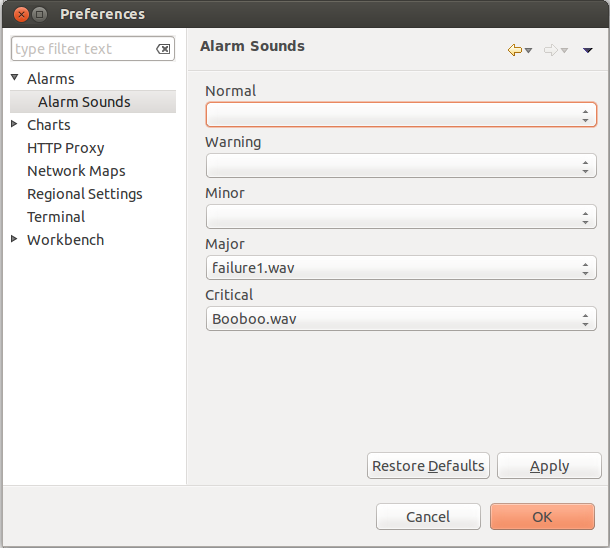

Alarm Browser
-------------

When an alarm is generated it will appear in the Alarm Browser where information about currently active
alarms can be viewed.

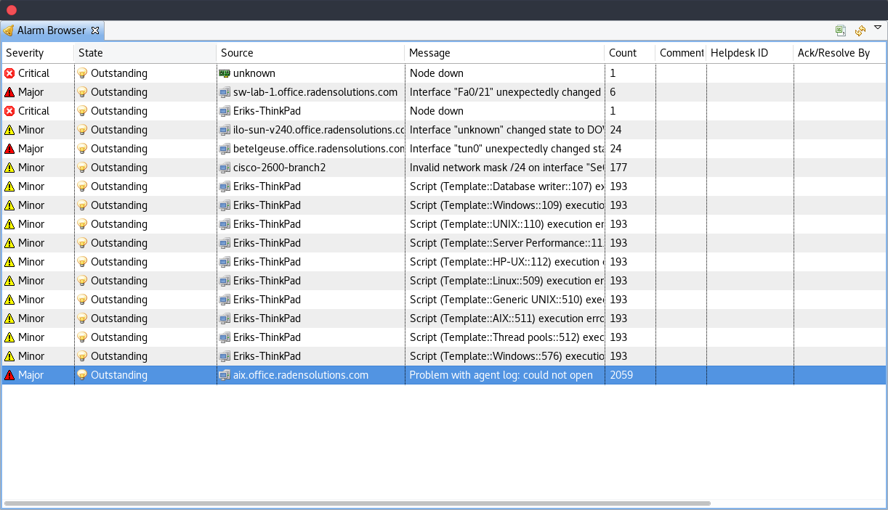

Alarm Comments
~~~~~~~~~~~~~~

For each alarm can be created comments in "Alarm Details"

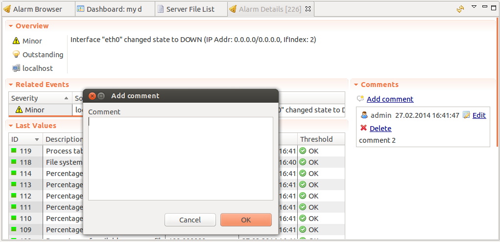

or "Alarm Comments" views.

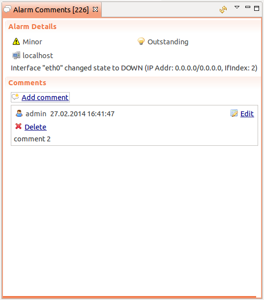

Comment can be created, edited or deleted. All comments will be deleted after alarm termination.

Alarm Summary Emails
~~~~~~~~~~~~~~~~~~~~

It is possible to schedule emails which contain a summary of all currently active alarms, similar
to what can be seen in the Alarm Browser.

To enable Alarm Summary Emails it is required to configure the following server parameters:

.. list-table::
   :widths: 25
   :header-rows: 1

   * - Name
   * - SMTPFromAddr
   * - SMTPFromName
   * - SMTPPort
   * - SMTPRetryCount
   * - SMTPServer
   * - EnableAlarmSummaryEmails
   * - AlarmSummaryEmailSchedule
   * - AlarmSummaryEmailRecipients

Further information on server configuration parameters can be found in :ref:`server_configuration_parameters`.

.. _generating_and_terminating_alarms:

Generating and Terminating Alarms from EPP
------------------------------------------

To generate alarms from events, you should edit :guilabel:`Alarm` field in
appropriate rule of :guilabel:`Event Processing Policy`. Alarm configuration
dialog will look like this:

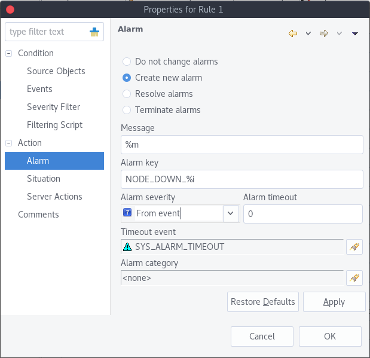

You should select :guilabel:`Generate new alarm` radio button to enable alarm generation from current rule.
In the :guilabel:`Message` field enter alarm's text, and in the alarm key enter value which will be used for
repeated alarms detection and automatic alarm termination. In both fields you can use macros described
in the :ref:`event-processing-macros` section.

You can also configure sending of additional event if alarm will stay in
:guilabel:`Outstanding` state for given period of time. To enable this, enter
desired number of seconds in :guilabel:`Seconds` field, and select event to be
sent. Entering value of ``0`` for seconds will disable additional event
sending.

Alarms generated by rules can by categorised to limit what alarms can be seen by what users.
This can be done by applying a category in the :guilabel:`Alarm Category` field, which can be
created and configured in the :ref:`alarm-category-config`.

.. _alarm-category-config:

Alarm Category Configurator
---------------------------

Alarm categories can be created and configured in the :guilabel:`Alarm Category Configurator` which can
be found in :menuselection:`Configuration --> Alarm Category Configurator` menu:

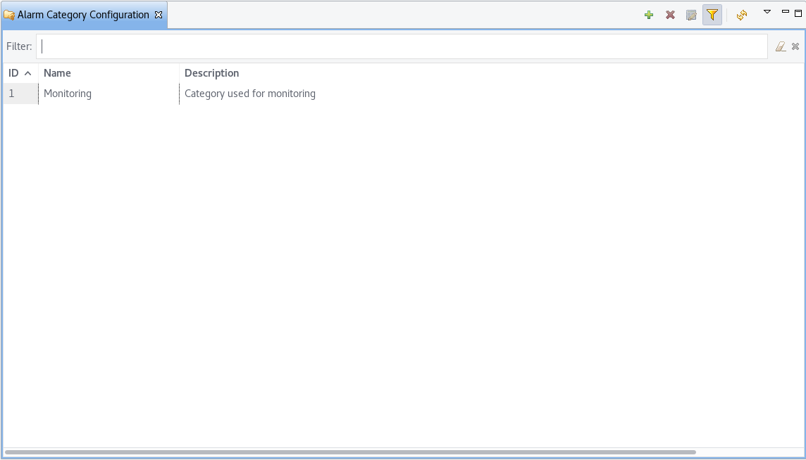

   Alarm Category Configurator

Alarm categories provide the possibility to configure access rights for viewing generated alarms on a per user
or per group basis. When creating an alarm category, it is possible to set the :guilabel:`Category name`,
:guilabel:`Description`.

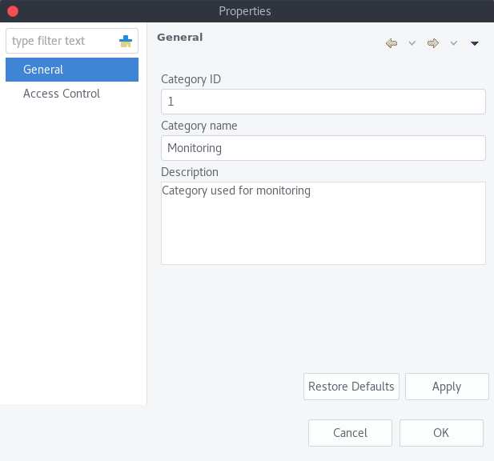

	Alarm Category properties

Alarm category access rights can be configured by adding users or groups to the access list of the category in
the :guilabel:`Access Control` property page.

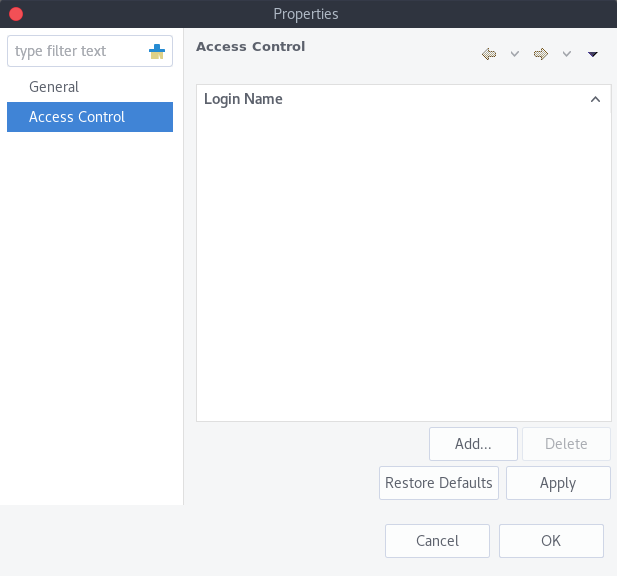

	Alarm Category Access Control

By default, all alarms can be viewed by all users due to the :guilabel:`View all alarms` system right
being set as default to the :guilabel:`Everyone` user group. In order to limit the viewing of alarms, this system
right should be removed and the access rights configured in the categories themselves. When the categories have
been configured, they can be applied to the necessary :guilabel:`Event Processing Policy` rules.

If an alarm category has been applied to an :guilabel:`Event Processing Policy` rule, it will appear in the
:guilabel:`Event Processing Policy Editor` when a rule is expanded under the :guilabel:`Action` section.

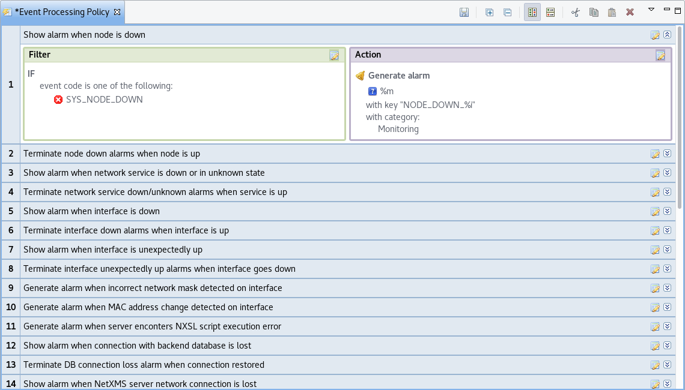

	Event Processing Policy expanded

Automatic Alarm Termination/Resolve
-----------------------------------

You can terminate or resolve all active alarms with given key as a reaction for the event.
To do this, select :guilabel:`Terminate alarm` radio button or :guilabel:`Resolve alarm`
radio button in alarm configuration dialog and enter value for alarm key. For that field
you can use macros described in the :ref:`event-processing-macros` chapter.

Escalation
----------

As it was described in :ref:`generating_and_terminating_alarms` chapter there is possibility to generate new
event if alarm stay in :guilabel:`Outstanding` state for too long. Escalation is built on
this option. When alarm was generated, but no action was done from operator in predefined time,
new event can be generated and this time email or notification (SMS, instant message)
can be sent to operator or to it's manager. This escalation process can have as many steps
as it is required.

.. _actions:

Actions
=======

In addition to alarm generation server can perform various types of actions as a reaction to an event.
Action types available in |product_name| are described in the following sections. Each action can be separately
disabled in action configuration.

After the action is added, it can be edited to add delay time and timer key. This option can be used to
prevent notification sending in case if problem solved quickly enough. Key is a free form string that support
:ref:`macro<event-processing-macros>` and delay is the delay time in seconds before action is executed.

The next example shows the configuration for the situation when there is no need to notify anyone if node went down
and back up in just a minute.

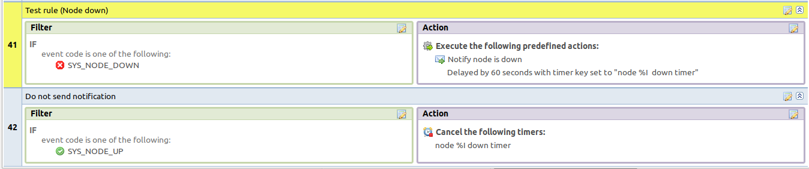

Escalation
----------

One :term:`EPP` rule can contain multiple actions with different delays. Delay timers are
canceled by other rule in case of problem resolution.

The next example shows that if node went down, then
   #. after 1 minute responsible person will be notified if the problem still persists
   #. after 30 minutes the support manager will be notified if the problem still persists
   #. after 1 hour the IT manager will be notified if the problem still persists

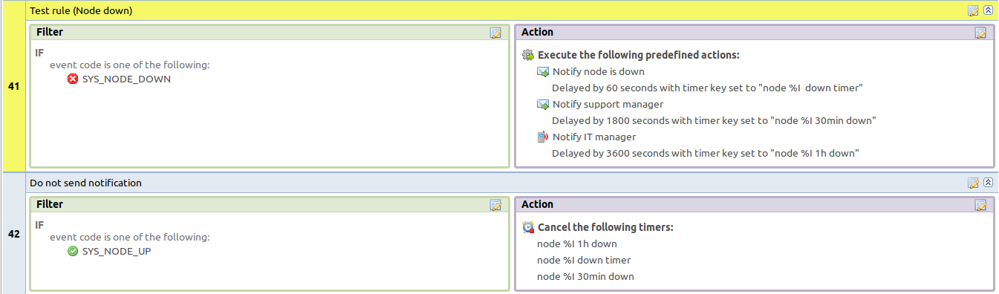

Action types
------------

Execute command on management server
~~~~~~~~~~~~~~~~~~~~~~~~~~~~~~~~~~~~

Executes provided command on server node. Check that user under which :file:`netxmsd` process
run has permission to run this command.

.. _action-remote-execute:

Execute command on remote node
~~~~~~~~~~~~~~~~~~~~~~~~~~~~~~

Executes provided command name defined in this nodes agent configuration file. To this
command can be given parameters in format: ``commandName param1 param2 param3...``
Check that user under which :file:`nxagentd` process run has permission to run this
command.

As the :guilabel:`Remote Host` can be used hostname or object name(int format: ``@objectName``).
Second option allows action execution on node behind proxy.

Send e-mail
~~~~~~~~~~~

Send email to one or more recipients. Multiple recipients can be separated by semicolons.
Required server configuration parameters to send emails: ``SMTPFromAddr``, ``SMTPFromName``,
``SMTPRetryCount``, ``SMTPServer``. For detailed description of parameters check :ref:`server_configuration_parameters`.

In message text can be used :ref:`event-processing-macros`.

Send notification
~~~~~~~~~~~~~~~~~

Send notification, e.g. SMS, to one or more recipients. Multiple recipients can be separated by semicolons.
Server will use :ref:`notification-channels` for actual message sending.

In message text can be used :ref:`event-processing-macros`.

Execute NXSL script
~~~~~~~~~~~~~~~~~~~

This action executes script form scrip library. In action configuration should be defined name of script.
Information about scripting and library can be found :ref:`there<scripting>`.

.. _forward_events:

Forward event
~~~~~~~~~~~~~

|product_name| does not support configuration synchronization between two |product_name| servers(Distributed Monitoring). But it is possible
to forward events from one server to another. This option allow synchronize events between servers but there are some limitation.

Configuration
^^^^^^^^^^^^^

Source server configuration:
  1. Create new action of type "forward event" - it will have destination server address property.
  2. Create a rule in event processing policy with filter for events you want to forward and add forwarding action as action.

Destination server configuration:
  1. Enable EnableISCListener and ReceiveForwardedEvents in server configuration.
  2. Open port 4702.
  3. Check that receiving server have all events as on a sending server

Limitation
^^^^^^^^^^

Limitations of event forwarding:
  1. Event template with same event code or event name must exist on recipient server
  2. Node object with same IP address as event's source node's address must exist on recipient server
  3. Does not work with zones

Events not met these conditions are discarded.
It is possible to check if and why incoming events are discarded by turning on level 5 debug on receiving server.

There can be used one of two options if it is required to disable polling of sender server nodes on recipient server: disable all
polling protocols or unmanage nodes. Chose  depends on how you wish to see node's status. For unmanaged node, it always be
"unmanaged", regardless of active alarms. If you disable polling, node's status will be "unknown" unless there will be active
alarms for that node - in that case node's status will change to severity of most critical alarm.

.. _notification-channels:

Notification channels
---------------------

.. versionadded:: 3.0.0

|product_name| supports concept of notification channel drivers to provide SMS
and instant message sending functionality. Role of notification channel driver
is to provide level of abstraction on top of different notification sending
mechanisms and uniform notification sending interface for server core.
It is possible to set up and use several notification channels.

Configuration of notification channels is done in :menuselection:`Configuration --> Notification channels`.

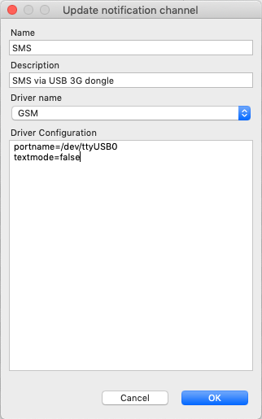

Notification channel driver parameters are specified in :guilabel:`Driver configuration`
input field. Each parameter is given on a separate line in format: :guilabel:`parameter_name=parameter_value`.
Meaning of parameters is driver dependent and described separately for each driver. It a parameter
is not given, it's default value will be used.

Once notification channel is created is is seen in channel list with green or read square next to the name -
it is channel status identifier. It should be green if driver initialization was successful or read in other cases.
:guilabel:`Status` column displays last sent attempt status and :guilabel:`Error message` column provide more information
about driver initialization or sending error.

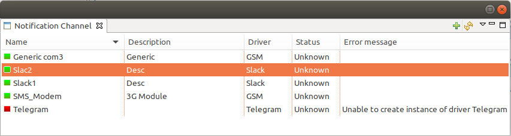

Drivers
~~~~~~~

The following drivers are provided by default with |product_name| installation:

.. list-table::
   :class: longtable
   :widths: 25 75
   :header-rows: 1

   * - Driver
     - Description
   * - AnySMS
     - SMS driver for any-sms.biz service (`<http://any-sms.biz>`_). Configuration parameters:

       * login (default: user)
       * password (default: password)
       * sender (default: NETXMS)
       * gateway (default: 28)

   * - DBTable
     - This driver saves notifications to a database. Configuration parameters:

       * DBDriver (default: sqlite.ddr)
       * DBName (default: netxms)
       * DBLogin (default: netxms)
       * DBPassword
       * DBServer (default: localhost)
       * DBSchema
       * MaxMessageLength (default: 255)
       * MaxNumberLength (default: 32)
       * QueryTemplate

   * - Dummy
     - Dummy driver for debugging purposes. Does not send any actual notifications
       and only logs them to server log file. This driver has no configuration
       parameters. It is necessary to set debug level to :guilabel:`debug=6` or
       higher to get records in the log file.

   * - Google chat
     - Driver to send notifications to Google charts. You need to create 
       `incoming web hook first <https://developers.google.com/chat/how-tos/webhooks>`_. 
       Each web hook have it’s own URL, you can either put it as recipient, or setup 
       mapping in notification channel configuration.
       
       Mapping is done in the section "Rooms". 
      
       Example:

       .. code-block:: cfg

            [Rooms]
            RoomName=URL
            AnotherRoomName=URL

   * - GSM
     - Driver for serial or USB attached GSM modems with support for standard GSM AT command set. Configuration parameters:

       * BlockSize (default: 8)
       * DataBits (default: 8)
       * Parity (default: n)
       * Port (default: COM1: on Windows platforms, /dev/ttyS0 on other platforms)
       * Speed (default: 9600)
       * StopBits (default: 1)
       * TextMode (1 - text mode, 0 - PDU mode, default: 1)
       * UseQuotes (1 - use quotes, 0 - do not use quotes, default: 1)
       * WriteDelay (default: 100)

   * - Kannel
     - Driver for Kannel SMS gateway (`<http://www.kannel.org>`_). Configuration parameters:

       * login (default: user)
       * password (default: password)
       * host (default: 127.0.0.1)
       * port (default: 13001)

   * - MicfosoftTeams
     - Notification channel driver for Microsoft Teams. Configuration parameters:

       * ThemeColor - team color in RGB, default: FF6A00 (optional parameter)
       * UseMessageCards - flag if message cards should be used, default: no (optional parameter)

       Optional configuration section "Channels" should contain list of channels in the following format: channelName=URL, where channelName is an arbitrary name later used as recipient in action configuration.
       More information about setting up the URL of incoming webhook available `there <https://docs.microsoft.com/en-us/microsoftteams/platform/webhooks-and-connectors/how-to/connectors-using#setting-up-a-custom-incoming-webhook>`_

       .. code-block:: cfg

            #config example
            ThemeColor=FF6A00
            UseMessageCards = false

            [Channels]
            Channel=URL
            AnotherChannel=URL

       MsTeams requires 2 fields in action configuration:

       * Recipient name - channel name defined in :guilabel:`Channels` section or incoming webhook URL
       * Message - message to be sent

   * - MyMobile
     - SMS driver for MyMobile API gateways. Configuration parameters:

       * username
       * password

   * - Nexmo
     - SMS driver for Nexmo gateway. Configuration parameters:

       * apiKey (default: key)
       * apiSecret (default: secret)
       * from (default: NetXMS)

   * - NXAgent
     - Similar to gsm.ncd, but sending is done via GSM modem, attached to |product_name| agent. Configuration parameters:

       * hostname (default localhost)
       * port (default: 4700)
       * timeout (seconds, default: 30)
       * secret
       * encryption - optional parameter. Encryption policy:

            0 = Encryption disabled;

            1 = Encrypt connection only if agent requires encryption;

            2 = Encrypt connection if agent supports encryption;

            3 = Force encrypted connection;

       * keyFile - optional parameter. Specify server's key file, if not specified will take default path.

   * - Portech
     - Driver for Portech MV-372 and MV-374 GSM gateways (`<https://www.portech.com.tw/p3-product1_1.asp?Pid=14>`_). Configuration parameters:

       * host (default: 10.0.0.1)
       * secondaryHost
       * login (default: admin)
       * password (default: admin)
       * mode (PDU or TEXT, default: PDU)

   * - Slack
     - Driver for slack.com service. Configuration parameters:

       * url
       * username

   * - SMSEagle
     - Driver for SMSEagle Hardware SMS Gateway. Configuration parameters:

       * host (default: 127.0.0.1)
       * port (defalut: 80)
       * login (default: user)
       * password (default: password)
       * https (1 - use https, 0 - do not use https)

   * - SMTP
     - Driver to send notifications using SMTP protocol. 

       * Server (default: localhost)
       * RetryCount (default: 1)
       * Port (default: 25)
       * LocalHostName
       * FromName (default: NetXMS Server)
       * FromAddr (default: netxms@localhost)
       * MailEncoding (default: utf8)
       * IsHTML (0 - do not use HTML, 1 - use HTML; default: 0)
       * TLSMode (NONE - No TLS, TLS - Enforced TLS, STARTTLS - Opportunistic TLS; default: NONE)
       * EnableSSLTrace (true - enable additional SSL Trace logging to server log; default: false)

   * - SNMPTrap
     - Driver to send notifications as SNMP traps. Driver configuration parameters:

       * Community (default: public)
       * Port (default: 162)
       * ProtocolVersion (possible values: 1, 2c, 3; default: 2c)

       Driver configuration parameters applicable to SNMP v3 only:

       * AuthMethod (possible values: none, sha1, sha224, sha256, sha384, sha512; default: none)
       * AuthPassword
       * PrivMethod (possible values: none, aes, des; default: none)
       * PrivPassword
       * UseInformRequest (default: false) 
       * UserName (default: netxms)

       Raden Solutions has IANA assigned Private Enterprise Number (57163).
       MIB files defining the OIDs (RADENSOLUTIONS-SMI.txt and NETXMS-MIB.txt)
       are included with |product_name| server. It's also possible to use custom 
       OIDs by setting the following driver configuration parameters:

       * AdditionalDataFieldID (default: .1.3.6.1.4.1.57163.1.1.6.0)
       * AlarmKeyFieldID (default: .1.3.6.1.4.1.57163.1.1.5.0)
       * MessageFieldID (default: .1.3.6.1.4.1.57163.1.1.3.0)
       * SeverityFieldID (default: .1.3.6.1.4.1.57163.1.1.2.0)
       * SourceFieldID (default: .1.3.6.1.4.1.57163.1.1.1.0)
       * TimestampFieldID (default: .1.3.6.1.4.1.57163.1.1.4.0)
       * TrapID (default: .1.3.6.1.4.1.57163.1.0.1)

       Recipient's address should contain host name or IP address the trap is sent to. 
       Message and subject are sent as separate fields (MessageFieldID and 
       AdditionalDataFieldID) in the trap message. 
       In addition to that, if subject contains semicolon-separated key=value 
       pairs or JSON and the key is from below list, additional fields 
       with these values will be added to trap message. List of supported keys:
      
        * key         - alarm key
        * source      - source object name
        * severity    - event severity (integer in range 0..4)
        * timestamp   - original even timestamp as UNIX time

       E.g. subject could be ``key=%K;source=%n;severity=%s;timestamp=%T``. 
       Subject field could be generated using NXSL script that is called using 
       ``%[script_name]`` macro. This is convenient for generating JSON. 
       
       JSON data can have more fields in addition to the above mentioned, this
       allows to send more information in the trap. 

   * - Telegram
     - Notification channel driver for Telegram messenger. Configuration parameters:

       * AuthToken
       * DisableIPv4 - ``true`` to disable IPv4 usage
       * DisableIPv6 - ``true`` to disable IPv6 usage
       * ParseMode - Text formatting style: ``Markdown``, ``HTML`` or ``MarkdownV2``. See Telegram API documentation on formatting syntax: https://core.telegram.org/bots/api#formatting-options
       * Proxy - proxy url or ip or full configuration if format [scheme]://[login:password]@IP:[PORT]
       * ProxyPort - proxy port
       * ProxyType - proxy type: ``http``, ``https``, ``socks4``, ``socks4a``, ``socks5`` or ``socks5h``
       * ProxyUser - proxy user name
       * ProxyPassword - proxy user password

       Only AuthToken field is mandatory field all others are optional.

       It is necessary to create a telegram bot that |product_name| server will use to send messages.
       In order to create a new bot it's necessary to talk to BotFather and get bot authentication token (AUTH_TOKEN).
       Set authentication token in notification channel configuration, e.g.: ``AuthToken=1234567890:jdiAiwdisUsWjvKpDenAlDjuqpx``

       The bot can:

       * Have a private chat with another Telegram user
       * Participate a group
       * Be channel admin

       Telegram's bot can't initiate conversations with users in a private chat or a group.
       A user must either add bot to a group or send a private message to the bot first.

       Chat, group or channel is identified by ID or name (without @ prefix).
       For private chats only users who configured a Username can be identified
       by name (without @ prefix). |product_name| stores the correspondence
       between ID and name when the bot receives a message in chat or group
       (|product_name| server should be running a that moment). If group,
       channel name or username is changed, it's necessary to send any message
       to the bot so new correspondence could be stored.

       Telegram notification channel requires 2 fields in action configuration:

       * Recipient name - It could be name (of a group, channel or username, without @ prefix) or ID of group, channel or chat.
       * Message - text that should be sent

       If you want to use ID to identify a recipient, you can get it by opening Telegram
       API URL in your browser, e.g. https://api.telegram.org/bot1234567890:jdiAiwdisUsWjvKpDenAlDjuqpx/getUpdates
       After sending a message to the bot or adding it to a group you should see chat id there.
       You might need to temporary deconfigure Telegram notification channel, otherwise
       if |product_name| server is running, it will read data from Telegram API first.

   * - Text2Reach
     - Driver for Text2Reach.com service (`<http://www.text2reach.com>`_). Configuration parameters:

       * apikey (default: apikey)
       * from (default: from)
       * unicode (1 or 0, default: 1)
       * blacklist (1 or 0, default: 0)

   * - TextFile
     - Notification driver that writes messages to text file. Configuration parameter:

       * filePath (default: /tmp/test.txt)

   * - Twilio
     - Driver for Twilio.com service (`<http://www.twilio.com>`_). Configuration parameters:

       * CallerId - caller ID
       * SID - account SID (for authentication)
       * Token - account security token (for authentication)
       * Voice - voice to be used for Text To Speech (man, woman, alice, or any of the
         Amazon Polly voices. See here for more information
         https://www.twilio.com/docs/voice/twiml/say#voice)
       * UseTTS - true/false, enable or disable Text To Speech (default is false)

   * - WebSMS
     - Driver for websms.ru service (`<https://websms.ru>`_). Configuration parameters:

       * login (default: user)
       * password (default: password)
       * m_fromPhone

   * - XMPP
     - Driver for XMPP/Jabber messages. Configuration parameters:

       * Server (default: localhost)
       * Port (default: user)
       * Login - may or may not contain XMPP domainpart. If no domainpart is specified server name will be added to login. (default: netxms@localhost)  
       * m_fromPhone (default: 5222)

.. _nxsl_persistent_storage:

NXLS Persistent Storage
=======================

NXSL
----

There are 2 functions:
    - ReadPersistentStorage("key") - read value by key
    - WritePersistentStorage("key", "value") - insert or update value by key. If value will be empty - variable will be deleted.

View
----

:guilabel:`Persistent Storage` view (:menuselection:`Configuration --> Persistent Storage`) provide information about current state of
Persistent Storage variables.

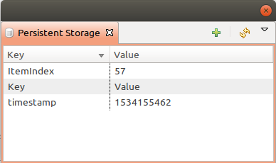

.. _event-processing-macros:

Macros for Event Processing
===========================

On various stages of event processing you may need to use macros to include
information like event source, severity, or parameter in your event texts,
alarms, or actions. You may use the following macros to accomplish this:

.. list-table::
   :header-rows: 1
   :class: longtable

   * - Macro
     - Description
   * - ``%a``
     - IP address of event source object.
   * - ``%A``
     - Alarm's text. This macro is populated when creating, resolving or terminating alarm in EPP rule. 
       Macro is available in that EPP rule for persistent storage and server action and in subsequent EPP rules.
       Prior to version 3.8.314 this macro was available only withing given EPP rule. 
   * - ``%c``
     - Event's code.
   * - ``%E``
     - List of comma-separated user tags associated with the event.     
   * - ``%g``
     - Globally unique identifier (GUID) of event source object.
   * - ``%i``
     - Unique ID of event source object in hexadecimal form. Always prefixed
       with 0x and contains exactly 8 digits (for example 0x000029AC).
   * - ``%I``
     - Unique ID of event source object in decimal form.
   * - ``%K``
     - Alarm's key (can be used only in actions to put text of alarm from the
       same event processing policy rule).
   * - ``%m``
     - Event's message text (meaningless in event template).
   * - ``%M``
     - Custom message text. Can be set in filtering script by setting ``CUSTOM_MESSAGE`` variable.
   * - ``%n``
     - Name of event source object or name of interface for intefrace macro expansion.
   * - ``%N``
     - Event's name.
   * - ``%s``
     - Event's severity code as number. Possible values are:
         - 0 - :guilabel:`Normal`
         - 1 - :guilabel:`Warning`
         - 2 - :guilabel:`Minor`
         - 3 - :guilabel:`Major`
         - 4 - :guilabel:`Critical`
   * - ``%S``
     - Event's severity code as text.
   * - ``%t``
     - Event's timestamp is a form day-month-year hour:minute:second.
   * - ``%T``
     - Event's timestamp as a number of seconds since epoch (as returned by
       `time() <http://linux.die.net/man/2/time>`_ function).
   * - ``%v``
     - |product_name| server's version.
   * - ``%z``
     - Zone UIN of event source object.
   * - ``%Z``
     - Zone name of event source object.
   * - ``%[name]``
     - Value returned by script. You should specify name of the script from script library.
   * - ``%{name}``
     - Value of custom attribute.
   * - ``%{name:default_value}``
     - Value of custom attribute. If such custom attribute does not exists on a particular
       node, default_value is taken. If custom attribute exists, but has empty value,
       this empty value is taken (if this macro is used somewhere, where it's value is
       converted to numeric value - e.g. as threshold value for a numeric DCI - then empty
       value will be converted to 0).
   * - ``%<name>``
     - Event's parameter with given name.
   * - ``%1`` - ``%99``
     - Event's parameter number 1 .. 99.
   * - ``%%``
     - Insert ``%`` character.

If you need to insert special characters (like carriage return) you can use the
following notations:

+--------+--------------------------------+
| Char   | Description                    |
+========+================================+
| ``\t`` | Tab Character (0x09)           |
+--------+--------------------------------+
| ``\n`` | New line, CR/LF character pair |
+--------+--------------------------------+
| ``\\`` | Backslash character            |
+--------+--------------------------------+

Event's parameter with given name
---------------------------------

Threshold reached/rearmed named parameters:
  * %<dciId>
  * %<dciName>
  * %<dciDescription>
  * %<thresholdValue>
  * %<currentValue>
  * %<instance>
  * %<isRepeatedEvent> - set only for DCI reached events
  * %<dciValue>
