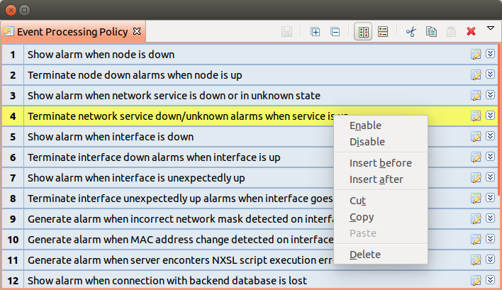
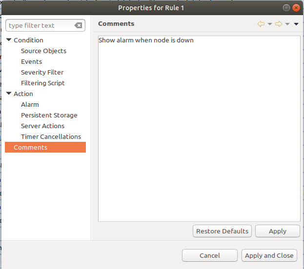
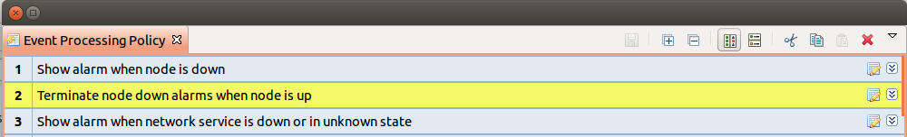

.. _event-processing:

################
Event processing
################

Event Processing Policy
=======================

Actions taken by event processor for any specific event determined by set of
rules called :guilabel:`Event Processing Policy`.

.. figure:: _images/event_processing_policy.png

   Event Processing Policy Screen

Every rule has two parts - a matching part (called :guilabel:`Condition` in the
rule configuration dialog), which determines if the rule is appropriate for the
current event, and an action part, which determines actions to be taken for
matched events. 

Each event passes through all rules in the policy, so if it matches to more
than one rule, actions specified in all matched rules will be executed. You can
change this behavior by setting Stop Processing flag for the rule. If this flag
is set and rule matched, processing of current event will be stopped.

You can create and modify :guilabel:`Event Processing Policy` using 
:guilabel:`Event Processing Policy Editor`. To access the 
:guilabel:`Event Processing Policy Editor` window, press ``F4`` or select 
:menuselection:`Tools --> Event Processing Policy` menu.

To create event policy right click on entry before or after witch new Event 
Processing Policy should appear and select :guilabel:`Insert before` or 
:guilabel:`Insert after`. Drag and drop can be used for rule reorganization.

  Edit buttons

To edit Event Processing Policy, filter or action click on icon in right 
corner of an entry, it will open general properties of Event Processing Policy.

.. figure:: _images/epp_edit_button.png

  Edit buttons

In EPP properties there are following sections:

.. list-table::
   :widths: 25 75
   :header-rows: 1

   * - Section
     - Description
   * - Comments
     - There can be added comment about this policy that will be displayed like EPP name.
   * - Condition
     - This part determines if the rule is appropriate for the current event.
       There can be disabled check of this EPP.
   * - Condition --> Source Objects
     - One or more event's source objects. This list can be left empty, which
       matches any node, or contain nodes, subnets, or containers. If you
       specify subnet or container, any node within it will be matched.
   * - Condition --> Events
     - Event code. This field can be left empty, which matches any event, or
       list of event codes.
   * - Condition --> Severity Filter
     - Event's severity. This field contains selection of event severities to
       be matched.
   * - Condition --> Filtering Script
     - Optional matching script written in NXSL. If this field is empty, no
       additional checks performed. Otherwise, the event will be considered as
       matched only if the script returns non-zero (``TRUE``) return code. For
       more information about NetXMS scripting language please refer to the
       chapter :ref:`scripting` in this manual.
   * - Action
     - In action part you can set what action should be done if event meets condition.
       There also can be set flag :guilabel:`Stop event processing`, that will stop check on this rule. 
   * - Action --> Alarm
     - There can be set rules connected with alarm generation. Alarm can be created, 
       resolved or terminated ore done nothing. 
   * - Action --> Situations 
     - :ref:`event_corelation` **TODO** functionality will be changed to NXSL Pers. Store
   * - Action --> Server Actions 
     - There is defined list of actions to be executed if condition is met. For action 
       configuration refer to :ref:`actions` chapter.

  Event Processing Policy properties
     

  Description of EPP toolbar form left to right: save changes, expand all, collapse all, horizontal layout, vertical layout, cut EPP, copy EPP, paset EPP, delete EPP
   

***After all manipulations are done - save changes by pressing save icon.***

Examples
--------

This rule defines that for every major or critical event originated from a
node named "IPSO" two e-mail actions must be executed.

.. figure:: _images/EPP_rule_config_example_1.png

   Example 1

.. _alarms:
   
Alarms
======

Alarms Overview
---------------

As a result of event processing some events can be shown up as alarms. Usually
alarm represents something that needs attention of network administrators or
network control center operators, for example low free disk space on a server.

All alarm events are logged to alarm log. A number of days the server keeps 
an alarm history can be configured by "AlarmHistoryRetentionTime" server 
configuration parameter. Alarm log can be viewied in "Alarm Log View"(Alt+F8).
This view give option to query in alarm log required information. 

Every alarm has the following attributes:

.. list-table::
   :widths: 25 75
   :header-rows: 1

   * - Attribute
     - Description
   * - Creation time
     - Time when alarm was created.
   * - Last change time
     - Time when alarm was last changed (for example, acknowledged).
   * - State
     - Current state of the alarm, see table bellow
   * - Message
     - Message text (usually derived from originating event's message text).
   * - Severity
     - Alarm's severity - :guilabel:`Normal`, :guilabel:`Warning`,
       :guilabel:`Minor`, :guilabel:`Major`, or :guilabel:`Critical`.
   * - Source
     - Source node (derived from originating event).
   * - Key
     - Text string used to identify duplicate alarms and for automatic alarm
       termination.

Possible alarm states:

.. list-table::
   :widths: 25 75

   * - Outstanding
     - New alarm.
   * - Acknowledged
     - When network administrator sees an alarm, he may acknowledge it to
       indicate that somebody already aware of that problem and working on it.
       A new event with the same alarm ID will reset the alarm state back to
       outstanding
   * - Sticky Acknowledged for time
     - Alarm will remain acknowledged for given time interval even after new 
       matching events, after time will pass alarm will be moved to outstanding 
       state. This option can be used like snooze. When you know that there will 
       be new matching events, but it will not change the situation. But after 
       some time someone should check this problem. For example, if you have 
       problem that cannot be solved until next week, so this alarm can be 
       sticky acknowledged for 7 days. After 7 days this problem again will be 
       in outstanding state. This type of acknowledge can be disabled by parameter 
       "EnableTimedAlarmAck" in server configuration view.
   * - Sticky Acknowledged
     - Alarm will remain acknowledged event after new matching events. This can
       be useful when you know that there will be new matching events, but it
       will not change the situation. For example, if you have network device
       which will send new SNMP trap every minute until problem solved, sticky
       acknowledge will help to eliminate unnecessary outstanding alarms.
   * - Resolved
     - Network administrator sets this state when the problem is solved.
   * - Terminated
     - Inactive alarm. When problem is solved, network administrator can
       terminate alarm. This will remove alarm from active alarms list and it
       will not be seen in console, but alarm record will remain in database.

There are 2 types of alarm state flows: strict and not strict. This option can 
be configured in Preference page of Alarms or on server configuration page, 
parameter "StrictAlarmStatusFlow". The difference between them is that in strict 
mode Terminate can be done only after Resolve state.

.. figure:: _images/AlarmStatesTransitionsInvokedByUser-NOTstrict.png
   :scale: 55%

   Not strict(default)
   

.. figure:: _images/AlarmStatesTransitionsInvokedByUser-strict.png
   :scale: 55%

   Strict
   
Alarm Melodies
--------------

On each severity of alarm can be set melody to play. This melody will be played 
when new alarm in state outstanding will occur. Melody that should be played should
exist on server in wav format. See instruction there: :ref:`upload-file-on-server-label`.
By default there are no sounds on alarms. 

To set sound open preferences, there select :menuselection:`Alarms --> Alarm Sounds` tab. 
There in drop-down will be seen all possible options. If sound will not be chosen, 
alarm with this severity will come silently. 

.. figure:: _images/Alarm_Sound_Preferences.png
   :scale: 65%

Alarm Browser
-------------

When an alarm is generated it will appear in the Alarm Browser where information about currently active
alarms can be viewed.

.. figure:: _images/alarm_browser.png
   :scale: 65%

Alarm Comments
~~~~~~~~~~~~~~

For each alarm can be created comments in "Alarm Details"

.. figure:: _images/alarm_details_comments.png
   :scale: 65%

or "Alarm Comments" views. 

.. figure:: _images/alarm_comments.png
   :scale: 65%

Comment can be created, edited or deleted. All comments will be deleted after alarm termination. 

Alarm Summary Emails
~~~~~~~~~~~~~~~~~~~~

It is possible to schedule emails which contain a summary of all currently active alarms, similar 
to what can be seen in the Alarm Browser.

To enable Alarm Summary Emails it is required to configure the following server parameters:

.. list-table::
   :widths: 25
   :header-rows: 1

   * - Name
   * - SMTPFromAddr
   * - SMTPFromName
   * - SMTPPort
   * - SMTPRetryCount
   * - SMTPServer
   * - EnableAlarmSummaryEmails
   * - AlarmSummaryEmailSchedule
   * - AlarmSummaryEmailRecipients

Further information on server configuration parameters can be found in :ref:`server_configuration_parameters`.

.. _generating_alarms:

Generating Alarms
-----------------

To generate alarms from events, you should edit :guilabel:`Alarm` field in
appropriate rule of :guilabel:`Event Processing Policy`. Alarm configuration
dialog will look like this:

.. figure:: _images/Alarm_config.png

You should select :guilabel:`Generate new alarm` radio button to enable alarm generation from current rule. 
In the :guilabel:`Message` field enter alarm's text, and in the alarm key enter value which will be used for 
repeated alarms detection and automatic alarm termination. In both fields you can use macros described 
in the :ref:`event-processing-macros` section.

You can also configure sending of additional event if alarm will stay in
:guilabel:`Outstanding` state for given period of time. To enable this, enter
desired number of seconds in :guilabel:`Seconds` field, and select event to be
sent. Entering value of ``0`` for seconds will disable additional event
sending.

Alarms generated by rules can by categorised to limit what alarms can be seen by what users.
This can be done by applying a category in the :guilabel:`Alarm Category` field, which can be
created and configured in the :ref:`alarm-category-config`.

.. _alarm-category-config:

Alarm Caregory Configurator
---------------------------

Alarm categories can be created and configured in the :guilabel:`Alarm Category Configurator` which can
be found in :menuselection:`Configuration --> Alarm Category Configurator` menu:

.. figure:: _images/Alarm_category_config.png
   :scale: 65%

   Alarm Category Configurator

Alarm categories provide the possibility to configure access rights for viewing generated alarms on a per user
or per group basis. When creating an alarm category, it is possible to set the :guilabel:`Category name`, 
:guilabel:`Description`.

.. figure:: _images/Alarm_category_properties.png

	Alarm Category properties

Alarm category access rights can be configured by adding users or groups to the access list of the category in
the :guilabel:`Access Control` property page.

.. figure:: _images/Alarm_category_access.png

	Alarm Category Access Control

By default, all alarms can be viewed by all users due to the :guilabel:`View all alarms` system right
being set as default to the :guilabel:`Everyone` user group. In order to limit the viewing of alarms, this system
right should be removed and the access rights configured in the categories themselves. When the categories have
been configured, they can be applied to the necessary :guilabel:`Event Processing Policy` rules.

If an alarm category has been applied to an :guilabel:`Event Processing Policy` rule, it will appear in the
:guilabel:`Event Processing Policy Editor` when a rule is expanded under the :guilabel:`Action` section.

.. figure:: _images/EPP_rule_expanded.png

	Event Processing Policy expanded

Automatic Alarm Termination/Resolve
-----------------------------------

You can terminate or resolve all active alarms with given key as a reaction for the event.
To do this, select :guilabel:`Terminate alarm` radio button or :guilabel:`Resolve alarm` 
radio button in alarm configuration dialog and enter value for alarm key. For that field 
you can use macros described in the :ref:`event-processing-macros` chapter.

Escalation
----------

As it was described in :ref:`generating_alarms` chapter there is possibility to generate new 
event if alarm stay in :guilabel:`Outstanding` state for too long. Escalation is built on 
this option. When alarm was generated, but no action was done from operator in predefined time, 
new event can be generated and this time email or SMS can be sent to operator or to it's manager.
This escalation process can have as many steps as it is required. 

Example 1:
  - TODO: create example of escalation with screenshot of EPP

.. _actions:
  
Actions
=======

In addition to alarm generation server can perform various types of actions as a reaction to an event. 
Action types available in NetXMS are described in the following sections. Each action can be separately 
disabled in action configuration. 

Execute command on management server
------------------------------------

Executes provided command on server node. Check that user under witch :file:`netxmsd` process 
run has permission to run this command. 

Execute command on remote node
------------------------------

Executes provided command name defined in this nodes agent configuration file. To this 
command can be given parameters in format: ``commandName param1 param2 param3...`` 
Check that user under witch :file:`nxagentd` process run has permission to run this 
command. 

As the :guilabel:`Remote Host` can be used hostname or object name(int format: ``@objectName``).
Second option allows action execution on node behind proxy. 

Send e-mail
-----------

Send email to one or more recipients. Multiple recipients can be separated by semicolons. 
Required server configuration parameters to send emails: ``SMTPFromAddr``, ``SMTPFromName``,
``SMTPRetryCount``, ``SMTPServer``. For detailed description of parameters check :ref:`server_configuration_parameters`.

In message text can be used :ref:`event-processing-macros`.

Send SMS
--------

Send SMS to one or more recipients. Multiple recipients can be separated by semicolons. 
Server will use :ref:`SMS driver<sms-drivers>` for actual message sending.

In message text can be used :ref:`event-processing-macros`.

Send XMPP message
-----------------

Sends XMPP/Jabber message to one or more recipients. Multiple recipients can be separated by semicolons.
equired server configuration parameters to send XMPP message: :guilabel:`XMPPLogin`, :guilabel:`XMPPPassword`,
:guilabel:`XMPPPort`, :guilabel:`XMPPServer`, :guilabel:`EnableXMPPConnector`. For detailed description of 
parameters check :ref:`server_configuration_parameters`.

In message text can be used :ref:`event-processing-macros`.

Execute NXSL script
-------------------

This action executes script form scrip library. In action configuration should be defined name of script. 
Information about scripting and library can be found :ref:`there<scripting>`.

.. _forward_events:

Forward event
-------------
NetXMS does not support configuration synchronization between two NetXMS servers(Distributed Monitoring). But it is possible
to forward events from one server to another. This option allow synchronize events between servers but there are some limitation. 

Configuration
~~~~~~~~~~~~~

Source server configuration:
  1. Create new action of type "forward event" - it will have destination server address property.
  2. Create a rule in event processing policy with filter for events you want to forward and add forwarding action as action.

Destination server configuration:
  1. Enable EnableISCListener and ReceiveForwardedEvents in server configuration.
  2. Open port 4702.
  3. Check that receiving server have all events as on a sending server

 
Limitation
~~~~~~~~~~
 
Limitations of event forwarding:
  1. Event template with same event code or event name must exist on recipient server
  2. Node object with same IP address as event's source node's address must exist on recipient server
  3. Does not work with zones

Events not met these conditions are discarded.
It is possible to check if and why incoming events are discarded if turn on level 5 debug on receiving server.

There can be used one of two options if it is required to disable polling of sender server nodes on recipient server: disable all 
polling protocols or unmanage nodes. Chose  depends on how you wish to see node's status. For unmanaged node, it always be 
"unmanaged", regardless of active alarms. If you disable polling, node's status will be "unknown" unless there will be active 
alarms for that node - in that case node's status will change to severity of most critical alarm.

.. _event_corelation:

NXLS Persistent Storage
=======================

.. TODO::
  Once will be implemented - update functionality description.

Situations Overview
-------------------

Situations is a special type of event processing objects which allow you to
track current state of your infrastructure and process events accordingly. Each
situation has one or more instances, and each instance has one or more
attributes. Situation objects allow you to store information about current
situation in attributes and then use this information in event processing. For
example, if you have one service (``service A``) depending on another
(``service B``), and in case of ``service B`` failure you wish to get alarm
about ``service B`` failure, and not about consequent ``service A`` failure. To
accomplish this, you can do the following:

#. Create situation object named ``ServiceStatus``
#. In event processing policy, for processing of event indicating ``service B``
   failure, add situation attribute update: update situation ``ServiceStatus``,
   instance ``Service_B``, set attribute ``status`` to ``failed``
#. In event processing policy, for rule generating alarm in case of ``service
   A`` failure, add additional filtering using script - to match this rule only
   if ``service B`` is not failed. Your script may look like the following:

.. code-block:: c

  sub main()
  {
      s = FindSituation("ServiceStatus", "Service_B");
      if (s != NULL)
      {
          if (s->status == "failed")
              return 0; // Don't match rule
      }
      return 1; // Match rule
  }

Defining Situations
-------------------

Situations can be configured via management console. To open situations editor,
select :menuselection:`Configuration --> Situations Manager`. You will see
situations tree. At the top of the tree is an abstract root element. Below are
all defined situations - initially there are no situations, so you will see
only root element. You can create situation either by right-clicking root
element and selecting :guilabel:`Create` from pop-up menu.

Next level in the tree below situations is situation instances. Initially it is
empty, but when situations start updating, you will see existing instances for
each situation.

Updating Situations
-------------------

Situations can be updated via :guilabel:`Event Processing Policy`. To update
situation, you can edit :guilabel:`Situation` field in appropriate rule.
Situation update dialog will looks like following:

You can select situation to update, and enter instance name and attributes to
be set. In instance name and attributes' values you can use same macros as in
alarm generation.

.. _event-processing-macros:

Macros for Event Processing
===========================

On various stages of event processing you may need to use macros to include
information like event source, severity, or parameter in your event texts,
alarms, or actions. You may use the following macros to accomplish this:

.. list-table::
   :header-rows: 1
   :class: longtable

   * - Macro
     - Description
   * - ``%a``
     - IP address of event source object.
   * - ``%A``
     - Alarm's text (can be used only in actions to put text of alarm from the
       same event processing policy rule).
   * - ``%c``
     - Event's code.
   * - ``%g``
     - Globally unique identifier (GUID) of event source object.
   * - ``%i``
     - Unique ID of event source object in hexadecimal form. Always prefixed
       with 0x and contains exactly 8 digits (for example 0x000029AC).
   * - ``%I``
     - Unique ID of event source object in decimal form.
   * - ``%K``
     - Alarm's key (can be used only in actions to put text of alarm from the
       same event processing policy rule).
   * - ``%m``
     - Event's message text (meaningless in event template).
   * - ``%M``
     - Custom message text. Can be set in filtering script by setting ``CUSTOM_MESSAGE`` variable.
   * - ``%n``
     - Name of event source object.
   * - ``%N``
     - Event's name.
   * - ``%s``
     - Event's severity code as number. Possible values are:
         - 0 - :guilabel:`Normal`
         - 1 - :guilabel:`Warning`
         - 2 - :guilabel:`Minor`
         - 3 - :guilabel:`Major`
         - 4 - :guilabel:`Critical`
   * - ``%S``
     - Event's severity code as text.
   * - ``%t``
     - Event's timestamp is a form day-month-year hour:minute:second.
   * - ``%T``
     - Event's timestamp as a number of seconds since epoch (as returned by
       `time() <http://linux.die.net/man/2/time>`_ function).
   * - ``%u``
     - User tag associated with the event.
   * - ``%v``
     - NetXMS server's version.
   * - ``%[name]``
     - Value returned by script. You should specify name of the script from script library.
   * - ``%{name}``
     - Value of custom attribute.
   * - ``%<name>``
     - Event's parameter with given name.
   * - ``%1`` - ``%99``
     - Event's parameter number 1 .. 99.
   * - ``%%``
     - Insert ``%`` character.

If you need to insert special characters (like carriage return) you can use the
following notations:

+--------+--------------------------------+
| Char   | Description                    |
+========+================================+
| ``\t`` | Tab Character (0x09)           |
+--------+--------------------------------+
| ``\n`` | New line, CR/LF character pair |
+--------+--------------------------------+
| ``\\`` | Backslash character            |
+--------+--------------------------------+

Event's parameter with given name
---------------------------------

  * %<dciId>
  * %<dciName>
  * %<dciDescription>
  * %<thresholdValue>
  * %<currentValue>
  * %<instance>
  * %<isRepeatedEvent>
