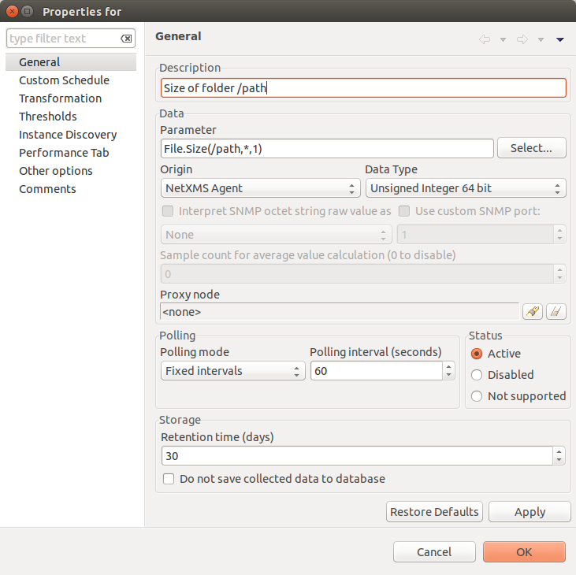
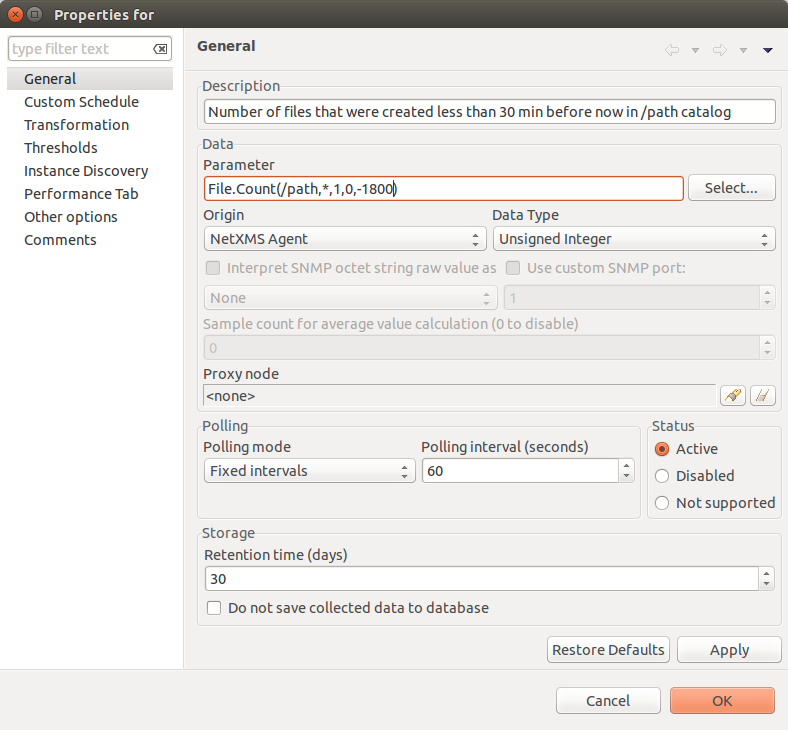
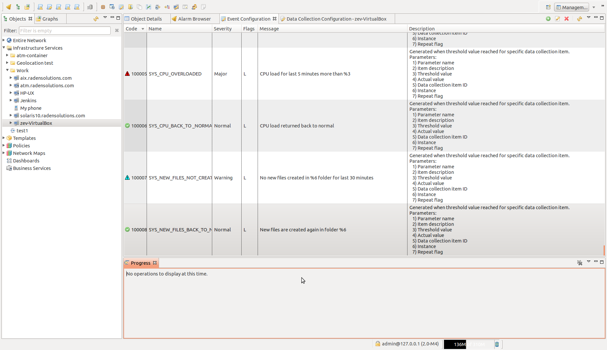
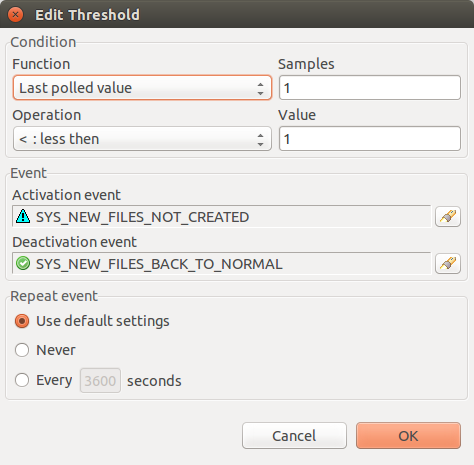
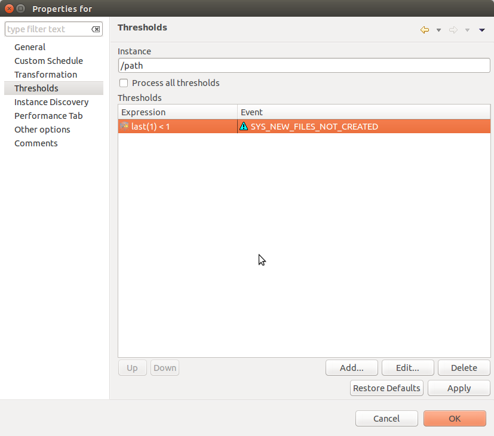

.. _file-system-monitoring:

======================
File System Monitoring
======================

|product_name| has two options to monitor files: one is to use build in agent file monitoring functionality, that is 
described in next chapter and another is to create :term:`DCI` that will collect file information and create your own 
thresholds for collected data. Second approach is describe in :ref:`file-dci-metrics` chapter.

File Monitoring
===============
 
|product_name| provides a feature to monitor hash value of a file, last modification time and permissions changes.
One file is added to monitoring any changes to those file parameters will be detected and reported to the server via events.
Those events are ``SYS_AGENT_FILE_ADDED``, ``SYS_AGENT_FILE_CHANGED`` and ``SYS_AGENT_FILE_DELETED`` for files creations, 
alterations and deletions correspondingly.

Specify the path to a file for monitoring by adding ``[FileMonitor]`` section to :ref:`agent-configuration-files-label`. 
If the path to a directory is specified, then all files in that directory and it's subdirectories will be monitored.

Configuration parameters:

   #. ``Path`` - The path to monitored file. This parameter should be specified once for each file/directory.
   #. ``Interval`` - Check interval in seconds. This parameter should not be specified multiple times. 
      This parameter is optional and will be set to 6 hours by default.

.. code-block:: ini

  # Example
  [FileMonitor]
  Interval=10800
  Path=/home/user/file_name
  Path=/home/user/directory

.. _file-dci-metrics:

DCI Metrics for file system monitoring
======================================

'FileSystem.*' Metrics
----------------------

Metrics with prefix 'FileSystem' are used to monitor file system. They provide information about free and user space, inode information, etc.

Full list of available metrics can be found in :ref:`FileSystem.* <file-system-metrics>` section.

'File.*' Metrics
----------------

Metrics with prefix 'File' are used to monitor files. They provide information about file size, count, modification time, etc.

Full list of available metrics can be found in :ref:`File.* <file-metrics>` section.

Examples
--------

In examples will be shown only DCI configuration with threshold. Generated event
processing options can be found in :ref:`event-processing` chapter.

Example 1
~~~~~~~~~

In this example will be shown how to check that specific folder exceed specified size.

Create DCI for File.Size(*) metric to monitor folder size. Required parameters:
/path,*,1.

In threshold it should be checked that last value is less than 2 GB. That mean
that returned value should be less than 2 000 000 000 bytes.

.. figure:: _images/file-meta-info-example2.png

  Threshold

Example 2
~~~~~~~~~

In this example will be configured monitoring that in exact folder exist files that
was modified less then half an hour ago.

Create DCI for File.Count(*) metric to monitor file count in folder /path, that match
any pattern, folder should be checked recursively, file match any size, files are
created less than 30 minutes ago. This conditions will be given to metric as this
parameters: path,*,1,0,-1800.

In threshold it should be checked that at least one file meeting conditions exists.
That mean that file count should be more than 1. Prerequisite is to create 2 events.

  Events

  Threshold

As in message of error is used Instance parameter, it should be set in
:guilabel:`Threshold` window.

