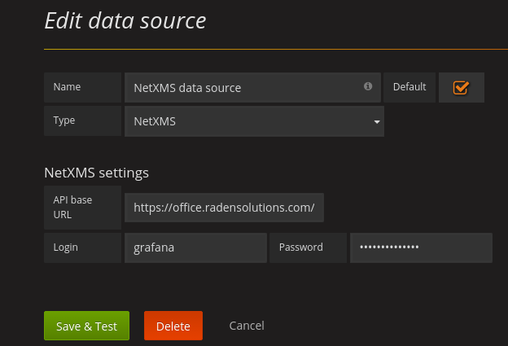
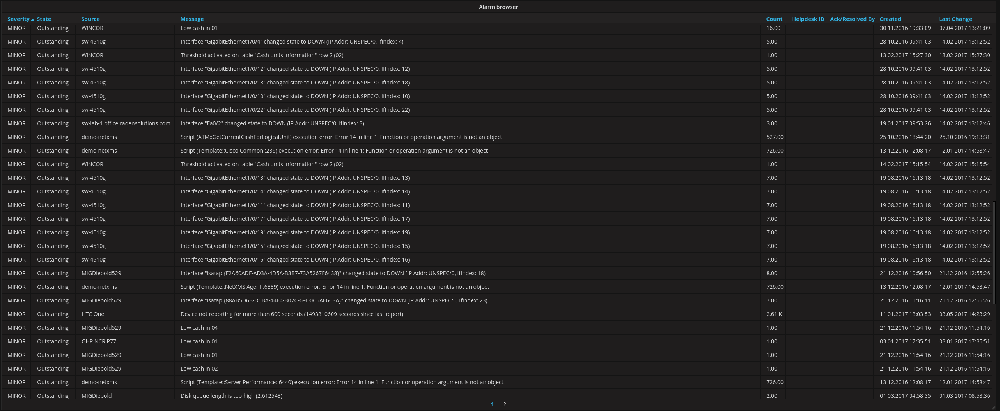
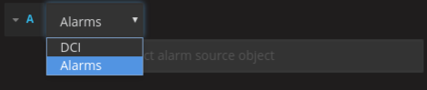
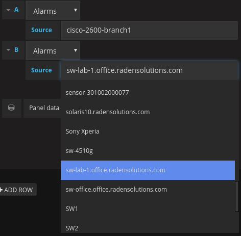
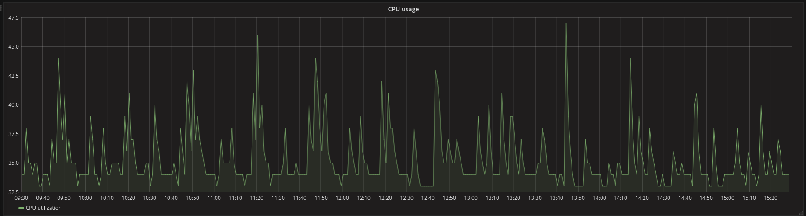
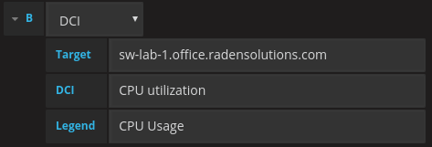

.. _grafana-integration:

###################
Grafana integration
###################

|product_name| Grafana integration provides the possibility to display important data using
the Grafana platform and the :ref:`NetXMS WebAPI <rest-api>`.

Integration with Grafana
========================

The |product_name| Grafana datasource provides an alternative way of monitoring to that of the |product_name| Web and Desktop consoles or the Android app, by using the Grafana platform and the |product_name| WebAPI.

Requirements
------------

The following prerequisites need to be set-up first:

A running instance of the |product_name| Server.
A running instance of the |product_name| WebAPI.
A running instance Grafana (more information in https://grafana.com/get).

Installation
------------

See https://grafana.com/plugins/radensolutions-netxms-datasource/installation

For installation from source:

    1. Clone the |product_name| Grafana datasource GitHub repository from https://github.com/netxms/grafana.
    2. Copy the files from the repository to :file:`GRAFANA_HOME/data/plugins/datasources/netxms`
    3. Restart your Grafana server.
    4. Login to your Grafana web interface and add the |product_name| datasource in the Data Sources section.

Features
--------

The datasource currently supports the following functionality:

   * Visualization of configured data collection items for objects in graphs and tables.
   * Listing of active alarms on a general or a per object basis

.. _grafana-config:

Configuration
=============

The data source can be configured in the data source management section in the Grafana
web ui. The required settings are the base URL of the |product_name| WebAPI, the username and the
password of an account that exists on your |product_name| server. It is suggested to create a dedicated
account to be used with Grafana.

.. _grafana-alarm-browser:

Alarm Browser
=============

The data source provides the possibility to view currently active :ref:`alarms` on all nodes
or on a per node basis. To do this, you need to add a new Table Panel to your Grafana dashboard
and then edit the Metrics section of the panel settings. If the |product_name| data source is set as the
default data source, it should have been added to the panel automatically, if not, select the name
of the installed |product_name| data source from the `Panel data source` list and press `Add query` to add
the data source.`

.. figure:: _images/add-data source.png

Once the data source is added to the panel, it is necessary to set the necessary type of data for
the data source to provide, in this case - `Alarms`.

After the data type has been set, you should see the active alarms appear on the table panel.
If you wish to view alarms from specific nodes only, you can add multiple data sources to your
table panel and for each specify the node you wish to see the active alarms of.

.. _grafana-dci:

Data Collection Items
=====================

The data source provides the possibility to visualize metrics collected from data collection items
configured on nodes. This can be achieved by adding a Graph Panel to your Grafana dashboard,
adding the |product_name| data source to it and selecting the `DCI` data type in the Metrics section
of the graph panel settings. Once this is done, it is possible to select the `Target` node from
the list of targets which will then provide a list of the configured DCI`s for the particular node
in the `DCI` section. By default, the legend of the data provided by the DCI will be the DCI`s
description as configured on the server, it is also possible to set a legend of your choice by
entering it in the `Legend` section.

It is possible to view multiple DCI`s on the same graph by adding multiple data sources to it.
