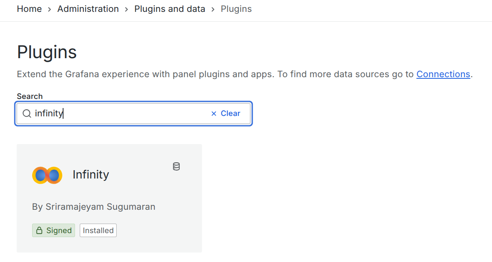
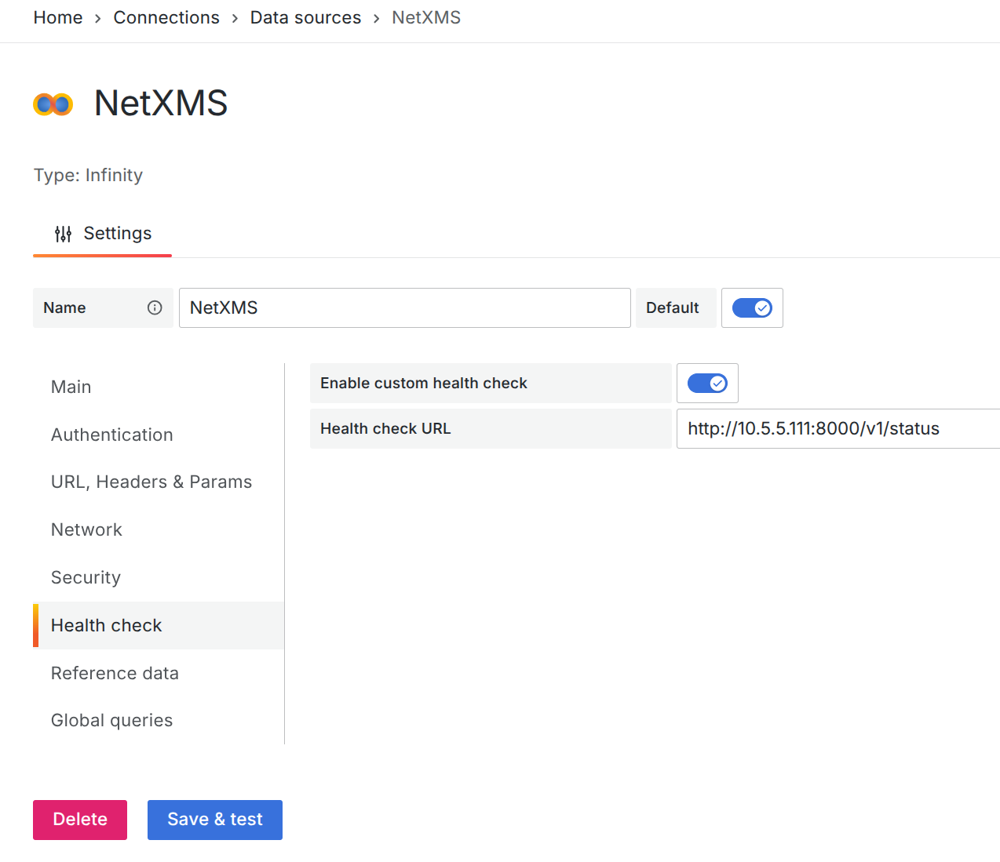
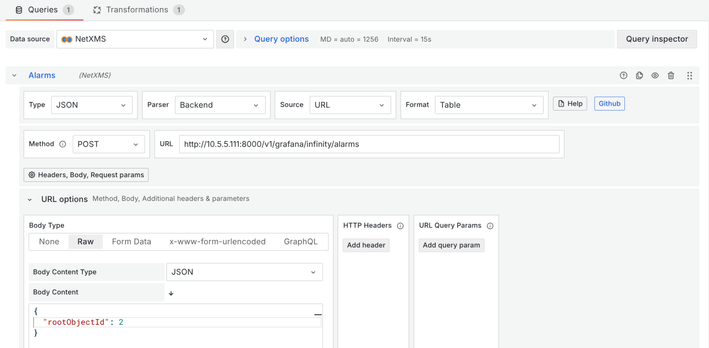

.. _grafana-integration:

###################
Grafana integration
###################

This article walks through the configuration process for using Grafana within 
|product_name| API, enabling seamless visualization of critical monitoring data.

Prerequisites
=============

* |product_name| server installation (with access to ``netxmsd.conf``).
* Grafana instance.
* Appropriate user account in |product_name| with rights to issue an authentication token.

Enabling the Web API in |product_name|
======================================

First, the initial step is to enable the Web API module in the |product_name| 
server configuration. This module allows external applications, like Grafana, 
to communicate with |product_name| and retrieve monitoring data through RESTful 
API calls.

In |product_name| server configuration (``netxmsd.conf``), enable the Web API module::

   Module = webapi

This line in the netxmsd.conf file will enable the Web API module on the server, which by default listens on port 8000.

The port can be changed using the configuration parameter:

.. code-block:: ini

   [WEBAPI]
   ListenerPort = 8000   # default port; change if necessary

.. note::
  For production use, it is recommended to place a reverse proxy
  (e.g. Nginx) in front of the Web API to enable SSL encryption.

Installing the Infinity Plugin in Grafana and Configuring the Connection
========================================================================

   Infinity plugin on the Grafana marketplace

First, install the Infinity plugin from the Grafana plugin marketplace, 
and then configure a new data source for the |product_name| API.

1. A Bearer Token should be used to authenticate with the API. The token can be obtained by selecting a user in the Users view and choosing "Issue authentication token..." from the right-click menu.
2. The API address must be added to the Allowed Hosts section.
3. The /v1/status endpoint can be used to configure a health check for the data source.

   |product_name| data source configuration

API Endpoints Supported
=======================

Alarms
------

The Alarms endpoint provides alarm data for a specific part of the object tree or for the entire system if no object is provided. If no specific object is defined, it defaults to system-wide alarms.

Request info
~~~~~~~~~~~~

* **Request:** POST
* **URL:** v1/grafana/infinity/alarms
* **Data:**

  * JSON data can be empty or can contain root object id, to show all alarms under a specific root.
  * Example JSON data:

.. code-block:: json

      {
        "rootObjectId": 2
      }

Example
~~~~~~~

In this example, we configured the system to retrieve all alarms under the 
:guilabel:`Infrastructure` container, which has an object ID of 2.

Grafana configuration:

* **Visualization:** Table
* **Method:** POST
* **URL:** ``http://server_addres:server_port/v1/grafana/infinity/alarms``
* **Request JSON data:** ``{"rootObjectId" : 2}``

   Configuration of the alarm query using the Infinity Plugin

By default, Grafana sorts columns alphabetically. To arrange them in the same 
order as in |product_name|, we use the "Column order" data transformation.

   Column ordering is achieved through a transformation

   Displaying |product_name| alarms in Grafana

Object Queries
--------------

The Object Query endpoint provides an option to retrieve the result of a 
predefined query. Columns and their names should be defined in the Object 
Query script.

Request info
~~~~~~~~~~~~

* **Request:** POST
* **URL:** v1/grafana/infinity/object-query
* **Data:**

  * Minimal JSON configuration is ``queryId`` - id of saved object query.
  * Additionally, ``rootObjectId`` and user-provided query values - ``inputFields`` can be configured.
  * Example JSON data:

.. code-block:: json

      {
        "rootObjectId": 2,
        "queryId": 1,
        "inputFields": {
          "fieldName": "value",
          "anotherField": "anotherValue"
        }
      }

Example
~~~~~~~

In this example, we created an object query that displays |product_name| agent 
information for nodes with an agent. The query was created on the |product_name| 
server, and its ID is 2.

The NXSL script for the query looks like this:

.. code-block:: javascript

   with
    nodeName (name = "Node name", order = "asc") = {
      $node.name
    },
    agentVersion (name = "Agent Version") = {
      $node.agentVersion
    },
   agentUnrechable (name = "Agent unrechable") =
   {
      $node.state == NodeState::AgentUnreachable
   },
   lastCommTime (name = "Last connection time") = {
      DateTime($node.lastAgentCommTime).format("%Y-%m-%d %H:%M")
    },
   tunnelConnected (name = "Tunnel connection") = {
      $node.tunnel != null
    },
    hasUserAgent (name = "Has user agent") = {
      $node.hasUserAgent
    },
    platformName (name = "Platform name") = {
      $node.platformName
    },
    subagents (name = "Subagents") = {
      result = "";
      if ($node.state == NodeState::AgentUnreachable || $node.state == NodeState::Unreachable)
         return result;
      table = $node.readAgentTable("Agent.SubAgents");
      for(i = 0; table != null && i < table.rowCount; i++)
      {
         for(j = 0; j < table.columnCount; j++)
         {
            if (table.getColumnName(j) ilike "name")
            {
               result ..= table.get(i, j);
               break;
            }
         }
         if (i+1 != table.rowCount)
            result ..= ", ";
      }
      return result;
    }
   (type == NODE) and $node.isAgent

Grafana configuration:

* **Visualization:** Table
* **Method:** POST
* **URL:** ``http://server_addres:server_port/v1/grafana/infinity/object-query``
* **Request JSON data:** ``{"queryId" : 2}``

   Configuration of the object query using the Infinity Plugin

By default, Grafana sorts columns alphabetically. To arrange them in the same 
order as they appear in |product_name|, you should use the "Column Order" data 
transformation.

   Column ordering is achieved through a transformation

   Displaying |product_name| object query in Grafana

Summary Tables
--------------

The summary table endpoint provides an option to retrieve the summary table 
execution result. The API returns the same information as the |product_name| 
summary table UI.

Request info
~~~~~~~~~~~~

* **Visualization:** Table
* **Request:** POST
* **URL:** v1/grafana/infinity/summary-table
* **Data:**

  * The root object is the object on which the summary table will be executed. 
    Both the root object ID and the table ID are required fields.
  * JSON data:

.. code-block:: json

      {
        "rootObjectId" : 2,
        "tableId" : 1
      }

Example
~~~~~~~

In this example, we created a summary table displaying agent statistics.

   Summary table configuration in |product_name|

Grafana configuration:

* **Method:** POST
* **URL:** ``http://server_addres:server_port/v1/grafana/infinity/object-query``
* **Request JSON data:** ``{ "rootObjectId": 2, "tableId" : 5 }``

   Configuration of the summary table using the Infinity Plugin

By default, Grafana sorts columns alphabetically. To arrange them in the same 
order as it's shown in |product_name|, we use the "Column Order" data transformation.

   Displaying |product_name| summary table in Grafana

Data Collection History
-----------------------

This endpoint provides historical DCI data. It can be used to display the data as 
both a graph and a table. Let's look at both in this section.

Request info
~~~~~~~~~~~~

* **Request:** GET
* **URL:** ``/v1/objects/:object-id/data-collection/:dci-id/history?timeFrom=XXX&timeTo=YYY``

The URL should contain the correct object ID, DCI ID, start timestamp, and end 
timestamp.

The API will return a JSON object containing the description, unit name, and an 
array of values.

Example: CPU Graph
~~~~~~~~~~~~~~~~~~

In this example, we created a line chart showing CPU usage.

Configuration:

We will not go into the DCI configuration here, as it is part of the default 
|product_name| templates.

Instead, we'll describe the configuration for one entry; the other entries in 
the Time Series panel have exactly the same configuration, with only the DCI 
ID being different.

The time frame for the requested data is taken from the dashboard's configured 
time range. We divide it by 1000, as Grafana provides the time in milliseconds, 
while |product_name| expects it in seconds.

* **Name:** CPU Usage
* **Format:** Data Frame
* **Method:** GET
* **URL:** ``http://server_addres:server_port/v1/objects/108/data-collection/183/history``
* **URL Query Parameters:**

  * ``timeFrom = $__from/1000``
  * ``timeTo = $__to/1000``

* **Root:** values
* **Columns:**

  * timestamp as Timestamp, format as Time, time format Default ISO
  * value as Value, format as Number

   Configuration of the graph data source using the Infinity Plugin

   Displaying CPU data collected by |product_name| in Grafana

Example of the Authentication Error History
~~~~~~~~~~~~~~~~~~~~~~~~~~~~~~~~~~~~~~~~~~~

|product_name| Configuration:

In |product_name|, we've created a template with two policies:

  1. The first enables the LogWatch subagent.
  2. The second monitors /var/log/auth.log using the LogWatch subagent 
     and pushes matching lines to a push DCI.

   Logwatch configuration in |product_name|

   Push DCI configuration in |product_name|

Grafana configuration will require the following steps:

* **Format:** Data Frame
* **Method:** GET
* **URL:** ``http://server_addres:server_port/v1/objects/108/data-collection/32466/history``
* **URL Query Parameters:**

  * ``timeFrom = $__from/1000``
  * ``timeTo = $__to/1000``

* **Root:** values
* **Columns:**

  * timestamp as Timestamp, format as Time, time format Default ISO
  * value as Value, format as Number

   Configuration of the table data source using the Infinity Plugin

   Configuration of the table data source using the Infinity Plugin

