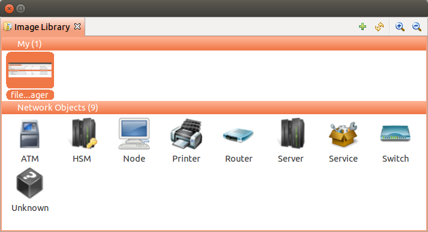

.. _image-library:

#############
Image library
#############

Introduction
============

All images used on map should be first uploaded to Image Library. It can be done through 
Image Library View.

Image Library View
==================

There is possible to upload, delete and update images. They can be organized by 
different categories. View can be zoomed in or zoomed out(library zoom is saved).

   
Tips: 
  - Images on map are displayed full size. 
  - Size of images predefined by |product_name| is 48x48
