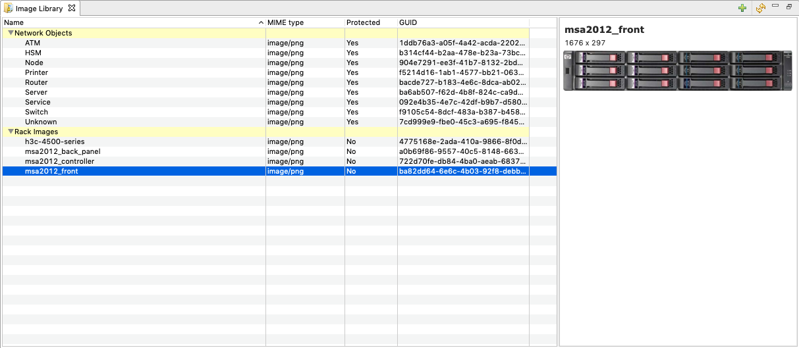

.. _image-library:

#############
Image library
#############

All images used on maps or as rack, chassis or chassis module image should be
uploaded to Image Library first. It is possible to upload, delete and update
images. They can be organized by categories.

Tips:
  - Images on maps are displayed without scaling.
