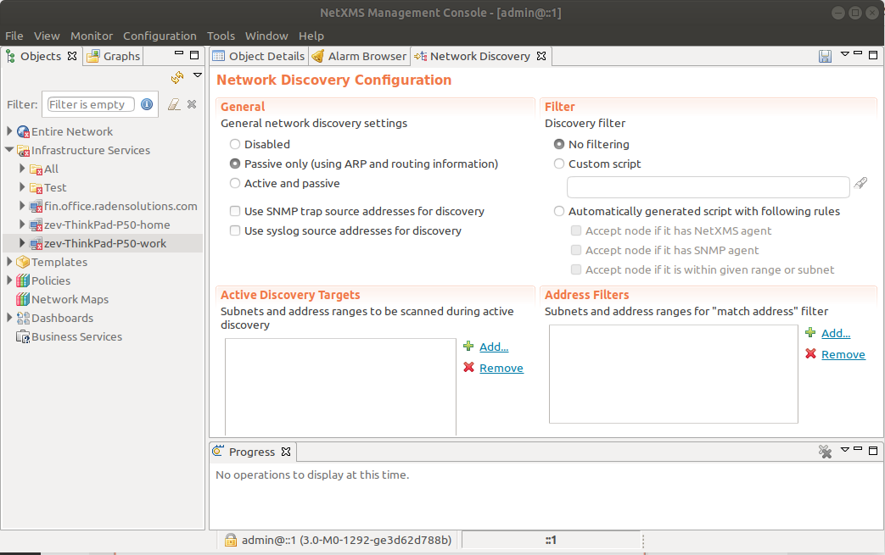

.. _network-discovery:

#################
Network discovery
#################

Introduction
============

|product_name| is capable of discovering your network automatically. Network discovery
module can operate in two modes - passive and active.

In passive mode,
information about new hosts and devices obtained from :term:`ARP` tables and
routing tables of already known devices. |product_name| starts with it's own
:term:`ARP` cache and routing table.

In active discovery mode, |product_name| server
will send an :term:`ICMP` echo requests to all IP addresses in given range, and
consider each responding address for adding to database. If zoning is used, server
sends echo request only in zone 0, in other zones requests are sent by proxies.
For each new device found |product_name| server tries to gather additional information using :term:`SNMP`
and |product_name| agent, and then adds it to database. By default |product_name| server will
add all discovered devices to database, but you can limit it by using discovery
filters. Default :term:`SNMP` credentials can be set in :ref:`default_snmp`.

Active discovery runs every 2 hours and passive every 15 minutes. These values
can be change in ``ActiveDiscoveryInterval`` and ``DiscoveryPollingInterval``
server variables. Default number of discovery poller's threads is 1, this
value can be change by ``NumberOfDiscoveryPollers`` parameter.
More information about server variables can be found :ref:`there <server_configuration_parameters>`.

Configuring Network Discovery
=============================

To change network discovery settings, go to main menu of management console and
choose :menuselection:`Configuration --> Network Discovery`. Configuration form
will open:

General
-------

In this section, you can choose network discovery mode, chose if source node of
:term:`SNMP Trap` or syslog source address should be used for discovery.

Filter
------

In this section, you can define filter for adding new nodes to |product_name| database.
Filtering options are following:

**No filtering**

Any new device found will be added to database. This is the default setting.

**Custom script**

You can choose :term:`NXSL` script from the :guilabel:`Script Library` to work
as discovery filter. Custom filtering script will get object of class
``NewNode`` as first parameter (special variable ``$1``), and should return
true to allow node inclusion into database.

**Automatically generated script**

This option can be used if you need only simple filtering. When selected,
additional options controls what nodes will be added to database:

.. list-table::

   * - Accept node if it has |product_name| agent
     - If checked, only nodes with |product_name| agent detected will pass the filter.
   * - Accept node if it has SNMP agent
     - If checked, only nodes with SNMP agent detected will pass the filter.
   * - Accept node if it is within given range or subnet
     - Only accept nodes within given address range or subnet. Address ranges
       can be configured in :guilabel:`Address Filters` section.

Please note that first two options (|product_name| agent presence and SNMP agent
presence) forms ``OR`` condition - if both are checked, any node with either
SNMP agent or |product_name| agent will pass. Address range check and first two options
forms ``AND`` condition - so if potential node does pass agent presence check,
but is not in allowed IP address range, it will not be accepted. In other
words, if all three options are checked, condition for new node to pass filter
can be written as following:

  **if** (node has |product_name| agent **or** node has SNMP agent) **and** node within given range **then** pass

Active Discovery Targets
------------------------

In this section, you can define address ranges for active discovery. |product_name|
server will periodically send ICMP echo requests to these addresses, and
consider for addition to database every responding device. This list has no
effect if active discovery is off.

Address Filters
---------------

In this section you can define address ranges for automatically generated
discovery filter. This list has no effect if discovery is off or filter is not
set to :guilabel:`Automatically generated script`.
