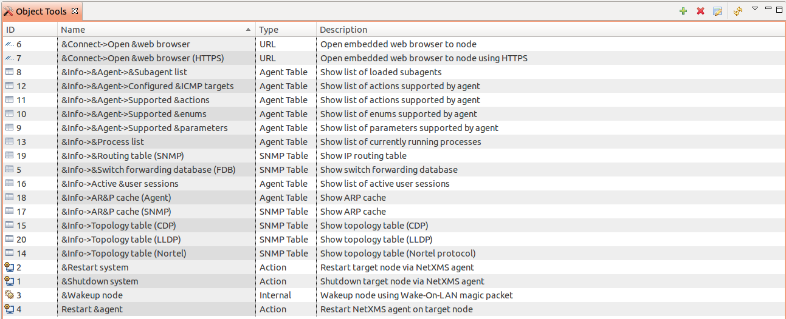

.. _object-management:

#################
Object management
#################

For object type description refer to :ref:`concept_object` chapter. 

Object browser
==============

NetXMS has eight top level objects – Entire Network, Service Root, 
Template Root, Policy Root, Network Map Root, Dashboard Root, Report Root, 
and Business Service Root. These objects served as an abstract root for 
appropriate object tree. All top level objects has only one editable 
attribute – name.

Add / remove objects
====================

Containers – bind/unbind
========================

Containers can be created in Infrastructure Services tree. Existing nodes and 
subnets can be added to containers by using Bind operation, and removed by using 
Unbind operation.

Automatic bind option
---------------------

For each container can be configured automatic binding rules. This can be in 
:guilabel:`Automatic Bind Rules` tab of container properties. 

..figure:: _images/automatic_bind_rules.png

There can be defined if script should be used for automatic binding, if script
should be used for node unbinding and can be written script it selves. 

This script will be executed each configuration poll of each node. 

Access control
==============

Object access rights controls access to NetXMS objects. Permissions given to an
object inherited by all child objects, unless specifically blocked by turning
off :guilabel:`Inherit access rights from parent object(s)` option in object's
access control properties. Permissions given at different levels of the object
tree summarize to form effective user rights for the object.

.. figure:: _images/object_acess_rights.png
   :scale: 65%

The following object access rights can be granted:

.. list-table::
   :header-rows: 1
   :widths: 25 75

   * - Access Right
     - Description
   * - Access control
     - Modify access control list for this object. Please note that user with
       this access right can grant any other access rights to own account.
   * - Acknowledge alarms
     - Acknowledge alarms with this object as source.
   * - Control
     - For node objects, execute object tools of type :guilabel:`Remote
       Command`.
   * - Create child objects
     - Create child objects (or bind existing) under this object.
   * - Create helpdesk tickets
     - Create ticket in external helpdesk system 
   * - Delete
     - Delete this object.
   * - Modify
     - Modify object's properties (except access control).
   * - Push data
     - Push data for DCIs on this object.
   * - Read
     - View object in the tree and read it's information. For node objects,
       read access allows to view collected DCI data.
   * - Send events
     - Send events on behalf of this object.
   * - Terminate alarms
     - Terminate alarms with this object as source.
   * - View alarms
     - View alarms with this object as source.
   * - Download file
     - Allow user to download files from this node(from paths defined by filemng subagent). This access right is check also when download or tail of file is done from object tools. 
   * - Upload file
     - Allow user to upload files to this node(from paths defined by filemng subagent)
   * - Manage files
     - Allow user to move, rename, delete files from this node(from paths defined by filemng subagent)

.. _object_tools:

Object Tools
============

There can be created tools that will be executed on objects. Tools can be managed
in "Object Tools" view. Tools are shown under "Tools" item of node menu.
There are some predefined object tools:

If object tool should be removed for some time it can be just disabled and then 
enabled when required. When object tool is disabled it is not shown under "Tools"
item of node menu. 

Internal
--------

Commands that are defined in :term:`Management Console`. The only command available for now is 
:guilabel:`Wakeup node`. 

Agent Command
-------------

This tool will execute command on an agent node and will show it's output if 
:guilabel:`Command generates output` option will be enabled. 

.. figure:: _images/obj_tool_agent_command.png
   :scale: 65%
   
.. list-table::
   :widths: 30 70
   :header-rows: 1
   
   * - Field name
     - Description
   * - Name
     - Name that will be shown in node menu. Submenu can be created with "->" notation. 
   * - Description
     - Description is shown in "Object Tools" view. Should be used to describe tool purpose.
   * - Command
     - Command name that should be executed on a agent node, this command should be defined in agent's config
   * - Command generated output
     - If this option is selected, then on command execution will be opened window with it's output. 
   * - This tool requires confirmation before execution 
     - If chosen, before execution of tool will be shown Yes/No pop-up with text from "Confirmation message" field.
   * - Confirmation message
     - Can be set the message that will be shown in confirmation pop-up. 
   * - Show this tool in node commands
     - If this option is selected, then this tool will be shown for applicable nodes 
       on :guilabel:`Object Details` view as node command. 
   * - Command name
     - This will be shown as a name of the command.
   * - Command short name
     - Is used when usual name is too long for display.
   * - Disable Object Tool
     - If chosen, tool is not shown in node menu. 

SNMP Table
----------

:guilabel:`SNMP Table` is used to get SNMP table from node on which it is executed 
and then show results in the table form. 

.. figure:: _images/obj_tool_snmp_table.png
   :scale: 65%
   
.. list-table::
   :widths: 30 70
   :header-rows: 1
   
   * - Field name
     - Description
   * - Name
     - Name that will be shown in node menu. Submenu can be created with "->" notation. 
   * - Description
     - Description is shown in "Object Tools" view. Should be used to describe tool purpose.
   * - Title
     - Title of view where table will be shown.
   * - Use as index for second and subsequent columns OID suffix of first column
     - This option defines that as suffix for columns OID's to match lines will be used suffix of columns OID
   * - Use as index for second and subsequent columns Value of first column
     - This option defines that as suffix for columns OID's to match lines will be used value of columns OID
   * - This tool requires confirmation before execution 
     - If chosen, before execution of tool will be shown Yes/No pop-up with text from "Confirmation message" field.
   * - Confirmation message
     - Can be set the message that will be shown in confirmation pop-up. 
   * - Show this tool in node commands
     - If this option is selected, then this tool will be shown for applicable nodes 
       on :guilabel:`Object Details` view as node command. 
   * - Command name
     - This will be shown as a name of the command.
   * - Command short name
     - Is used when usual name is too long for display.
   * - Disable Object Tool
     - If chosen, tool is not shown in node menu. 

Agent Table
-----------

:guilabel:`Agent Table` is used to get agent list from node on which it is executed 
and then show results in the table form. 

.. figure:: _images/obj_tool_agent_table.png
   :scale: 65%
   
.. list-table::
   :widths: 30 70
   :header-rows: 1
   
   * - Field name
     - Description
   * - Name
     - Name that will be shown in node menu. Submenu can be created with "->" notation. 
   * - Description
     - Description is shown in "Object Tools" view. Should be used to describe tool purpose.
   * - Title
     - Title of view where table will be shown.
   * - Parameter
     - Name of list
   * - Regular expression
     - Regular expression that will parse each line of list to separate it on columns defined in :guilabel:`Columns` tab.
   * - This tool requires confirmation before execution 
     - If chosen, before execution of tool will be shown Yes/No pop-up with text from "Confirmation message" field.
   * - Confirmation message
     - Can be set the message that will be shown in confirmation pop-up. 
   * - Show this tool in node commands
     - If this option is selected, then this tool will be shown for applicable nodes 
       on :guilabel:`Object Details` view as node command. 
   * - Command name
     - This will be shown as a name of the command.
   * - Command short name
     - Is used when usual name is too long for display.
   * - Disable Object Tool
     - If chosen, tool is not shown in node menu. 

URL
---

:guilabel:`URL` tool opens URL in web browser. 

.. figure:: _images/obj_tool_url.png
   :scale: 65%
  
.. list-table::
   :widths: 30 70
   :header-rows: 1
   
   * - Field name
     - Description
   * - Name
     - Name that will be shown in node menu. Submenu can be created with "->" notation. 
   * - Description
     - Description is shown in "Object Tools" view. Should be used to describe tool purpose.
   * - URL
     - URL that should be passed to browser to be opened.
   * - This tool requires confirmation before execution 
     - If chosen, before execution of tool will be shown Yes/No pop-up with text from "Confirmation message" field.
   * - Confirmation message
     - Can be set the message that will be shown in confirmation pop-up. 
   * - Show this tool in node commands
     - If this option is selected, then this tool will be shown for applicable nodes 
       on :guilabel:`Object Details` view as node command. 
   * - Command name
     - This will be shown as a name of the command.
   * - Command short name
     - Is used when usual name is too long for display.
   * - Disable Object Tool
     - If chosen, tool is not shown in node menu. 
     

Local Command
-------------

:guilabel:`Local Command` tool will execute command on the local node and will show it's output if 
:guilabel:`Command generates output` option will be enabled. 

This tool type is not visible from Web Console as there is not possible 
to execute command on web page receiver's machine. 

.. figure:: _images/obj_tool_local_command.png
   :scale: 65%
   
.. list-table::
   :widths: 30 70
   :header-rows: 1
   
   * - Field name
     - Description
   * - Name
     - Name that will be shown in node menu. Submenu can be created with "->" notation. 
   * - Description
     - Description is shown in "Object Tools" view. Should be used to describe tool purpose.
   * - Command
     - Command that should be executed on a local machine
   * - Command generated output
     - If this option is selected, then on command execution will be opened window with it's output. 
   * - This tool requires confirmation before execution 
     - If chosen, before execution of tool will be shown Yes/No pop-up with text from "Confirmation message" field.
   * - Confirmation message
     - Can be set the message that will be shown in confirmation pop-up. 
   * - Show this tool in node commands
     - If this option is selected, then this tool will be shown for applicable nodes 
       on :guilabel:`Object Details` view as node command. 
   * - Command name
     - This will be shown as a name of the command.
   * - Command short name
     - Is used when usual name is too long for display.
   * - Disable Object Tool
     - If chosen, tool is not shown in node menu. 

Server Command
--------------

:guilabel:`Server command` tool can be used to execute command on a server. 

.. figure:: _images/obj_tool_server_command.png
   :scale: 65%

.. list-table::
   :widths: 30 70
   :header-rows: 1
 
   * - Field name
     - Description
   * - Name
     - Name that will be shown in node menu. Submenu can be created with "->" notation. 
   * - Description
     - Description is shown in "Object Tools" view. Should be used to describe tool purpose.
   * - Command
     - Command that should be executed on a server
   * - Command generated output
     - ***Not yet implemented for server actions***
   * - This tool requires confirmation before execution 
     - If chosen, before execution of tool will be shown Yes/No pop-up with text from "Confirmation message" field.
   * - Confirmation message
     - Can be set the message that will be shown in confirmation pop-up. 
   * - Show this tool in node commands
     - If this option is selected, then this tool will be shown for applicable nodes 
       on :guilabel:`Object Details` view as node command. 
   * - Command name
     - This will be shown as a name of the command.
   * - Command short name
     - Is used when usual name is too long for display.
   * - Disable Object Tool
     - If chosen, tool is not shown in node menu. 
     
   
Download File
-------------

:guilabel:`Download file` tool can be used to monitor agent logs. This tool will retrieve 
the content of the file from agent. 

.. figure:: _images/obj_tool_get_file.png
   :scale: 65%

   
.. list-table::
   :widths: 30 70
   :header-rows: 1
 
   * - Field name
     - Description
   * - Name
     - Name that will be shown in node menu. Submenu can be created with "->" notation.
   * - Description
     - Description is shown in "Object Tools" view. Should be used to describe tool purpose.
   * - Remote File Name
     - Name of file that will be retrieved. In Windows systems should be with double back slash as a separator(C:\\\\log\\\\log.log). Can be used `strftime(3C) <http://www.unix.com/man-page/opensolaris/3c/strftime/>`_ macros    
   * - Limit initial download size
     - Limits the size of download file. If is set not to 500 tool will retrieve last 500 bytes of requested file. If is set to 0,  then will retrieve full file.
   * - Follow file changes
     - If chosen, "File View" will be updated when file will be populated with new data. 
   * - This tool requires confirmation before execution 
     - If chosen, before execution of tool will be shown Yes/No pop-up with text from "Confirmation message" field.
   * - Confirmation message
     - Can be set the message that will be shown in confirmation pop-up. 
   * - Show this tool in node commands
     - If this option is selected, then this tool will be shown for applicable nodes 
       on :guilabel:`Object Details` view as node command. 
   * - Command name
     - This will be shown as a name of the command.
   * - Command short name
     - Is used when usual name is too long for display.
   * - Disable Object Tool
     - If chosen, tool is not shown in node menu. 
     
     
Macro Substitution
------------------

Action, file download, local command, and URL tool types allows macro substitution. Any string enclosed into pair of percent signs considered macro name and is expanded.
The following macros recognized:

.. list-table::
   :widths: 30 70
   :header-rows: 1
 
   * - Name
     - Description
   * - OBJECT_ID
     - ID of selected node object.
   * - OBJECT_IP_ADDR
     - Primary IP address of selected node object.
   * - OBJECT_NAME
     - Name of selected node object.

If object tool called from alarm's pop-up menu the following additional macros are available:

.. list-table::
   :widths: 30 70
   :header-rows: 1
 
   * - Name
     - Description
   * - ALARM_ID
     - ID of selected alarm.
   * - ALARM_MESSAGE
     - Message text of the alarm.
   * - ALARM_SEVERITY
     - Alarm severity as a number.
   * - ALARM_SEVERITY_TEXT
     - Alarm severity as text.
   * - ALARM_STATE
     - Alarm state code (0 for outstanding, 1 for acknowledged, 2 for resolved).
          
For any unknown macro name system will try to read custom attribute with given name (attribute search is case sensitive). If attribute with given name not found,
empty string will be inserted.

Filer
-----

Filters are used to chose on witch nodes to show object tool. 
There are 5 types of filtering. Show object tool:

  1. if agent available on a node
  2. if node supports SNMP
  3. if node SNMP OID matches with provided string
  4. if nodes OS matches provided comma separated regular expression list
  5. if provided :term:`template <Template>` name matches provided comma separated regular expression list

.. figure:: _images/obj_tool_filter.png

Access Control
--------------

In :guilabel:`Access Control` tab can be defined witch users or groups can 
execute this action. If no list will be empty - only administrator will be able 
to execute this action. 

.. figure:: _images/obj_tool_access_control.png

Columns
-------

:guilabel:`Columns` tab is used only for :guilabel:`Agent Table` and 
:guilabel:`SNMP Table` object tool types. 

For :guilabel:`SNMP Table` it describes name and type of matching OID from 
response message. 

.. figure:: _images/obj_tool_columns1.png

.. figure:: _images/obj_tool_columns2.png

Custom attributes
=================

Every object can have custom attributes defined either by user or integrated application 
via NetXMS API. Custom attributes distinguished by names (an attribute name can contain up 
to 127 printable characters), and have string values of unlimited length. However, if you wish 
to access custom attributes in :term:`NXSL` scripts as properties of node object, you should name them 
conforming to NXSL identifier naming constraints. To create or change value of custom attribute 
manually, right-click object in NetXMS console, and select :menuselection:`Properties --> Custom Attributes tab`.

Condition
=========

Conditions may represent more complicated status checks because each condition can have a script attached. 
Interval for evaluation of condition status is configured in Server Configuration Variables as 
ConditionPollingInterval with default value 60 seconds. Input values for the condition script 
can be set in object properties. Such values are accessible via $1, $2, ... variables inside the 
script. If the script returns 0, an activation event with the defined severity is created. 
If the script returns any other value, then a deactivation event is created.
