.. _object-management:

#################
Object management
#################

Object browser
==============

:guilabel:`Object browser` is a view in in :term:`Management Client`. It
presents all existing :term:`objects <Object>` as a hierarchical structure.
Overall description of objects can be found in concepts part:
:ref:`concept_object`.

Object browser options
----------------------

Object browser has a number of options that define how object tree is displayed.

Object browser has following options:
 - Show filter :kbd:`CTRL+F2`, that shows search line that has special syntaxes
   for search. Syntaxes description can be found there:
   :ref:`object_browser_filters`.
 - Show status indicator :kbd:`CTRL+F3`
 - Hide unmanaged objects
 - Hide check templates. This option will not show :guilabel:`Business Services`
   templates.

.. _object_browser_filters:

Filters
-------

Buy default search is done by node name. In this type of search can be used '*'
and '?' symbols for pattern search.

But there are few prefix that can be used for other search options:
 - '/' - will search in comments
 - '>' - will search by IP address

Objects
=======

Detailed information about objects, it's usage, parents and children can be
found in concept chapter, :ref:`concept_object`. In this section will be
described only actions and properties that can be applied on different object
classes.

Subnet
------

Property pages:

Except common properties subnets has :guilabel:`Map Appearance` and
:guilabel:`Trusted Nodes` tabs. :guilabel:`Map Appearance` tab defines images
that will be used to display this object on a :term:`Network Map` and drill-down
object (object that will be opened when double click on this object on
:term:`Network Map`). :guilabel:`Trusted Nodes` is used to define object list
that have access to this object from the script.

Menu items:

Full subnet can be managed or unmanaged. Management status will be applied to
all subnet node. If subnet is deleted and is the only parent of a node, then
node also will be deleted with the subnet. :guilabel:`Upload file` menu item
will upload file from server to all nodes that have agent and have access to
upload directory.

Under :guilabel:`Tools` menu are available predefined object tools that will be
executed on each subnet node. More about object tool configuration can be found
there: :ref:`object_tools`.

:guilabel:`Execute server script` will open :ref:`execute server script view
<execute_server_script>` where arbitrary script can be executed.
:guilabel:`Alarms` menu item will open view with all subnet nodes' alarms. And
:guilabel:`802.1x port state` will open table with port authentication states,
that can be exported to CSV.

Node
----

Property pages:

Except common properties node has :guilabel:`Communications` tab that is
responsible for communication options with this node(like host name, agent proxy
and authentication, SNMP proxy and authentication and ICMP proxy),
:guilabel:`Polling` tab is responsible for disabling pols for specific node,
:guilabel:`Location` is used to configure location of the node, :guilabel:`Map
Appearance` tab defines images that will be used to display this object on a
:term:`Network Map` and drill-down object (object that will be opened when
double click on this object on :term:`Network Map`).

Menu items:

Usually interfaces for nodes are created automatically by Configuration poll
results, but they can be also created manually with help of menu item
:guilabel:`Create interface...` :guilabel:`This interface is a physical port` is
used just for information purposes.

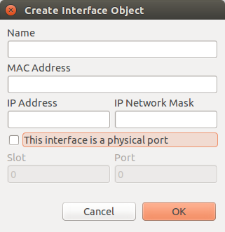

Information about service monitoring and :guilabel:`Create network service...`
menu item can be found there: :ref:`service-monitoring`.

When node is unmanaged/managed - all it's children like interfaces and service
monitoring are also unmanaged/managed. In unmanaged state :term:`metrics
<Metric>` are not collected and no polls are scheduled.

Node can be deleted from |product_name| by :guilabel:`Delete` menu item. Node is
not deleted synchronously, but it is scheduled node deletion. While node
deletion all data bout this node is also collected(like metrics).

If zones are enabled, then zone can be changed using :guilabel:`Change zone...`
item. :guilabel:`File manager` will open agent file manager view. By default
this view will be empty, to configure it refer to :ref:`agent_file_mngmnt`
chapter. :guilabel:`Upload file` can be used to upload file from server to node.
This action can be applied simultaneously to all nodes.

:guilabel:`Take screenshot` for now halfway implemented functionality. For now
screenshot can be taken only from Windows machines.

:guilabel:`Remote control` option will appear for nodes where `VNC <https://en.wikipedia.org/wiki/VNC>`_ 
install is detected. 
In order to take advantage of this feature, one should add EnableTCPProxy = yes in agent configuration
on remote node followed by agent restart. Run Configuration Poll 
on the node you want to VNC to. Target VNC may require loopback connection to be enabled as well as firewall settings adjusted.
In cases when there is no agent installed on remote node, but VNC is present, we can use agent on NetXMS 
server or agent serving as zone proxy. In this scenario, one would need to add EnableTCPProxy = yes in agent configuration on server or
on agent that acts like proxy for zone.
Your NetXMS user should have "Initiate TCP proxy sessions" system access right. In addition, in object tree user should have "Control" access rights to that node. 

Description of :guilabel:`Edit agent's configuration` functionality can be found
in :ref:`edit_agent_configuration_remotely` chapter.

Poll options:

.. list-table::
   :header-rows: 1
   :widths: 25 75

   * - Poll Name
     - Description
   * - Status
     -
   * - Configuration
     -
   * - Configuration (full)
     -
   * - Instance discovery
     -
   * - Instance names
     -
   * - Topology
     -

Under :guilabel:`Tools` menu are available predefined object tools that will be
executed on selected node. More about object tool configuration can be found
there: :ref:`object_tools`.

:guilabel:`Execute server script` will open :ref:`execute server script view
<execute_server_script>`. Were arbitrary script can be executed. Node can be
accessed with ``$node`` variable.

:guilabel:`MIB Explorer` will open :ref:`MIB explorer view<mib_explorer>`. If
geolocation of the node is set, then with help of :guilabel:`Geolocation` item
can be opened map with shown on it object location. :guilabel:`Software
Inventory` will show full software list for nodes with Windows systems or Linux
systems(that used rpm or deb packages) and have |product_name| agent installed.
:guilabel:`Service Dependency` will build tree from this node with all container
where this node is included. :guilabel:`Alarms` will open alarm view with alarms
only for this specific node.

:guilabel:`Find switch port` will open view with log of searches of switch port
to which a node is connected. During search the interfaces will be checked one
by one and first successful result will be shown.

:guilabel:`802.1x port state` will open table with port authentication states,
that can be exported to CSV.

:guilabel:`Topology` menu item contains all options of predefined network maps
for this node and some other options:

:guilabel:`Routing table` :guilabel:`IP route from...` will build network map
with route from selected node to node that was selected in Object selector
window. :guilabel:`IP route to...` will build network map with route to selected
node from node that was selected in Object selector window. :guilabel:`IP
Neighbors` will show all IP neighbors of this node.

:guilabel:`Switch forwarding database(MAC address table)` :guilabel:`VLANs`
:guilabel:`Layer 2 Topology`

:guilabel:`Radio interface` :guilabel:`Wireless stations`

:guilabel:`Last values` will open :ref:`Last Values view<last-values>`.
:guilabel:`Data Collection Configuration` will open :ref:`Data Collection
Configuration view<dci-configuration>`, that is used to configure collected
:term:`metrics <Metric>` from node.

Mobile Device
-------------

Mobile device objects are added manually. More information about required
configuration to monitor mobile devices can be found there:
:ref:`monitoring-mobile-device`.

Property pages:

Mobile Device object has only default property page configuration.

Menu items:

Each phone object can be managed/unmanaged and deleted. In unmanaged state
:term:`metrics <Metric>` of this device are not collected and no pols are
scheduled. When mobile object is deleted all it's data is also deleted. No
history data will be left.

:guilabel:`Execute server script` will open :ref:`execute server script view
<execute_server_script>` where arbitrary script can be executed.
:guilabel:`Geolocation History` will open view were will be shown history of
displacement of this device. From the menu can be selected the period to show on
history map. :guilabel:`Geolocation` will show last known location of this
device. :guilabel:`Alarms` menu item will open view with all subnet nodes'
alarms.

:guilabel:`Last values` will open :ref:`Last Values view<last-values>`.
:guilabel:`Data Collection Configuration` will open :ref:`Data Collection
Configuration view<dci-configuration>`, that is used to configure collected
:term:`metrics <Metric>` from node.

Rack
----

Rack is an object that visualizes server room organization in |product_name|.
Node and chassis objects can be assigned to a rack in node properties,
specifying position in the rack, height (number of occupied rack units),
orientation (does it occupy full depth of the rack, or only present on front or
back side of the rack).  Front and/or rear images can be selected from
:ref:`image-library`.

Rack visualization is available in Object Detail -> Rack view. Left click on a
rack unit display a pop-up with brief information about the node or chassis.
Right click will display node or chassis context menu. Double click on a chassis
will open Chassis View in a separate tab.

Status of rack units is denoted with color rectangle on the left edge of the
rack.

Chassis
-------

Chassis is an object visualizing a rack-mount chassis that have plug-in modules.
Chassis visualization is available in Object Detail -> Chassis view.

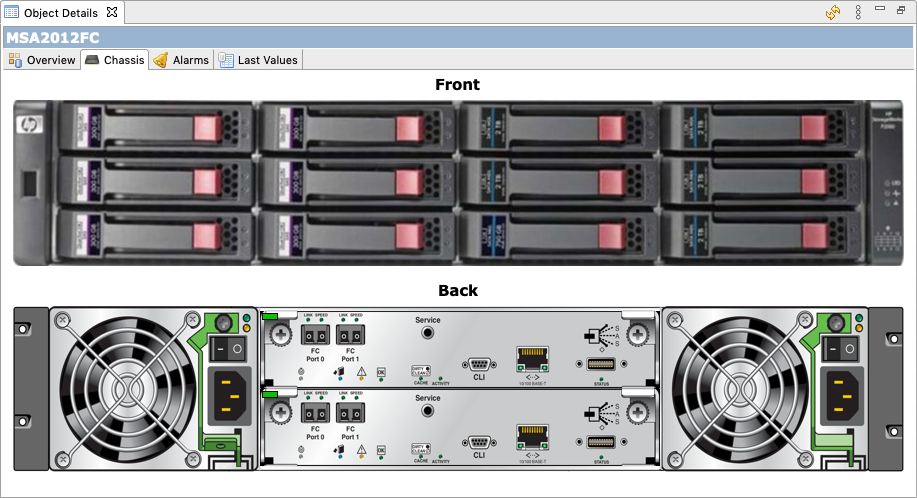

Each node that represents chassis module can have an image that will be
displayed atop of chassis image. Status of each node is denoted with color
rectangle in the upper left corner or it's image. Left click on node will
display a pop-up with brief information about the node. Right click will display
node context menu.

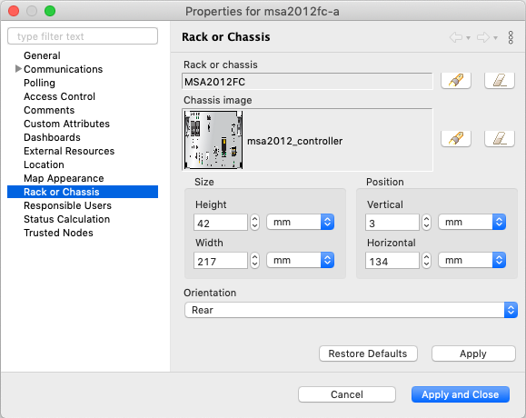

It is possible to configure the size of module's image and it's position on
chassis image. Vertical size and position could be specified in mm or rack units
(RU), while horizontal - in mm or horizontal pitch units (HP). Size calculation
assumes that 1U chassis has 45mm height and 483mm width (including mounting
brackets). Position (0, 0) is in the upper left corner.

You can use a graphic editor, e.g. Gimp to find position values in mm. Open
chassis image in Gimp and set  image width to 483 mm using Image -> Scale image.
Now in the bottom left corner you can see current coordinates of mouse cursor in
mm.

Chassis module images should be uploaded using Image Library
:ref:`image-library`.

Cluster
-------

Is created to display nodes logical organization in cluster. Cluster nodes may
have shared resources and networks, processes may move between nodes, so metric
collection should be organized accordingly. Cluster object provides option to
aggregate collected data from cluster nodes. More about data aggregation can be
found there: :ref:`data-agregation`.

Besides default property pages cluster has also:
 - :guilabel:`Cluster Resources` - there can be configured IP resources of the
   cluster. Further on :guilabel:`Cluster` view of :guilabel:`Object Details`
   will be shown current owner of resources
 - :guilabel:`Cluster Networks`
 - :guilabel:`Poling`
 - :guilabel:`Dashboards` - there dashboard can be associated with object, so on
   right click associated dashboards will be displayed in the list
 - :guilabel:`External Resources`
 - :guilabel:`Location`
 - :guilabel:`Map Appearance`
 - :guilabel:`Trusted Nodes`

Interface
---------

Network Service
---------------

VPN Connector
-------------

Condition
---------

Conditions may represent more complicated status checks because each condition
can have a script attached. Interval for evaluation of condition status is
configured in Server Configuration Variables as ConditionPollingInterval with
default value 60 seconds. Input values for the condition script can be set in
object properties. Such values are accessible via $1, $2, ... variables inside
the script. If the script returns 0, an activation event with the defined
severity is created. If the script returns any other value, then a deactivation
event is created.

Besides default property pages condition has also:
   - :guilabel:`Events and Status`, were can be set activation and deactivation
     events, source of this objects and status of active and inactive condition.
   - :guilabel:`Data`, were can be set DCI's that's data will be given to a
     script for condition status calculation.
   - :guilabel:`Script` tab is used to write script that will calculate if
     condition should be activated or deactivated.
   - :guilabel:`Map Appearance` tab defines images that will be used to display
     this object on a :term:`Network Map` and drill-down object (object that will be
     opened when double click on this object on :term:`Network Map`).
   - :guilabel:`Trusted Nodes` is used to define object list that
      have access to this object from the script.

Menu items:

Condition can be managed/unmanaged. If condition is unmanaged, evaluation of
condition is not run. Condition can be deleted.

Container
---------

Containers can be created in Infrastructure Services tree. Existing nodes and
subnets can be added to containers by using Bind operation, and removed by using
Unbind operation. New nodes, conditions, clusters, containers, mobile devices
and racks can also be created. They can be created using required menu item of
container under which this object should appear. Containers and nodes inside
them can be moved by :guilabel:`Move to another container` menu item or using
drag&drop.

Besides default property pages condition has also:
   - :guilabel:`Automatic bind` about this functionality can be found
     :ref:`there<automatic-bind>`
   - :guilabel:`Location`  is used to configure location of the node
   - :guilabel:`Map Appearance` tab defines images that will be used to display
     this object on a :term:`Network Map` and drill-down object (object that will be
     opened when double
click on this object on :term:`Network Map`).
   - :guilabel:`Trusted Nodes` is used to define object list that
      have access to this object from the script.

Menu items:

There are special menu item for each object that can be created in container.
Objects like rack, container, mobile device, cluster are manually created
objects. Node can be manually created or found by network discovery. In case if
it is required to add already existing object to container use
:guilabel:`Bind...` menu item. To remove node from container, but do not delete
it use :guilabel:`Unbind...` menu item.

Using :guilabel:`Manage`/:guilabel:`Unmanage` all nodes will be
managed/unmanaged under container. Container can be deleted. If deleted
container was the only parent of an object, then this object will be also
deleted. :guilabel:`Upload file...` will upload file from server to all nodes
under container, same as each tool under :guilabel:`Tools` menu item will be
executed on each node.

:guilabel:`Execute server script`   will open :ref:`execute server script view
<execute_server_script>`. Where an arbitrary script can be executed.
:guilabel:`Geolocation` will show location of container on geographic map.

:guilabel:`Alarms` will open alarm view with all active alarms for all children
of this container. :guilabel:`802.1x port state` will open table with port
authentication states of all devices that are under this container. This
information can be exported to CSV.

.. _automatic-bind:

Automatic bind option
~~~~~~~~~~~~~~~~~~~~~

For each container can be configured automatic binding rules. This can be done
in :guilabel:`Automatic Bind Rules` tab of container properties.

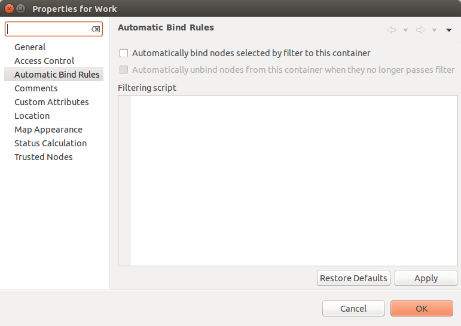

There can be defined if script should be used for automatic binding, if script
should be used for node unbinding and can be written script it selves.

This script will be executed each configuration poll of each node.

Common object properties
========================

General
-------

Each object has :guilabel:`General` tab in properties. There can be checked object
class and ID, and changed object name. Each object has unique ID in the system.
Object can be accessed by this ID.

.. _custom_attributes:

Custom attributes
-----------------

Every object can have custom attributes defined either by user or integrated
application via |product_name| API. Custom attributes distinguished by names (an
attribute name can contain up to 127 printable characters), and have string
values of unlimited length. However, if you wish to access custom attributes in
:term:`NXSL` scripts as properties of node object, you should name them
conforming to NXSL identifier naming constraints. To create or change value of
custom attribute manually, right-click an object in |product_name| client, and
select :menuselection:`Properties --> Custom Attributes tab`.

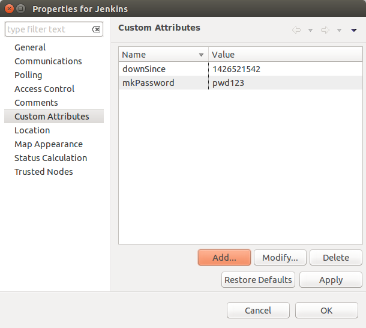

.. _status-calculation:

Status calculation
------------------

Each object has it's own status calculation properties. Status of an object
calculated based on:

   * Polling results
   * Status of child objects (e.g. interfaces of node, nodes under container)
   * Active alarms, associated with the object (after an alarm is resolved or
     terminated, it no longer affects object status)
   * Value of status :term:`DCIs<DCI>` (DCI that has ``Use this DCI for node
     status calculation`` property enabled)

There are multiple options for status calculation that can be configured for
specific objects or globally. 

Status calculation has two configuration parts:

   - status propagation - the way how status from object is pushed to upper
     objects;
   - status calculation - the way how object is calculating it's status based on
     statuses propagated by children objects. Once child object status is
     calculated most critical status is taken from status of underlying objects,
     associated alarms and status :term:`DCIs<DCI>`.

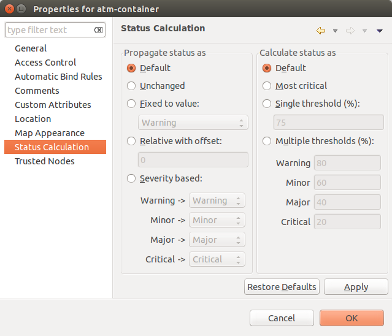

For status propagation the following options are available:
  - Default - will take global configuration parameter (unchanged by default)
  - Unchanged - will propagate status value without changes
  - Fixed value: Normal, Warning, Minor, Major, Fixed - always will return fixed
    selected status
  - Relative with offset - will add or remove some number for
  - Severity based - will convert current status based on user configured status
    mapping table

For status calculation the following options are available:
  - Default - will take global configuration parameter (most critical by
    default)
  - Most critical - Most critical status will be taken
  - Single threshold (%) - Percentage of objects that should be in status to
    change status of object
  - Multiple thresholds - Same as previous but threshold is set for each status

Example of threshold status calculation
~~~~~~~~~~~~~~~~~~~~~~~~~~~~~~~~~~~~~~~

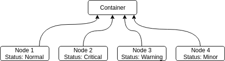

Statuses of nodes in table:

.. list-table::
   :header-rows: 1
   :stub-columns: 1
   :widths: 25 25 25 25 25 25

   * -
     - Normal
     - Warning
     - Minor
     - Major
     - Critical
   * - Node 1
     - 1
     - 0
     - 0
     - 0
     - 0
   * - Node 2
     - 1
     - 1
     - 1
     - 1
     - 1
   * - Node 3
     - 1
     - 1
     - 0
     - 0
     - 0
   * - Node 4
     - 1
     - 1
     - 1
     - 0
     - 0

If "Single threshold (%)" option is selected and configuration is next:
 - 75%

In this case status of container will be Warning, as 3/4 of nodes have Warning
status or worse.

If "Multiple thresholds" is selected and configuration is next:
 - Warning 80
 - Minor 50
 - Major 25
 - Critical 35

In this case status of Container will be Major as bot thresholds for Minor and
Major are reached and most critical from them is taken.

Comments
--------

Each object in :guilabel:`Object Tree` can have comment. Comment can be set in
Properties of the object. It is possible to use :ref:`macros for event
processing<event-processing-macros>` in the comments.

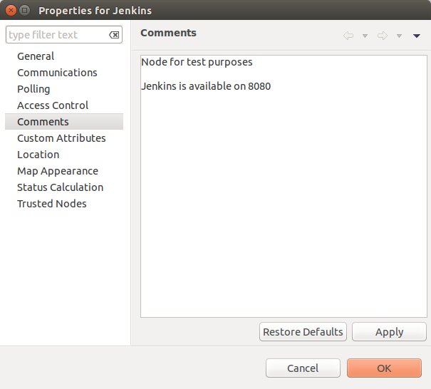

.. _object-access-control:

Access control
--------------

Object access rights controls access to |product_name| objects. Permissions
given to an object inherited by all child objects, unless specifically blocked
by turning off :guilabel:`Inherit access rights from parent object(s)` option in
object's access control properties. Permissions given at different levels of the
object tree summarize to form effective user rights for the object.

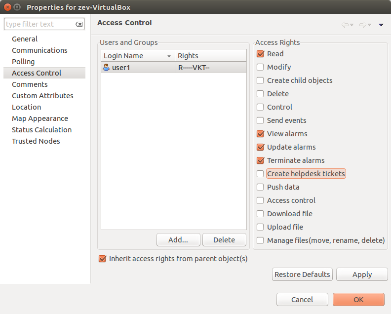

The following object access rights can be granted:

.. list-table::
   :header-rows: 1
   :widths: 25 75

   * - Access Right
     - Description
   * - Read
     - View object in the tree and read it's information. For node objects,
       read access allows to view collected DCI data.
   * - Read agent data
     -
   * - Read SNMP data
     -
   * - Modify
     - Modify object's properties (except access control).
   * - Create child objects
     - Create child objects (or bind existing) under this object.
   * - Delete
     - Delete this object.
   * - Control
     - For node objects, execute object tools of type :guilabel:`Remote
       Command`.
   * - Send events
     - Send events on behalf of this object.
   * - View alarms
     - View alarms with this object as source.
   * - Update alarms
     - Add comments to alarms, acknowledge alarms with this object as source.
   * - Terminate alarms
     - Terminate alarms with this object as source.
   * - Create helpdesk tickets
     - Create ticket in external helpdesk system
   * - Push data
     - Push data for DCIs on this object.
   * - Access control
     - Modify access control list for this object. Please note that user with
       this access right can grant any other access rights to own account.
   * - Download files
     - Allow user to download files from this node (from paths defined by
       filemngr subagent settings in agent configuration file). This access
       right is also checked when downloading or tail of file is done from
       object tools.
   * - Upload files
     - Allow user to upload files to this node (to paths defined by filemngr
       subagent settings in agent configuration file). 
   * - Manage files
     - Allow user to move, rename, delete files on this node (in paths defined
       by filemngr subagent settings in agent configuration file).
   * - Control maintenance mode
     - 
   * - Take screenshot
     - Allow user to take screenshot of this node's screen (Windows only). 

Object Details
==============

Object details view provides main information about object. Each object has
:guilabel:`Overview` tab that displays general information about object
(like: ID, GUID, Class, and status of the object) and :guilabel:`Comments`.

Subnet
------

.. _object_tools:

Object Tools
============

It is possible to create tools for execution on objects or alarms. Configured
object tools are available under :guilabel:`Tools` in object browser's context
menu or context menu of an alarm. A tool can ran a command on |product_name|
server or node, obtain data from SNMP or |product_name| agent, etc...

Object tools can be executed on Containers in object browser - depending on
configuration of specific object tool it will be executed in context of that
container or will be executed for all objects under that container. 

Tools can be managed in :menuselection:`Configuration --> Object Tools`. There
are some :ref:`predefined object tools<object_tools_predefined>` that are
available after installation of the system.

If an object tool is not needed for some time it can be just disabled and then
enabled when required. When object tool is disabled it is not shown under
"Tools" item of context menu. If an image (16x16 px) is configured for an object
tool, it will be displayed next to object tool name in "Tools" menu.

Tool can have :ref:`input fields<object_tools_input_fields>`, :ref:`filter
depending on execution object<object_tools_filter>`, :ref:`macro
substitution<object_tools_macro>` and :ref:`personal access control
configuration<object_tools_access_control>`.

Object tool types
-----------------

Internal
~~~~~~~~

The only operation available for now is ``wakeup`` that sends magic packet to
wake up a node.

.. _object_tool-agent-command:

Agent Command
~~~~~~~~~~~~~

This tool will execute command on an agent node and will show it's output if
:guilabel:`Command generates output` option is enabled.

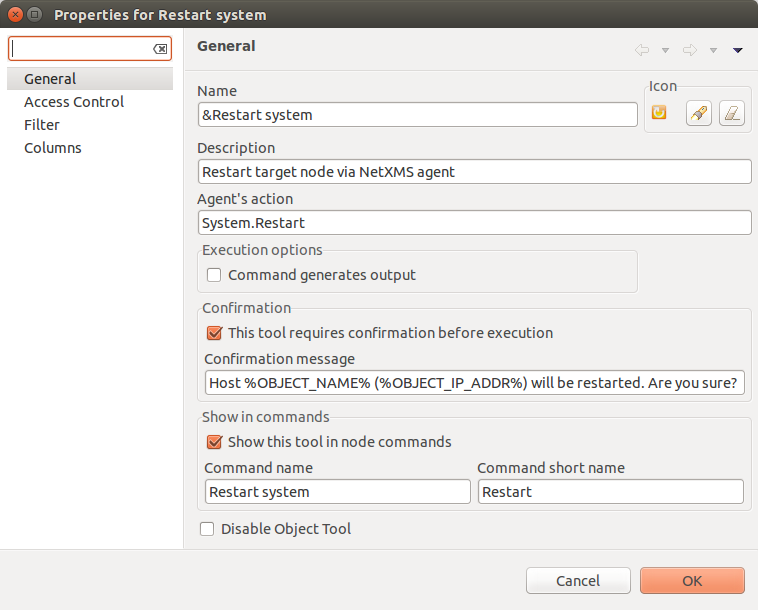

.. list-table::
   :widths: 30 70
   :header-rows: 1

   * - Field name
     - Description
   * - Name
     - Name that will be shown in node menu. Submenu can be created with "->"
       notation.
   * - Description
     - Description is shown in "Object Tools" view. Should be used to describe
       tool purpose.
   * - Command
     - Name of agent command that will be executed. There is a number of
       commands built into agent and additional commands can be added by
       defining them in agent's config. If command accepts parameters they are
       supplied it the following format: ``commandName param1 param2 param3...``
   * - Command generates output
     - If this option is selected then command execution will open a window with
       it's output.
   * - This tool requires confirmation before execution
     - If chosen a Yes/No pop-up with text from "Confirmation message" field
       will be shown before execution of tool.
   * - Confirmation message
     - Contains message that will be shown in confirmation pop-up.
   * - Show this tool in node commands
     - If this option is selected, then this tool will be shown for applicable
       nodes on :guilabel:`Object Details` view as node command.
   * - Command name
     - Name of the command
   * - Command short name
     - Is used when :guilabel:`Command name` is too long for display.
   * - Disable Object Tool
     - If chosen, tool is not shown in Object browser's context menu and
       Commands in Object Details.

SNMP Table
~~~~~~~~~~

:guilabel:`SNMP Table` is used to get SNMP table from node on which it is
executed and then show results in the table form.

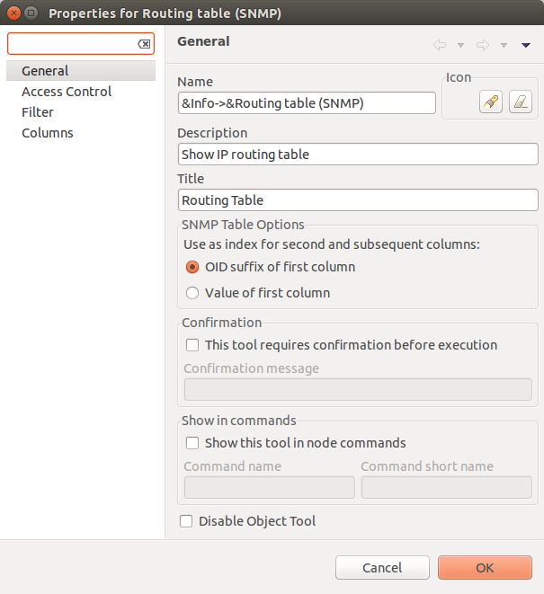

.. list-table::
   :widths: 30 70
   :header-rows: 1

   * - Field name
     - Description
   * - Name
     - Name that will be shown in node menu. Submenu can be created with "->"
       notation.
   * - Description
     - Description is shown in "Object Tools" view. Should be used to describe
       tool purpose.
   * - Title
     - Title of view where table will be shown.
   * - Use as index for second and subsequent columns OID suffix of first column
     - This option defines that suffix of columns OID will be used as suffix for
       columns OID's to match lines
   * - Use as index for second and subsequent columns Value of first column
     - This option defines that value of columns OID will be used as suffix for
       columns OID's to match lines
   * - This tool requires confirmation before execution
     - If chosen, before execution of tool will be shown Yes/No pop-up with text
       from "Confirmation message" field.
   * - Confirmation message
     - Can be set the message that will be shown in confirmation pop-up.
   * - Show this tool in node commands
     - If this option is selected, then this tool will be shown for applicable
       nodes on :guilabel:`Object Details` view as node command.
   * - Command name
     - This will be shown as a name of the command.
   * - Command short name
     - Is used when usual name is too long for display.
   * - Disable Object Tool
     - If chosen, tool is not shown in node menu.

Agent List
~~~~~~~~~~~

:guilabel:`Agent List` is used to get agent list from node on which it is
executed and then show results in the table form. Regular expression is used to
split received data to columns.

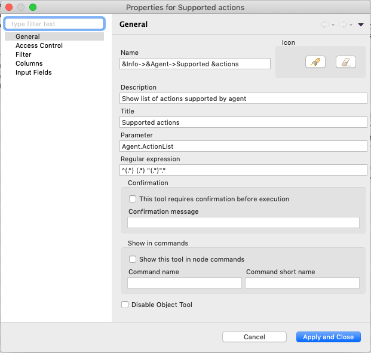

.. list-table::
   :widths: 30 70
   :header-rows: 1

   * - Field name
     - Description
   * - Name
     - Name that will be shown in node menu. Submenu can be created with "->"
       notation.
   * - Description
     - Description is shown in "Object Tools" view. Should be used to describe
       tool's purpose.
   * - Title
     - Title of view where table will be shown.
   * - Parameter
     - Name of list
   * - Regular expression
     - Regular expression that will parse each line of list to separate it on
       columns defined in :guilabel:`Columns` tab.
   * - This tool requires confirmation before execution
     - If chosen, before execution of tool will be shown Yes/No pop-up with text
       from "Confirmation message" field.
   * - Confirmation message
     - Can be set the message that will be shown in confirmation pop-up.
   * - Show this tool in node commands
     - If this option is selected, then this tool will be shown for applicable
       nodes on :guilabel:`Object Details` view as node command.
   * - Command name
     - This will be shown as a name of the command.
   * - Command short name
     - Is used when usual name is too long for display.
   * - Disable Object Tool
     - If chosen, tool is not shown in node menu.

Agent Table
~~~~~~~~~~~

:guilabel:`Agent Table` is used to get agent table from node on which it is
executed and then show results in the table form.

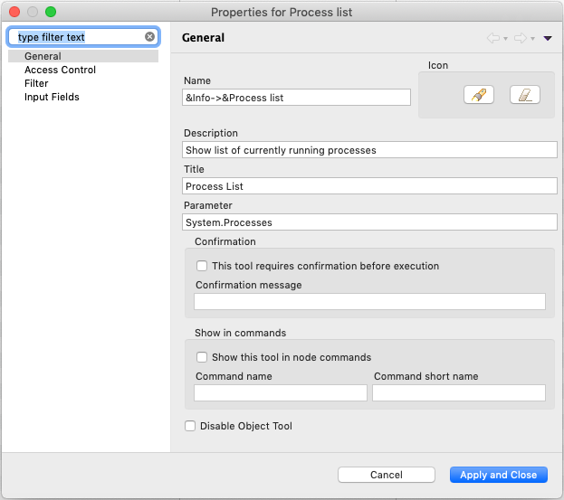

.. list-table::
   :widths: 30 70
   :header-rows: 1

   * - Field name
     - Description
   * - Name
     - Name that will be shown in node menu. Submenu can be created with "->"
       notation.
   * - Description
     - Description is shown in "Object Tools" view. Should be used to describe
       tool purpose.
   * - Title
     - Title of view where table will be shown.
   * - Parameter
     - Name of list
   * - This tool requires confirmation before execution
     - If chosen, before execution of tool will be shown Yes/No pop-up with text
       from "Confirmation message" field.
   * - Confirmation message
     - Can be set the message that will be shown in confirmation pop-up.
   * - Show this tool in node commands
     - If this option is selected, then this tool will be shown for applicable
       nodes on :guilabel:`Object Details` view as node command.
   * - Command name
     - This will be shown as a name of the command.
   * - Command short name
     - Is used when usual name is too long for display.
   * - Disable Object Tool
     - If chosen, tool is not shown in node menu.

URL
~~~

:guilabel:`URL` tool opens URL in web browser.

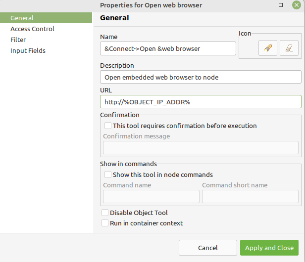

.. list-table::
   :widths: 30 70
   :header-rows: 1

   * - Field name
     - Description
   * - Name
     - Name that will be shown in node menu. Submenu can be created with "->"
       notation.
   * - Description
     - Description is shown in "Object Tools" view. Should be used to describe
       tool purpose.
   * - URL
     - URL that should be passed to browser to be opened.
   * - TCP tunnel
     - If enabled, on object tool execution management client will open a local
       port and establish tunnel via the server and via a proxy agent. Proxy
       should have ``EnableTCPProxy=yes`` in it's configuration file. The
       following macros can be used in URL field: 

       - ``${local-address}`` - local IP address
       - ``${local-port}`` - local port number

   * - This tool requires confirmation before execution
     - If chosen, before execution of tool will be shown Yes/No pop-up with text
       from "Confirmation message" field.
   * - Confirmation message
     - Can be set the message that will be shown in confirmation pop-up.
   * - Show this tool in node commands
     - If this option is selected, then this tool will be shown for applicable
       nodes on :guilabel:`Object Details` view as node command.
   * - Command name
     - This will be shown as a name of the command.
   * - Command short name
     - Is used when usual name is too long for display.
   * - Disable Object Tool
     - If chosen, tool is not shown in node menu.
   * - Run in container context
     - If this option is selected, then tool will run only for selected
       container, not affecting children nodes.

Local Command
~~~~~~~~~~~~~

:guilabel:`Local Command` tool will execute command on the node, where
Desktop Management Client is running and will show it's output if
:guilabel:`Command generates output` option is enabled.

This tool type is not visible from Web Client as it is not possible
to execute command on web page receiver's machine.

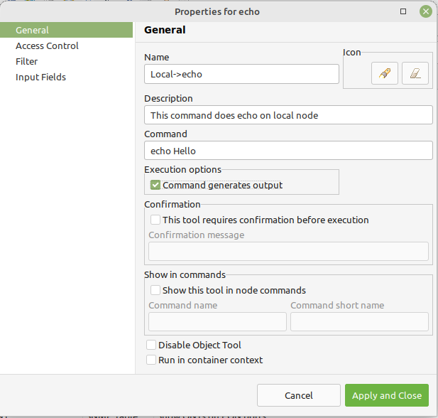

.. list-table::
   :widths: 30 70
   :header-rows: 1

   * - Field name
     - Description
   * - Name
     - Name that will be shown in node menu. Submenu can be created with "->"
       notation.
   * - Description
     - Description is shown in "Object Tools" view. Should be used to describe
       tool purpose.
   * - Command
     - Command that should be executed on a local machine
   * - TCP tunnel
     - If enabled, on object tool execution management client will open a local
       port and establish tunnel via the server and via a proxy agent. Proxy
       should have ``EnableTCPProxy=yes`` in it's configuration file. The
       following macros can be used in command field: 

       - ``${local-address}`` - local IP address
       - ``${local-port}`` - local port number

   * - Command generated output
     - If this option is selected, then command execution will open a window
       with output of the command.
   * - This tool requires confirmation before execution
     - If chosen, before execution of tool will be shown Yes/No pop-up with text
       from "Confirmation message" field.
   * - Confirmation message
     - Can be set the message that will be shown in confirmation pop-up.
   * - Show this tool in node commands
     - If this option is selected, then this tool will be shown for applicable
       nodes on :guilabel:`Object Details` view as node command.
   * - Command name
     - This will be shown as a name of the command.
   * - Command short name
     - Is used when usual name is too long for display.
   * - Disable Object Tool
     - If chosen, tool is not shown in node menu.
   * - Run in container context
     - If this option is selected, then tool will run only for selected
       container, not affecting children nodes.

Server Command
~~~~~~~~~~~~~~

:guilabel:`Server command` tool can be used to execute command on the server.

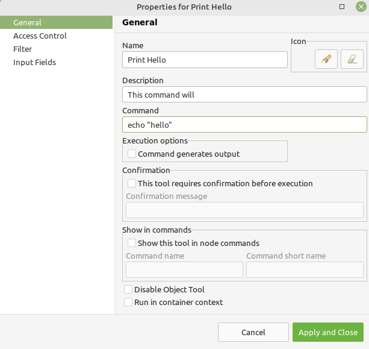

.. list-table::
   :widths: 30 70
   :header-rows: 1

   * - Field name
     - Description
   * - Name
     - Name that will be shown in node menu. Submenu can be created with "->"
       notation.
   * - Description
     - Description is shown in "Object Tools" view. Should be used to describe
       tool purpose.
   * - Command
     - Command that should be executed on a server
   * - Command generated output
     - If this option is selected, then command execution will open a window
       with output of the command.
   * - This tool requires confirmation before execution
     - If chosen, before execution of tool will be shown Yes/No pop-up with text
       from "Confirmation message" field.
   * - Confirmation message
     - Can be set the message that will be shown in confirmation pop-up.
   * - Show this tool in node commands
     - If this option is selected, then this tool will be shown for applicable
       nodes on :guilabel:`Object Details` view as node command.
   * - Command name
     - This will be shown as a name of the command.
   * - Command short name
     - Is used when usual name is too long for display.
   * - Disable Object Tool
     - If chosen, tool is not shown in node menu.
   * - Run in container context
     - If this option is selected, then tool will run only for selected
       container, not affecting children nodes.

Download File
~~~~~~~~~~~~~

:guilabel:`Download file` tool can be used to monitor agent logs. This tool will
retrieve the content of the file from agent.

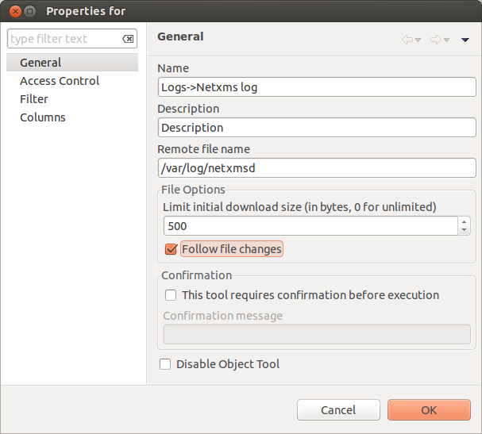

.. list-table::
   :widths: 30 70
   :header-rows: 1

   * - Field name
     - Description
   * - Name
     - Name that will be shown in node menu. Submenu can be created with "->"
       notation.
   * - Description
     - Description is shown in "Object Tools" view. Should be used to describe
       tool purpose.
   * - Remote File Name
     - Name of file that will be retrieved. In Windows systems should be with
       double back slash as a separator(C:\\\\log\\\\log.log). Can be used
       `strftime(3C) <http://www.unix.com/man-page/opensolaris/3c/strftime/>`_
       macros
   * - Limit initial download size
     - Limits the size of download file. If is set to 500, tool will retrieve
       last 500 bytes of requested file. If is set to 0, complete file will be
       retrieved.
   * - Follow file changes
     - If chosen, "File View" will be updated when file will be populated with
       new data.
   * - This tool requires confirmation before execution
     - If chosen, before execution of tool will be shown Yes/No pop-up with text
       from "Confirmation message" field.
   * - Confirmation message
     - Can be set the message that will be shown in confirmation pop-up.
   * - Show this tool in node commands
     - If this option is selected, then this tool will be shown for applicable
       nodes on :guilabel:`Object Details` view as node command.
   * - Command name
     - This will be shown as a name of the command.
   * - Command short name
     - Is used when usual name is too long for display.
   * - Disable Object Tool
     - If chosen, tool is not shown in node menu.

Server Script
~~~~~~~~~~~~~

:guilabel:`Server Script` tool can be used to execute NXSL script from
:guilabel:`Script Library`. This tool provide full range of capabilities that
are available thought NXSL scripting.

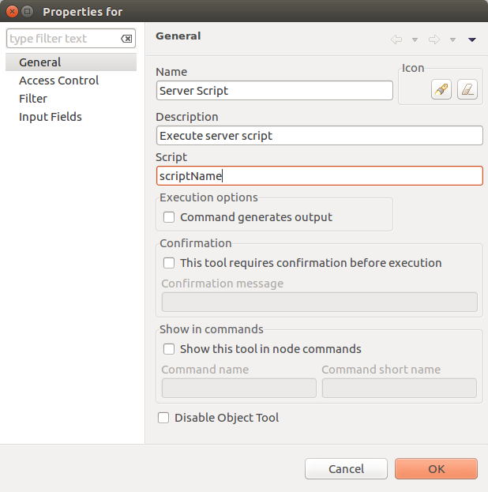

.. list-table::
   :widths: 30 70
   :header-rows: 1

   * - Field name
     - Description
   * - Name
     - Name that will be shown in node menu. Submenu can be created with "->"
       notation.
   * - Description
     - Description is shown in "Object Tools" view. Should be used to describe
       tool purpose.
   * - Script
     - Name of the script from the :guilabel:`Script Library`
   * - Command generates output
     - If chosen, new window with script execution result will be opened.
   * - This tool requires confirmation before execution
     - If chosen, before execution of tool will be shown Yes/No pop-up with text
       from "Confirmation message" field.
   * - Confirmation message
     - Can be set the message that will be shown in confirmation pop-up.
   * - Show this tool in node commands
     - If this option is selected, then this tool will be shown for applicable
       nodes on :guilabel:`Object Details` view as node command.
   * - Command name
     - This will be shown as a name of the command.
   * - Command short name
     - Is used when usual name is too long for display.
   * - Disable Object Tool
     - If chosen, tool is not shown in node menu.
   * - Run in container context
     - If this option is selected, then tool will run only for selected
       container, not affecting children nodes.

Properties
----------

.. _object_tools_filter:

Filter
~~~~~~

Filters are used to chose on which nodes to show object tool.
There are 5 types of filtering. Show object tool:

  1. if agent available on a node
  2. if node supports SNMP
  3. if node SNMP OID matches with provided string
  4. if nodes OS matches provided comma separated regular expression list
  5. if provided :term:`template <Template>` name matches provided comma
     separated regular expression list

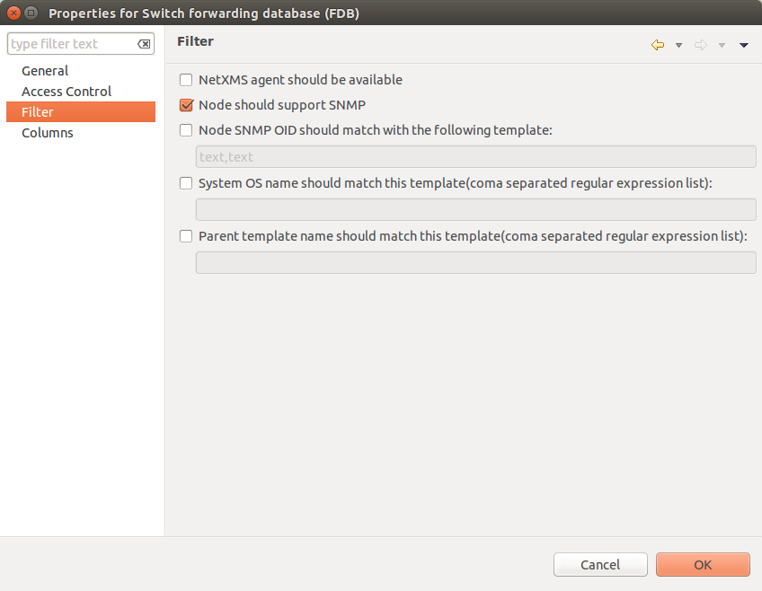

.. _object_tools_access_control:

Access Control
~~~~~~~~~~~~~~

In :guilabel:`Access Control` tab can be defined which users or groups can
execute this action. If the list is empty, only administrator will be able
to execute this action.

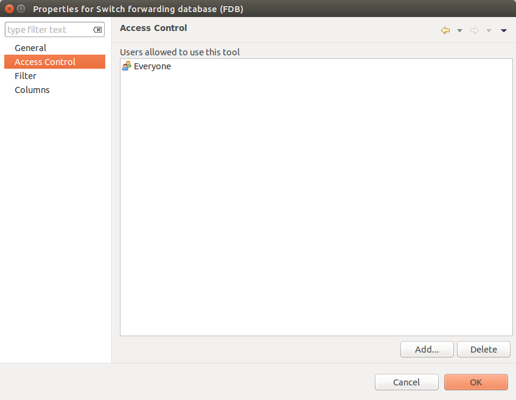

Columns
~~~~~~~

:guilabel:`Columns` tab is used only for :guilabel:`Agent List` and
:guilabel:`SNMP Table` object tool types.

For :guilabel:`SNMP Table` it describes name and type of matching OID from
response message.

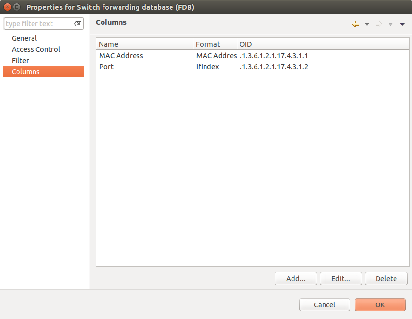

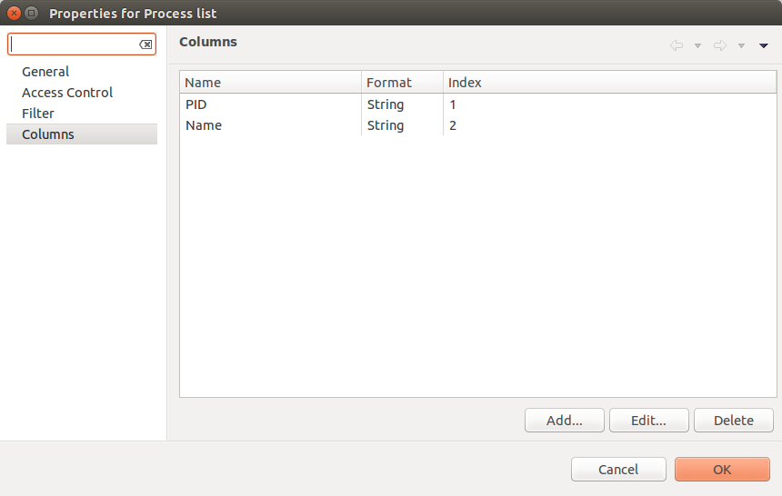

.. _object_tools_input_fields:

Input fields
~~~~~~~~~~~~

There is option to add input fields for object tool commands. This fields are
defined on the :guilabel:`Input fields` view and added to command in ``%(name)``
format. More about formats can be found in :ref:`object_tools_macro` chapter.

Input field can be one of this types:

    - Text
    - Password
    - Number

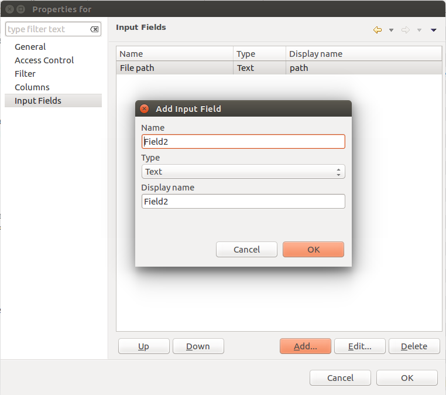

.. _object_tools_macro:

Macro Substitution
------------------

Action, file download, local command, and URL tool types allows macro
substitution. Any string starting with percent sign considered macro name and is
expanded. The following macros are recognized:

.. list-table::
   :widths: 25 75
   :header-rows: 1

   * - Macro
     - Description
   * - ``%a``
     - IP address of event source object.
   * - ``%g``
     - Globally unique identifier (GUID) of event source object.
   * - ``%i``
     - Unique ID of event source object in hexadecimal form. Always prefixed
       with 0x and contains exactly 8 digits (for example 0x000029AC).
   * - ``%I``
     - Unique ID of event source object in decimal form.
   * - ``%n``
     - Name of event source object.
   * - ``%u``
     - IP address of event source object for use in URL. Expands into ``[addr]`` for
       IPv6 and ``addr`` for IPv4.
   * - ``%U``
     - User name of user that launched the object tool from user interface
   * - ``%v``
     - |product_name| server's version.
   * - ``%[name]``
     - Value returned by script. You should specify name of the script from
       script library. It's possible to specify script entry point separating it
       by ``/``, e.g. to call a function named ``calculate``:
       ``%[name/calculate]``. Script parameters can be specified in brackets,
       e.g.: ``%[name(123,"A textual parameter")]``
   * - ``%{name}``
     - Value of custom attribute.
   * - ``%{name:default_value}``
     - Value of custom attribute. If such custom attribute does not exists on a
       particular node, default_value is taken. If custom attribute exists, but
       has empty value, this empty value is taken.
   * - ``%(name)``
     - Value of input field.
   * - ``%<name>``
     - Parameter with given name.
   * - ``${local-address}``
     - Local IP address for TCP tunnel 
   * - ``${local-port}``
     - local port number for TCP tunnel
   * - ``%%``
     - Insert ``%`` character.

If object tool called from alarm's pop-up menu the following additional macros
are available:

.. list-table::
   :widths: 25 75
   :header-rows: 1

   * - Macro
     - Description
   * - ``%A``
     - Alarm's text (can be used only in actions to put text of alarm from the
       same event processing policy rule).
   * - ``%c``
     - Event's code.
   * - ``%m``
     - Event's message text (meaningless in event template).
   * - ``%N``
     - Event's name.
   * - ``%s``
     - Event's severity code as number. Possible values are:
         - 0 - :guilabel:`Normal`
         - 1 - :guilabel:`Warning`
         - 2 - :guilabel:`Minor`
         - 3 - :guilabel:`Major`
         - 4 - :guilabel:`Critical`
   * - ``%S``
     - Event's severity code as text.
   * - ``%y``
     - Alarm state as number. Possible values are:
         - 0 - :guilabel:`Outstanding`
         - 1 - :guilabel:`Acknowledged`
         - 2 - :guilabel:`Resolved`
         - 3 - :guilabel:`Terminated`
   * - ``%Y``
     - Alarm's id.

:guilabel:`Internal object tool` is special case of object tools.
Macro expansions not performed for :guilabel:`Internal object tools`.

For any unknown macro name system will try to read custom attribute
with given name (attribute search is case sensitive). If attribute
with given name not found, empty string will be inserted.

.. _object_tools_predefined:

Predefined Object Tools
-----------------------

|product_name| is delivered with a number of predefined Object Tools. Here is
the list of them:

.. list-table::
   :widths: 35 25 70 30
   :header-rows: 1

   * - Name
     - Type
     - Description
     - Filter
   * - :menuselection:`&Connect-->Open &web browser`
     - URL
     - Open embedded web browser to node
     -
   * - :menuselection:`&Connect->Open &web browser (HTTPS)`
     - URL
     - Open embedded web browser to node using HTTPS
     -
   * - :menuselection:`&Info->&Agent->&Loaded subagents`
     - Agent Table
     - Show information about loaded subagents
     - |product_name| agent should be available
   * - :menuselection:`&Info->&Agent->Configured &ICMP targets`
     - Agent Table
     - Show information about ICMP targets configured on this agent
     - |product_name| agent and ping subagent should be available
   * - :menuselection:`&Info->&Agent->Supported &actions`
     - Agent List
     - Show information about actions supported by agent
     - |product_name| agent should be available
   * - :menuselection:`&Info->&Agent->Supported &lists`
     - Agent List
     - Show list of lists supported by agent
     - |product_name| agent should be available
   * - :menuselection:`&Info->&Agent->Supported &metrics`
     - Agent List
     - Show list of metrics supported by agent
     - |product_name| agent should be available
   * - :menuselection:`&Info->&Agent->Supported &tables`
     - Agent List
     - Show list of tables supported by agent
     - |product_name| agent should be available
   * - :menuselection:`&Info->&Current processes`
     - Agent Table
     - Show information about currently running processes
     - |product_name| agent should be available
   * - :menuselection:`&Info->&Routing table (SNMP)`
     - SNMP Table
     - Show IP routing table
     - |product_name| should support SNMP
   * - :menuselection:`&Info->&Switch forwarding database (FDB)`
     - SNMP Table
     - Show switch forwarding database
     - |product_name| should support SNMP
   * - :menuselection:`&Info->Active &user sessions`
     - Agent List
     - Show information about active user sessions
     - |product_name| agent should be available
   * - :menuselection:`&Info->AR&P cache (Agent)`
     - Agent List
     - Show ARP cache
     - |product_name| agent should be available
   * - :menuselection:`&Info->Topology table (CDP)`
     - SNMP Table
     - Show topology table (CDP)
     - |product_name| should support SNMP
   * - :menuselection:`&Info->Topology table (LLDP)`
     - SNMP Table
     - Show topology table (LLDP)
     - |product_name| should support SNMP
   * - :menuselection:`&Info->Topology table (Nortel)`
     - SNMP Table
     - Show topology table (Nortel protocol)
     - |product_name| should support SNMP
   * - :menuselection:`&Restart system`
     - Action
     - Restart target node via |product_name| agent
     - |product_name| agent should be available
   * - :menuselection:`&Shutdown system`
     - Action
     - Shutdown target node via |product_name| agent
     - |product_name| agent should be available
   * - :menuselection:`&Wakeup node`
     - Internal
     - Wakeup node using Wake-On-LAN magic packet
     -
   * - :menuselection:`Restart &agent`
     - Action
     - Restart |product_name| agent on target node
     - |product_name| agent should be available
