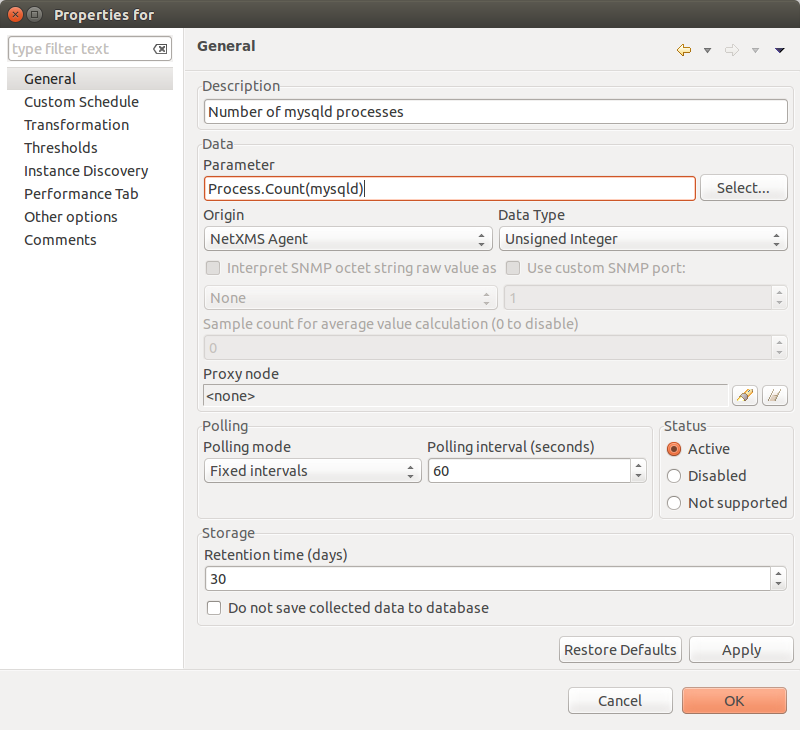
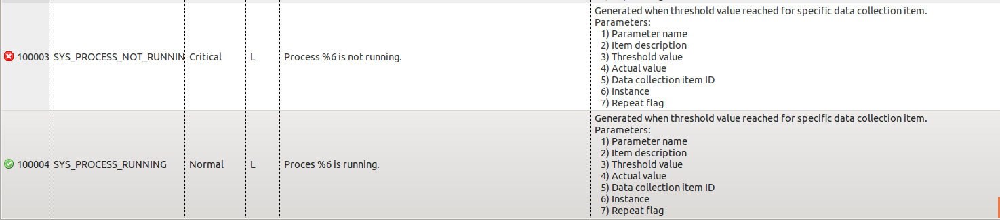
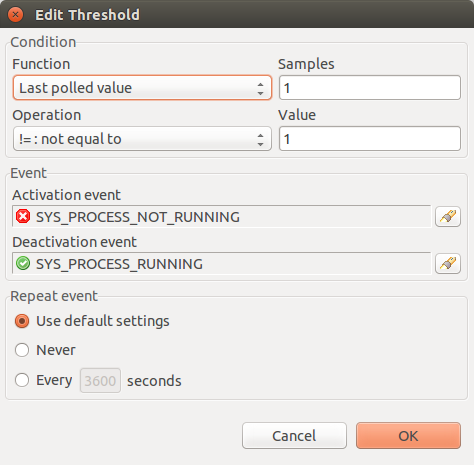
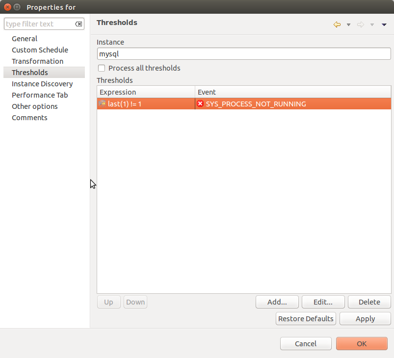
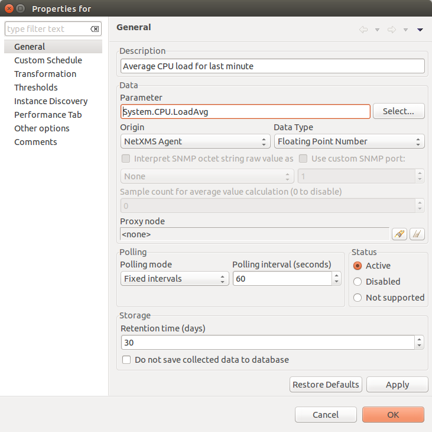
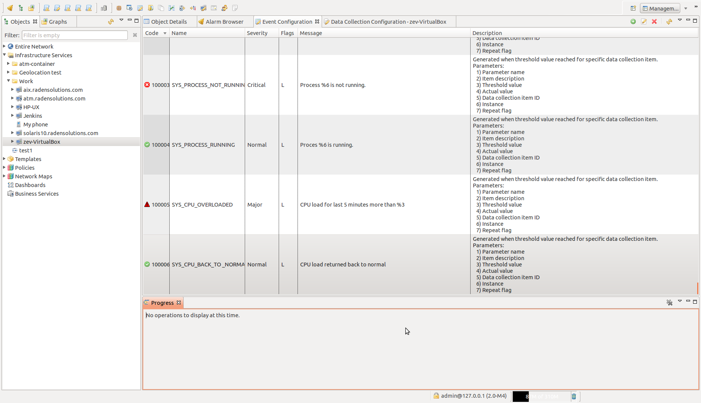
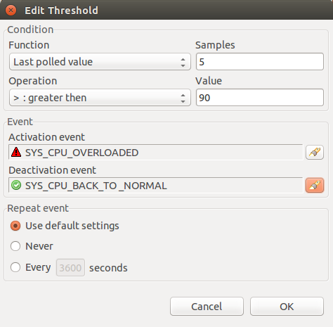
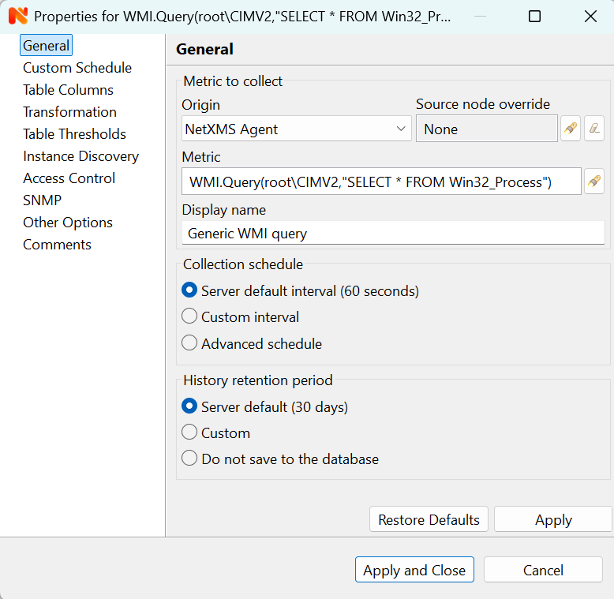
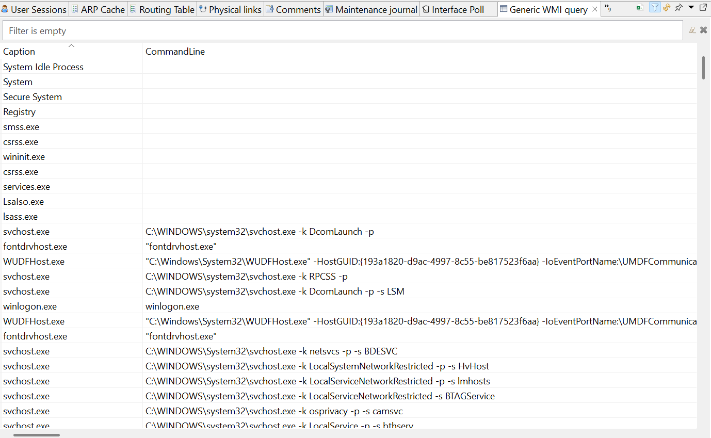

.. _operating-system-monitoring:

===========================
Operating System Monitoring
===========================

Most OS-related metrics (file system, CPU, network) are provided by
"platform subagent", which is loaded automatically by the agent on the startup.

List of available subagents:

  * linux
  * aix
  * hpux
  * winnt (all Windows flavors)
  * sunos (Solaris)
  * darwin (MacOS)
  * freebsd
  * netbsd
  * openbsd

In this section we cover only most common metrics.
:ref:`Detailed list <list-of-supported-metrics>` available bellow.

Example
=======

In examples will be shown only DCI configuration with threshold. Generated event
processing options can be found in :ref:`event-processing` chapter.

Process monitoring
------------------

In this example monitoring of running "mysqld" process will be configured and one
threshold will be added: when process count is less then 1 (process is not running).

Create DCI for Process.Count(*) metric to monitor "mysqld" process count.

Create threshold. It will be triggered when process count is not equal to 1(process is
not running). As prerequisite it was created 2 events.

  Events

  Threshold 1

As in message of error is used Instance parameter, it should be set in
:guilabel:`Threshold` window.

Disk free space monitoring
--------------------------

In this example monitoring of free space in percents for / disk will be configured and
two thresholds will be added: when disk space less then 15% and less then 7%.

Create DCI for FileSystem.FreePerc(*) metric to monitor space on /.

.. figure:: _images/os-metric-disk-free-space-example.png

Create 2 thresholds. One will be triggered when free space is less than 15% and other
one when free space is less than 7%. Before threshold creation was created 3 events:

.. figure:: _images/os-metric-disk-free-space-example2.png

  Events

.. figure:: _images/os-metric-disk-free-space-example3.png

  Threshold 1

.. figure:: _images/os-metric-disk-free-space-example4.png

  Threshold 2

As in message of error is used Instance parameter, it should be set in
:guilabel:`Threshold` window.

.. figure:: _images/os-metric-disk-free-space-example5.png

  Both

CPU usage
---------

This example will show how to configure monitoring of CPU usage and create event when
CPU usage is more than 90% for more than 5 minutes.

Create DCI for System.CPU.LoadAvg metric.

Create threshold that will create event in case if last 5 values are more than 90
(last 5 minutes CPU usage is more than 90%).

  Events

  Threshold

.. _WMI-subagent:

WMI
---

`Windows Management Instrumentation <https://en.wikipedia.org/wiki/Windows_Management_Instrumentation>`_ 
subagent provides interface to Windows Driver Model and thus enables information and notification gathering and further manipulation for monitoring purpose.  

Configuration example:

.. code-block:: ini

   MasterServers = netxms.demo
   SubAgent=wmi.nsm

Provides access to WMI data via WMI class queries. In below example, DCI :guilabel:`New table ...` is created 
with NetXMS Agent as Origin and WMI query as Metric

Following parameters are available for this subagent:

.. list-table::
   :widths: 60 100
   :header-rows: 1
   :class: longtable

   * - Parameter
     - Description

    
   * - ACPI.ThermalZone.CurrentTemp
     - Current temperature in ACPI thermal zone. 
    
   * - ACPI.ThermalZone.CurrentTemp(*)
     - Current temperature in ACPI thermal zone {instance}. Argument is thermal zone name, one of those returned by list ACPI.ThermalZones (actually InstanceName from WMI class MSAcpi_ThermalZoneTemperature).

   * - Hardware.NetworkAdapter.Availability(*)
     - Availability. Argument is physical network adapter index, one of those returned by list Hardware.NetworkAdapters or column "INDEX" in table Hardware.NetworkAdapters.

   * - Hardware.NetworkAdapter.Description(*)
     - Description. Argument is physical network adapter index, one of those returned by list Hardware.NetworkAdapters or column "INDEX" in table Hardware.NetworkAdapters.

   * - Hardware.NetworkAdapter.InterfaceIndex(*)
     - InterfaceIndex. Argument is physical network adapter index, one of those returned by list Hardware.NetworkAdapters or column "INDEX" in table Hardware.NetworkAdapters.
    
   * - Hardware.NetworkAdapter.MACAddress(*)
     - MACAddress. Argument is physical network adapter index, one of those returned by list Hardware.NetworkAdapters or column "INDEX" in table Hardware.NetworkAdapters.

   * - Hardware.NetworkAdapter.Manufacturer(*)
     - Manufacturer. Argument is physical network adapter index, one of those returned by list Hardware.NetworkAdapters or column "INDEX" in table Hardware.NetworkAdapters.

   * - Hardware.NetworkAdapter.Product(*)
     - ProductName. Argument is physical network adapter index, one of those returned by list Hardware.NetworkAdapters or column "INDEX" in table Hardware.NetworkAdapters.
   
   * - Hardware.NetworkAdapter.Speed(*)
     - Speed. Argument is physical network adapter index, one of those returned by list Hardware.NetworkAdapters or column "INDEX" in table Hardware.NetworkAdapters.
    
   * - Hardware.NetworkAdapter.Type(*)
     - AdapterType. Argument is physical network adapter index, one of those returned by list Hardware.NetworkAdapters or column "INDEX" in table Hardware.NetworkAdapters.

   * - System.AntiSpywareProduct.Active
     - Anti-spyware product active.

   * - System.AntiSpywareProduct.DisplayName
     - Anti-spyware product display name.

   * - System.AntiSpywareProduct.UpToDate
     - Anti-spyware product up to date. 
    
   * - System.AntiVirusProduct.Active
     - Anti-virus product active.

   * - System.AntiVirusProduct.DisplayName
     - Anti-virus product display name. 

   * - System.AntiVirusProduct.UpToDate
     - Anti-virus product up to date.

   * - System.FirewallProduct.Active
     - Firewall active. 
    
   * - System.FirewallProduct.DisplayName
     - Firewall product display name.

   * - System.FirewallProduct.UpToDate
     - Firewall product up to date. 

   * - WMI.Query(*)
     - Generic WMI query. Arguments are namespace, query, property. 
       
       For example:
       
       WMI.Query(root\\cimv2, SELECT * FROM Win32_Process WHERE ProcessId=252, Caption)

Following lists are available for this subagent:

- ACPI.ThermalZones
- Hardware.NetworkAdapters
- WMI.Classes(*), argument is WMI namespace (for example root\\cimv2). List of available namespaces can also be retrieved using agent list WMI.NameSpaces (output will not contain "root\")
- WMI.NameSpaces
- WMI.Query(*), arguments are namespace, query, property (for example: WMI.Query(root\\cimv2, SELECT * FROM Win32_Process, Caption) - will return all process names)

Following tables are available for this subagent:

- Hardware.NetworkAdapters
- WMI.Query(*), arguments are namespace and query and it will return query output with column for each attribute (for example: WMI.Query(root\cimv2, SELECT * FROM Win32_Process) - all processes in the system)

Some of the most commonly used WMI classes are listed below:

Static

* Computer System - Win32_ComputerSystem
* Operating System - Win32_OperatingSystem
* Processor Info - Win32_Processor
* HDD - Win32_DiskDrive
* Disk Partitions - Win32_DiskPartition
* Logical Disks - Win32_LogicalDisk
* Logical Disk to Partition - Win32_LogicalDiskToPartition
* Memory - Win32_PhysicalMemory, Win32_PhysicalMemoryArray
* Network - Win32_NetworkAdapter , Win32_NetworkAdapterConfiguration

Performance Counters

* Processor Utilization - Win32_PerfRawData_PerfOS_Processor
* Memory Utilization - Win32_PerfRawData_PerfOS_Memory
* Network Utilization - Win32_PerfRawData_Tcpip_NetworkInterface

The result is a table with approprite WMI data.

