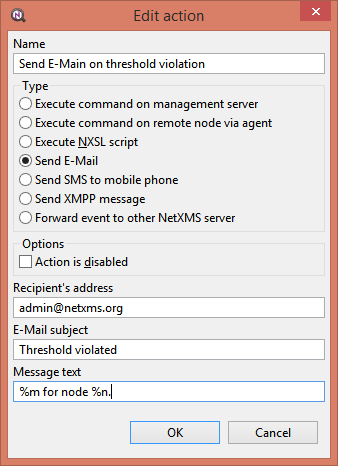
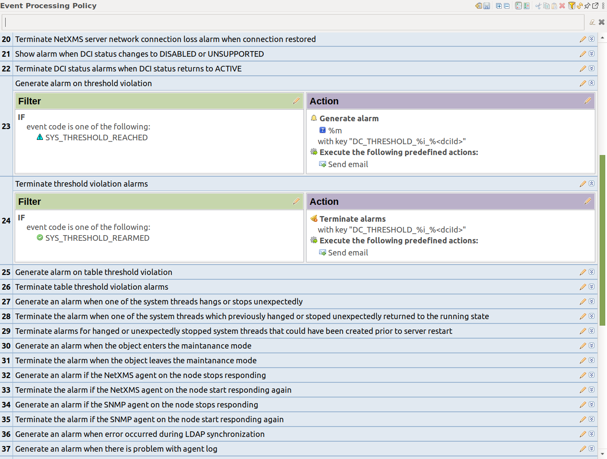
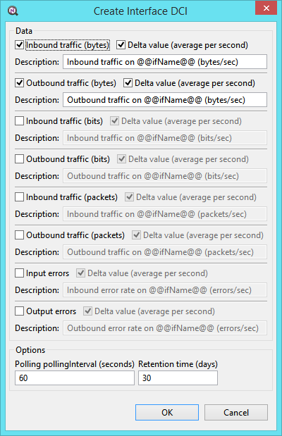

.. _quick-start:

###########
Quick start
###########

In this section will be described basic configuration that should be done 
after server and agent clean install. Also will be shown monitoring configuration 
for some common metrics like CPU of FS.

Default Credentials
===================

Server login default credentials

Login: admin

Password: netxms

Basic agent configuration
=========================

Minimal configuration that should be set for agent is server address and path 
to log file. Action differ depending on a platform where agent is installed. 
On Windows systems configuration file is automatically generated and populated 
by installer, on UNIX systems it should be created/edited manually. 

Minimal required configuration is done for agent. 

Windows
-------

In case if while installation MasterServer was set correctly no action is 
required form user. 

Automatically generated configuration file can be found there: 
:file:`'installation directory'\\etc\\nxagentd.conf'`.

Configuration file for Windows should look like this:

.. code-block:: cfg  

    #
    # Sample agent’s configuration file
    #
    MasterServers = 127.0.0.1
    LogFile = {syslog}

UNIX/Linux
----------

After agent is installed on a UNIX/Linux system it is required to create/edit file
:file:`/etc/nxagentd.conf`. This file should contain at least this information:

.. code-block:: cfg  

    #
    # Sample agent’s configuration file
    #
    MasterServers = 127.0.0.1
    LogFile = /var/log/nxagentd

Basic server tuning
===================

Server has 2 types of configuration: configuration file parameters and server 
configuration variables.

For server configuration file minimal requirements are path to log file, database 
driver name and all required credentials depending on database. Location and 
required actions depends on what OS is used. More about OS specific configuration 
search in OS subsections of this chapter. 

List of possible database drivers: 

  * db2.ddr
  * informix.ddr 
  * mssql.ddr 
  * mysql.ddr Driver for MySQL database.
  * odbc.ddr ODBC connectivity driver (you can connect to MySQL, PostgreSQL, MS SQL, and Oracle via ODBC).
  * oracle.ddr Driver for Oracle database.
  * pgsql.ddr Driver for PostgreSQL database.
  * sqlite.ddr Driver for embedded SQLite database.
  
There are quite a few important server parameters to be set right after installation. 
These parameters are accessible through the :guilabel:`Server Configuration` window 
in the console. To open it, click on :menuselection:`Configuration --> Server Configuration`. 
To edit a setting, double click on the row in the table or right-click and select 
:guilabel:`Edit`. The following parameters may need to be changed:

.. tabularcolumns:: |p{0.4 \textwidth}|p{0.6 \textwidth}|

================================ ==============================================
Parameter                        Description
================================ ==============================================
``PollerThreadPoolMaxSize``      This parameter represents maximum thread pool 
                                 size. From this pool will be taken threads for 
                                 all types of polls: Status 
                                 poll, Configuration poll, etc. In case of 
                                 big load on a server number of threads will be 
                                 increased till this size. When load come back 
                                 to normal, number of threads will be 
                                 automatically decreased to base size.
                                 If you plan to monitor large number of hosts
                                 increase this parameter from the default value
                                 to approximately 1/5 of host count.
``PollerThreadPoolBaseSize``     This parameter represents base thread pool 
                                 size. From this pool will be taken threads for 
                                 all types of polls: Status 
                                 poll, Configuration poll, etc. This is minimal 
                                 number of threads that will always run. 
                                 If you plan to monitor large number of hosts
                                 increase this parameter from the default value
                                 to approximately 1/10 of host count.
``NumberOfDataCollectors``       If you plan to monitor large number of hosts,
                                 to approximately 1/10 – 1/5 of host number.
                                 Use larger value if you plan to gather many
                                 DCIs from each host.
``EnableSyslogDaemon``           Set this parameter to 1 if you want to
                                 enable NetXMS built-in syslog server.
================================ ==============================================

Minimal required configuration is done for server. 

Windows
-------

For Windows systems this information is added to configuration file while 
installation procedure. It can be check that all data was set correctly 
in this file: :file:`'installation directory'\\etc\\nxagentd.conf'`. 

Example of sample Windows configuration for mysql:

.. code-block:: cfg  

  #
  # Sample configuration file for NetXMS server
  #

  DBDriver = mysql.ddr
  DBServer = localhost
  DBName = netxms_db
  DBLogin = netxms
  DBPassword = password
  LogFailedSQLQueries = yes
  LogFile = {syslog}
  

UNIX/Linux
----------
  
For UNIX based systems :file:`/etc/netxmsd.conf` file should be 
created/populated manually. 

Configuration file example for oracle database:

.. code-block:: cfg  

  DBDriver = oracle.ddr
  DBServer = ServerIP/Hostname.DomainName #Here is service (full database name), not SID
  DBName = netxms
  DBLogin = netxms
  DBPassword = PaSwD
  LogFailedSQLQueries = yes
  LogFile = /var/log/netxmsd
  

SMTP
====

SMTP configuration is done to create actions that will send e-mails on 
defined events. This configuration is done through the 
:guilabel:`Server Configuration` window in the console. To open it, click 
on :menuselection:`Configuration --> Server Configuration`. To edit a 
setting, double click on the row in the table or right-click and select 
:guilabel:`Edit`. The following parameters may need to be changed:

.. tabularcolumns:: |p{0.4 \textwidth}|p{0.6 \textwidth}|

================================ ==============================================
Parameter                        Description
================================ ==============================================
``SMTPFromAddr``                 Address that will be shown as a sender address 
                                 when notification from NetXMS will come.
``SMTPFromName``                 Name that will be shown as a sender name 
                                 when notification from NetXMS will come.
``SMTPRetryCount``               Number of retries that NetXMS will try to do 
                                 in case if message sending will fail. 
``SMTPServer``                   Server IP address or DNS name where NetXMS 
                                 will send request for message dispatch. 
================================ ============================================== 

.. _quick_start_credentials_SNMP:

SNMP Defaults
=============

For :term:`SNMP` can be configured some default values for authorization. It is 
required if you will have many :term:`SNMP` devices with similar credentials. 

This information is set on :guilabel:`Network Discovery` view. 

SNMP Communities
----------------

In this section you can add SNMP community strings to be tested during
connection to the SNMP device that requires authorization. 

SNMP USM Credentials
--------------------

In this section you can add SNMP version 3 credentials to be tested during
connection to the SNMP device that requires authorization. 

Actions and Alarms
==================

In this section will be shown how to configure alarm and email notifications 
generation on predefined SYS_THRESHOLD_REACHED event. And alarm resolve on 
SYS_THRESHOLD_REARMED event. 

First it should be created :guilabel:`Send E-Mail` action in 
:guilabel:`Action Configuration` view. There we will set recipient of e-mail, 
subject and body of e-mail. In body of e-mail will be used 
:ref:`event-processing-macros`. It means that when message will be sent, macros 
"%n" will be substituted with name of the node and "%m" will be substituted with 
event message. Value of event message is personal for each event and can be found in 
event description. 

Next step is to add processing policies. It is done in 
:guilabel:`Event Processing Policy` view. We will add this rules before all other rules 
as it it is planed that this rules will be most commonly used ones. 

It should be added rule that will send email and create Alarm on SYS_THRESHOLD_REACHED 
rule from any node. In alarm message is added key that will be used in alarm 
resolve. Key is combined from text id "SYS_THRESHOLD_REACHED\ _", id of DCI and 
ID of node. This should be enough to resolve correct alarm. After that should be 
created one more rule for alarm resolve with the same key as for alarm creation. 
After all configuration is done :guilabel:`Event Processing Policy` view should be 
saved. 

  
Passive discovery
=================

It is recommended to enable passive discovery when it is required to add all nodes 
in local network. In case if NetXMS server has access to switches and routers 
via SNMP, all devices in network will be added automatically by discovery process. 

To enable passive network discovery open :guilabel:`Network Discovery` view. 
There in :guilabel:`General` section select :guilabel:`Passive only` option and 
check that all default SNMP credentials are set as described in 
:ref:`quick_start_credentials_SNMP` section. Other options that can be set 
depending on requirements:

  * Option to use SNMP trap source for further network discovery
  * Option to set filer that will define rules for not adding nodes to 
    NetXMS server
    
In our configuration we will not use filter to add all node available on our 
network and turn on option to use SNMP trap source address for discovery. 
After all configuration is done remember to save it. 

Notes
-----

If you have enabled automatic network discovery, wait for initial network
discovery completion. This process can take time, depending on size and
complexity of your network. For large networks, we recommend that you let
NetXMS run over night to gather the majority of network information available.
You can watch discovery progress in a real time using NetXMS Management
Console. Go to :guilabel:`Object Browser` or open default network map and see
for new devices and networks.

Please note that for successful network discovery your network must meet the
following requirements:

- NetXMS server must have access to switches and routers via SNMP.
- All your network devices credentials(community string and password for v3) 
  should be added to default credential list in :guilabel:`Network Discovery` 
  view. 

Manually add node
=================

If the automatic network discovery does not detect all of your hosts or
devices, or you decide not to use network discovery at all, you may need to
manually add monitored nodes to the system. The easiest way to accomplish this
is to right-click on :guilabel:`Infrastructure Services` in the
:guilabel:`Objects` pane and select :guilabel:`Create node`. You will be
presented with the following dialog window:

.. figure:: _images/create_node.png

   Create Node window

Please note that adding a new node object may take some time, especially if a
node is down or behind a firewall. After successful creation, a new node object
will be placed into appropriate subnets automatically. As soon as you add a new
node to the system, NetXMS server will start regular polling to determine the
node status.

Add DCI thresholds 
==================

In this section is described how to configure CPU usage monitoring using agent metric and 
using SNMP metric and interface incoming traffic. There will be also shown threshold 
configuration for each DCI. This threshold will generate SYS_THRESHOLD_REACHED event 
when defined condition is meet and SYS_THRESHOLD_REARMED when collected data exists 
range of condition. 

Earlier we already described how to configure email notifications and alarm generation, 
resolve based on this events. In this chapter is described data collection and 
event generation based on collected data. 

To add DCI for a node open :guilabel:`Data Collection Configuration` view from object 
menu. And select form drop-down menu :guilabel:`New parameter`.

CPU usage
---------

Add CPU usage metric form agent parameters:

  1. Check that as origin is selected NetXMS Agent. 
  2. Click on :guilabel:`Select` button 
  3. Type in the input box "CPU" 

  .. figure:: _images/quickstart_search_cpu.png
  
    Parameter Selection

  .. figure:: _images/quickstart_general_cpu.png
  
    Properties

  4. Select :guilabel:`System.CPU.Usage`
  5. Go to :guilabel:`Threshold` tab 
  6. Click :guilabel:`Add` 
  7. Set that if last one polled value is gather than 85, then generate 
     SYS_THRESHOLD_REACHED event, when value is back to normal generate 
     SYS_THRESHOLD_REARMED event. 

  .. figure:: _images/quickstart_threashold_cpu.png
  
    Threshold

  8. Click :guilabel:`OK`

Add CPU usage metric form SNMP parameters:

  1. Check that as origin is selected NetXMS Agent. 
  2. Click on :guilabel:`Select` button 
  3. Type in the input box ".1.3.6.1.4.1.9.9.109.1.1.1.1.4"(this OID can may be not 
     available for some devices)
  4. Click :guilabel:`Walk`

  .. figure:: _images/quickstart_walk_result_dci.png
  
    Mib Walk Result

  5. Select CPU that should be monitored in our case it is 
     ".1.3.6.1.4.1.9.9.109.1.1.1.1.4.1"

  .. figure:: _images/quickstart_walk_dci.png
  
    Select Window For SNMP DCI
  
  6. Click :guilabel:`OK`

  .. figure:: _images/quickstart_general_trafic.png
  
    Properties

  7. Go to :guilabel:`Threshold` tab 
  8. Click :guilabel:`Add` 
  9. Set that if last one polled value is gather than 85, then generate 
     SYS_THRESHOLD_REACHED event, when value is back to normal generate 
     SYS_THRESHOLD_REARMED event. 

  .. figure:: _images/quickstart_threashold_cpu.png
  
    Threshold

  10. Click :guilabel:`OK`
  
  
Now you configured data collection of metric :guilabel:`System.CPU.Usage` that 
will be collected every 60 seconds, data will be stored for 30 days, with 1 threshold
that will be activated when CPU usage is mote than 85%.

Interface traffic
-----------------

There is shortcut to create all required DCIs for interface traffic. Select interfaces 
for which should be created traffic collection DCIs and select form drop-down menu 
:guilabel:`Create data collection items`. There can be created automatically all 
required DCIs by selecting required checkbooks. 

  