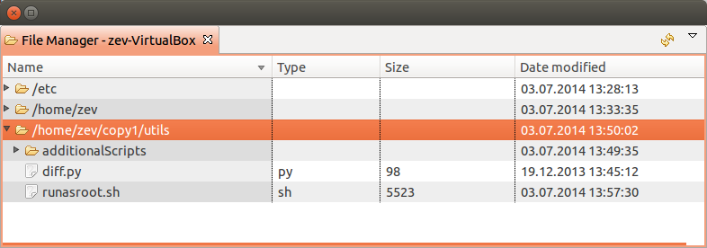
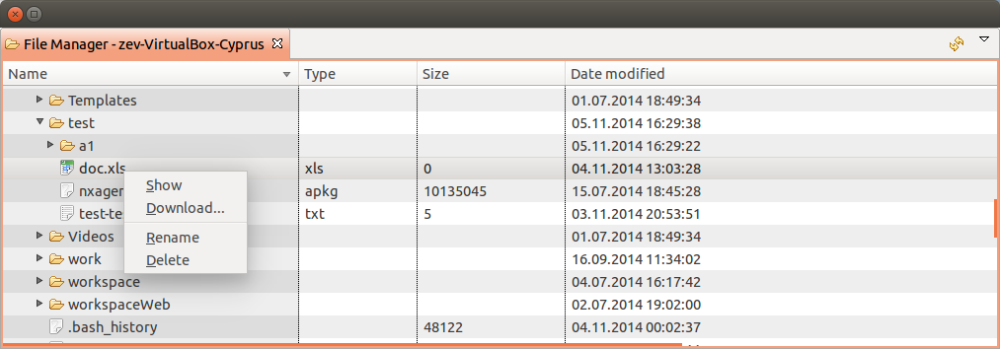
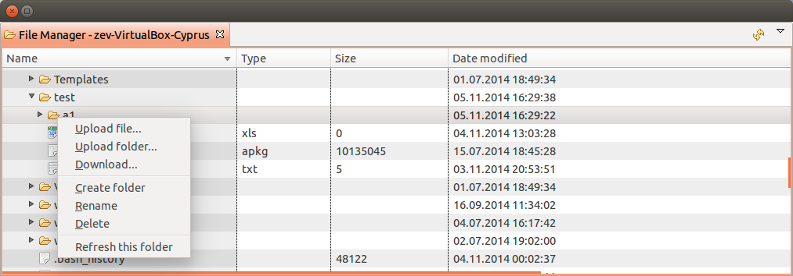
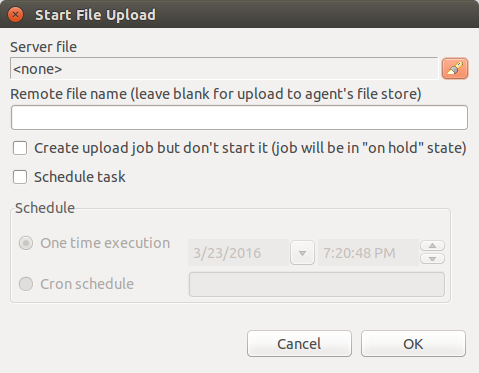
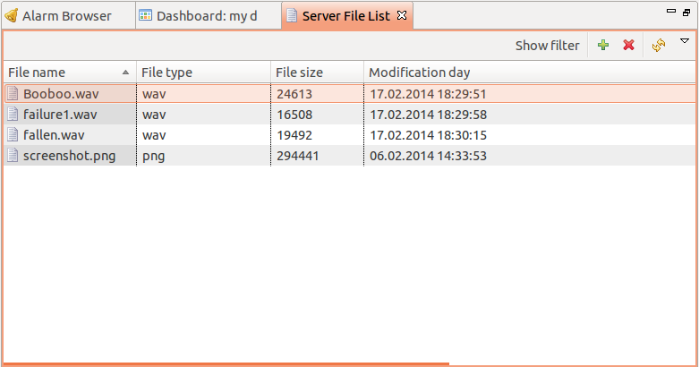
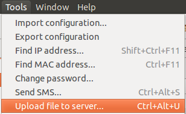

######################
Remote file management
######################

.. _agent_file_managment:

Agent file management
=====================

Introduction
------------

This section describes possibilities to manage files on remote nodes using agent
and required configuration for it.

Required Configuration
----------------------

Subagent configuration
~~~~~~~~~~~~~~~~~~~~~~

To do any manipulations with files on a node it is required to load filemng
subagent and configure accessible paths. It provides
possibility to upload, download, delete, move and rename files.

All configuration parameters related to filemng subagent should be placed
into **\*filemgr** section of agent's configuration file.
The following configuration parameters are supported:

+------------+----------------------------------------------+
| Parameter  | Description                                  |
+============+==============================================+
| RootFolder | Path to the folder which should be exposed.  |
|            | If ";ro" is appended to path - agent will    |
|            | reject any write operations with this folder |
+------------+----------------------------------------------+

Agent's configuration file example:

.. code-block:: cfg

   MasterServers = netxms.demo
   SubAgent = filemgr.nsm

   [filemgr]
   RootFolder = /home/zev # read/write access
   RootFolder = /home/zev/etc # read/write access
   RootFolder = /logs;ro # read only access

Access rights
~~~~~~~~~~~~~
To view File Manager View it's enough to have "Read" access to node.

To download files from file manager of through multiple file download there should be "Download file" access for this node and
for multiple download "Read server files" access.

To upload file from subagent there should be "Upload file" access for this node.

For moving, renaming and deleting files from node it is required "Manage files" access to node.

File Manager view
-----------------

For each configured node it is possible to open File Manager. It will display
all configured root folders and allow to browse into these folders.

File menu
~~~~~~~~~

 - Download... : downloads file to selected folder on local computer
 - Show : shows file with tail option 'on'
 - Rename : renames file
 - Delete : deletes file

Folder menu
~~~~~~~~~~~

 - Upload file... : uploads local file to selected folder in view
 - Upload folder... : uploads local folder to selected folder in view (not supported on web console)
 - Download... : download folder to selected folder on local computer (on web console will be advised to save as a zip of the selected folder)
 - Rename : renames folder
 - Delete : deletes folder and all it's content
 - Refresh this folder : refreshes content of selected folder in view

Other options
~~~~~~~~~~~~~

 - It is possible to move files and folders with help of drag and drop.
 - To refresh all view should be used view refresh button (not form folder menu). But in this case all expanded folders will be closed.

Advanced File Management
========================

There are options to run multiple file upload to agents, file upload jobs on hold and scheduled
file upload jobs. All this options are available uploading file from server to agent. That means that before upload file should be uploaded to server for instruction check :ref:`upload-file-on-server-label` section.

Advanced file upload can be accessed selecting required nodes (can be selected more than
one with help of 'Ctrl' key) and in object menu selecting :guilabel:`Upload file...`.

Job configuration:
 - File that should be uploaded on the agent(s).
 - Remote file path(If destination will not be set then as a destination will be taken from agent's config parameter 'FileStore'). If path is set agent will check if there is access to this folder. Access is configured by :guilabel:`filemgr` subagent, check :ref:`agent_file_managment`.
 - Job can be created "on hold". This mean that job will be created, but not started. After creation it can be manually started selecting job in :guilabel:`Server Jobs` view and clicking :guilabel:`Unhold`.
 - Other option is to schedule file upload job. It can scheduled to be executed once at exact time (:guilabel:`One time execution`) or to be executed according to schedule(:guilabel:`Cron schedule`). See :ref:`cron_format` for supported cron format options.

Result of file upload job can be checked in :guilabel:`Server Jobs` view. It can be accessed by clicking :menuselection:`View --> Server Jobs`.

.. _server-files-label:

Server File Management
======================

Access Rights
-------------

There are 2 access rights that can be granted:
 - Read server files : possibility to see files that are download on server
 - Manage server files : possibility to remove or upload on server files

.. _upload-file-on-server-label:

Upload file on server
---------------------

It can be done in "Server File List" view

or "Tools"->"Upload file to server...".

