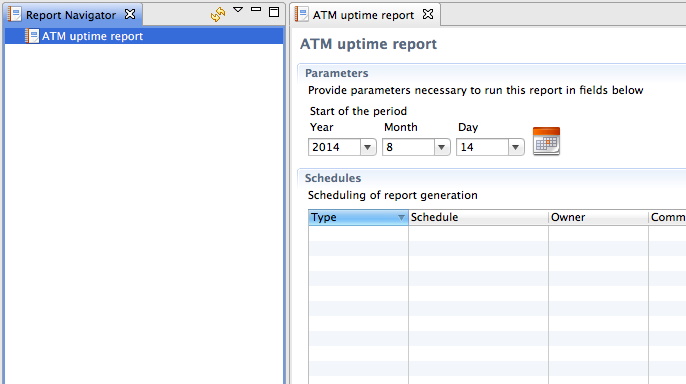
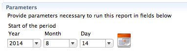
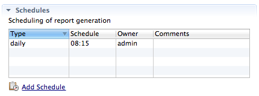
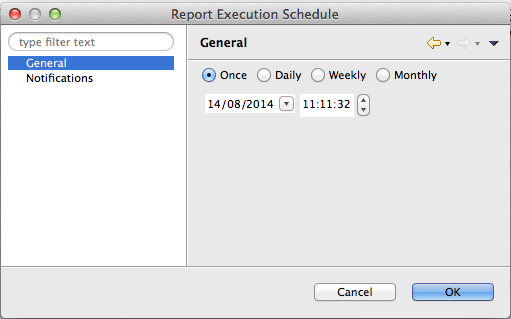
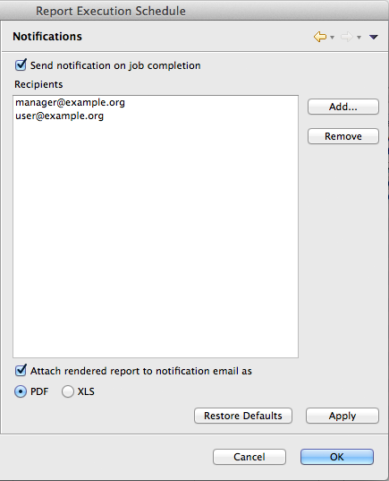
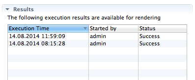

.. _reporting:

#########
Reporting
#########

Reporting module is an optional component, build on top of well known
JasperReports_ library, which can produce pixel-perfect documents in variety of
formats based on historical data collected by |product_name|.

Reporting module is a separate process that communicates with |product_name| and
handles execution and rendering of reports. 

Report generation is two step process: first step is to collect and process
input data, then render output files in desired format. This separation exist
for a reason: unlike rendering step, data collection could take hours to
complete and it make no sense to repeat same processing process to render Excel
file instead of PDF. When first step is finished, all processed information is
saved into intermediate file on the reporting server and available for rendering
at any time (e.g. user can render and download report from last year, even if
source data is already purged).

Reports execution and rendering can be initiated both manually and on schedule.

.. _JasperReports: http://community.jaspersoft.com/project/jasperreports-library

User Interface
==============

All reporting-related operations are available in Management Client in a
separate :guilabel:`Reporting` perspective. Perspective contains two main areas
– list of available reports on the left and report details view on the right.
Details view show information about currently selected report.

   Reporting perspective.

Details view contains tree main areas: :guilabel:`Parameters`,
:guilabel:`Schedules`, and :guilabel:`Results`.

Parameters
----------

   Execution parameters for report (in this example: :guilabel:`Start date`)

In this section, user can set all input parameters required for report
execution, for example data range or list of objects which should be included in
the report. List of required parameters is extracted from report definition file
and can be empty, if particular report do not require any input data to operate.

Schedules
---------

Each report can have one or more schedules, which define when it should be
executed, and optionally rendered. Reporting server can also notify users that
new report is executed and available for download, or send resulting file as an
attachment.

   List of scheduled executions

To add new schedule, click on :guilabel:`Add Schedule` down below, this will
open schedule editor.

   Schedule editor with two tabs, :guilabel:`General` and
   :guilabel:`Notifications`

:guilabel:`General` tab contains four scheduling options:

#. :guilabel:`Once` - execute report once at specified date and time
#. :guilabel:`Daily` - execute report every day at specified time
#. :guilabel:`Weekly` - execute report every week on selected days of week at
   specified time
#. :guilabel:`Monthly` - execute report every month on selected days at
   specified time

   :guilabel:`Notifications` tab of Schedule editor

:guilabel:`Notification` tab allows to control email notifications and report
delivery to list of recipients.  To enable notifications, select :guilabel:`Send
notification on job completion` checkbox.

If checkbox :guilabel:`Attach rendered report` checkbox is enabled, report will
be rendered into selected format and attached to notification email.

Results section
---------------

   List of generated reports

This section contains list of all generated reports, which are stored on the
server and can be rendered on request. To render report in desired format, right
click on the record and select :guilabel:`Render to PDF` or :guilabel:`Render to
Excel`.

If report is no longer needed, right click on record and select
:guilabel:`Delete` to completely remove it from server.

Installation
============

On Linux platforms where packages are provided reporting module is available in
``netxms-reporting`` package. 

On Windows reporting module is a part of |product_name| server installer. Java
11 or later is required by reporting module. 

Configuration
=============

|product_name| Server
---------------------

|product_name| server maintain persistent connection with reporting server on
`localhost:4710`, but it can be changed in configuration.

+-------------------------+------------------------------------------------+---------------+
| Configuration Parameter | Description                                    | Default Value |
+=========================+================================================+===============+
| EnableReportingServer   | Boolean on/off switch which enable integration | 0             |
+-------------------------+------------------------------------------------+---------------+
| ReportingServerHostname | IP address or hostname of the reporting server | localhost     |
+-------------------------+------------------------------------------------+---------------+
| ReportingServerPort     | Port number of the reporting server            | 4710          |
+-------------------------+------------------------------------------------+---------------+

|product_name| server connects and maintains connection to reporting server on
the given hostname and port. Via this connection reporting server receives all
necessary configuration and database credentials that are needed for operation. 

Reporting Server
----------------

Reporting module has so-called workspace directory which contains report
definitions (in "definitions" subdirectory) and intermediate report data (in
"output" subdirectory).

On Linux for reporting module installed from packages workspace directory is
``/var/lib/netxms/nxreportd``. 

If ``$NETXMS_HOME`` environment variable is set, workspace directory is
``$NETXMS_HOME/var/lib/nxreportd``. 

On Windows workspace directory is located ``var\nxreportd`` in |product_name|
installation folder, for default installation location it's
``C:\NetXMS\var\nxreportd``. 

Report definitions
------------------

Report definitions are .jar files prepared by Jaspersoft® Studio. During
operation reporting server scans workspace/definitions directory for \*.jar
files. Each file is unpacked into it's own folder based on jar name (e.g.
"report1.jar" will be unpacked into "report1"). Each archive should contain at
least one file – "main.jrxml", which is main report definition. It can also
contain subreports, images – or anything else, supported by Jasper Reports. Any
additional resources should be referenced using paths relative to root folder of
unpacked report, which is set as additional parameter "SUBREPORT_DIR" (e.g.
"$P{SUBREPORT_DIR}/logo.png").

Archive can also contain java code, which will be used as data provider (instead
of querying SQL database). Reporting server will try to load class
"report.DataSource", which should implement interface
"com.radensolutions.reporting.custom.NXCLDataSource" (attached sample: Event
Processing Policy). Query string language in jrxml should be set to "nxcl"
(default - SQL).

Simplest way to create jar files are using Maven, empty project is provided in
samples archive. Running "mvn package" will produce complete jar file in "target"
directory.
