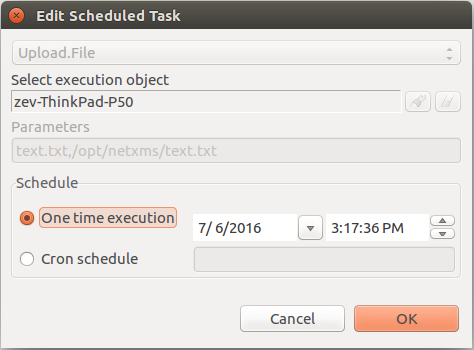

.. _schedule:

===============
Scheduled tasks
===============

|product_name| provide option to schedule different tasks. Each task have it's own parameter count and type.
The only common parameter is node on which task will be executed. Schedule time can be set in two
ways as one time schedule or as a cron task (see :ref:`cron_format` for supported cron format options).

Information about available tasks can be found there:
   1. :ref:`schedule_file_upload`
   2. :ref:`schedule_script_execution`
   3. :ref:`schedule_maintenance`

.. _schedule_file_upload:

File Upload
===========

Task is named :guilabel:`Upload.File`. This task uploads server file to agent. Upload file
should exist in server file storage. Task can be created in :guilabel:`Schedules`
view or in :guilabel:`Upload file...` dialog.

Parameters:

   1. File name that should be uploaded
   2. Path and file name where this file should be uploaded on agent

Example: Warning-C.wav,/destination/location/Warning-C.wav

.. _schedule_script_execution:

Script Execution
================

Task is named :guilabel:`Execute.Script`. This task executes script from library. Selected
node is set as :guilabel:`$node` variable in the script.

Parameters:

   1. Server script name

.. _schedule_maintenance:

Maintenance
===========

Tasks are named :guilabel:`Maintenance.Enter` and :guilabel:`Maintenance.Leave`. This tasks turn on
and turn off maintenance mode for selected node. More about maintenance mode can be found :ref:`there<maintenance_mode>`.

This task does not require parameters.

Access Rights
=============

Access rights for schedules can be separated into two parts. Rights that are required to
create, edit, delete tasks at all and rights that are required to schedule exact task type.
Task can be created by user or by system.

Overall access rights:

.. list-table::
   :widths: 25 75
   :header-rows: 1

   * - Access right
     - Description
   * - Manage user scheduled tasks
     - Option to add, view, edit, delete users' tasks
   * - Manage own scheduled tasks
     - Option to add, view, edit, delete tasks created by this user
   * - Manage all scheduled tasks
     - Option to add, view, edit, delete tasks created by user and system

Task specific access rights:

.. list-table::
   :widths: 25 75
   :header-rows: 1

   * - Schedule type
     - Required access right
   * - File Upload
     - Schedule file upload task
   * - Script Execution
     - Schedule script task
   * - Maintenance
     - Schedule object maintenance

For some tasks like :guilabel:`File.Upload` there is also checked if this user has right
to upload file to this node and if there is an access to the specific folder. Access rights
like this are checked while task execution, not while scheduling. If user does not have
access, then task will just fail.
