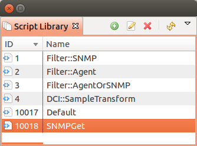

.. _scripting:

#########
Scripting
#########

Scripting library
=================

:guilabel:`Script Library` is used to store scripts that can be afterwards executed as macros, 
part of other script or just from server console. Scripts can be added, deleted and modified in 
in this view. 

Usage
-----

Scripts from Script Librarry can be accesed as: 
  1. a macros $[\ `scriptName`\ ]
  2. used in other script in format: "use `scriptName`\ "
  3. executed from server console "execute `scriptName`\ " 
  4. executed as post action for pols - then script name should start from "`Hook::`\ " and then 
     should be name of poll like "Hook::ConfigurationPoll".
     
     
.. _execute_server_script:
     
Execute Server Script
=====================

This view allows to execute arbitrary script. Script can be manually created just before execution, 
and afterwards saved, can be taken from the script library, can be used modified script form the 
script library and afterwards saved or saved as. If this view is opened on a node, then in the 
script is available ``$node`` variable with node object. 

.. figure:: _images/execute_server_script.png

NXSL
====

Overview
--------

In many parts of the system, fine tuning can be done by using NetXMS built-in
scripting language called NXSL (stands for NetXMS Scripting Language). NXSL was
designed specifically to be used as embedded scripting language within NetXMS,
and because of this has some specific features and limitations. Most notable is
very limited access to data outside script boundaries – for example, from NXSL
script you cannot access files on server, nor call external programs, nor even
access data of the node object other than script is running for without
explicit permission. NXSL is interpreted language – scripts first compiled into
internal representation (similar to byte code in Java), which than executed
inside NXSL Virtual Machine.

"Hello, World!" Program
-----------------------

Syntactically, NXSL looks similar to Perl or C. Here's simple NXSL program:

.. code-block:: c

   /* sample program */
   sub main()
   {
      println "Hello!";
      return 0;
   }

This program will print word ``Hello`` on screen.

Also, keep in mind that you are free to choose your own formatting style. E.g.
the above could have been written as: 

.. code-block:: c

   /* sample program */ sub main(){println "Hello!";return 0;}

Now we'll analyze this program:

.. code-block:: c

   /* sample program */

Everything inside ``/* */`` is considered a comment and will be ignored by
interpreter. You can enclose comments, like below:

.. code-block:: c

   /* comment /* another comment */ still comment */

You can also use single line comments:

.. code-block:: c

   x = 1; // everything between two slashes and end of line is a comment

Now onto next line:

.. code-block:: c

   sub main()
   {
   }

This is a function definition. A function is a part of a program that can be
called by other parts of the program. A function definition always has the
following form: 

    **sub** *name* **(** *parameters* **)**
    {

       \\\\the function code goes here

    }

The function can return a value to the caller and accept zero or more
parameters.

The function name follows the rules for all names (formally: identifiers): it
must consist entirely of letters (uppercase and lowercase are different!),
digits, underscores (``_``) and dollar signs (``$``), but may not begin with a
digit. Please note that most special identifiers starts with dollar sign
(``$``), so it is recommended not to start your identifiers with it.

First line in function code looks like

.. code-block:: c

   println "Hello!";

In this line, ``println`` is an embedded operator which prints given string to
standard output with carriage return, and ``"Hello!"`` is a string we want to
print. Please note semicolon at the end of line – it's a separator between
operators. Each operator should end with semicolon.

The next, and final, line of our small program is: 

.. code-block:: c

   return 0;

``return`` is another built-in operator which exits the function and sets it's
return value.

Script entry point
------------------

NXSL handles script entry in 2 ways:

    * Explicit main() function
    * Implicit $main() fucntion
    
If an explicitelly defined main() exists, it will be called.

If an explicit main() doesnt exist, an implicit $main() fucntion will be created by the script interpreter and the script will enter at the $main() function.

The $main() fucntion is constructed from code that is not a part of any other functions.

Types
-----

NXSL is loose typed programming language. The system will automatically
determine each variable type, assign a certain type to a variable and convert a
variable type from one to another, if necessary. For example, a result for ``3
+ "4"`` will be ``7``, because the system will automatically convert ``"4"``
string into an integer. In case if the system is not able to automatically
convert a line into an appropriate integer, the operation will result in a
runtime error.

NXSL supports the following variable types:

- integer (32 bit),
- unsigned integer (32 bit), 
- integer (64 bit), unsigned integer (64 bit), 
- floating-point number, 
- string,
- array,
- object.

In addition to that, NXSL also supports a special variable type – ``NULL``.
This value represents a variable with no value. ``NULL`` is the only possible
value of type ``NULL``. An attempt to perform any type of arithmetical or
string operations with ``NULL`` variable will result in system runtime error.

It is possible to manually convert variable to a certain type, using a special
function, named depending on the variable type. For example, ``string(4)``.
That way it is also possible to convert ``NULL`` type variables. Therefore, to
avoid runtime errors while processing ``NULL`` type variables, it is advised to
use manual conversion.

NXSL does not require setting variable type beforehand. The only exception to
this is arrays. In case if an array is required, operator ``array`` defines its
subsequent variables as arrays. Accessing variable which was not previously
assigned will return ``NULL`` value.

Although NXSL has object type variables, it is not an object-oriented language.
It is not possible to define classes or create objects at script level – only
in extensions written in C++. Object type variables are used to return
information about complex NetXMS objects, like nodes or events, in a convenient
way. Please note that assigning object type variables actually holds reference
to an object, so assigning object value to another variable does not duplicate
actual object, but just copy reference to it.

To get a human-readable representation of a variable or expression type for
debugging, use the ``typeof()`` function, and to get a class name for object
type variables, use ``classof()`` function.

Variables
---------

Variables in NXSL behave the same way as variables in most popular programming
languages (C, C++, etc.) do, but in NXSL you don't have to declare variables
before you use them. 

Scope of a variable can be either global (visible in any function in the
script) or local (visible only in the function within which it was defined).
Any variable is by default limited to the local function scope. Variable can be
declared global using ``global`` operator.

For example:

.. code-block:: c

   x = 1;
   myFunction();
   
   sub myFunction()
   {
      println "x=" . x;
   }

This script will cause run time error ``Error 5 in line 6: Invalid operation
with NULL value``, because variable ``x`` is local (in implicit main function)
and is not visible in function ``myFunction``. The following script will
produce expected result (prints ``x=1``):

.. code-block:: c

   global x = 1;
   myFunction();
   
   sub myFunction()
   {
      println "x=" . x;
   }

Function Declaration
--------------------

A function is a named code block that is generally intended to process
specified input values into an output value, although this is not always the
case. For example, the ``trace()`` function takes variables and static text and
prints the values into server log. Like many languages, NXSL provides for
user-defined functions. These may be located anywhere in the main program or
loaded in from other scripts via the use keywords.

To define a function, you can use the following form:

**sub** *NAME* **(** *ARGUMENTS* **)** **BLOCK**

where ``NAME`` is any valid identifier, ``ARGUMENTS`` is optional list of
argument names, and ``BLOCK`` is code block.

To call a function you would use the following form:

*NAME* **(** *LIST* **)**

where ``NAME`` is identifier used in function definition, and ``LIST`` is an
optional list of expressions passed as function arguments.

To give a quick example of a simple subroutine:

.. code-block:: c

   sub message()
   {
      println "Hello!";
   }

Function Arguments
~~~~~~~~~~~~~~~~~~

The first argument you pass to the function is available within the function as
``$1``, the second argument is ``$2``, and so on. For example, this simple
function adds two numbers and prints the result:

.. code-block:: c

   sub add()
   {
      result = $1 + $2;
      println "The result was: " . result;
   }

To call the subroutine and get a result:

.. code-block:: c

   add(1, 2);

If you want named arguments, list of aliases for ``$1``\ , ``$2``\ , etc. can be
provided in function declaration inside the brackets:

.. code-block:: c

   sub add(numberA, numberB)
   {
      result = numberA + numberB;
      println "The result was: " . result;
   }

If parameter was not provided at function call, value of appropriate variable
will be ``NULL``.

Return Values from a Function
~~~~~~~~~~~~~~~~~~~~~~~~~~~~~

You can return a value from a function using the ``return`` keyword:

.. code-block:: c

   sub pct(value, total)
   {
      return value / total * 100.0;
   }

When called, return immediately terminates the current function and returns the
value to the caller. If you don't specify a value in ``return`` statement or
function ends implicitly by reaching end of function's block, then the return
value is ``NULL``.

Arrays
------

An array in NXSL is actually an ordered map. A map is a type that associates
``values`` to ``keys``. This type is optimized for several different uses; it
can be treated as an array, list (vector), hash table (an implementation of a
map), dictionary, collection, stack, queue, and probably more. As array values
can be other arrays. 

A ``key`` must be a non-negative integer. When an array is created, its size is
not specified and its map can have empty spots in it. For example, an array can
have a element with a ``0`` key and an element with ``4`` key and no keys
in-between. Attempting to access an array key which has not been defined is the
same as accessing any other undefined variable: the result will be ``NULL``.

Array elements can be accessed using [``index``] operator. For example, to
access element with index ``3`` of array ``a`` you should use

.. code-block:: c

   a[3];

Array Initialization
~~~~~~~~~~~~~~~~~~~~

New array can be created in two ways. First is to use ``'array``' operator.
This statement will create empty array and assign reference to it to variable ``a``.

.. code-block:: c

   array a;

You can then assign values to the array like this. 

Please note arrays in NXSL are sparse, so you can have elements with nothing in between.

.. code-block:: c

    array a; 
    a[1] = 1;
    a[2] = 2;
    a[260] = 260;    
    println(a[1]); // will print 1

Second way is to use %( ) construct to create array already populated with values.

This statement will create array with four elements at positions 0, 1, 2, and 3, and assign reference to this array to variable a.
    
.. code-block:: c

    // no need to use "array a;" here, since we are creating it dirrectly
    a = %(1, 2, 3, 4);
    
    println(a[0]); // will actually print 1, since 1 is the 0th member

Array initialization can also be used directly in expressions, like this:

.. code-block:: c

   sub f()
   {
      return %(2, "text", %(1, 2, 3));
   }

In this example function ``f`` returns array of 3 elements - number, text, and
another array of 3 numeric elements.

Operators
---------

An operator is something that you feed with one or more values, which yields
another value.

Arithmetic Operators
~~~~~~~~~~~~~~~~~~~~

+---------+----------------+-------------------------------------+
| Example | Name           | Result                              |
+=========+================+=====================================+
| -a      | Negation       | Opposite of ``a``                   |
+---------+----------------+-------------------------------------+
| a + b   | Addition       | Sum of ``a`` and ``b``              |
+---------+----------------+-------------------------------------+
| a - b   | Subtraction    | Difference between ``a`` and ``b``  |
+---------+----------------+-------------------------------------+
| a * b   | Multiplication | Product of ``a`` and ``b``          |
+---------+----------------+-------------------------------------+
| a / b   | Division       | Quotient of ``a`` and ``b``         |
+---------+----------------+-------------------------------------+
| a % b   | Modulus        | Remainder of ``a`` divided by ``b`` |
+---------+----------------+-------------------------------------+

The division operator (``/``) returns a float value unless the two operands are
integers (or strings that get converted to integers) and the numbers are evenly
divisible, in which case an integer value will be returned. 

Calling modulus on float operands will yield runtime error. 

Assignment Operator
~~~~~~~~~~~~~~~~~~~

The assignment operator is ``=``, which means that the left operand gets set to
the value of the expression on the rights (that is, "gets set to"). 

Bitwise Operators
~~~~~~~~~~~~~~~~~

.. list-table::
   :header-rows: 1
   :widths: 15 15 70

   * - Example
     - Name
     - Result
   * - ``~ a``
     - Not
     - Bits that are set in ``a`` are unset, and vice versa.
   * - ``a & b``
     - And
     - Bits that are set in both operand are set.
   * - ``a | b``
     - Or
     - Bits that are set in either operand are set.
   * - ``a ^ b``
     - Xor
     - Bits that are set in only one operand are set.
   * - ``a << b``
     - Shift left
     - Shift the bits of ``a`` for ``b`` steps to the left (each step equals
       "multiply by two").
   * - ``a >> b``
     - Shift right
     - Shift the bits of ``a`` for ``b`` steps to the right (each step equals
       "divide by two").

Comparison Operators
~~~~~~~~~~~~~~~~~~~~

Comparison operators allow you to compare two values. 

.. list-table::
   :header-rows: 1
   :widths: 15 15 70

   * - Example
     - Name
     - Result
   * - ``a == b``
     - Equal
     - ``TRUE`` if ``a`` is equal to ``b``.
   * - ``a != b``
     - Not equal
     - ``TRUE`` if ``a`` is not equal to ``b``.
   * - ``a < b``
     - Less than
     - ``TRUE`` if ``a`` is strictly less than ``b``.
   * - ``a > b``
     - Greater than
     - ``TRUE`` if ``a`` is strictly greater than ``b``.
   * - ``a <= b``
     - Less than or equal to
     - ``TRUE`` if ``a`` is less than or equal to ``b``.
   * - ``a >= b``
     - Greater than or equal to
     - ``TRUE`` if ``a`` is greater than or equal to ``b``.
   * - ``a ~= b``
     - Match
     - ``TRUE`` if ``a`` is matched to regular expression ``b``. As a side
       effect, assigns values to special variables ``$1``, ``$2``, ``$3``, etc.
       See see :ref:`regular-expressions` for details.
   * - ``a match b``
     - Match
     - ``TRUE`` if ``a`` is matched to regular expression ``b``. As a side
       effect, assigns values to special variables ``$1``, ``$2``, ``$3``, etc.
       See see :ref:`regular-expressions` for details.
   * - ``a imatch b``
     - Match (case insensitive)
     - ``TRUE`` if ``a`` is matched to regular expression ``b`` (case insensitive). As a side
       effect, assigns values to special variables ``$1``, ``$2``, ``$3``, etc.
       See see :ref:`regular-expressions` for details.

Incrementing/Decrementing Operators
~~~~~~~~~~~~~~~~~~~~~~~~~~~~~~~~~~~

NXSL supports C-style pre- and post-increment and decrement operators. 

.. list-table::
   :header-rows: 1
   :widths: 15 15 70

   * - Example
     - Name
     - Result
   * - ``++a``
     - Pre-increment
     - Increments ``a`` by one, then returns ``a``.
   * - ``a++``
     - Post-increment
     - Returns ``a``, then increments ``a`` by one.
   * - ``--a``
     - Pre-decrement
     - Decrements ``a`` by one, then returns ``a``.
   * - ``a--``
     - Post-decrement
     - Returns ``a``, then decrements ``a`` by one.

Logical Operators
~~~~~~~~~~~~~~~~~

.. list-table::
   :header-rows: 1
   :widths: 15 15 70

   * - Example
     - Name
     - Result

   * - ``! a``
     - Not
     - ``TRUE`` if ``a`` is not ``TRUE``.
   * - ``a && b``
     - And
     - ``TRUE`` if both ``a`` and ``b`` is ``TRUE``.
   * - ``a || b``
     - Or
     - ``TRUE`` if either ``a`` or ``b`` is ``TRUE``.

String Operators
~~~~~~~~~~~~~~~~

There are two string operators. The first is the concatenation operator
(``.``), which returns the concatenation of its right and left arguments. The
second is the concatenating assignment operator (``.=``), which appends the
argument on the right side to the argument on the left side.

Control structures
------------------

Any NXSL script is built out of a series of statements. A statement can be an
assignment, a function call, a loop, a conditional statement or even a
statement that does nothing (an empty statement). Statements usually end with a
semicolon. In addition, statements can be grouped into a statement-group by
encapsulating a group of statements with curly braces. A statement-group is a
statement by itself as well. The various statement types are supported: 

- if
- else
- while
- do-while
- for
- break
- continue
- switch
- return
- exit

if
~~

The ``if`` construct is one of the most important features of many languages. It allows for conditional execution of code fragments. NXSL features an ``if`` structure that is similar to that of C: 

.. code-block:: c

   if (expr)
       statement

else
~~~~

Often you'd want to execute a statement if a certain condition is met, and a
different statement if the condition is not met. This is what ``else`` is for.
``else`` extends an ``if`` statement to execute a statement in case the
expression in the ``if`` statement evaluates to ``FALSE``. The ``else``
statement is only executed if the ``if`` expression evaluated to ``FALSE``.

while
~~~~~

``while`` loops are the simplest type of loop in NXSL. They behave just like
their C counterparts. The basic form of a ``while`` statement is: 

.. code-block:: c

   while (expr)
       statement

The meaning of a ``while`` statement is simple. It tells NXSL to execute the
nested statement(s) repeatedly, as long as the ``while`` expression evaluates
to ``TRUE``. The value of the expression is checked each time at the beginning
of the loop, so even if this value changes during the execution of the nested
statement(s), execution will not stop until the end of the iteration.

do-while
~~~~~~~~

``do-while`` loops are very similar to ``while`` loops, except the truth
expression is checked at the end of each iteration instead of in the beginning.
The main difference from regular ``while`` loops is that the first iteration of
a ``do-while`` loop is guaranteed to run (the truth expression is only checked
at the end of the iteration), whereas it may not necessarily run with a regular
``while`` loop (the truth expression is checked at the beginning of each
iteration, if it evaluates to ``FALSE`` right from the beginning, the loop
execution would end immediately).

for
~~~

``for`` loops are the most complex loops in NXSL. They behave like their C
counterparts. The syntax of a ``for`` loop is: 

.. code-block:: c

   for (expr1; expr2; expr3)
       statement

The first expression (``expr1``) is evaluated (executed) once unconditionally
at the beginning of the loop. 

In the beginning of each iteration, ``expr2`` is evaluated. If it evaluates to
``TRUE``, the loop continues and the nested statement(s) are executed. If it
evaluates to ``FALSE``, the execution of the loop ends. 

At the end of each iteration, ``expr3`` is evaluated (executed).

break
~~~~~

``break`` ends execution of the current ``for``, ``while``, ``do-while`` or
``switch`` structure. 

continue
~~~~~~~~

``continue`` is used within looping structures to skip the rest of the current
loop iteration and continue execution at the condition evaluation and then the
beginning of the next iteration. 

switch
~~~~~~

The ``switch`` statement is similar to a series of ``if`` statements on the
same expression. In many occasions, you may want to compare the same variable
(or expression) with many different values, and execute a different piece of
code depending on which value it equals to. This is exactly what the ``switch``
statement is for.

Example:

.. code-block:: c

     switch (input) 
     {
       case "1":
         trace(0,"Input is 1");
         break;
       case "2":
         trace(0,"Input is 2");
         break;
       default:
         trace(0, "Input is unknown");
     }

return
~~~~~~

If called from within a function, the ``return`` statement immediately ends
execution of the current function, and returns its argument as the value of the
function call. Calling ``return`` from ``main()`` function (either explicitly
or implicitly defined) is equivalent of calling ``exit``.

exit
~~~~

The ``exit`` statement immediately ends execution of the entire script, and
returns its argument as script execution result.

Expressions
-----------

The simplest yet most accurate way to define an expression is "anything that
has a value". 

The most basic forms of expressions are constants and variables. When you type
``a = 5``, you're assigning ``5`` into ``a``. ``5``, obviously, has the value
5, or in other words ``5`` is an expression with the value of 5 (in this case,
``5`` is an integer constant).

Slightly more complex examples for expressions are functions. Functions are
expressions with the value of their return value. 

NXSL supports the following value types: integer values, floating point values
(float), string values and arrays. Each of these value types can be assigned
into variables or returned from functions. 

Another good example of expression orientation is pre- and post-increment and
decrement. You be familiar with the notation of ``variable++`` and
``variable--``. These are increment and decrement operators. In NXSL, like in
C, there are two types of increment - pre-increment and post-increment. Both
pre-increment and post-increment essentially increment the variable, and the
effect on the variable is identical. The difference is with the value of the
increment expression. Pre-increment, which is written ``++variable``, evaluates
to the incremented value. Post-increment, which is written ``variable++``
evaluates to the original value of variable, before it was incremented.

A very common type of expressions are comparison expressions. These expressions
evaluate to either ``FALSE`` or ``TRUE``. NXSL supports ``>`` (bigger than),
``>=`` (bigger than or equal to), ``=`` (equal), ``!=`` (not equal), ``<``
(less than) and ``<=`` (less than or equal to). These expressions are most
commonly used inside conditional execution, such as ``if`` statements. 

The last example of expressions is combined operator-assignment expressions.
You already know that if you want to increment ``a`` by 1, you can simply write
``a++`` or ``++a``. But what if you want to add more than one to it, for
instance 3? In NXSL, adding 3 to the current value of ``a`` can be written ``a
+= 3``. This means exactly "take the value of ``a``, add 3 to it, and assign it
back into ``a``". In addition to being shorter and clearer, this also results
in faster execution. The value of ``a += 3``, like the value of a regular
assignment, is the assigned value. Notice that it is NOT 3, but the combined
value of ``a`` plus 3 (this is the value that's assigned into ``a``). Any
two-place operator can be used in this operator-assignment mode.

Short-circuit evaluation
~~~~~~~~~~~~~~~~~~~~~~~~

`Short-circuit evaluation
<http://en.wikipedia.org/wiki/Short-circuit_evaluation>`_ denotes the semantics
of some Boolean operators in which the second argument is only executed or
evaluated if the first argument does not suffice to determine the value of the
expression: when the first argument of the AND function evaluates to false, the
overall value must be false; and when the first argument of the OR function
evaluates to true, the overall value must be true. NXSL uses short-circuit
evaluation for ``&&`` and ``||`` boolean operators. This feature permits two
useful programming constructs. Firstly, if the first sub-expression checks
whether an expensive computation is needed and the check evaluates to false,
one can eliminate expensive computation in the second argument. Secondly, it
permits a construct where the first expression guarantees a condition without
which the second expression may cause a run-time error. Both are illustrated in
the following example:

.. code-block:: c

   if ((x != null) && ((trim(x) == "abc") || (long_running_test(x)))  
      do_something();

Without short-circuit evaluation, ``trim(x)`` would cause run-time error if
``x`` is ``NULL``. Also, long running function will only be called if condition
(``trim(x) == "abc"``) will be false.

.. _regular-expressions:

Regular expressions
-------------------

Function list
-------------

Classes list
------------

NXShell
=======

NxShell is based on Jython and provide access to NetXMS Java API using interactive 
shell. NxShell is build as single jar file, which includes all required libraries.

Download: http://www.netxms.org/download/nxshell-VERSION.jar 
(example: http://www.netxms.org/download/nxshell-1.2.13.jar)

Usage
-----

There are two options of this jar usage: 

  1. it can be started as interactive shell;

     :command:`java -jar nxshell-1.2.15.jar`

  2. it can be started with the script name as a first parameter. Then it will just 
     execute this script and exit. Example: 

     :command:`java -jar nxshell-1.2.15.jar test.py`

When NxShell is started, it tries to get server IP, login and password from Java 
properties. In interactive mode, user will be asked for details, otherwise 
default values will be used.

Start as interactive shell, with IP and Login provided (password will be asked):

:command:`java -Dnetxms.server=127.0.0.1 -Dnetxms.login=admin -jar nxshell-1.2.15.jar`

Properties
~~~~~~~~~~

These properties should be set with JVM's "-D" option. Please make sure that all 
"-D" options are before "-jar".

======================= ================
Parameter               Default Value
======================= ================
netxms.server           127.0.0.1
netxms.login            admin
netxms.password         netxms
netxms.encryptSession   true
======================= ================

Scripting
---------

For details on API please refer to javadoc at 
http://www.netxms.org/documentation/javadoc/latest/.

NxShell provide user with already connected and synchronised session to simplify 
scripting. Most required packages are imported as well to minimize typing.

Global Variables
~~~~~~~~~~~~~~~~

=============== ================================ =====================
Variable        Type                             Notes
=============== ================================ =====================
session         org.netxms.client.NXCSession    
s               org.netxms.client.NXCSession     Alias for "session"
=============== ================================ =====================

Helper Functions
~~~~~~~~~~~~~~~~

Example
~~~~~~~

More examples can be found on a 
`NetXMS wiki <https://wiki.netxms.org/wiki/Using_nxshell_to_automate_bulk_operations>`_.

.. code-block:: python

  parentId = objects.GenericObject.SERVICEROOT # Infrastructure Services root
  cd = NXCObjectCreationData(objects.GenericObject.OBJECT_CONTAINER, "Sample Container", parentId);
  containerId = session.createObject(cd) # createObject return ID of newly created object
  print '"Sample Container" created, id=%d' % (containerId, )
  
  flags = NXCObjectCreationData.CF_DISABLE_ICMP | \
          NXCObjectCreationData.CF_DISABLE_NXCP | \
          NXCObjectCreationData.CF_DISABLE_SNMP
  for i in xrange(0, 5):
      name = "Node %d" % (i + 1, )
      cd = NXCObjectCreationData(objects.GenericObject.OBJECT_NODE, name, containerId);
      cd.setCreationFlags(flags);
      cd.setPrimaryName("0.0.0.0") # Create node without IP address
      nodeId = session.createObject(cd)
      print '"%s" created, id=%d' % (name, nodeId)

