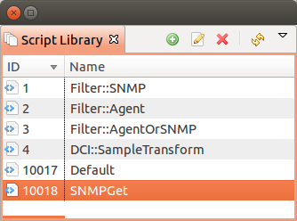

.. _scripting:

#########
Scripting
#########

Scripting library
=================

:guilabel:`Script Library` is used to store scripts that can be afterwards executed as macros,
part of other script or just from server console. Scripts can be added, deleted and modified in
in this view.

Usage
-----

Scripts from Script Library can be accessed as:
  1. a macros $[\ `scriptName`\ ]
  2. used in other script in format: "use `scriptName`\ "
  3. executed from server console "execute `scriptName`\ "
  4. executed as post action for pols - then script name should start from "`Hook::`\ " and then
     should be name of poll like "Hook::ConfigurationPoll".

.. _execute_server_script:

Execute Server Script
=====================

This view allows to execute arbitrary script. Script can be manually created just before execution,
and afterwards saved, can be taken from the script library, can be used modified script form the
script library and afterwards saved or saved as. If this view is opened on a node, then in the
script is available ``$node`` variable with node object.

.. figure:: _images/execute_server_script.png

NXSL
====

Overview
--------

In many parts of the system, fine tuning can be done by using |product_name| built-in
scripting language called NXSL (stands for |product_name| Scripting Language). NXSL was
designed specifically to be used as embedded scripting language within |product_name|,
and because of this has some specific features and limitations. Most notable is
very limited access to data outside script boundaries – for example, from NXSL
script you cannot access files on server, nor call external programs, nor even
access data of the node object other than script is running for without
explicit permission. NXSL is interpreted language – scripts first compiled into
internal representation (similar to byte code in Java), which than executed
inside NXSL Virtual Machine. Language syntax and available functions can be
found in `NXSL documentation <https://www.netxms.org/documentation/nxsl-3.0/>`_.

NXShell
=======

NxShell is based on Jython and provide access to |product_name| Java API using interactive
shell. NxShell is build as single jar file, which includes all required libraries.

Download: http://www.netxms.org/download/nxshell-VERSION.jar
(example: http://www.netxms.org/download/nxshell-1.2.13.jar)

Usage
-----

There are two options of this jar usage:

  1. it can be started as interactive shell;

     :command:`java -jar nxshell-1.2.15.jar`

  2. it can be started with the script name as a first parameter. Then it will just
     execute this script and exit. Example:

     :command:`java -jar nxshell-1.2.15.jar test.py`

When NxShell is started, it tries to get server IP, login and password from Java
properties. In interactive mode, user will be asked for details, otherwise
default values will be used.

Start as interactive shell, with IP and Login provided (password will be asked):

:command:`java -Dnetxms.server=127.0.0.1 -Dnetxms.login=admin -jar nxshell-1.2.15.jar`

Properties
~~~~~~~~~~

These properties should be set with JVM's "-D" option. Please make sure that all
"-D" options are before "-jar".

======================= ================
Parameter               Default Value
======================= ================
netxms.server           127.0.0.1
netxms.login            admin
netxms.password         netxms
netxms.encryptSession   true
======================= ================

Scripting
---------

For details on API please refer to javadoc at
http://www.netxms.org/documentation/javadoc/latest/.

NxShell provide user with already connected and synchronized session to simplify 
scripting. Most required packages are imported as well to minimize typing.

Global Variables
~~~~~~~~~~~~~~~~

=============== ================================ =====================
Variable        Type                             Notes
=============== ================================ =====================
session         org.netxms.client.NXCSession
s               org.netxms.client.NXCSession     Alias for "session"
=============== ================================ =====================

Helper Functions
~~~~~~~~~~~~~~~~

Example
~~~~~~~

More examples can be found on a
`|product_name| wiki <https://wiki.netxms.org/wiki/Using_nxshell_to_automate_bulk_operations>`_.

.. code-block:: python

  parentId = objects.GenericObject.SERVICEROOT # Infrastructure Services root
  cd = NXCObjectCreationData(objects.GenericObject.OBJECT_CONTAINER, "Sample Container", parentId);
  containerId = session.createObject(cd) # createObject return ID of newly created object
  print '"Sample Container" created, id=%d' % (containerId, )

  flags = NXCObjectCreationData.CF_DISABLE_ICMP | \
          NXCObjectCreationData.CF_DISABLE_NXCP | \
          NXCObjectCreationData.CF_DISABLE_SNMP
  for i in xrange(0, 5):
      name = "Node %d" % (i + 1, )
      cd = NXCObjectCreationData(objects.GenericObject.OBJECT_NODE, name, containerId);
      cd.setCreationFlags(flags);
      cd.setPrimaryName("0.0.0.0") # Create node without IP address
      nodeId = session.createObject(cd)
      print '"%s" created, id=%d' % (name, nodeId)
