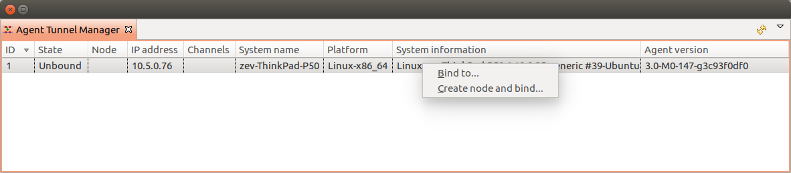
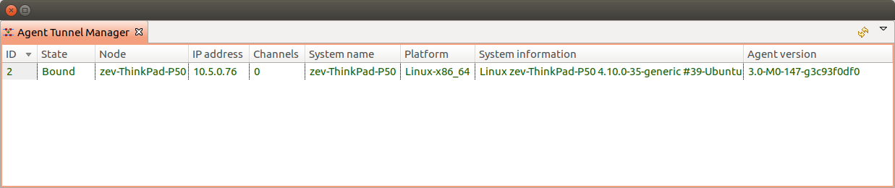

#################
Server management
#################

Configuration file
==================

File netxmsd.conf is a configuration file for |product_name| server. It contains
information necessary for establishing database connection, and some optional
server parameters. Default location for this file is :file:`/etc/netxmsd.conf`
on UNIX systems and :file:`InstalationPath\etc\netxmsd.conf` on Windows.

The file can contain one or more parameters in *Parameter = Value* form,
each parameter should be on its own line. Comments can be inserted after "#" sign.

Detailed list of parameters can be found there: :ref:`server_configuration_file`.

Configuration file example:

.. code-block:: cfg

  #
  # Sample server configuration file
  #

  DBDriver = mysql.ddr
  DBServer = localhost
  DBName = netxms_db
  DBLogin = netxms
  DBPassword = password
  LogFile = {syslog}

.. _server-tunnel-cert-conf:

Server configuration for Agent to Server connection / Tunnel connection
=======================================================================

|product_name| provides option to establish connection from agent to server. This requires
additional configuration on server and on agent sides. This chapter describes server
side configuration. Agent side configuration can be found in :ref:`agent-to-server-agent-conf-label`.
Agent to server connection is a :term:`TLS` tunnel carrying virtual server to agent connections.

Server configuration can be separated into two parts: initial configuration (certificate generation and
configuration) and node binding.

.. versionadded:: 2.2.3
    Tunnel automatic action options

Server provide option to configure automatic options on new unbound tunnel connection. Once new unbound
tunnel connection comes to server - idle timeout counter starts for this connection. If nothing done
while :guilabel:`AgentTunnels.UnboundTunnelTimeout` time, automatic action selected in
:guilabel:`AgentTunnels.UnboundTunnelTimeoutAction` will be executed.

There are 4 types of actions, that can be done automatically:
    1. Reset tunnel - close tunnel. It will be automatically reopened again by agent. This process will
       update information on server in case of change on agent.
    2. Generate event - generates event :guilabel:`SYS_UNBOUND_TUNNEL`, that later can be used for
       administrator notification or any other automatic action (see :ref:`event-processing`).
    3. Bind tunnel to existing node - will try to find correct node and bind tunnel to it. Node matching rules
       will be described further.
    4. Bind tunnel to existing node or create new node - will try to find correct node and bind tunnel to it.
       If node is not found new node will be created under container mentioned in :guilabel:`AgentTunnels.NewNodesContainer`
       server configuration parameter.  Node matching rules will be described further.

Node is matched for binding if:
    1. Zone UIN given by agent (is configured in agent configuration under :guilabel:`ZoneUIN`) match to node zone id
    2. IP given by agent match to node's IP address
    3. Hostname or FQDN match with node name

Initial configuration
---------------------

Certificate should be issued and added to the server configuration. This certificate
will be used to issue public certificates for agents. Certificate usage should allow
certificate signing. Certificates should be in PEM format. Server key should be
added to the certificate file or should be provided as a separate configuration parameter.

Certificate can be obtained in two ways:
    1. By sending :term:`CSR` request to your :term:`CA`
    2. Create self signed certificate

Settings in server configuration file:

.. list-table::
  :widths: 50 70 60
  :header-rows: 1

  * - Parameter
    - Description
    - Required
  * - TrustedCertificate
    - Certificate issued by certificate authority or self-signed :term:`CA`
      certificate. If certificate chain for server certificate is longer, all
      upper level certificates should be added to configuration file by adding
      multiple TrustedCertificate entries.
    - Yes
  * - ServerCertificate
    - Certificate issued by certificate authority. This certificate is used to
      issue agent certificates. ServerCertificate parameter also implies that
      this certificate is trusted by the server when checking agent certificate
      validity. 
    - Yes
  * - ServerCertificatePassword
    - Server certificate password.
    - Can be omitted if certificate does not use password.
  * - ServerCertificateKey
    - Server certificate private key.
    - Can be omitted if key is included in server certificate file.

Server configuration variable settings:

.. list-table::
  :widths: 50 70 60
  :header-rows: 1

  * - Parameter
    - Description
    - Default
  * - AgentTunnels.UnboundTunnelTimeoutAction
    - Action that will be executed after idle timeout. Actions are described here: :ref:`server-tunnel-cert-conf`
    - Reset tunnel
  * - AgentTunnels.UnboundTunnelTimeout
    - Tunnel idle timeout in seconds, that will be waited till automatic action execution.
    - 3600
  * - AgentTunnels.NewNodesContainer
    - Container name where newly created nodes will accrue. You can use ``->`` character pair to create
      subtree ( like ``Office->Tunnel``). If no container is set nodes will appear under :guilabel:`Entire Network`
    -

Self signed certificate sample
~~~~~~~~~~~~~~~~~~~~~~~~~~~~~~

This manual describes only simplest option: self signed certificate creation. It
does not contain any information about file access right assignment.

    #. Create private root key (add ``-aes256`` parameter to use password):
        :command:`openssl genrsa -out rootCA.key 2048`
    #. Create self signed root certificate:
        :command:`openssl req -x509 -new -key rootCA.key -days 10000 -out rootCA.crt`
    #. Create server key (add ``-aes256`` parameter to use password)
        :command:`openssl genrsa -out server.key 2048`
    #. Create :file:`openssl.conf` file. Content of file (dn section should be changed accordingly):

        .. code-block:: cfg

            [req]
            distinguished_name = dn
            req_extensions = v3_ca
            prompt = no

            [dn]
            countryName = LV
            stateOrProvinceName = Riga
            localityName = Riga
            organizationName = netxms.org
            commonName = Monitoring Server

            [v3_ca]
            basicConstraints = CA:TRUE

    #. Create server certificate request
        :command:`openssl req -new -key server.key -out server.csr -config openssl.conf`
    #. Sign server certificate with root CA certificate
        :command:`openssl x509 -req -in server.csr -CA rootCA.crt -CAkey rootCA.key -CAcreateserial -out server.crt -days 5000 -extfile openssl.conf -extensions v3_ca`

Add newly created certificates to server configuration (netxmsd.conf file).

.. code-block:: cfg

    TrustedCertificate = /opt/netxms/key/rootCA.crt
    ServerCertificate = /opt/netxms/key/server.crt
    ServerCertificateKey = /opt/netxms/key/server.key

Reissuing server certificate
----------------------------

When server certificate validity term is coming to an end or there are some
security considerations, server certificate can be reissued. There are two
options - server certificate can be reissued using same root CA or, if you use
self-signed root CA, it can also be reissued.

To perform a smooth transition from old to new server certificate, old
certificates can be specified as TrustedCertificate in server configuration
file. In this case agents with certificates issued based on the old server
certificate would still be able to connect, but new agent certificates will be
issued based on the new server certificate.

After all agents will receive agent certificate signed by the new server
certificate, old certificates can be removed from server configuration file.

Server configuration example if self-signed root CA was reissued:

.. code-block:: cfg

    # ~~~ Old root certificate ~~~
    TrustedCertificate = /opt/netxms/key/old_rootCA.crt

    # ~~~ Old server certificate ~~~
    TrustedCertificate = /opt/netxms/key/old_server_certificate.crt

    # ~~~ New root certificate ~~~
    TrustedCertificate = /opt/netxms/key/rootCA.crt

    # ~~~ New server certificate ~~~
    ServerCertificate = /opt/netxms/key/server.crt
    ServerCertificateKey = /opt/netxms/key/server.key

Node binding
------------

Once server certificates are configured and agent is correctly configured (:guilabel:`ServerConnection`
parameter set in agentd.conf) requests for agent to server connection will be shown in :guilabel:`Agent Tunnel Manager` view.

   Agent Tunnel Manager

User should manually accept them by binding to existing node :guilabel:`Bind...` or by creating
new one :guilabel:`Create node and bind...`. Once node will be bound - it's state in :guilabel:`Agent Tunnel Manager`
view will be changed to :guilabel:`Bound`.

   Agent Tunnel Manager

Configuration variables
=======================

These variables are stored in database and can be changed using
:guilabel:`Server Configuration Editor` :term:`view<View>` accessing it
:menuselection:`Configuration-->Server Configuration` or with help
of :file:`nxdbmgr`(example: :code:`nxdbmgr set <name> <value>`).

.. figure:: _images/server_configuration.png

   Server Configuration

Detailed description of each configuration can be found there: :ref:`server_configuration_parameters`.
Please note that changes to most of the settings will take effect only after server restart.

Synchronization between servers
===============================

|product_name| does not provide horizontal scalability for server. But there is option to exchange with
events between servers. Information about configuration can be found there: :ref:`forward_events`.
Event forward does not work with zones.

netxmsd commandline options
===========================

.. list-table::
  :widths: 30 70
  :header-rows: 1

  * - Command
    - Description
  * - -e
    - Run database check on startup
  * - -c <file>
    - Set non-default configuration file
      Default is {search}
  * - -d
    - Run as daemon/service
  * - -D <level>
    - Set debug level (valid levels are 0..9)
  * - -h
    - Display help and exit
  * - -p <file>
    - Specify pid file.
  * - -q
    - Disable interactive console
  * - -v
    - Display version and exit

.. _server-debug-console:

Server debug console
====================

Server debug console can be opened in Java console. It can be found in
:menuselection:`Tools -> Server Console`.

It can be used to check debug messages or to execute one of server
commands like "ldap sync".

.. figure:: _images/server_console.png

Server commands
---------------

.. list-table::
  :widths: 30 70
  :header-rows: 1

  * - Command
    - Description
  * - debug [<level>|off]
    - Set debug level (valid range is 0..9)
  * - down
    - Shutdown |product_name| server
  * - exec <script> [<params>]
    - Executes NXSL script from script library
  * - exit
    - Exit from remote session
  * - kill <session>
    - Kill client session
  * - get <variable>
    - Get value of server configuration variable
  * - help
    - Display this help
  * - ldapsync
    - Synchronize ldap users with local user database
  * - poll <type> <node>
    - Initiate node poll
  * - raise <exception>
    - Raise exception
  * - set <variable> <value>
    - Set value of server configuration variable
  * - show components <node>
    - Show physical components of given node
  * - show dbcp
    - Show active sessions in database connection pool
  * - show fdb <node>
    - Show forwarding database for node
  * - show flags
    - Show internal server flags
  * - show index <index>
    - Show internal index
  * - show modules
    - Show loaded server modules
  * - show objects
    - Dump network objects to screen
  * - show pollers
    - Show poller threads state information
  * - show queues
    - Show internal queues statistics
  * - show routing-table <node>
    - Show cached routing table for node
  * - show sessions
    - Show active client sessions
  * - show stats
    - Show server statistics
  * - show topology <node>
    - Collect and show link layer topology for node
  * - show users
    - Show users
  * - show vlans <node>
    - Show cached VLAN information for node
  * - show watchdog
    - Display watchdog information
  * - trace <node1> <node2>
    - Show network path trace between two nodes

Configuring self-monitoring
===========================

Database connection pool
========================

ICMP proxy
==========

To used ICMP proxy Ping subagent should be loaded for ICMP proxy node.

This proxy is used to check node availability when :ref:`Zones <zones>` are used.

.. figure:: _images/node_communications_tab.png
