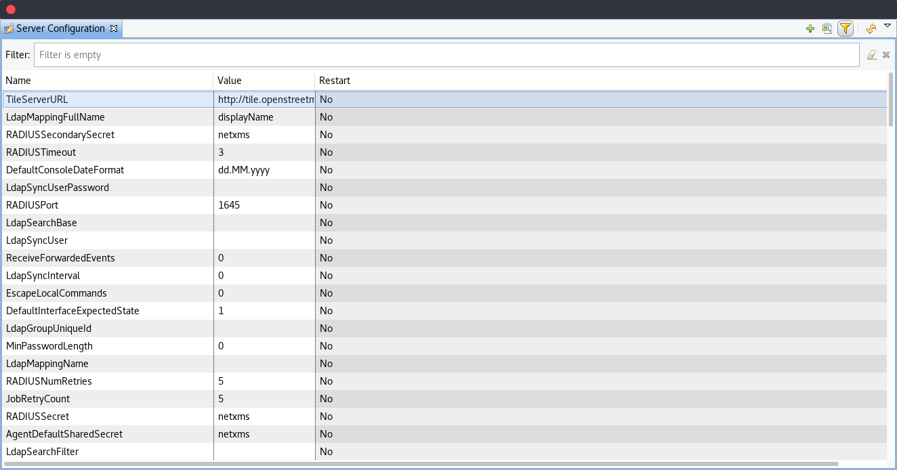
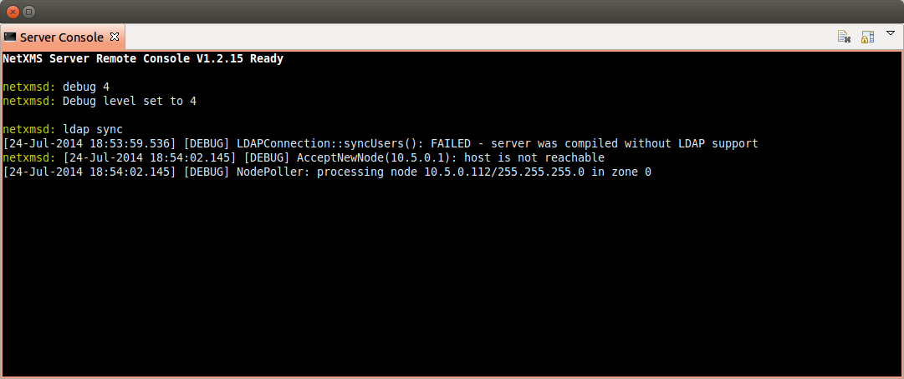

#################
Server management
#################

Configuration file
==================

File netxmsd.conf is a configuration file for NetXMS server. It contains 
information necessary for establishing database connection, and some optional 
server parameters. Default location for this file is :file:`/etc/netxmsd.conf`
on UNIX systems and :file:`InstalationPath\etc\netxmsd.conf on Windows`.

The file can contain one or more parameters in *Parameter = Value* form, 
each parameter should be on its own line. Comments can be inserted after "#" sign.

Detailed list of parameters can be found there: :ref:`server_configuration_file`.    
    
Configuration file example:

.. code-block:: cfg  

  #
  # Sample configuration file for NetXMS server
  #

  DBDriver = mysql.ddr
  DBServer = localhost
  DBName = netxms_db
  DBLogin = netxms
  DBPassword = password
  LogFailedSQLQueries = yes
  LogFile = {syslog}

  
Configuration variables
=======================

These variables are stored in database and can be changed using 
:guilabel:`Server Configuration Editor` :term:`view<View>` accessing it
:menuselection:`Configuration-->Server Configuration` or with help 
of :file:`nxdbmgr`(example: :code:`nxdbmgr set <name> <value>`).

   Server Configuration

Detailed description of each configuration can be found there: :ref:`server_configuration_parameters`.
Please note that changes to most of the settings will take effect only after server restart. 

Synchronization between servers
===============================

NetXMS does not provide horizontal scalability for server. But there is option to exchange with 
events between servers. Information about configuration can be found there: :ref:`forward_events`.
Event forward does not work with zones. 

netxmsd commandline options
===========================

.. list-table:: 
  :widths: 30 70
  :header-rows: 1

  * - Command 
    - Description
  * - -e
    - Run database check on startup
  * - -c <file>
    - Set non-default configuration file
      Default is {search}
  * - -d
    - Run as daemon/service
  * - -D <level>
    - Set debug level (valid levels are 0..9)
  * - -h
    - Display help and exit
  * - -p <file>
    - Specify pid file.
  * - -q
    - Disable interactive console
  * - -v
    - Display version and exit

    
.. _server-debug-console:

Server debug console
====================

Server debug console can be opened in Java console. It can be found in 
:menuselection:`Tools -> Server Console`.

It can be used to check debug messages or to execute one of server 
commands like "ldap sync".

Server commands can be executed also through XMPP. To execute server command 
through XMPP should be fulfill next requirements:

  1. Server connection with XMPP should be configured in server configuration variables: 
     :guilabel:`XMPPLogin`, :guilabel:`XMPPPassword`, :guilabel:`XMPPPort`, 
     :guilabel:`XMPPServer`, :guilabel:`EnableXMPPConnector`. 
  2. XMPP user that will send commands should be connected with NetXMS user by pointing 
     it's XMPP name in :guilabel:`XMPP ID` filed of General tab of NetXMS user 
     properties. 
  3. NetXMS user that will execute this commands should also have 
     :guilabel:`Execute commands via XMPP` access right. 
  
Execution is done sending server command like a message to the user defined in 
:guilabel:`XMPPLogin` server configuration variable. 
   
Server commands
---------------

.. list-table:: 
  :widths: 30 70
  :header-rows: 1

  * - Command 
    - Description
  * - debug [<level>|off]
    - Set debug level (valid range is 0..9)
  * - down 
    - Shutdown NetXMS server
  * - exec <script> [<params>]
    - Executes NXSL script from script library
  * - exit
    - Exit from remote session
  * - kill <session>
    - Kill client session
  * - get <variable>
    - Get value of server configuration variable
  * - help
    - Display this help
  * - ldapsync
    - Synchronize ldap users with local user database
  * - poll <type> <node>
    - Initiate node poll
  * - raise <exception>
    - Raise exception
  * - set <variable> <value>
    - Set value of server configuration variable
  * - show components <node>
    - Show physical components of given node
  * - show dbcp
    - Show active sessions in database connection pool
  * - show fdb <node>
    - Show forwarding database for node
  * - show flags
    - Show internal server flags
  * - show index <index> 
    - Show internal index
  * - show modules
    - Show loaded server modules
  * - show objects
    - Dump network objects to screen
  * - show pollers
    - Show poller threads state information
  * - show queues
    - Show internal queues statistics
  * - show routing-table <node>
    - Show cached routing table for node
  * - show sessions
    - Show active client sessions
  * - show stats
    - Show server statistics
  * - show topology <node>
    - Collect and show link layer topology for node
  * - show users
    - Show users
  * - show vlans <node>
    - Show cached VLAN information for node
  * - show watchdog
    - Display watchdog information
  * - trace <node1> <node2>
    - Show network path trace between two nodes
    

Configuring self-monitoring
===========================

Database connection pool
========================

ICMP proxy
==========

To used ICMP proxy Ping subagent should be loaded for ICMP proxy node. 

This proxy is used to check node availability when :ref:`Zones <zones>` are used. 

.. figure:: _images/node_communications_tab.png
