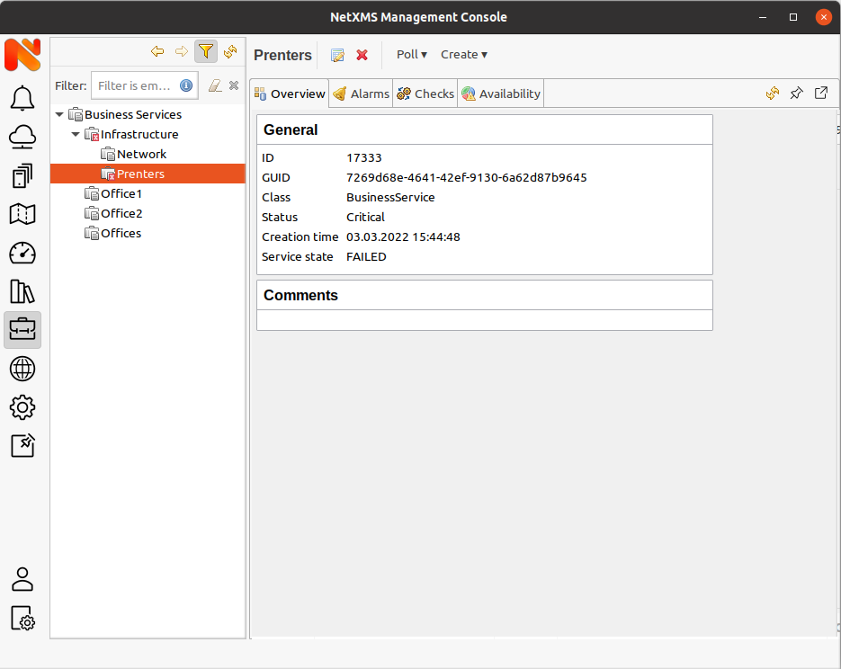
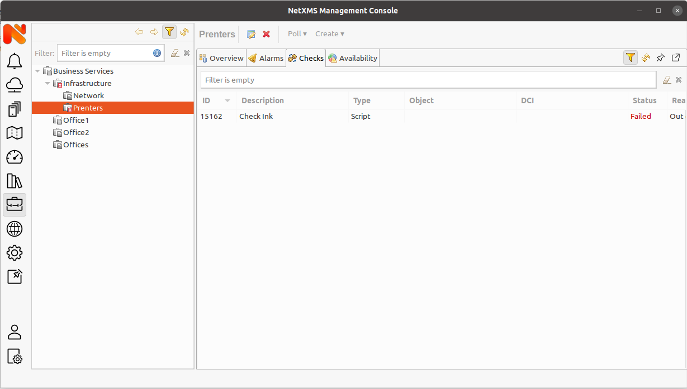
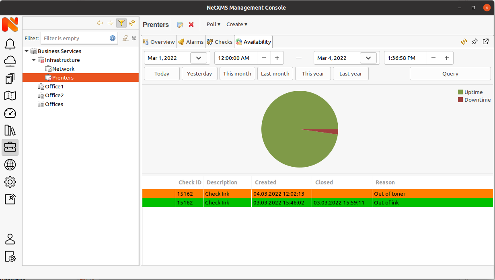

.. _sla:

#################
Business services
#################

Introduction
============

In a nutshell, Business Services is a tool for availability monitoring of
logical services. Company email, web site, server farm, call center - all are
examples of logical services. Moreover, the services can be combined together
to define a "broader" logical service. Company email, web site, name server and
firewall all can be referred to as "Company Internet Services" and monitored
for availability as a whole. So if the name server goes down then the "Company
Internet Services" do not function properly as a whole. This feature can be
used both for internal QA and external Service Level Agreement (SLA)
monitoring.

Business service object
=======================

Business Service
----------------

Business Services represented with service checks and a tree-like hierarchy of 
other business services. For each service in the hierarchy, |product_name| keeps 
track of all downtime cases so later user can request to calculates availability 
percentage for required time period. To check availability at any particular level, 
select Business Service object in the :guilabel:`Object Browser`, choose 
:guilabel:`Availability` tab and select time period.

Business service contains two NXSL scripts in configuration: for object automatic 
binding and for DCI automatic binding. Those scripts can be used to automatically 
populate Business service with recurses that require monitoring. Service checks 
can be automatically created or removed if "Auto remove" filter option is selected.

Service check
-------------

Service check is a test whose result is used to define the state of the service. 
There can be 3 types of checks: DCI check, object check and NXSL script. Service 
check can have one of statuses: OK, Failed or Degraded. Degraded status means that 
object ot DCI status is not Normal, but is less worse then threshold for this check, 
this state will not change state of business service to failed. 

DCI check
~~~~~~~~~

DCI check is based on the status of DCI. DCI status is calculated form the status 
of threshold (if it is active) and severity of active threshold. DCI check has it's 
own stats threshold starting from which check is counted as failed. Threshold can be 
set per check or per server in "BusinessServices.Check.Threshold.DataCollection" 
server configuration variable.

Object check
~~~~~~~~~~~~

Object check is based on object status. Object check has it's own stats threshold 
starting from which check is counted as failed. Threshold can be set per check or 
per server in "BusinessServices.Check.Threshold.Objects" server configuration 
variable.

NXSL script check 
~~~~~~~~~~~~~~~~~

NXSL script check either returns success (the test result ok) or failure (the 
service has failed). For success "true" should be return, and "false" for failure.
In addition failure reason can be returned form the script, in this case just 
text with the reason should be returned to fail service check. 

There are the following special variables which can be
used in NXSL scripts for service checks:

- $node - points to the current node (if set) the check is being executed for

Business service prototype
==========================

To avoid redefinition of the same business service multiple times (for multiple
clients or infrastructure items) you can create business service prototype. The 
principle behind business service prototype is very similar to DCI instance 
discovery. There is instance discovery options and script to filter it. Based on 
investigated instance count and valued business services are created. Further in 
each business service instance value is available in auto apply scripts for DCI 
and object. 

Configuration and usage
=======================

For both configuration and monitoring use :guilabel:`Business Service`
perspective.

   Business service perspective

Configuration
-------------

To define a new service select :guilabel:`Create business service` from the
context menu in :guilabel:`Object Browser` and enter the service name. Then
in newly created service you may want to define checks or define check auto 
apply scripts in business service properties. 

   Business service checks

Business service prototype is defined the same way, but it is required also 
Instance Discovery method to be set on the creation. 

Monitoring
----------

Business service availability for exact period can be checked using 
:guilabel:`Availability` tab. It has predefined time ranges and a date selector 
for arbitrary date range. It shows as well detailed information about problems 
occurred for a business service, start time, end time and reason.

   Availability pie chart and details
