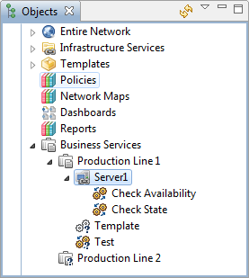
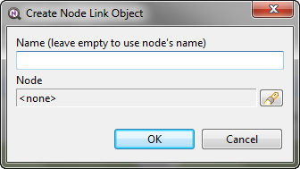
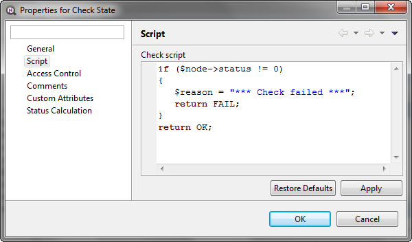
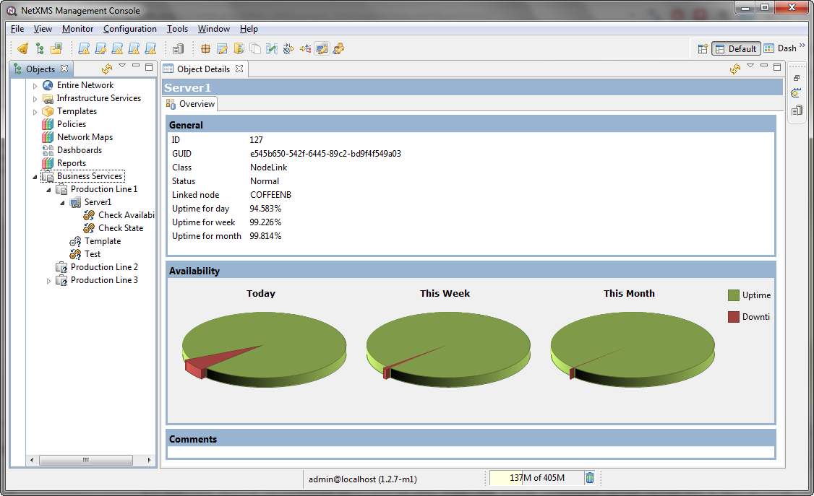

.. _sla:

#########################
Business services and SLA
#########################

Introduction
============

In a nutshell, Business Services is a tool for availability monitoring of
logical services. Company email, web site, server farm, call center - all are
examples of logical services. Moreover, the services can be combined together
to define a "broader" logical service. Company email, web site, name server and
firewall all can be referred to as "Company Internet Services" and monitored
for availability as a whole. So if the name server goes down then the "Company
Internet Services" do not function properly as a whole. This feature can be
used both for internal QA and external Service Level Agreement (SLA)
monitoring.

Services, node links, service checks
====================================

Service
-------

Business Services represented with a tree-like hierarchy of nested logical
services, nodes and service checks. One can think of a service as a container
consisting of other services, service checks and nodes linked to service
checks. In |product_name| terminology the last is called node link. For each service in
the hierarchy, |product_name| calculates availability percentage and keeps track of all
downtime cases. To check availability at any particular level, select it in the
:guilabel:`Object Browser` or choose :guilabel:`Availability Chart` from the
context menu.

Node link
---------

Node link is a reference to any node with one or more service checks attached
to this node.

Service check
-------------

Service check is a test whose result is used to define the state of the
service. A service check may belong to the specific node (node link) or
directly to the service. A service check object contains NXSL script which
either returns success (the test result ok) or failure (the service has
failed). There are the following special variables and constants which can be
used in NXSL scripts for service checks:

- $node - points to the current node the check is being executed for
- $reason - the script may set the reason of failure
- OK - constant, indicates success
- FAIL - constant, indicates failure

Service check templates
~~~~~~~~~~~~~~~~~~~~~~~

To avoid redefinition of the same service check multiple times (for multiple
nodes) you can create service check templates. The principle behind service
check template is very similar to :ref:`data-collection-templates`. There are
two notable differences though:

- A service check template is always applied automatically to every new node
  (node link) added to the service
- A service check template is applied to nodes in the current level in the
  service tree and in all levels below

Configuration and usage
=======================

For both configuration and monitoring use :guilabel:`Business Service`
container in the :guilabel:`Object Browser` view.

   Object Browser with Services

Configuration
-------------

To define a new service select :guilabel:`Create business service` from the
context menu in :guilabel:`Object Browser` and enter the service name. Then
under newly created service you may want to define other services, checks or
node links. You can examine or alter properties of the service.

If your service check relies on specific nodes then you need to create node
links by selecting :guilabel:`Create node link` from the context menu:

   Create Node Link

One or more service checks must be defined for every node link. Service check
can be also defined at a business service level. In the latter case it is not
connected to any particular node and can be used for some general calculations
(e.g. based on some server stats). To create a check select :guilabel:`Create
service check` from the context menu, enter the check name and navigate to
:guilabel:`Script` tab in object properties:

   Service Check Properties

Monitoring
----------

All business service calculations performed in real time. The system calculates
uptime values for a day, a week and a month for each business service defined.
As soon as the uptime value changes it shows in the :guilabel:`Object Details`
screen for the service:

Alternatively you can view the availability screen in a slightly different
format by selecting :guilabel:`Availability chart` from the context menu.
