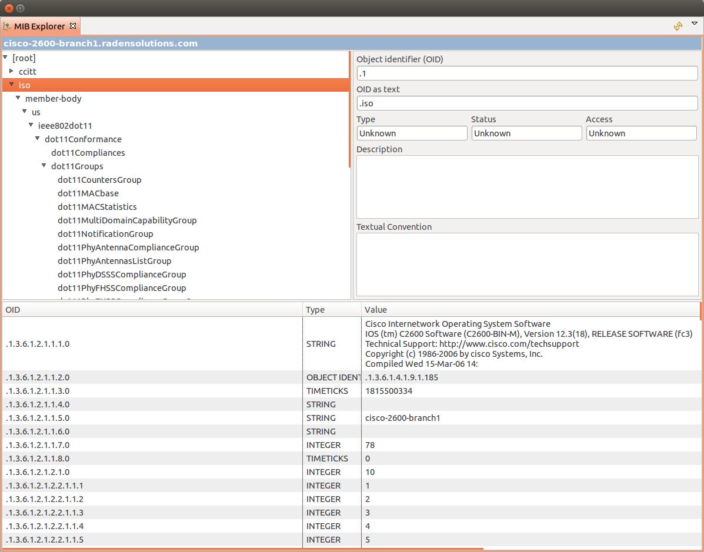
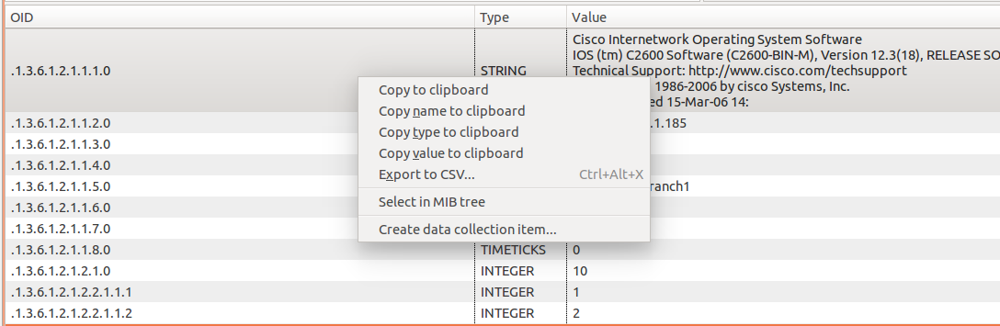
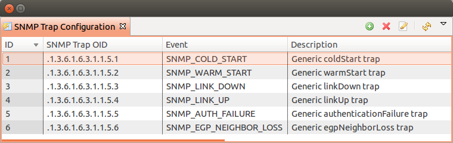
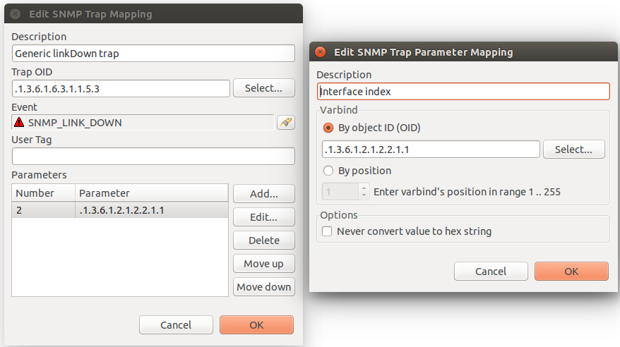
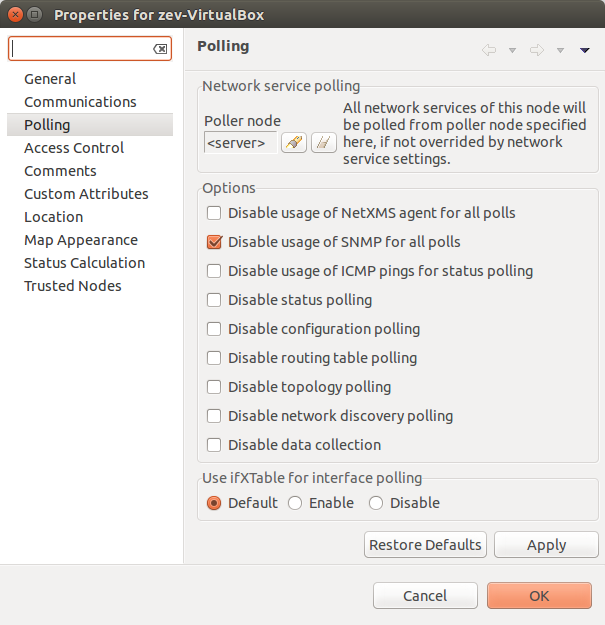

.. _snmp:

####
SNMP
####

MIB Explorer
============

MIB browser shows all loaded MIB configurations, and allows to run :term:`SNMP` 
walk on a selected node :term:`nodes <Node>`. Node can be selected in browser 
by selecting :guilabel:`Set node object...` option in view menu or by opening 
:guilabel:`MIB Explorer` from node menu. 

To run walk user should select line of tree from were will be requested all data. 
By walk will be requested all OID subtree of selected item. 

After walk is done it's results will shown in the table below.

There are next options available for results:
  - Copy result line to clipboard
  - Copy name of selected line to clipboard
  - Copy type of selected line to clipboard
  - Copy value of selected line to clipboard
  - Export selected lines to CSV
  - Show selection in MIB tree
  - Create DCI form selected item 

SNMP Trap Configuration
=======================

In this view is configured which event will be generated on exact trap OID and 
which OID data will be used as event parameter data. 

In SNMP Trap mapping configuration window can be set next parameters:

  - Description of mapping rule
  - Trap OID or trap OID group with many subtree OIDs, matching OID will be given 
    to event as $1 parameter
  - Event that will be generated on selected Trap OID
  - User Tag is special event attribute, that can be got by %u macros or as attribute 
    of event class. This attribute can be set there or by script. 
  - Parameters - OID values that will be passed to event as $2, $3, $4... parameters

In parameter configuration(:guilabel:`Edit SNMP Trap Parameter Mapping`) can be 
configured next things:

  - Description of a parameter
  - Select if parameter should be found by OID or by position in the message
  - Option not to convert value to hex string. If string contains not readable 
    symbols(symbol number less than space symbol number) it will be automatically 
    converted to hex string, this option is required to prevent auto conversion. 

Setting default SNMP credentials
================================

Default SNMP credentials can be set in :guilabel:`Network Discovery` section. It does not 
matter if credentials are used for adding nodes manually, through network 
discovery or with help of agent registration - in each case :guilabel:`Network Discovery` 
configuration value will be checked. More about :guilabel:`Network Discovery` view 
can be found :ref:`there<network-discovery>`.

Using ifTable and ifXTable
==========================

There are 2 types of subtree that provides information about interfaces: old one 
ifTable and new one ifXTable. Sometimes usage of new one creates error situations.
In this situation ifXTable can be disabled. This can be done in Properties of 
:term:`node <Node>` in :guilabel:`Polling`. Or this configuration can be set 
globally by changing ``UseIfXTable`` server configuration parameter.

Configure SNMP Proxy
====================

If there is need to monitor nodes behind firewall using SNMP, there is option 
to install on one of the nodes NetXMS agent, open all required ports for this node 
and send SNMP request to other nodes in this subnet through installed agent. 

Proxy configuration can be done wile creation of node of for already created node 
can be change in :guilabel:`Communications` tab of node properties. To configure
proxy node select node in object selector :guilabel:`SNMP Proxy`.

.. figure:: _images/create_node.png

.. figure:: _images/node_communications_tab.png

Agent configuration
-------------------

To enable SNMP proxy "EnableSNMPProxy" parameter should be set to "yes".

Configure SNMP Trap Proxy
=========================

It is possible to proxy SNMP traps. 

In this case as a destination of traps should be set the proxy node.

Agent configuration
-------------------

To enable trap proxy "EnableSNMPTrapProxy" parameter should be set to "yes".

Optionally can be configured also "SNMPTrapListenAddress" and "SNMPTrapPort". 
Default values can be checked there: :ref:`master-configuration-file-label`

Server configuration
--------------------

By default traps are accepted only from known nodes. To accept all traps
set "LogAllSNMPTraps" server configuration variable to 1. 

To correctly send response for SNMPv3, it should be also configured 
the proxy node for the sender node. It is done in sender node 
properties in "Communications" tab, SNMP section. 

Import MIB
==========

MIB files (MIBs) describe structure of information transferred via SNMP. 
Every device can support multiple MIBs, some of them are standard and 
public, other can be proprietary and vendor specific. NetXMS uses compiled 
MIBs to allow you to select OID and see its description (for example when 
selecting SNMP data for DCI collection). You do not need to compile new 
MIBs if you are OK with direct input of OID.

Compiling MIBs
--------------

 - Change suffix of your new MIB file to .txt
 - Copy your MIB file to /usr/share/netxms/mibs
 - Use nxmibc binary to create a new compiled MIB file from all MIBs in directory. 
   Add parameter -z for compressed output file.
   
.. code-block:: shell

  nxmibc -d /usr/share/netxms/mibs -o /usr/share/netxms/mibs/netxms.mib
  
Parameters recognized by nxmibc:

.. code-block:: shell

  nxmibc [options] source1 ... sourceN

  Valid options:
    -d <dir>  : Include all MIB files from given directory to compilation
    -o <file> : Set output file name (default is netxms.mib)
    -P        : Pause before exit
    -s        : Strip descriptions from MIB objects
    -z        : Compress output file
    
Troubleshooting
---------------

If nxmibc fails, it may be caused by syntax or import errors in your MIB. 
Try to check it with smilint (part of net-snmp package) and correct any 
errors on level 3.
