.. _snmp:

####
SNMP
####

SNMP Drivers
============

Various SNMP devices might require special measures to get information, e.g. 
some devices provide additional information for interfaces only under vendor OIDs, etc. 
To address this, |product_name| provides a concept of SNMP drivers. SNMP driver is detected automatically. 

If SNMP driver was not automatically detected, it's possible to set it manually by specifying driver name in custom attribute ``snmp.driver`` on a node. 

Possible SNMP driver names are: 
  - AT
  - BAYSTACK
  - CAMBIUM-CNPILOT
  - CAMBIUM-EPMP
  - CATALYST-2900XL
  - CATALYST-GENERIC
  - CISCO-ESW
  - CISCO-GENERIC
  - CISCO-NEXUS
  - CISCO-SB
  - CISCO-WLC
  - DELL-PWC
  - DLINK
  - ERS8000
  - EXTREME
  - H3C
  - HPSW
  - IGNITENET
  - JUNIPER
  - MIKROTIK
  - MOXA-EDR
  - NET-SNMP
  - NETONIX
  - NETSCREEN
  - NTWS
  - OPTIX
  - PING3
  - PROCURVE
  - QTECH-OLT
  - RITTAL
  - SAF-INTEGRA-B
  - SYMBOL-WS
  - TB
  - UBNT-EDGESW
  - UBNT-AIRMAX
  - WESTERSTRAND

.. _mib_explorer:

MIB Explorer
============

MIB browser shows all loaded MIB configurations, and allows to run :term:`SNMP`
walk on a selected node :term:`nodes <Node>`. Node can be selected in browser
by selecting :guilabel:`Set node object...` option in view menu or by opening
:guilabel:`MIB Explorer` from node menu.

.. figure:: _images/MIB_Explorer.png

To run walk user should select line of tree from were will be requested all data.
By walk will be requested all OID subtree of selected item.

After walk is done it's results will shown in the table below.

.. figure:: _images/snmp_walk_result_menu.png

There are next options available for results:
  - Copy result line to clipboard
  - Copy name of selected line to clipboard
  - Copy type of selected line to clipboard
  - Copy value of selected line to clipboard
  - Export selected lines to CSV
  - Show selection in MIB tree
  - Create DCI from selected item

SNMP Trap Configuration
=======================

In this view is configured which event will be generated on exact trap OID and
which OID data will be used as event parameter data.

.. figure:: _images/snmp_trap_configuration.png

In SNMP Trap mapping configuration window can be set next parameters:

  - Description of mapping rule
  - Trap OID or trap OID group with many subtree OIDs, matching OID will be given
    to event as $1 parameter
  - Event that will be generated on selected Trap OID
  - User Tag is special event attribute, that can be got by %u macros or as attribute
    of event class. This attribute can be set there or by script.
  - Parameters - OID values that will be passed to event as $2, $3, $4... parameters

In parameter configuration(:guilabel:`Edit SNMP Trap Parameter Mapping`) can be
configured next things:

  - Description of a parameter
  - Select if parameter should be found by OID or by position in the message
  - Option not to convert value to hex string. If string contains not readable
    symbols(symbol number less than space symbol number) it will be automatically
    converted to hex string, this option is required to prevent auto conversion.

.. figure:: _images/snmp_trap_mapping_configuration.png

.. _default_snmp:

Default SNMP credentials
========================

Default SNMP credentials can be set in :menuselection:`Configuration --> SNMP Credentials`.
It does not matter if credentials are used for adding nodes manually, through network
discovery or with the help of agent registration - in each case :guilabel:`SNMP Credentials`
configuration value will be checked.

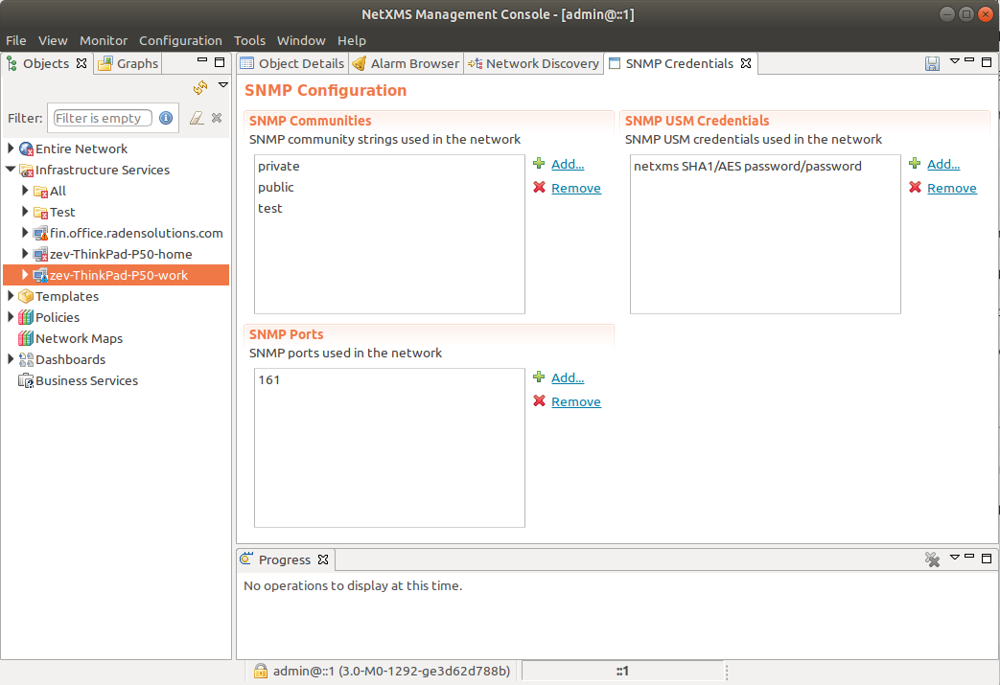

Using ifTable and ifXTable
==========================

There are 2 types of subtree that provides information about interfaces: old one
ifTable and new one ifXTable. Sometimes usage of new one creates error situations.
In this situation ifXTable can be disabled. This can be done in Properties of
:term:`node <Node>` in :guilabel:`Polling`. Or this configuration can be set
globally by changing ``UseIfXTable`` server configuration parameter.

.. figure:: _images/node_polling_tab.png

Configure SNMP Proxy
====================

If there is need to monitor nodes behind firewall using SNMP, there is option
to install on one of the nodes |product_name| agent, open all required ports for this node
and send SNMP request to other nodes in this subnet through installed agent.

Proxy configuration can be done wile creation of node of for already created node
can be change in :guilabel:`Communications` tab of node properties. To configure
proxy node select node in object selector :guilabel:`SNMP Proxy`.

.. figure:: _images/create_node.png

.. figure:: _images/node_communications_tab.png

Agent configuration
-------------------

To enable SNMP proxy "EnableSNMPProxy" parameter should be set to "yes".

Configure SNMP Trap Proxy
=========================

It is possible to proxy SNMP traps.

In this case as a destination of traps should be set the proxy node.

Agent configuration
-------------------

To enable trap proxy "EnableSNMPTrapProxy" parameter should be set to "yes".

Optionally can be configured also "SNMPTrapListenAddress" and "SNMPTrapPort".
Default values can be checked there: :ref:`master-configuration-file-label`

Server configuration
--------------------

By default traps are accepted only from known nodes. To accept all traps
set "LogAllSNMPTraps" server configuration variable to 1.

To correctly send response for SNMPv3, it should be also configured
the proxy node for the sender node. It is done in sender node
properties in "Communications" tab, SNMP section.

.. _import-mib:

Import MIB
==========

MIB files (MIBs) describe structure of information transferred via SNMP.
Every device can support multiple MIBs, some of them are standard and
public, other can be proprietary and vendor specific. |product_name| uses compiled
MIBs to allow you to select OID and see its description (for example when
selecting SNMP data for DCI collection). You do not need to compile new
MIBs if you are OK with direct input of OID.

Manage User MIBs
----------------

To add additional MIBs go to :guilabel:`Configuration` --> :guilabel:`SNMP MIB files`. 
Upload mib files with extension **.mib** and hit compile button. MIB compilation log will 
be visible in :guilabel:`Output` tab and warnings/errors will be added to 
:guilabel:`Error Log` tab. Afret MIB files are succesfully compiled all opened clients  
automatically dowload new version form server. 

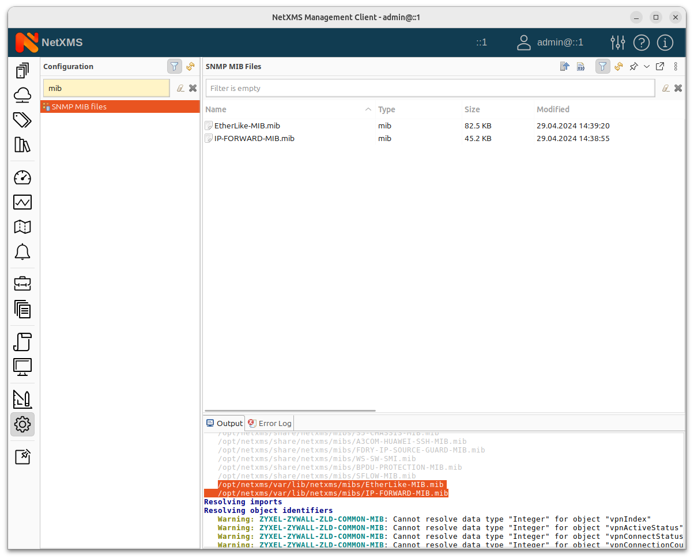

For versions older 5.0
----------------------

Compiling MIBs
~~~~~~~~~~~~~~

 - Change suffix of your new MIB file to .txt
 - Copy your MIB file to /usr/share/netxms/mibs
 - Use nxmibc binary to create a new compiled MIB file from all MIBs in directory.
   Add parameter -z for compressed output file.

.. code-block:: shell

  nxmibc -d /usr/share/netxms/mibs -o /var/lib/netxms/netxms.mib

Parameters recognized by nxmibc:

.. code-block:: shell

  nxmibc [options] source1 ... sourceN

  Valid options:
    -d <dir>  : Include all MIB files from given directory to compilation
    -o <file> : Set output file name (default is netxms.mib)
    -P        : Pause before exit
    -s        : Strip descriptions from MIB objects
    -z        : Compress output file

Troubleshooting
~~~~~~~~~~~~~~~

If nxmibc fails, it may be caused by syntax or import errors in your MIB.
Try to check it with smilint (part of net-snmp package) and correct any
errors on level 3.

.. _snmp-table:

Working with the SNMP Tables
============================

When we do SNMP walk the resulting SNMP table item OIDs consist of three 
parts. For the sake of our explanation, we will mark these parts with the 
letters:

**XXXYYYNNN**, where 

**XXX** is part that does not change — we can call it a Table base OID;
**YYY** is part that represents different columns;
**NNN** is the instance part. The instance part represents rows in the table.

Now, as an example, we can imagine the table with base ".1.3.6.1.2.1.2.2.1" 
like the one below:

.. list-table::
  :widths: 50 30 70 50 50 50 50
  :stub-columns: 1
  :header-rows: 1

  * - .1.3.6.1.2.1.2.2.1
    - .1
    - .2
    - .3
    - .4
    - .5
    - .6
  * - .1
    - 1
    - lo
    - 24
    - 65536
    - 10000000
    - 
  * - .2
    - 2
    - VMware VMXNET3 Ethernet Controller
    - 6
    - 1500
    - 4294967295
    - 005056A5BA4D

In this table the columns are **YYY** numbers (that are usually single numbers 
in ascending order), and the rows are the **NNN** number. 

In this table the columns are **YYY** numbers (that are usually single numbers in ascending order), and the rows are the NNN number. 

.. topic:: Example

  So, in order to get the "lo" value we should request ".1.3.6.1.2.1.2.2.1.2.1", 
  where ".1.3.6.1.2.1.2.2.1" represent **XXX**, ".2" (the value in the column where "lo" 
  is situated) represents the **YYY** and ".1" (the value in the row where "lo" is situated) 
  represents the **NNN**.

How to Create a Table
---------------------

To create a table, use the table base and the column part OID (**XXXYYY**).
 
In this way, taking as the example the SNMP table shown above, "1.3.6.1.2.1.2.2.1.1" can 
be used as the metric for the DCI cofniguration. 

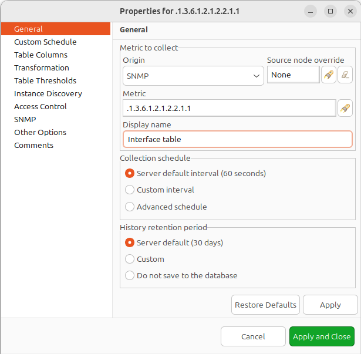

  General Page

Moreover, we can use any table column for configuraiton (in the example in the sentence 
above, we used the ".1" column, as you rightly understood), that returns non-empty results 
in MIB Explorer, as they will be used to make the SNMP walk to get all the instances. 

As for the columns — each of those you'd like to monitor should then be added to the 
:guilabel:`Table Columns` property page. 

In our case they could be:

  1. Add index column .1.3.6.1.2.1.2.2.1.1
  2. Add description .1.3.6.1.2.1.2.2.1.2
  3. Add Physical address .1.3.6.1.2.1.2.2.1.6
  4. Add MTU .1.3.6.1.2.1.2.2.1.4...

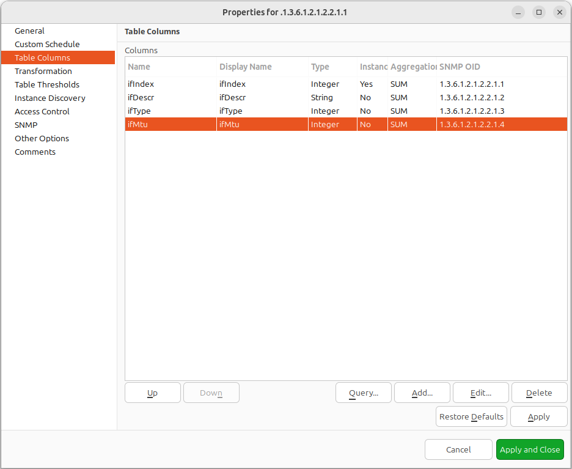

  Table Columns configuration 

Another option to add columns is to click :guilabel:`Query...` button. Automatic table columns qery is 
done by SNMP Walk on Metric OID where column patr is cut out.

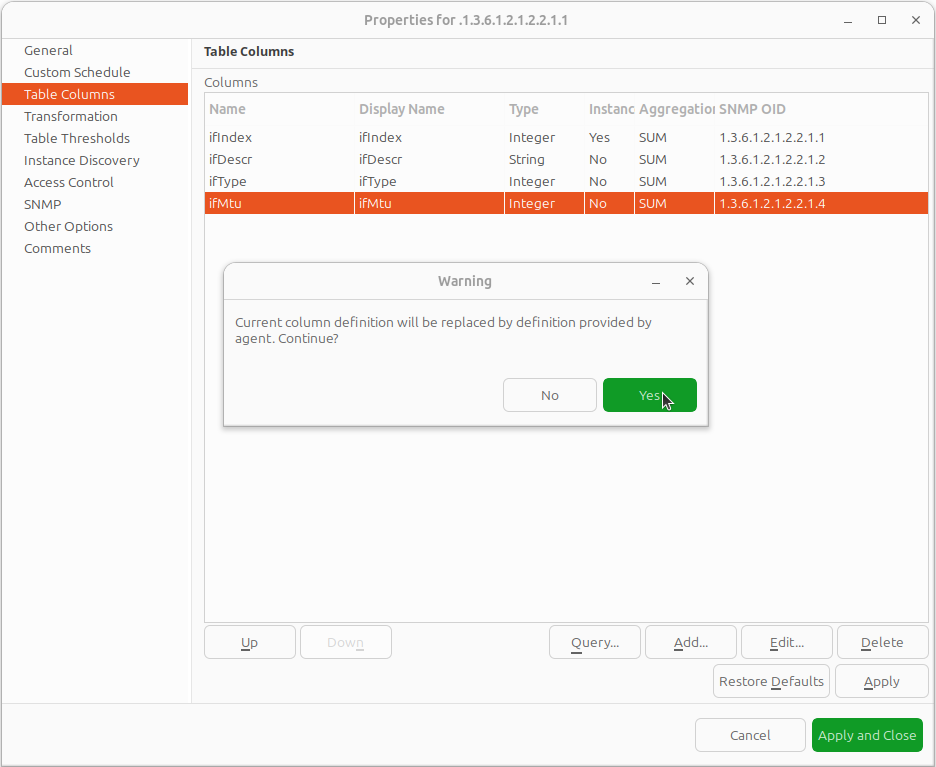

  Query warning

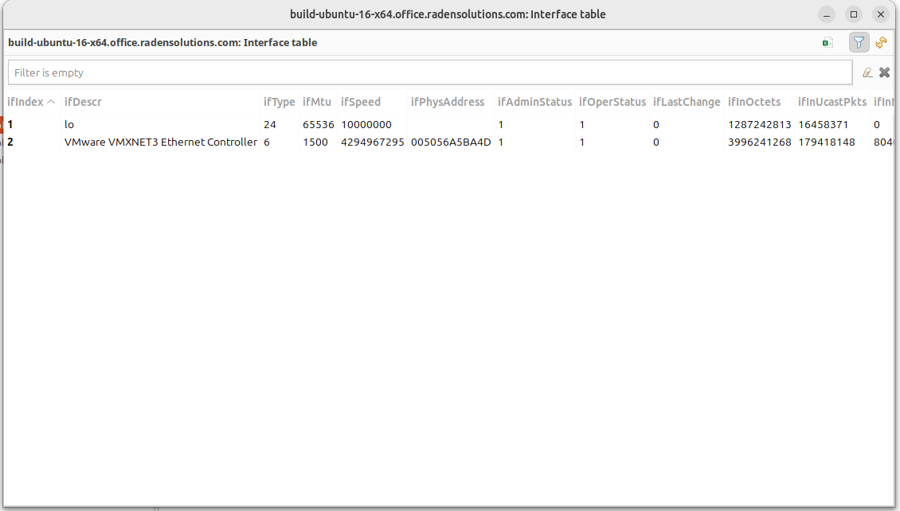

  Configured table

.. list-table::
  :widths: 50 70 60 50 50
  :stub-columns: 1
  :header-rows: 1

  * - .1.3.6.1.2.1.4.35.1
    - .4
    - .5
    - .6
    - .7
  * - .2.1.4.10.5.5.1
    - 00 23 7D 5F 27 BB
    - 428943151
    - 3
    - 1
  * - .2.1.4.10.5.5.20
    - 00 50 56 A5 3D 86
    - 428943151
    - 3
    - 1

We can see in the table above that the instance OID can also be a string of multiple numbers 
with dots. In the case of a physical address map instance, OID part will contain IP address. 

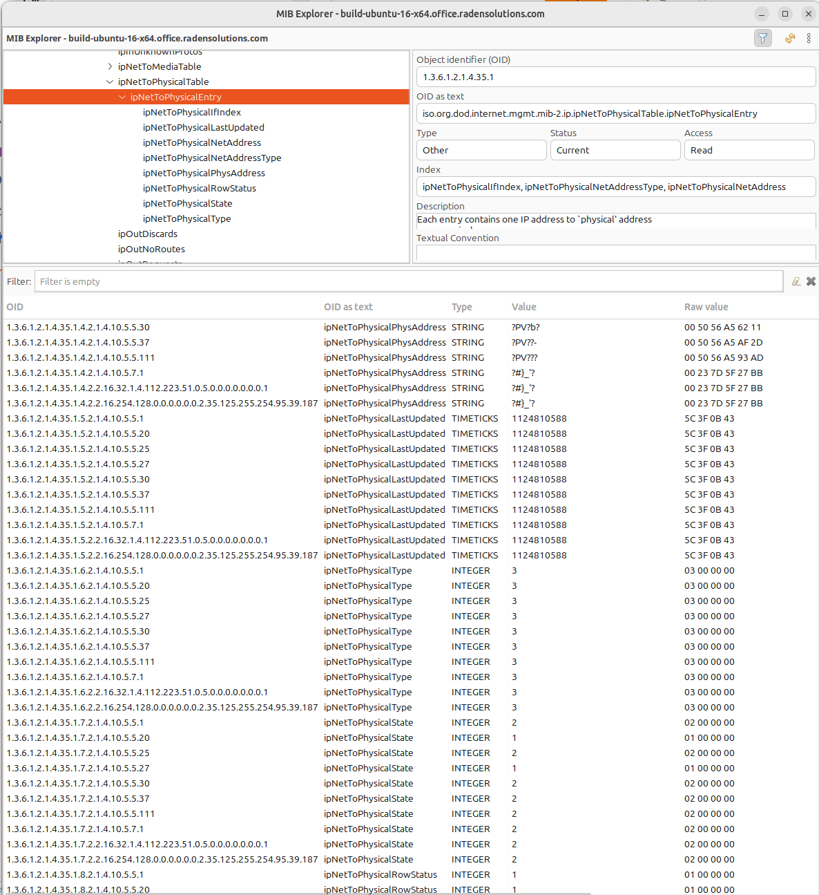

  Physical Address MIB Explorer

Another difference with the first example can be determined by executing the SNMP walk for 
the table above. The device returns values only for the columns with the OIDs ".4", ".5", 
".6", ".7", ".8".  

If we do walk for the "1.3.6.1.2.1.4.35.1.1" table column, it will return us empty result. 
This also should be taken into consideration when we create a table with physical 
addresses - only columns that return indexes can be used for the Metric field in the DCI 
Table creation property page. 

Table Thresholds and Instance Columns
-------------------------------------

When setting up table thresholds, it's helpful to understand instance columns. An instance 
column is similar to a primary key in a database — it's the unique ID. 
In |product_name|, this is known as an instance- or key column. It is possible to set multiple 
columns as instance columns, similar to composite keys in databases.
However, if instance columns aren't defined, and rows change order between polling periods, 
it can trigger false threshold alerts. 
The system might register that a different row is exceeding a threshold when, in fact, the 
same data is present, just in a different row. Specifying an instance column can mitigate 
this confusion.

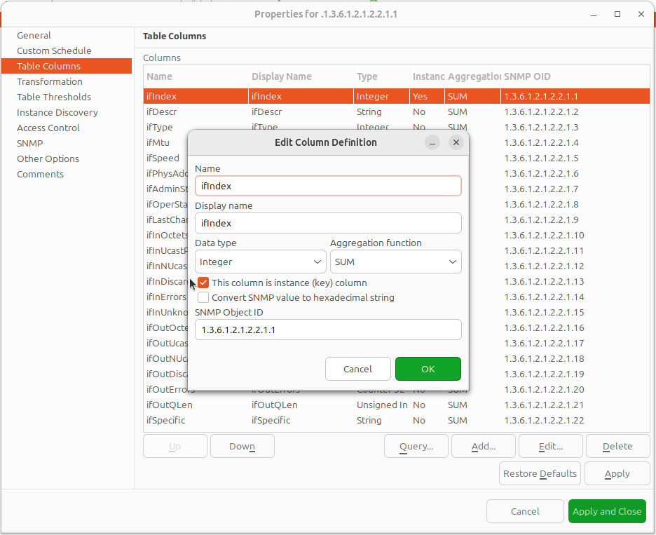

  Table columns configuration — editing column definition 

As you see, the |product_name| table metrics are a powerful tool for collecting and managing a 
wealth of network data. While they can be more complex to set up and require more storage 
than single with similar content, they present a great possibility to view more complex 
sets of data.

Configuration example
---------------------

In order to show how table metrics are configured in |product_name|, and how to distinguish what 
each part of it represents, we will go to the MIB explorer and use one of the tables in 
the system. 

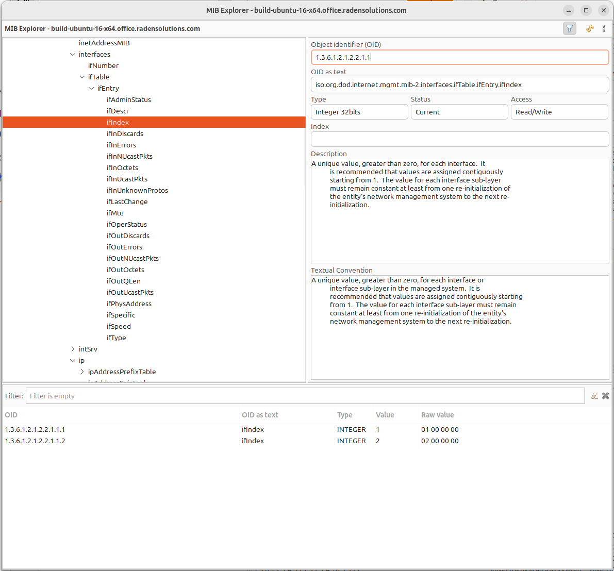

In this picture we can see the table OID "1.3.6.1.2.1.2.2.1". After the "1.3.6.1.2.1.2.2.1" 
goes ".1", that represents the column OID. 
So in OID search field we have "1.3.6.1.2.1.2.2.1.1" — the table column OID. And as a result 
of the MIB walk for the given OID we get 2 instances "1.3.6.1.2.1.2.2.1.1.1" and 
"1.3.6.1.2.1.2.2.1.1.2". 

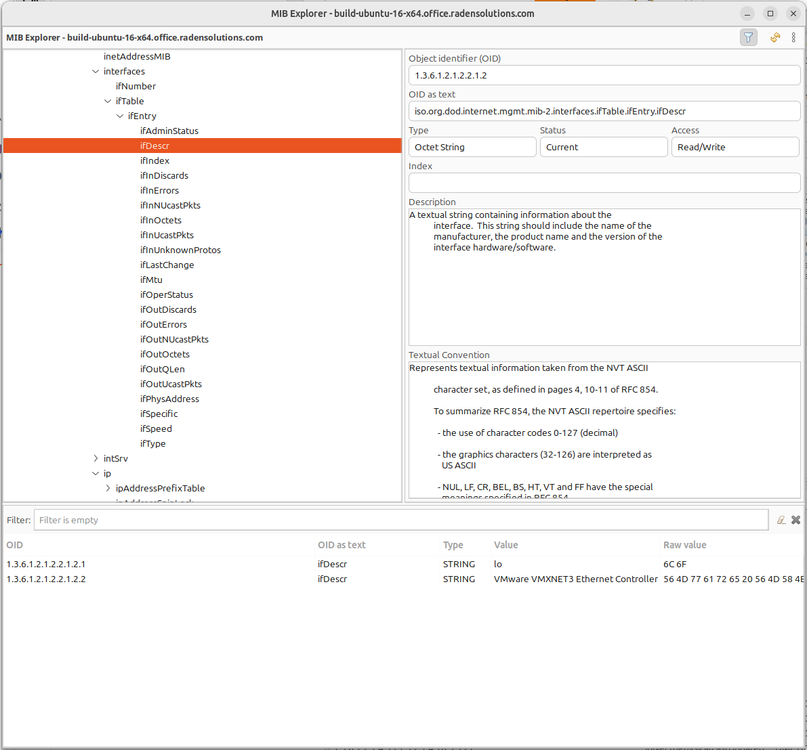

We can make the MIB walk for another table column "1.3.6.1.2.1.2.2.1.2" and get the same two 
instances, just for another column: "1.3.6.1.2.1.2.2.1.2.1" and "1.3.6.1.2.1.2.2.1.2.2".  
In this way we know now, that the table base id is "1.3.6.1.2.1.2.2.1.2". 

To configure this table we can use any table column, that via a MIB walk will return the 
instances like: "1.3.6.1.2.1.2.2.1.1" or "1.3.6.1.2.1.2.2.1.2". Let's use "1.3.6.1.2.1.2.2.1.1". 

  General Page

Press :guilabel:`Apply and Close` button to apply changes and open configuration again (To update 
DCI configuration). Than let's go to the Table Column configuration property page and do query. It 
will add all the columns to the table list.

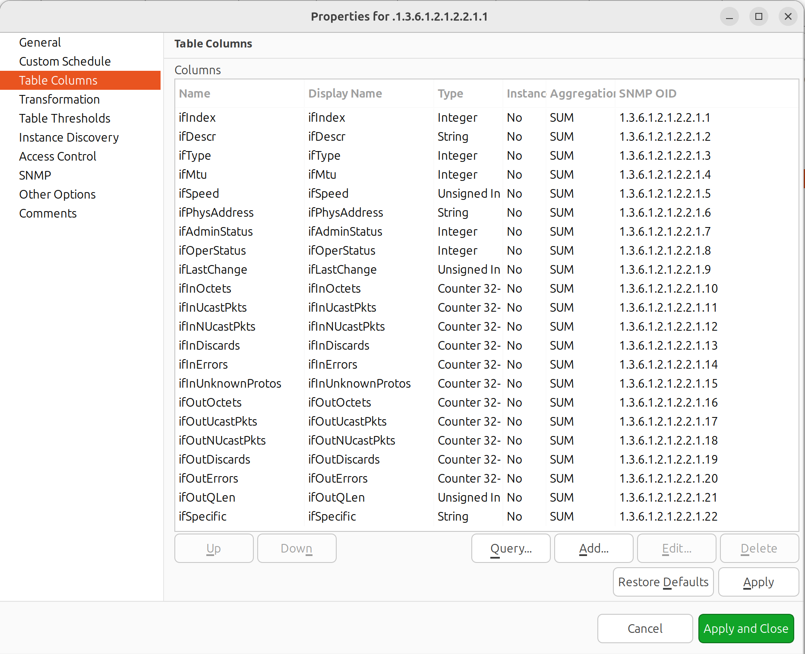

  The query result of the table columns

Now we have table with all the columns. Columns can be renamed by a user afterwards, as 
necessary. What we are missing here is an instance column. Our instance column will be the 
ifIndex column. 

  Table column configuration — renaming columns and editing their definition

As a result we will get the table below:

As we can see, the column ipPhysAddress shows nonsense. The column contains the hexdecimal 
string, but we try showing it as a regular string. 

Let's go back to the table configuration and adjust it by setting "Convert SNMP value to 
hexdecimal string" option for a column.

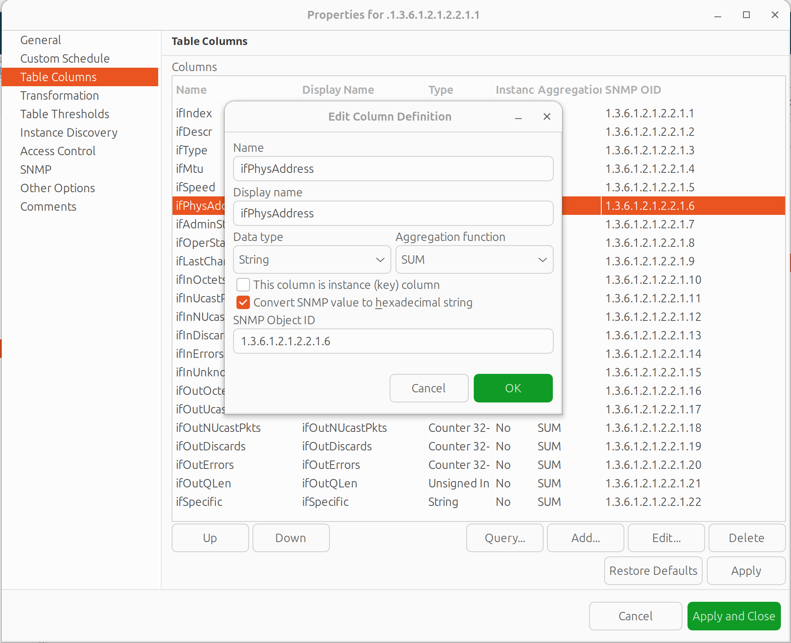

  Table column configuration — renaming columns and editing their definition

You can also adjust some column names for more clarity.

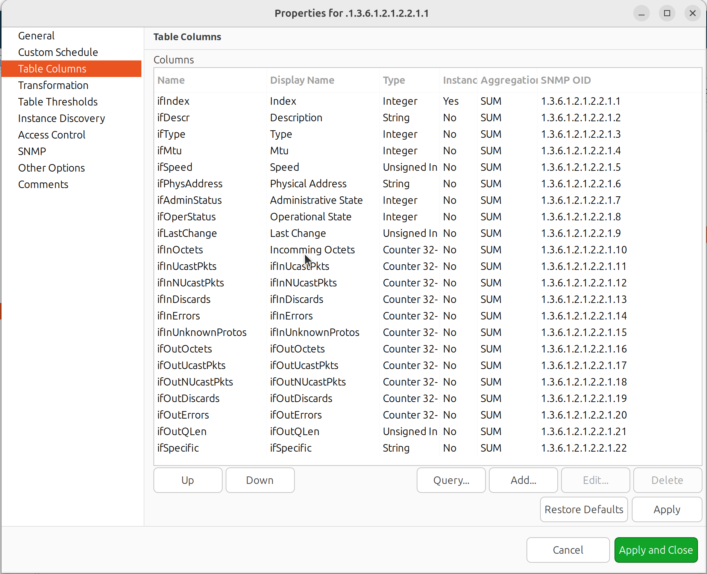

The end result will look like the table below: 

Additional tips
---------------

If two tables share the same instances, they can be shown in one table — as a process 
table for ESX:

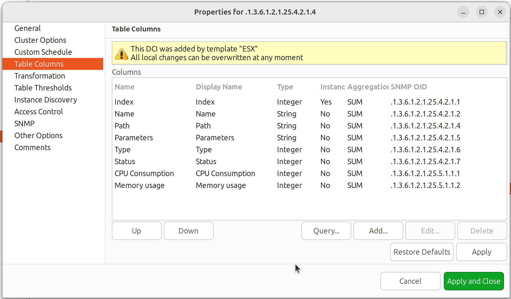

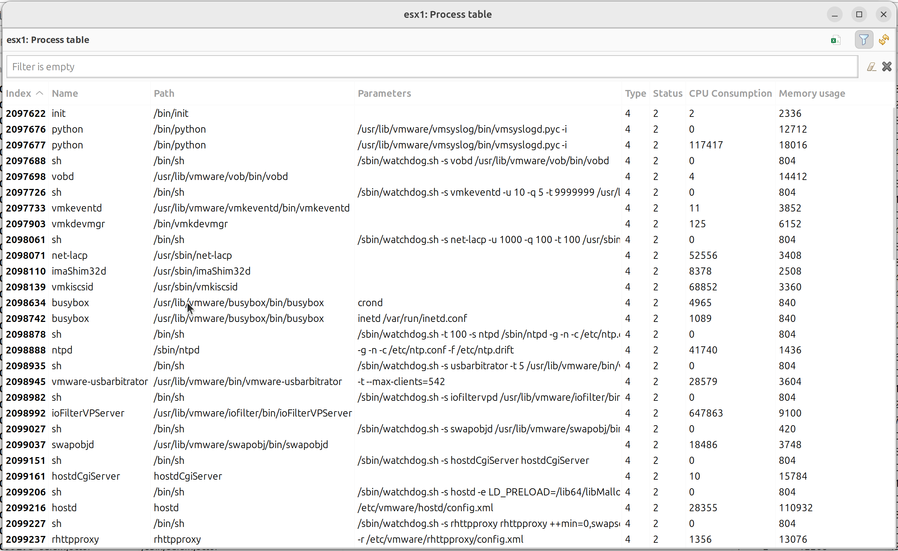