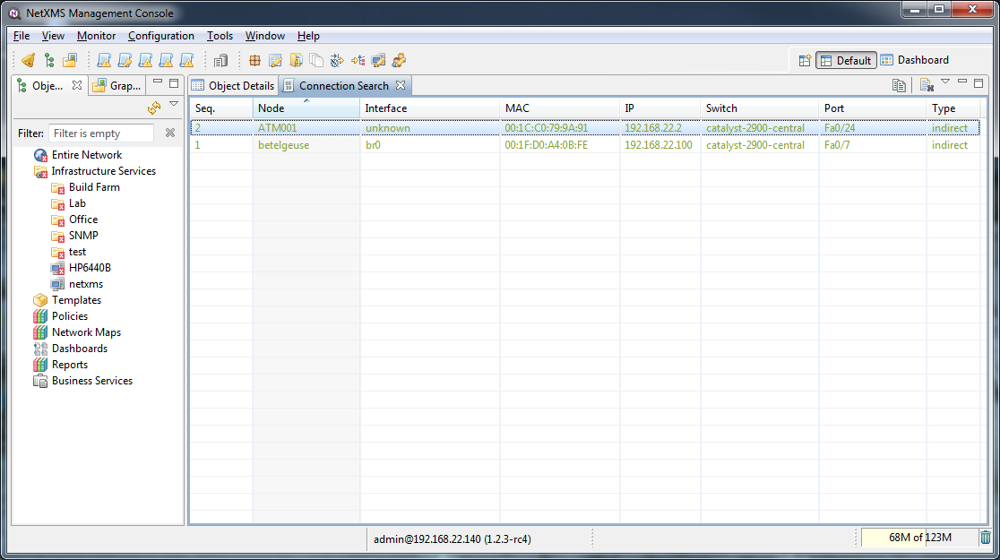

.. _topology:

################
Network topology
################

Introduction
============

|product_name| server automatically creates and maintains network model on different
layers. All necessary information taken from ARP cache, routing tables, and
switch forwarding database of managed nodes. Topology data provided by CDP,
LLDP, and NDP (SONMP) protocols also used in building network model. Having
network model instantly available allows |product_name| users to perform various
network topology tasks much faster and easier.

Requirements to build network topology:

 - All network equipment should be registered in |product_name| system
 - Equipment should response to SNMP
 - Equipment should have at least STP
 - There will be more information if equipment will have LLDP or CDP

Manual topology poll can be started on the network equipment to heave information
about information availability.

Based on network topology network correlation is done. Network correlation reduce
number of alerts and increase problem resolution speed.

Currently there are 3 states/events regarding connectivity:

 - down (event SYS_NODE_DOWN) - when server cannot contact the node and has no topology information for event correlation or it is really problem with that node
 - unreachable (SYS_NODE_UNREACHABLE) - when server knows that node cannot be contacted due to intermediate router/interface failure
 - up (SYS_NODE_UP) - when node is reachable

So when node becomes unreachable, either SYS_NODE_DOWN or SYS_NODE_UNREACHABLE event is generated, depending on root cause. But when node became reachable again, SYS_NODE_UP being generated.

How topology information is built
=================================

Find where node is connected
============================

It is possible to find switch port where any given node is connected (sometimes
called "connection point" in management console). To find out node's connection
point, right-click on node object, and select :guilabel:`Find switch port` in
pop-up menu. Message box with search results will pop up, and if port is found,
search results view will be opened (or updated if already open). Search results
view looks like this:

Columns have the following meaning:

.. list-table::
   :widths: 25 75
   :header-rows: 0

   * - Seq.
     - Search result sequence number
   * - Node
     - Name of end node object
   * - Interface
     - Name of node's interface object
   * - MAC
     - Interface's MAC address
   * - IP
     - Interface's IP address
   * - Switch
     - Name of switch node object
   * - Port
     - Name of interface object representing switch port
   * - Type
     - Connection type - direct or indirect. Direct connection type means that
       |product_name| server did not detect any other devices on same switch port, and
       most likely end node connected directly to the switch. Indirect means
       that some other devices was detected on same switch port. Virtual
       machines and virtual machine host will always be detected as indirect.

Find MAC address
================

It is possible to find location of any known MAC address in the network. To do
this, select :menuselection:`Tools --> Find MAC address`. Results of a search
will be displayed in the same results view. It is not necessary that node with
given MAC address be managed by |product_name| server, but if it is, appropriate
details will be displayed.

Find IP address
===============

It is possible to find location of any known IP address in the network. To do
this, select :menuselection:`Tools --> Find IP address`. Results of a search
will be displayed in the same results view. It is not necessary that node with
given IP address be managed by |product_name| server, but if it is, appropriate details
will be displayed.
