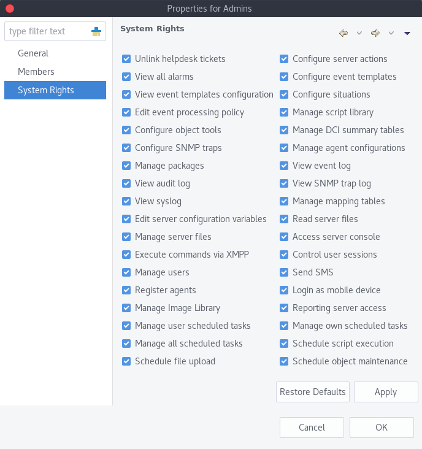
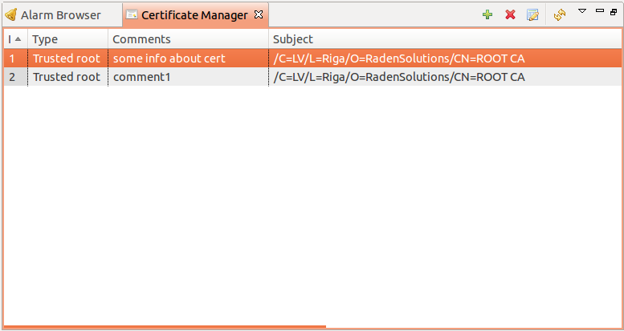
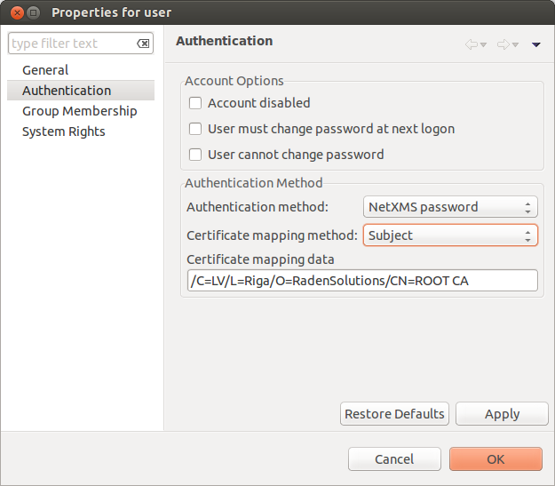

.. _user-management:

###############
User management
###############

Introduction
============

|product_name| has it's own user database. All |product_name| user accounts stored in backend
SQL database. Each account has it's own unique login name and identifier. The
account may also have a password.

Terms and Definitions
=====================

Users
-----

|product_name| has the following attributes for users:

- Unique identifier
- Unique login name
- First name
- Last name
- Description
- Authentication method
- Password
- Certificate

Not all attributes are mandatory.

Superuser
~~~~~~~~~

.. note::

    Before version 2.1-M0 there was only 1 default user ``admin`` with user ID 0 and
    access to everything by default. After version 2.1-M0 admin was made a normal user which 
    can be deleted or disabled. As a default user with access to everything was created 
    ``system`` user, that by default is disabled. 

|product_name| has built-in superuser with ID ``0``, which always has full access to
the system. Default login name for superuser is ``system``. By default user is 
disabled. Superuser account can be renamed or disabled/enabled, but cannot be deleted.

System user can be used to correct access rights to object, that exists, but 
none has access to it.

Groups
------

Each user can be member of several groups. Groups are the preferred way to
organize access permissions. You should always grant permission to groups
instead of using individual users. That way you will get a much shorter access
control list which is easier to handle. Access rights from multiple groups are
summarized to calculate effective user access rights.

Other groups can also be added as group members, in this case, the user access rights
will be calculated by summarizing the access rights from all the groups in the path
to the user.

Everyone Group
~~~~~~~~~~~~~~

|product_name| has built-in virtual group called :guilabel:`Everyone`. This group
always contains all users in the system. It cannot be deleted, and it's members
list cannot be edited.

System Access Rights
--------------------

System access rights used to grant access to system-wide configuration (like
:ref:`event-processing`) and functions (like agent registration).

The following system access rights can be granted:

.. list-table::
   :header-rows: 1
   :widths: 25 75

   * - Access Right
     - Description
   * - Access server console 
     - Allow user to access server's debug console. :ref:`server-debug-console` 
   * - Configure event templates
     - Allow user to configure event templates. :ref:`event-processing`
   * - Configure object tools
     - Allow user to configure object tools. :ref:`object_tools`
   * - Configure server actions
     - Allow user to configure server actions. :ref:`event-processing`
   * - Configure situations
     - Allow user to configure situations. :ref:`event-processing`
   * - Configure SNMP traps
     - Allow user to configure SNMP trap mapping.
   * - Control user sessions
     - Allow user to see active user sessions and force terminate them. (Not yet implemented)
   * - Edit event processing policy
     - Allow user to edit Event Processing Policy. :ref:`event-processing`
   * - Edit server configuration variables
     - Allow user to edit server configuration variables. 
   * - Execute commands via XMPP
     - Allows user to execute commands via XMPP.
   * - Login as mobile device
     - Allows user to login with help of mobile application.
   * - Manage agent configurations
     - Allow user to create, edit and delete agent configurations stored on
       server. :ref:`stored-agent-configurations-label`
   * - Manage all scheduled tasks
     - Allow user to create, edit and delete all :ref:`schedule`.
   * - Manage DCI summary table
     - Allows user to manage DCI summary table. :ref:`dci-summary-table-label`
   * - Manage image library
     - Allows user to manage image library. :ref:`image-library`
   * - Manage mapping tables
     - Allows user to manage mapping tables.
   * - Manage own scheduled tasks
     - Allow user to create new and modify :ref:`schedule` created by the user.
   * - Manage packages
     - Allow user to install, remove, and deploy server agent packages. :ref:`agent-remote-update`
   * - Manage server files
     - Allow user to upload files to server and delete files stored on server. :ref:`server-files-label`
   * - Manage script library
     - Allow user to manage scripts in Script Library.
   * - Manage users
     - Allow user to manage user accounts. Please note that user having this
       access right granted can modify own account to get any other system
       right granted.
   * - Manage user scheduled tasks
     - Allow user to create, edit and delete user`s :ref:`schedule`.
   * - Read server files 
     - Allow user to read files stored on server and upload to agents (user
       still needs appropriate object rights for upload). :ref:`server-files-label` 
   * - Register agents
     - Allow user to register |product_name| agents.
   * - Reporting server access
     - Allow user to access the Reporting server configuration. :ref:`reporting`
   * - Schedule file upload
     - Allow user to schedule server file upload to an agent. :ref:`schedule`
   * - Schedule object maintenance
     - Allow user to schedule maintenance for an object. :ref:`schedule`
   * - Schedule script execution
     - Allow user to schedule script execution. :ref:`schedule`
   * - Send SMS
     - Allow user to send SMS via |product_name| server. This access right has no
       effect unless server configuration variable ``AllowDirectSMS`` set to
       ``1``.
   * - Unlink helpdesk tickets
     - Allow user to unlink alarm from external heldesk system :ref:`helpdesk-integration`.
   * - View all alarms
     - Allow user to view all alarms generated by Event Processing Policy rules.
   * - View audit log
     - Allow user to view audit log.
   * - View event log
     - Allow user to view event log, alarm log.
   * - View event templates configuration
     - Allow user to view configured event templates.
   * - View SNMP trap log
     - Allow user to view SNMP trap log.

By granting the :guilabel:`View all alarms` access right, the user (or members of the group)
will have access to view all generated alarms. Should it be required to configure alarm viewing access
for specific users or groups, please refer to :ref:`alarm-category-config`.

User Authentication
===================

Internal Password
-----------------

This is the default method for user authentication. Password provided by user
compared against password stored in |product_name| database.

Password Policy
~~~~~~~~~~~~~~~

Various restrictions can be put on internal passwords to force users to choose stronger passwords. The following server configuration variables controls password policy:

.. list-table::
   :header-rows: 1
   :widths: 20 70 10

   * - Variable
     - Description
     - Default
   * - MinPasswordLength
     - Default minimum password length for a |product_name| user. The default applied only if per-user setting is not defined.
     - 0
   * - PasswordComplexity
     - Required pasword complexity. See table bellow for details.
     - 0
   * - PasswordExpiration
     - Password expiration time in days. If set to ``0``, password expiration
       is disabled. Has no effect on users with :guilabel:`Password never
       expired` flag set.
     - 0
   * - PasswordHistoryLength
     - Number of previous passwords to keep. Users are not allowed to set
       password if it matches one from previous passwords list.
     - 0

Possible flags for ``PasswordComplexity``:

.. list-table::
  :header-rows: 1
  :widths: 10 90

  * - Value
    - Description
  * - 1
    - Password must contain digits
  * - 2
    - Password must contain uppercase letters
  * - 4
    - Password must contain lowercase letters
  * - 8
    - Password must contain special characters
  * - 16
    - Forbid alphabetical sequences (password considered invalid if it
      contains alphabetical sequence of 3 or more letters of same
      case).
  * - 32
    - Forbid keyboard sequences (password considered invalid if it
      contains sequence of 3 or more characters that are located on
      keyboard next to each other, like ``ASDF``).

Complexity flags can be added together to get desired restrictions. For example, to
force passwords to contain uppercase and lowercase letters,
``PasswordComplexity`` variable must be set to ``6`` (``2 + 4``).

Changes to these configuration variables becomes effective immediately and does
not require |product_name| server restart.

RADIUS
------

If :guilabel:`RADIUS` authentication method selected password provided by user
sent to RADIUS server for validation. User is granted access if RADIUS server
responds with ``Access-Accept``. Communication between |product_name| server and RADIUS
server controlled by the following server configuration variables:

.. list-table::
   :header-rows: 1
   :widths: 20 70 10

   * - Variable
     - Description
     - Default value
   * - RADIUSNumRetries
     - The number of retries for RADIUS authentication.
     - 5
   * - RADIUSPort
     - Port number used for connection to primary RADIUS server.
     - 1645
   * - RADIUSSecondaryPort
     - Port number used for connection to secondary RADIUS server.
     - 1645
   * - RADIUSSecondarySecret
     - Shared secret used for communication with secondary RADIUS server.
     - netxms
   * - RADIUSSecondaryServer
     - Host name or IP address of secondary RADIUS server.
     - none
   * - RADIUSSecret
     - Shared secret used for communication with primary RADIUS server.
     - netxms
   * - RADIUSServer
     - Host name or IP address of primary RADIUS server.
     - none
   * - RADIUSTimeout
     - Timeout in seconds for requests to RADIUS server
     - 3

Changes to these configuration variables becomes effective immediately and does
not require |product_name| server restart.

Certificate Authentication
--------------------------

This type of authentication can be selected manually in user preferences.

Login process using certificate is following:

1. Server send random challenge to client
2. Client sign server's challenge with his certificate's private key and send signed challenge along with public part of certificate to server
3. Server validates certificate using CA certificate
4. If certificate is valid, server validates challenge signature using certificate's public key
5. If signature is valid, server compares certificate subject with mapping data from user record
6. If mapping data match with certificate subject, access is granted

So, to login successfully, user must posses valid certificate with private key. 
Authentication by certificate also allows smart card login - you just need to store 
certificate used for login on smart card instead of local certificate store.

Certificate management
~~~~~~~~~~~~~~~~~~~~~~
CA certificates can be managed in "Certificate Manager" view. 

Certificate can be added, deleted and edited. Edit window allows to change comment and 
to copy the subject of certificate. Certificate subject is one of the ways to link a 
certificate with a user. 

Link certificate and user
~~~~~~~~~~~~~~~~~~~~~~~~~
In "User Manager" view select user properties for required user. 
Then go to "Authentication" part.

   
In "Authentication Method" section: "Certificate",  "Certificate or Password",  
"Certificate or RADIUS".

|

Next two fields in combinations:

   Certificate mapping method: "Subject"
   
   Certificate mapping data: the subject of the CA. Can be taken from "Certificate Manager" view.

|

   Certificate mapping method: "Public key"
   
   Certificate mapping data: the public key of the certificate

|

   Certificate mapping method: "Common name"
   
   Certificate mapping data: if no mapping data set, then linking certificate CN = user name, otherwise CN = mapping data

.. _ldap:

Integration with LDAP
=====================

.. versionadded:: 1.2.15

|product_name| can perform one-way synchronization of users and groups with external LDAP server. User list replica is refreshed automatically.

Already existing |product_name| users or groups will not be modified during initial synchronization (e.g. user "admin" or group "Everyone").

LDAP synchronization configuration
----------------------------------

Server parameters controlling LDAP synchronization: 

.. list-table::
   :header-rows: 1
   :widths: 20 70 10
   
   * - Variable
     - Description
     - Default value
   * - LdapConnectionString ``*``
     - Comma- or whitespace-separated list of URIs in a format `schema://host:port`.
       Supported schemas: `ldap://`, `ldaps://` (LDAP over TLS), `ldapi://` (LDAP over IPC), and `cldap://` (connectionless LDAP).

       **Windows specific**\ : for server based on Windows system this
       parameter should be set according to this rules: empty string(attempts
       to find the "default" LDAP server), a domain name, or a space-separated
       list of host names or dotted strings that represent the IP address of
       hosts running an LDAP server to which to connect. Each host name in the
       list can include an optional port number which is separated from the
       host itself with a colon (:). 

       Note: most LDAP implementations except recent versions of OpenLDAP do not
       support mixed schema types in the single connection string.
     - ldap://localhost:389
   * - LdapSyncUser ``*``
     - User login for LDAP synchronization
     - 
   * - LdapSyncUserPassword ``*``
     - User password for LDAP synchronization 
     -
   * - LdapSearchBase
     - The LdapSearchBase configuration parameter is the DN of the entry at which to start the search.
     -
   * - LdapSearchFilter ``*``
     - The LdapSearchFilter is a string representation of the filter to apply in the search.
     -
   * - LdapUserDeleteAction ``*``
     - This parameter specifies what should be done while synchronization with deleted from LDAP user/group. 0 - if user should be just deleted from |product_name| DB. 1 - if it should be disabled. If it is chosen to disable user, then on LDAP sync user will be disabled and it's description will be change on "LDAP entry was deleted." Afterwards this user/group can be detached from LDAP and enabled if it is required or just deleted manually. 
     - 1
   * - LdapUserMappingName ``*`` 
     - There should be specified name of attribute that's value will be used as a user's login name
     -  
   * - LdapGroupMappingName ``*`` 
     - There should be specified name of attribute that's value will be used as a group's login name
     -  
   * - LdapMappingFullName 
     - There should be specified name of attribute that's value will be used as a user full name
     - 
   * - LdapMappingDescription 
     - There should be specified name of attribute that's value will be used as a user description
     - 
   * - LdapGroupClass
     - There is specified which object class represents group objects. If found entry will not be of a user ot group class, it will be just ignored.
     - 
   * - LdapUserClass ``*``
     - There is specified which object class represents user objects. If found entry will not be of a user ot group class, it will be just ignored.
     - 
   * - LdapGroupUniqueId
     - Unique identifier for LDAP group object. By default LDAP groups are identified by DN. If in your configuration DN can be changed any time it is useful to choose other attribute as unique group identifier. 
     -
   * - LdapUserUniqueId
     - Unique identifier for LDAP user object. By default LDAP users are identified by DN. If in your configuration DN can be changed any time it is useful to choose other attribute as unique user identifier. 
     -
   * - LdapSyncInterval ``*``
     - This parameter is for setting synchronization interval in minutes between |product_name| server and LDAP server. If synchronization parameter is set to 0 - synchronization will not be done. 
     - 0
   * - LdapPageSize ``*``
     - Limit of records that can be returned in one search page. 
     - 1000

``* Required fields``    

Synchronization also can be done manually with `ldapsync` or just `ldap` command in server console.

LDAP users/groups relationships with native |product_name| users/groups
-----------------------------------------------------------------------

LDAP users and groups are handled in exactly the same was as users from internal database. Only difference is that LDAP group membership is refreshed on each synchronisation and any non-LDAP user will be removed from the group.

Login with help of LDAP user
----------------------------

Login process is completely transparent for the user - user name should match attribute set by `LdapMappingName` and password should be current LDAP password for that user.

LDAP configuration debuging
---------------------------

If users are not synchronized the reason can be found by running manually `ldapsync` or just `ldap` 
command in server console on debug lever 4. 

Log when LDAP sync passed correctly:

::

    [11-Sep-2014 16:28:08.352] [DEBUG] LDAPConnection::initLDAP(): Connecting to LDAP server
    [11-Sep-2014 16:28:08.353] [DEBUG] LDAPConnection::syncUsers(): Found entry count: 3
    [11-Sep-2014 16:28:08.354] [DEBUG] LDAPConnection::syncUsers(): Found dn: CN=Users,CN=Customers,DC=Northwind,DC=Extranet
    [11-Sep-2014 16:28:08.354] [DEBUG] LDAPConnection::syncUsers(): CN=Users,CN=Customers,DC=Northwind,DC=Extranet is not a user nor a group
    [11-Sep-2014 16:28:08.354] [DEBUG] LDAPConnection::syncUsers(): Found dn: CN=zev333,CN=Users,CN=Customers,DC=Northwind,DC=Extranet
    [11-Sep-2014 16:28:08.354] [DEBUG] LDAPConnection::syncUsers(): User added: dn: CN=zev333,CN=Users,CN=Customers,DC=Northwind,DC=Extranet, login name: zev333, full name: (null), description: (null)
    [11-Sep-2014 16:28:08.354] [DEBUG] LDAPConnection::syncUsers(): Found dn: CN=user,CN=Users,CN=Customers,DC=Northwind,DC=Extranet
    [11-Sep-2014 16:28:08.354] [DEBUG] LDAPConnection::syncUsers(): User added: dn: CN=user,CN=Users,CN=Customers,DC=Northwind,DC=Extranet, login name: user, full name: (null), description: (null)
    [11-Sep-2014 16:28:08.354] [DEBUG] LDAPConnection::closeLDAPConnection(): Disconnect form ldap.
    [11-Sep-2014 16:28:08.354] [DEBUG] UpdateLDAPUsers(): User added: dn: CN=zev333,CN=Users,CN=Customers,DC=Northwind,DC=Extranet, login name: zev333, full name: (null), description: (null)
    [11-Sep-2014 16:28:08.354] [DEBUG] UpdateLDAPUsers(): User added: dn: CN=user,CN=Users,CN=Customers,DC=Northwind,DC=Extranet, login name: user, full name: (null), description: (null)
    [11-Sep-2014 16:28:08.354] [DEBUG] RemoveDeletedLDAPEntry(): Ldap uid=john,ou=People,dc=nodomain entry was removed form DB.
    [11-Sep-2014 16:28:08.354] [DEBUG] RemoveDeletedLDAPEntry(): Ldap uid=zev,ou=People,dc=nodomain entry was removed form DB.
    [11-Sep-2014 16:28:08.354] [DEBUG] RemoveDeletedLDAPEntry(): Ldap uid=kasio,ou=People,dc=nodomain entry was removed form DB.
    [11-Sep-2014 16:28:08.355] [DEBUG] RemoveDeletedLDAPEntry(): Ldap uid=usr1,ou=People,dc=nodomain entry was removed form DB.

Login credentials incorrect:

::

    [11-Sep-2014 15:49:39.892] [DEBUG] LDAPConnection::initLDAP(): Connecting to LDAP server
    [11-Sep-2014 15:49:39.896] [DEBUG] LDAPConnection::loginLDAP(): LDAP could not login. Error code: Invalid credentials
    [11-Sep-2014 15:49:39.896] [DEBUG] LDAPConnection::syncUsers(): Could not login.

Search base is set incorrectly or sync user does not have access to it:

::

    [11-Sep-2014 15:54:03.138] [DEBUG] LDAPConnection::initLDAP(): Connecting to LDAP server
    [11-Sep-2014 15:54:03.140] [DEBUG] LDAPConnection::syncUsers(): LDAP could not get search results. Error code: No such object
 
LDAP configuration examples
---------------------------

Active Directory
~~~~~~~~~~~~~~~~

.. list-table::
   :header-rows: 1
   :widths: 20 70 
   
   * - Variable
     - Value   
   * - LdapConnectionString
     - ldap://10.5.0.35:389
   * - LdapSyncUser
     - CN=user,CN=Users,CN=Customers,DC=Domain,DC=Extranet
   * - LdapSyncUserPassword
     - xxxxxxxx
   * - LdapSearchBase
     - CN=Customers,DC=Domain,DC=Extranet
   * - LdapSearchFilter
     - (objectClass=*)
   * - LdapUserDeleteAction
     - 1
   * - LdapMappingName
     - sAMAccountName
   * - LdapMappingFullName
     - displayName
   * - LdapMappingDescription
     - description
   * - LdapGroupClass
     - group
   * - LdapUserClass
     - user
   * - LdapGroupUniqueId
     - objectGUID
   * - LdapUserUniqueId
     - objectGUID
   * - LdapSyncInterval
     - 1440

Open LDAP
~~~~~~~~~

.. list-table::
   :header-rows: 1
   :widths: 20 70 
   
   * - Variable
     - Value   
   * - LdapConnectionString
     - ldap://10.5.0.35:389
   * - LdapSyncUser
     - cn=admin,dc=nodomain
   * - LdapSyncUserPassword
     - xxxxxxxx
   * - LdapSearchBase
     - dc=nodomain
   * - LdapSearchFilter
     - (objectClass=*)
   * - LdapUserDeleteAction
     - 1
   * - LdapMappingName
     - cn
   * - LdapMappingFullName
     - displayName
   * - LdapMappingDescription
     - description
   * - LdapGroupClass
     - groupOfNames
   * - LdapUserClass
     - inetOrgPerson
   * - LdapGroupUniqueId
     - 
   * - LdapUserUniqueId
     - 
   * - LdapSyncInterval
     - 1440
     
Managing User Accounts
======================

All |product_name| user accounts can be managed from :guilabel:`User Manager` view
available at :menuselection:`Configuration --> User Manager` in |product_name| Console.
Only users with granted system right :guilabel:`Manage users` can access
:guilabel:`User Manager`.

- To create new user account, select :guilabel:`Create new user` from view menu or context menu.
- To create new group, select :guilabel:`Create new group` from view menu or context menu.
- To delete user account, select it in the list, right-click, and select :guilabel:`Delete` from pop-up menu. You can delete multiple accounts at a time.
- To modify properties of user or group, select it in the list, right-click, and select :guilabel:`Properties` from pop-up menu.
- To reset user's password, select user account in the list, right-click, and select :guilabel:`Change password` from pop-up menu.

Audit
=====

All important user actions are written to audit log. There are two audit
logging modes - internal and external. Internal audit logging is on by default
and writes audit records into table in |product_name| database. External audit logging
allows sending audit records to external system via syslog protocol. External
audit logging is off by default. Audit logging controlled by the following
server configuration variables:

.. list-table::
   :header-rows: 1
   :widths: 20 60 20

   * - Variable
     - Description
     - Default value
   * - AuditLogRetentionTime
     - Retention time in days for the records in internal audit log. All
       records older than specified will be deleted by housekeeping process.
     - 90
   * - EnableAuditLog
     - Enable (``1``) or disable (``0``) audit logging.
     - 1
   * - ExternalAuditFacility
     - Syslog facility to be used in audit log records sent to external server.
     - 13
   * - ExternalAuditPort
     - UDP port of external syslog server to send audit records to.
     - 514
   * - ExternalAuditServer
     - External syslog server to send audit records to. If set to none,
       external audit logging is disabled.
     - none
   * - ExternalAuditSeverity
     - Syslog severity to be used in audit log records sent to external server.
     - 5
   * - ExternalAuditTag
     - Syslog tag to be used in audit log records sent to external server.
     - netxmsd-audit

