.. _visualisation:

##############################
Data and Network visualisation
##############################

.. _network_map:

Network Maps
============

Network maps provide graphical visualization of your network infrastructure,
showing objects, their relationships, and current status. Maps can be created
manually with custom layouts or generated automatically from topology data.

To access network maps:

1. Switch to the :guilabel:`Maps` perspective using the perspective switcher
   or menu :menuselection:`Window --> Open Perspective --> Maps`.

2. In the :guilabel:`Object Browser` panel, expand :guilabel:`Network Maps`
   to see all available maps and map groups.

.. figure:: _images/network-maps/Network_maps_in_object_browser.png

   Network maps in Object Browser

Map Types Overview
------------------

|product_name| supports six types of network maps:

.. list-table::
   :header-rows: 1
   :widths: 20 60 20

   * - Type
     - Description
     - Auto-updates
   * - Custom
     - User-defined map with manual object placement
     - No
   * - Layer 2 Topology
     - Switching/bridging topology based on MAC tables
     - Yes
   * - IP Topology
     - IP routing topology from routing tables
     - Yes
   * - Internal Communication
     - Agent/proxy connections to management server
     - Yes
   * - OSPF Topology
     - OSPF routing domain topology
     - Yes
   * - Hybrid Topology
     - Combined L2/IP/OSPF in single map
     - Yes

.. _netmap-creating:

Creating Maps
-------------

1. In Object Browser, right-click :guilabel:`Network Maps` or a map group.

2. Select :guilabel:`Create network map`.

3. Enter a name and select the map type:

   - **Custom**: Empty map for manual creation
   - **Layer 2 Topology**: Auto-generated from L2 switching data
   - **IP Topology**: Auto-generated from routing tables
   - **Internal Communication Topology**: Shows agent/proxy connections
   - **OSPF Topology**: Shows OSPF routing relationships
   - **Hybrid Topology**: Combines L2, IP, and OSPF data

4. For automatic topology maps, select the initial seed object in the dialog.

5. Optionally, select an existing map as a template in the :guilabel:`Template network map`
   field. The template provides initial configuration for the new map including:

   - Map settings (background, size, display mode)
   - Link defaults (routing, color, width, style)
   - Filter and link styling scripts
   - Discovery radius
   - Decoration elements (group boxes, images)
   - Text box elements

   Object elements and links are not copied from the template.

.. figure:: _images/network-maps/create-map-dialog.png

   Create Network Map dialog showing all map types

.. figure:: _images/network-maps/l2-topology-seed-selection.png

   Seed object selection for topology map

6. Click :guilabel:`OK`.

.. note::

   :guilabel:`IP Topology` maps are recommended for getting started as they
   work with standard routing information available on most devices.
   :guilabel:`Layer 2 Topology` maps require specific protocol support (LLDP,
   CDP, STP) which may not be available or enabled on all network equipment.

Seed Objects and Discovery Radius
~~~~~~~~~~~~~~~~~~~~~~~~~~~~~~~~~

For automatic topology maps, seed objects define the starting points for
topology discovery. The first seed object is selected when creating the map.
Additional seed objects can be added in map properties:

1. Open map properties (right-click map > :guilabel:`Properties`).

2. Go to the :guilabel:`Seed Nodes` page and click :guilabel:`Add` to add
   more seed objects.

.. figure:: _images/network-maps/networkmap-seed-nodes-propertypage.png

   Map properties dialog - Seed Nodes page

3. Go to the :guilabel:`Map Options` page to configure discovery radius:

   - 0 = show seed and directly connected objects only
   - Higher values = include objects further away

.. figure:: _images/network-maps/map-properties-map-options.png

   Map properties dialog - Map Options page

4. Click :guilabel:`OK`.

The map automatically populates with discovered topology and updates when
the network changes.

.. figure:: _images/network-maps/l2-topology-result.png

   Generated L2 topology map showing discovered nodes and links

.. _netmap-editing:

Editing Maps
------------

.. figure:: _images/network-maps/network_map_menu.png

   Map context menu

Adding Objects
~~~~~~~~~~~~~~

Network maps can be populated automatically or manually. Layer 2, IP Topology,
OSPF, Hybrid, and Internal Communication topology maps are populated automatically.

**To add objects manually:**

- **Drag and drop**: Drag objects from Object Browser onto the map
- **Menu**: Right-click on map > :guilabel:`Add object...` > select object

To use drag and drop, the map editor must be accessible while viewing network
objects. Either:

- Pop out or pin the map editor window, then switch to :guilabel:`Network` or
  :guilabel:`Infrastructure` perspective where objects are located, or
- Use the :guilabel:`Add object...` menu option which works from any perspective

.. figure:: _images/network-maps/drag-drop-object.png

   Dragging a node from Object Browser onto a map

**To remove objects:**

- Select object, right-click > :guilabel:`Remove from map`

.. figure:: _images/network-maps/map-with-nodes.png

   Custom map with connected nodes

Adding Links Between Objects
~~~~~~~~~~~~~~~~~~~~~~~~~~~~

Objects can be linked with a line.

**To create links:**

1. Hold :kbd:`Ctrl` and click two objects to select them.

.. figure:: _images/network-maps/link-two-objects.png

   Two objects selected before linking

2. Click :guilabel:`Link selected objects` in toolbar, or right-click >
   :guilabel:`Link selected objects`.

.. figure:: _images/network-maps/link-button-toolbar.png

   Toolbar with Link selected objects button

**To remove links:**

- Select the link, right-click > :guilabel:`Remove from map`

Link Properties
~~~~~~~~~~~~~~~

Select a link, right-click and select :guilabel:`Properties` to configure:

.. figure:: _images/network-maps/link-properties-dialog.png

   Link properties dialog

- **Link name**: Label displayed on the link
- **Connector names**: Labels shown near each connected object
- **Line color**:

  - Default - uses map default color
  - Based on object status - color reflects selected object(s) status
  - Custom color - user-defined static color
  - Script - determined by NXSL script
  - Link utilization - based on interface bandwidth usage

.. figure:: _images/network-maps/link-color-source.png

   Link color source options

- **Routing algorithm**:

  - Map Default - uses map setting
  - Direct - straight line
  - Manhattan - grid-based with right angles
  - Bend points - manual routing (double-click line to add points)

.. figure:: _images/network-maps/link-routing-bendpoints.png

   Link with manual bend points

- **Label position**: Position of link name and DCI values (50 = middle)

- **Data Source**: Configure DCI values to display on the link

.. figure:: _images/network-maps/link-dci-datasource-config.png

   Link data source configuration

**Data Source Configuration:**

For each data source, configure:

- Data collection item
- Name (label prefix)
- Format string
- For table DCIs: column and instance

If format string is not provided, default formatting with multipliers and
measurement units is used.

Format string syntax follows Java Formatter specification. Example: ``Text: %.4f``

Additional format specifiers in curly brackets after ``%``:

- ``units`` or ``u`` - add measurement units from DCI properties
- ``multipliers`` or ``m`` - display with SI multipliers (e.g., 1230000 becomes 1.23 M)
- Combined: ``%{units,multipliers}f`` or ``%{u,m}f``

.. figure:: _images/network-maps/link_dci_data.png

   Example of DCI data displayed on a link

.. _netmap-decorations:

Decorations
-----------

Decorations like pictures and group boxes can be added to maps.

.. figure:: _images/network-maps/network_map_decorations.png

   Map decorations example

Group Boxes
~~~~~~~~~~~

Group boxes visually organize related objects.

1. Right-click on the map canvas.

2. Select :guilabel:`Add decoration` > :guilabel:`Group box`.

3. Configure: title, color, and size.

.. figure:: _images/network-maps/group-box-creation.png

   Group box properties dialog

4. Position behind objects you want to group.

Images
~~~~~~

To add an image, first upload it to the :ref:`image-library`, then:

1. Right-click on the map canvas.

2. Select :guilabel:`Add decoration` > :guilabel:`Image`.

3. Select the image from the library.

.. _netmap-dci-container:

DCI Container
-------------

DCI Container displays live DCI values on a map.

.. figure:: _images/network-maps/dci_container_example.png

   DCI Container example

**To add a DCI Container:**

1. Right-click on the map canvas.

2. Select :guilabel:`Add DCI container`.

3. Configure appearance:

   - Background color
   - Text color
   - Border (optional) and border color

4. Add data sources:

   - Click :guilabel:`Add`
   - Select node and DCI
   - Configure name and format string (e.g., ``Text: %.4f`` or ``%{u,m}f``)
   - For table DCIs: specify column and instance

.. figure:: _images/network-maps/dci-container-on-map.png

   DCI Container showing live metrics on map

.. figure:: _images/network-maps/dci_container_example2.png

   More DCI Container examples

.. _netmap-dci-image:

DCI Image
---------

DCI Image displays different images based on DCI values, useful for conditional
status indicators.

**To add a DCI Image:**

1. Right-click on the map canvas.

2. Select :guilabel:`Add DCI image`.

3. Configure:

   - **Data source**: DCI to evaluate
   - **Column/Instance**: For table DCIs only
   - **Default image**: Shown when no rule matches

4. Add rules (click :guilabel:`Add`):

   - **Operation**: Comparison operator (>, <, =, etc.)
   - **Value**: Threshold value
   - **Image**: Image to display when rule matches
   - **Comment**: Optional description

.. figure:: _images/network-maps/dci-image-rules.png

   DCI Image rules configuration

**Important**: Rules are processed top to bottom. Order from most specific to
least specific.

**Example rule order for temperature:**

.. code-block:: none

   > 80  => critical.png    (checked first)
   > 60  => warning.png     (checked second)
   > 0   => normal.png      (checked third)

.. _netmap-text-box:

Text Box
--------

Text boxes display static text with optional drill-down navigation.

**To add a Text Box:**

1. Right-click on the map canvas.

2. Select :guilabel:`Add text box`.

3. Configure:

   - **Text**: Content to display
   - **Font size**: Text size
   - **Colors**: Text and background colors
   - **Drill-down object**: Optional target for click navigation

.. figure:: _images/network-maps/text-box-properties.png

   Text Box properties dialog

.. figure:: _images/network-maps/text-box-drilldown-config.png

   Text Box drill-down object selection

.. _netmap-layout:

Layout and Display Options
--------------------------

Layout and display options apply to objects, not decorations.

Map Size
~~~~~~~~

Map size defines the canvas dimensions for the network map. This is particularly
important for automatically layouted maps, as the layout algorithm uses these
dimensions to position objects.

To configure map size:

1. Open map properties (right-click map > :guilabel:`Properties`).

2. Go to the :guilabel:`Map Options` page.

3. Set :guilabel:`Width` and :guilabel:`Height` values in pixels.

For automatic topology maps, larger dimensions provide more space for the layout
algorithm to spread objects, resulting in less cluttered visualization.

Grid
~~~~

- **Align to grid**: Move all objects to grid positions
- **Snap to grid**: Constrain object movement to grid
- **Show grid**: Display grid lines

.. figure:: _images/network-maps/network_map_top_menu.png

   Map toolbar

Layout Algorithms
~~~~~~~~~~~~~~~~~

Objects can be positioned manually or using automatic layouts:

- **Manual**: No automatic positioning (default for Custom maps)
- **Spring**: Force-directed layout
- **Radial**: Circular arrangement from center
- **Horizontal tree**: Left-to-right hierarchy
- **Vertical tree**: Top-to-bottom hierarchy
- **Sparse vertical tree**: Vertical tree with more spacing

.. figure:: _images/network-maps/layout-algorithms-menu.png

   Layout algorithm selection menu

With automatic layout, positions recalculate on each refresh. With manual
layout, save the map after moving objects.

Display Options
~~~~~~~~~~~~~~~

- **Show status background**: Colored background based on object status
- **Show status icon**: Status icon overlay on objects
- **Show status frame**: Colored frame around objects based on status
- **Floor plan**: Objects as resizable rectangles for physical layout

.. figure:: _images/network-maps/status-display-options.png

   Display options menu with status settings

.. figure:: _images/network-maps/map-with-status-icons.png

   Map showing objects with status icons

Object Display Mode
~~~~~~~~~~~~~~~~~~~

Objects can be displayed as:

- Icons (default)
- Small labels
- Large labels
- Status icon
- Floor plan

.. figure:: _images/network-maps/display-modes-comparison-icons.png

   Display mode: Icons

.. figure:: _images/network-maps/display-modes-comparison-small-labels.png

   Display mode: Small Labels

.. figure:: _images/network-maps/display-modes-comparison-large-labels.png

   Display mode: Large Labels

.. figure:: _images/network-maps/display-modes-comparison-status-icon.png

   Display mode: Status Icon

.. figure:: _images/network-maps/display-modes-comparison-floor-plan.png

   Display mode: Floor Plan

.. figure:: _images/network-maps/floor-plan-mode.png

   Map in floor plan mode with resizable rectangles

Default Link Routing
~~~~~~~~~~~~~~~~~~~~

- **Direct**: Straight lines
- **Manhattan**: Grid-based with right angles

Zoom
~~~~

Map can be zoomed using toolbar buttons or selecting a percentage from the menu.

.. _netmap-public-access:

Public Access
-------------

When |product_name| WebUI is configured, network maps can be shared publicly
via a direct URL without requiring authentication. This is useful for displaying
maps on information screens or sharing with users who don't have system accounts.

**To enable public access:**

1. Right-click on a network map in Object Browser.

2. Select :guilabel:`Enable public access...`

3. A dialog appears with:

   - **Access token**: Unique token for this map's public access
   - **Direct access URL**: Full URL to access the map

4. Copy the URL and share it as needed.

The URL format is::

   {BaseURL}/nxmc-light.app?auto&kiosk-mode=true&token={token}&map={mapId}

The map will be displayed in kiosk mode without navigation elements, suitable
for dashboards and information displays.

.. note::

   Public access requires WebUI to be properly configured with a base URL.
   Each time you enable public access, a new token is generated.

Delegated Access
----------------

Network maps can display objects that users don't have direct read access to,
using the **Delegated read** access right. This is useful for creating
overview maps for users who should see network visualization without having
full access to browse the underlying nodes.

Delegated read only allows viewing objects through the map interface. Users
cannot browse these objects directly in Object Browser or access them outside
the map context. 

**Delegated read** can be set on specific objects, on containers or on root
objects, e.g. on :guilabel:`Infrastructure Services`.

.. versionadded:: 5.0

.. _netmap-background:

Map Background
--------------

Background options:

- **Color**: Solid background color
- **Image**: Upload to :ref:`image-library` first, then select
- **Geographic Map**: Specify latitude, longitude, and zoom level

.. figure:: _images/network-maps/background-image-config.png

   Image background selection from Image Library

.. figure:: _images/network-maps/background-geomap-config.png

   Geographic map background configuration

Use backgrounds to show physical placement on floor plans or geographic locations.

.. figure:: _images/network-maps/networkmap_geomap.png

   Map with geographic background

.. _netmap-filter-script:

Object Filter Script
--------------------

Filter scripts control which objects appear on automatic topology maps.

1. Open map properties.

2. Go to the :guilabel:`Filter` tab.

.. figure:: _images/network-maps/map-properties-filter.png

   Map properties - Filter script configuration

3. Enter an NXSL script returning ``true`` (include) or ``false`` (exclude).

4. Enable :guilabel:`Filter objects` option.

**Context variables:**

- ``$object`` or ``$node``: Object being evaluated
- ``$map``: The NetworkMap object

**Example - include only nodes:**

.. code-block:: c

   return $object.isNode;

**Example - exclude nodes in maintenance:**

.. code-block:: c

   return !$node.isInMaintenanceMode;

**Example - include only specific subnet:**

.. code-block:: c

   if ($node.ipAddr.inSubnet("10.1.0.0", 16))
      return true;
   return false;

.. _netmap-link-styling-script:

Link Styling Script
-------------------

Link styling scripts dynamically modify link appearance during map updates.

1. Open map properties.

2. Go to the :guilabel:`Link Styling Script` section.

.. figure:: _images/network-maps/map-properties-link-styling.png

   Map properties - Link styling script configuration

3. Enter an NXSL script that modifies the ``$link`` object.

**Example - set link width based on bandwidth:**

.. code-block:: c

   iface = $link.interface1;
   if (iface != null) {
      speed = iface.speed;
      if (speed >= 10000000000)
         $link.setWidth(4);  // 10G+
      else if (speed >= 1000000000)
         $link.setWidth(3);  // 1G
      else
         $link.setWidth(2);  // Below 1G
   }

**Example - add interface descriptions as connector names:**

.. code-block:: c

   if ($link.interface1 != null)
      $link.setConnectorName1($link.interface1.description);
   if ($link.interface2 != null)
      $link.setConnectorName2($link.interface2.description);

For complete NXSL reference including all available methods and attributes for
``$link`` object, see `NetworkMapLink class <https://netxms.org/documentation/nxsl-latest/#class-networkmaplink>`_
in the NXSL documentation.

.. _netmap-reference:

Reference Tables
----------------

Map Types
~~~~~~~~~

.. list-table::
   :header-rows: 1
   :widths: 25 55 10 10

   * - Type
     - Description
     - Auto-updates
     - Seed Required
   * - Custom
     - User-defined manual map
     - No
     - No
   * - Layer 2 Topology
     - Switching/bridging topology
     - Yes
     - Yes
   * - IP Topology
     - IP routing topology
     - Yes
     - Yes
   * - Internal Communication
     - Agent/proxy connections
     - Yes
     - Yes (auto)
   * - OSPF Topology
     - OSPF routing topology
     - Yes
     - Yes
   * - Hybrid Topology
     - Combined L2/IP/OSPF
     - Yes
     - Yes

.. figure:: _images/network-maps/ospf-topology-map.png

   OSPF topology map showing router relationships

.. figure:: _images/network-maps/hybrid-topology-map.png

   Hybrid topology map combining L2/IP/OSPF

Element Types
~~~~~~~~~~~~~

.. list-table::
   :header-rows: 1
   :widths: 20 80

   * - Type
     - Description
   * - Object
     - Managed |product_name| object (node, interface, etc.)
   * - Decoration
     - Group box or static image
   * - DCI Container
     - Live DCI value display
   * - DCI Image
     - Dynamic image based on DCI value
   * - Text Box
     - Text annotation with optional drill-down

.. figure:: _images/network-maps/element-types-overview.png

   All element types shown on one map

Link Types
~~~~~~~~~~

.. list-table::
   :header-rows: 1
   :widths: 20 25 55

   * - Type
     - Visual
     - Description
   * - Normal
     - Solid line
     - Standard connection
   * - VPN
     - Dashed
     - VPN tunnel
   * - Multilink
     - Double line
     - Aggregated links (LAG)
   * - Agent Tunnel
     - Red indicator
     - Agent tunnel connection
   * - Agent Proxy
     - Green indicator
     - Agent proxy
   * - SSH Proxy
     - Cyan indicator
     - SSH proxy
   * - SNMP Proxy
     - Yellow indicator
     - SNMP proxy
   * - ICMP Proxy
     - Blue indicator
     - ICMP proxy
   * - Sensor Proxy
     - Default color
     - Sensor proxy
   * - Zone Proxy
     - Magenta indicator
     - Zone proxy

Link Color Sources
~~~~~~~~~~~~~~~~~~

.. list-table::
   :header-rows: 1
   :widths: 25 75

   * - Source
     - Description
   * - Default
     - Uses map default color
   * - Object Status
     - Based on selected object(s) status
   * - Custom Color
     - User-defined static color
   * - Script
     - Determined by NXSL script
   * - Link Utilization
     - Based on interface utilization
   * - Interface Status
     - Based on interface operational status

Layout Algorithms
~~~~~~~~~~~~~~~~~

.. list-table::
   :header-rows: 1
   :widths: 25 75

   * - Algorithm
     - Description
   * - Manual
     - User positions objects
   * - Spring
     - Force-directed layout
   * - Radial
     - Circular arrangement
   * - Horizontal Tree
     - Left-to-right tree
   * - Vertical Tree
     - Top-to-bottom tree
   * - Sparse Vertical Tree
     - Spread-out vertical tree

Link Routing
~~~~~~~~~~~~

.. list-table::
   :header-rows: 1
   :widths: 25 75

   * - Algorithm
     - Description
   * - Default
     - Uses map setting
   * - Direct
     - Straight line
   * - Manhattan
     - Grid-based with right angles
   * - Bendpoints
     - User-defined routing points

Link Styles
~~~~~~~~~~~

.. list-table::
   :header-rows: 1
   :widths: 25 75

   * - Style
     - Description
   * - Default
     - System default (solid)
   * - Solid
     - Continuous line
   * - Dash
     - Dashed line
   * - Dot
     - Dotted line
   * - Dash-Dot
     - Alternating dash and dot
   * - Dash-Dot-Dot
     - Dash and two dots

NXSL Classes Reference
~~~~~~~~~~~~~~~~~~~~~~

For scripting with network maps, refer to the NXSL documentation:

- `NetworkMap class <https://netxms.org/documentation/nxsl-latest/#class-networkmap>`_ - Map object available as ``$map``
- `NetworkMapLink class <https://netxms.org/documentation/nxsl-latest/#class-networkmaplink>`_ - Link object available as ``$link``

Dashboards
==========

Dashboards combine visualization components with data from multiple sources to
create high-level views for monitoring network health at a glance. Administrators
create dashboards to display charts, status indicators, alarm lists, geographic
maps, and other elements in a customizable grid layout.

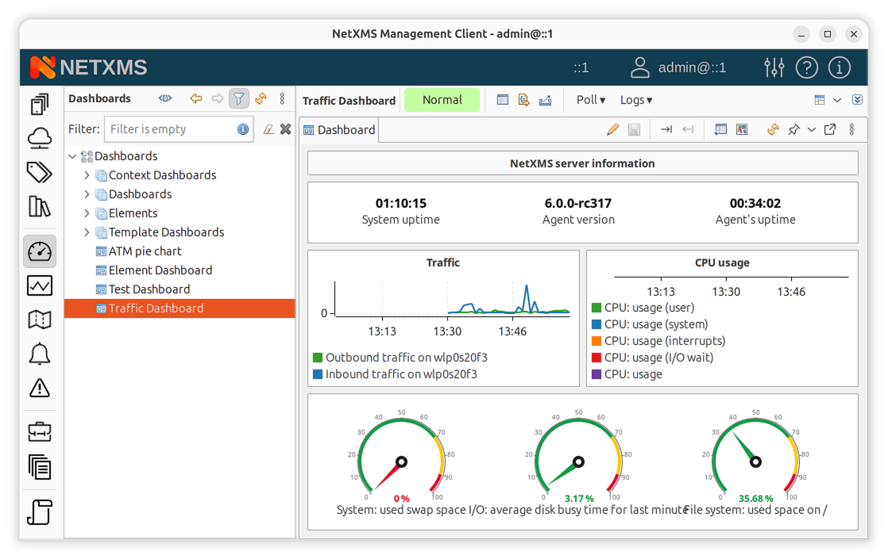

   Example dashboard showing traffic information and CPU usage

Accessing Dashboards
--------------------

To access dashboards, switch to the :guilabel:`Dashboard` perspective and select
the desired dashboard from the object tree on the left.

.. _dashboards-creating:

Creating Dashboards
-------------------

Dashboards are objects created in the :guilabel:`Dashboards` container in the
object tree. To create a new dashboard:

1. Right-click on :guilabel:`Dashboards` root or any existing dashboard
2. Select :guilabel:`Create dashboard`
3. Enter a name for the dashboard
4. Open the dashboard's properties to configure elements

Dashboard Properties
~~~~~~~~~~~~~~~~~~~~

To configure dashboard content, open the object's properties and navigate to
:guilabel:`Dashboard Elements`. Here you can define the number of columns and
manage the list of elements.

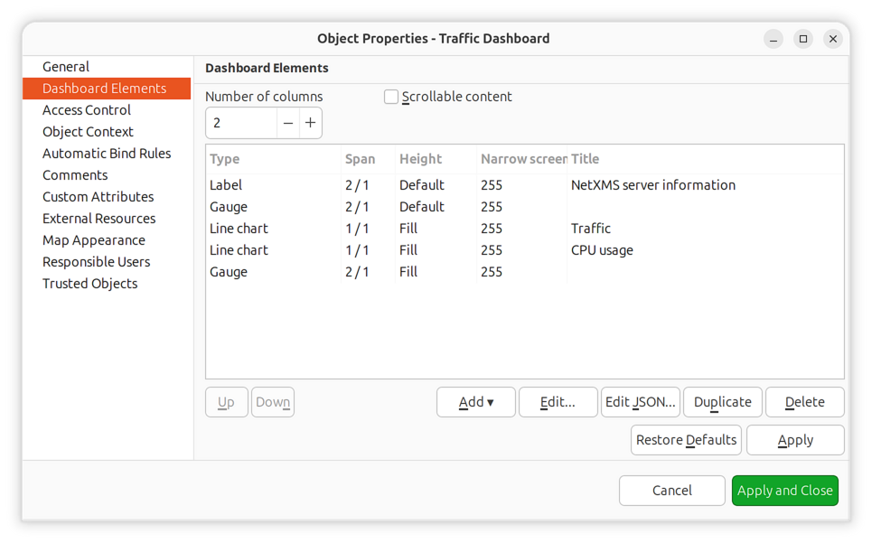

   Dashboard properties dialog

.. list-table::
   :header-rows: 1
   :widths: 25 75

   * - Property
     - Description
   * - Number of columns
     - Defines the grid width for element layout
   * - Scrollable
     - Enable vertical scrolling when content exceeds viewport height

Press :guilabel:`Add` to add a new element. You will be prompted with an element
type selection menu.

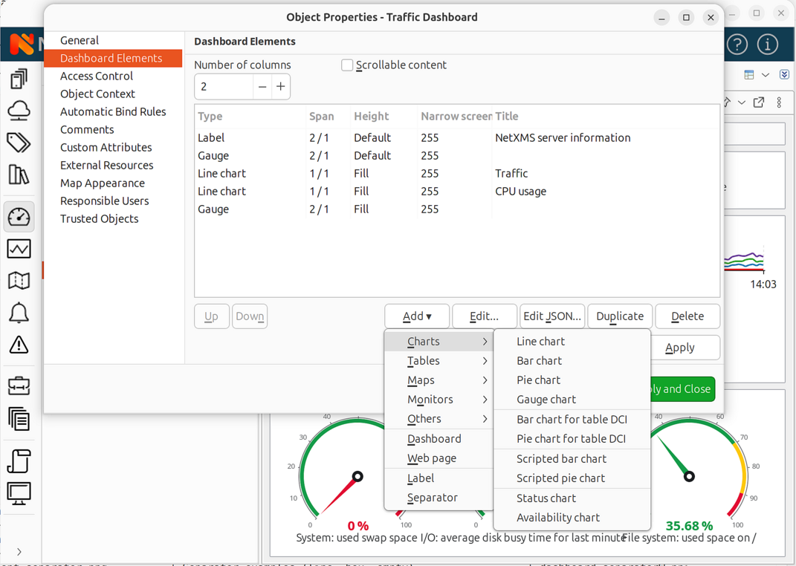

   Element type selection menu

When a new element is added, double-click on its record in the elements list or
press :guilabel:`Edit` to configure it. Each element has a :guilabel:`Layout`
property page controlling the element's position within the dashboard, plus one
or more element-specific pages.

.. _dashboard-templates:

Dashboard Templates
~~~~~~~~~~~~~~~~~~~

Dashboard templates allow you to create reusable dashboard designs that
automatically generate dashboards for objects matching specified criteria.

To create a dashboard template:

1. Right-click on :guilabel:`Dashboards` and select :guilabel:`Create dashboard template`
2. Configure elements as with regular dashboards
3. Set up auto-bind filter to specify which objects should receive this dashboard

When an object matches the auto-bind filter, a dashboard instance is automatically
created and linked to that object. The name template field allows you to define
how generated dashboard names are formatted using
:ref:`macro substitution <object_tools_macro>` (e.g. ``%n`` for object name).

.. _dashboard-autobind:

Dashboard Auto-Bind
~~~~~~~~~~~~~~~~~~~

Dashboards support automatic binding to objects using NXSL filter scripts. When
enabled, dashboards will automatically bind to (and optionally unbind from)
objects that match the filter criteria.

Configure auto-bind in dashboard properties:

.. list-table::
   :header-rows: 1
   :widths: 25 75

   * - Property
     - Description
   * - Enable auto-bind
     - Automatically bind dashboard to matching objects
   * - Enable auto-unbind
     - Automatically unbind from objects that no longer match
   * - Auto-bind filter
     - NXSL script that returns ``true`` for objects to bind

Example auto-bind filter to bind to all Linux nodes:

.. code-block:: c

   return $node->platformName ~= "Linux";

.. _context-dashboards:

Context Dashboards
~~~~~~~~~~~~~~~~~~

Context dashboards are displayed as views within an object's context, rather than
as standalone dashboards. This allows creating object-specific monitoring views
that appear when viewing a particular node, container, or other object.

To enable context dashboard mode, open the dashboard's properties and navigate to
the :guilabel:`Object Context` property page:

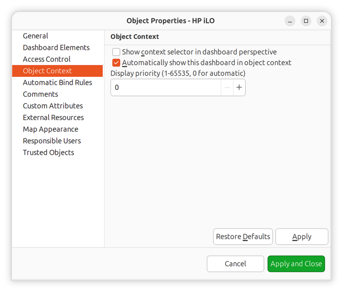

   Object Context property page

.. list-table::
   :header-rows: 1
   :widths: 35 65

   * - Property
     - Description
   * - Show context selector in dashboard perspective
     - Display object selector when dashboard is viewed in the Dashboard
       perspective, allowing users to switch context object
   * - Automatically show this dashboard in object context
     - When enabled, dashboard will appear as a tab in bound objects' context
       views
   * - Display priority (1-65535, 0 for automatic)
     - Controls tab ordering when multiple dashboards are shown in object
       context. Lower values appear first. Set to 0 for automatic ordering.

To associate a context dashboard with objects, use :ref:`auto-bind <dashboard-autobind>`
to define which objects should display this dashboard.

When a context dashboard is bound to an object, it appears in that object's view
tabs alongside other context views.

.. _dashboard-elements:

Dashboard Elements
------------------

Dashboard elements are the building blocks of dashboards. There are 32 element
types available, organized into functional categories.

Labels and Text
~~~~~~~~~~~~~~~

Label
^^^^^

Text label with configurable text and colors. Supports multi-line text and basic
formatting.

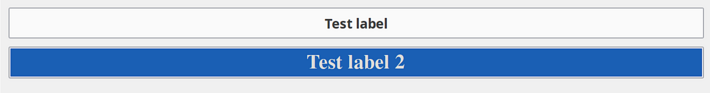

Charts
~~~~~~

Line Chart
^^^^^^^^^^

Displays time-series data as line graphs with configurable time ranges. Supports
up to 16 data sources per chart.

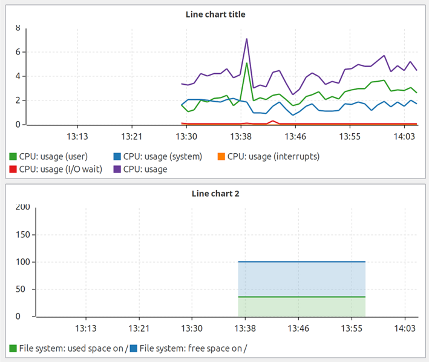

Bar Chart
^^^^^^^^^

Displays data as vertical or horizontal bars. Useful for comparing values across
multiple data sources.

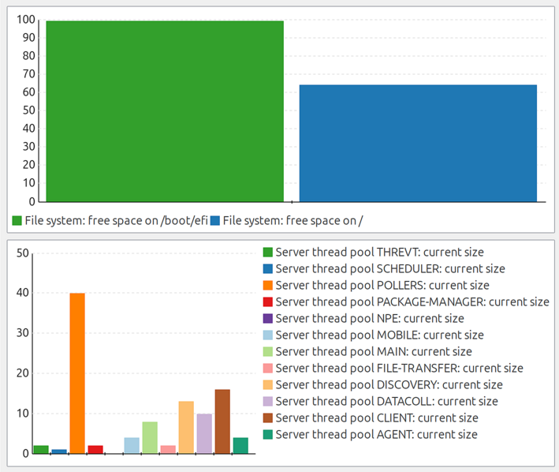

Pie Chart
^^^^^^^^^

Shows proportional data distribution as pie segments.

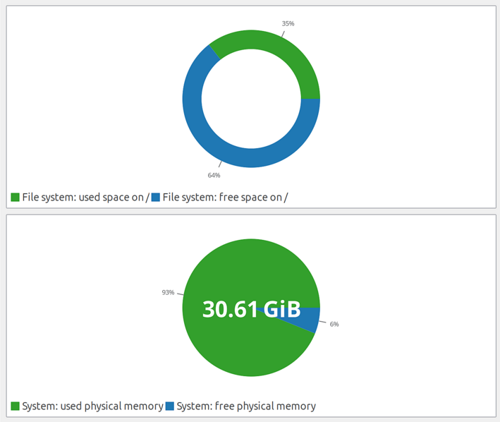

Tube Chart
^^^^^^^^^^

.. deprecated:: 4.2

   Use Bar Chart instead.

Displays data as a tube/cylinder visualization. Included for backward
compatibility with existing dashboards.

Scripted Charts
~~~~~~~~~~~~~~~

Scripted charts use NXSL scripts to dynamically generate chart data rather than
reading directly from DCIs. This allows complex data transformations and
aggregations.

Scripted Bar Chart
^^^^^^^^^^^^^^^^^^

Bar chart with script-defined data. The script runs in the context of a selected
object and returns data for chart segments.

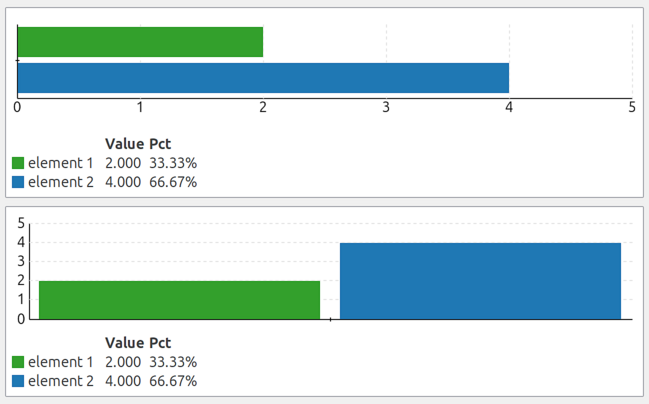

**Configuration:**

- **Object**: Context object for script execution (or dashboard context if not set)
- **Script**: NXSL script that returns a hash map with chart data

The script must return a hash map where keys are segment labels and values are
numeric values:

.. code-block:: c

   return %{"Segment A": 10, "Segment B": 17, "Segment C": 42};

Values can also be JSON strings with additional properties for custom display
names and colors:

.. code-block::

   return %{
      "key1": '{"name": "Display Name", "color": "#FF0000", "value": 42}',
      "key2": '{"name": "Another", "color": "#00FF00", "value": 58}'
   };

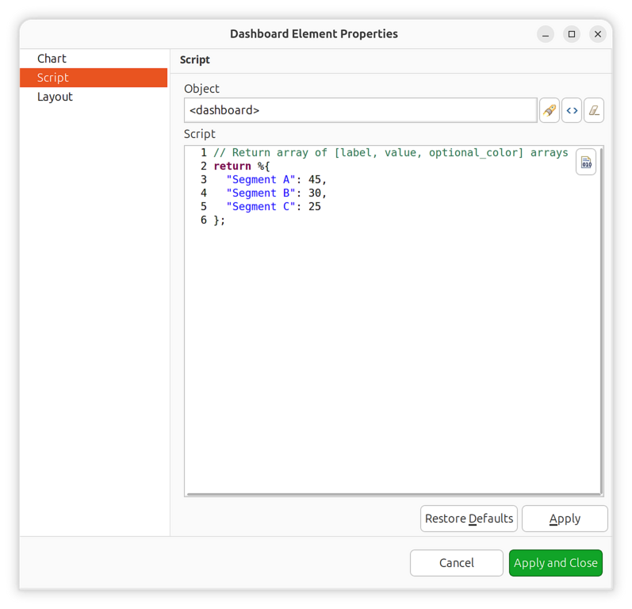

   Scripted chart configuration

Scripted Pie Chart
^^^^^^^^^^^^^^^^^^

Pie chart with script-defined data. Uses the same configuration and script format
as the Scripted Bar Chart.

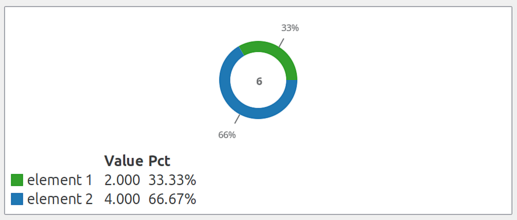

Table-Based Charts
~~~~~~~~~~~~~~~~~~

These charts visualize data from table DCIs (data collection items that return
multiple rows).

Bar Chart for Table DCI
^^^^^^^^^^^^^^^^^^^^^^^

Bar chart displaying data from a table DCI. Configure the column to use for
labels and values.

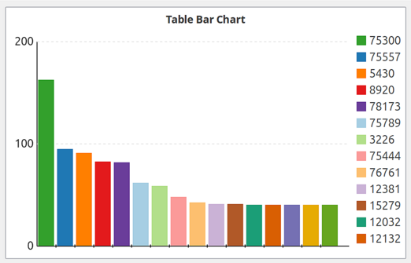

Pie Chart for Table DCI
^^^^^^^^^^^^^^^^^^^^^^^

Pie chart displaying data from a table DCI.

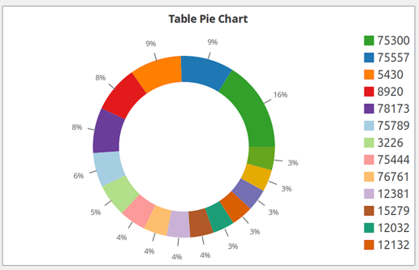

Tube Chart for Table DCI
^^^^^^^^^^^^^^^^^^^^^^^^

Tube visualization of table DCI data. Deprecated but supported for backward
compatibility.

Gauge Charts
~~~~~~~~~~~~

Gauges display single numeric values with configurable scales and color zones.

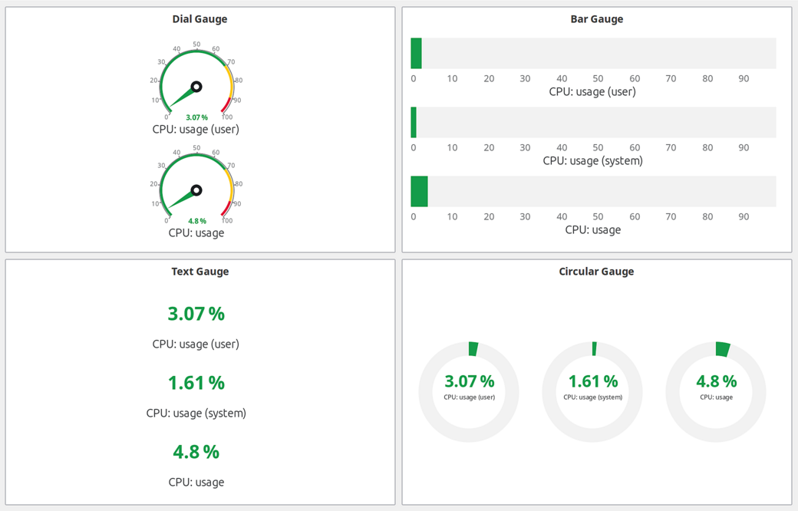

   Gauge element types: Dial, Bar, Text, and Circular

**Gauge Types:**

.. list-table::
   :header-rows: 1
   :widths: 20 80

   * - Type
     - Description
   * - Dial
     - Radial gauge with needle indicator. Classic speedometer-style display.
   * - Bar
     - Linear bar gauge (horizontal or vertical).
   * - Text
     - Numeric text display with optional color coding based on value ranges.
   * - Circular
     - Modern circular arc gauge with smooth gradient coloring.

**Color Zones:**

Gauges support color zones to visually indicate value ranges:

- **Left Red Zone**: Minimum value to left red threshold (critical low)
- **Left Yellow Zone**: Left red threshold to left yellow threshold (warning low)
- **Normal Zone**: Between left and right yellow thresholds (normal)
- **Right Yellow Zone**: Right yellow threshold to right red threshold (warning high)
- **Right Red Zone**: Right red threshold to maximum value (critical high)

**Color Modes:**

- **Zone**: Color changes based on which zone the value falls into
- **Custom**: Single custom color for the entire gauge
- **Threshold**: Color based on DCI threshold severity

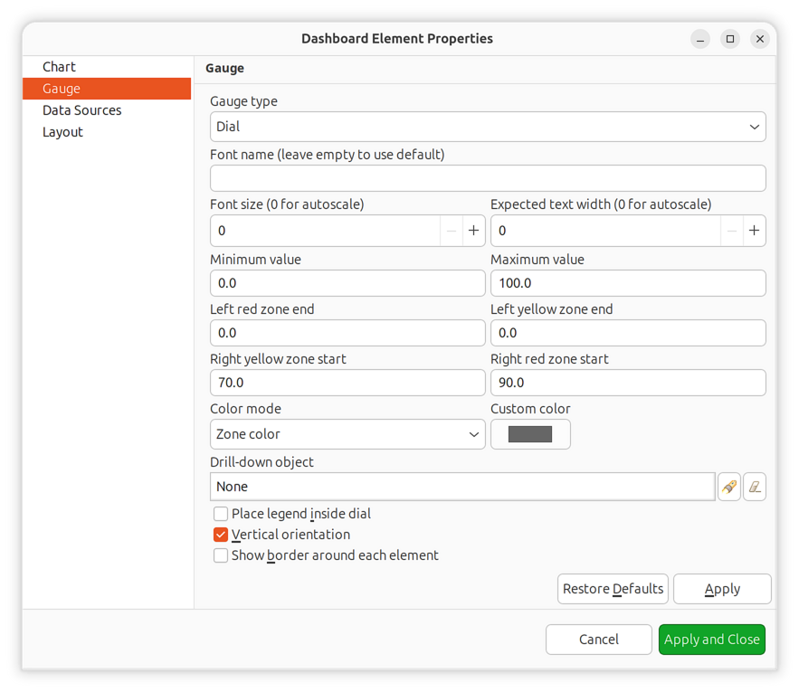

   Gauge color zones configuration

Status Elements
~~~~~~~~~~~~~~~

Status Chart
^^^^^^^^^^^^

Bar chart showing current status distribution for objects under a specified root
object. Displays counts of objects in each status level (Normal, Warning, Minor,
Major, Critical, etc.).

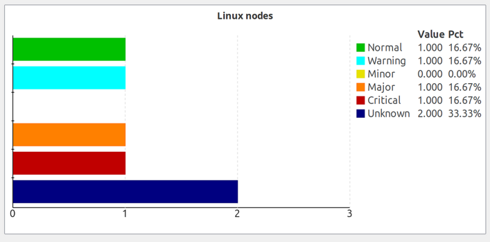

Status Indicator
^^^^^^^^^^^^^^^^

Shows the current status of one or more objects as colored shapes. Supports
multiple display modes and data sources.

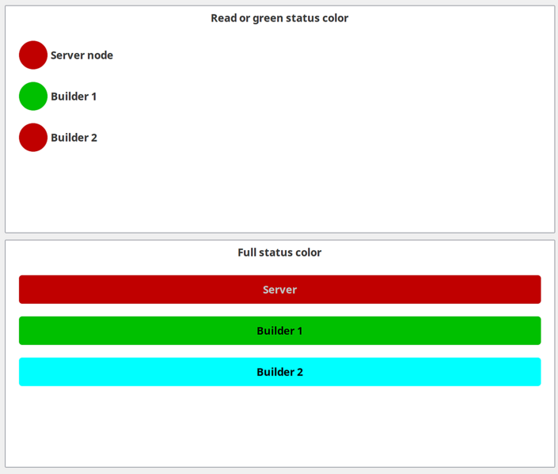

**Element Types:**

.. list-table::
   :header-rows: 1
   :widths: 25 75

   * - Type
     - Description
   * - Object
     - Display status of a specific object
   * - DCI
     - Display status based on a specific DCI's threshold state
   * - DCI Template
     - Display status from DCIs matching a name/description pattern
   * - Script
     - Calculate status using an NXSL script

**Shapes:**

- Circle (default)
- Rectangle
- Rounded Rectangle

**Label Position:**

- None (no label)
- Inside (label within the shape)
- Outside (label below/beside the shape)

**Script-Driven Mode:**

When using script element type, a single NXSL script is configured at the widget
level and provides status for all script-type elements. Each script-type element
has a **tag** field that is used as a key to look up its status from the script
result.

The script must return a hash map where keys match element tags and values are
integer status codes:

.. list-table::
   :header-rows: 1
   :widths: 15 85

   * - Value
     - Status
   * - 0
     - Normal
   * - 1
     - Warning
   * - 2
     - Minor
   * - 3
     - Major
   * - 4
     - Critical
   * - 5
     - Unknown

Example script:

.. code-block:: c

   return %{"cpu": $object->status, "memory": 3, "disk": 0};

In this example, elements with tags ``cpu``, ``memory``, and ``disk`` must be
defined on the elements configuration page. If an element's tag is not present
in the returned map, that element will be hidden.

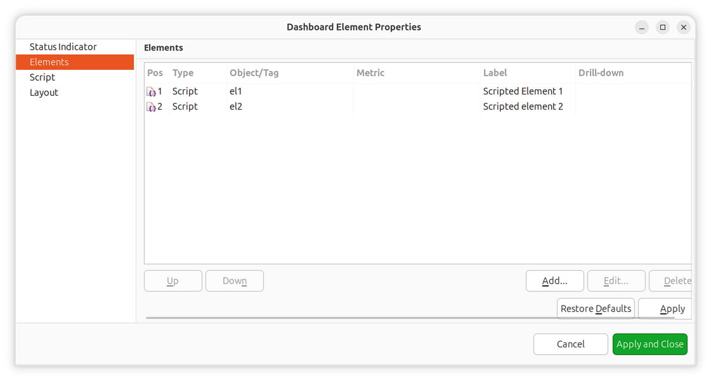

   Status indicator elements configuration with tags

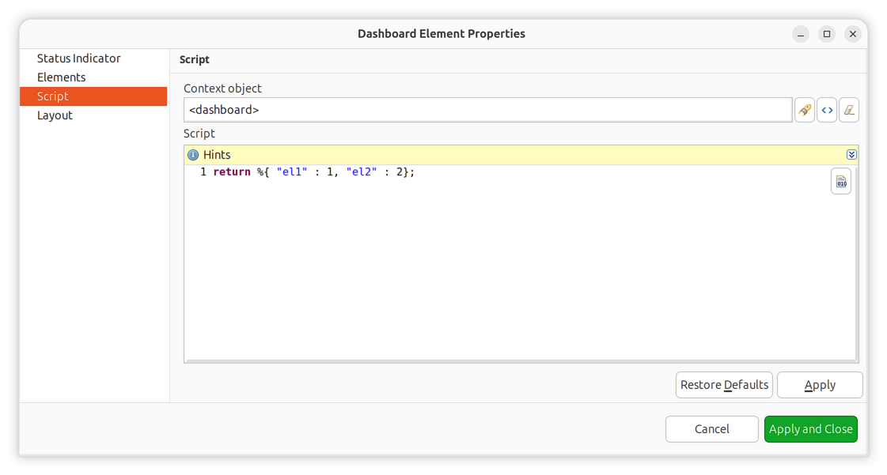

   Script configuration

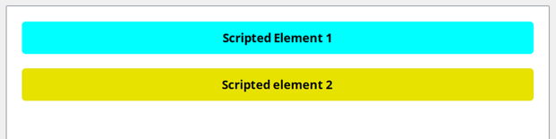

   Script-driven status indicator result

Status Map
^^^^^^^^^^

Displays object hierarchy as a visual status map with three view modes.

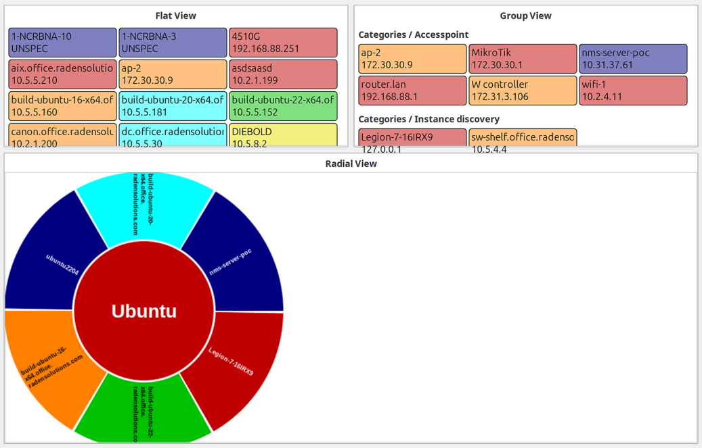

**View Modes:**

- **Flat**: All objects displayed as equal-sized rectangles without grouping
- **Group**: Objects grouped by their containers
- **Radial**: Hierarchical radial layout with parent in center

Monitors
~~~~~~~~

Alarm Viewer
^^^^^^^^^^^^

Displays :ref:`active alarms <alarms>` for a specified object subtree.

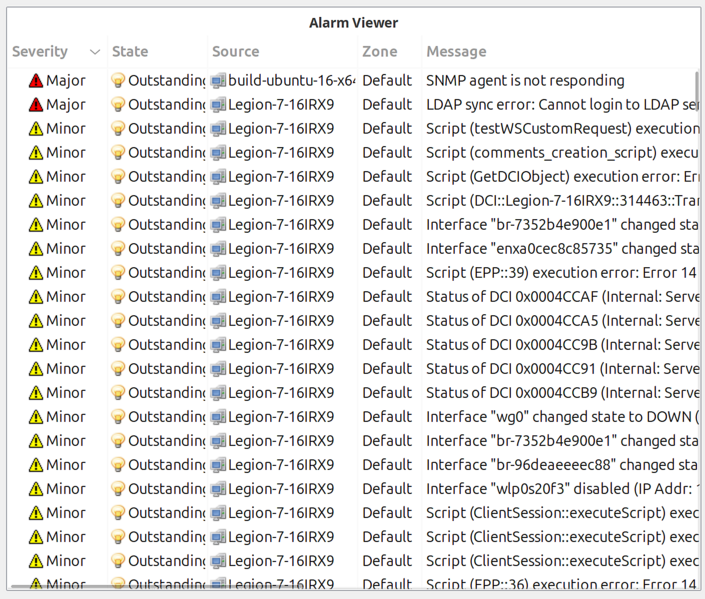

**Filter Options:**

.. list-table::
   :header-rows: 1
   :widths: 25 75

   * - Property
     - Description
   * - Root object
     - Show alarms only for this object and its children
   * - Severity filter
     - Bitmask to show only specific severity levels
   * - State filter
     - Bitmask to show only specific states (outstanding, acknowledged, resolved)
   * - Local sound
     - Enable audio notification for new alarms in this widget

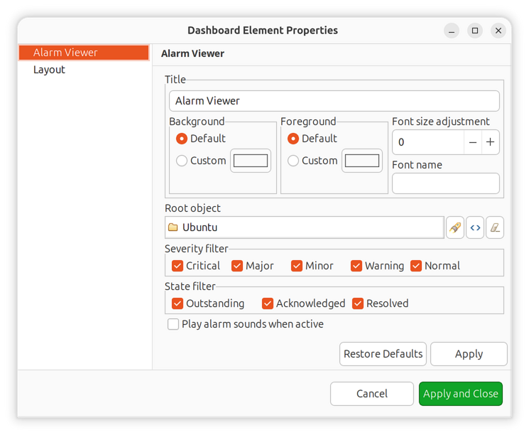

   Alarm viewer filter configuration

Syslog Monitor
^^^^^^^^^^^^^^

Real-time syslog message display for a specified object subtree.

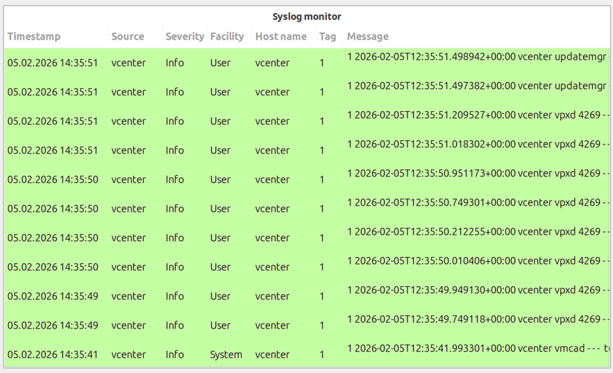

Configure a root object to filter messages to only those from specific objects.

SNMP Trap Monitor
^^^^^^^^^^^^^^^^^

Real-time SNMP trap display for a specified object subtree.

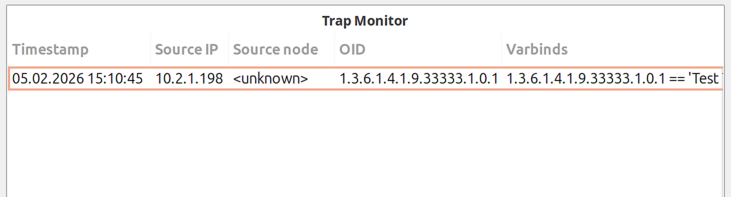

Configure a root object to filter traps to only those from specific objects.

Event Monitor
^^^^^^^^^^^^^

Real-time event display with filtering options.

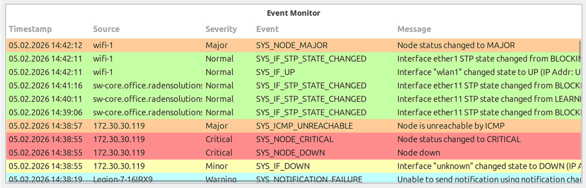

**Configuration Options:**

.. list-table::
   :header-rows: 1
   :widths: 25 75

   * - Property
     - Description
   * - Root object
     - Show events only for this object and its children
   * - Maximum events
     - Limit number of displayed events (default: 100)
   * - Time range
     - Show events from the last N minutes (default: 60)
   * - Event codes
     - Comma-separated list of event codes to display (empty = all events)
   * - Text filter
     - Text string to filter displayed events by message content

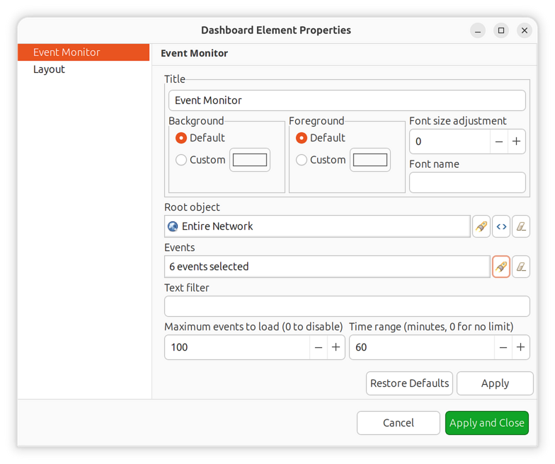

   Event monitor filter configuration

File Monitor
^^^^^^^^^^^^

Displays the contents of a file from an agent-managed node, similar to ``tail -f``.
Useful for monitoring log files in real-time.

.. figure:: _images/dashboards/element-file-monitor.png

**Configuration:**

.. list-table::
   :header-rows: 1
   :widths: 25 75

   * - Property
     - Description
   * - Object
     - Node with NetXMS agent where the file is located
   * - File name
     - Full path to the file on the monitored node
   * - History limit
     - Maximum number of lines to display (default: 1000)
   * - Filter
     - Regular expression to filter displayed lines
   * - Syntax highlighter
     - Syntax highlighting mode (if applicable)

Data Display
~~~~~~~~~~~~

Table Value
^^^^^^^^^^^

Displays the last values from a table DCI as a formatted table.

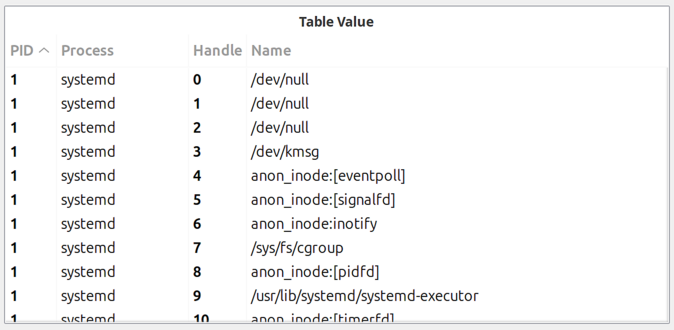

Availability Chart
^^^^^^^^^^^^^^^^^^

Pie chart showing availability percentage for a business service. Displays uptime
vs. downtime ratio.

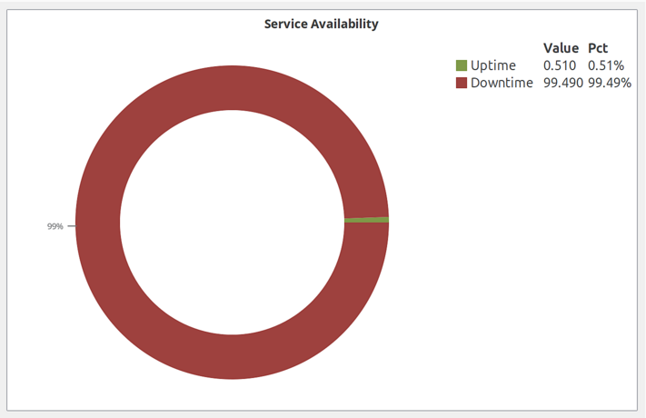

DCI Summary Table
^^^^^^^^^^^^^^^^^

Displays :ref:`DCI summary table <dci-summary-table-label>` information for
objects under a container.

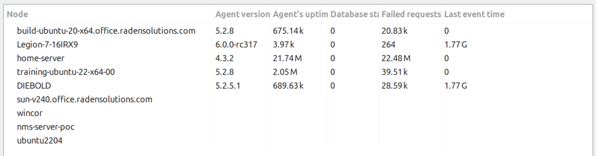

.. _dashboards-object-query:

Object Query
^^^^^^^^^^^^

Displays filtered object information in a customizable table format. Uses NXSL
queries to select objects and define computed columns.

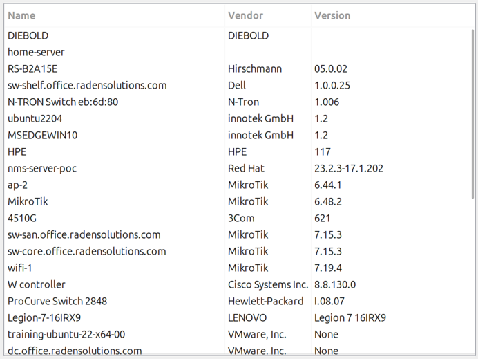

Object query has two main configuration pages:

**Query Configuration:**

The query script is executed on each object. If it returns ``true``, the object
is included in the result set. The script can define additional variables that
become columns in the result table.

Three syntax variants are available:

1. **Special "with" syntax** for additional columns with metadata:

.. code-block:: c

   with
     criticalCount = {
       return GetDCIValue($object, FindDCIByDescription($object, "Critical Alarms"));
     },
     warningCount = {
       return GetDCIValue($object, FindDCIByDescription($object, "Warning Alarms"));
     }
   $object->alarmCount > 0 && !$object->isInMaintenanceMode

2. **NXSL script with global variables:**

.. code-block:: c

   if ($object->alarmCount == 0 || $object->isInMaintenanceMode)
     return false;
   global criticalCount = GetDCIValue($object, FindDCIByDescription($object, "Critical Alarms"));
   global warningCount = GetDCIValue($object, FindDCIByDescription($object, "Warning Alarms"));
   return true;

3. **NXSL script returning a map:**

.. code-block:: c

   if ($object->alarmCount == 0)
     return false;
   return {
     "criticalCount" => GetDCIValue($object, FindDCIByDescription($object, "Critical Alarms")),
     "warningCount" => GetDCIValue($object, FindDCIByDescription($object, "Warning Alarms"))
   };

**Query Page Options:**

- **Order by**: Comma-separated list of columns. Use ``+`` for ascending (default)
  or ``-`` for descending (e.g., ``-criticalCount,+name``)
- **Refresh interval**: How often to re-run the query
- **Record limit**: Maximum number of objects to display

**Object Properties Configuration:**

Define which columns to display and their order:

- **Attribute/Variable name**: Object attribute or variable name from query
- **Display name**: Column header text
- **Data type**: How to format and sort the column

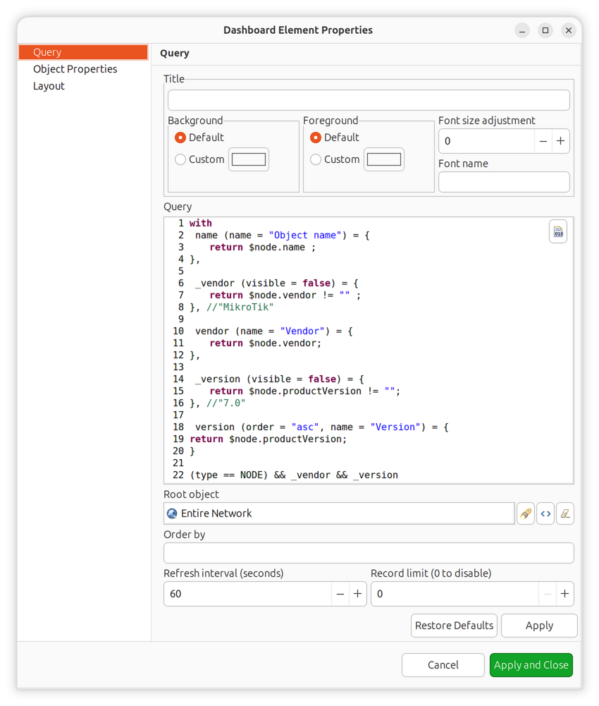

   Query configuration example

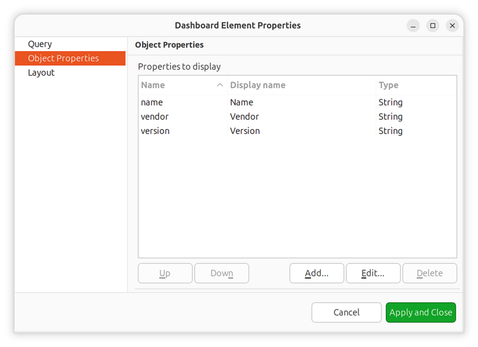

   Object properties configuration

Embedded Content
~~~~~~~~~~~~~~~~

Dashboard
^^^^^^^^^

Embeds another dashboard object (or multiple dashboards) within the current
dashboard. When multiple dashboards are added, they rotate automatically.

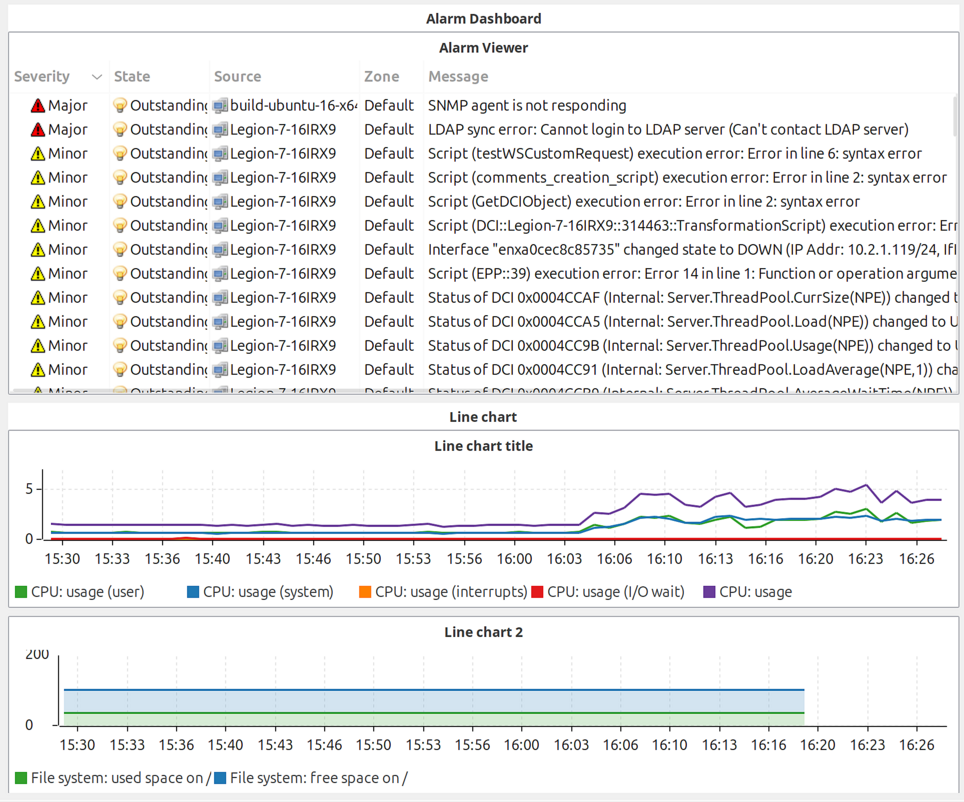

Network Map
^^^^^^^^^^^

Renders a :ref:`network map <network_map>` object as a dashboard element.

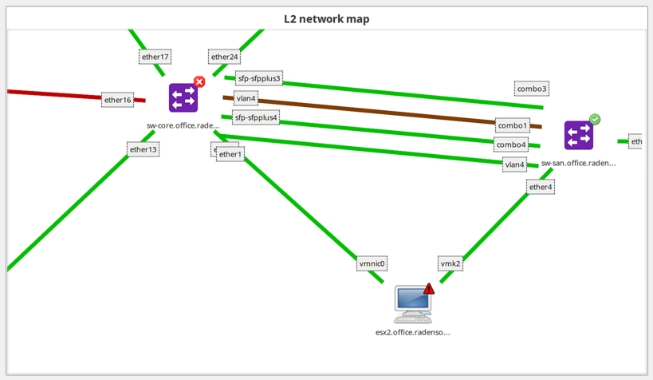

Geo Map
^^^^^^^

Displays a geographic map centered at a specified location or showing object
locations.

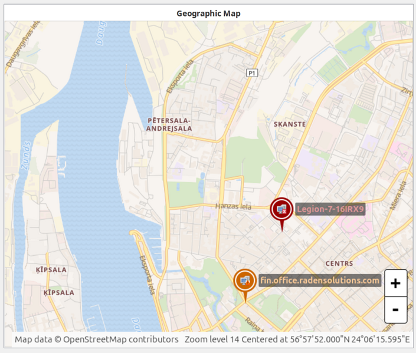

Web Page
^^^^^^^^

Embeds a web page at a specified URL within the dashboard. Useful for integrating
external monitoring tools or documentation.

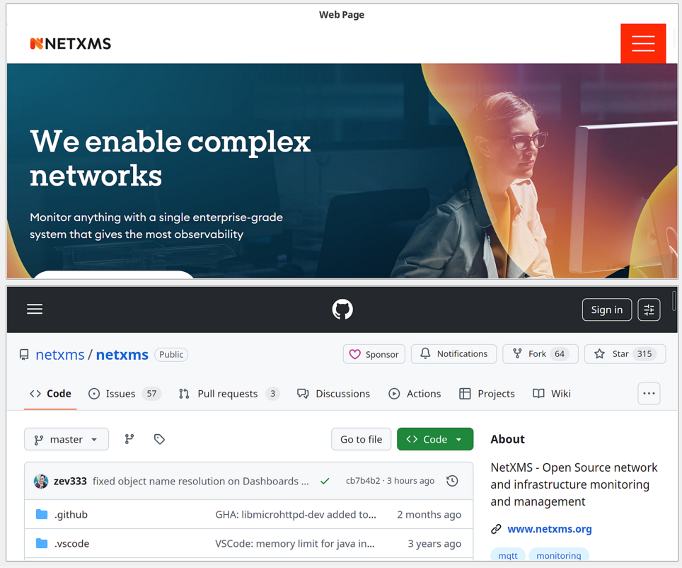

Layout Elements
~~~~~~~~~~~~~~~

Separator
^^^^^^^^^

Visual separator for organizing dashboard layout. Can be displayed as a line,
box, or empty space.

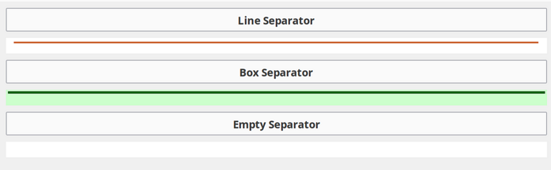

**Separator Types:**

- Line (horizontal or vertical)
- Box (rectangular border)
- Empty (invisible spacer)

Interactive Elements
~~~~~~~~~~~~~~~~~~~~

Object Tools
^^^^^^^^^^^^

Displays buttons for executing pre-configured :ref:`object tools <object_tools>`.

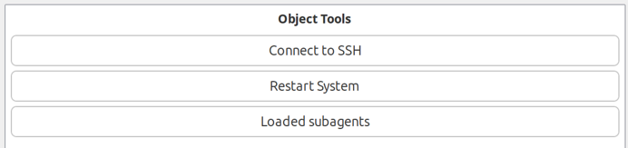

Port View
^^^^^^^^^

Shows a schematic representation of network device ports with status indication.

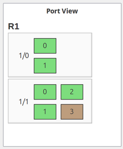

Rack Diagram
^^^^^^^^^^^^

Displays a rack visualization showing equipment placement.

.. figure:: _images/dashboards/element-rack-diagram.png

**View Options:**

- Front view only
- Back view only
- Both views (side by side or combined)

Service Components
^^^^^^^^^^^^^^^^^^

Displays the hierarchy of objects in an :guilabel:`Infrastructure Service`
starting from a selected root object.

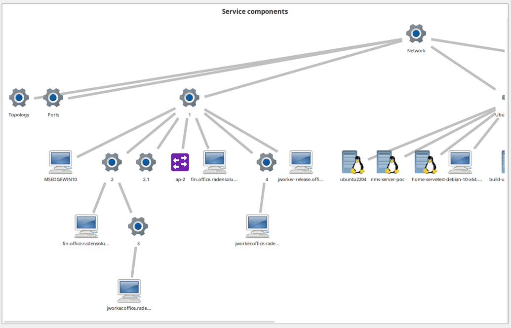

.. _dashboard-element-config:

Element Configuration
---------------------

All dashboard elements share common configuration options plus element-specific
settings.

Title Configuration
~~~~~~~~~~~~~~~~~~~

Every element can have a customizable title displayed above the element content.

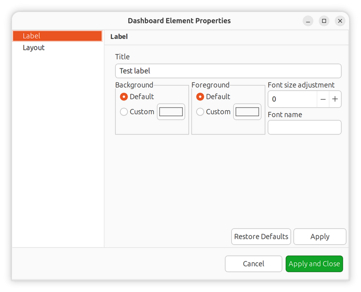

   Title configuration options

.. list-table::
   :header-rows: 1
   :widths: 25 75

   * - Property
     - Description
   * - Title
     - Text displayed above the element
   * - Title foreground
     - Text color for the title
   * - Title background
     - Background color for the title bar
   * - Title font name
     - Custom font family for the title
   * - Title font size
     - Size adjustment relative to default (positive or negative)

Chart Configuration
~~~~~~~~~~~~~~~~~~~

Common settings for all chart elements (Line, Bar, Pie, Gauge, etc.).

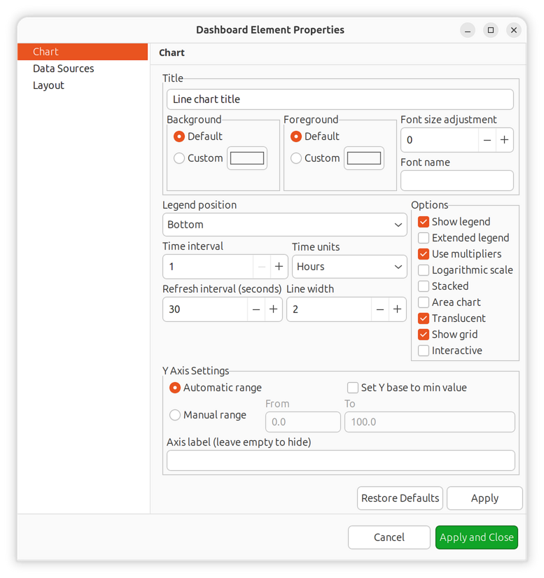

.. list-table::
   :header-rows: 1
   :widths: 25 75

   * - Property
     - Description
   * - Show legend
     - Display chart legend
   * - Extended legend
     - Show additional statistics in legend (min, max, average)
   * - Legend position
     - Location of legend (Left, Right, Top, Bottom)
   * - Translucent
     - Enable semi-transparent rendering
   * - Auto scale
     - Automatically adjust Y-axis scale to fit data
   * - Min Y scale
     - Fixed minimum Y-axis value (when auto scale is disabled)
   * - Max Y scale
     - Fixed maximum Y-axis value (when auto scale is disabled)
   * - Y axis label
     - Label text for the Y-axis
   * - Modify Y base
     - Use minimum DCI value as Y-axis base instead of zero
   * - Refresh rate
     - How often to refresh chart data (seconds)

Drill-Down Navigation
~~~~~~~~~~~~~~~~~~~~~

Several element types support drill-down navigation, allowing users to click on the
element to navigate to another object (typically a dashboard with more detailed
information).

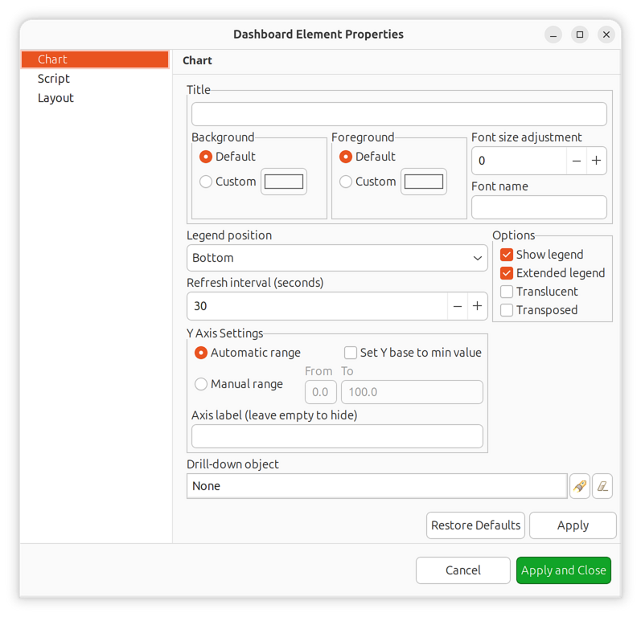

   Drill-down object selection

**Supported element types:**

- DCI-based charts (Line Chart, Bar Chart, Pie Chart, Gauge, Scripted Bar Chart, Scripted Pie Chart)
- Table-based charts (Table Bar Chart, Table Pie Chart, Table Tube Chart)
- Status Indicator (per-element drill-down)

Configure drill-down in the element properties:

.. list-table::
   :header-rows: 1
   :widths: 25 75

   * - Property
     - Description
   * - Drill-down object
     - Object to navigate to when element is clicked (usually a dashboard)

When a drill-down object is configured, clicking on the element will open that
object's view. For status indicators, each individual element can have its own
drill-down target.

Data Sources
~~~~~~~~~~~~

For DCI-based charts, configure data sources to define which DCIs provide the
chart data.

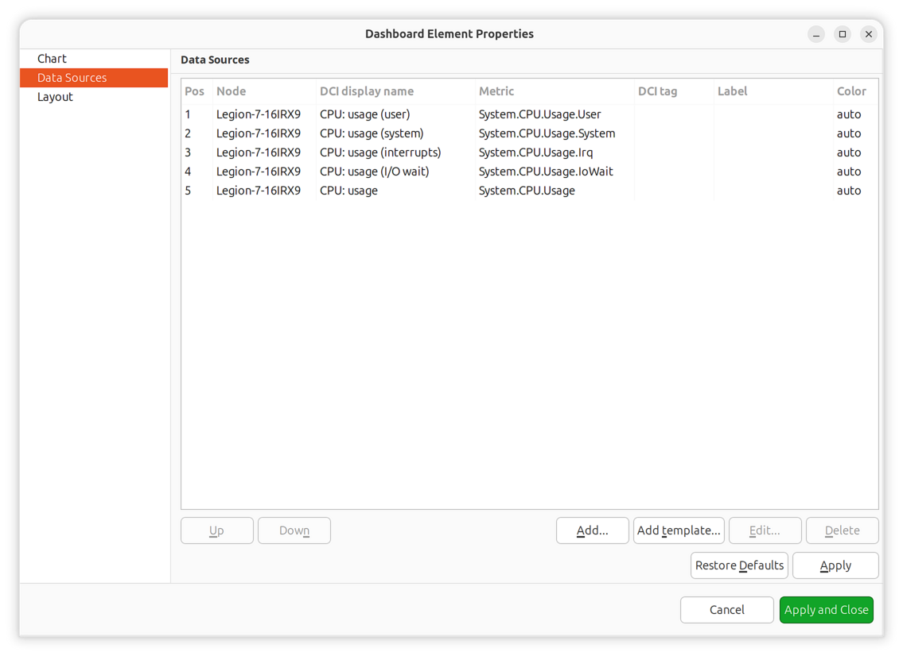

.. list-table::
   :header-rows: 1
   :widths: 25 75

   * - Property
     - Description
   * - Data collection item
     - DCI to use as data source
   * - Display name
     - Legend label (uses DCI description if empty)
   * - Color
     - Line/bar color (automatic if not specified)
   * - Area chart
     - Display as filled area instead of line (line charts only)
   * - Show thresholds
     - Display threshold lines on chart (line charts only)

Up to 16 DCIs can be added to a single chart.

.. _dashboards-layout:

Dashboard Layout
----------------

Dashboard uses a grid concept for element positioning. Available space is divided
into rows and columns, with each element occupying one or more cells.

Layout Properties
~~~~~~~~~~~~~~~~~

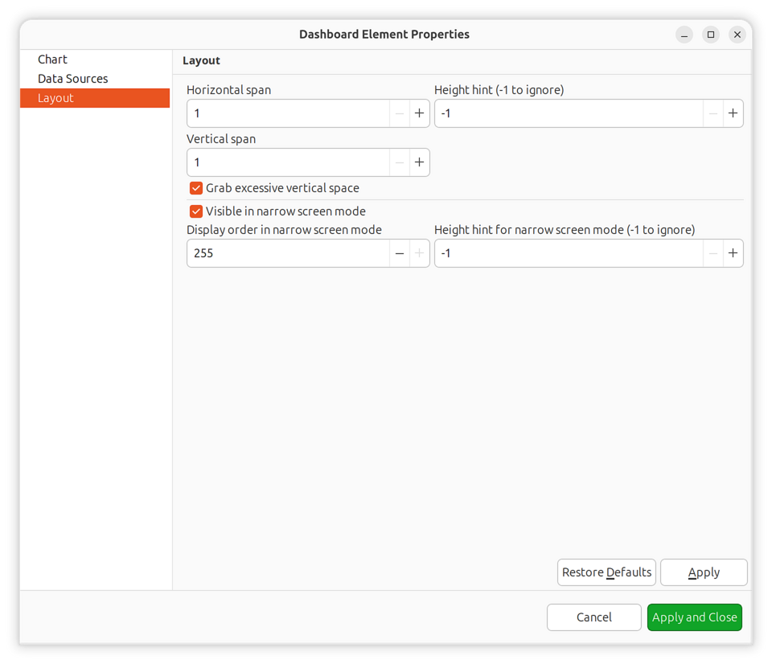

.. list-table::
   :widths: 25 75
   :header-rows: 1

   * - Property
     - Description
   * - Horizontal span
     - Number of grid cells this element occupies horizontally
   * - Vertical span
     - Number of grid cells this element occupies vertically
   * - Horizontal alignment
     - How element aligns within its cells (FILL, CENTER, LEFT, RIGHT)
   * - Vertical alignment
     - How element aligns within its cells (FILL, CENTER, TOP, BOTTOM)
   * - Width hint
     - Suggested width in pixels (-1 for automatic)
   * - Height hint
     - Suggested height in pixels (-1 for automatic)
   * - Grab vertical space
     - Whether element should expand to fill available vertical space

**Alignment Values:**

.. list-table::
   :widths: 25 75
   :header-rows: 1

   * - Value
     - Description
   * - FILL
     - Element fills the entire cell and grabs excess space
   * - CENTER
     - Element centered within cell
   * - LEFT/TOP
     - Element aligned to left/top edge of cell
   * - RIGHT/BOTTOM
     - Element aligned to right/bottom edge of cell

Grid Layout Example
~~~~~~~~~~~~~~~~~~~

The number of columns is configured in dashboard properties. Rows are calculated
automatically based on elements and their spans.

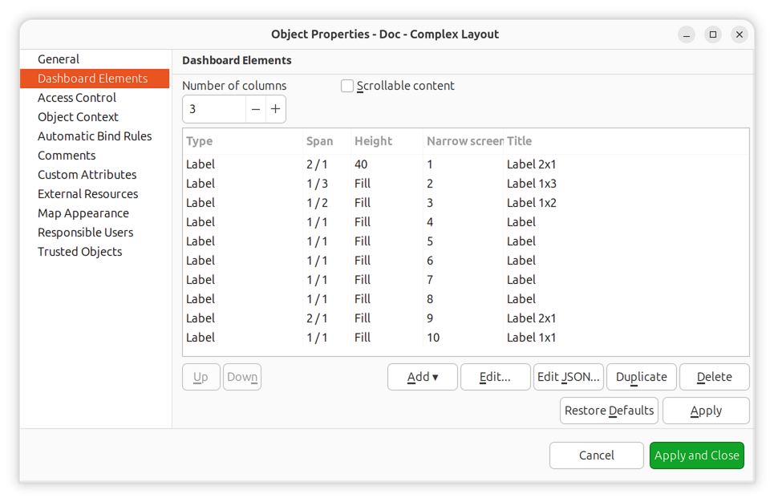

   Complex layout configuration

This configuration renders as:

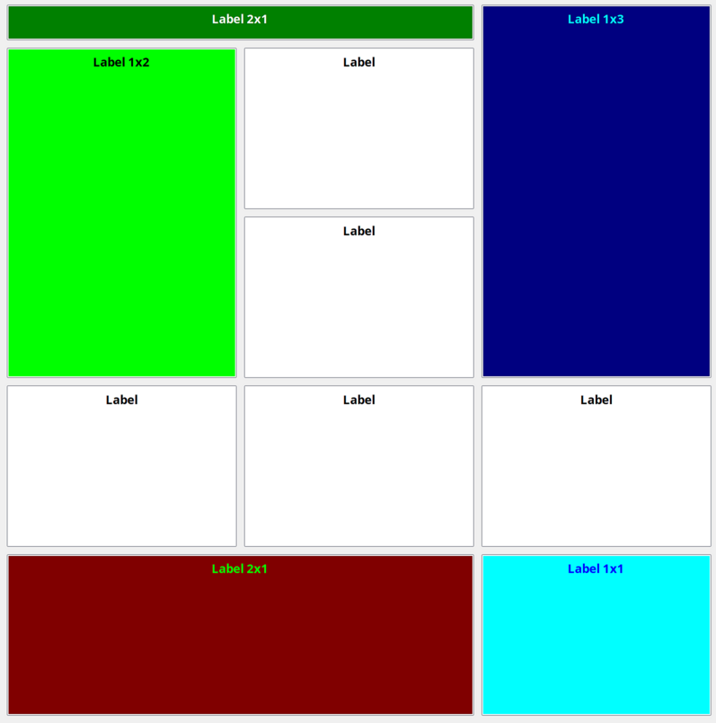

   Resulting dashboard layout

Narrow Screen Mode
~~~~~~~~~~~~~~~~~~

Dashboards support responsive design for mobile devices and narrow screens.
When the display width is below a threshold, the dashboard switches to narrow
screen mode.

**Layout Properties for Narrow Screen:**

.. list-table::
   :widths: 25 75
   :header-rows: 1

   * - Property
     - Description
   * - Show in narrow screen mode
     - Whether to display this element on narrow screens
   * - Narrow screen order
     - Sort order for elements in narrow screen mode (0-255)
   * - Narrow screen height hint
     - Height hint specifically for narrow screen display

In narrow screen mode, elements are displayed in a single column, sorted by their
narrow screen order value. Elements with :guilabel:`Show in narrow screen mode`
disabled are hidden entirely.

This allows creating dashboards that work well on both desktop and mobile devices
by hiding non-essential elements and reordering remaining elements for vertical
display.

.. _dashboards-rotation:

Dashboard Rotation
------------------

To display multiple dashboards in a loop (useful for monitoring displays):

1. Create all dashboards you want to show
2. Create a new dashboard with a single :guilabel:`Dashboard` element
3. Add all target dashboards to that element's list
4. Set the rotation interval (time each dashboard is displayed)

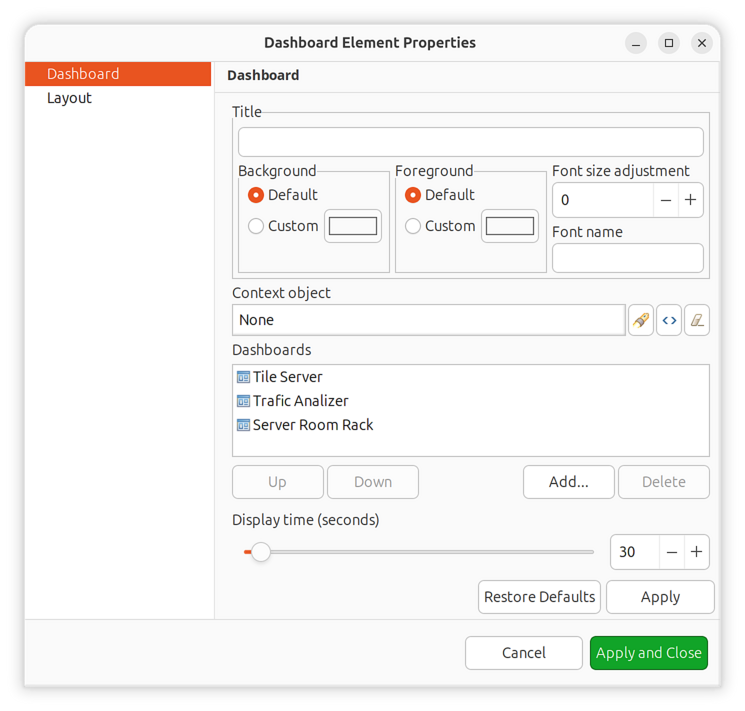

   Configuration for rotating two dashboards every 40 seconds

Delegated Access
----------------

Dashboards can display data from objects that users don't have direct read
access to, using the **Delegated read** access right. This enables creating
monitoring dashboards for users who should see specific visualizations without
having full access to the underlying infrastructure.

Delegated read only allows viewing object data through the dashboard. Users
cannot browse these objects directly or access data outside the dashboard
context.

**Delegated read** can be set on specific objects, on containers or on root
objects, e.g. on :guilabel:`Infrastructure Services`.

.. versionadded:: 5.0

.. _dashboards-reference:

Reference
---------

Element Types
~~~~~~~~~~~~~

Complete list of all dashboard element types:

.. list-table::
   :header-rows: 1
   :widths: 30 70

   * - Type
     - Description
   * - Label
     - Text label with configurable formatting
   * - Line Chart
     - Time-series line graph
   * - Bar Chart
     - Vertical or horizontal bar chart
   * - Pie Chart
     - Proportional pie chart
   * - Tube Chart
     - Tube visualization (deprecated)
   * - Status Chart
     - Object status distribution chart
   * - Status Indicator
     - Object/DCI status display
   * - Dashboard
     - Embedded dashboard(s)
   * - Network Map
     - Embedded network map
   * - Geo Map
     - Geographic map view
   * - Alarm Viewer
     - Active alarm list
   * - Availability Chart
     - Service availability pie chart
   * - Gauge
     - Single-value gauge (dial, bar, text, circular)
   * - Web Page
     - Embedded web page
   * - Table Bar Chart
     - Bar chart from table DCI
   * - Table Pie Chart
     - Pie chart from table DCI
   * - Table Tube Chart
     - Tube chart from table DCI (deprecated)
   * - Separator
     - Visual separator element
   * - Table Value
     - Table DCI data display
   * - Status Map
     - Hierarchical status visualization
   * - DCI Summary Table
     - Summary table for container DCIs
   * - Syslog Monitor
     - Real-time syslog display
   * - SNMP Trap Monitor
     - Real-time trap display
   * - Event Monitor
     - Real-time event display
   * - Service Components
     - Infrastructure service hierarchy
   * - Rack Diagram
     - Rack equipment visualization
   * - Object Tools
     - Tool execution buttons
   * - Object Query
     - Custom object query table
   * - Port View
     - Network port status schematic
   * - Scripted Bar Chart
     - Script-generated bar chart
   * - Scripted Pie Chart
     - Script-generated pie chart
   * - File Monitor
     - Remote file content display

Gauge Types
~~~~~~~~~~~

.. list-table::
   :header-rows: 1
   :widths: 25 75

   * - Type
     - Description
   * - Dial
     - Radial gauge with needle indicator (speedometer style)
   * - Bar
     - Linear bar gauge, horizontal or vertical
   * - Text
     - Numeric text display with optional color coding
   * - Circular
     - Modern circular arc gauge with gradient fill

Status Indicator Shapes
~~~~~~~~~~~~~~~~~~~~~~~

.. list-table::
   :header-rows: 1
   :widths: 25 75

   * - Shape
     - Description
   * - Circle
     - Circular indicator (default)
   * - Rectangle
     - Square/rectangular indicator
   * - Rounded Rectangle
     - Rectangle with rounded corners

Status Indicator Element Types
~~~~~~~~~~~~~~~~~~~~~~~~~~~~~~

.. list-table::
   :header-rows: 1
   :widths: 25 75

   * - Type
     - Description
   * - Object
     - Status from object status
   * - DCI
     - Status from specific DCI threshold
   * - DCI Template
     - Status from DCIs matching pattern
   * - Script
     - Status from NXSL script execution

Graphs
======

You can view collected data in a graphical form, as a line chart. To view
values of some DCI as a chart, first open either :guilabel:`Data Collection`
Editor or :guilabel:`Last Values` view for a host. You can do it from the
:guilabel:`Object Browser` or map by selection host, right-clicking on it, and
selecting :guilabel:`Data collection` or :guilabel:`Last DCI values`. Then,
select one or more DCIs (you can put up to 16 DCIs on one graph), right-click
on them and choose :guilabel:`Graph` from the pop-up menu. You will see
graphical representation of DCI values for the last hour.

When the graph is open, you can do various tasks:

Select different time interval
------------------------------

By default, you will see data for the last hour. You can select different time
interval in two ways:

#. Select new time interval from presets, by right-clicking on the graph, and
   then selecting :guilabel:`Presets` and appropriate time interval from the
   pop-up menu.
#. Set time interval in graph properties dialog. To access graph properties,
   right-click on the graph, and then select :guilabel:`Properties` from the
   pop-up menu. Alternatively, you can use main application menu:
   :menuselection:`Graph --> Properties`. In the properties dialog, you will
   have two options: select exact time interval (like ``12/10/2005 from 10:00
   to 14:00``) or select time interval based on current time (like ``last two
   hours``).

Turn on automatic refresh
-------------------------

You can turn on automatic graph refresh at a given interval in graph properties
dialog. To access graph properties, right-click on it, and select
:guilabel:`Properties` from the pop-up menu. Alternatively, you can use main
application menu: :menuselection:`Graph --> Properties`. In the properties
dialog, select the :guilabel:`Refresh automatically` checkbox and enter a
desired refresh interval in seconds in edit box below. When automatic refresh
is on, you will see :guilabel:`Autoupdate` message in the status bar of graph
window.

Change colors
-------------

You can change colors used to paint lines and graph elements in the graph
properties dialog. To access graph properties, right-click on it, and select
:guilabel:`Properties` from the pop-up menu. Alternatively, you can use main
application menu: :menuselection:`Graph --> Properties`. In the properties
dialog, click on colored box for appropriate element to choose different color.

Save current settings as predefined graph
-----------------------------------------

You can save current graph settings as predefined graph to allow quick and easy
access in the future to information presented on graph. Preconfigured graphs
can be used either by you or by other |product_name| users, depending on settings. To
save current graph configuration as predefined graph, select :guilabel:`Save`
as predefined from graph view menu. The following dialog will appear:

.. figure:: _images/define_graph.png

In :guilabel:`Graph name` field, enter desired name for your predefined graph.
It will appear in predefined graph tree exactly as written here. You can use
``->`` character pair to create subtree. For example, if you name your graph
``NetXMS Server->System->CPU utilization (iowait)`` it will appear in the tree
as following:

.. figure:: _images/predefined_graph_tree.png

You can edit predefined graph by right-clicking on it in predefined graph tree,
and selecting :guilabel:`Properties` from context menu. On
:guilabel:`Predefined Graph` property page you can add users and groups who
will have access to this graph. Note that user creating the graph will always
have full access to it, even if he is not in access list.

If you need to delete predefined graph, you can do it by right-clicking on it
in predefined graph tree, and selecting :guilabel:`Delete` from context menu.

Save current settings as template graph
---------------------------------------

.. figure:: _images/save_as_temp_graph.png

Current graph settings can be saved as a template graph for an easy template graph creation. The difference between predefined graphs and template graphs are that template graphs are not configured to view specific DCI`s on a node, instead they are configured to view DCI names that can be found on many nodes (e.g. ``FileSystem.FreePerc(/)``). This allows for the creation of certain graph templates to monitor, for example, disk usage that can be reused on any node to which the appropreate DCI`s are applied on via :ref:`dci-configuration`.

See detailed information on template graphs in the section :ref:`template-graph-conf`.

In the Graph name field of the pop-up save dialog, enter the desired name for the template graph by which you can later identify your it in the :ref:`template-graph-conf` which can be found in :menuselection:`Configuration-->Template Graph Configuration`.

.. figure:: _images/temp_graph_menu.png

Template graphs can be accessed in the :guilabel:`Object Browser` as seen on the screenshot above. When a template graph is created, it will appear in the sub-menus of the nodes found in :guilabel:`Object Browser`, the rest of the settings can be accessed by editing a template graph in the :ref:`template-graph-conf`.

.. _template-graph-conf:

Template Graph Configuration
----------------------------

Template graphs are used to ease the monitoring of a pre-set list of DCI`s on multiple nodes by adding a list of DCI names to the template source. This allows for the possibility to create templates to monitor specific data on any node to which the appropriate DCI`s are applied on.

.. figure:: _images/temp_graph_conf.png

The :guilabel:`Template Graph Configuration` is used to create and edit template graphs. Properties for already created template graphs can be brought up by double clicking the template graph you wish to edit and new ones can be added by pressing the green cross on the top right or by right clicking and selecting :guilabel:`Create new template graph`.

.. figure:: _images/temp_graph_conf_acl.png

	Name and access rights of a graph

The above property page provides the possibility to configure the name of the template graph and the access rights. The user who has created the template graph will have full access to it even though the username will not show up in the access right list.

.. figure:: _images/temp_graph_conf_gen.png

	General graph properties.

Title:

	- The title that the graph will have when opened.
	- The title can contain special characters described in :ref:`object_tools_macro`.

Options:

.. list-table::
   :widths: 25 50
   :header-rows: 1

   * - Option
     - Description
   * - Show grid lines
     - Enable or disable grid lines for the graph.
   * - Stacked
     - Stacks the graphs of each value on top of one another to be able to see the total value easier (e.g. useful when monitoring cpu usage).
   * - Show legend
     - Enable or disable the legend of the graph.
   * - Show extended legend
     - Enable or disable the extended legend of the graph (Max, Avg, Min, Curr).
   * - Refresh automatically
     - Enable or disable auto-refresh.
   * - Logarithmic scale
     - Use the logarithmic scale for the graph.
   * - Translucent
     - Enable or disable the translucency of the graph.
   * - Show host names
     - Show host name of the node from which the value is taken.
   * - Area chart
     - Highlights the area underneath the graph.
   * - Line width
     - Adjust the width of the lines.
   * - Legend position
     - Set the position of the legend.
   * - Refresh interval
     - Set the refresh interval.

Time Period:

Provides the possibility to configure the time period of the graph. It is possible to set a dynamic time frame (Back from now) and a static time frame (Fixed time frame).

Y Axis Range:

Adjust the range of the Y axis on the graph.

.. figure:: _images/temp_graph_conf_filter.png

	Template graph filter properties.

It may be necessary to set certain filters for a template graph. This can be useful if the graph contains DCI names that are only available on |product_name| agent or are SNMP dependant.

More information on filters can be found in :ref:`object_tools_filter`.

.. figure:: _images/temp_graph_conf_source.png

	Template graph sources

There are two options to add sources to the template graph. Sources can be added manually by configuring the Data Source parameters yourself or by importing data source information from DCI`s that have already been applied to other nodes.

.. figure:: _images/temp_graph_conf_modify.png

When adding or editing a source, it is possible to use Java regex in the DCI Name and DCI Description fields. This can be handy when used with the Multiple match option which will use all DCI`s that match the particular regex. The order in which the DCI list is searched is first by DCI Name and then by DCI Description.

History
=======

You can view collected data in a textual form, as a table with two columns -
:guilabel:`timestamp` and :guilabel:`value`. To view values of some DCI as a
table, first open either :guilabel:`Data Collection Editor` or :guilabel:`Last
Values` view for a host. You can do it from the :guilabel:`Object Browser` or
map by selection host, right-clicking on it, and selecting :guilabel:`Data
collection` or :guilabel:`Last DCI values`. Then, select one or more DCIs (each
DCI data will be shown in separate view), right-click on them and choose
:guilabel:`Show history` from the pop-up menu. You will see the last 1000
values of the DCI.

.. todo:: Export DCI data

.. _dci-summary-table-label:

Summary table
=============

It is possible to see DCI data as a table where each line is one node and each
column is a DCI. It can be configured for each summary table which DCIs should be
present on it.

.. figure:: _images/summary_table.png

Configuration
-------------

DCI summary table can be configured in Configuration -> Summary Table.

.. figure:: _images/configure_dci_summary_table.png

General:

  - Menu path - path where this summary table can be found. You can use
    ``->`` character pair to create subtree like "Linux->System information".
  - Title - title of the summary table.

Columns:

  - This is the list if DCI's that will be shown on the summary table.
    Name is the name of column and DCI Name is DCI parameter name.

     - Multivalued column is intended to present string DCIs that contain several
       values divided by specified separator. Each value is presented on a separate line in the column.
     - If **Use regular expression for parameter name matching** is enabled, a regular expression is specified in **DCI name** field.
       If several DCIs will be matched on a node, only one will be displayed.
  - Import button allows to select a DCI from existing object.

Filter:
  - Filter script is executed for each node to determine, if that node should be included in a summary table.
    Filter script is defined with help of :term:`NXSL` scripting language.

Usage
-----

After DCI summary table is configured it can be accessed in container
object (Subnet, container...) context menu under "Summary tables".
