.. _visualisation:

##############################
Data and Network visualisation
##############################

.. _network_map:

Network maps
============

Network map objects can be found in "Object browser" under "Network Maps". There can be 
created and deleted maps and map groups. Maps can be organized in groups. 

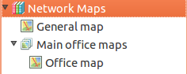

Creating Maps
-------------

There are 3 types of map that can be created:
   * Custom - will be created empty map.
   * Layer 2 Topology - will create map(if possible) with layer 2 topology of selected object.
   * IP Topology - will create map with known IP Topology of selected object. (More about network topology can be found there :ref:`topology`)
  

Type of created map affects only on initial map setup.

Edit Maps
---------
   
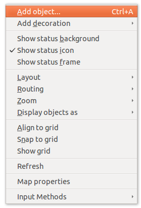

Adding Objects
--------------

Objects to map can be added in tow ways:
   1. Just drag and drop object to map from object browser.
   2. "Add object..." from menu. 

To remove object from map:
   * Select object, right click and select "Remove from map" option.

Adding Links between Objects
----------------------------

Objects can be linked with a line. 

To link objects:
   * Select two of objects with help of CTRL button and press "Link selected objects" button. 

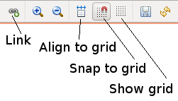

To remove the link:
   * Select line, right click and select "Remove from map" option.

**Link properties:**

Select line, right click and select "Properties".

There can be configured:
   * Line name
   * Line comments shown near each connected object
   * Line colour 
      * Default - grey
      * Based on object status - object should be selected
      * Custom colour
   * Routing algorithm
      * Map Default - will be taken default selection for whole map
      * Direct - straight line without bend points
      * Manhattan - line with automatic bend points
      * Bend points - bend point can be done manually with double click on the line (can be used to do dual link)
   * Data Source(there can be configured DCI values and text near them that will be displayed on a link)
      * For each Data Source can be configured: Data collection item,  name,  java format string(like "Text: %.4f", syntax http://docs.oracle.com/javase/7/docs/api/java/util/Formatter.html#syntax),  in case of table DCI also column and instance
       
Example of DCI data displayed on a link:

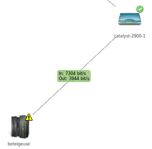

Decorations
-----------

To map can be added also decorations like picture and group box. 
To add picture it should be uploaded to "Image Library" before. 

Creating group box you should specify it's size, colour and name. 

.. figure:: _images/network_map_decorations.png

DCI Container
-------------
DCI Container is part of decorations. It can be used to display separate dci values 
on a map.

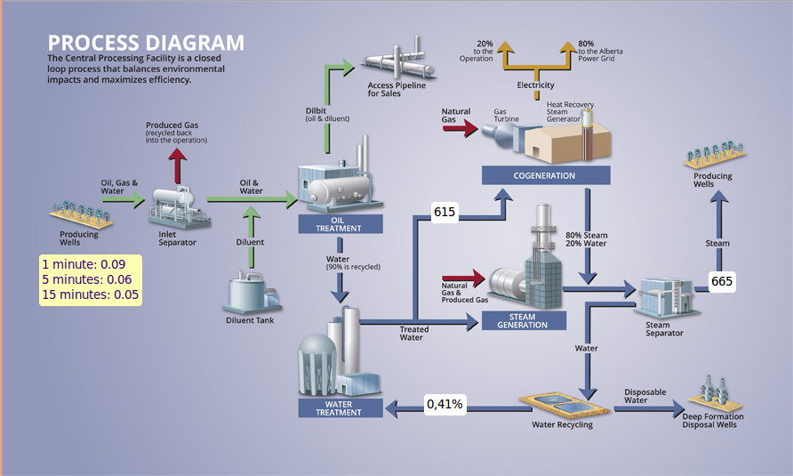

**Container properties:**

   * Background colour 
   * Text colour
   * If border should be shown and it's colour
   * Data Source - there can be configured DCI values and text near them that will be displayed
      * For each Data Source can be configured: Data collection item,  name,  format string(like "Text: %.4f"),  in case of table DCI also column and instance

More examples: 

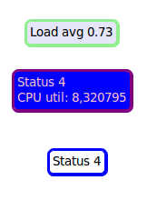

DCI Image
---------
DCI Image is part of decorations. It can be used to display DCI status change in pictures.

**DCI image properties**
   * Data source - DCI witch data will be taken to process picture display rules
   * Column - required only for table DCI
   * Instance - required only for table DCI
   * Default image - image that will be displayed if no rule is applicable on current value
   * Rules 
      * For each rule can be configured: operation,  value,  comment and image that will be displayed if this rule is applicable

Hints:

To use image it should be first uploaded to image library. 

Rules are processed from up to down, so if you want to describe in rules 
something like: 

   * DCI > 3 => image1
   * DCI > 2 => image2
   * DCI > 4 => image3

They should go in this sequence:   

   * DCI > 4 => image3
   * DCI > 3 => image1
   * DCI > 2 => image2

Object Layout and display options
---------------------------------
All object layout properties and display options are applicable only on objects, 
not on decorations.

Grid
~~~~
   * Align to grid - will move all objects to grids 
   * Snap to grid - all objects will be moved in grids and it will not be possible to place them not inside grid. 
   * Show grid - will show grid according to which objects are located. 

Layout
~~~~~~
Objects can be placed manually on a map or can be chosen one of automatic layouts:
   * Spring
   * Radial
   * Horizontal tree
   * Vertical tree
   * Sparse vertical tree

If there is chosen automatic layout, then after each refresh object best matching place
will be recalculated. So if new object is add - it is just required to refresh map to have 
correctly placed objects. 

If there is chosen manual layout, then after each object movement map should be saved, 
to save the new place of object. 

Object status
~~~~~~~~~~~~~
   * Show status background - will display background behind object image according to it's state.
   * Show status icon - will display icon of object state near each object
   * Show status frame - will display frame around object icon according to it's state

Routing
~~~~~~~
Default routing type for whole map:
   * Direct
   * Manhattan

Zoom
~~~~
Map can be zoomed in and out with help of top menu buttons and 
to predefined percentage selected from menu. 

Object display options
~~~~~~~~~~~~~~~~~~~~~~
Objects can be displayed in 3 ways:
   * Icons
   * Small labels
   * Large labels

Map Background
--------------
It can be set background for map:
   * Colour
   * Image - image should be uploaded to "Image Library" before. 
   * Geographic Map - place on map is chose with help of zoom and coordinates

This can be used to show object physical please on map or on building plan. 

Examples: 

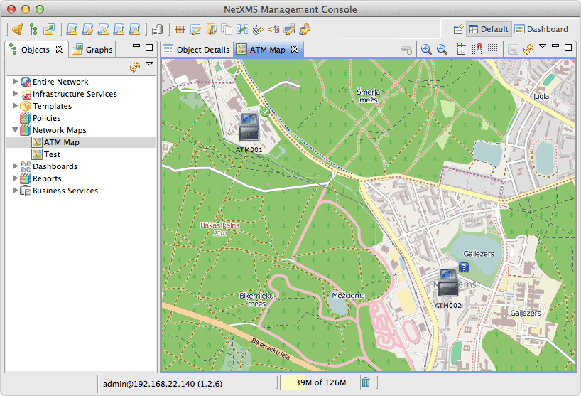

Dashboards
==========

Dashboards are defined by administrator and allow to combine any available
visualization components with data from multiple sources in order to create
high-level views to see network (or parts of it) health at a glance. For
example, below is a dashboard showing traffic information from core router, as
well as CPU usage from vital nodes:

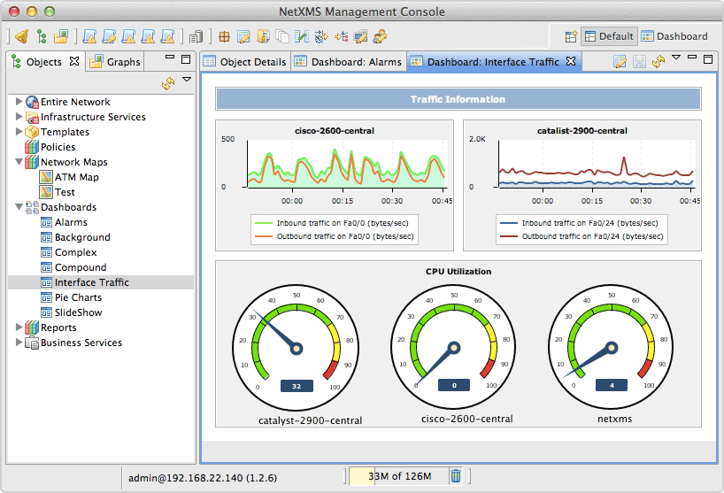

There are two ways to access dashboards:

Open dashboard from Object Browser

- Open dashboard from :guilabel:`Object Browser`
- Switch to :guilabel:`Dashboard` perspective and select dashboard with
  left-click

Configuration
-------------

Dashboards is a special type of objects created in :guilabel:`Dashboards` tree.
To create a new dashboard, right click on :guilabel:`Dashboards` root object or
any other existing dashboard and select :guilabel:`Create dashboard`. To
configure dashboard content, open object's properties and go to
:guilabel:`Dashboard Elements:guilabel:` page. Here you can define number of
columns and manage list of elements. Press :guilabel:`Add:guilabel:` to add new
element. You will be prompted with element type selection dialog:

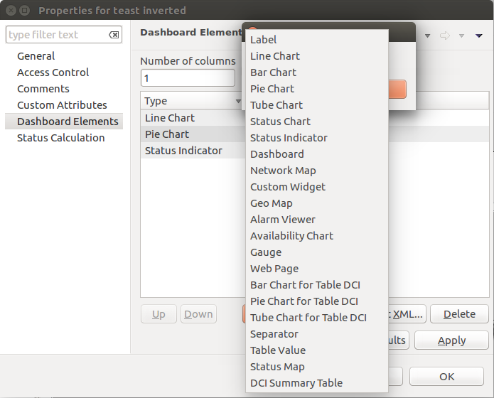

When new element added, you can edit it by double-clicking on record in
elements list, or by pressing :guilabel:`Edit` button. Each element have
:guilabel:`Layout` property page which controls element's layout inside
dashboard, and one or more element type specific pages to control element's
appearance and displayed information. The following element types are
available:

Label
~~~~~

Text label with configurable text and colours.

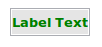

Line Chart
~~~~~~~~~~

Line chart.

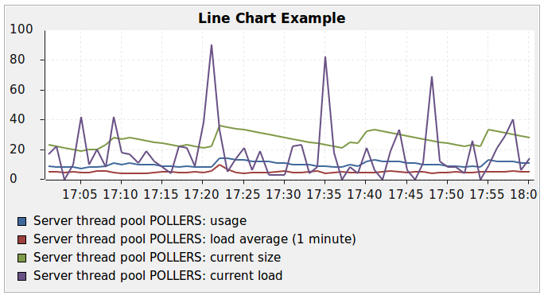

Bar Chart
~~~~~~~~~

Bar chart.

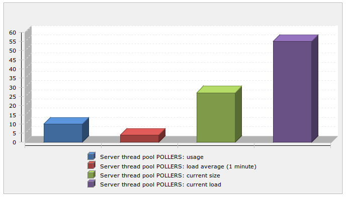

Pie Chart
~~~~~~~~~

Pie chart.

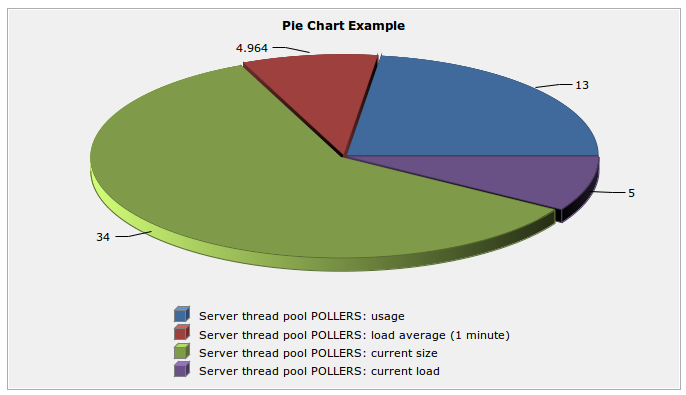

Tube chart
~~~~~~~~~~

Tube chart.

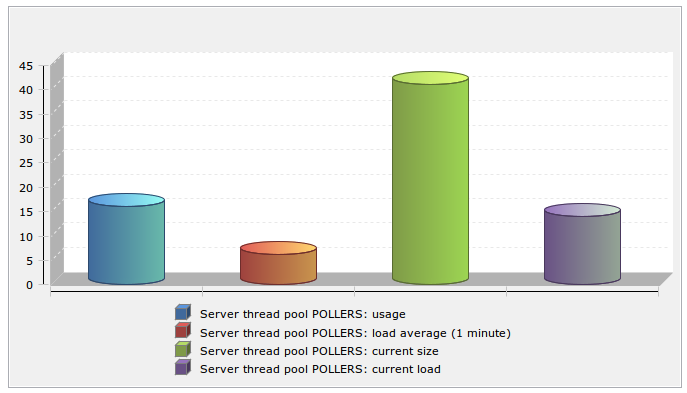

Status Chart
~~~~~~~~~~~~

Bar chart which shows current status distribution for nodes under given root.

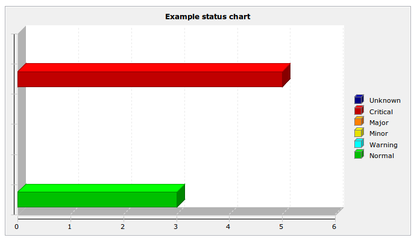

Status Indicator
~~~~~~~~~~~~~~~~

Shows current status of selected object.

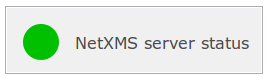

Dashboard
~~~~~~~~~

Another dashboard object (or multiple objects) rendered 
as element of this dashboard.

Network Map
~~~~~~~~~~~

:ref:`Network map<network_map>` object rendered as dashboard element.

Custom Widget
~~~~~~~~~~~~~

Custom widget provided by third party console plugin. This options allows to 
add widget from third party loaded plugin. 

Get Map
~~~~~~~

Geographic map centered at given location.

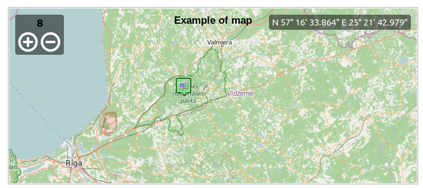

Alarm Viewer
~~~~~~~~~~~~

:ref:`List of alarms<alarms>` for given object subtree.

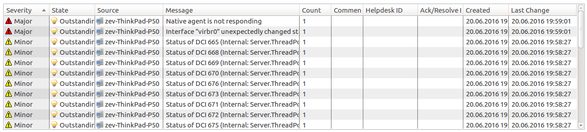

Availability Chart
~~~~~~~~~~~~~~~~~~

Pie chart showing availability percentage for given business service

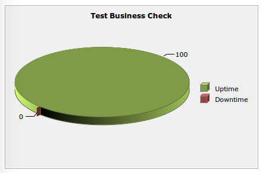

Gauge
~~~~~

Gauge have 3 types of widgets

    - Dail is radeal gauge with configurable maximum, minimum values. Scale can have fixed colour or can be separated to  3 colour configurable zones.
    - Dar is linear gauge with configurable maximum, minimum values. Scale can have fixed colour or can be separated to  3 colour configurable zones. (Not yet implemented)
    - Text is text gauge, that can be coloured using fixed colour, changed depending on 3 configurable colour zones or coloured using threshold colour(severity).

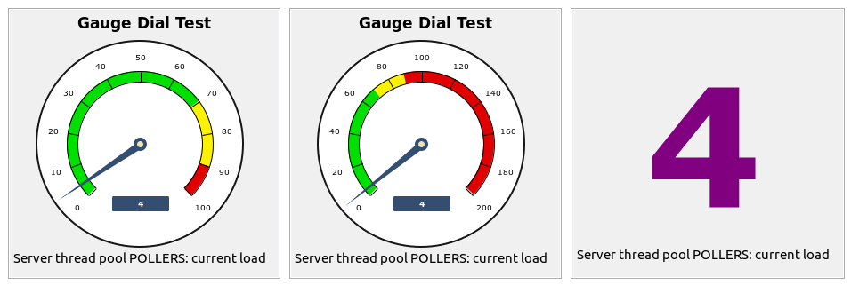

Web Page
~~~~~~~~

Web page at given URL rendered within dashboard.

Bar Chart for Table DCI
~~~~~~~~~~~~~~~~~~~~~~~

Bar chart built from data collected via single table DCI.

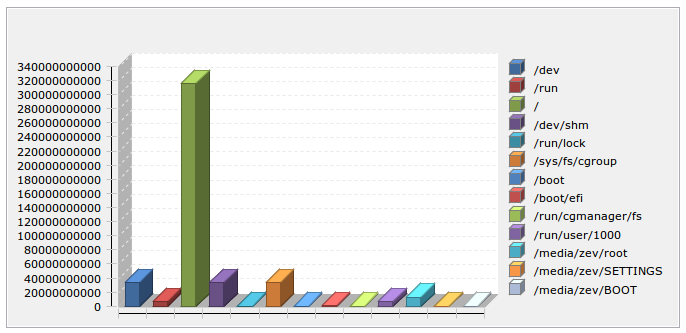

Pie Chart for Table DCI
~~~~~~~~~~~~~~~~~~~~~~~

Pie chart built from data collected via single table DCI.

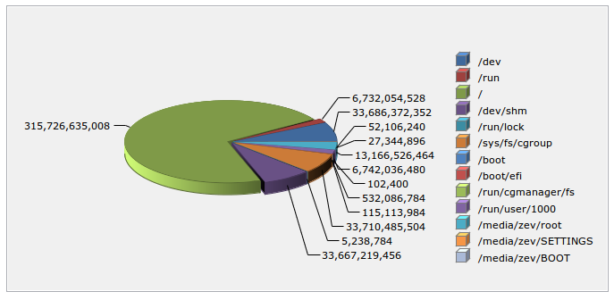

Tube Chart for Table DCI
~~~~~~~~~~~~~~~~~~~~~~~~

Tube chart built from data collected via single table DCI.

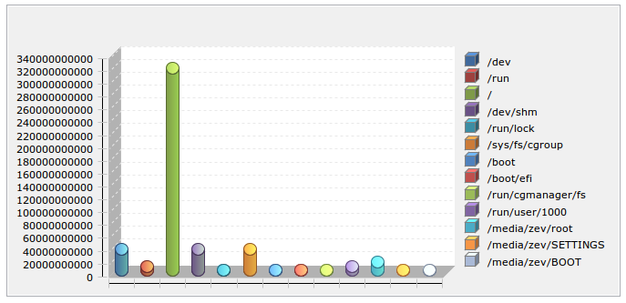

Separator
~~~~~~~~~

Separator, can be shown as line, box, or simply empty space.

Table Value
~~~~~~~~~~~

Tis widget displays table with last values of Table DCI.

Status Map
~~~~~~~~~~

Status map shows statuses of all objects like colourd rectangle, inside selected parent. 

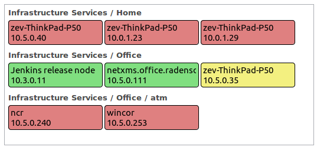

DCI Summary Table
~~~~~~~~~~~~~~~~~

:ref:`DCI Summary Table<dci-summary-table-label>` widget provides summary DCI infromation 
about objects under container.

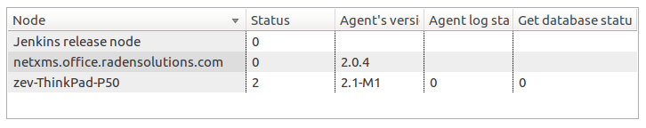

Element Property Pages
----------------------

Chart
~~~~~

:guilabel:`Chart` page is available for all chart type elements: Bar Chart, Bar
Chart for Table DCI, Dial Chart, Line Chart, Pie Chart, Pie Chart for Table
DCI, Tube Chart, and Tube Chart for Table DCI. It defines basic properties of a
chart.

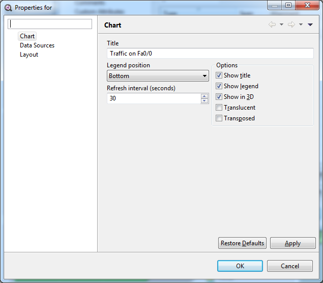

Data Sources
~~~~~~~~~~~~

:guilabel:`Data sources` page is available for all DCI based elements: Bar
Chart, Dial Chart, Line Chart, Pie Chart, and Tube Chart. Here you can define
what DCIs should be used as data sources for the chart. Up to 16 DCIs can be
added to single chart. You can configure multiple properties for each data
source. To edit data source, either double click on appropriate item in the
list, or press :guilabel:`Edit` button. Data source configuration dialog looks
like following:

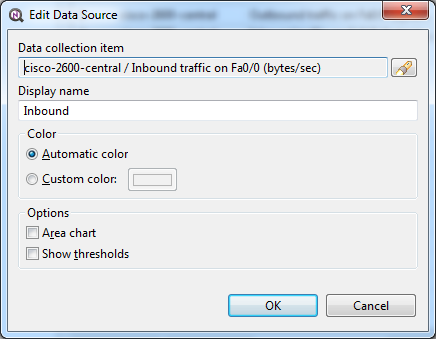

.. list-table::
   :header-rows: 1
   :widths: 25 75

   * - Property
     - Description
   * - Data collection item
     - DCI object to be used.
   * - Display name
     - Name for this data source to be used in chart's legend. If left empty,
       DCI description will be used.
   * - Colour
     - Allows you to define specific colour for this data source or let system
       to pick one automatically.
   * - Area chart
     - This option is valid only for line charts and toggles data source
       display as filled area instead of line.
   * - Show thresholds
     - This option is valid only for line charts and toggles display of
       configured thresholds.

Layout
~~~~~~

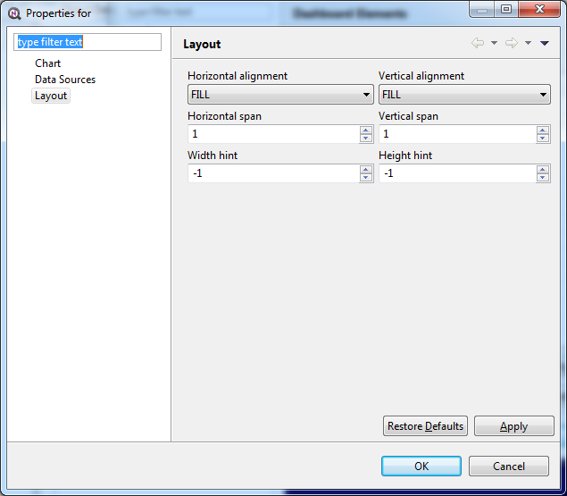

.. list-table::
   :widths: 25 75
   :header-rows: 1

   * - Property
     - Description
   * - Horizontal alignment
     - Horizontal alignment for this element. Possible values are
       :guilabel:`FILL`, :guilabel:`CENTER`, :guilabel:`LEFT`, and
       :guilabel:`RIGHT`.
   * - Vertical alignment
     - Vertical alignment for this element. Possible values are
       :guilabel:`FILL`, :guilabel:`CENTER`, :guilabel:`TOP`, and
       :guilabel:`BOTTOM`.
   * - Horizontal span
     - Specify how many grid cells this element will occupy horizontally.
   * - Vertical span
     - Specify how many grid cells this element will occupy vertically.
   * - Width hint
     - Hint for element's width in pixels. Default value of ``-1`` means that
       layout manager will decide width for element.
   * - Height hint
     - Hint for element's height in pixels. Default value of ``-1`` means that
       layout manager will decide width for element.

See detailed information about layout in section :ref:`dashboards-layout`.

Web Page
~~~~~~~~

:guilabel`Web Page` property page is available for web page type elements. Here
you can define URL to be displayed and optional title. If title is not empty,
it will be displayed above page content.

.. _dashboards-layout:

Understanding Element Layout
----------------------------

Dashboard uses grid concept to layout it's elements. Available space divided
into rows and columns, and each element occupies one or more cells. Number of
columns configured in dashboard object properties, and number of rows
calculated automatically based on number of columns, number of elements, and
number of cells occupied by each element. Elements are laid out in columns from
left to right, and a new row is created when there are no space left for next
element on current row. Each element has horizontal and vertical alignment
properties. Default for both is :guilabel:`FILL`. Possible alignment values are
following:

.. list-table::
   :widths: 25 75
   :header-rows: 1

   * - Value
     - Description
   * - FILL
     - Make element to fill whole cell. Also causes to grab excess free space
       available inside dashboard. If more than one element is trying to grab
       the same space, then the excess space is shared evenly among the
       grabbing elements.
   * - CENTER
     - Center element within cell.
   * - LEFT/TOP
     - Align element to left/top of the cell.
   * - RIGHT/BOTTOM
     - Align element to right/bottom of the cell.

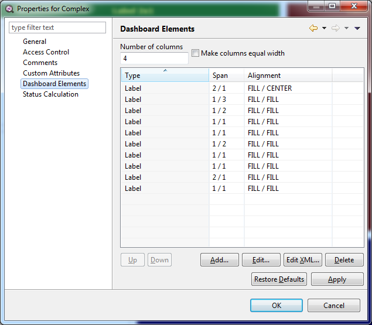

   Complex layout configuration

This configuration will be rendered into this layout:

.. image:: _images/DashboardComplexLayoutExample.png
   :scale: 70

Dashboard Rotation
------------------

To create configuration when console displays multiple dashboards one by one in
a loop, follow these steps:

- Create all dashboards you want to show
- Create additional dashboard object, with single element of type
  :guilabel:`Dashboard` inside
- Add all dashboards you want to show to dashboard list of that element and set
  desired time between changing dashboards.

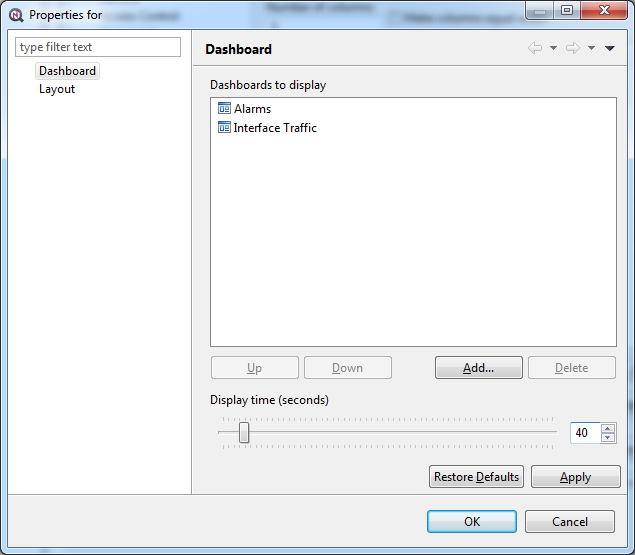

   Sample configuration of two dashboards displayed in a loop for 40 seconds each.

Graphs
======

You can view collected data in a graphical form, as a line chart. To view
values of some DCI as a chart, first open either :guilabel:`Data Collection`
Editor or :guilabel:`Last Values` view for a host. You can do it from the
:guilabel:`Object Browser` or map by selection host, right-clicking on it, and
selecting :guilabel:`Data collection` or :guilabel:`Last DCI values`. Then,
select one or more DCIs (you can put up to 16 DCIs on one graph), right-click
on them and choose :guilabel:`Graph` from the pop-up menu. You will see
graphical representation of DCI values for the last hour.

When the graph is open, you can do various tasks:

Select different time interval
------------------------------

By default, you will see data for the last hour. You can select different time
interval in two ways:

#. Select new time interval from presets, by right-clicking on the graph, and
   then selecting :guilabel:`Presets` and appropriate time interval from the
   pop-up menu.
#. Set time interval in graph properties dialog. To access graph properties,
   right-click on the graph, and then select :guilabel:`Properties` from the
   pop-up menu. Alternatively, you can use main application menu:
   :menuselection:`Graph --> Properties`. In the properties dialog, you will
   have two options: select exact time interval (like ``12/10/2005 from 10:00
   to 14:00``) or select time interval based on current time (like ``last two
   hours``).

Turn on automatic refresh
-------------------------

You can turn on automatic graph refresh at a given interval in graph properties
dialog. To access graph properties, right-click on it, and select
:guilabel:`Properties` from the pop-up menu. Alternatively, you can use main
application menu: :menuselection:`Graph --> Properties`. In the properties
dialog, select the :guilabel:`Refresh automatically` checkbox and enter a
desired refresh interval in seconds in edit box below. When automatic refresh
is on, you will see :guilabel:`Autoupdate` message in the status bar of graph
window.

Change colours
--------------

You can change colours used to paint lines and graph elements in the graph
properties dialog. To access graph properties, right-click on it, and select
:guilabel:`Properties` from the pop-up menu. Alternatively, you can use main
application menu: :menuselection:`Graph --> Properties`. In the properties
dialog, click on coloured box for appropriate element to choose different colour.

Save current settings as predefined graph
-----------------------------------------

You can save current graph settings as predefined graph to allow quick and easy
access in the future to information presented on graph. Preconfigured graphs
can be used either by you or by other NetXMS users, depending on settings. To
save current graph configuration as predefined graph, select :guilabel:`Save`
as predefined from graph view menu. The following dialog will appear:

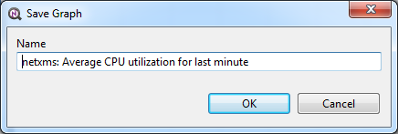

In :guilabel:`Graph name` field, enter desired name for your predefined graph.
It will appear in predefined graph tree exactly as written here. You can use
``->`` character pair to create subtree. For example, if you name your graph
``NetXMS Server->System->CPU utilization (iowait)`` it will appear in the tree
as following:

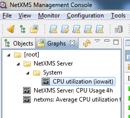

You can edit predefined graph by right-clicking on it in predefined graph tree,
and selecting :guilabel:`Properties` from context menu. On
:guilabel:`Predefined Graph` property page you can add users and groups who
will have access to this graph. Note that user creating the graph will always
have full access to it, even if he is not in access list.

If you need to delete predefined graph, you can do it by right-clicking on it
in predefined graph tree, and selecting :guilabel:`Delete` from context menu.

Save current settings as template graph
---------------------------------------

.. figure:: _images/save_as_temp_graph.png
	:scale: 50

Current graph settings can be saved as a template graph for an easy template graph creation. The difference between predefined graphs and template graphs are that template graphs are not configured to view specific DCI`s on a node, instead they are configured to view DCI names that can be found on many nodes (e.g. ``FileSystem.FreePerc(/)``). This allows for the creation of certain graph templates to monitor, for example, disk usage that can be reused on any node to which the appropreate DCI`s are applied on via :ref:`dci-configuration`.

See detailed information on template graphs in the section :ref:`template-graph-conf`.

In the Graph name field of the pop-up save dialog, enter the desired name for the template graph by which you can later identify your it in the :ref:`template-graph-conf` which can be found in :menuselection:`Configuration-->Template Graph Configuration`.

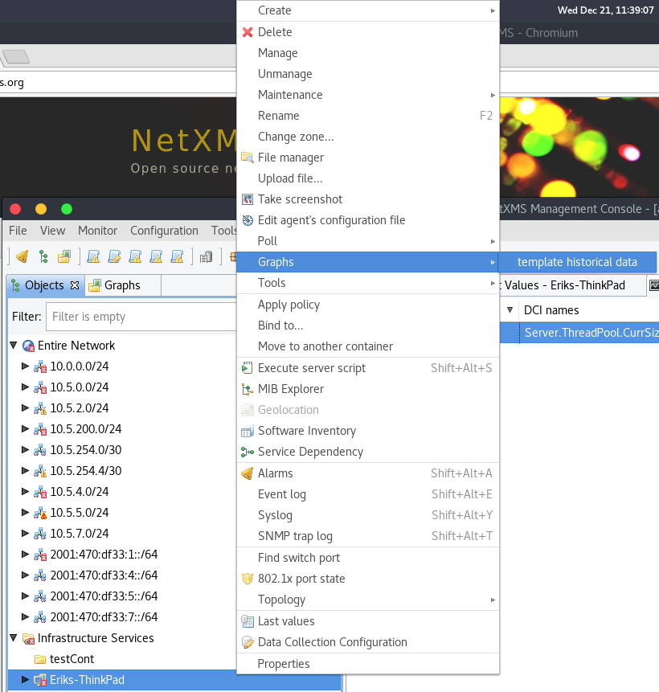

Template graphs can be accessed in the :guilabel:`Object Browser` as seen on the screenshot above. When a template graph is created, it will appear in the sub-menus of the nodes found in :guilabel:`Object Browser`, the rest of the settings can be accessed by editing a template graph in the :ref:`template-graph-conf`.

.. _template-graph-conf:

Template Graph Configuration
----------------------------

Template graphs are used to ease the monitoring of a pre-set list of DCI`s on multiple nodes by adding a list of DCI names to the template source. This allows for the possibility to create templates to monitor specific data on any node to which the appropriate DCI`s are applied on.

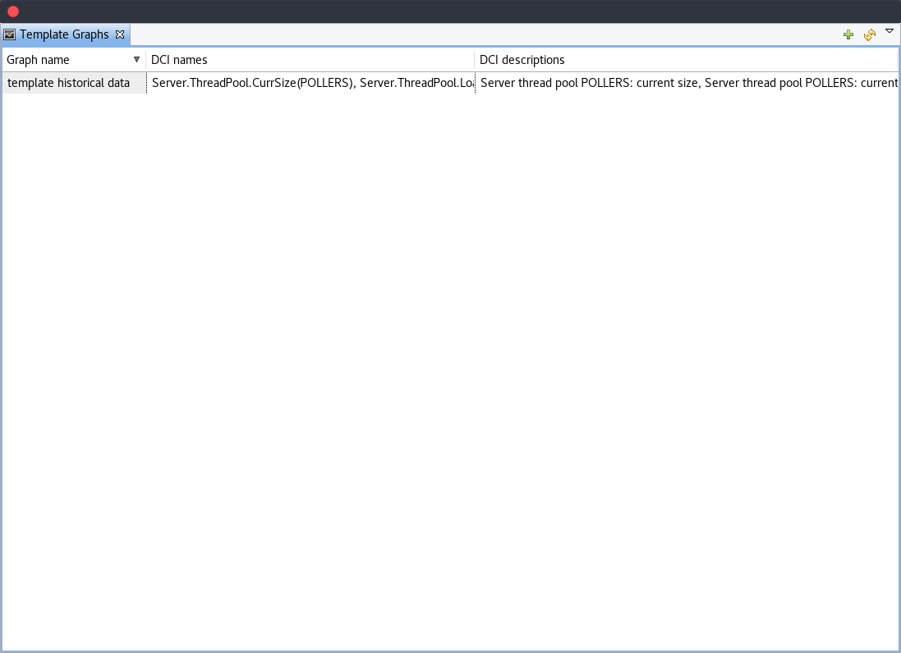

The :guilabel:`Template Graph Configuration` is used to create and edit template graphs. Properties for already created template graphs can be brought up by double clicking the template graph you wish to edit and new ones can be added by pressing the green cross on the top right or by right clicking and selecting :guilabel:`Create new template graph`.

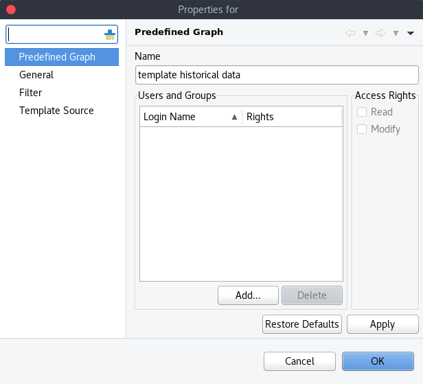

	Name and access rights of a graph

The above property page provides the possibility to configure the name of the template graph and the access rights. The user who has created the template graph will have full access to it even though the username will not show up in the access right list.

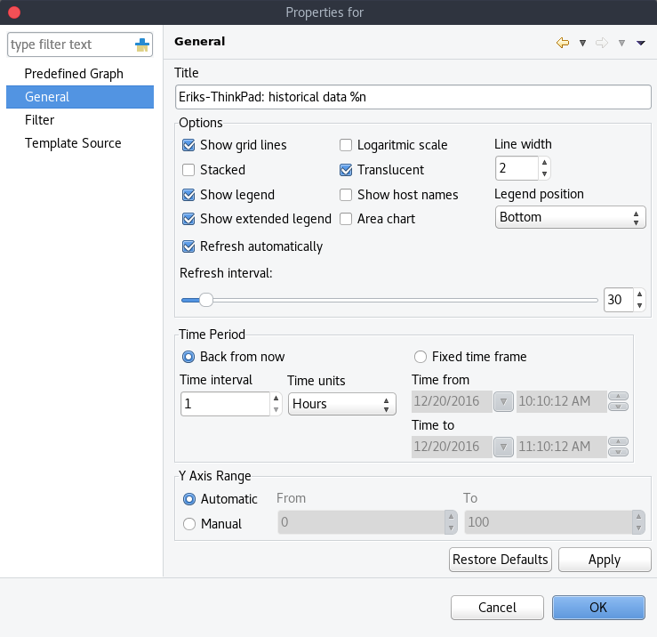

	General graph properties.

Title:

	- The title that the graph will have when opened.
	- The title can contain special characters described in :ref:`object_tools_macro`.

Options:

.. list-table::
   :widths: 25 50
   :header-rows: 1

   * - Option
     - Description
   * - Show grid lines
     - Enable or disable grid lines for the graph.
   * - Stacked
     - Stacks the graphs of each value on top of one another to be able to see the total value easier (e.g. useful when monitoring cpu usage).
   * - Show legend
     - Enable or disable the legend of the graph.
   * - Show extended legend
     - Enable or disable the extended legent of the graph (Max, Avg, Min, Curr).
   * - Refresh automatically
     - Enable or disable auto-refresh.
   * - Logaritmic scale
     - Use the logaritmic scale for the graph.
   * - Translucent
     - Enable or disable the translucency of the graph.
   * - Show host names
     - Show host name of the node from which the value is taken.
   * - Area chart
     - Highlights the area underneath the graph.
   * - Line width
     - Adjust the width of the lines.
   * - Legend position
     - Set the position of the legend.
   * - Refresh interval
     - Set the refresh interval.

Time Period:

Provides the possibility to configure the time period of the graph. It is possible to set a dynamic time frame (Back from now) and a static time frame (Fixed time frame).

Y Axis Range:

Adjust the range of the Y axis on the graph.

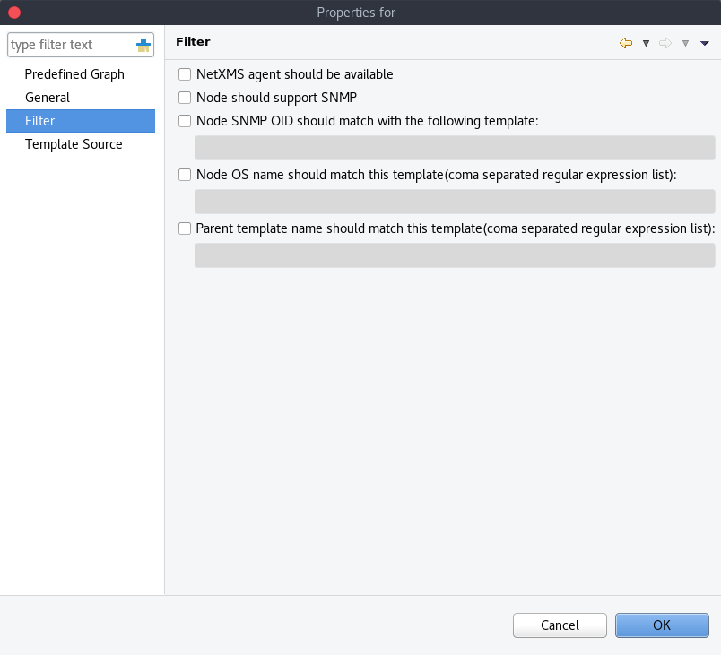

	Template graph filter properties.

It may be necessary to set certain filters for a template graph. This can be useful if the graph contains DCI names that are only available on NetXMS agent or are SNMP dependant.

More information on filters can be found in :ref:`object_tools_filter`.

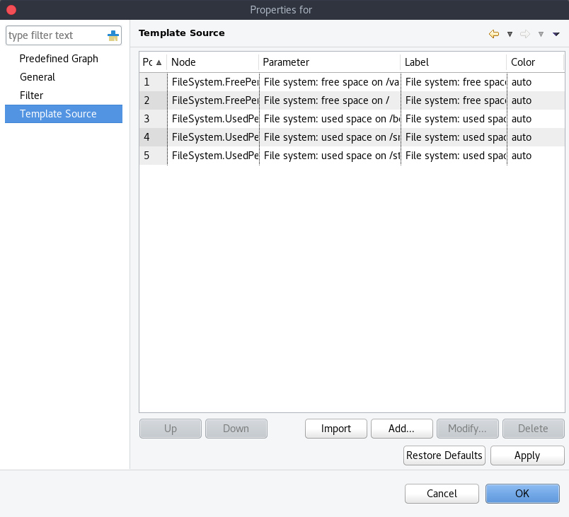

	Template graph sources

There are two options to add sources to the template graph. Sources can be added manually by configuring the Data Source parameters yourself or by importing data source information from DCI`s that have already been applied to other nodes.

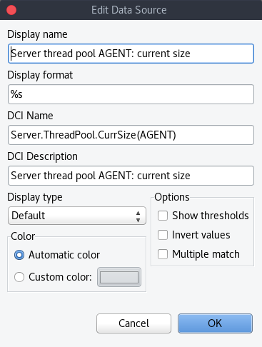

When adding or editing a source, it is possible to use Java regex in the DCI Name and DCI Description fields. This can be handy when used with the Multiple match option which will use all DCI`s that match the particular regex. The order in which the DCI list is searched is first by DCI Name and then by DCI Description.

History
=======

You can view collected data in a textual form, as a table with two columns -
:guilabel:`timestamp` and :guilabel:`value`. To view values of some DCI as a
table, first open either :guilabel:`Data Collection Editor` or :guilabel:`Last
Values` view for a host. You can do it from the :guilabel:`Object Browser` or
map by selection host, right-clicking on it, and selecting :guilabel:`Data
collection` or :guilabel:`Last DCI values`. Then, select one or more DCIs (each
DCI data will be shown in separate view), right-click on them and choose
:guilabel:`Show history` from the pop-up menu. You will see the last 1000
values of the DCI.

.. todo:: Export DCI data

.. _dci-summary-table-label:

Summary table
=============

It is possible to see DCI data as a table where each line is one node and each 
column is a DCI. It can be configured for each summary table witch DCIs should be 
present on it. 

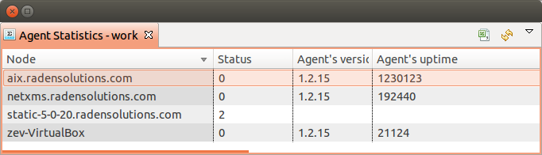

Configuration
-------------

DCI summary table can be configured in Configuration -> Summary Table. 

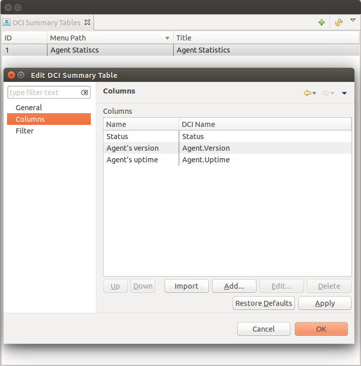

In general part:

  - Menu path - path where this summary table can be found. You can use
    ``->`` character pair to create subtree like "Linux->System information".
  - Title - title of view.
  
In columns part:

  - There are added DCI's shat should be shown on the summary table. Where 
    Name is name of column and DCI Name is parameter of DCI. 

Usage
-----

After DCI summary table is configured it can be accessed in container 
object(Subnet, container...) menu under "Summary tables". 

