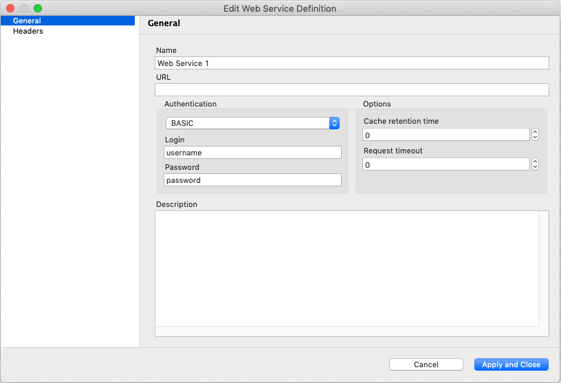

.. _web-services-monitoring:

=================================
Data Collection from Web Services
=================================

|product_name| has built-in data collection mechanism using web services,
allowing to extract data for DCIs from JSON, XML, or plain text responses to
HTTP requests. Data collection from web services is done via |product_name|
agent. If zoning is not used (or for Default zone), agent running on NetXMS
server is used. If zoning is used, zone proxies are used (and if a zone has no
proxies configured, agent on NetXMS server is used as last resort). 

Configuring Web Service Data collection
=======================================

Agent configuration
-------------------

Starting from version 3.8 of |product_name| agent data collection from web
services is disabled by default. To enable it, add ``EnableWebServiceProxy=yes``
to agent configuration file and restart the agent.

Web service definitions
-----------------------

Common configuration related to multiple metrics and nodes is set up in
web service definition editor accessible via
:guilabel:`Configuration -> Web Service Definitions` menu.

The following information can be configured:

* Web service name
* Web service URL
* Additional HTTP headers
* Authentication data (authentication type, login, password)
* Cache retention time (in seconds)
* Request timeout (in seconds)

Web service URL and additional HTTP headers fields can contain macros that are
expanded when actual request is made. So you can, for example, set URL as ``%{url}``
and keep the actual URL in node's custom attribute ``url``.

DCI Configuration
-----------------

DCI configuration provides DCI origin "web service". Metric name for this origin
contains web service definition name with optional arguments and path to
document element that has to be retrieved (or PCRE compliant regex with one
capture group for text responses).

For example:
   * ``WebService1:/system/cpu/usage``
   * ``WebService2(eth0):/stat/bytesIn``
   * ``WebService3(10,20,30):^(\d*)``

Service arguments can be inserted into request URL or headers using macros %1,
%2, and so on.
For XML and JSON responses path to document element should start from ``/``.
XML response, according to standard, should have only one upper level tag.
For text response, first capture group of regular expression is returned.

Instance discovery
------------------

For web service discovery “Web Service” instance discovery method can be used.
It  accepts web service name with optional arguments and path to the root
element of the document where enumeration will start. Each sub-element of given
root element will be considered separate instance.

For example:
   * ``WebService1:/system/cpu`` will enumerate all elements under "/system/cpu"
   * ``WebService2(eth0):/stat`` will enumerate all elements under "/stat"

Data collection process
=======================

Data collection process from server point of view should be following:

1. Server finds web service definition by given name, passes any parameters to
it, and gets back URL and headers with all macros expanded.

2. Server determines agent to be used for request (based on zone settings, node
settings, agent availability, etc.).

3. Server sends request to selected agent. Request consists of URL, headers,
and document path.

4. Server waits for response from agent and processes retrieved data as for any
other DCI type. For instance discovery server provides new instance
discovery method - “web service” which accepts web service name with
optional arguments and path to the root element of the document where
enumeration will start. Each sub-element of given root element will be
considered separate instance.

Actual requests and response parsing is implemented on agent level. This
provides necessary flexibility for accessing services not directly reachable
from management server as well as offload response parsing from server to
agents.

Data collection process from agent point of view is following:

1. Agent receives web service request (URL, authentication data, headers) and
list of elements to retrieve from server.

2. Agent checks document cache if requested URL was already retrieved and data
is within configured cache retention time. If yes, values of requested elements
from cached data is returned to server.

3. Agent performs HTTP request using provided service data. If request is
successful retrieved document parsed into tree form and values of requested
elements returned to server. No additional configuration should be required on
agent side.

Examples
========

This example will show how to use the same web service json otput for instances and 
then to collect data. 

So we assume that configuration is already done and we have web service with 
"WebService1" name, that returns next json:

.. code-block:: json 

   [
      {
         "name": "Object1",
         "status": "Online",
         "position": "Front"
      },
      {
         "name": "Object2",
         "position": "Back"
      },
      {
         "name": "Object3",
         "status": "Ofline",
         "position": "Front"
      }
   ]

Form this JSON we want to get separate DCI with each object, that will collect 
status if exist and will set status to Ofline if object does not contain status 
parameter. 

DCI will have next configuration:

   * Instance discovery method: Web Service
   * Web service request: WebService1:[.[].name]
     
     This will create array with names, each name will be takes as an instance:

          .. code-block:: json 

             ["Object1", "Object2", "Object3"]

   * Origin: Web service
   * Metric: (.[] | select(.name == "{instance}").status ) // "failed"
     
     This configuration will get status for object with name like {instance} 
     (will be replaced by real name on instance discovery) and will return 
     "failed" if this object does not contain status. 
     