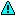
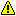
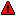
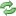

##############
Basic Concepts
##############

.. _concept_object:

Objects
=======

All network infrastructure monitored by NetXMS inside monitoring system
represented as a set of :term:`objects <Object>`. Each object
represents one physical or logical entity (like host or network interface),
or group of them. Objects are organized into hierarchical structure.
Each object has it's own access rights. Access rights are applied
hierarchically on all children of object. For example if it grant :guilabel:`Read`
access right for user on a :guilabel:`Container`, than user have :guilabel:`Read`
right on all objects that contains this :guilabel:`Container`.
Every object has set of attributes; some of them are common
(like :guilabel:`id` and :guilabel:`name` or :guilabel:`status`),  while other
depends on object class – for example, only :guilabel:`Node` objects have
attribute :guilabel:`SNMP community string`. There are default attributes
and custom attributes defined either by user or integrated application via
NetXMS API.

NetXMS has eight top level objects – ``Entire Network``, ``Service Root``,
``Template Root``, ``Policy Root``, ``Network Map Root``, ``Dashboard Root``,
``Report Root``, and ``Business Service Root``. These objects served as an
abstract root for appropriate object tree. All top level objects has only one
editable attribute – name.

.. tabularcolumns:: |p{0.2 \textwidth}|p{0.5 \textwidth}|p{0.3 \textwidth}|

.. list-table::
   :widths: 20 50 30
   :header-rows: 1
   :class: longtable

   * - Object Class
     - Description
     - Valid Child Objects
   * - Entire Network
     - Abstract object representing root of IP topology tree. All zone and
       subnet objects located under it. System can have only one object of this
       class.
     - - Zone (if zoning enabled)
       - Subnet (if zoning disabled)
   * - Zone
     - Object representing group of (usually interconnected) IP networks
       without overlapping addresses. Contains appropriate subnet objects.
     - - Subnet
   * - Subnet
     - Object representing IP subnet. Typically objects of this class created
       automatically by the system to reflect system's knowledge of IP
       topology. The system places Node objects inside an appropriate Subnet
       object based on an interface configuration. Subnet objects have only one
       editable attribute - :guilabel:`Name`.
     - - Node
   * - Node
     - Object representing physical host or network device(such as routers and switches).
       These objects can be created either manually by administrator or automatically during
       network discovery process. They have a lot of attributes controlling all aspects
       of interaction between NetXMS server and managed node. For example, the attributes
       specify what data must be collected, how node status must be checked, which protocol
       versions to use etc. Node objects contain one or more interface objects. The system
       creates interface objects automatically during configuration polls.
     - - Interface
       - Network Service
       - VPN Connector
   * - Cluster
     - Object representing cluster consisted of two or more hosts.
     - - Node
   * - Interface
     - Interface objects represent network interfaces of managed computers and
       devices. These objects created automatically by the system during
       configuration polls or can be created manually by user.
     -
   * - Network Service
     - Object representing network service running on a node (like http or
       ssh), which is accessible online (via TCP IP). Network Service objects
       are always created manually. Currently, the system works with the following
       protocols - HTTP, POP3, SMTP, Telnet, SSH and Custom protocol type.
     -
   * - VPN Connector
     - Object representing VPN tunnel endpoint. Such objects can be created to
       add VPN tunnels to network topology known y NetXMS server. VPN Connector
       objects are created manually. In case if there is a VPN
       connection linking two different networks open between two firewalls that are
       added to the system as objects, a user can create a VPN Connector object on
       each of the firewall objects and link one to another. The network topology will
       now show that those two networks are connected and the system will take this
       condition into account during problem analysis and event correlation.
     -
   * - Service Root
     - Abstract object representing root of your infrastructure service tree.
       System can have only one object of this class.
     - - Cluster
       - Condition
       - Container
       - Mobile Device
       - Node
       - Subnet
       - Rack
   * - Container
     - Grouping object which can contain nodes, subnets, clusters, conditions,
       or other containers. With help of container objects you can build
       object's tree which represents logical hierarchy of IT services in your
       organization.
     - - Cluster
       - Condition
       - Container
       - Mobile Device
       - Node
       - Subnet
       - Rack
   * - Condition
     - Object representing complicated condition – like "cpu on node1 is
       overloaded and node2 is down for more than 10 minutes". Conditions may
       represent more complicated status checks because each condition can have
       a script attached. Interval for evaluation of condition status is
       configured in Server Configuration Variables as ConditionPollingInterval
       with default value 60 seconds.
     -
   * - Template Root
     - Abstract object representing root of your template tree.
     - - Template
       - Template Group
   * - Template Group
     - Grouping object which can contain templates or other template groups.
     - - Template
       - Template Group
   * - Template
     - Data collection template. See Data Collection section for more
       information about templates.
     - - Mobile Device
       - Node
   * - Network Map Root
     - Abstract object representing root of your network map tree.
     - - Network Map
       - Network Map Group
   * - Network Map Group
     - Grouping object which can contain network maps or other network map
       groups.
     - - Network Map
       - Network Map Group
   * - Network Map
     - Preconfigured shematic representation of network or other system.
     -
   * - Dashboard Root
     - Abstract object representing root of your dashboard tree.
     - - Dashboard
   * - Dashboard
     - Preconfigured representation of collected data and objects. Can contain other dashboards.
     - - Dashboard
   * - Business Service Root
     - Abstract object representing root of your business service tree. System
       can have only one object of this class.
     - - Business Service
   * - Business Service
     - Object representing single business service. Can contain other business
       services, node links, or service checks.
     - - Business Service
       - Node Link
       - Service Check
   * - Node Link
     - Link between node object and business service. Used to simplify creation
       of node-related service checks.
     - - Service Check
   * - Service Check
     - Object used to check business service state. One business service can
       contain multiple checks.
     -
   * - Rack
     - Object representing rack(works like container)
     - - Node

Object status
-------------

Each object has a status. Status of the object calculated based on polling results,
status of underlying objects, associated alarms and status :term:`DCIs<DCI>`. For some object classes,
like Report or Template, status is irrelevant. Status for such objects is always :guilabel:`Normal`.
Object's status can be one of the following:

.. list-table::
   :widths: 10 30 70
   :header-rows: 1

   * - Nr.
     - Status
     - Description
   * - 0
     - |NORMAL| Normal
     - Object is in normal state.
   * - 1
     - |WARNING| Warning
     - Warning(s) exist for the object.
   * - 2
     - |MINOR| Minor
     - Minor problem(s) exist for the object.
   * - 3
     - |MAJOR| Major
     - Major problem(s) exist for the object.
   * - 4
     - |CRITICAL| Critical
     - Critical problem(s) exist for the object.
   * - 5
     - |UNKNOWN| Unknown
     - Object's status is unknown to the management server.
   * - 6
     - |UNMANAGED| Unmanaged
     - Object is set to "unmanaged" state.
   * - 7
     - |DISABLED| Disabled
     - Object is administratively disabled (only applicable to interface objects).
   * - 8
     - |TESTING| Testing
     - Object is in testing state (only applicable to interface objects).

Unmanaged status
----------------

Objects can be unmanaged. In this status object is not polled, DCIs are not collected, 
no data is updated about object. This status can be used to store data about object 
that temporrary or at permonently unavailabe or not managed. 

.. _maintenance_mode:

Maintanence mode
------------------

This is special status, because it is not included in usual status lit. This 
status prevents event processing for special node. While this status node is 
still polled and DCI data is still collected, but no event is generated. 

Data Collection Items
=====================

Every node can have many parameters, such as CPU utilization, amount of free
memory or disk space usage. The management server can collect these parameters,
check them for threshold violations and store them in the database. In NetXMS,
parameters configured for collection are called Data Collection Items or DCI
for short. One DCI represents one node's parameter, and unlimited number of
DCIs can be configured for any node.

Thresholds
----------

Each threshold is a combination of a condition and event pair. If a condition
becomes true, associated "activation" event is generated, and when it becomes
false again, "deactivation" event generated. Thresholds let you take a
proactive approach to network management. Thresholds can be defined for any
data collection items that is monitored, more than one threshold for a single 
DCI can be defined.

Events and Alarms
=================

Many services within NetXMS gather information and generate events that are
forwarded to NetXMS Event Queue. Events can also be emitted from agents on
managed nodes, or from management applications residing on the management
station or on specific network nodes. All events are processed by NetXMS Event
Processor one-by-one, according to the processing rules defined in Event
Processing Policy. As a result of event processing, some actions can be taken,
and event can be shown up as alarm, sent as e-mail or sms. NetXMS provides one 
centralized location - the Alarm Browser, where the alarms are visible to your 
team. You can control which events should be considered important enough to 
show up as alarms. You and your team can easily monitor the posted alarms and 
take appropriate actions to preserve the health of your network.

Examples of alarms include:

- A router exceeded its threshold of traffic volume that you configured in Data
  Collection.
- The shell script that you wrote gathered the specific information you needed
  and posted it to the NetXMS as an event.
- One of your mission-critical servers switched to UPS battery power.
- An SNMP agent on a managed critical server forwarded a trap to NetXMS because
  it was overheating and about to fail.

Zones
=====

As NetXMS server keeps track of an IP topology, it is important to maintain the 
configuration in which IP addresses do not overlap and that two IP addresses 
from same subnet are really within one subnet. Sometimes, however, it is needed 
to monitor multiple sites with overlapping IP address ranges. To correctly 
handle such situation, zoning must be used. Zone in NetXMS is a group of IP 
subnets which form non-overlapping IP address space. There is always zone 0 which 
contains subnets directly reachable by management server. For all other zones 
server assumes that subnets within that zones are not reachable directly, and 
proxy must be used.
