*********************************
User Interface
*********************************

.. note::
   
  One of the goals of NetXMS Management Console is to provide identical user
  expirience across all supported platforms, including Web Interface.
  Screenshots in this particular guide are based on Mac OS X version.

Login
=====

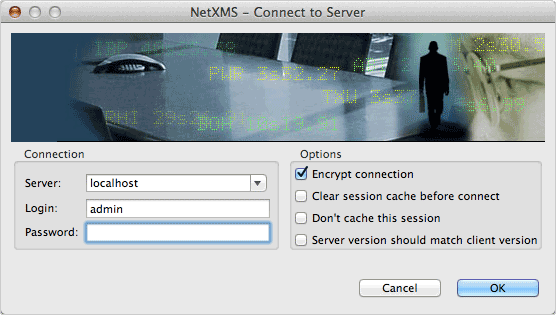

   Login Dialog

When Management Console is started, user is presented with login dialog. User
should enter server host name or IP address, login and password. Optionally,
user can disable communication-level encryption by deselecting
:guilabel:`Encrypt Connection` checkbox.

Following options are deprecated and will be removed in the future:

* :guilabel:`Clear session cache before connecting`
* :guilabel:`Don't cache this session`
* :guilabel:`Server version should match client version`

 
Workbench
=========

When user is authenticated, a single Workbench window is displayed. A Workbench
window offers one or more perspectives. A perspective contains views, such as
the :ref:`object-browser`. Multiple Workbench windows can be opened
simultaneously. Initially, in the first Workbench window that is opened, the
:guilabel:`Management` perspective is displayed, with :ref:`object-browser` and
:ref:`object-details` views visible. A shortcut bar appears in the top right
corner of the window. This allows you to open new perspectives and switch
between ones already open. The name of the active perspective is shown in the
title of the window and its item in the shortcut bar is highlighted.

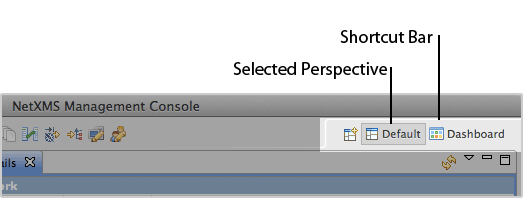

   Shortcut bar, :guilabel:`Management` perspective is selected

Views
=====

The primary use of Views is to provide convenient navigation through the
information displayed in Workbench. A view might appear by itself or stacked
with other views in a tabbed notebook. To activate a view that is part of a
tabbed notebook simply click its tab. Views have two menus. The first menu,
which is accessed by right-clicking on the view's tab, allows the view to be
manipulated in much the same manner as the menu associated with the Workbench
window. The second menu, called the "view pull-down menu", is accessed by
clicking the down arrow |VDA|. The view pull-down menu typically contains
operations that apply to the entire contents of the view, but not to a specific
item shown in the view.

A view can be displayed by selecting it from the appropriate :guilabel:`View`,
:guilabel:`Monitor`, or :guilabel:`Configuration` menu, or via
:menuselection:`Window --> Show View` menu. A perspective determines which
views may be required and displays these on the :guilabel:`Show View` sub-menu.
Additional views are available by choosing command link :guilabel:`Other` at
the bottom of the :guilabel:`Show View` sub-menu. This is just one of the many
features that provide for the creation of a custom work environment.

Through the normal course of using the Workbench you will open, move, resize,
and close views. If you'd like to restore the perspective back to its original
state, you can select the :menuselection:`Window --> Reset Perspective` menu
operation.

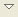

Rearranging views
-----------------

You can change the position of any view in the Workbench by following the steps
below:

#. Click in the title bar of the view and drag the view across the Workbench
   window. Do not release the mouse button yet.
#. While still dragging the view around on top of the Workbench window, note
   that various drop cursors appear. These :ref:`drop-cursors` indicate where
   the view will dock in relation to the view underneath the cursor when the
   mouse button is released. Notice also that a rectangular highlight is drawn
   that provides additional feedback on where the view will dock.
#. Dock the view in any position in the Workbench window, and view the results
   of this action.

.. _drop-cursors:

Drop cursors
------------

Drop cursors indicate where it is possible to dock a part in the Workbench
window. Several different drop cursors may be displayed when rearranging a
part.

=====  =========================================================================
|DTS|  Dock above: If the mouse button is released when this cursor is
       displayed, the part will appear above the part underneath the cursor.
|DBS|  Dock below: If the mouse button is released when this cursor is
       displayed, the part will appear below the part underneath the cursor.
|DLS|  Dock to the left: If the mouse button is released when this cursor
       is displayed, the part will appear to the left of the part
       underneath the cursor.
|DRS|  Dock to the right: If the mouse button is released when this cursor is
       displayed, the part will appear to the right of the part
       underneath the cursor.
|DST|  Stack: If the mouse button is released when this cursor is displayed,
       the part will appear as a tab in the same pane as the part underneath the
       cursor.
|DIS|  Restricted: If the mouse button is released when this cursor is
       displayed, the part will not dock there.
=====  =========================================================================

.. |DST| image:: _images/drop_stack.png
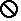

Maximizing and minimizing views
-------------------------------

The console presentation provides a rich environment consisting of one or more
View Stacks (each containing one or more views). These various parts compete
for valuable screen real-estate and correctly managing the amount of screen
given to each can greatly enhance your productivity within the console. The two
most common mechanisms for managing this issue are "minimize" (i.e. make me use
as little space as possible) and "maximize" (i.e. give me as much space as you
can). The console presentation provides a variety of ways to access these
operations:

- Using the minimize and maximize buttons provided on a stack's border
- Using the minimize and maximize buttons provided on a stack's border
- Selecting the :guilabel:`Minimize` or :guilabel:`Maximize` item on the
  context (right-click) menu for a stack
- Double-clicking on a stack
- Using :kbd:`Control + M`: this is a key binding for a command that will
  toggle the currently active part between its "maximized" and its "restored"
  (i.e.  normal) states.

.. figure:: _images/minmax_options.png

Maximize
~~~~~~~~

It is desirable at times to focus your attention on one particular view to the
exclusion of the others. Console implements the maximize behavior by minimizing
all stacks except the one being maximized. This allows the maximized stack to
completely occupy the main presentation while still allowing to access any open
views in your perspective by using the icons in their :term:`Trim Stack` (the
area around the edges of the window is called the "trim").
   
Minimize
~~~~~~~~

Another way to optimize the use of the screen area is to directly minimize
stacks that are of no current interest. Minimizing a stack will cause it to be
moved into the trim area at the edges of the workbench window, creating a
:term:`Trim Stack`. :term:`View Stack` will get minimized into a trim
representation that contains the icons for each view in the stack:

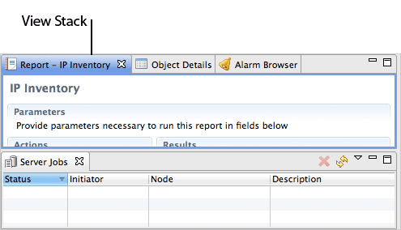

   Stacked Views

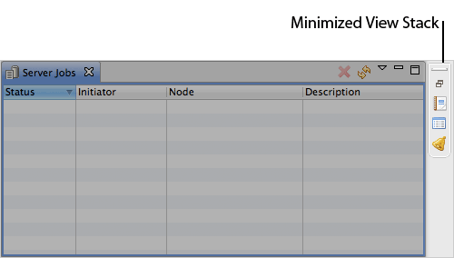

   Views minimized into Trim Stack

Perspectives
============

A perspective defines the initial set and layout of views in the Workbench
window. One or more perspectives can exist in a single Workbench window.
Perspectives can be opened in one of two ways:

#. In the same (existing) Workbench window.
#. In a new Workbench window.

Perspectives define visible action sets, which can be changed to customize a
perspective. A perspective that is built in this manner can be saved, creating
a custom perspective that can be opened again later.

New perspectives
----------------

There are several ways to open a new perspective within this Workbench window:

- Using the :guilabel:`Open Perspective` button |OP| on the shortcut bar.
- Choosing a perspective from the :menuselection:`Window --> Open Perspective`
  menu.

To open one by using the shortcut bar button:

#. Click on the :guilabel:`Open Perspective` button |OP|.
#. A menu appears showing the same choices as shown on the
   :menuselection:`Window --> Open Perspective` menu. Select perspective from
   the list or choose :guilabel:`Other` (in that case additional
   :guilabel:`Select Perspective` dialog will be opened).

Icons of recently used perspectives will be placed on shortcut bar for quick
selection.

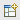

Saving perspectives
-------------------

The Workbench allows any current view layout to be saved for future use. To
save current layout as new perspective:

#. Choose :menuselection:`Window --> Save Perspective As` from main menu.
#. The :guilabel:`Save Perspective As` dialog allows for an existing
   perspective to be redefined or for a new perspective to be created. Select
   existing perspective to redefine or type name of new perspective, and click
   :guilabel:`OK`.
#. Answer :guilabel:`Yes` to the subsequent confirmation dialog. The new
   perspective layout will be used if the perspective is reset or if a new one
   is opened.

.. _object-browser:

Object Browser
==============

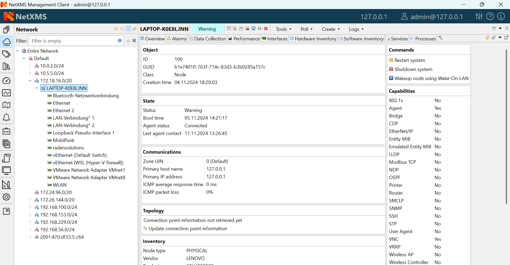

Object browser represents all objects in the system as a tree with multiple root
objects. Tree is built based on object hierarchy and user permissions. Only
objects available to currently logged in user will be shown. User has two
options to interact with objects:

* Click Left mouse button to select object and display its details
  (see :ref:`object-details`)
* Click Right mouse button to open context menu with actions available for
  this particular object type

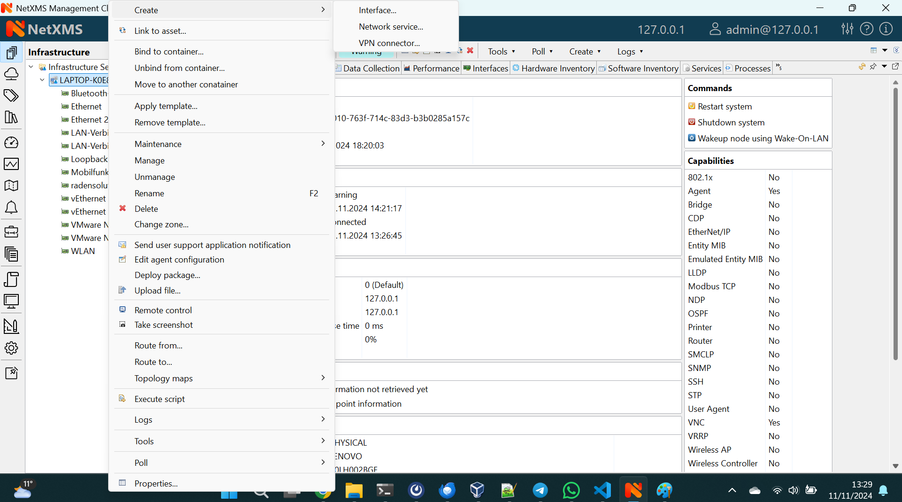

   Popup menu for object type :term:`Node`

Object Types
------------

============================== ================================================
|OTEN| Entire Network          Root of IP topology tree. All subnet objects
                               located under it. Built automatically by the
                               system and read-only to user.
|OTSU| Subnet                  Object representing IP subnet. Typically
                               objects of this class are created automatically
                               by the system to reflect system's knowledge
                               of IP topology.
|OTNO| Node                    Object representing physical host or network
                               device. These objects can be created either
                               manually by administrator or automatically
                               during network discovery process.	
|OTIS| Infrastructure Services Root of your infrastructure service tree as
                               defined by administrator.
|OTCO| Container               Grouping object which can contain
                               nodes, subnets, clusters, conditions, or other
                               containers. With help of container objects
                               administrator can build object's tree which
                               represents logical hierarchy of IT services
                               in organization.
|OTTR| Templates               Root of templates tree.
|OTTE| Template                Data collection template. See `Data Collection`
                               section in `Administrator Guide` for more
                               information.
|OTPO| Policies                Root of agent configuration policies tree.
                               See `Agent Configuration Policy` section in
                               `Administrator Guide` for more information.
|OTNR| Network Maps            Root of network maps tree.
|OTNE| Network Map             Network map (structural or Geo), as defined
                               by administrator.
|OTDR| Dashboards              Root of dashboards tree.
|OTDA| Dashboard               Dashboard, as defined by administrator.
                               See :ref:`dashboards` for more details
|OTRR| Reports                 Root of reports tree.
|OTRE| Report                  Single report, as defined by administrator.
                               See :ref:`reports` for more details.
|OTBR| Business Services       Root of business services tree.
|OTBS| Business Service        Single logical business service as defined by
                               administrator. Provides access to availability
                               data. See :ref:`business-services` for more
                               details.
============================== ================================================

.. |OTEN| image:: _images/icons/entire_network.png
.. |OTSU| image:: _images/icons/subnet.png
.. |OTNO| image:: _images/icons/node.png
.. |OTIS| image:: _images/icons/infrastructure_services.png
.. |OTCO| image:: _images/icons/container.png
.. |OTTR| image:: _images/icons/templates.png
.. |OTTE| image:: _images/icons/template.png
.. |OTPO| image:: _images/icons/policies.png

.. |OTNE| image:: _images/icons/network_map.png
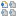
.. |OTDA| image:: _images/icons/dashboard.png
.. |OTRR| image:: _images/icons/reports.png
.. |OTRE| image:: _images/icons/report.png
.. |OTBR| image:: _images/icons/business_services.png
.. |OTBS| image:: _images/icons/business_service.png

Object status
-------------

System track status of each object, which can range from :guilabel:`Minor` to
:guilabel:`Critical` and show in two places:

- Status indicator on the left
- Icon overlay next to object name

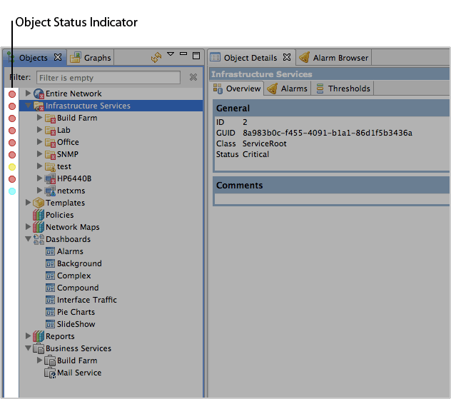

Object status is based on a number of conditions (unless it is changed by
administrator, highest priority selected):

- Network communication status (:term:`Node` objects only)
- Pending alarms
- Child objects status

Possible statuses, sorted by priority:

====== ===========
Icon   Status
====== ===========
|STUN| Unknown
|STWA| Warning
|STMI| Minor
|STMA| Major
|STCR| Critical
====== ===========

.. |STUN| image:: _images/icons/status/unknown.png
.. |STWA| image:: _images/icons/status/warning.png
.. |STMI| image:: _images/icons/status/minor.png
.. |STMA| image:: _images/icons/status/major.png
.. |STCR| image:: _images/icons/status/critical.png

Filtering
---------

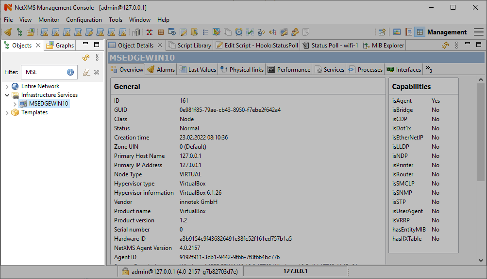

   As-you-type filter in action

.. _object-details:

Object Details
==============

This view provides one or more tabs with detailed information about object
currently selected in :ref:`object-browser`. List of available tabs depends on
type of the selected object.

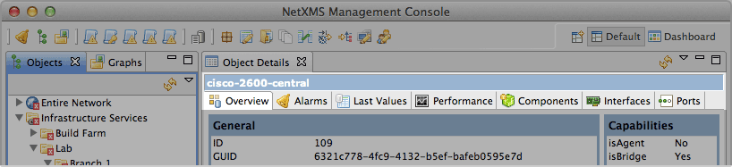

   Additional row of tabs (SNMP-capable router selected in
   :ref:`object-browser`)

Overview
--------

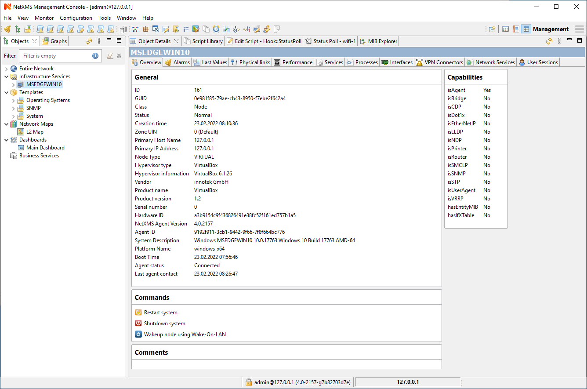

   Overview tab

This view provides basic information about selected object: Name, Class, Status
and comments. For :term:`Node` objects, it also show IP address, Host name,
SNMP details as well as Capabilities.

Node capabilities
~~~~~~~~~~~~~~~~~

+------------+-------------------------------------------------------------------------------+
| Capability | Description                                                                   |
+============+===============================================================================+
| isAgent    | True if NetXMS Server can communicate with NetXMS agent installed on the node |
+------------+-------------------------------------------------------------------------------+
| isRouter   | True if selected object can route network traffic                             |
+------------+-------------------------------------------------------------------------------+
| isSNMP     | True if selected object is SNMP-capable                                       |
+------------+-------------------------------------------------------------------------------+

Alarms
------

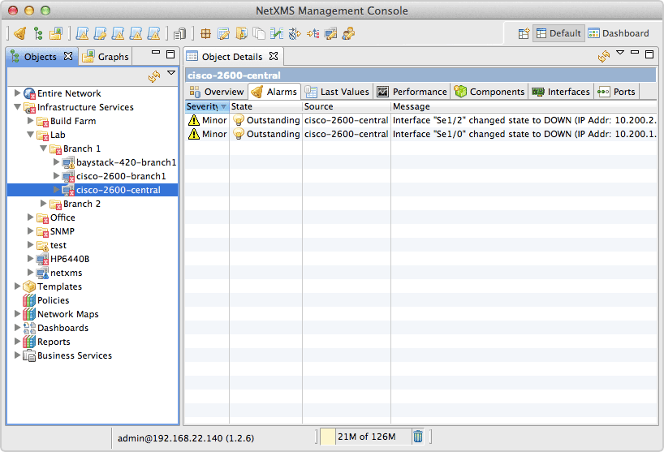

Alarm view provides user with list of alarms for currently selected element of
the tree, including all child objects. To view all alarms in the system, either
use system-wide :term:`Alarm Browser` (click :menuselection:`View --> Alarm
Browser` to open) or select :term:`Entire Network` object. Right-click on the
alarm will open pop-up menu with available actions

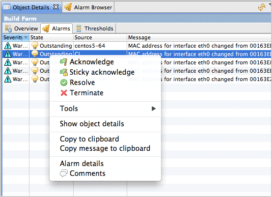

   Alarm context menu

Each alarm can be in one of three different states:

.. tabularcolumns:: |p{0.2 \textwidth}|p{0.7 \textwidth}|

+--------------+----------------------------------------------------+
| State        | Description                                        |
+==============+====================================================+
| Outstanding  | Newly created alarm, no actions was taken by user  |
+--------------+----------------------------------------------------+
| Acknowledged | User acknowledged raised issue, work in progress   |
+--------------+----------------------------------------------------+
| Resolved     | Issue resolved, but alarm is kept in the list.     |
|              | This state mostly used when alarm is automatically |
|              | resolved by the system, to keep users informed     |
|              | about incident                                     |
+--------------+----------------------------------------------------+
| Terminated   | Issue resolved and alarm removed from list.        |
+--------------+----------------------------------------------------+

Last Values
-----------

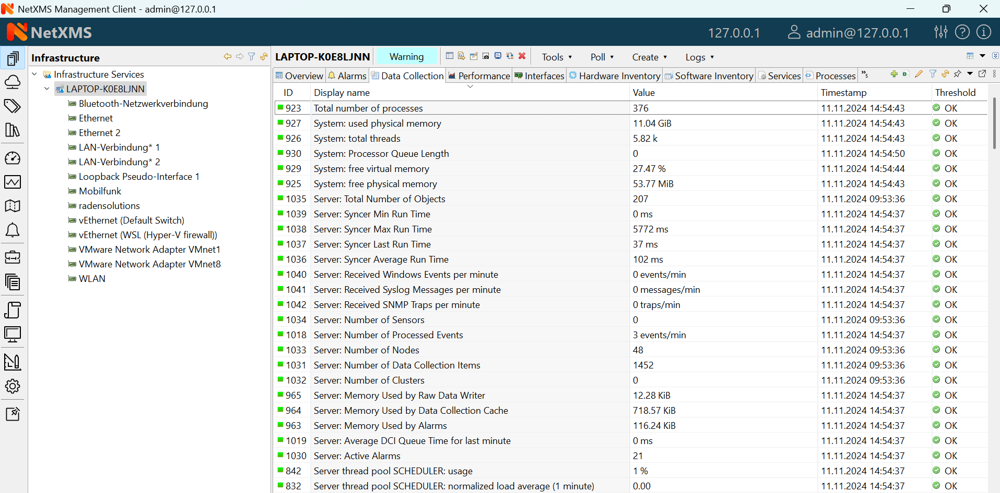

This view provides access to all collected data, both latest and historical.
When view is show, it displays latest values, as well as timestamp when each
record was collected. Threshold column indicates violations for current
:term:`DCI`.  User has two options to interact with data:

* Double click on the :term:`DCI` will open line graph view for last hour
* Right-click on the :term:`DCI` will open pop-up menu giving access to all
  available actions

  + :guilabel:`History` - show historical data
  + :guilabel:`Line Chart`, :guilabel:`Pie Chart`, :guilabel:`Bar Chart` - show
    historical data in graphical form
  + :guilabel:`Clear collected data` - remove all history for selected
    :term:`DCI`

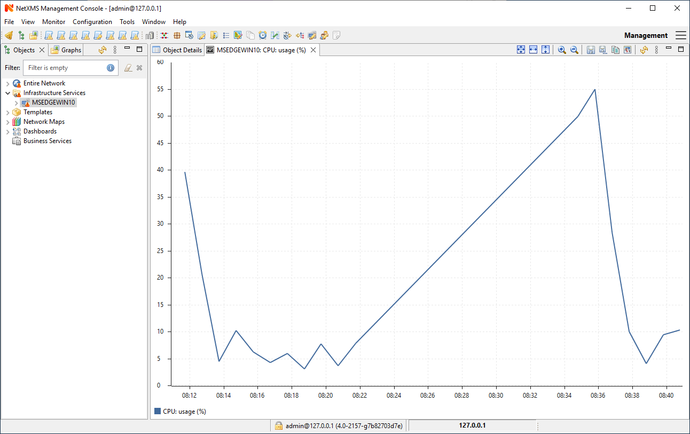

   Line graph build from collected data

Performance Tab
---------------

Performance tab is a special view that allows to quickly assess health of the
selected node using one or more graphs predefined by administrator. Each graph
can contain data from multiple sources.

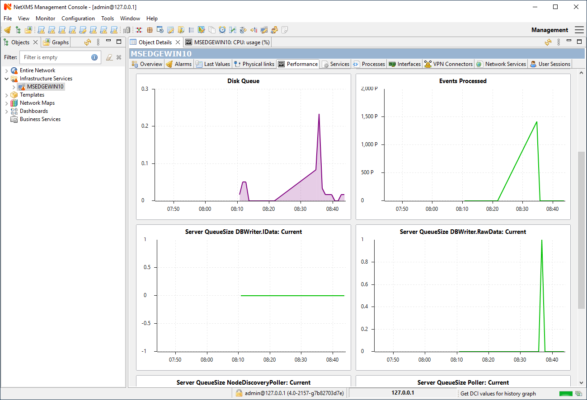

   Router's CPU usage displayed

Network Maps
============

This view allows user to see network overview in a map form. Map can be build
and routed either manually or automatically for selected part of the network.
Maps can be automatically generated based on:

* IP topology, both Level 2 and Level 3
* Geographical location of the objects
* Object relations

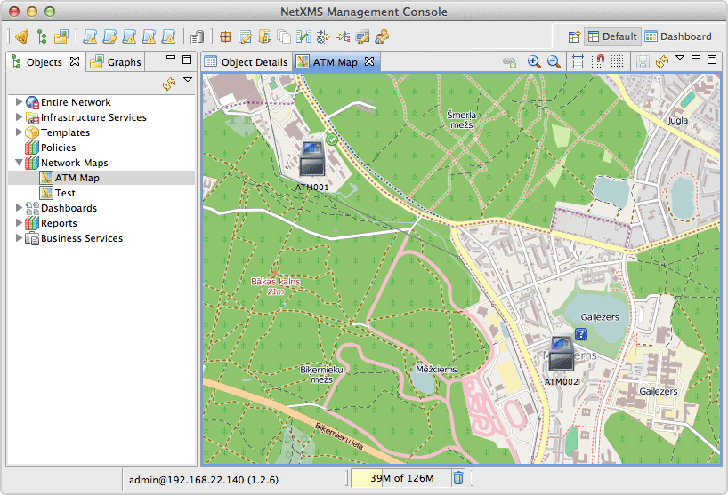

   Geo map showing part of the ATM network

To open existing map, either double click on the name in :ref:`object-browser`
or right-click and select :guilabel:`Open map` in pop-up menu.

.. _reports:

Reports
=======

NetXMS is integrated with `Jasper` reporting engine from `Jaspersoft
<http://community.jaspersoft.com/>`_. This view allows user to generate report
and download result as PDF file. Report generation can take long time, so it's
done in background, without user interaction. When report is generated,
resulting PDF can be downloaded any time, as well as any result from previous
runs.

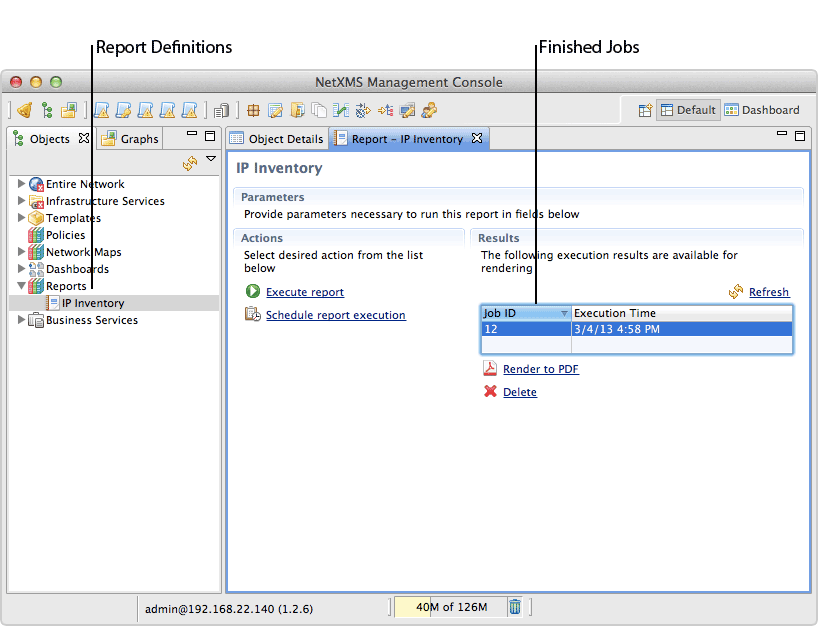

To generate report:

* Right-click on report name in :ref:`object-browser` and select
  :guilabel:`Open report` in pop-up menu, report view will open (as show in
  figure above)
* In report view, fill parameters and click :guilabel:`Generate Report`

You can monitor progress in :guilabel:`Server Jobs` view. To open it, select
:menuselection:`Window --> Show view --> Other --> Server Jobs`.

When report is generated, new finished job will appear in :guilabel:`Results`
table of the view. Select it and click on :guilabel:`Render to PDF` to
download.

When generated report data is not longer needed, it can be deleted from the
sever by selecting job in :guilabel:`Results` view, and then clicking
:guilabel:`Delete`.

.. _dashboards:

Dashboards
==========

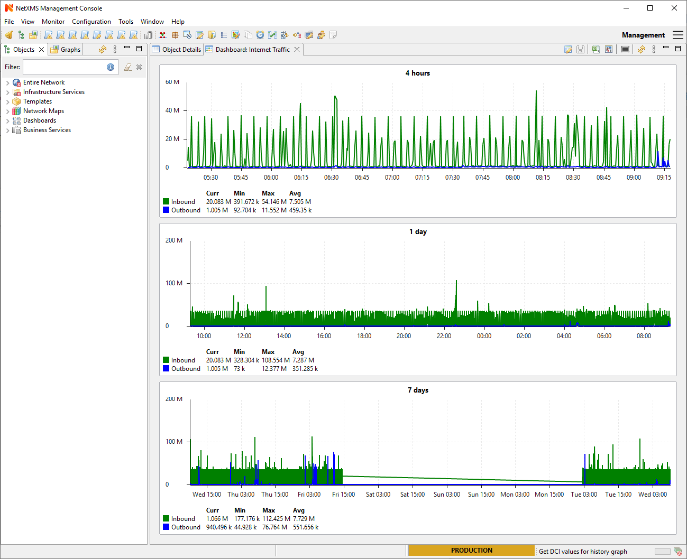

   Dashboard showing traffic information from core router, as well as CPU usage
   from vital nodes

Dashboards are defined by administrator and allow to combine any available
visualization components with data from multiple sources in order to create
high-level views to see network (or parts of it) health at a glance. There are
two ways to access dashboards:

* Open dashboard from :ref:`object-browser`
* Switch to :guilabel:`Dashboard` perspective and select dashboard with
  left-click

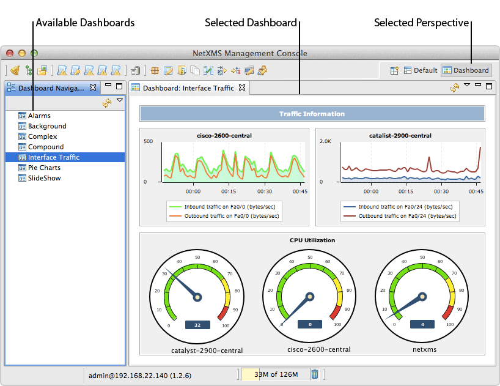

   Dashboards perspective

.. _business-services:

Business Services
=================

.. figure:: _images/availability.png

   Availability chart and uptime percentage for root Business Service

Business Services is a hierarchy of logical services as defined by
administrator. Each service can represent combined state of multiple elements.
For each service in the hierarchy, NetXMS calculates availability percentage
and keeps track of all downtime cases. To check availability of any particular
level, select it in :ref:`object-browser`.

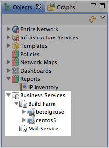

   Service dependency tree down to specific nodes
