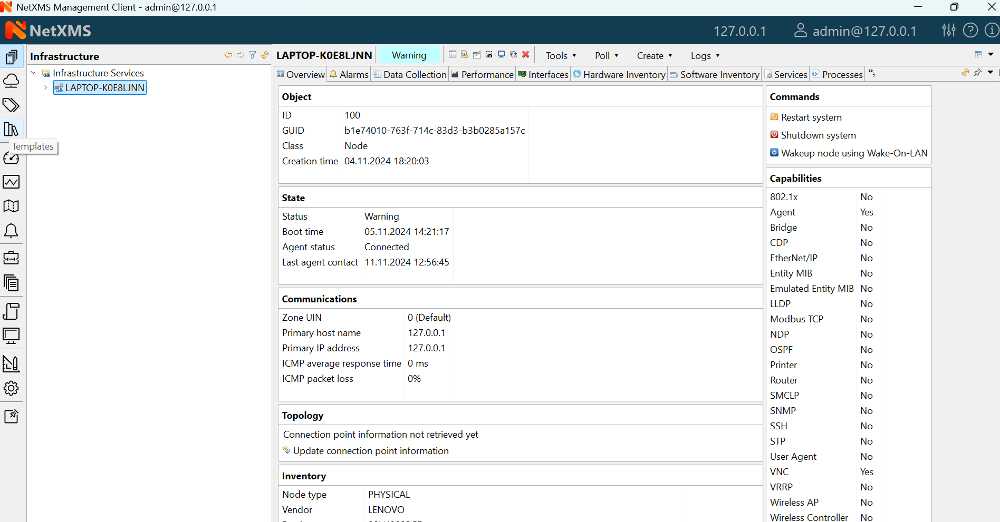
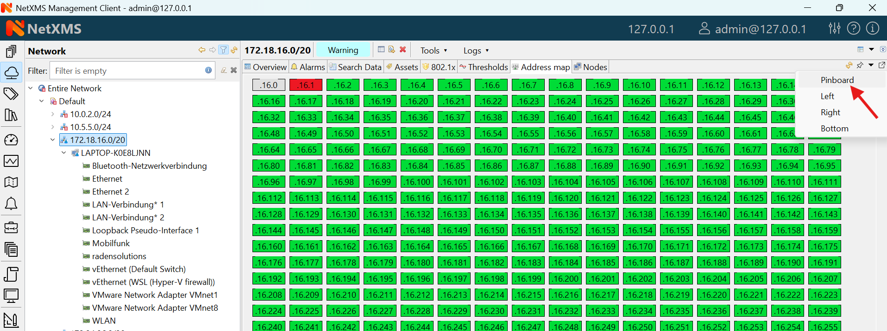

*********************************
User Interface
*********************************

.. note::
   
  One of the goals of |product_name| Management Client is to provide identical user
  experience across all supported platforms, including Web Interface.
  Screenshots in this particular guide are based on Windows version.

Login
=====

.. figure:: _images/login.png

   Login Dialog

When Management Client is started, user is presented with login dialog. User
should enter server host name or IP address, login and password. 

Perspectives
============

On the left hand side of Management Client there are perspective selection
buttons. Each perspective serves its logical purpose, e.g. showing monitored
objects, editing data collection templates, etc. 

A perspective contains one or multiple :term:`views<view>`. If there are
multiple views, they are organized as :term:`View Stack` with tab navigation. 

Some perspectives have a button in upper right corner which opens a view
with additional object information. 

Some views may have a toolbar above it on the right hand side - icons on the
toolbar provide access to frequently needed actions. If available, a view's menu
is displayed under vertical ellipsis icon on the toolbar. 

Available perspectives are:

- Infrastructure (allows organizing objects in logical way, based on location,
  type of node etc)
- Network (organizes objects by zone and network subnet)
- Assets (hierarchical structure of available hardware assets)
- Templates (special objects with data collection and policy configuration)
- Dashboards (combines any available visualization components with data from
  multiple sources in order to create high-level views to see network (or parts
  of it) health at a glance.)
- Graphs (saved graphs with can display collected data from multiple objects)  
- Maps (layer 2 topology, IP Topology or Custom maps)
- Alarms (alarm view for all objects)
- Business Services (tool for availability monitoring of logical services.
  Company email, web site, server farm, call center - all are examples of
  logical services.)
- Reporting (handles execution and rendering of reports by communication to
  separate reporting process)
- Logs (collective view of different logs)
- Monitor (event, trap and log collective display in real time)
- Tools (selection of powerful search and NetXMS server management tools)
- Configuration (provides access to configuration of the system)

- Pinboard (allows quick access to favorite views, for adding a view to pinboard
  see example below)

.. _object-browser:

Object Browser
==============

Some perspectives, e.g. Infrastructure, Network, Templates, etc... use object
browser. Object browser represents objects as a tree. Tree is built based on
object hierarchy and user permissions. Only objects available to currently
logged in user will be shown. User has two options to interact with objects:

* Click Left mouse button to select object. Views on the right hand side provide
  information about currently selected object (see :ref:`object-details`).
 
.. figure:: _images/object_browser.png

* Click Right mouse button to open context menu with actions available for
  this particular object type

.. figure:: _images/object_browser_popup.png

Object status
-------------

System track status of each object, which can range from :guilabel:`Minor` to
:guilabel:`Critical`. Status is displayed as overlay on icon of each object. 

Filtering
---------

Above object tree there is filter field that allows to filter objects in the object tree. 
Filter supports a number of prefix characters that define how search is performed:

====== =================================
Prefix Status
====== =================================
>      Search by IP address part
^      Search by exact IP address
#      Search by object ID
/      Search by comment
@      Search by zone ID
====== =================================

Without prefix search is performed by object name.

.. figure:: _images/object_browser_filter.png

   As-you-type filter in action

.. _object-details:

Object details
==============

This view provides one or more tabs with detailed information about object
currently selected in :ref:`object-browser`. List of available tabs depends on
type of the selected object.

Overview
---------

.. figure:: _images/object_details_overview.png

   Overview tab

This view provides basic information about selected object: Name, Class, Status
and comments. For :term:`Node` objects, it also show IP address, Host name,
SNMP details as well as Capabilities.

Node capabilities
~~~~~~~~~~~~~~~~~

Node capabilities displays results of capability auto-detection (it's performed on Configuration Poll). E.g.:

+------------+-----------------------------------------------------------------------------------------------+
| Capability | Description                                                                                   |
+============+===============================================================================================+
| Agent      | True if |product_name| Server can communicate with |product_name| agent installed on the node |
+------------+-----------------------------------------------------------------------------------------------+
| Router     | True if selected object can route network traffic                                             |
+------------+-----------------------------------------------------------------------------------------------+
| SNMP       | True if |product_name| Server can communicate with this device via SNMP protocol              |
+------------+-----------------------------------------------------------------------------------------------+
| SSH        | True if |product_name| Server has credentials and is able to connect to this device via ssh   |
+------------+-----------------------------------------------------------------------------------------------+

Alarms
------

.. figure:: _images/object_details_alarms.png

Alarm view provides user with list of alarms for currently selected element of
the tree, including all child objects. To view all alarms in the system, either
use system-wide :term:`Alarm Browser` (click :menuselection:`View --> Alarm
Browser` to open) or select :term:`Entire Network` object. Right-click on the
alarm will open pop-up menu with available actions

.. figure:: _images/object_details_alarms_popup.png

   Alarm context menu

Each alarm can be in one of the following states:

.. tabularcolumns:: |p{0.2 \textwidth}|p{0.7 \textwidth}|

+--------------+----------------------------------------------------+
| State        | Description                                        |
+==============+====================================================+
| Outstanding  | Newly created alarm, no actions was taken by user  |
+--------------+----------------------------------------------------+
| Acknowledged | User acknowledged raised issue, work in progress   |
+--------------+----------------------------------------------------+
| Resolved     | Issue resolved, but alarm is kept in the list.     |
|              | This state mostly used when alarm is automatically |
|              | resolved by the system, to keep users informed     |
|              | about incident                                     |
+--------------+----------------------------------------------------+
| Terminated   | Issue resolved and alarm removed from list.        |
+--------------+----------------------------------------------------+

Data collection
---------------

.. figure:: _images/object_details_lastvalues.png

This view provides access to all collected data, both latest and historical.
When view is shown, it displays latest values, as well as timestamp when each
value was collected. Threshold column indicates threshold violations for given
:term:`DCI`.  User has two options to interact with data:

* Double click on a :term:`DCI` will open line graph view for last hour
* Right-click on a :term:`DCI` will open pop-up menu giving access to
  available actions

  + :guilabel:`History` - show historical data
  + :guilabel:`Line Chart`, :guilabel:`Pie Chart`, :guilabel:`Bar Chart` - show
    historical data in graphical form
  + :guilabel:`Clear collected data` - remove all history for selected
    :term:`DCI`

Clicking `Edit mode` button on the toolbar changes Data collection view into
editing mode. In this mode information about DCI configuration is displayed,
double click on a :term:`DCI` will open it for editing. 

.. figure:: _images/object_details_lastvalues_graph.png

   Line graph built from collected data

Performance Tab
---------------

Performance tab is a special view that allows to quickly assess health of the
selected node using one or more graphs predefined by administrator. Each graph
can contain data from multiple :term:`DCIs<DCI>` on a node
.

.. figure:: _images/object_details_performancetab.png

   Router's CPU usage displayed

Network Maps
============

This view allows user to see network overview in a map form. Map can be build
and routed either manually or automatically for selected part of the network.
Maps can be automatically generated based on:

* Layer 2 network topology
* IP (layer 3) topology
* OSPF topology
* Internal communication topology

.. figure:: _images/networkmap_geomap.png

   Automatically built network map based on OSPF topology

To open existing map, left-click on the name in :ref:`object-browser`.

.. _reports:

Reports
=======

|product_name| is integrated with `Jasper` reporting engine from `Jaspersoft
<http://community.jaspersoft.com/>`_. This view allows user to generate report
and download result as PDF file. Report generation can take long time, so it's
done in background, without user interaction. When report is generated,
resulting PDF can be downloaded any time, as well as any result from previous
runs.

.. figure:: _images/reports.png

To generate report:

* Left-click on report name in :ref:`object-browser`, report view will open (as
  show in figure above)
* In report view, fill parameters and click :guilabel:`Generate Report`

You can monitor progress in :guilabel:`Server Jobs` view. To open it, select
:menuselection:`Window --> Show view --> Other --> Server Jobs`.

When report is generated, new finished job will appear in :guilabel:`Results`
table of the view. Select it and click on :guilabel:`Render to PDF` to
download.

When generated report data is not longer needed, it can be deleted from the
sever by selecting job in :guilabel:`Results` view, and then clicking
:guilabel:`Delete`.

.. _dashboards:

Dashboards
==========

.. figure:: _images/dashboard.png

   Dashboard showing system and agent DCI readings.

Dashboards are defined by administrator and allow to combine any available
visualization components with data from multiple sources in order to create
high-level views to see network (or parts of it) health at a glance. 

To open a dashboard, switch to :guilabel:`Dashboard` perspective and select
dashboard with left-click.

.. figure:: _images/dashboard_perspective.png

   Dashboards perspective

.. _business-services:

Business Services
=================

.. figure:: _images/availability.png

   Availability chart and uptime percentage for a system. 

Business Services is a hierarchy of logical services as defined by
administrator. Each service can represent combined state of multiple elements.
For each service in the hierarchy, |product_name| calculates availability percentage
and keeps track of all downtime cases. To check availability of any particular
level, select it in :ref:`object-browser`.

