.. _mobile-console:

##############
Mobile Console
##############

.. Used version on wiki:  14:17, 7 September 2014‎ Marco Incalcaterra

|product_name| mobile console is a monitoring tool for Android devices running version 2.2.
and later.

Currently, only a small subset of the functions present in the Desktop/Web edition
are implemented, mainly read/only operations. The next paragraphs briefly describes
each section.

Main window
===========

Here you can see how appears the main window and the underneath levels.

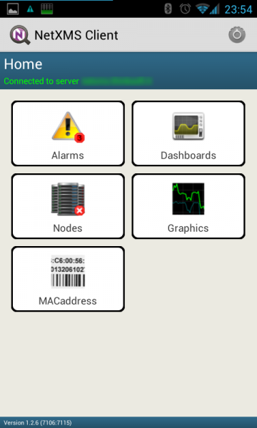

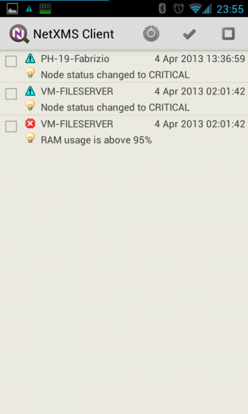

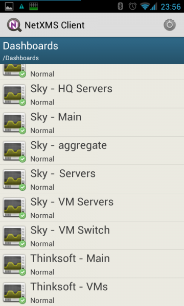

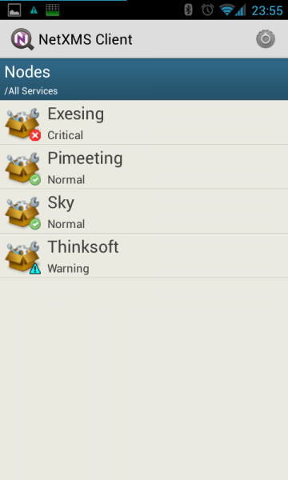

.. figure:: _images/360px-MobCons-graphs.png

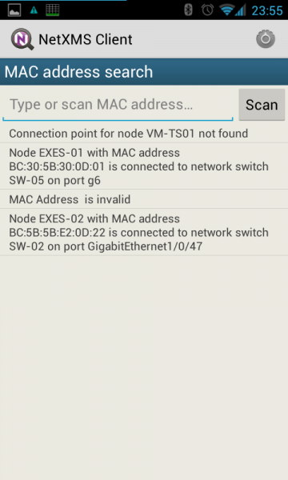

From the main window it is possible to get access to the following menu items:

  * :guilabel:`Settings`: select this item to configure the console.
  * :guilabel:`Reconnect`: select this item to force a reconnection to the server to gather new
    collected data.
  * :guilabel:`Disconnect & Exit`: select this item to stop the console and exit from the app.

Underneath levels have menu that are context dependent, a detailed description can be
found in each section.

Alarms
======

Alarms section is used to list and manage all pending alarms, eventually filtered on a
particular node/container. Through this view it is possible to manage alarms:

  * :guilabel:`Actions`:
      * :guilabel:`Acknowledge`: acknowledge the alarm.
      * :guilabel:`Sticky acknowledge`: sticky acknowledge the alarm.
      * :guilabel:`Resolve`: resolve the alarm.
      * :guilabel:`Terminate`: terminate the alarm.
      * :guilabel:`View last values`: jump to the node info section to view the last values for the node that generated the alarm.
  * :guilabel:`Sort`:
      * :guilabel:`Sort by severity ascending`: sort list using event severity as criteria, ascending.
      * :guilabel:`Sort by severity descending`: sort list using event severity as criteria, descending.
      * :guilabel:`Sort by date ascending`: sort list using date of event as criteria, ascending.
      * :guilabel:`Sort by date descending`: sort list using date of event as criteria, descending.
      * :guilabel:`Sort by node name ascending`: sort list using node name that generated the event as criteria, ascending.
      * :guilabel:`Sort by node name descending`: sort list using node name that generated the event as criteria, descending.
  * :guilabel:`Select all`: select all the alarms from the list
  * :guilabel:`Unselect all`: clear any selection of alarms from the list

Dashboard
=========

Dashboards are defined by administrator and allow to combine any available
visualization components with data from multiple sources in order to create
high-level views to see network (or parts of it) health at a glance. Not all
elements are currently available for the mobile console, dashboards are properly
refreshed according to their schedule. Due to dashboard size, keep in mind that
Smartphones cannot be the best device to show them, a tablet is much more suitable
device. Here an example:

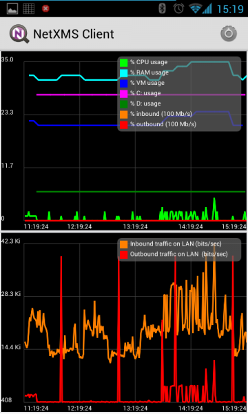

Nodes
=====

This section is used to list and manage all nodes (all network infrastructure monitored
by |product_name| are represented as a set of objects. Each object represents one physical or
logical entity, or group of them). Objects can be organized into hierarchical
structure, the Nodes section is used to explore them. In the right bottom corner
of the icon there is a symbol that indicates the status of the node/container
following the same simbology used on the desktop console. Clicking on a container
will show the items inside, continuing to click up to an object will show a set of
swipeable pages:

  * :guilabel:`Overview`: here are presented the main info associated to this node, such as the name, the primary IP, the status, etc.
  * :guilabel:`Alarms`: here are presented the list of pending alarms (if any) for this node, with the possibility to manage them with the following commands:
      * :guilabel:`Actions`:
          * :guilabel:`Acknowledge`: acknowledge the alarm.
          * :guilabel:`Sticky acknowledge`: sticky acknowledge the alarm.
          * :guilabel:`Resolve:` resolve the alarm.
          * :guilabel:`Terminate`: terminate the alarm.
          * :guilabel:`View last values`: jump to the node info section to view the last values
            for the node that generated the alarm.
      * :guilabel:`Select all`: select all the alarms from the list
      * :guilabel:`Unselect all`: clear any selection of alarms from the list
  * :guilabel:`Last values`: here are presented the DCI collected for this node, as well as the possibility to draw the following graphics (for one or more values):
      * :guilabel:`Last half hour`: draw one or more line graphs for the last half hour collected values
      * :guilabel:`Last hour`: draw one or more line graphs for the last hour collected values
      * :guilabel:`Last two hours`: draw one or more line graphs for the last two hours collected values
      * :guilabel:`Last four hours`: draw one or more line graphs for the last four hours collected values
      * :guilabel:`Last day`: draw one or more line graphs for the last day collected values
      * :guilabel:`Last week`: draw one or more line graphs for the last week collected values
      * :guilabel:`Bar chart`: draw a bar chart with the last collected value
      * :guilabel:`Pie chart`: draw a pie chart with the last collected value
  * :guilabel:`Interfaces`: here are presented all the interfaces associated to this node. For each interface it is possible to instruct the following commands:
      * :guilabel:`Manage`: interface will be put in manage state
      * :guilabel:`Unanage`: interface will be put in unmanage state
      * :guilabel:`Change expected state`: change the expected interface state, possible values:
          * :guilabel:`UP`: interface expected state will be put in UP state
          * :guilabel:`DOWN`: interface expected state will be put in DOWN state
          * :guilabel:`IGNORE`: interface expected state will be put in IGNORE state
  * :guilabel:`Find switch port`: will start the search for a connection point (if available)

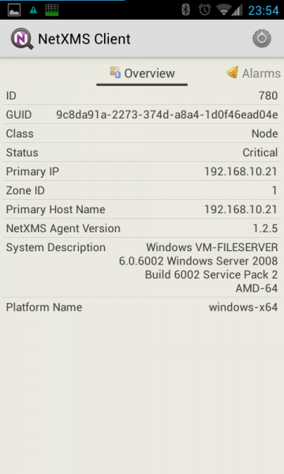

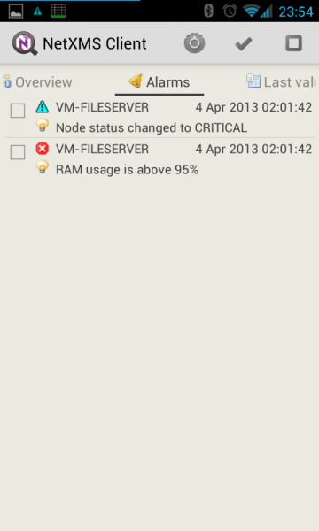

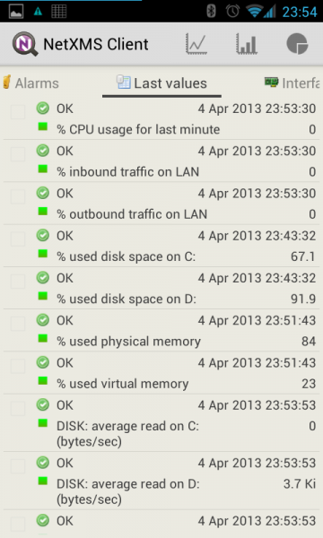

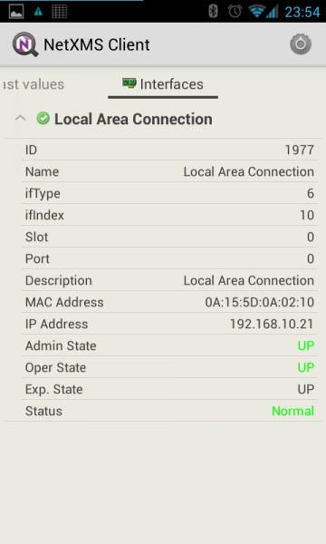

Graphics
========

Predefined graphics are defined by administrator and can be used to view collected
data in a graphical form (as a line chart). Currently, the mobile console doesn’t
autorefresh the content of the graphic selected. Here an example of a predefined
graphs:

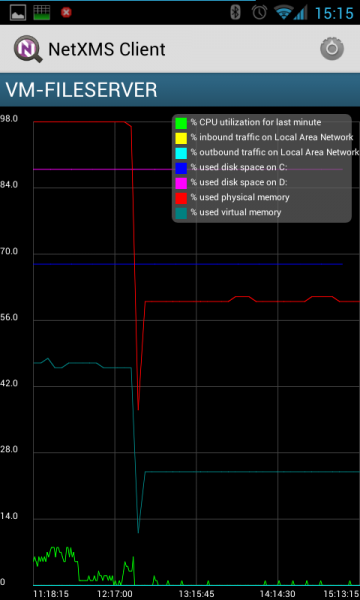

MACaddress
==========

This section is used to list previously searched MAC addresses or to start a new
search by scanning a barcode value (this feature needs the installation of Barcode
Scanner from Zxing Team – freely available on the Google Play), by input it manually
or by getting it directly from a node via the “Find Switch port” command.

Settings
========

This section is used to configure the behaviour of the console.

Global settings
===============

  * :guilabel:`Autostart on boot`: check to automatically start the agent on boot (to be effective, app must not be moved to SD card).

Connection
==========

Parameters
----------

Allows selecting the parameters used to connect to the server:

  * :guilabel:`Server`: address of the server (IP or name).
  * :guilabel:`Port`: port of the server (default 4701).
  * :guilabel:`User name`: username to connect to the server.
  * :guilabel:`Password`: password to connect to the server.
  * :guilabel:`Encrypt connection`: when selected challenges an encryption strategy with the server (depending on supported/configured providers).

Scheduler
---------

Enables the possibility to define periodic connections to the server. If the scheduler
is not enabled the app will try to connect to the server every time it detects a new
connection (data or WiFi) and remains always connected as far as the connection
remains active:

  * :guilabel:`Enable scheduler`: check this to enable the scheduler.
  * :guilabel:`Frequency (min)`: amount of time, in minutes, that has to elapse between each tentative of connection to the server to send the gathered info.
  * :guilabel:`Duration (min)`: amount of time, in minutes, that has to elapse before disconnect from the server.
  * :guilabel:`Daily scheduler`: provides the ability to define a “one range” daily on which the agent is operational. Out of the specified range the app will not try to connect to the server to gather the new events:
      * :guilabel:`Daily activation on`: start time for daily activation.
      * :guilabel:`Daily activation off`: stop time for daily activation.

Notifications
=============

Connection status
-----------------

This section is to manage the notifications related to the connection status.

  * :guilabel:`Notification behaviour`: defines which kind of action should trigger notifications to the user. Possible options:
      * Never: ignore connection status
      * When connected: notify when connection is successful
      * When disconnected: notify when connection is unsuccessful
      * Always: notify either connection successful and connection unsuccessful
  * :guilabel:`Toast notification`: provides connection notification via “toast” , behaviour is defined by “Notification behaviour”. 
  * :guilabel:`Icon notification`: provides connection notification via icon in the status bar, behaviour is defined by “Notification behaviour”.

Alarms
------

  * :guilabel:`Alarms notification`: select to enable alarms notification in the status bar.
  * :guilabel:`Alarms sound by severity`: for each of the following categories:
      * :guilabel:`Normal`
      * :guilabel:`Warning`
      * :guilabel:`Minor`
      * :guilabel:`Major`
      * :guilabel:`Critical`

.. note:
  It is possible to select a specific sound, in this way the user can recognize the type of the incoming alarm without the necessity to check the display.

Interface
=========

Multipliers
-----------

Allows to select the preferred multipliers to be used to show values. Allowed options:
* :guilabel:`None`: do not apply multiplier, values are extended.
* :guilabel:`Decimal`: applies a decimal multiplier (power of 10, e.g. 1000 -> 1K, 1000000 -> 1M, ...)
* :guilabel:`Binary`: applies a binary multiplier (power of 2, e.g. 1024 -> 1Ki, 1048576 -> 1Mi, ...)

Graph text size
---------------

Allows to set the text size to be used for axis labels (if the default value is too
small for high density devices).

Show legend in graphs
---------------------

Allows to select to show or not the legend in the top right angle of the graphs. Since
legend can be intrusive, especially when there are several lines plotted, user can
select to disable the legend.
